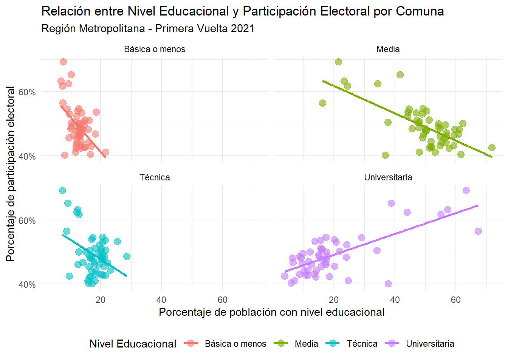

``` r
if(!require(readxl)){install.packages("readxl")}; library(readxl) # Para leer archivos Excel
```

```
## Loading required package: readxl
```

``` r
if(!require(dplyr)){install.packages("dplyr")}; library(dplyr) # Manipulación
```

```
## Loading required package: dplyr
```

```
## 
## Attaching package: 'dplyr'
```

```
## The following objects are masked from 'package:stats':
## 
##     filter, lag
```

```
## The following objects are masked from 'package:base':
## 
##     intersect, setdiff, setequal, union
```

``` r
if(!require(chilemapas)){install.packages("chilemapas")}; library(chilemapas) # Mapa de Chile
```

```
## Loading required package: chilemapas
```

```
## Loading required package: sf
```

```
## Linking to GEOS 3.11.2, GDAL 3.8.2, PROJ 9.3.1; sf_use_s2() is TRUE
```

```
## La documentacion del paquete y ejemplos de uso se encuentran en https://pacha.dev/chilemapas/.
## Visita https://buymeacoffee.com/pacha/ si deseas donar para contribuir al desarrollo de este software.
```

``` r
if(!require(ggplot2)){install.packages("ggplot2")}; library(ggplot2) # Visualización
```

```
## Loading required package: ggplot2
```

``` r
if(!require(stringr)){install.packages("stringr")}; library(stringr) # Manipulación
```

```
## Loading required package: stringr
```

``` r
if(!require(stringi)){install.packages("stringi")}; library(stringi) # Manipulación
```

```
## Loading required package: stringi
```

``` r
if(!require(tools)){install.packages("tools")}; library(tools) # Manipulación
```

```
## Loading required package: tools
```

``` r
if(!require(gridExtra)){install.packages("gridExtra")}; library(gridExtra) # Visualización
```

```
## Loading required package: gridExtra
```

```
## 
## Attaching package: 'gridExtra'
```

```
## The following object is masked from 'package:dplyr':
## 
##     combine
```

``` r
if(!require(cowplot)){install.packages("cowplot")}; library(cowplot) # Visualización
```

```
## Loading required package: cowplot
```

``` r
if(!require(rio)){install.packages("rio")}; library(rio) # Importar archivos desde GITHUB
```

```
## Loading required package: rio
```

``` r
if(!require(tidyr)){install.packages("tidyr")}; library(tidyr) # Manipulación
```

```
## Loading required package: tidyr
```

``` r
if(!require(plotly)){install.packages("plotly")}; library(plotly) # Visualización
```

```
## Loading required package: plotly
```

```
## 
## Attaching package: 'plotly'
```

```
## The following object is masked from 'package:rio':
## 
##     export
```

```
## The following object is masked from 'package:ggplot2':
## 
##     last_plot
```

```
## The following object is masked from 'package:stats':
## 
##     filter
```

```
## The following object is masked from 'package:graphics':
## 
##     layout
```

# Pull a GITHUB


``` r
dir.create("data", showWarnings = FALSE) #DATA
dir.create("output", showWarnings = FALSE) # RESULTADOS
dir.create("R", showWarnings = FALSE) # SCRIPT
dir.create("docs", showWarnings = FALSE) # Documentos

readme_content <- "# Análisis CASEN/SERVEL 2021
Análisis de la relación entre participación electoral y condiciones socioeconómicas en Chile.
por motivos de tamaño KB solo fue posible analizar servel y casen 2021.


## Estructura del Proyecto
- `data/`: Datos brutos de CASEN y SERVEL
- `output/`: Resultados y visualizaciones
- `R/`: Scripts de análisis
- `docs/`: Documentación adicional

## Equipo
- Ariel Álvarez
- Marcos González
- Arturo Zamorano"

writeLines(readme_content, "README.md")

# Crear los scripts principales de análisis
script_names <- c(
  "01_load_data.R",     # Para cargar los datos iniciales
  "02_clean_data.R",    # Para limpiar y preparar los datos
  "03_analysis.R",      # Para realizar los análisis principales
  "04_visualizations.R" # Para crear gráficos y visualizaciones
)

for(script in script_names) {
  file.path("R", script) %>% 
    file.create()
}

# Crear el contenido del script principal que configura el proyecto
load_data_content <- '# Configuración inicial del proyecto
if (!require("renv")) install.packages("renv")
renv::init()

# Instalar y cargar paquetes necesarios
packages <- c(
  "tidyverse",  # Para manipulación de datos
  "readxl",     # Para leer archivos Excel
  "sf",         # Para datos geográficos
  "here",       # Para manejo de rutas
  "DiagrammeR", # Para diagramas ER
  "usethis"     # Para configuración de Git
)

# Instalar paquetes faltantes

new_packages <- packages[!(packages %in% installed.packages()[,"Package"])]
if(length(new_packages)) install.packages(new_packages)

# Cargar paquetes

lapply(packages, library, character.only = TRUE)

# Configurar Git
usethis::use_git()
'

writeLines(load_data_content, file.path("R", "01_load_data.R"))


gitignore_content <- ".Rproj.user
.Rhistory
.RData
.Ruserdata
*.Rproj"

writeLines(gitignore_content, ".gitignore")
```


# Carga y procesamiento de datos electorales 

#################################################
############### Presidencial 2021 ###############
#################################################

# Carga datos de participación Presidencial 2021 primera vuelta


``` r
metropolitana_2021_1 <- import("https://github.com/Arielo2518/Taller_2_final/raw/main/data/Servel/metropolitana_2021_primeravuelta.xlsx")
datos_comunas1_2021 <- metropolitana_2021_1 %>% # Selección de variables de interés
  select(Distrito, Comuna, Local, Mesa, Inscritos, Votación) %>%
  group_by(Distrito, Comuna) 
```

# Datos agrupados por comuna y porcentaje de participación


``` r
datos_comunas1_2021_agrupado <- metropolitana_2021_1 %>% # Aquí generamos una variable nueva de % de participación
  select(Distrito, Comuna, Local, Mesa, Inscritos, Votación) %>%
  group_by(Distrito, Comuna) %>%
  summarize(
    Total_Inscritos = sum(as.numeric(Inscritos), na.rm = TRUE),
    Total_Votacion = sum(as.numeric(Votación), na.rm = TRUE)
  ) %>%
  mutate(Participacion_Porcentaje = round((Total_Votacion / Total_Inscritos) * 100, 1))
```

```
## `summarise()` has grouped output by 'Distrito'. You can override using the
## `.groups` argument.
```
# Datos Limpios


``` r
eleccion_2021_primeravuelta <- datos_comunas1_2021_agrupado %>%
  rename(comuna = Comuna) %>%
  mutate(comuna = str_to_lower(comuna))

eleccion_2021_primeravuelta
```

```
## # A tibble: 52 × 5
## # Groups:   Distrito [7]
##    Distrito    comuna      Total_Inscritos Total_Votacion Participacion_Porcen…¹
##    <chr>       <chr>                 <dbl>          <dbl>                  <dbl>
##  1 Distrito 10 la granja            102187          45371                   44.4
##  2 Distrito 10 macul                100045          54600                   54.6
##  3 Distrito 10 providencia          170892          96543                   56.5
##  4 Distrito 10 san joaquin           80763          39445                   48.8
##  5 Distrito 10 santiago             339067         136398                   40.2
##  6 Distrito 10 ñuñoa                198985         123031                   61.8
##  7 Distrito 11 la reina              90939          56792                   62.5
##  8 Distrito 11 las condes           271386         171671                   63.3
##  9 Distrito 11 lo barnech…           84259          55042                   65.3
## 10 Distrito 11 peñalolen            190640          95956                   50.3
## # ℹ 42 more rows
## # ℹ abbreviated name: ¹​Participacion_Porcentaje
```

############################ SEGUNDA VUELTA ##################################
# Carga datos de participación Presidencial 2021 segunda vuelta


``` r
metropolitana_2021_2 <- import("https://github.com/Arielo2518/Taller_2_final/raw/main/data/Servel/metropolitana_2021_segundavuelta.xlsx")
datos_comunas2_2021 <- metropolitana_2021_2 %>%  # Selección de variables de interés
  select(Distrito, Comuna, Local, Mesa, Inscritos, Votación) %>%
  group_by(Distrito, Comuna) 
```

# Datos agrupados por comuna y porcentaje de participación


``` r
datos_comunas2_2021_agrupado <- metropolitana_2021_2 %>% # Aquí generamos una variable nueva de % de participación
  select(Distrito, Comuna, Local, Mesa, Inscritos, Votación) %>%
  group_by(Distrito, Comuna) %>%
  summarize(
    Total_Inscritos = sum(as.numeric(Inscritos), na.rm = TRUE),
    Total_Votacion = sum(as.numeric(Votación), na.rm = TRUE)
  ) %>%
   mutate(Participacion_Porcentaje = round((Total_Votacion / Total_Inscritos) * 100, 1))
```

```
## `summarise()` has grouped output by 'Distrito'. You can override using the
## `.groups` argument.
```
#  Datos limpios


``` r
eleccion_2021_segundavuelta <- datos_comunas2_2021_agrupado %>%
  rename(comuna = Comuna) %>%
  mutate(comuna = str_to_lower(comuna))
eleccion_2021_segundavuelta
```

```
## # A tibble: 52 × 5
## # Groups:   Distrito [7]
##    Distrito    comuna      Total_Inscritos Total_Votacion Participacion_Porcen…¹
##    <chr>       <chr>                 <dbl>          <dbl>                  <dbl>
##  1 Distrito 10 la granja            102187          55913                   54.7
##  2 Distrito 10 macul                100045          64016                   64  
##  3 Distrito 10 providencia          170892         104693                   61.3
##  4 Distrito 10 san joaquin           80763          48040                   59.5
##  5 Distrito 10 santiago             339067         158676                   46.8
##  6 Distrito 10 ñuñoa                198985         139003                   69.9
##  7 Distrito 11 la reina              90939          63597                   69.9
##  8 Distrito 11 las condes           271386         184227                   67.9
##  9 Distrito 11 lo barnech…           84259          59439                   70.5
## 10 Distrito 11 peñalolen            190640         115888                   60.8
## # ℹ 42 more rows
## # ℹ abbreviated name: ¹​Participacion_Porcentaje
```
# Limpieza


``` r
remove(datos_comunas1_2021, datos_comunas2_2021, datos_comunas1_2021_agrupado, datos_comunas2_2021_agrupado, metropolitana_2021_1, metropolitana_2021_2, datos_comunas1_2021, datos_comunas2_2021) # Borramos BBDD que ya no ocuparemos
```

###############################################
############### Geolocalización ###############
###############################################

# Primera vuelta


``` r
eleccion_2021_primeravuelta <- eleccion_2021_primeravuelta %>% # Transformamos la var a numerica
  mutate(Participacion_Porcentaje = as.numeric(Participacion_Porcentaje))

participacion_comuna <- eleccion_2021_primeravuelta %>% 
  filter(!is.na(Participacion_Porcentaje) & Participacion_Porcentaje >= 0) %>%  
  group_by(comuna) %>% 
  summarise(participacion_comuna = sum(Participacion_Porcentaje, na.rm = TRUE))

comunas_santiago <- mapa_comunas %>% #Desde chile mapas filtramos la RM
  filter(codigo_region == 13) %>% 
  left_join(
    codigos_territoriales %>% 
      select(matches("comuna"))
  ) %>%
  mutate(nombre_comuna = str_trim(tolower(nombre_comuna))) %>%  # Convertimos a minusculas para estandarizar
  left_join(participacion_comuna %>%
              mutate(comuna = str_trim(tolower(comuna))), by = c("nombre_comuna" = "comuna"))
```

```
## Joining with `by = join_by(codigo_comuna)`
```

``` r
paleta <- c("#DCA761", "#CFB567", "#BFBC71", "#9EA887", "#819897")

Gráfico_1 <- ggplot(comunas_santiago) + 
  geom_sf(aes(fill = participacion_comuna, geometry = geometry)) +
  scale_fill_gradientn(colours = rev(paleta), name = "Porcentaje participación") +
  labs(title = "Participación Electoral en 1era Vuelta 2021") +
   theme_minimal(base_size = 13) +
  theme(
    axis.title = element_blank(),  
    axis.text = element_blank(),   
    axis.ticks = element_blank(),  
    plot.title = element_text(hjust = 0.5)  
  )

Gráfico_1 <- ggplotly(Gráfico_1) # Gráfico interactivo

Gráfico_1
```

```{=html}
<div class="plotly html-widget html-fill-item" id="htmlwidget-1c00e51b4999ad4b2fb1" style="width:672px;height:480px;"></div>
<script type="application/json" data-for="htmlwidget-1c00e51b4999ad4b2fb1">{"x":{"data":[{"x":[-71.5,-71.5,-71.5,-71.5,-71.5,-71.5,-71.5,-71.5,-71.5,-71.5,-71.5,-71.5,-71.5,-71.5,-71.5,-71.5,-71.5,-71.5,-71.5,-71.5,-71.5,-71.5,-71.5,-71.5,-71.5,-71.5,-71.5,-71.5,-71.5,-71.5,-71.5,-71.5,-71.5,-71.5,-71.5,-71.5,-71.5,-71.5,-71.5,-71.5,-71.5,-71.5,-71.5,-71.5,-71.5,-71.5,-71.5,-71.5,-71.5,-71.5,-71.5,-71.5,-71.5,-71.5,-71.5,-71.5,-71.5,-71.5,-71.5,-71.5,-71.5,-71.5,-71.5,-71.5,-71.5,-71.5,-71.5,-71.5,-71.5,-71.5,-71.5,-71.5,-71.5,-71.5,-71.5,-71.5,-71.5,-71.5,-71.5,-71.5,-71.5,-71.5,-71.5,-71.5,-71.5,-71.5,-71.5,-71.5,-71.5,-71.5,-71.5,-71.5,-71.5,-71.5,-71.5,null,-71,-71,-71,-71,-71,-71,-71,-71,-71,-71,-71,-71,-71,-71,-71,-71,-71,-71,-71,-71,-71,-71,-71,-71,-71,-71,-71,-71,-71,-71,-71,-71,-71,-71,-71,-71,-71,-71,-71,-71,-71,-71,-71,-71,-71,-71,-71,-71,-71,-71,-71,-71,-71,-71,-71,-71,-71,-71,-71,-71,-71,-71,-71,-71,-71,-71,-71,-71,-71,-71,-71,-71,-71,-71,-71,-71,-71,-71,-71,-71,-71,-71,-71,-71,-71,-71,-71,-71,-71,-71,-71,-71,-71,-71,-71,null,-70.5,-70.5,-70.5,-70.5,-70.5,-70.5,-70.5,-70.5,-70.5,-70.5,-70.5,-70.5,-70.5,-70.5,-70.5,-70.5,-70.5,-70.5,-70.5,-70.5,-70.5,-70.5,-70.5,-70.5,-70.5,-70.5,-70.5,-70.5,-70.5,-70.5,-70.5,-70.5,-70.5,-70.5,-70.5,-70.5,-70.5,-70.5,-70.5,-70.5,-70.5,-70.5,-70.5,-70.5,-70.5,-70.5,-70.5,-70.5,-70.5,-70.5,-70.5,-70.5,-70.5,-70.5,-70.5,-70.5,-70.5,-70.5,-70.5,-70.5,-70.5,-70.5,-70.5,-70.5,-70.5,-70.5,-70.5,-70.5,-70.5,-70.5,-70.5,-70.5,-70.5,-70.5,-70.5,-70.5,-70.5,-70.5,-70.5,-70.5,-70.5,-70.5,-70.5,-70.5,-70.5,-70.5,-70.5,-70.5,-70.5,-70.5,-70.5,-70.5,-70.5,-70.5,-70.5,null,-70,-70,-70,-70,-70,-70,-70,-70,-70,-70,-70,-70,-70,-70,-70,-70,-70,-70,-70,-70,-70,-70,-70,-70,-70,-70,-70,-70,-70,-70,-70,-70,-70,-70,-70,-70,-70,-70,-70,-70,-70,-70,-70,-70,-70,-70,-70,-70,-70,-70,-70,-70,-70,-70,-70,-70,-70,-70,-70,-70,-70,-70,-70,-70,-70,-70,-70,-70,-70,-70,-70,-70,-70,-70,-70,-70,-70,-70,-70,-70,-70,-70,-70,-70,-70,-70,-70,-70,-70,-70,-70,-70,-70,-70,-70,null,-71.812492144999993,-71.797979797979792,-71.772727272727266,-71.747474747474755,-71.722222222222229,-71.696969696969703,-71.671717171717177,-71.646464646464651,-71.621212121212125,-71.595959595959599,-71.570707070707073,-71.545454545454547,-71.520202020202021,-71.494949494949495,-71.469696969696969,-71.444444444444443,-71.419191919191917,-71.393939393939391,-71.368686868686865,-71.343434343434339,-71.318181818181813,-71.292929292929287,-71.267676767676761,-71.242424242424249,-71.217171717171723,-71.191919191919197,-71.166666666666671,-71.141414141414145,-71.116161616161619,-71.090909090909093,-71.065656565656568,-71.040404040404042,-71.015151515151516,-70.98989898989899,-70.964646464646464,-70.939393939393938,-70.914141414141412,-70.888888888888886,-70.86363636363636,-70.838383838383834,-70.813131313131308,-70.787878787878782,-70.762626262626256,-70.737373737373744,-70.712121212121218,-70.686868686868692,-70.661616161616166,-70.63636363636364,-70.611111111111114,-70.585858585858588,-70.560606060606062,-70.535353535353536,-70.51010101010101,-70.484848484848484,-70.459595959595958,-70.434343434343432,-70.409090909090907,-70.383838383838381,-70.358585858585855,-70.333333333333329,-70.308080808080803,-70.282828282828277,-70.257575757575751,-70.232323232323239,-70.207070707070713,-70.181818181818187,-70.156565656565661,-70.131313131313135,-70.106060606060609,-70.080808080808083,-70.055555555555557,-70.030303030303031,-70.005050505050505,-69.979797979797979,-69.954545454545453,-69.929292929292927,-69.904040404040401,-69.878787878787875,-69.853535353535349,-69.828282828282823,-69.803030303030297,-69.777777777777771,-69.75252525252526,-69.727272727272734,-69.702020202020208,-69.676767676767682,-69.672729355000001,null,-71.812492144999993,-71.797979797979792,-71.772727272727266,-71.747474747474755,-71.722222222222229,-71.696969696969703,-71.671717171717177,-71.646464646464651,-71.621212121212125,-71.595959595959599,-71.570707070707073,-71.545454545454547,-71.520202020202021,-71.494949494949495,-71.469696969696969,-71.444444444444443,-71.419191919191917,-71.393939393939391,-71.368686868686865,-71.343434343434339,-71.318181818181813,-71.292929292929287,-71.267676767676761,-71.242424242424249,-71.217171717171723,-71.191919191919197,-71.166666666666671,-71.141414141414145,-71.116161616161619,-71.090909090909093,-71.065656565656568,-71.040404040404042,-71.015151515151516,-70.98989898989899,-70.964646464646464,-70.939393939393938,-70.914141414141412,-70.888888888888886,-70.86363636363636,-70.838383838383834,-70.813131313131308,-70.787878787878782,-70.762626262626256,-70.737373737373744,-70.712121212121218,-70.686868686868692,-70.661616161616166,-70.63636363636364,-70.611111111111114,-70.585858585858588,-70.560606060606062,-70.535353535353536,-70.51010101010101,-70.484848484848484,-70.459595959595958,-70.434343434343432,-70.409090909090907,-70.383838383838381,-70.358585858585855,-70.333333333333329,-70.308080808080803,-70.282828282828277,-70.257575757575751,-70.232323232323239,-70.207070707070713,-70.181818181818187,-70.156565656565661,-70.131313131313135,-70.106060606060609,-70.080808080808083,-70.055555555555557,-70.030303030303031,-70.005050505050505,-69.979797979797979,-69.954545454545453,-69.929292929292927,-69.904040404040401,-69.878787878787875,-69.853535353535349,-69.828282828282823,-69.803030303030297,-69.777777777777771,-69.75252525252526,-69.727272727272734,-69.702020202020208,-69.676767676767682,-69.672729355000001,null,-71.812492144999993,-71.797979797979792,-71.772727272727266,-71.747474747474755,-71.722222222222229,-71.696969696969703,-71.671717171717177,-71.646464646464651,-71.621212121212125,-71.595959595959599,-71.570707070707073,-71.545454545454547,-71.520202020202021,-71.494949494949495,-71.469696969696969,-71.444444444444443,-71.419191919191917,-71.393939393939391,-71.368686868686865,-71.343434343434339,-71.318181818181813,-71.292929292929287,-71.267676767676761,-71.242424242424249,-71.217171717171723,-71.191919191919197,-71.166666666666671,-71.141414141414145,-71.116161616161619,-71.090909090909093,-71.065656565656568,-71.040404040404042,-71.015151515151516,-70.98989898989899,-70.964646464646464,-70.939393939393938,-70.914141414141412,-70.888888888888886,-70.86363636363636,-70.838383838383834,-70.813131313131308,-70.787878787878782,-70.762626262626256,-70.737373737373744,-70.712121212121218,-70.686868686868692,-70.661616161616166,-70.63636363636364,-70.611111111111114,-70.585858585858588,-70.560606060606062,-70.535353535353536,-70.51010101010101,-70.484848484848484,-70.459595959595958,-70.434343434343432,-70.409090909090907,-70.383838383838381,-70.358585858585855,-70.333333333333329,-70.308080808080803,-70.282828282828277,-70.257575757575751,-70.232323232323239,-70.207070707070713,-70.181818181818187,-70.156565656565661,-70.131313131313135,-70.106060606060609,-70.080808080808083,-70.055555555555557,-70.030303030303031,-70.005050505050505,-69.979797979797979,-69.954545454545453,-69.929292929292927,-69.904040404040401,-69.878787878787875,-69.853535353535349,-69.828282828282823,-69.803030303030297,-69.777777777777771,-69.75252525252526,-69.727272727272734,-69.702020202020208,-69.676767676767682,-69.672729355000001,null,-71.812492144999993,-71.797979797979792,-71.772727272727266,-71.747474747474755,-71.722222222222229,-71.696969696969703,-71.671717171717177,-71.646464646464651,-71.621212121212125,-71.595959595959599,-71.570707070707073,-71.545454545454547,-71.520202020202021,-71.494949494949495,-71.469696969696969,-71.444444444444443,-71.419191919191917,-71.393939393939391,-71.368686868686865,-71.343434343434339,-71.318181818181813,-71.292929292929287,-71.267676767676761,-71.242424242424249,-71.217171717171723,-71.191919191919197,-71.166666666666671,-71.141414141414145,-71.116161616161619,-71.090909090909093,-71.065656565656568,-71.040404040404042,-71.015151515151516,-70.98989898989899,-70.964646464646464,-70.939393939393938,-70.914141414141412,-70.888888888888886,-70.86363636363636,-70.838383838383834,-70.813131313131308,-70.787878787878782,-70.762626262626256,-70.737373737373744,-70.712121212121218,-70.686868686868692,-70.661616161616166,-70.63636363636364,-70.611111111111114,-70.585858585858588,-70.560606060606062,-70.535353535353536,-70.51010101010101,-70.484848484848484,-70.459595959595958,-70.434343434343432,-70.409090909090907,-70.383838383838381,-70.358585858585855,-70.333333333333329,-70.308080808080803,-70.282828282828277,-70.257575757575751,-70.232323232323239,-70.207070707070713,-70.181818181818187,-70.156565656565661,-70.131313131313135,-70.106060606060609,-70.080808080808083,-70.055555555555557,-70.030303030303031,-70.005050505050505,-69.979797979797979,-69.954545454545453,-69.929292929292927,-69.904040404040401,-69.878787878787875,-69.853535353535349,-69.828282828282823,-69.803030303030297,-69.777777777777771,-69.75252525252526,-69.727272727272734,-69.702020202020208,-69.676767676767682,-69.672729355000001,null,-71.812492144999993,-71.797979797979792,-71.772727272727266,-71.747474747474755,-71.722222222222229,-71.696969696969703,-71.671717171717177,-71.646464646464651,-71.621212121212125,-71.595959595959599,-71.570707070707073,-71.545454545454547,-71.520202020202021,-71.494949494949495,-71.469696969696969,-71.444444444444443,-71.419191919191917,-71.393939393939391,-71.368686868686865,-71.343434343434339,-71.318181818181813,-71.292929292929287,-71.267676767676761,-71.242424242424249,-71.217171717171723,-71.191919191919197,-71.166666666666671,-71.141414141414145,-71.116161616161619,-71.090909090909093,-71.065656565656568,-71.040404040404042,-71.015151515151516,-70.98989898989899,-70.964646464646464,-70.939393939393938,-70.914141414141412,-70.888888888888886,-70.86363636363636,-70.838383838383834,-70.813131313131308,-70.787878787878782,-70.762626262626256,-70.737373737373744,-70.712121212121218,-70.686868686868692,-70.661616161616166,-70.63636363636364,-70.611111111111114,-70.585858585858588,-70.560606060606062,-70.535353535353536,-70.51010101010101,-70.484848484848484,-70.459595959595958,-70.434343434343432,-70.409090909090907,-70.383838383838381,-70.358585858585855,-70.333333333333329,-70.308080808080803,-70.282828282828277,-70.257575757575751,-70.232323232323239,-70.207070707070713,-70.181818181818187,-70.156565656565661,-70.131313131313135,-70.106060606060609,-70.080808080808083,-70.055555555555557,-70.030303030303031,-70.005050505050505,-69.979797979797979,-69.954545454545453,-69.929292929292927,-69.904040404040401,-69.878787878787875,-69.853535353535349,-69.828282828282823,-69.803030303030297,-69.777777777777771,-69.75252525252526,-69.727272727272734,-69.702020202020208,-69.676767676767682,-69.672729355000001,null,-71.812492144999993,-71.797979797979792,-71.772727272727266,-71.747474747474755,-71.722222222222229,-71.696969696969703,-71.671717171717177,-71.646464646464651,-71.621212121212125,-71.595959595959599,-71.570707070707073,-71.545454545454547,-71.520202020202021,-71.494949494949495,-71.469696969696969,-71.444444444444443,-71.419191919191917,-71.393939393939391,-71.368686868686865,-71.343434343434339,-71.318181818181813,-71.292929292929287,-71.267676767676761,-71.242424242424249,-71.217171717171723,-71.191919191919197,-71.166666666666671,-71.141414141414145,-71.116161616161619,-71.090909090909093,-71.065656565656568,-71.040404040404042,-71.015151515151516,-70.98989898989899,-70.964646464646464,-70.939393939393938,-70.914141414141412,-70.888888888888886,-70.86363636363636,-70.838383838383834,-70.813131313131308,-70.787878787878782,-70.762626262626256,-70.737373737373744,-70.712121212121218,-70.686868686868692,-70.661616161616166,-70.63636363636364,-70.611111111111114,-70.585858585858588,-70.560606060606062,-70.535353535353536,-70.51010101010101,-70.484848484848484,-70.459595959595958,-70.434343434343432,-70.409090909090907,-70.383838383838381,-70.358585858585855,-70.333333333333329,-70.308080808080803,-70.282828282828277,-70.257575757575751,-70.232323232323239,-70.207070707070713,-70.181818181818187,-70.156565656565661,-70.131313131313135,-70.106060606060609,-70.080808080808083,-70.055555555555557,-70.030303030303031,-70.005050505050505,-69.979797979797979,-69.954545454545453,-69.929292929292927,-69.904040404040401,-69.878787878787875,-69.853535353535349,-69.828282828282823,-69.803030303030297,-69.777777777777771,-69.75252525252526,-69.727272727272734,-69.702020202020208,-69.676767676767682,-69.672729355000001,null,-71.812492144999993,-71.797979797979792,-71.772727272727266,-71.747474747474755,-71.722222222222229,-71.696969696969703,-71.671717171717177,-71.646464646464651,-71.621212121212125,-71.595959595959599,-71.570707070707073,-71.545454545454547,-71.520202020202021,-71.494949494949495,-71.469696969696969,-71.444444444444443,-71.419191919191917,-71.393939393939391,-71.368686868686865,-71.343434343434339,-71.318181818181813,-71.292929292929287,-71.267676767676761,-71.242424242424249,-71.217171717171723,-71.191919191919197,-71.166666666666671,-71.141414141414145,-71.116161616161619,-71.090909090909093,-71.065656565656568,-71.040404040404042,-71.015151515151516,-70.98989898989899,-70.964646464646464,-70.939393939393938,-70.914141414141412,-70.888888888888886,-70.86363636363636,-70.838383838383834,-70.813131313131308,-70.787878787878782,-70.762626262626256,-70.737373737373744,-70.712121212121218,-70.686868686868692,-70.661616161616166,-70.63636363636364,-70.611111111111114,-70.585858585858588,-70.560606060606062,-70.535353535353536,-70.51010101010101,-70.484848484848484,-70.459595959595958,-70.434343434343432,-70.409090909090907,-70.383838383838381,-70.358585858585855,-70.333333333333329,-70.308080808080803,-70.282828282828277,-70.257575757575751,-70.232323232323239,-70.207070707070713,-70.181818181818187,-70.156565656565661,-70.131313131313135,-70.106060606060609,-70.080808080808083,-70.055555555555557,-70.030303030303031,-70.005050505050505,-69.979797979797979,-69.954545454545453,-69.929292929292927,-69.904040404040401,-69.878787878787875,-69.853535353535349,-69.828282828282823,-69.803030303030297,-69.777777777777771,-69.75252525252526,-69.727272727272734,-69.702020202020208,-69.676767676767682,-69.672729355000001],"y":[-34.359381194999997,-34.351515151515152,-34.335353535353534,-34.319191919191915,-34.303030303030305,-34.286868686868686,-34.270707070707068,-34.25454545454545,-34.238383838383839,-34.222222222222221,-34.206060606060603,-34.189898989898992,-34.173737373737374,-34.157575757575756,-34.141414141414138,-34.125252525252527,-34.109090909090909,-34.092929292929291,-34.076767676767673,-34.060606060606062,-34.044444444444444,-34.028282828282826,-34.012121212121215,-33.995959595959597,-33.979797979797979,-33.963636363636361,-33.94747474747475,-33.931313131313132,-33.915151515151514,-33.898989898989896,-33.882828282828285,-33.866666666666667,-33.850505050505049,-33.834343434343438,-33.81818181818182,-33.802020202020202,-33.785858585858584,-33.769696969696973,-33.753535353535355,-33.737373737373737,-33.721212121212119,-33.705050505050508,-33.68888888888889,-33.672727272727272,-33.656565656565661,-33.640404040404043,-33.624242424242425,-33.608080808080807,-33.591919191919196,-33.575757575757578,-33.55959595959596,-33.543434343434342,-33.527272727272731,-33.511111111111113,-33.494949494949495,-33.478787878787884,-33.462626262626266,-33.446464646464648,-33.43030303030303,-33.414141414141419,-33.397979797979801,-33.381818181818183,-33.365656565656565,-33.349494949494954,-33.333333333333336,-33.317171717171718,-33.301010101010107,-33.284848484848489,-33.268686868686871,-33.252525252525253,-33.236363636363642,-33.220202020202024,-33.204040404040406,-33.187878787878788,-33.171717171717177,-33.155555555555559,-33.139393939393941,-33.12323232323233,-33.107070707070712,-33.090909090909093,-33.074747474747475,-33.058585858585865,-33.042424242424246,-33.026262626262628,-33.01010101010101,-32.993939393939399,-32.977777777777781,-32.961616161616163,-32.945454545454552,-32.929292929292934,-32.913131313131316,-32.896969696969698,-32.880808080808087,-32.864646464646469,-32.853485704999997,null,-34.359381194999997,-34.351515151515152,-34.335353535353534,-34.319191919191915,-34.303030303030305,-34.286868686868686,-34.270707070707068,-34.25454545454545,-34.238383838383839,-34.222222222222221,-34.206060606060603,-34.189898989898992,-34.173737373737374,-34.157575757575756,-34.141414141414138,-34.125252525252527,-34.109090909090909,-34.092929292929291,-34.076767676767673,-34.060606060606062,-34.044444444444444,-34.028282828282826,-34.012121212121215,-33.995959595959597,-33.979797979797979,-33.963636363636361,-33.94747474747475,-33.931313131313132,-33.915151515151514,-33.898989898989896,-33.882828282828285,-33.866666666666667,-33.850505050505049,-33.834343434343438,-33.81818181818182,-33.802020202020202,-33.785858585858584,-33.769696969696973,-33.753535353535355,-33.737373737373737,-33.721212121212119,-33.705050505050508,-33.68888888888889,-33.672727272727272,-33.656565656565661,-33.640404040404043,-33.624242424242425,-33.608080808080807,-33.591919191919196,-33.575757575757578,-33.55959595959596,-33.543434343434342,-33.527272727272731,-33.511111111111113,-33.494949494949495,-33.478787878787884,-33.462626262626266,-33.446464646464648,-33.43030303030303,-33.414141414141419,-33.397979797979801,-33.381818181818183,-33.365656565656565,-33.349494949494954,-33.333333333333336,-33.317171717171718,-33.301010101010107,-33.284848484848489,-33.268686868686871,-33.252525252525253,-33.236363636363642,-33.220202020202024,-33.204040404040406,-33.187878787878788,-33.171717171717177,-33.155555555555559,-33.139393939393941,-33.12323232323233,-33.107070707070712,-33.090909090909093,-33.074747474747475,-33.058585858585865,-33.042424242424246,-33.026262626262628,-33.01010101010101,-32.993939393939399,-32.977777777777781,-32.961616161616163,-32.945454545454552,-32.929292929292934,-32.913131313131316,-32.896969696969698,-32.880808080808087,-32.864646464646469,-32.853485704999997,null,-34.359381194999997,-34.351515151515152,-34.335353535353534,-34.319191919191915,-34.303030303030305,-34.286868686868686,-34.270707070707068,-34.25454545454545,-34.238383838383839,-34.222222222222221,-34.206060606060603,-34.189898989898992,-34.173737373737374,-34.157575757575756,-34.141414141414138,-34.125252525252527,-34.109090909090909,-34.092929292929291,-34.076767676767673,-34.060606060606062,-34.044444444444444,-34.028282828282826,-34.012121212121215,-33.995959595959597,-33.979797979797979,-33.963636363636361,-33.94747474747475,-33.931313131313132,-33.915151515151514,-33.898989898989896,-33.882828282828285,-33.866666666666667,-33.850505050505049,-33.834343434343438,-33.81818181818182,-33.802020202020202,-33.785858585858584,-33.769696969696973,-33.753535353535355,-33.737373737373737,-33.721212121212119,-33.705050505050508,-33.68888888888889,-33.672727272727272,-33.656565656565661,-33.640404040404043,-33.624242424242425,-33.608080808080807,-33.591919191919196,-33.575757575757578,-33.55959595959596,-33.543434343434342,-33.527272727272731,-33.511111111111113,-33.494949494949495,-33.478787878787884,-33.462626262626266,-33.446464646464648,-33.43030303030303,-33.414141414141419,-33.397979797979801,-33.381818181818183,-33.365656565656565,-33.349494949494954,-33.333333333333336,-33.317171717171718,-33.301010101010107,-33.284848484848489,-33.268686868686871,-33.252525252525253,-33.236363636363642,-33.220202020202024,-33.204040404040406,-33.187878787878788,-33.171717171717177,-33.155555555555559,-33.139393939393941,-33.12323232323233,-33.107070707070712,-33.090909090909093,-33.074747474747475,-33.058585858585865,-33.042424242424246,-33.026262626262628,-33.01010101010101,-32.993939393939399,-32.977777777777781,-32.961616161616163,-32.945454545454552,-32.929292929292934,-32.913131313131316,-32.896969696969698,-32.880808080808087,-32.864646464646469,-32.853485704999997,null,-34.359381194999997,-34.351515151515152,-34.335353535353534,-34.319191919191915,-34.303030303030305,-34.286868686868686,-34.270707070707068,-34.25454545454545,-34.238383838383839,-34.222222222222221,-34.206060606060603,-34.189898989898992,-34.173737373737374,-34.157575757575756,-34.141414141414138,-34.125252525252527,-34.109090909090909,-34.092929292929291,-34.076767676767673,-34.060606060606062,-34.044444444444444,-34.028282828282826,-34.012121212121215,-33.995959595959597,-33.979797979797979,-33.963636363636361,-33.94747474747475,-33.931313131313132,-33.915151515151514,-33.898989898989896,-33.882828282828285,-33.866666666666667,-33.850505050505049,-33.834343434343438,-33.81818181818182,-33.802020202020202,-33.785858585858584,-33.769696969696973,-33.753535353535355,-33.737373737373737,-33.721212121212119,-33.705050505050508,-33.68888888888889,-33.672727272727272,-33.656565656565661,-33.640404040404043,-33.624242424242425,-33.608080808080807,-33.591919191919196,-33.575757575757578,-33.55959595959596,-33.543434343434342,-33.527272727272731,-33.511111111111113,-33.494949494949495,-33.478787878787884,-33.462626262626266,-33.446464646464648,-33.43030303030303,-33.414141414141419,-33.397979797979801,-33.381818181818183,-33.365656565656565,-33.349494949494954,-33.333333333333336,-33.317171717171718,-33.301010101010107,-33.284848484848489,-33.268686868686871,-33.252525252525253,-33.236363636363642,-33.220202020202024,-33.204040404040406,-33.187878787878788,-33.171717171717177,-33.155555555555559,-33.139393939393941,-33.12323232323233,-33.107070707070712,-33.090909090909093,-33.074747474747475,-33.058585858585865,-33.042424242424246,-33.026262626262628,-33.01010101010101,-32.993939393939399,-32.977777777777781,-32.961616161616163,-32.945454545454552,-32.929292929292934,-32.913131313131316,-32.896969696969698,-32.880808080808087,-32.864646464646469,-32.853485704999997,null,-34.200000000000003,-34.200000000000003,-34.200000000000003,-34.200000000000003,-34.200000000000003,-34.200000000000003,-34.200000000000003,-34.200000000000003,-34.200000000000003,-34.200000000000003,-34.200000000000003,-34.200000000000003,-34.200000000000003,-34.200000000000003,-34.200000000000003,-34.200000000000003,-34.200000000000003,-34.200000000000003,-34.200000000000003,-34.200000000000003,-34.200000000000003,-34.200000000000003,-34.200000000000003,-34.200000000000003,-34.200000000000003,-34.200000000000003,-34.200000000000003,-34.200000000000003,-34.200000000000003,-34.200000000000003,-34.200000000000003,-34.200000000000003,-34.200000000000003,-34.200000000000003,-34.200000000000003,-34.200000000000003,-34.200000000000003,-34.200000000000003,-34.200000000000003,-34.200000000000003,-34.200000000000003,-34.200000000000003,-34.200000000000003,-34.200000000000003,-34.200000000000003,-34.200000000000003,-34.200000000000003,-34.200000000000003,-34.200000000000003,-34.200000000000003,-34.200000000000003,-34.200000000000003,-34.200000000000003,-34.200000000000003,-34.200000000000003,-34.200000000000003,-34.200000000000003,-34.200000000000003,-34.200000000000003,-34.200000000000003,-34.200000000000003,-34.200000000000003,-34.200000000000003,-34.200000000000003,-34.200000000000003,-34.200000000000003,-34.200000000000003,-34.200000000000003,-34.200000000000003,-34.200000000000003,-34.200000000000003,-34.200000000000003,-34.200000000000003,-34.200000000000003,-34.200000000000003,-34.200000000000003,-34.200000000000003,-34.200000000000003,-34.200000000000003,-34.200000000000003,-34.200000000000003,-34.200000000000003,-34.200000000000003,-34.200000000000003,-34.200000000000003,-34.200000000000003,-34.200000000000003,null,-34,-34,-34,-34,-34,-34,-34,-34,-34,-34,-34,-34,-34,-34,-34,-34,-34,-34,-34,-34,-34,-34,-34,-34,-34,-34,-34,-34,-34,-34,-34,-34,-34,-34,-34,-34,-34,-34,-34,-34,-34,-34,-34,-34,-34,-34,-34,-34,-34,-34,-34,-34,-34,-34,-34,-34,-34,-34,-34,-34,-34,-34,-34,-34,-34,-34,-34,-34,-34,-34,-34,-34,-34,-34,-34,-34,-34,-34,-34,-34,-34,-34,-34,-34,-34,-34,-34,null,-33.799999999999997,-33.799999999999997,-33.799999999999997,-33.799999999999997,-33.799999999999997,-33.799999999999997,-33.799999999999997,-33.799999999999997,-33.799999999999997,-33.799999999999997,-33.799999999999997,-33.799999999999997,-33.799999999999997,-33.799999999999997,-33.799999999999997,-33.799999999999997,-33.799999999999997,-33.799999999999997,-33.799999999999997,-33.799999999999997,-33.799999999999997,-33.799999999999997,-33.799999999999997,-33.799999999999997,-33.799999999999997,-33.799999999999997,-33.799999999999997,-33.799999999999997,-33.799999999999997,-33.799999999999997,-33.799999999999997,-33.799999999999997,-33.799999999999997,-33.799999999999997,-33.799999999999997,-33.799999999999997,-33.799999999999997,-33.799999999999997,-33.799999999999997,-33.799999999999997,-33.799999999999997,-33.799999999999997,-33.799999999999997,-33.799999999999997,-33.799999999999997,-33.799999999999997,-33.799999999999997,-33.799999999999997,-33.799999999999997,-33.799999999999997,-33.799999999999997,-33.799999999999997,-33.799999999999997,-33.799999999999997,-33.799999999999997,-33.799999999999997,-33.799999999999997,-33.799999999999997,-33.799999999999997,-33.799999999999997,-33.799999999999997,-33.799999999999997,-33.799999999999997,-33.799999999999997,-33.799999999999997,-33.799999999999997,-33.799999999999997,-33.799999999999997,-33.799999999999997,-33.799999999999997,-33.799999999999997,-33.799999999999997,-33.799999999999997,-33.799999999999997,-33.799999999999997,-33.799999999999997,-33.799999999999997,-33.799999999999997,-33.799999999999997,-33.799999999999997,-33.799999999999997,-33.799999999999997,-33.799999999999997,-33.799999999999997,-33.799999999999997,-33.799999999999997,-33.799999999999997,null,-33.600000000000001,-33.600000000000001,-33.600000000000001,-33.600000000000001,-33.600000000000001,-33.600000000000001,-33.600000000000001,-33.600000000000001,-33.600000000000001,-33.600000000000001,-33.600000000000001,-33.600000000000001,-33.600000000000001,-33.600000000000001,-33.600000000000001,-33.600000000000001,-33.600000000000001,-33.600000000000001,-33.600000000000001,-33.600000000000001,-33.600000000000001,-33.600000000000001,-33.600000000000001,-33.600000000000001,-33.600000000000001,-33.600000000000001,-33.600000000000001,-33.600000000000001,-33.600000000000001,-33.600000000000001,-33.600000000000001,-33.600000000000001,-33.600000000000001,-33.600000000000001,-33.600000000000001,-33.600000000000001,-33.600000000000001,-33.600000000000001,-33.600000000000001,-33.600000000000001,-33.600000000000001,-33.600000000000001,-33.600000000000001,-33.600000000000001,-33.600000000000001,-33.600000000000001,-33.600000000000001,-33.600000000000001,-33.600000000000001,-33.600000000000001,-33.600000000000001,-33.600000000000001,-33.600000000000001,-33.600000000000001,-33.600000000000001,-33.600000000000001,-33.600000000000001,-33.600000000000001,-33.600000000000001,-33.600000000000001,-33.600000000000001,-33.600000000000001,-33.600000000000001,-33.600000000000001,-33.600000000000001,-33.600000000000001,-33.600000000000001,-33.600000000000001,-33.600000000000001,-33.600000000000001,-33.600000000000001,-33.600000000000001,-33.600000000000001,-33.600000000000001,-33.600000000000001,-33.600000000000001,-33.600000000000001,-33.600000000000001,-33.600000000000001,-33.600000000000001,-33.600000000000001,-33.600000000000001,-33.600000000000001,-33.600000000000001,-33.600000000000001,-33.600000000000001,-33.600000000000001,null,-33.400000000000006,-33.400000000000006,-33.400000000000006,-33.400000000000006,-33.400000000000006,-33.400000000000006,-33.400000000000006,-33.400000000000006,-33.400000000000006,-33.400000000000006,-33.400000000000006,-33.400000000000006,-33.400000000000006,-33.400000000000006,-33.400000000000006,-33.400000000000006,-33.400000000000006,-33.400000000000006,-33.400000000000006,-33.400000000000006,-33.400000000000006,-33.400000000000006,-33.400000000000006,-33.400000000000006,-33.400000000000006,-33.400000000000006,-33.400000000000006,-33.400000000000006,-33.400000000000006,-33.400000000000006,-33.400000000000006,-33.400000000000006,-33.400000000000006,-33.400000000000006,-33.400000000000006,-33.400000000000006,-33.400000000000006,-33.400000000000006,-33.400000000000006,-33.400000000000006,-33.400000000000006,-33.400000000000006,-33.400000000000006,-33.400000000000006,-33.400000000000006,-33.400000000000006,-33.400000000000006,-33.400000000000006,-33.400000000000006,-33.400000000000006,-33.400000000000006,-33.400000000000006,-33.400000000000006,-33.400000000000006,-33.400000000000006,-33.400000000000006,-33.400000000000006,-33.400000000000006,-33.400000000000006,-33.400000000000006,-33.400000000000006,-33.400000000000006,-33.400000000000006,-33.400000000000006,-33.400000000000006,-33.400000000000006,-33.400000000000006,-33.400000000000006,-33.400000000000006,-33.400000000000006,-33.400000000000006,-33.400000000000006,-33.400000000000006,-33.400000000000006,-33.400000000000006,-33.400000000000006,-33.400000000000006,-33.400000000000006,-33.400000000000006,-33.400000000000006,-33.400000000000006,-33.400000000000006,-33.400000000000006,-33.400000000000006,-33.400000000000006,-33.400000000000006,-33.400000000000006,null,-33.200000000000003,-33.200000000000003,-33.200000000000003,-33.200000000000003,-33.200000000000003,-33.200000000000003,-33.200000000000003,-33.200000000000003,-33.200000000000003,-33.200000000000003,-33.200000000000003,-33.200000000000003,-33.200000000000003,-33.200000000000003,-33.200000000000003,-33.200000000000003,-33.200000000000003,-33.200000000000003,-33.200000000000003,-33.200000000000003,-33.200000000000003,-33.200000000000003,-33.200000000000003,-33.200000000000003,-33.200000000000003,-33.200000000000003,-33.200000000000003,-33.200000000000003,-33.200000000000003,-33.200000000000003,-33.200000000000003,-33.200000000000003,-33.200000000000003,-33.200000000000003,-33.200000000000003,-33.200000000000003,-33.200000000000003,-33.200000000000003,-33.200000000000003,-33.200000000000003,-33.200000000000003,-33.200000000000003,-33.200000000000003,-33.200000000000003,-33.200000000000003,-33.200000000000003,-33.200000000000003,-33.200000000000003,-33.200000000000003,-33.200000000000003,-33.200000000000003,-33.200000000000003,-33.200000000000003,-33.200000000000003,-33.200000000000003,-33.200000000000003,-33.200000000000003,-33.200000000000003,-33.200000000000003,-33.200000000000003,-33.200000000000003,-33.200000000000003,-33.200000000000003,-33.200000000000003,-33.200000000000003,-33.200000000000003,-33.200000000000003,-33.200000000000003,-33.200000000000003,-33.200000000000003,-33.200000000000003,-33.200000000000003,-33.200000000000003,-33.200000000000003,-33.200000000000003,-33.200000000000003,-33.200000000000003,-33.200000000000003,-33.200000000000003,-33.200000000000003,-33.200000000000003,-33.200000000000003,-33.200000000000003,-33.200000000000003,-33.200000000000003,-33.200000000000003,-33.200000000000003,null,-33,-33,-33,-33,-33,-33,-33,-33,-33,-33,-33,-33,-33,-33,-33,-33,-33,-33,-33,-33,-33,-33,-33,-33,-33,-33,-33,-33,-33,-33,-33,-33,-33,-33,-33,-33,-33,-33,-33,-33,-33,-33,-33,-33,-33,-33,-33,-33,-33,-33,-33,-33,-33,-33,-33,-33,-33,-33,-33,-33,-33,-33,-33,-33,-33,-33,-33,-33,-33,-33,-33,-33,-33,-33,-33,-33,-33,-33,-33,-33,-33,-33,-33,-33,-33,-33,-33],"type":"scatter","mode":"lines","line":{"width":2.2333571939871155,"color":"rgba(235,235,235,1)","dash":"solid"},"hoveron":"points","hoverinfo":"none","showlegend":false,"_isGraticule":true,"xaxis":"x","yaxis":"y","frame":null},{"x":[-70.651662999999999,-70.635377500000004,-70.631624299999999,-70.626094800000004,-70.625108699999998,-70.626750599999994,-70.641973100000001,-70.654863500000005,-70.671594200000001,-70.671585800000003,-70.680670699999993,-70.672400400000001,-70.672944999999999,-70.679087999999993,-70.677945899999997,-70.679580400000006,-70.691833700000004,-70.691626499999998,-70.684139400000007,-70.680905499999994,-70.680599400000006,-70.677382300000005,-70.6714159,-70.671308100000005,-70.659666599999994,-70.651662999999999,-70.651662999999999],"y":[-33.431917599999998,-33.435695299999999,-33.449843600000001,-33.468682899999997,-33.469609699999999,-33.471578399999999,-33.476451900000001,-33.476485599999997,-33.476066299999999,-33.478468300000003,-33.476529200000002,-33.476509399999998,-33.470626699999997,-33.4690601,-33.452405499999998,-33.443843100000002,-33.444476799999997,-33.439247399999999,-33.438708499999997,-33.435983499999999,-33.429012399999998,-33.4266133,-33.426440499999998,-33.4260807,-33.430057699999999,-33.431917599999998,-33.431917599999998],"text":"participacion_comuna: 40.2","type":"scatter","mode":"lines","line":{"width":1.8897637795275593,"color":"rgba(89,89,89,1)","dash":"solid"},"fill":"toself","fillcolor":"rgba(129,152,151,1)","hoveron":"points","showlegend":false,"xaxis":"x","yaxis":"y","hoverinfo":"text","frame":null},{"x":[-70.631145599999996,-70.630750300000003,-70.612245000000001,-70.612528499999996,-70.611347800000004,-70.612533400000004,-70.610549500000005,-70.605183299999993,-70.626947999999999,-70.626407900000004,-70.628641000000002,-70.644725100000002,-70.646058100000005,-70.643183500000006,-70.670659000000001,-70.663303099999993,-70.654874000000007,-70.631145599999996,-70.631145599999996],"y":[-33.558084899999997,-33.5598119,-33.555670399999997,-33.562235700000002,-33.570228499999999,-33.570437599999998,-33.583707500000003,-33.601739100000003,-33.6046221,-33.6185841,-33.627422799999998,-33.627171300000001,-33.621377500000001,-33.609913200000001,-33.607354200000003,-33.585246699999999,-33.554985299999998,-33.558084899999997,-33.558084899999997],"text":"participacion_comuna: 40.4","type":"scatter","mode":"lines","line":{"width":1.8897637795275593,"color":"rgba(89,89,89,1)","dash":"solid"},"fill":"toself","fillcolor":"rgba(130,152,151,1)","hoveron":"points","showlegend":false,"xaxis":"x","yaxis":"y","hoverinfo":"text","frame":null},{"x":[-70.658180999999999,-70.657221899999996,-70.653098600000007,-70.652643499999996,-70.650109400000005,-70.651662999999999,-70.659666599999994,-70.671308100000005,-70.678849299999996,-70.680345399999993,-70.681923800000007,-70.672183200000006,-70.666513600000002,-70.658180999999999,-70.658180999999999,null,-70.965869999999995,-70.960139499999997,-70.960777899999997,-70.954984100000004,-70.9549746,-70.960588700000002,-70.963310000000007,-70.961727600000003,-70.966012000000006,-70.964522500000001,-70.957812899999993,-70.9473311,-70.945593900000006,-70.932552400000006,-70.925607600000006,-70.916256899999993,-70.907905200000002,-70.895723500000003,-70.884091799999993,-70.872520300000005,-70.865692800000005,-70.855870300000007,-70.856712999999999,-70.851248900000002,-70.845694300000005,-70.832449699999998,-70.824685799999997,-70.822744999999998,-70.824870000000004,-70.814795099999998,-70.810123500000003,-70.806236999999996,-70.797735900000006,-70.795811,-70.797408399999995,-70.791803999999999,-70.792761200000001,-70.7932658,-70.801130400000005,-70.806268200000005,-70.805580000000006,-70.808094299999993,-70.808812099999997,-70.812255500000006,-70.817200700000001,-70.822424400000003,-70.830896800000005,-70.841710199999994,-70.845412899999999,-70.849470800000006,-70.858625000000004,-70.864373400000005,-70.868211099999996,-70.876805099999999,-70.882232200000004,-70.888329999999996,-70.891583299999994,-70.888267400000004,-70.891319800000005,-70.891445200000007,-70.892801300000002,-70.899547200000001,-70.907100200000002,-70.913926500000002,-70.919680700000001,-70.934395800000004,-70.937770499999999,-70.939068899999995,-70.937954700000006,-70.941517200000007,-70.939017000000007,-70.935062000000002,-70.935134700000006,-70.932722799999993,-70.929291500000005,-70.916863300000003,-70.914530499999998,-70.926194600000002,-70.933269600000003,-70.941164000000001,-70.949793,-70.958027000000001,-70.966436700000003,-70.968122100000002,-70.970658200000003,-70.983090000000004,-70.994358099999999,-71.004113399999994,-71.014241999999996,-71.0260952,-71.028097900000006,-71.035770099999993,-71.042612000000005,-71.047511900000003,-71.053376999999998,-71.053607099999994,-71.056791700000005,-71.067760000000007,-71.071910299999999,-71.078773699999999,-71.082240200000001,-71.089826900000006,-71.091920700000003,-71.105903600000005,-71.114412799999997,-71.117915400000001,-71.126831499999994,-71.136452599999998,-71.143899000000005,-71.1470348,-71.153376199999997,-71.159665599999997,-71.167814300000003,-71.174508299999999,-71.185743599999995,-71.187790100000001,-71.197006000000002,-71.202294199999997,-71.205355400000002,-71.204980000000006,-71.214015599999996,-71.221953600000006,-71.225738100000001,-71.22824,-71.231588599999995,-71.230742399999997,-71.232078700000002,-71.238087500000006,-71.242702399999999,-71.248490700000005,-71.251159999999999,-71.259440400000003,-71.2674497,-71.269630899999996,-71.269351900000004,-71.270388199999999,-71.266785200000001,-71.270706300000001,-71.288051600000003,-71.291700000000006,-71.296688399999994,-71.300714499999998,-71.301509999999993,-71.294378800000004,-71.290590899999998,-71.282381799999996,-71.275207699999996,-71.267391200000006,-71.263402499999998,-71.257270199999994,-71.248867399999995,-71.2417473,-71.236463900000004,-71.230666499999998,-71.224993499999997,-71.222144099999994,-71.215509999999995,-71.210229999999996,-71.207646600000004,-71.208749999999995,-71.214246500000002,-71.214502999999993,-71.207075900000007,-71.203499800000003,-71.194342399999996,-71.184839999999994,-71.178586100000004,-71.172743199999999,-71.166244800000001,-71.165909099999993,-71.157049999999998,-71.148443,-71.143696800000001,-71.133770200000001,-71.124364,-71.115296599999994,-71.109439199999997,-71.105506899999995,-71.098965100000001,-71.094402099999996,-71.088635100000005,-71.088641999999993,-71.084912200000005,-71.074226699999997,-71.0693117,-71.061891900000006,-71.056689899999995,-71.041080500000007,-71.030385800000005,-71.024804500000002,-71.014880000000005,-70.997667899999996,-70.987160000000003,-70.980662499999994,-70.975206299999996,-70.965869999999995,-70.965869999999995],"y":[-33.4005449,-33.405203100000001,-33.406392799999999,-33.417438699999998,-33.417763999999998,-33.431917599999998,-33.430057699999999,-33.4260807,-33.417262600000001,-33.406411599999998,-33.403045900000002,-33.399708599999997,-33.3989507,-33.4005449,-33.4005449,null,-33.918140000000001,-33.923361800000002,-33.937218299999998,-33.9415871,-33.9442989,-33.951133200000001,-33.956840100000001,-33.960609099999999,-33.966455199999999,-33.969490499999999,-33.972198400000003,-33.971663900000003,-33.974309699999999,-33.977442199999999,-33.974725300000003,-33.978744300000002,-33.977128399999998,-33.9887832,-33.985036600000001,-33.979611800000001,-33.974643,-33.970708000000002,-33.966091800000001,-33.9596546,-33.956232300000003,-33.951770000000003,-33.953439199999998,-33.955932500000003,-33.961819900000002,-33.966536099999999,-33.9710459,-33.971504199999998,-33.9751762,-33.982274599999997,-33.988689600000001,-33.993640399999997,-33.995736399999998,-33.999893700000001,-34.0037442,-34.007478599999999,-34.015650000000001,-34.019966500000002,-34.025787600000001,-34.0262204,-34.034860500000001,-34.036212499999998,-34.032021499999999,-34.032106800000001,-34.0283491,-34.029725399999997,-34.030501999999998,-34.0326217,-34.036657499999997,-34.037296099999999,-34.039826300000001,-34.039059999999999,-34.050977799999998,-34.0579684,-34.0611009,-34.067530400000003,-34.075160500000003,-34.078802000000003,-34.076391100000002,-34.0796967,-34.077995399999999,-34.085981599999997,-34.0893546,-34.095025100000001,-34.099731900000002,-34.105947299999997,-34.112636000000002,-34.116777800000001,-34.122264399999999,-34.125205899999997,-34.137062800000002,-34.140906100000002,-34.144539199999997,-34.148159499999998,-34.151263899999996,-34.158216299999999,-34.162738699999998,-34.164308599999998,-34.169720599999998,-34.171693300000001,-34.1724794,-34.173400000000001,-34.171242499999998,-34.167979299999999,-34.168570500000001,-34.170230400000001,-34.166145999999998,-34.166020000000003,-34.1717431,-34.171278999999998,-34.174081100000002,-34.178173899999997,-34.179408199999997,-34.179949999999998,-34.183885500000002,-34.181160200000001,-34.182423399999998,-34.180322599999997,-34.174392099999999,-34.1665524,-34.166151200000002,-34.1634162,-34.166858900000001,-34.166228799999999,-34.164839200000003,-34.1659826,-34.163873100000004,-34.164137099999998,-34.16207,-34.159225399999997,-34.157204499999999,-34.154111299999997,-34.149354199999998,-34.144692599999999,-34.139272499999997,-34.135689999999997,-34.136336700000001,-34.125835600000002,-34.123960599999997,-34.11985,-34.116841299999997,-34.113679300000001,-34.1065969,-34.102235,-34.095897200000003,-34.093839699999997,-34.091000000000001,-34.086621899999997,-34.083630200000002,-34.079058699999997,-34.070425100000001,-34.065356899999998,-34.062984700000001,-34.052375400000003,-34.045295299999999,-34.045259999999999,-34.0384812,-34.034331000000002,-34.031260000000003,-34.027065299999997,-34.022904799999999,-34.021191600000002,-34.017550999999997,-34.018657500000003,-34.0162677,-34.017279899999998,-34.012999899999997,-34.015413600000002,-34.014823800000002,-34.010951300000002,-34.003551299999998,-34.002245799999997,-33.995260000000002,-33.993839999999999,-33.989286800000002,-33.984389999999998,-33.976081299999997,-33.972768500000001,-33.960644500000001,-33.959943799999998,-33.961404299999998,-33.958060000000003,-33.963461199999998,-33.963599299999998,-33.960941200000001,-33.953983100000002,-33.94847,-33.9471743,-33.949228699999999,-33.945762999999999,-33.944245899999999,-33.9463431,-33.943404999999998,-33.938000000000002,-33.9329763,-33.926095699999998,-33.907759800000001,-33.901755100000003,-33.893944699999999,-33.893671699999999,-33.890640300000001,-33.893417200000002,-33.8933271,-33.899146899999998,-33.898410200000001,-33.891799300000002,-33.888910000000003,-33.895183000000003,-33.904879999999999,-33.912212599999997,-33.916557400000002,-33.918140000000001,-33.918140000000001],"text":"participacion_comuna: 41.1","type":"scatter","mode":"lines","line":{"width":1.8897637795275593,"color":"rgba(89,89,89,1)","dash":"solid"},"fill":"toself","fillcolor":"rgba(133,154,149,1)","hoveron":"points","showlegend":false,"xaxis":"x","yaxis":"y","hoverinfo":"text","frame":null},{"x":[-70.948085399999997,-70.949086699999995,-70.944665499999999,-70.936501899999996,-70.937724500000002,-70.935328900000002,-70.936976999999999,-70.946878100000006,-70.950465399999999,-70.954940800000003,-70.9556489,-70.967898399999996,-70.9772119,-70.988019100000002,-70.995637900000006,-71.007288299999999,-71.010421699999995,-71.017306399999995,-71.027888599999997,-71.031190800000005,-71.033645899999996,-71.033117500000003,-71.035993500000004,-71.042938500000005,-71.050558899999999,-71.0549891,-71.060056500000002,-71.063372200000003,-71.0734219,-71.084249499999999,-71.090456799999998,-71.097855199999998,-71.105441499999998,-71.113876399999995,-71.100686300000007,-71.105290699999998,-71.094481900000005,-71.096919099999994,-71.107267699999994,-71.116545700000003,-71.119729800000002,-71.118846000000005,-71.1100019,-71.103201200000001,-71.090222900000001,-71.082121400000005,-71.075830800000006,-71.060112799999999,-71.051292900000007,-71.040799500000006,-71.034585800000002,-71.025319300000007,-71.020069100000001,-71.015945099999996,-71.006527399999996,-70.997547699999998,-70.9927493,-70.983547400000006,-70.980465300000006,-70.981425299999998,-70.980080200000003,-70.983362999999997,-70.983493999999993,-70.987331600000005,-70.986528500000006,-70.988859899999994,-70.980050000000006,-70.979526399999997,-70.981826400000003,-70.978475500000002,-70.979063999999994,-70.977272600000006,-70.977633800000007,-70.975863000000004,-70.974818900000002,-70.974899300000004,-70.972254599999999,-70.965869999999995,-70.975206299999996,-70.980662499999994,-70.987160000000003,-70.997667899999996,-71.014880000000005,-71.024804500000002,-71.030385800000005,-71.041080500000007,-71.056689899999995,-71.061891900000006,-71.0693117,-71.074226699999997,-71.084912200000005,-71.088641999999993,-71.088635100000005,-71.094402099999996,-71.098965100000001,-71.105506899999995,-71.109439199999997,-71.115296599999994,-71.124364,-71.133770200000001,-71.143696800000001,-71.148443,-71.157049999999998,-71.165909099999993,-71.166244800000001,-71.172743199999999,-71.178586100000004,-71.184839999999994,-71.194342399999996,-71.203499800000003,-71.207075900000007,-71.210004799999993,-71.2237109,-71.226349499999998,-71.226365799999996,-71.230476699999997,-71.237417399999998,-71.242068700000004,-71.254419299999995,-71.258652400000003,-71.263262600000004,-71.270222899999993,-71.286134200000006,-71.290915400000003,-71.291610599999998,-71.289556099999999,-71.293834500000003,-71.300630100000006,-71.298173199999994,-71.299514000000002,-71.305085399999996,-71.314022399999999,-71.318129999999996,-71.320779999999999,-71.326418500000003,-71.344374599999995,-71.351157400000005,-71.352395099999995,-71.348479800000007,-71.358780999999993,-71.371743100000003,-71.386221899999995,-71.4017585,-71.408410599999996,-71.409297800000004,-71.412451599999997,-71.416191699999999,-71.420408800000004,-71.421919500000001,-71.424094199999999,-71.423120499999996,-71.421119500000003,-71.4232461,-71.430772000000005,-71.432944399999997,-71.439507500000005,-71.433802700000001,-71.428773300000003,-71.421401700000004,-71.418075400000006,-71.413353799999996,-71.408953100000005,-71.408867099999995,-71.404323700000006,-71.397586399999994,-71.394769800000006,-71.387293,-71.383106400000003,-71.379684299999994,-71.373510199999998,-71.370953299999996,-71.366347500000003,-71.364181099999996,-71.358950100000001,-71.357877799999997,-71.358523899999994,-71.368207299999995,-71.368141499999993,-71.375501,-71.385306,-71.389153199999996,-71.392977599999995,-71.389981300000002,-71.390444599999995,-71.395230900000001,-71.396766299999996,-71.398709499999995,-71.402537800000005,-71.4062962,-71.410813399999995,-71.414909800000004,-71.4200558,-71.421412500000002,-71.423895599999994,-71.424089499999994,-71.422866099999993,-71.419933400000005,-71.422431000000003,-71.429055399999996,-71.432076499999994,-71.437676199999999,-71.437589299999999,-71.434685400000006,-71.433424400000007,-71.4337345,-71.432690800000003,-71.430592899999994,-71.430595199999999,-71.4266863,-71.420007600000005,-71.414580900000004,-71.409282000000005,-71.402292000000003,-71.399680399999994,-71.398620600000001,-71.395345899999995,-71.395524800000004,-71.396115199999997,-71.393787900000007,-71.387349700000001,-71.384214999999998,-71.382513799999998,-71.382404899999997,-71.383655899999994,-71.383803900000004,-71.380715600000002,-71.374755800000003,-71.369838000000001,-71.361748399999996,-71.357902199999998,-71.354522799999998,-71.350609300000002,-71.347009700000001,-71.344645099999994,-71.340867900000006,-71.336154699999994,-71.336271199999999,-71.331874499999998,-71.332247699999996,-71.328111899999996,-71.316286399999996,-71.304600600000001,-71.297665499999994,-71.288632500000006,-71.281114400000007,-71.276056299999993,-71.267039800000006,-71.255994400000006,-71.251110600000004,-71.253165199999998,-71.251435599999994,-71.243704300000005,-71.244990400000006,-71.242057299999999,-71.238518600000006,-71.226280599999996,-71.221452900000003,-71.221189899999999,-71.214172199999993,-71.216344399999997,-71.209612399999997,-71.195197699999994,-71.189634100000006,-71.184560599999998,-71.179621900000001,-71.170647799999998,-71.165642599999998,-71.152051599999993,-71.147049800000005,-71.140073200000003,-71.128339499999996,-71.121120099999999,-71.115245999999999,-71.110229000000004,-71.107267899999997,-71.095959399999998,-71.092459899999994,-71.086444400000005,-71.078284400000001,-71.066899800000002,-71.059171699999993,-71.048569200000003,-71.042533700000007,-71.035694599999999,-71.031713199999999,-71.021556200000006,-71.014226300000004,-71.013166900000002,-70.998152000000005,-70.991385600000001,-70.9860592,-70.973452800000004,-70.970947899999999,-70.960135300000005,-70.954306799999998,-70.948972100000006,-70.948085399999997,-70.948085399999997],"y":[-33.559951300000002,-33.565672399999997,-33.5710385,-33.577477600000002,-33.582081700000003,-33.588065999999998,-33.5923035,-33.598492399999998,-33.5989024,-33.604612000000003,-33.613176500000002,-33.624141399999999,-33.618001599999999,-33.616273399999997,-33.613092000000002,-33.620536299999998,-33.624718899999998,-33.627565699999998,-33.6275975,-33.630200500000001,-33.636384399999997,-33.639788899999999,-33.642718100000003,-33.6379193,-33.635712400000003,-33.638160900000003,-33.637734299999998,-33.633292300000001,-33.627800800000003,-33.628008299999998,-33.633127700000003,-33.633827400000001,-33.6851178,-33.684378100000004,-33.692875100000002,-33.703434000000001,-33.707063599999998,-33.714985499999997,-33.7206337,-33.7283653,-33.7333377,-33.739401899999997,-33.743950499999997,-33.744747599999997,-33.747793700000003,-33.755528499999997,-33.756306100000003,-33.753729300000003,-33.753344200000001,-33.7550703,-33.7617203,-33.764709400000001,-33.770166699999997,-33.772217499999996,-33.772104900000002,-33.778198000000003,-33.776219699999999,-33.7757085,-33.7803556,-33.7945086,-33.798929700000002,-33.801655400000001,-33.807758300000003,-33.822253799999999,-33.825338899999998,-33.836412299999999,-33.844144499999999,-33.851420099999999,-33.8560333,-33.862368500000002,-33.867752500000002,-33.870066100000003,-33.878198400000002,-33.8824726,-33.892310299999998,-33.902168000000003,-33.909130300000001,-33.918140000000001,-33.916557400000002,-33.912212599999997,-33.904879999999999,-33.895183000000003,-33.888910000000003,-33.891799300000002,-33.898410200000001,-33.899146899999998,-33.8933271,-33.893417200000002,-33.890640300000001,-33.893671699999999,-33.893944699999999,-33.901755100000003,-33.907759800000001,-33.926095699999998,-33.9329763,-33.938000000000002,-33.943404999999998,-33.9463431,-33.944245899999999,-33.945762999999999,-33.949228699999999,-33.9471743,-33.94847,-33.953983100000002,-33.960941200000001,-33.963599299999998,-33.963461199999998,-33.958060000000003,-33.961404299999998,-33.959943799999998,-33.960644500000001,-33.957702500000003,-33.951968999999998,-33.947969800000003,-33.942953899999999,-33.936884499999998,-33.9386291,-33.935428000000002,-33.930023900000002,-33.926813899999999,-33.918807600000001,-33.912502099999998,-33.912277600000003,-33.9078436,-33.904133700000003,-33.896839800000002,-33.887911899999999,-33.881362000000003,-33.874461599999997,-33.864683599999999,-33.861980600000003,-33.860788599999999,-33.867778600000001,-33.868506699999998,-33.864669300000003,-33.868002099999998,-33.871371099999998,-33.874661699999997,-33.881195900000002,-33.892234899999998,-33.891091000000003,-33.8773415,-33.845859099999998,-33.838288800000001,-33.834246800000003,-33.832196099999997,-33.826420300000002,-33.822566799999997,-33.816144199999997,-33.813767300000002,-33.8064483,-33.8038332,-33.794844400000002,-33.790957300000002,-33.790546200000001,-33.786937799999997,-33.788826,-33.789117900000001,-33.7867392,-33.784894100000002,-33.784180399999997,-33.7851778,-33.7783619,-33.770493700000003,-33.767755200000003,-33.766086199999997,-33.767834700000002,-33.765393799999998,-33.765951299999998,-33.765540100000003,-33.766028900000002,-33.764087000000004,-33.759627999999999,-33.756333400000003,-33.754491600000001,-33.746512000000003,-33.746324899999998,-33.7439325,-33.743855799999999,-33.739646499999999,-33.739241,-33.737566299999997,-33.731825499999999,-33.728202600000003,-33.725143199999998,-33.720605300000003,-33.718670299999999,-33.718696399999999,-33.715435300000003,-33.713836399999998,-33.709890899999998,-33.7082391,-33.702811199999999,-33.700039400000001,-33.697296999999999,-33.690226799999998,-33.6882406,-33.6857215,-33.685651999999997,-33.685135500000001,-33.683271499999996,-33.679414100000002,-33.677081600000001,-33.675053400000003,-33.672556899999996,-33.670278099999997,-33.668486999999999,-33.6636393,-33.660415999999998,-33.659357300000003,-33.658157799999998,-33.658613199999998,-33.662564500000002,-33.6631778,-33.658820900000002,-33.655526000000002,-33.648785400000001,-33.644562299999997,-33.640862400000003,-33.639029399999998,-33.6348731,-33.63353,-33.631192599999999,-33.628458000000002,-33.624920400000001,-33.622148799999998,-33.6212801,-33.622694799999998,-33.623317499999999,-33.622679499999997,-33.620598999999999,-33.617802300000001,-33.614929199999999,-33.612178100000001,-33.611029899999998,-33.607600699999999,-33.602417699999997,-33.593982500000003,-33.585175100000001,-33.583272299999997,-33.588332100000002,-33.584262500000001,-33.5883617,-33.588126799999998,-33.582236700000003,-33.580160300000003,-33.582610000000003,-33.581878000000003,-33.582772300000002,-33.576597,-33.5745839,-33.5738409,-33.568706300000002,-33.566216699999998,-33.568866,-33.557631800000003,-33.555068599999998,-33.550488600000001,-33.549567699999997,-33.544953200000002,-33.542027699999998,-33.547110400000001,-33.5476922,-33.552467399999998,-33.554158299999997,-33.553153299999998,-33.5550408,-33.553930200000003,-33.5496762,-33.550082000000003,-33.547577799999999,-33.5502325,-33.554588000000003,-33.5484467,-33.547771599999997,-33.550645600000003,-33.553310099999997,-33.5503699,-33.549261700000002,-33.555820599999997,-33.5559935,-33.553244599999999,-33.554772700000001,-33.550863499999998,-33.5513215,-33.545453299999998,-33.5424553,-33.539317500000003,-33.538575700000003,-33.541243299999998,-33.546730500000002,-33.545158100000002,-33.546392099999998,-33.547573999999997,-33.5498397,-33.555999100000001,-33.559951300000002,-33.559951300000002],"text":"participacion_comuna: 42.3","type":"scatter","mode":"lines","line":{"width":1.8897637795275593,"color":"rgba(89,89,89,1)","dash":"solid"},"fill":"toself","fillcolor":"rgba(138,157,147,1)","hoveron":"points","showlegend":false,"xaxis":"x","yaxis":"y","hoverinfo":"text","frame":null},{"x":[-70.680670699999993,-70.6864463,-70.704972100000006,-70.712488800000003,-70.721885900000004,-70.733757999999995,-70.731432400000003,-70.731298899999999,-70.713800000000006,-70.705607700000002,-70.7071507,-70.692043900000002,-70.691833700000004,-70.679580400000006,-70.677945899999997,-70.679087999999993,-70.672944999999999,-70.672400400000001,-70.680670699999993,-70.680670699999993],"y":[-33.476529200000002,-33.476254099999998,-33.4805858,-33.481223900000003,-33.473298999999997,-33.469579899999999,-33.4682405,-33.454976899999998,-33.4583674,-33.457163799999996,-33.448822200000002,-33.448,-33.444476799999997,-33.443843100000002,-33.452405499999998,-33.4690601,-33.470626699999997,-33.476509399999998,-33.476529200000002,-33.476529200000002],"text":"participacion_comuna: 42.4","type":"scatter","mode":"lines","line":{"width":1.8897637795275593,"color":"rgba(89,89,89,1)","dash":"solid"},"fill":"toself","fillcolor":"rgba(138,157,146,1)","hoveron":"points","showlegend":false,"xaxis":"x","yaxis":"y","hoverinfo":"text","frame":null},{"x":[-71.439507500000005,-71.432944399999997,-71.430772000000005,-71.4232461,-71.421119500000003,-71.423120499999996,-71.424094199999999,-71.421919500000001,-71.420408800000004,-71.416191699999999,-71.412451599999997,-71.409297800000004,-71.408410599999996,-71.4017585,-71.386221899999995,-71.371743100000003,-71.358780999999993,-71.348479800000007,-71.352395099999995,-71.351157400000005,-71.344374599999995,-71.326418500000003,-71.320779999999999,-71.318129999999996,-71.314022399999999,-71.305085399999996,-71.299514000000002,-71.298173199999994,-71.300630100000006,-71.293834500000003,-71.289556099999999,-71.291610599999998,-71.290915400000003,-71.286134200000006,-71.270222899999993,-71.263262600000004,-71.258652400000003,-71.254419299999995,-71.242068700000004,-71.237417399999998,-71.230476699999997,-71.226365799999996,-71.226349499999998,-71.2237109,-71.210004799999993,-71.207075900000007,-71.214502999999993,-71.214246500000002,-71.208749999999995,-71.207646600000004,-71.210229999999996,-71.215509999999995,-71.222144099999994,-71.224993499999997,-71.230666499999998,-71.236463900000004,-71.2417473,-71.248867399999995,-71.257270199999994,-71.263402499999998,-71.267391200000006,-71.275207699999996,-71.282381799999996,-71.290590899999998,-71.294378800000004,-71.301509999999993,-71.305181200000007,-71.305605,-71.311713600000004,-71.3156319,-71.323477600000004,-71.332042400000006,-71.333313000000004,-71.340547000000001,-71.348243100000005,-71.347619600000002,-71.351547400000001,-71.366200300000003,-71.372115600000001,-71.376665399999993,-71.381518200000002,-71.387686900000006,-71.390090000000001,-71.395048599999996,-71.398577700000004,-71.403230199999996,-71.411097799999993,-71.414974200000003,-71.416917699999999,-71.415486599999994,-71.412375100000006,-71.421454100000005,-71.428699199999997,-71.432787099999999,-71.437495299999995,-71.442543599999993,-71.448279999999997,-71.459431199999997,-71.464359900000005,-71.472492099999997,-71.476815000000002,-71.480959600000006,-71.489696199999997,-71.492765000000006,-71.503403500000005,-71.514278899999994,-71.518290100000002,-71.523124600000003,-71.534106499999993,-71.551143100000004,-71.555170599999997,-71.562565399999997,-71.566426000000007,-71.569647200000006,-71.568202400000004,-71.565653999999995,-71.573040700000007,-71.580882000000003,-71.575428299999999,-71.575175700000003,-71.585029800000001,-71.588179999999994,-71.597786400000004,-71.602927600000001,-71.604050000000001,-71.611172300000007,-71.616422499999999,-71.630948000000004,-71.6403909,-71.647973800000003,-71.658190599999998,-71.667800799999995,-71.6684202,-71.666397799999999,-71.674253300000004,-71.683273600000007,-71.688659000000001,-71.694221900000002,-71.699634200000006,-71.700783000000001,-71.705452300000005,-71.711463800000004,-71.711772999999994,-71.708616800000001,-71.711934299999996,-71.715230199999993,-71.713350000000005,-71.709079200000005,-71.703303099999999,-71.699199699999994,-71.699002500000006,-71.693647999999996,-71.693548699999994,-71.689631899999995,-71.683171999999999,-71.677042,-71.666511400000005,-71.659937200000002,-71.633174699999998,-71.5898909,-71.581941,-71.577316499999995,-71.576543099999995,-71.572936499999997,-71.569246399999997,-71.561124100000001,-71.556255100000001,-71.555320699999996,-71.556607,-71.556781099999995,-71.557352600000002,-71.556723300000002,-71.556615199999996,-71.555674100000005,-71.553364900000005,-71.550980499999994,-71.545738299999996,-71.539873700000001,-71.535798200000002,-71.527983899999995,-71.5253637,-71.5213909,-71.519298000000006,-71.515436899999997,-71.505002899999994,-71.502797099999995,-71.495198500000001,-71.488973900000005,-71.486045399999995,-71.478764699999999,-71.475834800000001,-71.471599600000005,-71.469221599999997,-71.466613199999998,-71.463610399999993,-71.458137300000004,-71.451768400000006,-71.439507500000005,-71.439507500000005],"y":[-33.786937799999997,-33.790546200000001,-33.790957300000002,-33.794844400000002,-33.8038332,-33.8064483,-33.813767300000002,-33.816144199999997,-33.822566799999997,-33.826420300000002,-33.832196099999997,-33.834246800000003,-33.838288800000001,-33.845859099999998,-33.8773415,-33.891091000000003,-33.892234899999998,-33.881195900000002,-33.874661699999997,-33.871371099999998,-33.868002099999998,-33.864669300000003,-33.868506699999998,-33.867778600000001,-33.860788599999999,-33.861980600000003,-33.864683599999999,-33.874461599999997,-33.881362000000003,-33.887911899999999,-33.896839800000002,-33.904133700000003,-33.9078436,-33.912277600000003,-33.912502099999998,-33.918807600000001,-33.926813899999999,-33.930023900000002,-33.935428000000002,-33.9386291,-33.936884499999998,-33.942953899999999,-33.947969800000003,-33.951968999999998,-33.957702500000003,-33.960644500000001,-33.972768500000001,-33.976081299999997,-33.984389999999998,-33.989286800000002,-33.993839999999999,-33.995260000000002,-34.002245799999997,-34.003551299999998,-34.010951300000002,-34.014823800000002,-34.015413600000002,-34.012999899999997,-34.017279899999998,-34.0162677,-34.018657500000003,-34.017550999999997,-34.021191600000002,-34.022904799999999,-34.027065299999997,-34.031260000000003,-34.036119499999998,-34.038321500000002,-34.043678700000001,-34.042884999999998,-34.048838099999998,-34.050420299999999,-34.052223300000001,-34.050641300000002,-34.056384000000001,-34.062819599999997,-34.064902799999999,-34.060090099999996,-34.060821500000003,-34.0644809,-34.065280600000001,-34.068479500000002,-34.07593,-34.073068300000003,-34.067808399999997,-34.067284899999997,-34.0621595,-34.057298000000003,-34.050006699999997,-34.045110700000002,-34.036572300000003,-34.0325974,-34.0333331,-34.031860799999997,-34.024734600000002,-34.021951199999997,-34.0139,-34.017492099999998,-34.0134252,-34.011048899999999,-34.007298300000002,-34.007007000000002,-34.003656800000002,-34.000964500000002,-33.996982199999998,-33.994802700000001,-33.995184000000002,-33.992653099999998,-33.993637800000002,-33.989232700000002,-33.992773700000001,-33.988710099999999,-33.983941899999998,-33.986938600000002,-33.996022600000003,-33.999413300000001,-34.007300999999998,-34.011732700000003,-34.018057200000001,-34.0229815,-34.032764299999997,-34.028168299999997,-34.0253953,-34.019707699999998,-34.012274499999997,-34.009295899999998,-34.003118600000001,-34.002306699999998,-34.001129900000002,-33.9978944,-33.995822099999998,-33.997085499999997,-33.989085199999998,-33.977086399999997,-33.9728286,-33.973987399999999,-33.971623299999997,-33.975160799999998,-33.971657299999997,-33.968106400000003,-33.968311499999999,-33.967540100000001,-33.9647948,-33.961236900000003,-33.951280099999998,-33.9486195,-33.944676800000003,-33.940888399999999,-33.940768800000001,-33.935247400000002,-33.933917600000001,-33.932078199999999,-33.929541399999998,-33.928373800000003,-33.925292599999999,-33.918913699999997,-33.919193700000001,-33.914958200000001,-33.898610699999999,-33.872264600000001,-33.867306599999999,-33.870020099999998,-33.872048700000001,-33.8736587,-33.872648400000003,-33.871683699999998,-33.873761399999999,-33.865431899999997,-33.861159100000002,-33.844582699999997,-33.813202400000002,-33.798428700000002,-33.788954500000003,-33.781377800000001,-33.773150299999998,-33.769804899999997,-33.765514799999998,-33.7640119,-33.763803699999997,-33.770845899999998,-33.776341000000002,-33.778854899999999,-33.778013000000001,-33.7742024,-33.7726282,-33.769717,-33.768998400000001,-33.770886900000001,-33.773914699999999,-33.777247199999998,-33.783641099999997,-33.784769400000002,-33.782116199999997,-33.781389500000003,-33.783698100000002,-33.784616399999997,-33.785034699999997,-33.786937799999997,-33.786937799999997],"text":"participacion_comuna: 42.5","type":"scatter","mode":"lines","line":{"width":1.8897637795275593,"color":"rgba(89,89,89,1)","dash":"solid"},"fill":"toself","fillcolor":"rgba(139,157,146,1)","hoveron":"points","showlegend":false,"xaxis":"x","yaxis":"y","hoverinfo":"text","frame":null},{"x":[-70.636678099999997,-70.634618000000003,-70.634345499999995,-70.631145599999996,-70.654874000000007,-70.653520200000003,-70.644626900000006,-70.636678099999997,-70.636678099999997],"y":[-33.518771600000001,-33.534366200000001,-33.542584499999997,-33.558084899999997,-33.554985299999998,-33.548768199999998,-33.517358299999998,-33.518771600000001,-33.518771600000001],"text":"participacion_comuna: 42.7","type":"scatter","mode":"lines","line":{"width":1.8897637795275593,"color":"rgba(89,89,89,1)","dash":"solid"},"fill":"toself","fillcolor":"rgba(140,157,146,1)","hoveron":"points","showlegend":false,"xaxis":"x","yaxis":"y","hoverinfo":"text","frame":null},{"x":[-70.670989399999996,-70.678712399999995,-70.685302399999998,-70.706299799999996,-70.705523900000003,-70.6952474,-70.670989399999996,-70.670989399999996],"y":[-33.510782300000002,-33.5268266,-33.539093600000001,-33.531418299999999,-33.524128699999999,-33.502026200000003,-33.510782300000002,-33.510782300000002],"text":"participacion_comuna: 42.9","type":"scatter","mode":"lines","line":{"width":1.8897637795275593,"color":"rgba(89,89,89,1)","dash":"solid"},"fill":"toself","fillcolor":"rgba(140,158,145,1)","hoveron":"points","showlegend":false,"xaxis":"x","yaxis":"y","hoverinfo":"text","frame":null},{"x":[-70.721542099999994,-70.724262999999993,-70.730236099999999,-70.740949499999999,-70.740856899999997,-70.746747099999993,-70.756770500000002,-70.763056000000006,-70.775889500000005,-70.7823736,-70.7690755,-70.759252399999994,-70.734806000000006,-70.726433900000004,-70.722570099999999,-70.7166967,-70.721542099999994,-70.721542099999994],"y":[-33.436612099999998,-33.437818800000002,-33.436256700000001,-33.436431900000002,-33.429850199999997,-33.4299374,-33.427320899999998,-33.427646199999998,-33.424088699999999,-33.413876899999998,-33.414391999999999,-33.412476599999998,-33.412181500000003,-33.4134545,-33.411677500000003,-33.416401999999998,-33.436612099999998,-33.436612099999998],"text":"participacion_comuna: 43.1","type":"scatter","mode":"lines","line":{"width":1.8897637795275593,"color":"rgba(89,89,89,1)","dash":"solid"},"fill":"toself","fillcolor":"rgba(141,158,145,1)","hoveron":"points","showlegend":false,"xaxis":"x","yaxis":"y","hoverinfo":"text","frame":null},{"x":[-70.663303099999993,-70.670659000000001,-70.643183500000006,-70.646058100000005,-70.644725100000002,-70.628641000000002,-70.6314414,-70.634444099999996,-70.651176599999999,-70.667124799999996,-70.677176000000003,-70.689321300000003,-70.697528500000004,-70.708665699999997,-70.713820600000005,-70.718867500000002,-70.729781700000004,-70.748320500000005,-70.754696100000004,-70.762095900000006,-70.768854700000006,-70.772397699999999,-70.7831987,-70.786713899999995,-70.791957800000006,-70.800101100000006,-70.809245300000001,-70.817597899999996,-70.821981899999997,-70.826223499999998,-70.824738400000001,-70.821713000000003,-70.820868200000007,-70.824336099999996,-70.818470099999999,-70.811909400000005,-70.806655399999997,-70.804087800000005,-70.795883700000005,-70.791294399999998,-70.795417299999997,-70.798491499999997,-70.802712999999997,-70.801500000000004,-70.794172099999997,-70.791888400000005,-70.782556999999997,-70.757410800000002,-70.749162799999993,-70.741797000000005,-70.737878499999994,-70.735925800000004,-70.743187399999997,-70.751396400000004,-70.755835899999994,-70.746281199999999,-70.747252200000005,-70.754208300000002,-70.752946300000005,-70.743368799999999,-70.746956400000002,-70.752971000000002,-70.752438799999993,-70.758255700000007,-70.763696100000004,-70.766908000000001,-70.763626000000002,-70.732970499999993,-70.726403500000004,-70.706299799999996,-70.685302399999998,-70.685204999999996,-70.693046800000005,-70.695495399999999,-70.6967705,-70.701165000000003,-70.695303600000003,-70.676748399999994,-70.663303099999993,-70.663303099999993],"y":[-33.585246699999999,-33.607354200000003,-33.609913200000001,-33.621377500000001,-33.627171300000001,-33.627422799999998,-33.645258699999999,-33.645061099999999,-33.648268999999999,-33.657413300000002,-33.660289900000002,-33.662267200000002,-33.6625266,-33.667117900000001,-33.673997499999999,-33.686223900000002,-33.694181200000003,-33.699522799999997,-33.702392600000003,-33.703026899999998,-33.707721900000003,-33.712572700000003,-33.720727199999999,-33.722330999999997,-33.7283033,-33.731240300000003,-33.738132200000003,-33.750365600000002,-33.7534256,-33.7487329,-33.740842899999997,-33.739686300000002,-33.726453499999998,-33.721051099999997,-33.719680500000003,-33.7228189,-33.718800299999998,-33.710912399999998,-33.7033445,-33.696387600000001,-33.684449000000001,-33.680731299999998,-33.669808799999998,-33.66816,-33.663050599999998,-33.6598045,-33.652862399999997,-33.662614099999999,-33.664082899999997,-33.663196900000003,-33.656292700000002,-33.648545800000001,-33.634252500000002,-33.6271773,-33.620979499999997,-33.6174812,-33.613942399999999,-33.603294099999999,-33.600990299999999,-33.594256799999997,-33.588228700000002,-33.581811500000001,-33.579088900000002,-33.574082300000001,-33.5738232,-33.571307400000002,-33.566686500000003,-33.532090500000002,-33.523871399999997,-33.531418299999999,-33.539093600000001,-33.539127200000003,-33.556036599999999,-33.555944199999999,-33.564120199999998,-33.5736925,-33.575142700000001,-33.582506000000002,-33.585246699999999,-33.585246699999999],"text":"participacion_comuna: 43.2","type":"scatter","mode":"lines","line":{"width":1.8897637795275593,"color":"rgba(89,89,89,1)","dash":"solid"},"fill":"toself","fillcolor":"rgba(142,159,145,1)","hoveron":"points","showlegend":false,"xaxis":"x","yaxis":"y","hoverinfo":"text","frame":null},{"x":[-70.609987599999997,-70.613847000000007,-70.624491899999995,-70.631772799999993,-70.636236499999995,-70.635377500000004,-70.651662999999999,-70.650109400000005,-70.652643499999996,-70.653098600000007,-70.657221899999996,-70.658180999999999,-70.657193599999999,-70.657729000000003,-70.656863299999998,-70.644450399999997,-70.617687399999994,-70.609987599999997,-70.609987599999997,null,-70.681923800000007,-70.680345399999993,-70.678849299999996,-70.671308100000005,-70.6714159,-70.684616000000005,-70.691628499999993,-70.693063699999996,-70.704735600000006,-70.712745499999997,-70.722570099999999,-70.726433900000004,-70.734806000000006,-70.759252399999994,-70.7690755,-70.7823736,-70.782509899999994,-70.780868699999999,-70.756786000000005,-70.750619900000004,-70.748698599999997,-70.742313800000005,-70.736608099999998,-70.725493,-70.717543599999999,-70.711083599999995,-70.7045028,-70.6935553,-70.689098000000001,-70.681923800000007,-70.681923800000007],"y":[-33.405489500000002,-33.409165899999998,-33.417779299999999,-33.421462400000003,-33.430624100000003,-33.435695299999999,-33.431917599999998,-33.417763999999998,-33.417438699999998,-33.406392799999999,-33.405203100000001,-33.4005449,-33.3928425,-33.379046600000002,-33.376128199999997,-33.380836000000002,-33.398564899999997,-33.405489500000002,-33.405489500000002,null,-33.403045900000002,-33.406411599999998,-33.417262600000001,-33.4260807,-33.426440499999998,-33.421244600000001,-33.417535600000001,-33.415261399999999,-33.407859899999998,-33.4080382,-33.411677500000003,-33.4134545,-33.412181500000003,-33.412476599999998,-33.414391999999999,-33.413876899999998,-33.4060293,-33.403872300000003,-33.383475699999998,-33.385834299999999,-33.38964,-33.389094100000001,-33.393218699999998,-33.391290599999998,-33.392596099999999,-33.390628900000003,-33.383581599999999,-33.381337799999997,-33.391198500000002,-33.403045900000002,-33.403045900000002],"text":"participacion_comuna: 44.2","type":"scatter","mode":"lines","line":{"width":1.8897637795275593,"color":"rgba(89,89,89,1)","dash":"solid"},"fill":"toself","fillcolor":"rgba(146,161,142,1)","hoveron":"points","showlegend":false,"xaxis":"x","yaxis":"y","hoverinfo":"text","frame":null},{"x":[-70.612245000000001,-70.630750300000003,-70.631145599999996,-70.634345499999995,-70.634618000000003,-70.636678099999997,-70.636564199999995,-70.627399400000002,-70.619942100000003,-70.611268499999994,-70.609816699999996,-70.610536499999995,-70.614790099999993,-70.612245000000001,-70.612245000000001],"y":[-33.555670399999997,-33.5598119,-33.558084899999997,-33.542584499999997,-33.534366200000001,-33.518771600000001,-33.518763700000001,-33.517803499999999,-33.514382500000004,-33.513047700000001,-33.526078800000001,-33.546661299999997,-33.546802700000001,-33.555670399999997,-33.555670399999997],"text":"participacion_comuna: 44.4","type":"scatter","mode":"lines","line":{"width":1.8897637795275593,"color":"rgba(89,89,89,1)","dash":"solid"},"fill":"toself","fillcolor":"rgba(146,161,142,1)","hoveron":"points","showlegend":false,"xaxis":"x","yaxis":"y","hoverinfo":"text","frame":null},{"x":[-70.653520200000003,-70.654874000000007,-70.663303099999993,-70.676748399999994,-70.695303600000003,-70.701165000000003,-70.6967705,-70.695495399999999,-70.693046800000005,-70.685204999999996,-70.666646499999999,-70.653520200000003,-70.653520200000003],"y":[-33.548768199999998,-33.554985299999998,-33.585246699999999,-33.582506000000002,-33.575142700000001,-33.5736925,-33.564120199999998,-33.555944199999999,-33.556036599999999,-33.539127200000003,-33.546387299999999,-33.548768199999998,-33.548768199999998],"text":"participacion_comuna: 45.4","type":"scatter","mode":"lines","line":{"width":1.8897637795275593,"color":"rgba(89,89,89,1)","dash":"solid"},"fill":"toself","fillcolor":"rgba(150,163,140,1)","hoveron":"points","showlegend":false,"xaxis":"x","yaxis":"y","hoverinfo":"text","frame":null},{"x":[-70.6714159,-70.677382300000005,-70.680599400000006,-70.680905499999994,-70.684139400000007,-70.691626499999998,-70.691833700000004,-70.692043900000002,-70.7071507,-70.707082099999994,-70.721542099999994,-70.7166967,-70.722570099999999,-70.712745499999997,-70.704735600000006,-70.693063699999996,-70.691628499999993,-70.684616000000005,-70.6714159,-70.6714159],"y":[-33.426440499999998,-33.4266133,-33.429012399999998,-33.435983499999999,-33.438708499999997,-33.439247399999999,-33.444476799999997,-33.448,-33.448822200000002,-33.438096399999999,-33.436612099999998,-33.416401999999998,-33.411677500000003,-33.4080382,-33.407859899999998,-33.415261399999999,-33.417535600000001,-33.421244600000001,-33.426440499999998,-33.426440499999998],"text":"participacion_comuna: 45.6","type":"scatter","mode":"lines","line":{"width":1.8897637795275593,"color":"rgba(89,89,89,1)","dash":"solid"},"fill":"toself","fillcolor":"rgba(151,164,139,1)","hoveron":"points","showlegend":false,"xaxis":"x","yaxis":"y","hoverinfo":"text","frame":null},{"x":[-70.689676800000001,-70.682007999999996,-70.656863299999998,-70.657729000000003,-70.657193599999999,-70.658180999999999,-70.666513600000002,-70.672183200000006,-70.681923800000007,-70.689098000000001,-70.6935553,-70.700328900000002,-70.689676800000001,-70.689676800000001],"y":[-33.365869199999999,-33.366723700000001,-33.376128199999997,-33.379046600000002,-33.3928425,-33.4005449,-33.3989507,-33.399708599999997,-33.403045900000002,-33.391198500000002,-33.381337799999997,-33.366168500000001,-33.365869199999999,-33.365869199999999],"text":"participacion_comuna: 46.1","type":"scatter","mode":"lines","line":{"width":1.8897637795275593,"color":"rgba(89,89,89,1)","dash":"solid"},"fill":"toself","fillcolor":"rgba(153,165,138,1)","hoveron":"points","showlegend":false,"xaxis":"x","yaxis":"y","hoverinfo":"text","frame":null},{"x":[-70.721542099999994,-70.707082099999994,-70.7071507,-70.705607700000002,-70.713800000000006,-70.731298899999999,-70.738953300000006,-70.740607800000006,-70.740949499999999,-70.730236099999999,-70.724262999999993,-70.721542099999994,-70.721542099999994],"y":[-33.436612099999998,-33.438096399999999,-33.448822200000002,-33.457163799999996,-33.4583674,-33.454976899999998,-33.453499399999998,-33.4458421,-33.436431900000002,-33.436256700000001,-33.437818800000002,-33.436612099999998,-33.436612099999998],"text":"participacion_comuna: 46.2","type":"scatter","mode":"lines","line":{"width":1.8897637795275593,"color":"rgba(89,89,89,1)","dash":"solid"},"fill":"toself","fillcolor":"rgba(153,165,138,1)","hoveron":"points","showlegend":false,"xaxis":"x","yaxis":"y","hoverinfo":"text","frame":null},{"x":[-70.791912600000003,-70.7833021,-70.719012300000003,-70.738924400000002,-70.788515899999993,-70.797918699999997,-70.798786300000003,-70.803818199999995,-70.8109319,-70.820791200000002,-70.824751199999994,-70.832183700000002,-70.832679400000004,-70.839473100000006,-70.851603100000005,-70.860234599999998,-70.871859200000003,-70.874162699999999,-70.879224800000003,-70.886590499999997,-70.892205599999997,-70.899907799999994,-70.907101699999998,-70.914964400000002,-70.9174206,-70.933622499999998,-70.942830599999994,-70.946484299999995,-70.950924999999998,-70.956720099999998,-70.962819999999994,-70.967625499999997,-70.971794599999996,-70.977199999999996,-70.985240000000005,-70.987440399999997,-70.986270300000001,-70.990095699999998,-70.995679999999993,-71.002391399999993,-71.004008999999996,-71.003441100000003,-71.001397600000004,-71.001950600000001,-70.993069399999996,-70.988488200000006,-70.987181000000007,-70.9776813,-70.973655300000004,-70.968239499999996,-70.975539499999996,-70.973831799999999,-70.979121500000005,-70.979137899999998,-70.982614100000006,-70.984885500000004,-70.991096400000004,-70.995736199999996,-70.995880200000002,-71.0011315,-70.999466200000001,-71.001376300000004,-70.999319499999999,-70.997739999999993,-70.997157299999998,-70.998242599999998,-70.992806999999999,-70.993686400000001,-70.9883284,-70.985848899999993,-70.983446599999994,-70.975094999999996,-70.969658300000006,-70.963293300000004,-70.957925900000006,-70.953849500000004,-70.945060100000006,-70.939617499999997,-70.930951800000003,-70.927667200000002,-70.906055800000004,-70.893105599999998,-70.890339999999995,-70.891609599999995,-70.889683099999999,-70.893892100000002,-70.888494499999993,-70.885294999999999,-70.887797199999994,-70.882560600000005,-70.867729299999993,-70.863274000000004,-70.856514500000003,-70.849145300000004,-70.849767600000007,-70.853696499999998,-70.835243000000006,-70.827195700000004,-70.823823500000003,-70.818480300000004,-70.813138899999998,-70.808939699999996,-70.802986099999998,-70.799260500000003,-70.791912600000003,-70.791912600000003],"y":[-33.1729609,-33.1806676,-33.324417400000002,-33.328724100000002,-33.340243700000002,-33.3376862,-33.345127099999999,-33.3509332,-33.359122300000003,-33.363013799999997,-33.371099399999999,-33.377626800000002,-33.380841699999998,-33.385144400000001,-33.380873800000003,-33.376320499999999,-33.375133099999999,-33.373480000000001,-33.375755699999999,-33.375205100000002,-33.376422900000001,-33.373179700000001,-33.368385500000002,-33.3702003,-33.372381099999998,-33.379203699999998,-33.381353400000002,-33.384549200000002,-33.384280500000003,-33.380735299999998,-33.379280000000001,-33.376165299999997,-33.369630899999997,-33.365250000000003,-33.360759999999999,-33.355044100000001,-33.351166900000003,-33.345508600000002,-33.343220000000002,-33.332949900000003,-33.3260468,-33.319403700000002,-33.314568299999998,-33.308225999999998,-33.3013142,-33.299459400000003,-33.295043,-33.296248499999997,-33.2950771,-33.289710900000003,-33.284329900000003,-33.279857900000003,-33.270208199999999,-33.265333800000001,-33.261623100000001,-33.252980899999997,-33.2434406,-33.234649300000001,-33.229116500000003,-33.224454199999997,-33.219217700000002,-33.2127178,-33.208943599999998,-33.198569999999997,-33.196560300000002,-33.192132000000001,-33.182568500000002,-33.179647199999998,-33.181532799999999,-33.179636199999997,-33.172857499999999,-33.172006199999998,-33.1757949,-33.177444700000002,-33.176125900000002,-33.172424300000003,-33.174125500000002,-33.176952900000003,-33.186104,-33.1862937,-33.180920200000003,-33.179783,-33.182904600000001,-33.186804799999997,-33.197496999999998,-33.211597300000001,-33.2127208,-33.215444300000001,-33.2235285,-33.228053899999999,-33.2258432,-33.220380499999997,-33.204008399999999,-33.197156800000002,-33.191237100000002,-33.180928700000003,-33.1796224,-33.184609999999999,-33.183208200000003,-33.176380399999999,-33.175063600000001,-33.170310800000003,-33.172166799999999,-33.169611199999999,-33.1729609,-33.1729609],"text":"participacion_comuna: 46.4","type":"scatter","mode":"lines","line":{"width":1.8897637795275593,"color":"rgba(89,89,89,1)","dash":"solid"},"fill":"toself","fillcolor":"rgba(154,166,137,1)","hoveron":"points","showlegend":false,"xaxis":"x","yaxis":"y","hoverinfo":"text","frame":null},{"x":[-70.6864463,-70.685533399999997,-70.690873199999999,-70.6952474,-70.705523900000003,-70.706299799999996,-70.726403500000004,-70.718341800000005,-70.724300400000004,-70.726984200000004,-70.739856000000003,-70.734386000000001,-70.731277899999995,-70.731276699999995,-70.724394399999994,-70.721885900000004,-70.712488800000003,-70.704972100000006,-70.6864463,-70.6864463],"y":[-33.476254099999998,-33.479370600000003,-33.493009899999997,-33.502026200000003,-33.524128699999999,-33.531418299999999,-33.523871399999997,-33.5138192,-33.508547299999996,-33.509879599999998,-33.510086299999998,-33.498116000000003,-33.494326399999999,-33.482486899999998,-33.482330300000001,-33.473298999999997,-33.481223900000003,-33.4805858,-33.476254099999998,-33.476254099999998],"text":"participacion_comuna: 46.6","type":"scatter","mode":"lines","line":{"width":1.8897637795275593,"color":"rgba(89,89,89,1)","dash":"solid"},"fill":"toself","fillcolor":"rgba(155,166,137,1)","hoveron":"points","showlegend":false,"xaxis":"x","yaxis":"y","hoverinfo":"text","frame":null},{"x":[-71.275763100000006,-71.263372099999998,-71.258053899999993,-71.251166900000001,-71.250672499999993,-71.242154600000006,-71.241326900000004,-71.232198299999993,-71.230329800000007,-71.220372800000007,-71.213881999999998,-71.208506499999999,-71.205900999999997,-71.201089999999994,-71.194210100000006,-71.188912599999995,-71.186494600000003,-71.175664400000002,-71.165830600000007,-71.161092100000005,-71.153633099999993,-71.1496937,-71.142428800000005,-71.137133399999996,-71.127260000000007,-71.1247075,-71.114334400000004,-71.108927399999999,-71.101402100000001,-71.090777099999997,-71.076717299999999,-71.067920000000001,-71.058065900000003,-71.065693699999997,-71.065271199999998,-71.067142099999998,-71.073539699999998,-71.069075600000005,-71.061085800000001,-71.062980400000001,-71.063522199999994,-71.057336000000006,-71.044470500000003,-71.0384016,-71.035137899999995,-71.0290526,-71.023337600000005,-71.021989500000004,-71.017122799999996,-71.013166900000002,-71.014226300000004,-71.021556200000006,-71.031713199999999,-71.035694599999999,-71.042533700000007,-71.048569200000003,-71.059171699999993,-71.066899800000002,-71.078284400000001,-71.086444400000005,-71.092459899999994,-71.095959399999998,-71.107267899999997,-71.110229000000004,-71.115245999999999,-71.121120099999999,-71.128339499999996,-71.140073200000003,-71.147049800000005,-71.152051599999993,-71.165642599999998,-71.170647799999998,-71.179621900000001,-71.184560599999998,-71.189634100000006,-71.195197699999994,-71.209612399999997,-71.216344399999997,-71.214172199999993,-71.221189899999999,-71.221452900000003,-71.226280599999996,-71.238518600000006,-71.242057299999999,-71.244990400000006,-71.243704300000005,-71.251435599999994,-71.253165199999998,-71.251110600000004,-71.255994400000006,-71.267039800000006,-71.276056299999993,-71.281114400000007,-71.288632500000006,-71.297665499999994,-71.304600600000001,-71.316286399999996,-71.328111899999996,-71.3294985,-71.3289063,-71.331200499999994,-71.327869300000003,-71.329223299999995,-71.329329599999994,-71.330596,-71.331590000000006,-71.334310000000002,-71.331645499999993,-71.337142299999996,-71.341230199999998,-71.346650699999998,-71.350980899999996,-71.350232800000001,-71.350249500000004,-71.349260799999996,-71.348327600000005,-71.348398000000003,-71.351501799999994,-71.349099899999999,-71.352805399999994,-71.353167900000003,-71.350594599999994,-71.347433199999998,-71.344738399999997,-71.339485600000003,-71.339380399999996,-71.341979499999994,-71.341211799999996,-71.341844300000005,-71.336122399999994,-71.338550499999997,-71.337634899999998,-71.338201999999995,-71.337520699999999,-71.340351499999997,-71.342603699999998,-71.343461399999995,-71.3412869,-71.343767099999994,-71.342543500000005,-71.338828599999999,-71.333283100000003,-71.331862200000003,-71.326066100000006,-71.323529199999996,-71.314987900000006,-71.310484500000001,-71.3059729,-71.297346599999997,-71.295629199999993,-71.291497800000002,-71.283877599999997,-71.281228400000003,-71.2792441,-71.275763100000006,-71.275763100000006],"y":[-33.404086999999997,-33.410950800000002,-33.410277700000002,-33.412123200000003,-33.4146857,-33.420744999999997,-33.4243472,-33.426800499999999,-33.433270100000001,-33.434735799999999,-33.433812000000003,-33.434859699999997,-33.438443200000002,-33.440719999999999,-33.440424299999997,-33.443639599999997,-33.451752300000003,-33.450309900000001,-33.4453107,-33.448750500000003,-33.446892400000003,-33.449207700000002,-33.446949400000001,-33.4480054,-33.446399300000003,-33.447253099999998,-33.445062700000001,-33.441102899999997,-33.445953799999998,-33.4438301,-33.438929299999998,-33.433450800000003,-33.434069700000002,-33.450384399999997,-33.4559663,-33.460200499999999,-33.466913499999997,-33.472021400000003,-33.478639299999998,-33.485527599999998,-33.4926879,-33.496977700000002,-33.503222899999997,-33.518081799999997,-33.522644900000003,-33.523523500000003,-33.5285887,-33.533058400000002,-33.5353122,-33.539317500000003,-33.5424553,-33.545453299999998,-33.5513215,-33.550863499999998,-33.554772700000001,-33.553244599999999,-33.5559935,-33.555820599999997,-33.549261700000002,-33.5503699,-33.553310099999997,-33.550645600000003,-33.547771599999997,-33.5484467,-33.554588000000003,-33.5502325,-33.547577799999999,-33.550082000000003,-33.5496762,-33.553930200000003,-33.5550408,-33.553153299999998,-33.554158299999997,-33.552467399999998,-33.5476922,-33.547110400000001,-33.542027699999998,-33.544953200000002,-33.549567699999997,-33.550488600000001,-33.555068599999998,-33.557631800000003,-33.568866,-33.566216699999998,-33.568706300000002,-33.5738409,-33.5745839,-33.576597,-33.582772300000002,-33.581878000000003,-33.582610000000003,-33.580160300000003,-33.582236700000003,-33.588126799999998,-33.5883617,-33.584262500000001,-33.588332100000002,-33.583272299999997,-33.573368000000002,-33.571325700000003,-33.567156099999998,-33.561739299999999,-33.558869600000001,-33.5545501,-33.549326600000001,-33.542551000000003,-33.540399999999998,-33.535368900000002,-33.532943799999998,-33.530349100000002,-33.530952900000003,-33.5286057,-33.526611600000003,-33.5194337,-33.514078300000001,-33.5124961,-33.508564300000003,-33.504933700000002,-33.4999647,-33.496187900000002,-33.492505199999997,-33.489189400000001,-33.4840424,-33.482293400000003,-33.4759466,-33.4744241,-33.471131200000002,-33.467093499999997,-33.464893199999999,-33.456047499999997,-33.4520409,-33.448357399999999,-33.444013699999999,-33.440967800000003,-33.438774700000003,-33.434055299999997,-33.429855099999997,-33.427447899999997,-33.421905500000001,-33.415759399999999,-33.413834999999999,-33.412449299999999,-33.408383700000002,-33.4070654,-33.409829700000003,-33.410648600000002,-33.410400199999998,-33.409326399999998,-33.412891000000002,-33.411473200000003,-33.411730499999997,-33.410595000000001,-33.409742600000001,-33.406237300000001,-33.404086999999997,-33.404086999999997],"text":"participacion_comuna: 46.8","type":"scatter","mode":"lines","line":{"width":1.8897637795275593,"color":"rgba(89,89,89,1)","dash":"solid"},"fill":"toself","fillcolor":"rgba(155,166,137,1)","hoveron":"points","showlegend":false,"xaxis":"x","yaxis":"y","hoverinfo":"text","frame":null},{"x":[-70.766908000000001,-70.763696100000004,-70.758255700000007,-70.752438799999993,-70.752971000000002,-70.746956400000002,-70.743368799999999,-70.752946300000005,-70.754208300000002,-70.747252200000005,-70.746281199999999,-70.755835899999994,-70.751396400000004,-70.743187399999997,-70.735925800000004,-70.737878499999994,-70.741797000000005,-70.749162799999993,-70.757410800000002,-70.782556999999997,-70.791888400000005,-70.794172099999997,-70.801500000000004,-70.807883700000005,-70.811022800000003,-70.811752100000007,-70.818127799999999,-70.836132399999997,-70.866997499999997,-70.860775500000003,-70.848742299999998,-70.845596299999997,-70.836299299999993,-70.824190799999997,-70.818871400000006,-70.813543199999998,-70.810396100000006,-70.797580600000003,-70.788219100000006,-70.778355199999993,-70.766908000000001,-70.766908000000001],"y":[-33.571307400000002,-33.5738232,-33.574082300000001,-33.579088900000002,-33.581811500000001,-33.588228700000002,-33.594256799999997,-33.600990299999999,-33.603294099999999,-33.613942399999999,-33.6174812,-33.620979499999997,-33.6271773,-33.634252500000002,-33.648545800000001,-33.656292700000002,-33.663196900000003,-33.664082899999997,-33.662614099999999,-33.652862399999997,-33.6598045,-33.663050599999998,-33.66816,-33.660638499999997,-33.652930499999997,-33.644844300000003,-33.642313399999999,-33.662353199999998,-33.650602599999999,-33.646625299999997,-33.635969799999998,-33.633922599999998,-33.622844700000002,-33.609820999999997,-33.598123700000002,-33.593538600000002,-33.596325499999999,-33.573110700000001,-33.577830499999997,-33.569049300000003,-33.571307400000002,-33.571307400000002],"text":"participacion_comuna: 47.1","type":"scatter","mode":"lines","line":{"width":1.8897637795275593,"color":"rgba(89,89,89,1)","dash":"solid"},"fill":"toself","fillcolor":"rgba(157,167,136,1)","hoveron":"points","showlegend":false,"xaxis":"x","yaxis":"y","hoverinfo":"text","frame":null},{"x":[-70.487660000000005,-70.485951499999999,-70.488609199999999,-70.492532800000006,-70.500700699999996,-70.500785899999997,-70.497570100000004,-70.497014699999994,-70.5007205,-70.500381500000003,-70.507953599999993,-70.508684599999995,-70.519186899999994,-70.527101200000004,-70.530279300000004,-70.540291999999994,-70.543908700000003,-70.550871200000003,-70.556841700000007,-70.565365,-70.567893400000003,-70.574873199999999,-70.578655999999995,-70.581256800000006,-70.588692399999999,-70.590749700000003,-70.596786499999993,-70.6024824,-70.612216799999999,-70.624108199999995,-70.629772399999993,-70.6314414,-70.628641000000002,-70.626407900000004,-70.626947999999999,-70.605183299999993,-70.610549500000005,-70.612533400000004,-70.611347800000004,-70.599843300000003,-70.592205399999997,-70.583810400000004,-70.584418799999995,-70.557507599999994,-70.568200000000004,-70.551473200000004,-70.546202600000001,-70.538409900000005,-70.532836000000003,-70.523912899999999,-70.509427099999996,-70.503730099999999,-70.499174800000006,-70.487660000000005,-70.487660000000005],"y":[-33.543430000000001,-33.546543999999997,-33.559119000000003,-33.561949400000003,-33.5725196,-33.577907199999999,-33.584329599999997,-33.600328500000003,-33.604117000000002,-33.608945900000002,-33.608980099999997,-33.613142099999997,-33.616499400000002,-33.617005900000002,-33.615460499999998,-33.619903999999998,-33.618104799999998,-33.618942099999998,-33.621090000000002,-33.620409799999997,-33.625815699999997,-33.626286100000002,-33.629331100000002,-33.634605000000001,-33.635100399999999,-33.637968700000002,-33.637282200000001,-33.641356799999997,-33.641122000000003,-33.643604099999997,-33.641525000000001,-33.645258699999999,-33.627422799999998,-33.6185841,-33.6046221,-33.601739100000003,-33.583707500000003,-33.570437599999998,-33.570228499999999,-33.567140199999997,-33.569939699999999,-33.568851899999999,-33.565480899999997,-33.560659700000002,-33.547551800000001,-33.547904799999998,-33.551196900000001,-33.549503399999999,-33.544233499999997,-33.542822200000003,-33.544234099999997,-33.545755700000001,-33.543757499999998,-33.543430000000001,-33.543430000000001],"text":"participacion_comuna: 47.7","type":"scatter","mode":"lines","line":{"width":1.8897637795275593,"color":"rgba(89,89,89,1)","dash":"solid"},"fill":"toself","fillcolor":"rgba(159,169,134,1)","hoveron":"points","showlegend":false,"xaxis":"x","yaxis":"y","hoverinfo":"text","frame":null},{"x":[-70.756786000000005,-70.780868699999999,-70.782509899999994,-70.7823736,-70.775889500000005,-70.763056000000006,-70.756770500000002,-70.746747099999993,-70.740856899999997,-70.740949499999999,-70.740607800000006,-70.738953300000006,-70.731298899999999,-70.731432400000003,-70.733757999999995,-70.763505199999997,-70.764843400000004,-70.775572400000001,-70.776871999999997,-70.7918789,-70.796043699999998,-70.804805500000001,-70.806168200000002,-70.814757599999993,-70.826995199999999,-70.8297436,-70.840167399999999,-70.84787,-70.848127099999999,-70.859510099999994,-70.878608499999999,-70.890580999999997,-70.905470100000002,-70.911795400000003,-70.913549900000007,-70.919935199999998,-70.929554300000007,-70.937418199999996,-70.941845999999998,-70.948387499999995,-70.949754499999997,-70.949628099999998,-70.954529699999995,-70.954183400000005,-70.948293199999995,-70.9484858,-70.946016400000005,-70.946997199999998,-70.951280699999998,-70.949849999999998,-70.951681600000001,-70.946484299999995,-70.942830599999994,-70.933622499999998,-70.9174206,-70.914964400000002,-70.907101699999998,-70.899907799999994,-70.892205599999997,-70.886590499999997,-70.879224800000003,-70.874162699999999,-70.871859200000003,-70.860234599999998,-70.851603100000005,-70.839473100000006,-70.832679400000004,-70.832183700000002,-70.824751199999994,-70.820791200000002,-70.8109319,-70.803818199999995,-70.801458800000006,-70.775361899999993,-70.764388299999993,-70.756786000000005,-70.756786000000005],"y":[-33.383475699999998,-33.403872300000003,-33.4060293,-33.413876899999998,-33.424088699999999,-33.427646199999998,-33.427320899999998,-33.4299374,-33.429850199999997,-33.436431900000002,-33.4458421,-33.453499399999998,-33.454976899999998,-33.4682405,-33.469579899999999,-33.463487200000003,-33.459191799999999,-33.458162399999999,-33.462654700000002,-33.460775699999999,-33.4628047,-33.462396300000002,-33.460822100000001,-33.465697900000002,-33.466611700000001,-33.465308299999997,-33.466461799999998,-33.476450100000001,-33.478624799999999,-33.479869999999998,-33.4764822,-33.478004300000002,-33.483080000000001,-33.484183199999997,-33.486890299999999,-33.487971100000003,-33.476519500000002,-33.475139400000003,-33.471421900000003,-33.469041400000002,-33.4616793,-33.452996400000004,-33.448858700000002,-33.439324200000001,-33.431549500000003,-33.427140100000003,-33.421553799999998,-33.416528800000002,-33.412111500000002,-33.407771099999998,-33.400852100000002,-33.384549200000002,-33.381353400000002,-33.379203699999998,-33.372381099999998,-33.3702003,-33.368385500000002,-33.373179700000001,-33.376422900000001,-33.375205100000002,-33.375755699999999,-33.373480000000001,-33.375133099999999,-33.376320499999999,-33.380873800000003,-33.385144400000001,-33.380841699999998,-33.377626800000002,-33.371099399999999,-33.363013799999997,-33.359122300000003,-33.3509332,-33.352299700000003,-33.371760899999998,-33.3778066,-33.383475699999998,-33.383475699999998],"text":"participacion_comuna: 47.8","type":"scatter","mode":"lines","line":{"width":1.8897637795275593,"color":"rgba(89,89,89,1)","dash":"solid"},"fill":"toself","fillcolor":"rgba(160,169,134,1)","hoveron":"points","showlegend":false,"xaxis":"x","yaxis":"y","hoverinfo":"text","frame":null},{"x":[-70.967898399999996,-70.966418700000006,-70.960649700000005,-70.960109099999997,-70.953874600000006,-70.935407999999995,-70.939785200000003,-70.955767300000005,-70.976240599999997,-70.984696700000001,-71.002487000000002,-71.007957500000003,-71.021670400000005,-71.0245161,-71.030711600000004,-71.042448699999994,-71.058646800000005,-71.064887299999995,-71.073066499999996,-71.080973099999994,-71.089599300000003,-71.094481900000005,-71.105290699999998,-71.100686300000007,-71.113876399999995,-71.105441499999998,-71.097855199999998,-71.090456799999998,-71.084249499999999,-71.0734219,-71.063372200000003,-71.060056500000002,-71.0549891,-71.050558899999999,-71.042938500000005,-71.035993500000004,-71.033117500000003,-71.033645899999996,-71.031190800000005,-71.027888599999997,-71.017306399999995,-71.010421699999995,-71.007288299999999,-70.995637900000006,-70.988019100000002,-70.9772119,-70.967898399999996,-70.967898399999996,null,-70.720278100000002,-70.723290000000006,-70.728271599999999,-70.741052600000003,-70.7498164,-70.753886600000001,-70.760050000000007,-70.761059200000005,-70.77055,-70.762707000000006,-70.7592006,-70.760042900000002,-70.758078299999994,-70.751850500000003,-70.750189199999994,-70.754944300000005,-70.755793199999999,-70.753310600000006,-70.761476900000005,-70.758208800000006,-70.759971899999996,-70.764309600000004,-70.767031099999997,-70.761527400000006,-70.7519949,-70.747144300000002,-70.748582499999998,-70.758402799999999,-70.758582599999997,-70.753413600000002,-70.757122100000004,-70.756520800000004,-70.757952700000004,-70.752951800000005,-70.744587699999997,-70.738911200000004,-70.734252699999999,-70.733739999999997,-70.753156700000005,-70.756447899999998,-70.765462799999995,-70.770618600000006,-70.788219499999997,-70.791912600000003,-70.799260500000003,-70.802986099999998,-70.808939699999996,-70.813138899999998,-70.818480300000004,-70.823823500000003,-70.827195700000004,-70.835243000000006,-70.853696499999998,-70.849767600000007,-70.849145300000004,-70.856514500000003,-70.863274000000004,-70.867729299999993,-70.882560600000005,-70.887797199999994,-70.885294999999999,-70.888494499999993,-70.893892100000002,-70.889683099999999,-70.891609599999995,-70.890339999999995,-70.893105599999998,-70.906055800000004,-70.927667200000002,-70.930951800000003,-70.939617499999997,-70.945060100000006,-70.953849500000004,-70.957925900000006,-70.963293300000004,-70.969658300000006,-70.975094999999996,-70.983446599999994,-70.985848899999993,-70.9883284,-70.993686400000001,-70.990384599999999,-70.989642200000006,-70.994471599999997,-70.995155999999994,-70.999396300000001,-71.004141700000005,-71.004718499999996,-71.008142000000007,-71.010550800000004,-71.011572700000002,-71.012188199999997,-71.013214599999998,-71.012371099999996,-71.012739199999999,-71.016485900000006,-71.019323700000001,-71.019476800000007,-71.020051699999996,-71.017568999999995,-71.014956799999993,-71.023019199999993,-71.0297719,-71.027344400000004,-71.025966800000006,-71.0212413,-71.017593899999994,-71.015425300000004,-71.008757500000002,-71.010044600000001,-71.009895099999994,-71.005327899999997,-71.001181099999997,-71.001322799999997,-71.006827099999995,-71.008830000000003,-71.013942999999998,-71.014786200000003,-71.017564699999994,-71.0193455,-71.019611900000001,-71.024008800000004,-71.026591300000007,-71.026922799999994,-71.022746600000005,-71.020922299999995,-71.017825599999995,-71.014156499999999,-71.011312000000004,-71.002890800000003,-70.998795000000001,-70.995384900000005,-70.987817500000006,-70.985620800000007,-70.981633400000007,-70.973827099999994,-70.969545400000001,-70.962327000000002,-70.954049699999999,-70.949309499999998,-70.946820399999993,-70.939725899999999,-70.928469000000007,-70.926536100000007,-70.923122199999995,-70.920409899999996,-70.916600700000004,-70.915880000000001,-70.9098963,-70.908226200000001,-70.907175899999999,-70.897042900000002,-70.894153799999998,-70.887678699999995,-70.882984399999998,-70.878197999999998,-70.872328999999993,-70.865097300000002,-70.861810000000006,-70.856306500000002,-70.848017600000006,-70.841945199999998,-70.837302699999995,-70.833085199999999,-70.825573899999995,-70.817649299999999,-70.811529100000001,-70.807988100000003,-70.803514800000002,-70.793952599999997,-70.792838200000006,-70.781726399999997,-70.777174599999995,-70.771536800000007,-70.768158900000003,-70.763535200000007,-70.760884700000005,-70.755707200000003,-70.750134700000004,-70.745156699999995,-70.742214099999998,-70.738593600000002,-70.735875500000006,-70.731059900000005,-70.723849400000006,-70.721850000000003,-70.721832500000005,-70.722746099999995,-70.721537600000005,-70.720010000000002,-70.721115499999996,-70.720278100000002,-70.720278100000002],"y":[-33.624141399999999,-33.632734200000002,-33.642595900000003,-33.6449322,-33.652208700000003,-33.658042199999997,-33.664372200000003,-33.670473899999998,-33.682673999999999,-33.6869534,-33.693778799999997,-33.697686500000003,-33.713845900000003,-33.713015400000003,-33.715325800000002,-33.715022699999999,-33.718104400000001,-33.717639900000002,-33.718907999999999,-33.717802200000001,-33.714377800000001,-33.707063599999998,-33.703434000000001,-33.692875100000002,-33.684378100000004,-33.6851178,-33.633827400000001,-33.633127700000003,-33.628008299999998,-33.627800800000003,-33.633292300000001,-33.637734299999998,-33.638160900000003,-33.635712400000003,-33.6379193,-33.642718100000003,-33.639788899999999,-33.636384399999997,-33.630200500000001,-33.6275975,-33.627565699999998,-33.624718899999998,-33.620536299999998,-33.613092000000002,-33.616273399999997,-33.618001599999999,-33.624141399999999,-33.624141399999999,null,-32.952968200000001,-32.953890000000001,-32.959238399999997,-32.966675899999998,-32.968574799999999,-32.974322299999997,-32.977640600000001,-32.979950000000002,-32.983539999999998,-32.988551800000003,-32.995811699999997,-33.001664300000002,-33.005109300000001,-33.009266400000001,-33.012084000000002,-33.017270799999999,-33.021140099999997,-33.027074300000002,-33.036678100000003,-33.042693200000002,-33.046281200000003,-33.048687800000003,-33.055608900000003,-33.059652,-33.064476399999997,-33.069473600000002,-33.0828414,-33.100696399999997,-33.103426499999998,-33.117679899999999,-33.123865700000003,-33.1280468,-33.136705800000001,-33.141491299999998,-33.144710199999999,-33.158048899999997,-33.160938999999999,-33.165619900000003,-33.176058900000001,-33.179802100000003,-33.179098799999998,-33.174968100000001,-33.172118699999999,-33.1729609,-33.169611199999999,-33.172166799999999,-33.170310800000003,-33.175063600000001,-33.176380399999999,-33.183208200000003,-33.184609999999999,-33.1796224,-33.180928700000003,-33.191237100000002,-33.197156800000002,-33.204008399999999,-33.220380499999997,-33.2258432,-33.228053899999999,-33.2235285,-33.215444300000001,-33.2127208,-33.211597300000001,-33.197496999999998,-33.186804799999997,-33.182904600000001,-33.179783,-33.180920200000003,-33.1862937,-33.186104,-33.176952900000003,-33.174125500000002,-33.172424300000003,-33.176125900000002,-33.177444700000002,-33.1757949,-33.172006199999998,-33.172857499999999,-33.179636199999997,-33.181532799999999,-33.179647199999998,-33.178476000000003,-33.176705699999999,-33.1728472,-33.169771099999998,-33.163836799999999,-33.158703699999997,-33.153977099999999,-33.155214600000001,-33.154920300000001,-33.152364599999999,-33.143929900000003,-33.141974500000003,-33.136297399999997,-33.132145999999999,-33.123128600000001,-33.119995899999999,-33.113699400000002,-33.109672699999997,-33.101978600000002,-33.0953564,-33.0874995,-33.084155600000003,-33.0823289,-33.078176800000001,-33.075128100000001,-33.070821899999999,-33.0674724,-33.064370699999998,-33.062663800000003,-33.059425599999997,-33.051987400000002,-33.050074100000003,-33.047063999999999,-33.044727299999998,-33.041229999999999,-33.036926100000002,-33.032032899999997,-33.024947599999997,-33.017337599999998,-33.012719599999997,-33.007416200000002,-33.005817299999997,-32.988317799999997,-32.984734099999997,-32.981089400000002,-32.978088800000002,-32.976337299999997,-32.975935800000002,-32.9757952,-32.975375499999998,-32.976788900000003,-32.978514599999997,-32.978610699999997,-32.976107800000001,-32.976193899999998,-32.9755915,-32.972672600000003,-32.965902800000002,-32.968767700000001,-32.972250699999996,-32.972938999999997,-32.967543800000001,-32.9649261,-32.9568218,-32.951614900000003,-32.947327199999997,-32.944609999999997,-32.945143100000003,-32.9430519,-32.936444000000002,-32.9342234,-32.934930299999998,-32.938713399999997,-32.936792400000002,-32.935138600000002,-32.931060899999999,-32.932177600000003,-32.930050000000001,-32.9297684,-32.926960899999997,-32.922406500000001,-32.926658000000003,-32.9278507,-32.927824899999997,-32.9303934,-32.929417700000002,-32.926825399999998,-32.924746800000001,-32.926019599999997,-32.928933000000001,-32.929134500000004,-32.9337424,-32.935457100000001,-32.934801999999998,-32.932072599999998,-32.929166899999998,-32.929842299999997,-32.928283100000002,-32.927667399999997,-32.924674799999998,-32.924357499999999,-32.921935499999996,-32.925469999999997,-32.926209100000001,-32.926020000000001,-32.9301089,-32.932847799999998,-32.934549799999999,-32.944400000000002,-32.949775799999998,-32.952968200000001,-32.952968200000001],"text":"participacion_comuna: 48.2","type":"scatter","mode":"lines","line":{"width":1.8897637795275593,"color":"rgba(89,89,89,1)","dash":"solid"},"fill":"toself","fillcolor":"rgba(161,170,133,1)","hoveron":"points","showlegend":false,"xaxis":"x","yaxis":"y","hoverinfo":"text","frame":null},{"x":[-70.653520200000003,-70.666646499999999,-70.685204999999996,-70.685302399999998,-70.678712399999995,-70.670989399999996,-70.658075999999994,-70.644626900000006,-70.653520200000003,-70.653520200000003],"y":[-33.548768199999998,-33.546387299999999,-33.539127200000003,-33.539093600000001,-33.5268266,-33.510782300000002,-33.514695400000001,-33.517358299999998,-33.548768199999998,-33.548768199999998],"text":"participacion_comuna: 48.4","type":"scatter","mode":"lines","line":{"width":1.8897637795275593,"color":"rgba(89,89,89,1)","dash":"solid"},"fill":"toself","fillcolor":"rgba(162,171,132,1)","hoveron":"points","showlegend":false,"xaxis":"x","yaxis":"y","hoverinfo":"text","frame":null},{"x":[-70.613960000000006,-70.609170000000006,-70.605462599999996,-70.601961000000003,-70.598751100000001,-70.5997007,-70.596028899999993,-70.596100000000007,-70.591340000000002,-70.585259899999997,-70.580836700000006,-70.570491599999997,-70.559765400000003,-70.547811999999993,-70.534973800000003,-70.536815700000005,-70.533179200000006,-70.526726800000006,-70.525043199999999,-70.519079599999998,-70.514853000000002,-70.502797799999996,-70.498046400000007,-70.489205600000005,-70.483403999999993,-70.481465700000001,-70.475154000000003,-70.475856500000006,-70.474050099999999,-70.476532599999999,-70.484712700000003,-70.492369999999994,-70.496156900000003,-70.502605900000006,-70.504303199999995,-70.504483199999996,-70.509294800000006,-70.517269999999996,-70.524748299999999,-70.530518200000003,-70.534915600000005,-70.542416000000003,-70.553589599999995,-70.561263299999993,-70.563522199999994,-70.571832999999998,-70.578940399999993,-70.583073600000006,-70.585820400000003,-70.600076799999997,-70.605660299999997,-70.608890400000007,-70.617263600000001,-70.623903799999994,-70.627599099999998,-70.637013300000007,-70.639336299999997,-70.640485600000005,-70.643545200000005,-70.652066199999993,-70.654794300000006,-70.663598500000006,-70.666651299999998,-70.672253299999994,-70.676164099999994,-70.684377799999993,-70.686167600000005,-70.690686099999994,-70.701227500000002,-70.711753400000006,-70.717328499999994,-70.723902899999999,-70.727916500000006,-70.731354300000007,-70.739735400000001,-70.744015700000006,-70.748689900000002,-70.754034599999997,-70.758076599999995,-70.770291299999997,-70.776152699999997,-70.778126999999998,-70.786084299999999,-70.796846700000003,-70.799103700000003,-70.803045400000002,-70.80538,-70.812473699999998,-70.818748299999996,-70.824037799999999,-70.824685799999997,-70.832449699999998,-70.845694300000005,-70.851248900000002,-70.856712999999999,-70.855870300000007,-70.865692800000005,-70.872520300000005,-70.884091799999993,-70.895723500000003,-70.907905200000002,-70.916256899999993,-70.925607600000006,-70.932552400000006,-70.945593900000006,-70.9473311,-70.957812899999993,-70.964522500000001,-70.966012000000006,-70.961727600000003,-70.963310000000007,-70.960588700000002,-70.9549746,-70.954984100000004,-70.960777899999997,-70.960139499999997,-70.965869999999995,-70.972254599999999,-70.974899300000004,-70.974818900000002,-70.975863000000004,-70.977633800000007,-70.977272600000006,-70.979063999999994,-70.978475500000002,-70.981826400000003,-70.979526399999997,-70.980050000000006,-70.988859899999994,-70.986528500000006,-70.987331600000005,-70.983493999999993,-70.983362999999997,-70.980080200000003,-70.961761300000006,-70.948016899999999,-70.9377341,-70.922350699999996,-70.918048999999996,-70.917893599999999,-70.914697500000003,-70.912225899999996,-70.913281699999999,-70.910572999999999,-70.903394399999996,-70.905577699999995,-70.902710400000004,-70.902228100000002,-70.898515000000003,-70.890759500000001,-70.888444100000001,-70.882923599999998,-70.876199400000004,-70.864492400000003,-70.859722000000005,-70.847730600000006,-70.847610299999999,-70.839550599999995,-70.833916299999999,-70.832125500000004,-70.828335800000005,-70.819435299999995,-70.808976900000005,-70.802677500000001,-70.799800700000006,-70.791702400000005,-70.784251299999994,-70.761719299999996,-70.757209399999994,-70.751019400000004,-70.737446599999998,-70.739466800000002,-70.702133399999994,-70.702360799999994,-70.690443799999997,-70.689831999999996,-70.687850800000007,-70.669885300000004,-70.663067499999997,-70.655333400000004,-70.652600100000001,-70.644452400000006,-70.633422899999999,-70.626084599999999,-70.623039000000006,-70.613960000000006,-70.613960000000006,null,-70.824336099999996,-70.820868200000007,-70.821713000000003,-70.824738400000001,-70.826223499999998,-70.821981899999997,-70.825774800000005,-70.839822999999996,-70.8491693,-70.8609285,-70.872656599999999,-70.884465000000006,-70.890281700000003,-70.898515000000003,-70.902228100000002,-70.902710400000004,-70.905577699999995,-70.903394399999996,-70.910572999999999,-70.913281699999999,-70.912225899999996,-70.914697500000003,-70.917893599999999,-70.918048999999996,-70.922350699999996,-70.9377341,-70.948016899999999,-70.961761300000006,-70.980080200000003,-70.981425299999998,-70.980465300000006,-70.983547400000006,-70.9927493,-70.997547699999998,-71.006527399999996,-71.015945099999996,-71.020069100000001,-71.025319300000007,-71.034585800000002,-71.040799500000006,-71.051292900000007,-71.060112799999999,-71.075830800000006,-71.082121400000005,-71.090222900000001,-71.103201200000001,-71.1100019,-71.118846000000005,-71.119729800000002,-71.116545700000003,-71.107267699999994,-71.096919099999994,-71.094481900000005,-71.089599300000003,-71.080973099999994,-71.073066499999996,-71.064887299999995,-71.058646800000005,-71.042448699999994,-71.030711600000004,-71.0245161,-71.021670400000005,-71.016868799999997,-71.008638000000005,-70.994381099999998,-70.986927899999998,-70.981397900000005,-70.968950399999997,-70.965560800000006,-70.952470700000006,-70.942967499999995,-70.928693100000004,-70.915699399999994,-70.914412799999994,-70.899643999999995,-70.898374599999997,-70.857188699999995,-70.8487267,-70.846385999999995,-70.841674299999994,-70.834007099999994,-70.829100999999994,-70.824336099999996,-70.824336099999996],"y":[-33.738619999999997,-33.744619999999998,-33.756896699999999,-33.757752600000003,-33.761741899999997,-33.765933500000003,-33.769448300000001,-33.780720000000002,-33.783990199999998,-33.784839300000002,-33.782947100000001,-33.784661100000001,-33.784560200000001,-33.793946499999997,-33.800311800000003,-33.809606799999997,-33.816699399999997,-33.825248600000002,-33.832164400000003,-33.833690599999997,-33.832421400000001,-33.83417,-33.831098699999998,-33.829923700000002,-33.833553000000002,-33.838301299999998,-33.848365899999997,-33.858188300000002,-33.8623999,-33.8603223,-33.861054000000003,-33.862015,-33.860799700000001,-33.863164400000002,-33.865915399999999,-33.875119599999998,-33.883425500000001,-33.887709999999998,-33.885353700000003,-33.886104000000003,-33.882863,-33.8809775,-33.881191600000001,-33.884019500000001,-33.887767500000002,-33.891562399999998,-33.8971649,-33.8970567,-33.892934699999998,-33.894441100000002,-33.898431799999997,-33.898401,-33.902067700000003,-33.911827299999999,-33.914733499999997,-33.917652599999997,-33.921398699999997,-33.928335199999999,-33.9335606,-33.934984300000004,-33.9366123,-33.938144000000001,-33.935071499999999,-33.933088599999998,-33.928558500000001,-33.923271399999997,-33.918257500000003,-33.912095999999998,-33.905455799999999,-33.907027200000002,-33.914904800000002,-33.919267300000001,-33.918641800000003,-33.922550700000002,-33.922449800000003,-33.924256800000002,-33.932729600000002,-33.937320800000002,-33.942797900000002,-33.943880700000001,-33.9416327,-33.939291400000002,-33.9371358,-33.930871400000001,-33.934599200000001,-33.936251800000001,-33.944960000000002,-33.949057500000002,-33.948801099999997,-33.951462100000001,-33.953439199999998,-33.951770000000003,-33.956232300000003,-33.9596546,-33.966091800000001,-33.970708000000002,-33.974643,-33.979611800000001,-33.985036600000001,-33.9887832,-33.977128399999998,-33.978744300000002,-33.974725300000003,-33.977442199999999,-33.974309699999999,-33.971663900000003,-33.972198400000003,-33.969490499999999,-33.966455199999999,-33.960609099999999,-33.956840100000001,-33.951133200000001,-33.9442989,-33.9415871,-33.937218299999998,-33.923361800000002,-33.918140000000001,-33.909130300000001,-33.902168000000003,-33.892310299999998,-33.8824726,-33.878198400000002,-33.870066100000003,-33.867752500000002,-33.862368500000002,-33.8560333,-33.851420099999999,-33.844144499999999,-33.836412299999999,-33.825338899999998,-33.822253799999999,-33.807758300000003,-33.801655400000001,-33.798929700000002,-33.7938671,-33.797939800000002,-33.798670299999998,-33.800958999999999,-33.796691799999998,-33.788713899999998,-33.782478500000003,-33.774175800000002,-33.769727400000001,-33.767375299999998,-33.787672700000002,-33.791758700000003,-33.795431999999998,-33.802339600000003,-33.804811700000002,-33.806596399999997,-33.809580500000003,-33.810937099999997,-33.810463400000003,-33.814568100000002,-33.814382100000003,-33.820954800000003,-33.8232906,-33.828975,-33.828633799999999,-33.832303799999998,-33.832297599999997,-33.827916999999999,-33.829536300000001,-33.826631800000001,-33.829312700000003,-33.830252700000003,-33.834659299999998,-33.8118695,-33.816327600000001,-33.7732308,-33.774445200000002,-33.789086900000001,-33.789566600000001,-33.792885099999999,-33.7912611,-33.779205699999999,-33.759117600000003,-33.756577800000002,-33.749405600000003,-33.743898399999999,-33.743928199999999,-33.7484544,-33.748727299999999,-33.742473400000002,-33.737444799999999,-33.738619999999997,-33.738619999999997,null,-33.721051099999997,-33.726453499999998,-33.739686300000002,-33.740842899999997,-33.7487329,-33.7534256,-33.762455199999998,-33.775673599999998,-33.781945200000003,-33.793229500000002,-33.801843900000001,-33.802601899999999,-33.801796000000003,-33.804811700000002,-33.802339600000003,-33.795431999999998,-33.791758700000003,-33.787672700000002,-33.767375299999998,-33.769727400000001,-33.774175800000002,-33.782478500000003,-33.788713899999998,-33.796691799999998,-33.800958999999999,-33.798670299999998,-33.797939800000002,-33.7938671,-33.798929700000002,-33.7945086,-33.7803556,-33.7757085,-33.776219699999999,-33.778198000000003,-33.772104900000002,-33.772217499999996,-33.770166699999997,-33.764709400000001,-33.7617203,-33.7550703,-33.753344200000001,-33.753729300000003,-33.756306100000003,-33.755528499999997,-33.747793700000003,-33.744747599999997,-33.743950499999997,-33.739401899999997,-33.7333377,-33.7283653,-33.7206337,-33.714985499999997,-33.707063599999998,-33.714377800000001,-33.717802200000001,-33.718907999999999,-33.717639900000002,-33.718104400000001,-33.715022699999999,-33.715325800000002,-33.713015400000003,-33.713845900000003,-33.715728499999997,-33.7168907,-33.722978500000004,-33.722692899999998,-33.719797,-33.717525299999998,-33.715949500000001,-33.715633599999997,-33.713490800000002,-33.717337000000001,-33.716109699999997,-33.712642799999998,-33.697069300000003,-33.696762100000001,-33.711074699999998,-33.714343100000001,-33.708404100000003,-33.708939000000001,-33.714125500000002,-33.719442000000001,-33.721051099999997,-33.721051099999997],"text":"participacion_comuna: 48.6","type":"scatter","mode":"lines","line":{"width":1.8897637795275593,"color":"rgba(89,89,89,1)","dash":"solid"},"fill":"toself","fillcolor":"rgba(163,171,132,1)","hoveron":"points","showlegend":false,"xaxis":"x","yaxis":"y","hoverinfo":"text","frame":null},{"x":[-70.623049199999997,-70.618636199999997,-70.613842199999993,-70.611268499999994,-70.619942100000003,-70.627399400000002,-70.636564199999995,-70.638484399999996,-70.641973100000001,-70.626750599999994,-70.625108699999998,-70.623049199999997,-70.623049199999997],"y":[-33.4749263,-33.487373400000003,-33.508150800000003,-33.513047700000001,-33.514382500000004,-33.517803499999999,-33.518763700000001,-33.507538599999997,-33.476451900000001,-33.471578399999999,-33.469609699999999,-33.4749263,-33.4749263],"text":"participacion_comuna: 48.8","type":"scatter","mode":"lines","line":{"width":1.8897637795275593,"color":"rgba(89,89,89,1)","dash":"solid"},"fill":"toself","fillcolor":"rgba(164,172,131,1)","hoveron":"points","showlegend":false,"xaxis":"x","yaxis":"y","hoverinfo":"text","frame":null},{"x":[-70.681206200000005,-70.679958400000004,-70.686696400000002,-70.688495599999996,-70.692816100000002,-70.689676800000001,-70.700328900000002,-70.6935553,-70.7045028,-70.711083599999995,-70.717543599999999,-70.725493,-70.736608099999998,-70.742313800000005,-70.748698599999997,-70.750619900000004,-70.756786000000005,-70.764388299999993,-70.775361899999993,-70.801458800000006,-70.803818199999995,-70.798786300000003,-70.797918699999997,-70.788515899999993,-70.738924400000002,-70.719012300000003,-70.7086501,-70.708902199999997,-70.696487099999999,-70.689975700000005,-70.6894597,-70.681206200000005,-70.681206200000005],"y":[-33.330746499999997,-33.338033899999999,-33.341845800000002,-33.347817499999998,-33.352970399999997,-33.365869199999999,-33.366168500000001,-33.381337799999997,-33.383581599999999,-33.390628900000003,-33.392596099999999,-33.391290599999998,-33.393218699999998,-33.389094100000001,-33.38964,-33.385834299999999,-33.383475699999998,-33.3778066,-33.371760899999998,-33.352299700000003,-33.3509332,-33.345127099999999,-33.3376862,-33.340243700000002,-33.328724100000002,-33.324417400000002,-33.321913100000003,-33.317926300000003,-33.321161099999998,-33.324489200000002,-33.328071399999999,-33.330746499999997,-33.330746499999997],"text":"participacion_comuna: 49.1","type":"scatter","mode":"lines","line":{"width":1.8897637795275593,"color":"rgba(89,89,89,1)","dash":"solid"},"fill":"toself","fillcolor":"rgba(166,172,130,1)","hoveron":"points","showlegend":false,"xaxis":"x","yaxis":"y","hoverinfo":"text","frame":null},{"x":[-70.670989399999996,-70.6952474,-70.690873199999999,-70.685533399999997,-70.6864463,-70.680670699999993,-70.671585800000003,-70.671594200000001,-70.654863500000005,-70.670989399999996,-70.670989399999996],"y":[-33.510782300000002,-33.502026200000003,-33.493009899999997,-33.479370600000003,-33.476254099999998,-33.476529200000002,-33.478468300000003,-33.476066299999999,-33.476485599999997,-33.510782300000002,-33.510782300000002],"text":"participacion_comuna: 49.6","type":"scatter","mode":"lines","line":{"width":1.8897637795275593,"color":"rgba(89,89,89,1)","dash":"solid"},"fill":"toself","fillcolor":"rgba(168,174,129,1)","hoveron":"points","showlegend":false,"xaxis":"x","yaxis":"y","hoverinfo":"text","frame":null},{"x":[-70.372555700000007,-70.376093100000006,-70.381965199999996,-70.386153100000001,-70.398549200000005,-70.412868000000003,-70.419380500000003,-70.421875200000002,-70.426507400000006,-70.433483499999994,-70.436731399999999,-70.441313699999995,-70.444497200000001,-70.444579000000004,-70.450967700000007,-70.455253499999998,-70.453840900000003,-70.461621100000002,-70.459471300000004,-70.459375899999998,-70.466127999999998,-70.467979700000001,-70.464833999999996,-70.469762700000004,-70.470094900000007,-70.474568399999995,-70.478763599999994,-70.494573099999997,-70.500184599999997,-70.508362899999995,-70.513529199999994,-70.513353699999996,-70.5156183,-70.522237200000006,-70.525409199999999,-70.536973799999998,-70.543815100000003,-70.551071699999994,-70.557963700000002,-70.561928300000005,-70.559843099999995,-70.568106,-70.569550100000001,-70.573301400000005,-70.573404400000001,-70.570727099999999,-70.575349799999998,-70.5783883,-70.583379300000004,-70.592618299999998,-70.591536700000006,-70.598403399999995,-70.604603699999998,-70.600266300000001,-70.600206099999994,-70.597180199999997,-70.593134000000006,-70.595889999999997,-70.605534199999994,-70.619542999999993,-70.624282899999997,-70.633374399999994,-70.639287899999999,-70.645455799999993,-70.6508951,-70.657809999999998,-70.667146000000002,-70.681206200000005,-70.6894597,-70.689975700000005,-70.696487099999999,-70.708902199999997,-70.7086501,-70.719012300000003,-70.7833021,-70.791912600000003,-70.788219499999997,-70.770618600000006,-70.765462799999995,-70.756447899999998,-70.753156700000005,-70.733739999999997,-70.734252699999999,-70.738911200000004,-70.744587699999997,-70.752951800000005,-70.757952700000004,-70.756520800000004,-70.757122100000004,-70.753413600000002,-70.758582599999997,-70.758402799999999,-70.748582499999998,-70.747144300000002,-70.7519949,-70.761527400000006,-70.767031099999997,-70.764309600000004,-70.759971899999996,-70.758208800000006,-70.761476900000005,-70.753310600000006,-70.755793199999999,-70.754944300000005,-70.750189199999994,-70.751850500000003,-70.758078299999994,-70.760042900000002,-70.7592006,-70.762707000000006,-70.77055,-70.761059200000005,-70.760050000000007,-70.753886600000001,-70.7498164,-70.741052600000003,-70.728271599999999,-70.723290000000006,-70.720278100000002,-70.713258400000001,-70.712794099999996,-70.705928400000005,-70.703102400000006,-70.697113299999998,-70.694005300000001,-70.689921100000007,-70.682307699999996,-70.675463399999998,-70.670119299999996,-70.664724399999997,-70.658528000000004,-70.651697200000001,-70.647071699999998,-70.643913400000002,-70.639062100000004,-70.636660699999993,-70.633110000000002,-70.626513700000004,-70.621179799999993,-70.615990400000001,-70.612787900000001,-70.609800199999995,-70.604311300000006,-70.597202600000003,-70.593745900000002,-70.597611900000004,-70.593678400000002,-70.591378500000005,-70.591802799999996,-70.592842200000007,-70.587236700000005,-70.581215200000003,-70.577603499999995,-70.571895999999995,-70.566909199999998,-70.565079400000002,-70.5614159,-70.559309799999994,-70.556979600000005,-70.557364100000001,-70.551342300000002,-70.549297300000006,-70.548598799999994,-70.546328399999993,-70.547240900000006,-70.546517300000005,-70.549096199999994,-70.551941299999996,-70.552507300000002,-70.548418400000003,-70.543752699999999,-70.539361700000001,-70.536924799999994,-70.532720299999994,-70.527759500000002,-70.525784400000006,-70.526182000000006,-70.524433400000007,-70.524312300000005,-70.522742399999998,-70.518706899999998,-70.518846600000003,-70.515275200000005,-70.512006799999995,-70.508901399999999,-70.499039600000003,-70.4890106,-70.483375600000002,-70.481296599999993,-70.478394800000004,-70.476857199999998,-70.477041099999994,-70.470704999999995,-70.468670900000006,-70.464664799999994,-70.463630499999994,-70.462178300000005,-70.459833700000004,-70.459853600000002,-70.457096000000007,-70.456378000000001,-70.453778700000001,-70.452019199999995,-70.447051200000004,-70.444638299999994,-70.440998899999997,-70.437440699999996,-70.435923000000003,-70.430076799999995,-70.424432800000005,-70.422671600000001,-70.417707399999998,-70.413809400000005,-70.407372300000006,-70.404802200000006,-70.398806699999994,-70.398485399999998,-70.400754699999993,-70.398736999999997,-70.395769299999998,-70.401690099999996,-70.406047700000002,-70.405559999999994,-70.404064099999999,-70.402314899999993,-70.395521000000002,-70.394011000000006,-70.386001500000006,-70.385310599999997,-70.3878457,-70.381702799999999,-70.377268299999997,-70.376208899999995,-70.372555700000007,-70.372555700000007],"y":[-33.105783099999996,-33.108080000000001,-33.108921799999997,-33.115276700000003,-33.121597999999999,-33.122488799999999,-33.124792499999998,-33.127796099999998,-33.128871199999999,-33.137095700000003,-33.144444,-33.147120000000001,-33.155794499999999,-33.159526200000002,-33.163960899999999,-33.168903299999997,-33.171997699999999,-33.1769216,-33.182204800000001,-33.188658699999998,-33.193024700000002,-33.200841400000002,-33.204185799999998,-33.209445799999997,-33.216762600000003,-33.219983900000003,-33.218533200000003,-33.218452999999997,-33.2205455,-33.2187202,-33.220564400000001,-33.225518999999998,-33.231445999999998,-33.237599199999998,-33.238751800000003,-33.239721799999998,-33.238983599999997,-33.241793700000002,-33.240971199999997,-33.248375799999998,-33.251413900000003,-33.2571102,-33.261792399999997,-33.264989399999997,-33.269223500000003,-33.278222800000002,-33.288614600000002,-33.291824900000002,-33.293139199999999,-33.299023599999998,-33.3039816,-33.308757100000001,-33.310419500000002,-33.316598200000001,-33.320951999999998,-33.3274574,-33.332685400000003,-33.336559999999999,-33.339587000000002,-33.342466000000002,-33.340592299999997,-33.340348499999998,-33.342638100000002,-33.341588000000002,-33.334845100000003,-33.328429999999997,-33.3278854,-33.330746499999997,-33.328071399999999,-33.324489200000002,-33.321161099999998,-33.317926300000003,-33.321913100000003,-33.324417400000002,-33.1806676,-33.1729609,-33.172118699999999,-33.174968100000001,-33.179098799999998,-33.179802100000003,-33.176058900000001,-33.165619900000003,-33.160938999999999,-33.158048899999997,-33.144710199999999,-33.141491299999998,-33.136705800000001,-33.1280468,-33.123865700000003,-33.117679899999999,-33.103426499999998,-33.100696399999997,-33.0828414,-33.069473600000002,-33.064476399999997,-33.059652,-33.055608900000003,-33.048687800000003,-33.046281200000003,-33.042693200000002,-33.036678100000003,-33.027074300000002,-33.021140099999997,-33.017270799999999,-33.012084000000002,-33.009266400000001,-33.005109300000001,-33.001664300000002,-32.995811699999997,-32.988551800000003,-32.983539999999998,-32.979950000000002,-32.977640600000001,-32.974322299999997,-32.968574799999999,-32.966675899999998,-32.959238399999997,-32.953890000000001,-32.952968200000001,-32.955173299999998,-32.956598900000003,-32.959890100000003,-32.956594199999998,-32.9584014,-32.955514600000001,-32.954742799999998,-32.958601399999999,-32.959666200000001,-32.958115800000002,-32.9554641,-32.953061099999999,-32.953372700000003,-32.951773199999998,-32.952041299999998,-32.949513500000002,-32.947129599999997,-32.947150899999997,-32.948696300000002,-32.947482399999998,-32.949285799999998,-32.950409100000002,-32.943629100000003,-32.942064299999998,-32.944998499999997,-32.948590299999999,-32.952818200000003,-32.956466399999996,-32.959691100000001,-32.966705500000003,-32.969736699999999,-32.971745400000003,-32.975545599999997,-32.9789125,-32.987010699999999,-32.988633299999996,-32.989838800000001,-32.995420000000003,-32.996201200000002,-32.999526299999999,-33.002716900000003,-33.006691799999999,-33.009283500000002,-33.012034700000001,-33.013698300000001,-33.016354,-33.019382200000003,-33.021690200000002,-33.028951399999997,-33.0339764,-33.039285800000002,-33.040677100000003,-33.044128000000001,-33.044862600000002,-33.048763899999997,-33.050409899999998,-33.055415799999999,-33.057675400000001,-33.060237999999998,-33.063611000000002,-33.067882300000001,-33.073013899999999,-33.077666899999997,-33.080276699999999,-33.083134399999999,-33.088556400000002,-33.086888999999999,-33.082379600000003,-33.081415200000002,-33.080408400000003,-33.074882299999999,-33.068711,-33.067199199999997,-33.065336700000003,-33.065209699999997,-33.061482699999999,-33.056764600000001,-33.053863,-33.051198300000003,-33.048782600000003,-33.046424600000002,-33.044545900000003,-33.0427143,-33.039262600000001,-33.0368797,-33.031799999999997,-33.028364699999997,-33.026441699999999,-33.022877299999998,-33.0207981,-33.021379099999997,-33.024183600000001,-33.024133300000003,-33.025040300000001,-33.028121499999997,-33.029986399999999,-33.0327968,-33.040052799999998,-33.043159000000003,-33.044533299999998,-33.048657800000001,-33.057505900000002,-33.063017500000001,-33.06561,-33.066430599999997,-33.070126100000003,-33.072372199999997,-33.079603599999999,-33.082015200000001,-33.082675399999999,-33.088828100000001,-33.093590399999997,-33.098476699999999,-33.101869200000003,-33.105783099999996,-33.105783099999996],"text":"participacion_comuna: 50.0","type":"scatter","mode":"lines","line":{"width":1.8897637795275593,"color":"rgba(89,89,89,1)","dash":"solid"},"fill":"toself","fillcolor":"rgba(170,175,128,1)","hoveron":"points","showlegend":false,"xaxis":"x","yaxis":"y","hoverinfo":"text","frame":null},{"x":[-70.946484299999995,-70.951681600000001,-70.949849999999998,-70.951280699999998,-70.946997199999998,-70.946016400000005,-70.9484858,-70.948293199999995,-70.954183400000005,-70.954529699999995,-70.949628099999998,-70.949754499999997,-70.948387499999995,-70.941845999999998,-70.937418199999996,-70.929554300000007,-70.919935199999998,-70.9230187,-70.925819899999993,-70.9299879,-70.927758100000005,-70.920410099999998,-70.922648499999994,-70.922208299999994,-70.926856599999994,-70.929765900000007,-70.935729100000003,-70.937571300000002,-70.948085399999997,-70.948972100000006,-70.954306799999998,-70.960135300000005,-70.970947899999999,-70.973452800000004,-70.9860592,-70.991385600000001,-70.998152000000005,-71.013166900000002,-71.017122799999996,-71.021989500000004,-71.023337600000005,-71.0290526,-71.035137899999995,-71.0384016,-71.044470500000003,-71.057336000000006,-71.063522199999994,-71.062980400000001,-71.061085800000001,-71.069075600000005,-71.073539699999998,-71.067142099999998,-71.065271199999998,-71.065693699999997,-71.058065900000003,-71.067920000000001,-71.076717299999999,-71.090777099999997,-71.101402100000001,-71.108927399999999,-71.114334400000004,-71.1247075,-71.127260000000007,-71.137133399999996,-71.142428800000005,-71.1496937,-71.153633099999993,-71.161092100000005,-71.165830600000007,-71.175664400000002,-71.186494600000003,-71.188912599999995,-71.194210100000006,-71.201089999999994,-71.205900999999997,-71.208506499999999,-71.213881999999998,-71.220372800000007,-71.230329800000007,-71.232198299999993,-71.241326900000004,-71.242154600000006,-71.250672499999993,-71.251166900000001,-71.258053899999993,-71.263372099999998,-71.275763100000006,-71.277197099999995,-71.276103699999993,-71.268532199999996,-71.266853600000005,-71.260963000000004,-71.255256900000006,-71.245646399999998,-71.239698700000005,-71.2364338,-71.2325625,-71.225843800000007,-71.223127199999993,-71.223353299999999,-71.220114100000004,-71.220001300000007,-71.214198800000005,-71.215268699999996,-71.215892600000004,-71.215069700000001,-71.210773599999996,-71.211615800000004,-71.207785200000004,-71.205440199999998,-71.205705199999997,-71.204966999999996,-71.195797200000001,-71.195839800000002,-71.201163100000002,-71.205649500000007,-71.207635999999994,-71.210401899999994,-71.214768599999999,-71.213211299999998,-71.214703700000001,-71.217347399999994,-71.218780899999999,-71.222628700000001,-71.223300899999998,-71.223390300000005,-71.226764900000006,-71.224030600000006,-71.219683599999996,-71.219695999999999,-71.221294,-71.224243799999996,-71.225068300000004,-71.221847100000005,-71.216232599999998,-71.215432699999994,-71.216366899999997,-71.210759999999993,-71.206288400000005,-71.202612099999996,-71.19941,-71.195531200000005,-71.191098999999994,-71.186561299999994,-71.179095799999999,-71.1730175,-71.165999299999996,-71.164287400000006,-71.162442999999996,-71.160252200000002,-71.152945399999993,-71.149752699999993,-71.149181900000002,-71.1402389,-71.135299500000002,-71.1321698,-71.128527099999999,-71.119890799999993,-71.117584199999996,-71.115248899999997,-71.113819199999995,-71.109241699999998,-71.096757299999993,-71.093896900000004,-71.084805099999997,-71.079362799999998,-71.075125999999997,-71.067187899999993,-71.060114100000007,-71.059891100000002,-71.060525100000007,-71.060430600000004,-71.058009100000007,-71.054652500000003,-71.051511199999993,-71.048989800000001,-71.044128000000001,-71.040651999999994,-71.032687300000006,-71.033511200000007,-71.032055,-71.027423299999995,-71.025826699999996,-71.026139299999997,-71.029055499999998,-71.027244699999997,-71.024646000000004,-71.020274000000001,-71.017502800000003,-71.016013200000003,-71.009715299999996,-71.005756000000005,-70.997739999999993,-70.999319499999999,-71.001376300000004,-70.999466200000001,-71.0011315,-70.995880200000002,-70.995736199999996,-70.991096400000004,-70.984885500000004,-70.982614100000006,-70.979137899999998,-70.979121500000005,-70.973831799999999,-70.975539499999996,-70.968239499999996,-70.973655300000004,-70.9776813,-70.987181000000007,-70.988488200000006,-70.993069399999996,-71.001950600000001,-71.001397600000004,-71.003441100000003,-71.004008999999996,-71.002391399999993,-70.995679999999993,-70.990095699999998,-70.986270300000001,-70.987440399999997,-70.985240000000005,-70.977199999999996,-70.971794599999996,-70.967625499999997,-70.962819999999994,-70.956720099999998,-70.950924999999998,-70.946484299999995,-70.946484299999995],"y":[-33.384549200000002,-33.400852100000002,-33.407771099999998,-33.412111500000002,-33.416528800000002,-33.421553799999998,-33.427140100000003,-33.431549500000003,-33.439324200000001,-33.448858700000002,-33.452996400000004,-33.4616793,-33.469041400000002,-33.471421900000003,-33.475139400000003,-33.476519500000002,-33.487971100000003,-33.489157900000002,-33.496890299999997,-33.5046064,-33.5081317,-33.512060099999999,-33.517311499999998,-33.521737299999998,-33.5334748,-33.546870400000003,-33.551325400000003,-33.554652900000001,-33.559951300000002,-33.555999100000001,-33.5498397,-33.547573999999997,-33.546392099999998,-33.545158100000002,-33.546730500000002,-33.541243299999998,-33.538575700000003,-33.539317500000003,-33.5353122,-33.533058400000002,-33.5285887,-33.523523500000003,-33.522644900000003,-33.518081799999997,-33.503222899999997,-33.496977700000002,-33.4926879,-33.485527599999998,-33.478639299999998,-33.472021400000003,-33.466913499999997,-33.460200499999999,-33.4559663,-33.450384399999997,-33.434069700000002,-33.433450800000003,-33.438929299999998,-33.4438301,-33.445953799999998,-33.441102899999997,-33.445062700000001,-33.447253099999998,-33.446399300000003,-33.4480054,-33.446949400000001,-33.449207700000002,-33.446892400000003,-33.448750500000003,-33.4453107,-33.450309900000001,-33.451752300000003,-33.443639599999997,-33.440424299999997,-33.440719999999999,-33.438443200000002,-33.434859699999997,-33.433812000000003,-33.434735799999999,-33.433270100000001,-33.426800499999999,-33.4243472,-33.420744999999997,-33.4146857,-33.412123200000003,-33.410277700000002,-33.410950800000002,-33.404086999999997,-33.402070799999997,-33.399541599999999,-33.394461399999997,-33.3877059,-33.386082399999999,-33.383395,-33.3830685,-33.378636,-33.374425000000002,-33.375177399999998,-33.374429399999997,-33.373060799999998,-33.370553399999999,-33.364732099999998,-33.360612799999998,-33.355094899999997,-33.353278799999998,-33.349203699999997,-33.344836700000002,-33.334264400000002,-33.330714100000002,-33.331483400000003,-33.330375099999998,-33.3259416,-33.320944599999997,-33.311996999999998,-33.309887000000003,-33.310207599999998,-33.309002100000001,-33.304972900000003,-33.302595699999998,-33.2927617,-33.288559599999999,-33.285695400000002,-33.284396000000001,-33.281797300000001,-33.279274000000001,-33.274821699999997,-33.270025599999997,-33.268388700000003,-33.266120600000001,-33.260645199999999,-33.258721199999997,-33.253767099999997,-33.251959800000002,-33.245451099999997,-33.240666900000001,-33.239986799999997,-33.2382682,-33.235304599999999,-33.231679999999997,-33.231990199999998,-33.230610400000003,-33.228118199999997,-33.228450000000002,-33.2268227,-33.227608799999999,-33.227972700000002,-33.230652399999997,-33.229566300000002,-33.226398000000003,-33.225508599999998,-33.226743399999997,-33.228454300000003,-33.230434600000002,-33.232131699999996,-33.237653100000003,-33.235685699999998,-33.235811200000001,-33.233575999999999,-33.231044500000003,-33.227830300000001,-33.226051099999999,-33.222551099999997,-33.220433700000001,-33.220609899999999,-33.219447600000002,-33.224537900000001,-33.226618000000002,-33.230606999999999,-33.228977200000003,-33.225076399999999,-33.220743800000001,-33.219011199999997,-33.214921500000003,-33.210055199999999,-33.204343600000001,-33.2062308,-33.209768699999998,-33.2097312,-33.2067008,-33.210767699999998,-33.214065099999999,-33.215536999999998,-33.216551500000001,-33.214981999999999,-33.211139699999997,-33.205042200000001,-33.2020646,-33.201161499999998,-33.201795400000002,-33.203384999999997,-33.200545499999997,-33.199516000000003,-33.197987599999998,-33.198569999999997,-33.208943599999998,-33.2127178,-33.219217700000002,-33.224454199999997,-33.229116500000003,-33.234649300000001,-33.2434406,-33.252980899999997,-33.261623100000001,-33.265333800000001,-33.270208199999999,-33.279857900000003,-33.284329900000003,-33.289710900000003,-33.2950771,-33.296248499999997,-33.295043,-33.299459400000003,-33.3013142,-33.308225999999998,-33.314568299999998,-33.319403700000002,-33.3260468,-33.332949900000003,-33.343220000000002,-33.345508600000002,-33.351166900000003,-33.355044100000001,-33.360759999999999,-33.365250000000003,-33.369630899999997,-33.376165299999997,-33.379280000000001,-33.380735299999998,-33.384280500000003,-33.384549200000002,-33.384549200000002],"text":"participacion_comuna: 50.1","type":"scatter","mode":"lines","line":{"width":1.8897637795275593,"color":"rgba(89,89,89,1)","dash":"solid"},"fill":"toself","fillcolor":"rgba(170,175,127,1)","hoveron":"points","showlegend":false,"xaxis":"x","yaxis":"y","hoverinfo":"text","frame":null},{"x":[-70.636564199999995,-70.636678099999997,-70.644626900000006,-70.658075999999994,-70.670989399999996,-70.654863500000005,-70.641973100000001,-70.638484399999996,-70.636564199999995,-70.636564199999995],"y":[-33.518763700000001,-33.518771600000001,-33.517358299999998,-33.514695400000001,-33.510782300000002,-33.476485599999997,-33.476451900000001,-33.507538599999997,-33.518763700000001,-33.518763700000001],"text":"participacion_comuna: 50.5","type":"scatter","mode":"lines","line":{"width":1.8897637795275593,"color":"rgba(89,89,89,1)","dash":"solid"},"fill":"toself","fillcolor":"rgba(172,176,126,1)","hoveron":"points","showlegend":false,"xaxis":"x","yaxis":"y","hoverinfo":"text","frame":null},{"x":[-70.433786400000002,-70.4272098,-70.422946400000001,-70.419434600000002,-70.4135141,-70.408789299999995,-70.407230200000001,-70.4083823,-70.4062105,-70.402890499999998,-70.403108900000007,-70.405708599999997,-70.402807800000005,-70.406575200000006,-70.406858299999996,-70.402042399999999,-70.403993200000002,-70.402756299999993,-70.399238299999993,-70.402526499999993,-70.401975199999995,-70.402918400000004,-70.400040300000001,-70.401007300000003,-70.410484600000004,-70.418034300000002,-70.433373399999994,-70.438923599999995,-70.440767399999999,-70.437794699999998,-70.431935100000004,-70.430392499999996,-70.432137900000001,-70.427962699999995,-70.421357799999996,-70.412688500000002,-70.407462800000005,-70.4163669,-70.423134200000007,-70.427821399999999,-70.436295700000002,-70.438888199999994,-70.440685599999995,-70.4397783,-70.443894,-70.443820599999995,-70.448837999999995,-70.451376400000001,-70.461731400000005,-70.459986599999993,-70.472417500000006,-70.478447099999997,-70.480740100000006,-70.4868278,-70.491608200000002,-70.497014699999994,-70.497570100000004,-70.500785899999997,-70.500700699999996,-70.492532800000006,-70.488609199999999,-70.485951499999999,-70.487660000000005,-70.485960899999995,-70.480105300000005,-70.480281700000006,-70.469454400000004,-70.465017799999998,-70.461593399999998,-70.450494599999999,-70.4430847,-70.437140999999997,-70.437362300000004,-70.438860300000002,-70.433779999999999,-70.429149300000006,-70.419514899999996,-70.404064599999998,-70.393698700000002,-70.388481799999994,-70.379273900000001,-70.372713899999994,-70.359226899999996,-70.352852600000006,-70.350630199999998,-70.341411500000007,-70.334520900000001,-70.327173000000002,-70.321145900000005,-70.3150172,-70.304625599999994,-70.298956899999993,-70.299160599999993,-70.292256399999999,-70.285307399999994,-70.281618300000005,-70.276002599999998,-70.272736399999999,-70.266795799999997,-70.257607699999994,-70.254493499999995,-70.243209100000001,-70.242791400000002,-70.238285399999995,-70.236146099999999,-70.224101500000003,-70.218950100000001,-70.216922999999994,-70.217741500000002,-70.214379100000002,-70.203169299999999,-70.198748399999999,-70.198408400000005,-70.193993300000002,-70.194401299999996,-70.191800499999999,-70.186890500000004,-70.1815943,-70.1772098,-70.1802402,-70.176148900000001,-70.182053499999995,-70.181229999999999,-70.182783299999997,-70.182287500000001,-70.186709500000006,-70.187942800000002,-70.1930002,-70.199273500000004,-70.198934499999993,-70.200445200000004,-70.198224400000001,-70.200830600000003,-70.204669899999999,-70.210517699999997,-70.209373900000003,-70.214614999999995,-70.216910200000001,-70.220314500000001,-70.222924599999999,-70.222763599999993,-70.217372800000007,-70.218418,-70.226123000000001,-70.231109900000007,-70.237296499999999,-70.240167900000003,-70.239798100000002,-70.242945000000006,-70.244049399999994,-70.242708500000006,-70.240211099999996,-70.237278799999999,-70.229128700000004,-70.228612499999997,-70.226203600000005,-70.228117299999994,-70.230293900000007,-70.234778800000001,-70.234037099999995,-70.227639100000005,-70.222719999999995,-70.217862299999993,-70.208249699999996,-70.205156500000001,-70.202859900000007,-70.199431599999997,-70.191490299999998,-70.188304400000007,-70.185658799999999,-70.182426500000005,-70.178680900000003,-70.175892399999995,-70.166695500000003,-70.160272399999997,-70.155548699999997,-70.152691099999998,-70.155386399999998,-70.158644800000005,-70.155121500000007,-70.152374800000004,-70.147261299999997,-70.138323900000003,-70.134081600000002,-70.131451999999996,-70.130395199999995,-70.1291011,-70.123888899999997,-70.119488700000005,-70.113534200000004,-70.116015200000007,-70.107917999999998,-70.1015613,-70.095019500000006,-70.092946699999999,-70.0806568,-70.074674200000004,-70.070160900000005,-70.070980300000002,-70.0673508,-70.071394100000006,-70.066059600000003,-70.070745299999999,-70.073846099999997,-70.076566600000007,-70.074099399999994,-70.061629999999994,-70.052855100000002,-70.053145599999993,-70.056613600000006,-70.056424899999996,-70.064041099999997,-70.067191399999999,-70.062224900000004,-70.057407799999993,-70.060476499999993,-70.065321400000002,-70.060389999999998,-70.064601999999994,-70.064830900000004,-70.055820900000001,-70.055158899999995,-70.048662899999997,-70.044943200000006,-70.037875900000003,-70.028084300000003,-70.026586399999999,-70.029351599999998,-70.028746499999997,-70.03304,-70.038683500000005,-70.031085700000006,-70.026536399999998,-70.021872299999998,-70.012418600000004,-70.008761199999995,-70.007551399999997,-70.012303900000006,-70.010082499999996,-70.007959600000007,-70.009169900000003,-70.002883299999993,-69.999620300000004,-69.994490400000004,-69.992401599999994,-69.982058199999997,-69.972802900000005,-69.968667699999997,-69.968699999999998,-69.965328400000004,-69.957100999999994,-69.953075799999993,-69.9495699,-69.942756000000003,-69.936692100000002,-69.9309923,-69.9255663,-69.917322400000003,-69.917580700000002,-69.914987999999994,-69.921237399999995,-69.916569300000006,-69.909442100000007,-69.903963500000003,-69.890203400000004,-69.886308299999996,-69.881766299999995,-69.872113600000006,-69.859698399999999,-69.855931100000006,-69.849622600000004,-69.845640299999999,-69.840574099999998,-69.834079700000004,-69.828132400000001,-69.821606700000004,-69.816640699999994,-69.809994599999996,-69.799874299999999,-69.795776200000006,-69.793200299999995,-69.791986199999997,-69.786477099999999,-69.776503500000004,-69.776523499999996,-69.771855400000007,-69.769991300000001,-69.777588399999999,-69.779833699999998,-69.789587600000004,-69.795925699999998,-69.798904399999998,-69.812828600000003,-69.805569700000007,-69.800071299999999,-69.796697899999998,-69.795712600000002,-69.797072200000002,-69.807833000000002,-69.812420399999993,-69.8180361,-69.819282000000001,-69.814468700000006,-69.819164000000001,-69.821201000000002,-69.820394500000006,-69.815090299999994,-69.817550800000006,-69.825951200000006,-69.829925900000006,-69.829980300000003,-69.832498200000003,-69.831769699999995,-69.832785799999996,-69.835323299999999,-69.838518300000004,-69.846920400000002,-69.856120500000003,-69.857399799999996,-69.8714868,-69.871743899999998,-69.8740691,-69.8687817,-69.869110300000003,-69.865388699999997,-69.8673699,-69.871270199999998,-69.874760499999994,-69.874603100000002,-69.880839699999996,-69.874828100000002,-69.876410500000006,-69.873951500000004,-69.874930800000001,-69.878729500000006,-69.869997600000005,-69.874851800000002,-69.879359899999997,-69.882279999999994,-69.881089299999999,-69.884292799999997,-69.877926000000002,-69.8733127,-69.869136400000002,-69.869189199999994,-69.864533199999997,-69.8689538,-69.873619199999993,-69.877790500000003,-69.876239499999997,-69.8880233,-69.8904426,-69.899318899999997,-69.902722100000005,-69.904044799999994,-69.901555400000007,-69.897787800000003,-69.895085800000004,-69.892340500000003,-69.894837899999999,-69.894079599999998,-69.895175399999999,-69.893067900000005,-69.894692300000003,-69.894682099999997,-69.897063799999998,-69.895247400000002,-69.898021200000002,-69.898961200000002,-69.885868700000003,-69.884009500000005,-69.873249799999996,-69.869376099999997,-69.869570300000007,-69.867640100000003,-69.856510400000005,-69.855359800000002,-69.864324499999995,-69.873099199999999,-69.875569999999996,-69.884688199999999,-69.890670600000007,-69.891907799999998,-69.891699099999997,-69.894019799999995,-69.8921402,-69.895268000000002,-69.900830200000001,-69.900468700000005,-69.905849399999994,-69.900328599999995,-69.890371200000004,-69.882324999999994,-69.875821200000004,-69.870693799999998,-69.857006499999997,-69.854873999999995,-69.852938600000002,-69.845669200000003,-69.841059799999996,-69.8423631,-69.839262399999996,-69.826234799999995,-69.822998699999999,-69.821755300000007,-69.827983599999996,-69.836806699999997,-69.8421491,-69.846654099999995,-69.8495116,-69.853681199999997,-69.854010000000002,-69.847851300000002,-69.845037300000001,-69.835411699999995,-69.832260099999999,-69.834097299999996,-69.834410700000006,-69.842179000000002,-69.852899100000002,-69.860092399999999,-69.856178499999999,-69.863989099999998,-69.871319200000002,-69.872908800000005,-69.870210700000001,-69.8698476,-69.860099199999993,-69.8536584,-69.8364981,-69.834475600000005,-69.823314499999995,-69.820814299999995,-69.814679299999995,-69.809022799999994,-69.801190099999999,-69.802885900000007,-69.800174999999996,-69.797373899999997,-69.799796799999996,-69.805864400000004,-69.806399799999994,-69.803228099999998,-69.805601300000006,-69.805996699999994,-69.8080298,-69.815860099999995,-69.824959399999997,-69.827972200000005,-69.847250399999993,-69.854060099999998,-69.856424000000004,-69.8616703,-69.874193500000004,-69.890269500000002,-69.897031600000005,-69.899291000000005,-69.897809800000005,-69.904584200000002,-69.908819600000001,-69.922208699999999,-69.923739600000005,-69.931258799999995,-69.940579600000007,-69.9425904,-69.958456699999999,-69.970839600000005,-69.983512000000005,-69.987068800000003,-69.996636800000005,-70.0030079,-70.005669900000001,-70.012110000000007,-70.012988800000002,-70.019314600000001,-70.018600599999999,-70.023318099999997,-70.024969499999997,-70.030114999999995,-70.037031600000006,-70.045471199999994,-70.051191500000002,-70.053393900000003,-70.052526999999998,-70.054195300000003,-70.052015800000007,-70.049338300000002,-70.051369899999997,-70.050370200000003,-70.056231999999994,-70.062165699999994,-70.071726299999995,-70.077730599999995,-70.087950800000002,-70.093877000000006,-70.110474999999994,-70.114944899999998,-70.116152700000001,-70.118368500000003,-70.128659999999996,-70.131710799999993,-70.139802900000007,-70.145623200000003,-70.146273800000003,-70.153980200000007,-70.163486000000006,-70.162777899999995,-70.1603365,-70.164540599999995,-70.161281399999993,-70.158371399999993,-70.1505796,-70.141723600000006,-70.143685399999995,-70.158083500000004,-70.163928299999995,-70.164874900000001,-70.158652000000004,-70.164864399999999,-70.169576800000002,-70.171065799999994,-70.1749054,-70.174788000000007,-70.170196899999993,-70.169351399999996,-70.175201900000005,-70.177678,-70.183933600000003,-70.191083500000005,-70.202058100000002,-70.214806999999993,-70.221873700000003,-70.225286400000002,-70.233763699999997,-70.243766500000007,-70.245731500000005,-70.2451607,-70.248094800000004,-70.248054999999994,-70.252790399999995,-70.255772500000006,-70.261614600000001,-70.267341599999995,-70.270292600000005,-70.277555000000007,-70.286378099999993,-70.289523799999998,-70.302811000000005,-70.303761100000003,-70.307911200000007,-70.313530499999999,-70.314897599999995,-70.322997999999998,-70.330069499999993,-70.337056700000005,-70.340225799999999,-70.341574499999993,-70.341520599999996,-70.344301200000004,-70.339602799999994,-70.339545099999995,-70.330747200000005,-70.325726000000003,-70.321361199999998,-70.322053100000005,-70.3276398,-70.326014499999999,-70.3210871,-70.326498599999994,-70.329372199999995,-70.341206,-70.349725000000007,-70.350802599999994,-70.346682799999996,-70.346182099999993,-70.350285799999995,-70.359349300000005,-70.365257,-70.367503400000004,-70.376267900000002,-70.378594800000002,-70.375011299999997,-70.3685014,-70.372584099999997,-70.371352900000005,-70.375866200000004,-70.376446799999997,-70.385155999999995,-70.391353199999998,-70.398798099999993,-70.401172700000004,-70.410676600000002,-70.414100199999993,-70.418788199999995,-70.422615699999994,-70.433786400000002,-70.433786400000002],"y":[-33.8535532,-33.851563900000002,-33.844515600000001,-33.841071300000003,-33.840030499999997,-33.8357533,-33.831102000000001,-33.827207999999999,-33.819318600000003,-33.813059600000003,-33.801650500000001,-33.796399800000003,-33.789664299999998,-33.783144900000003,-33.7734442,-33.762864399999998,-33.758704899999998,-33.753597800000001,-33.749624500000003,-33.743419400000001,-33.727736499999999,-33.715351499999997,-33.712320800000001,-33.708712599999998,-33.702907600000003,-33.701271499999997,-33.695642999999997,-33.687652499999999,-33.682343600000003,-33.677936099999997,-33.673859200000003,-33.669635,-33.6646334,-33.660528599999999,-33.660141799999998,-33.654511800000002,-33.647130300000001,-33.638147500000002,-33.635510500000002,-33.619942700000003,-33.620862500000001,-33.6158912,-33.608354599999998,-33.603371099999997,-33.587231500000001,-33.578679200000003,-33.579391800000003,-33.582213400000001,-33.583759200000003,-33.590805799999998,-33.592224199999997,-33.589876599999997,-33.5949995,-33.594384599999998,-33.599001800000003,-33.600328500000003,-33.584329599999997,-33.577907199999999,-33.5725196,-33.561949400000003,-33.559119000000003,-33.546543999999997,-33.543430000000001,-33.539116300000003,-33.536605100000003,-33.531018000000003,-33.527056999999999,-33.516911200000003,-33.515036799999997,-33.506010799999999,-33.504123700000001,-33.497693300000002,-33.4921845,-33.485970000000002,-33.481140000000003,-33.4839871,-33.481841699999997,-33.489011099999999,-33.490607199999999,-33.486647400000003,-33.483024800000003,-33.482833599999999,-33.4871427,-33.486883800000001,-33.490630199999998,-33.485265499999997,-33.476660600000002,-33.4735558,-33.4725702,-33.4665058,-33.464472000000001,-33.457119200000001,-33.452757499999997,-33.450984499999997,-33.452307400000002,-33.455362399999999,-33.453021700000001,-33.449089000000001,-33.445312899999998,-33.443663999999998,-33.439718200000002,-33.436008600000001,-33.432716800000001,-33.429379300000001,-33.4238955,-33.4148657,-33.412205899999996,-33.404361000000002,-33.400557300000003,-33.395939900000002,-33.391415899999998,-33.384233399999999,-33.380760500000001,-33.3772333,-33.373286100000001,-33.366569300000002,-33.363054699999999,-33.362401400000003,-33.355700499999998,-33.350544800000002,-33.347197899999998,-33.337997399999999,-33.331017899999999,-33.326301200000003,-33.320928299999999,-33.311298600000001,-33.304960700000002,-33.297020799999999,-33.290252099999996,-33.282353200000003,-33.278565200000003,-33.272316199999999,-33.2666994,-33.262213000000003,-33.259277099999998,-33.2478719,-33.244138599999999,-33.239326300000002,-33.2374267,-33.232140700000002,-33.227910299999998,-33.222748099999997,-33.2170725,-33.211315300000003,-33.203264599999997,-33.201571299999998,-33.196669100000001,-33.192088200000001,-33.186902500000002,-33.179688900000002,-33.173112000000003,-33.167291300000002,-33.163625699999997,-33.157875599999997,-33.154007100000001,-33.149437200000001,-33.144156099999996,-33.142888599999999,-33.141625099999999,-33.138641200000002,-33.134963300000003,-33.134789499999997,-33.128868900000001,-33.126366400000002,-33.124618099999999,-33.115821699999998,-33.110150099999998,-33.109889899999999,-33.108170100000002,-33.103339099999999,-33.101905100000003,-33.102519899999997,-33.107182600000002,-33.109316399999997,-33.111177499999997,-33.113146700000001,-33.107039299999997,-33.105233800000001,-33.099240299999998,-33.097076800000004,-33.096237000000002,-33.093369099999997,-33.094369499999999,-33.094035499999997,-33.0912109,-33.088944300000001,-33.080477100000003,-33.074694100000002,-33.073043200000001,-33.072135000000003,-33.064504399999997,-33.059004199999997,-33.052366800000001,-33.0523606,-33.051724900000004,-33.0596204,-33.064669000000002,-33.079373599999997,-33.081711900000002,-33.087231199999998,-33.095013999999999,-33.103340600000003,-33.107559199999997,-33.114491100000002,-33.116987600000002,-33.122949200000001,-33.128206200000001,-33.134612300000001,-33.140197499999999,-33.144123100000002,-33.1489817,-33.1512514,-33.155275699999997,-33.166488800000003,-33.1716348,-33.177042899999996,-33.179461400000001,-33.193981700000002,-33.199542000000001,-33.204963200000002,-33.222175100000001,-33.225806499999997,-33.226073300000003,-33.2280224,-33.228589999999997,-33.232621000000002,-33.234875500000001,-33.240589,-33.2488332,-33.252319999999997,-33.270162499999998,-33.273089400000003,-33.2769324,-33.277025799999997,-33.282077299999997,-33.2857238,-33.290482300000001,-33.299521599999999,-33.303670500000003,-33.313370499999998,-33.316400100000003,-33.322606299999997,-33.322019300000001,-33.317550099999998,-33.318622699999999,-33.312756700000001,-33.311161400000003,-33.307229200000002,-33.301199799999999,-33.296283099999997,-33.289226999999997,-33.288192600000002,-33.2814902,-33.2845327,-33.2760642,-33.275146499999998,-33.2685757,-33.267293899999999,-33.264206399999999,-33.256204699999998,-33.246117099999999,-33.244186399999997,-33.269177300000003,-33.272888100000003,-33.275918799999999,-33.278814199999999,-33.276366699999997,-33.276899299999997,-33.283238500000003,-33.2791487,-33.275761799999998,-33.275564600000003,-33.271736400000002,-33.273363099999997,-33.280180999999999,-33.282745300000002,-33.288040899999999,-33.289662800000002,-33.288046199999997,-33.299468699999998,-33.301588500000001,-33.306690500000002,-33.313124799999997,-33.329156599999997,-33.333945900000003,-33.3412492,-33.356999799999997,-33.378680299999999,-33.383518700000003,-33.391502299999999,-33.392215,-33.394382999999998,-33.3924308,-33.3981146,-33.405225799999997,-33.414090999999999,-33.421615000000003,-33.424199399999999,-33.424522099999997,-33.427720999999998,-33.429235499999997,-33.434265699999997,-33.442061899999999,-33.451433600000001,-33.452529200000001,-33.462815800000001,-33.469200200000003,-33.471791699999997,-33.4744508,-33.480733299999997,-33.485305699999998,-33.4950701,-33.501582399999997,-33.508560899999999,-33.5153173,-33.518087100000002,-33.520253199999999,-33.525506700000001,-33.529400199999998,-33.539419799999997,-33.547562300000003,-33.555823500000002,-33.566009100000002,-33.571990999999997,-33.583310599999997,-33.5956008,-33.597389800000002,-33.602020099999997,-33.605728599999999,-33.618460900000002,-33.6240405,-33.6304704,-33.635141599999997,-33.641180499999997,-33.647628699999999,-33.651893100000002,-33.657861099999998,-33.658750499999996,-33.672261200000001,-33.673360799999998,-33.683723399999998,-33.688368400000002,-33.694322,-33.706519200000002,-33.709069900000003,-33.715009999999999,-33.723231200000001,-33.726931,-33.734810899999999,-33.737611899999997,-33.745597600000004,-33.750657699999998,-33.758299899999997,-33.764313199999997,-33.775229699999997,-33.780925199999999,-33.782670799999998,-33.789864799999997,-33.792600399999998,-33.796107599999999,-33.802561500000003,-33.806801299999997,-33.813585199999999,-33.819354400000002,-33.827326999999997,-33.828806800000002,-33.836395699999997,-33.840120300000002,-33.845058100000003,-33.850650799999997,-33.855555699999996,-33.860789500000003,-33.868601599999998,-33.875640599999997,-33.881279999999997,-33.8865847,-33.892230099999999,-33.900635200000004,-33.906900899999997,-33.914000100000003,-33.916358899999999,-33.921130300000002,-33.924044700000003,-33.932050099999998,-33.935663300000002,-33.9403705,-33.945114699999998,-33.949540499999998,-33.9560478,-33.963330999999997,-33.970744400000001,-33.975249499999997,-33.976574499999998,-33.965252800000002,-33.963499400000003,-33.963293299999997,-33.965427499999997,-33.974170800000003,-33.981873200000003,-33.992005499999998,-33.999107700000003,-34.007691899999998,-34.009836300000003,-34.011224300000002,-34.016030499999999,-34.0244255,-34.032153200000003,-34.034944000000003,-34.041248500000002,-34.051076899999998,-34.055160399999998,-34.058351199999997,-34.068665199999998,-34.070195200000001,-34.0712981,-34.073303500000002,-34.077132900000002,-34.086470300000002,-34.095781899999999,-34.098741500000003,-34.103999700000003,-34.1135053,-34.1216528,-34.125491199999999,-34.133877099999999,-34.135817199999998,-34.141101399999997,-34.142151599999998,-34.147661599999999,-34.158484399999999,-34.165514399999999,-34.1707933,-34.174368100000002,-34.178155699999998,-34.1876307,-34.193401399999999,-34.196964299999998,-34.1994756,-34.210162400000002,-34.217318200000001,-34.224992,-34.228501700000002,-34.232094699999998,-34.239183500000003,-34.246756699999999,-34.248216999999997,-34.247050999999999,-34.249581300000003,-34.256321999999997,-34.257078300000003,-34.256080300000001,-34.261397600000002,-34.263990200000002,-34.266985200000001,-34.264839799999997,-34.265663400000001,-34.269693199999999,-34.284730199999998,-34.2876233,-34.290931399999998,-34.289566100000002,-34.284775000000003,-34.281273300000002,-34.279830500000003,-34.271570599999997,-34.256392300000002,-34.249911099999998,-34.254307099999998,-34.261055499999998,-34.260527199999999,-34.261296399999999,-34.264512199999999,-34.268053399999999,-34.274674599999997,-34.276889199999999,-34.281320100000002,-34.282572899999998,-34.285981,-34.288665600000002,-34.284764899999999,-34.2810761,-34.280838600000003,-34.271078600000003,-34.267133000000001,-34.258528800000001,-34.251990499999998,-34.2427548,-34.236194599999997,-34.2265479,-34.221093099999997,-34.213060599999999,-34.202514000000001,-34.198171700000003,-34.202779700000001,-34.203976699999998,-34.202581199999997,-34.200956499999997,-34.192607899999999,-34.189447100000002,-34.188499999999998,-34.189546800000002,-34.184936899999997,-34.176850999999999,-34.172834399999999,-34.161009300000003,-34.159629899999999,-34.153183599999998,-34.150205,-34.140641000000002,-34.133875099999997,-34.1330502,-34.125041799999998,-34.120694299999997,-34.117334100000001,-34.111201199999996,-34.101517200000004,-34.096133000000002,-34.093217099999997,-34.079886399999999,-34.073308500000003,-34.068083299999998,-34.0587041,-34.054247799999999,-34.048257999999997,-34.045174600000003,-34.041626100000002,-34.037986600000004,-34.033074399999997,-34.032630099999999,-34.034502199999999,-34.030220300000003,-34.030270600000001,-34.0317723,-34.031832600000001,-34.0340585,-34.037318300000003,-34.042472799999999,-34.047509300000002,-34.057348400000002,-34.059787300000004,-34.065341099999998,-34.071182800000003,-34.070130200000001,-34.065790700000001,-34.063740899999999,-34.058813200000003,-34.058285699999999,-34.061037800000001,-34.065012799999998,-34.066852799999999,-34.0620963,-34.057240299999997,-34.057281099999997,-34.058574200000002,-34.0557789,-34.053242300000001,-34.047979900000001,-34.042745400000001,-34.039704100000002,-34.033218699999999,-34.030317699999998,-34.020715799999998,-34.019790800000003,-34.016314199999997,-34.013902899999998,-34.010202700000001,-34.005507199999997,-34.0002122,-33.993217299999998,-33.981304799999997,-33.9791679,-33.970989099999997,-33.9672865,-33.962546600000003,-33.9577691,-33.953023299999998,-33.950859899999998,-33.945118999999998,-33.938795599999999,-33.927958099999998,-33.919042300000001,-33.911022000000003,-33.906328100000003,-33.900080799999998,-33.894939299999997,-33.888575199999998,-33.882452600000001,-33.879334200000002,-33.8818141,-33.879854399999999,-33.876763799999999,-33.870947999999999,-33.863963800000001,-33.856292500000002,-33.854601899999999,-33.8535532,-33.8535532],"text":"participacion_comuna: 50.6","type":"scatter","mode":"lines","line":{"width":1.8897637795275593,"color":"rgba(89,89,89,1)","dash":"solid"},"fill":"toself","fillcolor":"rgba(173,177,126,1)","hoveron":"points","showlegend":false,"xaxis":"x","yaxis":"y","hoverinfo":"text","frame":null},{"x":[-70.613960000000006,-70.623039000000006,-70.626084599999999,-70.633422899999999,-70.644452400000006,-70.652600100000001,-70.655333400000004,-70.663067499999997,-70.669885300000004,-70.687850800000007,-70.689831999999996,-70.690443799999997,-70.702360799999994,-70.702133399999994,-70.739466800000002,-70.737446599999998,-70.751019400000004,-70.757209399999994,-70.761719299999996,-70.784251299999994,-70.791702400000005,-70.799800700000006,-70.802677500000001,-70.808976900000005,-70.819435299999995,-70.828335800000005,-70.832125500000004,-70.833916299999999,-70.839550599999995,-70.847610299999999,-70.847730600000006,-70.859722000000005,-70.864492400000003,-70.876199400000004,-70.882923599999998,-70.888444100000001,-70.890759500000001,-70.898515000000003,-70.890281700000003,-70.884465000000006,-70.872656599999999,-70.8609285,-70.8491693,-70.839822999999996,-70.825774800000005,-70.821981899999997,-70.817597899999996,-70.809245300000001,-70.800101100000006,-70.791957800000006,-70.786713899999995,-70.7831987,-70.772397699999999,-70.768854700000006,-70.762095900000006,-70.754696100000004,-70.748320500000005,-70.729781700000004,-70.718867500000002,-70.713820600000005,-70.708665699999997,-70.697528500000004,-70.689321300000003,-70.677176000000003,-70.667124799999996,-70.651176599999999,-70.634444099999996,-70.6314414,-70.635249000000002,-70.642953599999998,-70.650379900000004,-70.655578599999998,-70.651848900000005,-70.644154799999995,-70.644144999999995,-70.635852900000003,-70.628152200000002,-70.622387000000003,-70.621988799999997,-70.6156462,-70.612977400000005,-70.613960000000006,-70.613960000000006],"y":[-33.738619999999997,-33.737444799999999,-33.742473400000002,-33.748727299999999,-33.7484544,-33.743928199999999,-33.743898399999999,-33.749405600000003,-33.756577800000002,-33.759117600000003,-33.779205699999999,-33.7912611,-33.792885099999999,-33.789566600000001,-33.789086900000001,-33.774445200000002,-33.7732308,-33.816327600000001,-33.8118695,-33.834659299999998,-33.830252700000003,-33.829312700000003,-33.826631800000001,-33.829536300000001,-33.827916999999999,-33.832297599999997,-33.832303799999998,-33.828633799999999,-33.828975,-33.8232906,-33.820954800000003,-33.814382100000003,-33.814568100000002,-33.810463400000003,-33.810937099999997,-33.809580500000003,-33.806596399999997,-33.804811700000002,-33.801796000000003,-33.802601899999999,-33.801843900000001,-33.793229500000002,-33.781945200000003,-33.775673599999998,-33.762455199999998,-33.7534256,-33.750365600000002,-33.738132200000003,-33.731240300000003,-33.7283033,-33.722330999999997,-33.720727199999999,-33.712572700000003,-33.707721900000003,-33.703026899999998,-33.702392600000003,-33.699522799999997,-33.694181200000003,-33.686223900000002,-33.673997499999999,-33.667117900000001,-33.6625266,-33.662267200000002,-33.660289900000002,-33.657413300000002,-33.648268999999999,-33.645061099999999,-33.645258699999999,-33.653940599999999,-33.661268300000003,-33.6627303,-33.676456799999997,-33.678823299999998,-33.693155599999997,-33.698211499999999,-33.705190199999997,-33.706443399999998,-33.7125153,-33.717869100000001,-33.722366100000002,-33.7350317,-33.738619999999997,-33.738619999999997],"text":"participacion_comuna: 51.2","type":"scatter","mode":"lines","line":{"width":1.8897637795275593,"color":"rgba(89,89,89,1)","dash":"solid"},"fill":"toself","fillcolor":"rgba(175,178,124,1)","hoveron":"points","showlegend":false,"xaxis":"x","yaxis":"y","hoverinfo":"text","frame":null},{"x":[-70.437362300000004,-70.437140999999997,-70.4430847,-70.450494599999999,-70.461593399999998,-70.465017799999998,-70.469454400000004,-70.480281700000006,-70.480105300000005,-70.485960899999995,-70.487660000000005,-70.499174800000006,-70.503730099999999,-70.509427099999996,-70.523912899999999,-70.532836000000003,-70.538409900000005,-70.546202600000001,-70.551473200000004,-70.568200000000004,-70.557507599999994,-70.584418799999995,-70.583810400000004,-70.592205399999997,-70.599843300000003,-70.611347800000004,-70.612528499999996,-70.612245000000001,-70.614790099999993,-70.610536499999995,-70.609816699999996,-70.611268499999994,-70.613842199999993,-70.591357500000001,-70.589997699999998,-70.587491499999999,-70.569217399999999,-70.545718100000002,-70.539104600000002,-70.523577799999998,-70.515437899999995,-70.501000300000001,-70.498442499999996,-70.491190399999994,-70.486168699999993,-70.475609899999995,-70.470925600000001,-70.466472100000004,-70.451481099999995,-70.443350100000004,-70.437362300000004,-70.437362300000004],"y":[-33.4921845,-33.497693300000002,-33.504123700000001,-33.506010799999999,-33.515036799999997,-33.516911200000003,-33.527056999999999,-33.531018000000003,-33.536605100000003,-33.539116300000003,-33.543430000000001,-33.543757499999998,-33.545755700000001,-33.544234099999997,-33.542822200000003,-33.544233499999997,-33.549503399999999,-33.551196900000001,-33.547904799999998,-33.547551800000001,-33.560659700000002,-33.565480899999997,-33.568851899999999,-33.569939699999999,-33.567140199999997,-33.570228499999999,-33.562235700000002,-33.555670399999997,-33.546802700000001,-33.546661299999997,-33.526078800000001,-33.513047700000001,-33.508150800000003,-33.509712,-33.5103218,-33.509894000000003,-33.511408299999999,-33.512482800000001,-33.511991999999999,-33.507432899999998,-33.501820700000003,-33.499530100000001,-33.497661899999997,-33.500860799999998,-33.501460600000001,-33.494910500000003,-33.494492999999999,-33.491323899999998,-33.495855499999998,-33.4923164,-33.4921845,-33.4921845],"text":"participacion_comuna: 52.3","type":"scatter","mode":"lines","line":{"width":1.8897637795275593,"color":"rgba(89,89,89,1)","dash":"solid"},"fill":"toself","fillcolor":"rgba(180,181,121,1)","hoveron":"points","showlegend":false,"xaxis":"x","yaxis":"y","hoverinfo":"text","frame":null},{"x":[-70.733757999999995,-70.721885900000004,-70.724394399999994,-70.731276699999995,-70.731277899999995,-70.734386000000001,-70.739856000000003,-70.726984200000004,-70.724300400000004,-70.718341800000005,-70.726403500000004,-70.732970499999993,-70.763626000000002,-70.766908000000001,-70.778355199999993,-70.783245199999996,-70.797887000000003,-70.815744199999997,-70.805142500000002,-70.804335499999993,-70.808702100000005,-70.818390899999997,-70.826990600000002,-70.837392300000005,-70.841621500000002,-70.851360900000003,-70.857554399999998,-70.865500299999994,-70.875755600000005,-70.882536099999996,-70.888344799999999,-70.892231699999996,-70.897704200000007,-70.903838300000004,-70.9106709,-70.920410099999998,-70.927758100000005,-70.9299879,-70.925819899999993,-70.9230187,-70.919935199999998,-70.913549900000007,-70.911795400000003,-70.905470100000002,-70.890580999999997,-70.878608499999999,-70.859510099999994,-70.848127099999999,-70.84787,-70.840167399999999,-70.8297436,-70.826995199999999,-70.814757599999993,-70.806168200000002,-70.804805500000001,-70.796043699999998,-70.7918789,-70.776871999999997,-70.775572400000001,-70.764843400000004,-70.763505199999997,-70.733757999999995,-70.733757999999995],"y":[-33.469579899999999,-33.473298999999997,-33.482330300000001,-33.482486899999998,-33.494326399999999,-33.498116000000003,-33.510086299999998,-33.509879599999998,-33.508547299999996,-33.5138192,-33.523871399999997,-33.532090500000002,-33.566686500000003,-33.571307400000002,-33.569049300000003,-33.567856599999999,-33.555613899999997,-33.5435242,-33.535778899999997,-33.530853399999998,-33.528638999999998,-33.537879500000003,-33.536671300000002,-33.533622000000001,-33.533445200000003,-33.537509499999999,-33.531199100000002,-33.530497099999998,-33.531837699999997,-33.527971200000003,-33.526703699999999,-33.520108800000003,-33.518160799999997,-33.510575099999997,-33.508631200000004,-33.512060099999999,-33.5081317,-33.5046064,-33.496890299999997,-33.489157900000002,-33.487971100000003,-33.486890299999999,-33.484183199999997,-33.483080000000001,-33.478004300000002,-33.4764822,-33.479869999999998,-33.478624799999999,-33.476450100000001,-33.466461799999998,-33.465308299999997,-33.466611700000001,-33.465697900000002,-33.460822100000001,-33.462396300000002,-33.4628047,-33.460775699999999,-33.462654700000002,-33.458162399999999,-33.459191799999999,-33.463487200000003,-33.469579899999999,-33.469579899999999],"text":"participacion_comuna: 53.1","type":"scatter","mode":"lines","line":{"width":1.8897637795275593,"color":"rgba(89,89,89,1)","dash":"solid"},"fill":"toself","fillcolor":"rgba(184,183,118,1)","hoveron":"points","showlegend":false,"xaxis":"x","yaxis":"y","hoverinfo":"text","frame":null},{"x":[-70.848742299999998,-70.860775500000003,-70.866997499999997,-70.836132399999997,-70.818127799999999,-70.811752100000007,-70.811022800000003,-70.807883700000005,-70.801500000000004,-70.802712999999997,-70.798491499999997,-70.795417299999997,-70.791294399999998,-70.795883700000005,-70.804087800000005,-70.806655399999997,-70.811909400000005,-70.818470099999999,-70.824336099999996,-70.829100999999994,-70.834007099999994,-70.841674299999994,-70.846385999999995,-70.8487267,-70.857188699999995,-70.898374599999997,-70.899643999999995,-70.914412799999994,-70.915699399999994,-70.928693100000004,-70.942967499999995,-70.952470700000006,-70.965560800000006,-70.968950399999997,-70.981397900000005,-70.986927899999998,-70.994381099999998,-71.008638000000005,-71.016868799999997,-71.021670400000005,-71.007957500000003,-71.002487000000002,-70.984696700000001,-70.976240599999997,-70.955767300000005,-70.939785200000003,-70.935407999999995,-70.953874600000006,-70.960109099999997,-70.960649700000005,-70.950010399999996,-70.935277900000003,-70.932724300000004,-70.913839499999995,-70.911866799999999,-70.874122499999999,-70.848742299999998,-70.848742299999998],"y":[-33.635969799999998,-33.646625299999997,-33.650602599999999,-33.662353199999998,-33.642313399999999,-33.644844300000003,-33.652930499999997,-33.660638499999997,-33.66816,-33.669808799999998,-33.680731299999998,-33.684449000000001,-33.696387600000001,-33.7033445,-33.710912399999998,-33.718800299999998,-33.7228189,-33.719680500000003,-33.721051099999997,-33.719442000000001,-33.714125500000002,-33.708939000000001,-33.708404100000003,-33.714343100000001,-33.711074699999998,-33.696762100000001,-33.697069300000003,-33.712642799999998,-33.716109699999997,-33.717337000000001,-33.713490800000002,-33.715633599999997,-33.715949500000001,-33.717525299999998,-33.719797,-33.722692899999998,-33.722978500000004,-33.7168907,-33.715728499999997,-33.713845900000003,-33.697686500000003,-33.693778799999997,-33.6869534,-33.682673999999999,-33.670473899999998,-33.664372200000003,-33.658042199999997,-33.652208700000003,-33.6449322,-33.642595900000003,-33.645932100000003,-33.645112099999999,-33.6395263,-33.640487700000001,-33.636115599999997,-33.631083799999999,-33.635969799999998,-33.635969799999998],"text":"participacion_comuna: 53.4","type":"scatter","mode":"lines","line":{"width":1.8897637795275593,"color":"rgba(89,89,89,1)","dash":"solid"},"fill":"toself","fillcolor":"rgba(185,184,117,1)","hoveron":"points","showlegend":false,"xaxis":"x","yaxis":"y","hoverinfo":"text","frame":null},{"x":[-70.778355199999993,-70.788219100000006,-70.797580600000003,-70.810396100000006,-70.813543199999998,-70.818871400000006,-70.834560999999994,-70.833522700000003,-70.850528400000002,-70.849069499999999,-70.855572300000006,-70.868506699999998,-70.878236599999994,-70.881169099999994,-70.886788699999997,-70.893706100000003,-70.898102199999997,-70.910340399999995,-70.913384199999996,-70.920183600000001,-70.930007200000006,-70.935328900000002,-70.937724500000002,-70.936501899999996,-70.944665499999999,-70.949086699999995,-70.948085399999997,-70.937571300000002,-70.935729100000003,-70.929765900000007,-70.926856599999994,-70.922208299999994,-70.922648499999994,-70.920410099999998,-70.9106709,-70.903838300000004,-70.897704200000007,-70.892231699999996,-70.888344799999999,-70.882536099999996,-70.875755600000005,-70.865500299999994,-70.857554399999998,-70.851360900000003,-70.841621500000002,-70.837392300000005,-70.826990600000002,-70.818390899999997,-70.808702100000005,-70.804335499999993,-70.805142500000002,-70.815744199999997,-70.797887000000003,-70.783245199999996,-70.778355199999993,-70.778355199999993],"y":[-33.569049300000003,-33.577830499999997,-33.573110700000001,-33.596325499999999,-33.593538600000002,-33.598123700000002,-33.585655600000003,-33.5823714,-33.580510500000003,-33.577178600000003,-33.575833899999999,-33.575513999999998,-33.5834397,-33.580440099999997,-33.579079700000001,-33.589613900000003,-33.587358600000002,-33.586242200000001,-33.5872545,-33.585288200000001,-33.588756799999999,-33.588065999999998,-33.582081700000003,-33.577477600000002,-33.5710385,-33.565672399999997,-33.559951300000002,-33.554652900000001,-33.551325400000003,-33.546870400000003,-33.5334748,-33.521737299999998,-33.517311499999998,-33.512060099999999,-33.508631200000004,-33.510575099999997,-33.518160799999997,-33.520108800000003,-33.526703699999999,-33.527971200000003,-33.531837699999997,-33.530497099999998,-33.531199100000002,-33.537509499999999,-33.533445200000003,-33.533622000000001,-33.536671300000002,-33.537879500000003,-33.528638999999998,-33.530853399999998,-33.535778899999997,-33.5435242,-33.555613899999997,-33.567856599999999,-33.569049300000003,-33.569049300000003],"text":"participacion_comuna: 53.7","type":"scatter","mode":"lines","line":{"width":1.8897637795275593,"color":"rgba(89,89,89,1)","dash":"solid"},"fill":"toself","fillcolor":"rgba(186,185,116,1)","hoveron":"points","showlegend":false,"xaxis":"x","yaxis":"y","hoverinfo":"text","frame":null},{"x":[-70.595889999999997,-70.590234899999999,-70.587323499999997,-70.582329999999999,-70.586933299999998,-70.592239699999993,-70.600045100000003,-70.597122299999995,-70.597360899999998,-70.599640100000002,-70.603604700000005,-70.601292400000006,-70.607050999999998,-70.609987599999997,-70.617687399999994,-70.644450399999997,-70.656863299999998,-70.682007999999996,-70.689676800000001,-70.692816100000002,-70.688495599999996,-70.686696400000002,-70.679958400000004,-70.681206200000005,-70.667146000000002,-70.657809999999998,-70.6508951,-70.645455799999993,-70.639287899999999,-70.633374399999994,-70.624282899999997,-70.619542999999993,-70.605534199999994,-70.595889999999997,-70.595889999999997],"y":[-33.336559999999999,-33.339782900000003,-33.346751400000002,-33.35069,-33.3542481,-33.355343599999998,-33.362539099999999,-33.3652327,-33.371262999999999,-33.378484499999999,-33.382775700000003,-33.387279399999997,-33.394874299999998,-33.405489500000002,-33.398564899999997,-33.380836000000002,-33.376128199999997,-33.366723700000001,-33.365869199999999,-33.352970399999997,-33.347817499999998,-33.341845800000002,-33.338033899999999,-33.330746499999997,-33.3278854,-33.328429999999997,-33.334845100000003,-33.341588000000002,-33.342638100000002,-33.340348499999998,-33.340592299999997,-33.342466000000002,-33.339587000000002,-33.336559999999999,-33.336559999999999],"text":"participacion_comuna: 54.0","type":"scatter","mode":"lines","line":{"width":1.8897637795275593,"color":"rgba(89,89,89,1)","dash":"solid"},"fill":"toself","fillcolor":"rgba(188,186,115,1)","hoveron":"points","showlegend":false,"xaxis":"x","yaxis":"y","hoverinfo":"text","frame":null},{"x":[-70.589997699999998,-70.591357500000001,-70.613842199999993,-70.618636199999997,-70.623049199999997,-70.596949899999998,-70.588692100000003,-70.583467499999998,-70.576576599999996,-70.580547600000003,-70.586922200000004,-70.589997699999998,-70.589997699999998],"y":[-33.5103218,-33.509712,-33.508150800000003,-33.487373400000003,-33.4749263,-33.473604299999998,-33.474017000000003,-33.472965799999997,-33.469506000000003,-33.4892015,-33.499873399999998,-33.5103218,-33.5103218],"text":"participacion_comuna: 54.6","type":"scatter","mode":"lines","line":{"width":1.8897637795275593,"color":"rgba(89,89,89,1)","dash":"solid"},"fill":"toself","fillcolor":"rgba(190,188,113,1)","hoveron":"points","showlegend":false,"xaxis":"x","yaxis":"y","hoverinfo":"text","frame":null},{"x":[-70.433786400000002,-70.441367600000007,-70.444021899999996,-70.450237700000002,-70.460683200000005,-70.473273800000001,-70.474050099999999,-70.475856500000006,-70.475154000000003,-70.481465700000001,-70.483403999999993,-70.489205600000005,-70.498046400000007,-70.502797799999996,-70.514853000000002,-70.519079599999998,-70.525043199999999,-70.526726800000006,-70.533179200000006,-70.536815700000005,-70.534973800000003,-70.547811999999993,-70.559765400000003,-70.570491599999997,-70.580836700000006,-70.585259899999997,-70.591340000000002,-70.596100000000007,-70.596028899999993,-70.5997007,-70.598751100000001,-70.601961000000003,-70.605462599999996,-70.609170000000006,-70.613960000000006,-70.612977400000005,-70.6156462,-70.621988799999997,-70.622387000000003,-70.628152200000002,-70.635852900000003,-70.644144999999995,-70.644154799999995,-70.651848900000005,-70.655578599999998,-70.650379900000004,-70.642953599999998,-70.635249000000002,-70.6314414,-70.629772399999993,-70.624108199999995,-70.612216799999999,-70.6024824,-70.596786499999993,-70.590749700000003,-70.588692399999999,-70.581256800000006,-70.578655999999995,-70.574873199999999,-70.567893400000003,-70.565365,-70.556841700000007,-70.550871200000003,-70.543908700000003,-70.540291999999994,-70.530279300000004,-70.527101200000004,-70.519186899999994,-70.508684599999995,-70.507953599999993,-70.500381500000003,-70.5007205,-70.497014699999994,-70.491608200000002,-70.4868278,-70.480740100000006,-70.478447099999997,-70.472417500000006,-70.459986599999993,-70.461731400000005,-70.451376400000001,-70.448837999999995,-70.443820599999995,-70.443894,-70.4397783,-70.440685599999995,-70.438888199999994,-70.436295700000002,-70.427821399999999,-70.423134200000007,-70.4163669,-70.407462800000005,-70.412688500000002,-70.421357799999996,-70.427962699999995,-70.432137900000001,-70.430392499999996,-70.431935100000004,-70.437794699999998,-70.440767399999999,-70.438923599999995,-70.433373399999994,-70.418034300000002,-70.410484600000004,-70.401007300000003,-70.400040300000001,-70.402918400000004,-70.401975199999995,-70.402526499999993,-70.399238299999993,-70.402756299999993,-70.403993200000002,-70.402042399999999,-70.406858299999996,-70.406575200000006,-70.402807800000005,-70.405708599999997,-70.403108900000007,-70.402890499999998,-70.4062105,-70.4083823,-70.407230200000001,-70.408789299999995,-70.4135141,-70.419434600000002,-70.422946400000001,-70.4272098,-70.433786400000002,-70.433786400000002],"y":[-33.8535532,-33.851239999999997,-33.8553894,-33.858302000000002,-33.8582374,-33.862693700000001,-33.8623999,-33.858188300000002,-33.848365899999997,-33.838301299999998,-33.833553000000002,-33.829923700000002,-33.831098699999998,-33.83417,-33.832421400000001,-33.833690599999997,-33.832164400000003,-33.825248600000002,-33.816699399999997,-33.809606799999997,-33.800311800000003,-33.793946499999997,-33.784560200000001,-33.784661100000001,-33.782947100000001,-33.784839300000002,-33.783990199999998,-33.780720000000002,-33.769448300000001,-33.765933500000003,-33.761741899999997,-33.757752600000003,-33.756896699999999,-33.744619999999998,-33.738619999999997,-33.7350317,-33.722366100000002,-33.717869100000001,-33.7125153,-33.706443399999998,-33.705190199999997,-33.698211499999999,-33.693155599999997,-33.678823299999998,-33.676456799999997,-33.6627303,-33.661268300000003,-33.653940599999999,-33.645258699999999,-33.641525000000001,-33.643604099999997,-33.641122000000003,-33.641356799999997,-33.637282200000001,-33.637968700000002,-33.635100399999999,-33.634605000000001,-33.629331100000002,-33.626286100000002,-33.625815699999997,-33.620409799999997,-33.621090000000002,-33.618942099999998,-33.618104799999998,-33.619903999999998,-33.615460499999998,-33.617005900000002,-33.616499400000002,-33.613142099999997,-33.608980099999997,-33.608945900000002,-33.604117000000002,-33.600328500000003,-33.599001800000003,-33.594384599999998,-33.5949995,-33.589876599999997,-33.592224199999997,-33.590805799999998,-33.583759200000003,-33.582213400000001,-33.579391800000003,-33.578679200000003,-33.587231500000001,-33.603371099999997,-33.608354599999998,-33.6158912,-33.620862500000001,-33.619942700000003,-33.635510500000002,-33.638147500000002,-33.647130300000001,-33.654511800000002,-33.660141799999998,-33.660528599999999,-33.6646334,-33.669635,-33.673859200000003,-33.677936099999997,-33.682343600000003,-33.687652499999999,-33.695642999999997,-33.701271499999997,-33.702907600000003,-33.708712599999998,-33.712320800000001,-33.715351499999997,-33.727736499999999,-33.743419400000001,-33.749624500000003,-33.753597800000001,-33.758704899999998,-33.762864399999998,-33.7734442,-33.783144900000003,-33.789664299999998,-33.796399800000003,-33.801650500000001,-33.813059600000003,-33.819318600000003,-33.827207999999999,-33.831102000000001,-33.8357533,-33.840030499999997,-33.841071300000003,-33.844515600000001,-33.851563900000002,-33.8535532,-33.8535532],"text":"participacion_comuna: 54.7","type":"scatter","mode":"lines","line":{"width":1.8897637795275593,"color":"rgba(89,89,89,1)","dash":"solid"},"fill":"toself","fillcolor":"rgba(191,188,113,1)","hoveron":"points","showlegend":false,"xaxis":"x","yaxis":"y","hoverinfo":"text","frame":null},{"x":[-70.605352800000006,-70.607481199999995,-70.601596700000002,-70.584509699999998,-70.582231300000004,-70.592808300000002,-70.598257000000004,-70.618769999999998,-70.631624299999999,-70.635377500000004,-70.636236499999995,-70.631772799999993,-70.624491899999995,-70.613847000000007,-70.605352800000006,-70.605352800000006],"y":[-33.409179600000002,-33.415793399999998,-33.418026900000001,-33.431697499999999,-33.4337521,-33.447756699999999,-33.444585099999998,-33.447258300000001,-33.449843600000001,-33.435695299999999,-33.430624100000003,-33.421462400000003,-33.417779299999999,-33.409165899999998,-33.409179600000002,-33.409179600000002],"text":"participacion_comuna: 56.5","type":"scatter","mode":"lines","line":{"width":1.8897637795275593,"color":"rgba(89,89,89,1)","dash":"solid"},"fill":"toself","fillcolor":"rgba(195,186,111,1)","hoveron":"points","showlegend":false,"xaxis":"x","yaxis":"y","hoverinfo":"text","frame":null},{"x":[-70.486283299999997,-70.529367199999996,-70.531304199999994,-70.540080500000002,-70.562352700000005,-70.572390799999994,-70.570908299999999,-70.573637599999998,-70.582231300000004,-70.584509699999998,-70.554688200000001,-70.539671499999997,-70.537709899999996,-70.522917300000003,-70.515973299999999,-70.507970099999994,-70.502980899999997,-70.496300899999994,-70.495189600000003,-70.489947299999997,-70.486283299999997,-70.486283299999997],"y":[-33.461295100000001,-33.459139,-33.465493600000002,-33.462997000000001,-33.462474700000001,-33.458955899999999,-33.4524732,-33.437867400000002,-33.4337521,-33.431697499999999,-33.430418299999999,-33.429029,-33.433405299999997,-33.431652499999998,-33.434980699999997,-33.436088300000002,-33.438783999999998,-33.445410299999999,-33.450989399999997,-33.454909200000003,-33.461295100000001,-33.461295100000001],"text":"participacion_comuna: 62.5","type":"scatter","mode":"lines","line":{"width":1.8897637795275593,"color":"rgba(89,89,89,1)","dash":"solid"},"fill":"toself","fillcolor":"rgba(208,180,103,1)","hoveron":"points","showlegend":false,"xaxis":"x","yaxis":"y","hoverinfo":"text","frame":null},{"x":[-70.433779999999999,-70.438860300000002,-70.447223699999995,-70.461986400000001,-70.471500000000006,-70.486283299999997,-70.489947299999997,-70.495189600000003,-70.496300899999994,-70.502980899999997,-70.507970099999994,-70.515973299999999,-70.522917300000003,-70.537709899999996,-70.539671499999997,-70.554688200000001,-70.584509699999998,-70.601596700000002,-70.607481199999995,-70.605352800000006,-70.599007200000003,-70.586193899999998,-70.568934799999994,-70.5533705,-70.533847499999993,-70.527504899999997,-70.517623900000004,-70.505909099999997,-70.492716799999997,-70.477801900000003,-70.477530799999997,-70.483291100000002,-70.481532299999998,-70.475504400000005,-70.470292099999995,-70.454213300000006,-70.451616900000005,-70.453255999999996,-70.452307599999997,-70.449032500000001,-70.4404751,-70.435113799999996,-70.430153700000005,-70.431949900000006,-70.428195000000002,-70.427375600000005,-70.429506200000006,-70.432862499999999,-70.434705899999997,-70.432299099999994,-70.433779999999999,-70.433779999999999],"y":[-33.481140000000003,-33.485970000000002,-33.4846298,-33.475827099999997,-33.475389999999997,-33.461295100000001,-33.454909200000003,-33.450989399999997,-33.445410299999999,-33.438783999999998,-33.436088300000002,-33.434980699999997,-33.431652499999998,-33.433405299999997,-33.429029,-33.430418299999999,-33.431697499999999,-33.418026900000001,-33.415793399999998,-33.409179600000002,-33.407983299999998,-33.404026299999998,-33.396994800000002,-33.391602599999999,-33.384028499999999,-33.377442700000003,-33.372748299999998,-33.370094299999998,-33.364606700000003,-33.364358899999999,-33.369589400000002,-33.3767596,-33.382041899999997,-33.394297899999998,-33.3936116,-33.397235100000003,-33.402873800000002,-33.411003899999997,-33.417020000000001,-33.421062300000003,-33.425486999999997,-33.4263738,-33.438572399999998,-33.445055799999999,-33.449184700000004,-33.4590934,-33.463651599999999,-33.464445599999998,-33.468614299999999,-33.473884900000002,-33.481140000000003,-33.481140000000003],"text":"participacion_comuna: 63.3","type":"scatter","mode":"lines","line":{"width":1.8897637795275593,"color":"rgba(89,89,89,1)","dash":"solid"},"fill":"toself","fillcolor":"rgba(209,179,102,1)","hoveron":"points","showlegend":false,"xaxis":"x","yaxis":"y","hoverinfo":"text","frame":null},{"x":[-70.242945000000006,-70.239798100000002,-70.240167900000003,-70.237296499999999,-70.231109900000007,-70.226123000000001,-70.218418,-70.217372800000007,-70.222763599999993,-70.222924599999999,-70.220314500000001,-70.216910200000001,-70.214614999999995,-70.209373900000003,-70.210517699999997,-70.204669899999999,-70.200830600000003,-70.198224400000001,-70.200445200000004,-70.198934499999993,-70.199273500000004,-70.1930002,-70.187942800000002,-70.186709500000006,-70.182287500000001,-70.182783299999997,-70.181229999999999,-70.182053499999995,-70.176148900000001,-70.1802402,-70.1772098,-70.1815943,-70.186890500000004,-70.191800499999999,-70.194401299999996,-70.193993300000002,-70.198408400000005,-70.198748399999999,-70.203169299999999,-70.214379100000002,-70.217741500000002,-70.216922999999994,-70.218950100000001,-70.224101500000003,-70.236146099999999,-70.238285399999995,-70.242791400000002,-70.243209100000001,-70.254493499999995,-70.257607699999994,-70.266795799999997,-70.272736399999999,-70.276002599999998,-70.281618300000005,-70.285307399999994,-70.292256399999999,-70.299160599999993,-70.298956899999993,-70.304625599999994,-70.3150172,-70.321145900000005,-70.327173000000002,-70.334520900000001,-70.341411500000007,-70.350630199999998,-70.352852600000006,-70.359226899999996,-70.372713899999994,-70.379273900000001,-70.388481799999994,-70.393698700000002,-70.404064599999998,-70.419514899999996,-70.429149300000006,-70.433779999999999,-70.432299099999994,-70.434705899999997,-70.432862499999999,-70.429506200000006,-70.427375600000005,-70.428195000000002,-70.431949900000006,-70.430153700000005,-70.435113799999996,-70.4404751,-70.449032500000001,-70.452307599999997,-70.453255999999996,-70.451616900000005,-70.454213300000006,-70.470292099999995,-70.475504400000005,-70.481532299999998,-70.483291100000002,-70.477530799999997,-70.477801900000003,-70.492716799999997,-70.505909099999997,-70.517623900000004,-70.520238000000006,-70.531754300000003,-70.540197899999995,-70.547534299999995,-70.548606699999993,-70.570348100000004,-70.582329999999999,-70.587323499999997,-70.590234899999999,-70.595889999999997,-70.593134000000006,-70.597180199999997,-70.600206099999994,-70.600266300000001,-70.604603699999998,-70.598403399999995,-70.591536700000006,-70.592618299999998,-70.583379300000004,-70.5783883,-70.575349799999998,-70.570727099999999,-70.573404400000001,-70.573301400000005,-70.569550100000001,-70.568106,-70.559843099999995,-70.561928300000005,-70.557963700000002,-70.551071699999994,-70.543815100000003,-70.536973799999998,-70.525409199999999,-70.522237200000006,-70.5156183,-70.513353699999996,-70.513529199999994,-70.508362899999995,-70.500184599999997,-70.494573099999997,-70.478763599999994,-70.474568399999995,-70.470094900000007,-70.469762700000004,-70.464833999999996,-70.467979700000001,-70.466127999999998,-70.459375899999998,-70.459471300000004,-70.461621100000002,-70.453840900000003,-70.455253499999998,-70.450967700000007,-70.444579000000004,-70.444497200000001,-70.441313699999995,-70.436731399999999,-70.433483499999994,-70.426507400000006,-70.421875200000002,-70.419380500000003,-70.412868000000003,-70.398549200000005,-70.386153100000001,-70.381965199999996,-70.376093100000006,-70.372555700000007,-70.366951599999993,-70.362099299999997,-70.351972000000004,-70.346578500000007,-70.342767499999994,-70.342103800000004,-70.336137600000001,-70.333337599999993,-70.328153499999999,-70.322186000000002,-70.320736699999998,-70.319250199999999,-70.315563400000002,-70.312061999999997,-70.309565699999993,-70.302694700000004,-70.299587299999999,-70.296469900000005,-70.296648599999997,-70.295897600000004,-70.292927899999995,-70.286837300000002,-70.282737499999996,-70.273876900000005,-70.2705871,-70.269917300000003,-70.270121200000006,-70.271306699999997,-70.270196499999997,-70.267568900000001,-70.264731699999999,-70.264847000000003,-70.265976499999994,-70.265856499999998,-70.260044399999998,-70.251936799999996,-70.248181900000006,-70.242945000000006,-70.242945000000006],"y":[-33.186902500000002,-33.192088200000001,-33.196669100000001,-33.201571299999998,-33.203264599999997,-33.211315300000003,-33.2170725,-33.222748099999997,-33.227910299999998,-33.232140700000002,-33.2374267,-33.239326300000002,-33.244138599999999,-33.2478719,-33.259277099999998,-33.262213000000003,-33.2666994,-33.272316199999999,-33.278565200000003,-33.282353200000003,-33.290252099999996,-33.297020799999999,-33.304960700000002,-33.311298600000001,-33.320928299999999,-33.326301200000003,-33.331017899999999,-33.337997399999999,-33.347197899999998,-33.350544800000002,-33.355700499999998,-33.362401400000003,-33.363054699999999,-33.366569300000002,-33.373286100000001,-33.3772333,-33.380760500000001,-33.384233399999999,-33.391415899999998,-33.395939900000002,-33.400557300000003,-33.404361000000002,-33.412205899999996,-33.4148657,-33.4238955,-33.429379300000001,-33.432716800000001,-33.436008600000001,-33.439718200000002,-33.443663999999998,-33.445312899999998,-33.449089000000001,-33.453021700000001,-33.455362399999999,-33.452307400000002,-33.450984499999997,-33.452757499999997,-33.457119200000001,-33.464472000000001,-33.4665058,-33.4725702,-33.4735558,-33.476660600000002,-33.485265499999997,-33.490630199999998,-33.486883800000001,-33.4871427,-33.482833599999999,-33.483024800000003,-33.486647400000003,-33.490607199999999,-33.489011099999999,-33.481841699999997,-33.4839871,-33.481140000000003,-33.473884900000002,-33.468614299999999,-33.464445599999998,-33.463651599999999,-33.4590934,-33.449184700000004,-33.445055799999999,-33.438572399999998,-33.4263738,-33.425486999999997,-33.421062300000003,-33.417020000000001,-33.411003899999997,-33.402873800000002,-33.397235100000003,-33.3936116,-33.394297899999998,-33.382041899999997,-33.3767596,-33.369589400000002,-33.364358899999999,-33.364606700000003,-33.370094299999998,-33.372748299999998,-33.369634300000001,-33.370638,-33.370356899999997,-33.364432100000002,-33.360489200000004,-33.355668899999998,-33.35069,-33.346751400000002,-33.339782900000003,-33.336559999999999,-33.332685400000003,-33.3274574,-33.320951999999998,-33.316598200000001,-33.310419500000002,-33.308757100000001,-33.3039816,-33.299023599999998,-33.293139199999999,-33.291824900000002,-33.288614600000002,-33.278222800000002,-33.269223500000003,-33.264989399999997,-33.261792399999997,-33.2571102,-33.251413900000003,-33.248375799999998,-33.240971199999997,-33.241793700000002,-33.238983599999997,-33.239721799999998,-33.238751800000003,-33.237599199999998,-33.231445999999998,-33.225518999999998,-33.220564400000001,-33.2187202,-33.2205455,-33.218452999999997,-33.218533200000003,-33.219983900000003,-33.216762600000003,-33.209445799999997,-33.204185799999998,-33.200841400000002,-33.193024700000002,-33.188658699999998,-33.182204800000001,-33.1769216,-33.171997699999999,-33.168903299999997,-33.163960899999999,-33.159526200000002,-33.155794499999999,-33.147120000000001,-33.144444,-33.137095700000003,-33.128871199999999,-33.127796099999998,-33.124792499999998,-33.122488799999999,-33.121597999999999,-33.115276700000003,-33.108921799999997,-33.108080000000001,-33.105783099999996,-33.107017399999997,-33.106725300000001,-33.105478599999998,-33.103970099999998,-33.101813900000003,-33.096991099999997,-33.097541800000002,-33.098674299999999,-33.102139800000003,-33.102668600000001,-33.104236200000003,-33.107758500000003,-33.109626499999997,-33.1085323,-33.108608500000003,-33.112966700000001,-33.113417499999997,-33.1193545,-33.1230805,-33.1256372,-33.128490399999997,-33.131606499999997,-33.130861400000001,-33.130701199999997,-33.133096799999997,-33.136831999999998,-33.142349199999998,-33.146940800000003,-33.154310600000002,-33.1639938,-33.166400199999998,-33.176439299999998,-33.178499899999998,-33.181293199999999,-33.183498899999996,-33.183933400000001,-33.186095100000003,-33.186902500000002,-33.186902500000002],"text":"participacion_comuna: 65.3","type":"scatter","mode":"lines","line":{"width":1.8897637795275593,"color":"rgba(89,89,89,1)","dash":"solid"},"fill":"toself","fillcolor":"rgba(213,175,100,1)","hoveron":"points","showlegend":false,"xaxis":"x","yaxis":"y","hoverinfo":"text","frame":null},{"x":[-70.517623900000004,-70.527504899999997,-70.533847499999993,-70.5533705,-70.568934799999994,-70.586193899999998,-70.599007200000003,-70.605352800000006,-70.613847000000007,-70.609987599999997,-70.607050999999998,-70.601292400000006,-70.603604700000005,-70.599640100000002,-70.597360899999998,-70.597122299999995,-70.600045100000003,-70.592239699999993,-70.586933299999998,-70.582329999999999,-70.570348100000004,-70.548606699999993,-70.547534299999995,-70.540197899999995,-70.531754300000003,-70.520238000000006,-70.517623900000004,-70.517623900000004],"y":[-33.372748299999998,-33.377442700000003,-33.384028499999999,-33.391602599999999,-33.396994800000002,-33.404026299999998,-33.407983299999998,-33.409179600000002,-33.409165899999998,-33.405489500000002,-33.394874299999998,-33.387279399999997,-33.382775700000003,-33.378484499999999,-33.371262999999999,-33.3652327,-33.362539099999999,-33.355343599999998,-33.3542481,-33.35069,-33.355668899999998,-33.360489200000004,-33.364432100000002,-33.370356899999997,-33.370638,-33.369634300000001,-33.372748299999998,-33.372748299999998],"text":"participacion_comuna: 69.3","type":"scatter","mode":"lines","line":{"width":1.8897637795275593,"color":"rgba(89,89,89,1)","dash":"solid"},"fill":"toself","fillcolor":"rgba(220,167,97,1)","hoveron":"points","showlegend":false,"xaxis":"x","yaxis":"y","hoverinfo":"text","frame":null},{"x":[-70.486283299999997,-70.471500000000006,-70.461986400000001,-70.447223699999995,-70.438860300000002,-70.437362300000004,-70.443350100000004,-70.451481099999995,-70.466472100000004,-70.470925600000001,-70.475609899999995,-70.486168699999993,-70.491190399999994,-70.498442499999996,-70.501000300000001,-70.515437899999995,-70.523577799999998,-70.539104600000002,-70.545718100000002,-70.569217399999999,-70.587491499999999,-70.589997699999998,-70.586922200000004,-70.580547600000003,-70.576576599999996,-70.572390799999994,-70.562352700000005,-70.540080500000002,-70.531304199999994,-70.529367199999996,-70.486283299999997,-70.486283299999997,null,-70.572390799999994,-70.576576599999996,-70.583467499999998,-70.588692100000003,-70.596949899999998,-70.623049199999997,-70.625108699999998,-70.626094800000004,-70.631624299999999,-70.618769999999998,-70.598257000000004,-70.592808300000002,-70.582231300000004,-70.573637599999998,-70.570908299999999,-70.572390799999994,-70.572390799999994,null,-70.818871400000006,-70.824190799999997,-70.836299299999993,-70.845596299999997,-70.848742299999998,-70.874122499999999,-70.911866799999999,-70.913839499999995,-70.932724300000004,-70.935277900000003,-70.950010399999996,-70.960649700000005,-70.966418700000006,-70.967898399999996,-70.9556489,-70.954940800000003,-70.950465399999999,-70.946878100000006,-70.936976999999999,-70.935328900000002,-70.930007200000006,-70.920183600000001,-70.913384199999996,-70.910340399999995,-70.898102199999997,-70.893706100000003,-70.886788699999997,-70.881169099999994,-70.878236599999994,-70.868506699999998,-70.855572300000006,-70.849069499999999,-70.850528400000002,-70.833522700000003,-70.834560999999994,-70.818871400000006,-70.818871400000006],"y":[-33.461295100000001,-33.475389999999997,-33.475827099999997,-33.4846298,-33.485970000000002,-33.4921845,-33.4923164,-33.495855499999998,-33.491323899999998,-33.494492999999999,-33.494910500000003,-33.501460600000001,-33.500860799999998,-33.497661899999997,-33.499530100000001,-33.501820700000003,-33.507432899999998,-33.511991999999999,-33.512482800000001,-33.511408299999999,-33.509894000000003,-33.5103218,-33.499873399999998,-33.4892015,-33.469506000000003,-33.458955899999999,-33.462474700000001,-33.462997000000001,-33.465493600000002,-33.459139,-33.461295100000001,-33.461295100000001,null,-33.458955899999999,-33.469506000000003,-33.472965799999997,-33.474017000000003,-33.473604299999998,-33.4749263,-33.469609699999999,-33.468682899999997,-33.449843600000001,-33.447258300000001,-33.444585099999998,-33.447756699999999,-33.4337521,-33.437867400000002,-33.4524732,-33.458955899999999,-33.458955899999999,null,-33.598123700000002,-33.609820999999997,-33.622844700000002,-33.633922599999998,-33.635969799999998,-33.631083799999999,-33.636115599999997,-33.640487700000001,-33.6395263,-33.645112099999999,-33.645932100000003,-33.642595900000003,-33.632734200000002,-33.624141399999999,-33.613176500000002,-33.604612000000003,-33.5989024,-33.598492399999998,-33.5923035,-33.588065999999998,-33.588756799999999,-33.585288200000001,-33.5872545,-33.586242200000001,-33.587358600000002,-33.589613900000003,-33.579079700000001,-33.580440099999997,-33.5834397,-33.575513999999998,-33.575833899999999,-33.577178600000003,-33.580510500000003,-33.5823714,-33.585655600000003,-33.598123700000002,-33.598123700000002],"text":"participacion_comuna:   NA","type":"scatter","mode":"lines","line":{"width":1.8897637795275593,"color":"rgba(89,89,89,1)","dash":"solid"},"fill":"toself","fillcolor":"rgba(127,127,127,1)","hoveron":"points","showlegend":false,"xaxis":"x","yaxis":"y","hoverinfo":"text","frame":null},{"x":[-71.5],"y":[-34.200000000000003],"name":"bf656010120e5b2ba610c5309f184e36","type":"scatter","mode":"markers","opacity":0,"hoverinfo":"skip","showlegend":false,"marker":{"color":[0,1],"colorscale":[[0,"#819897"],[0.0033444816053512629,"#819897"],[0.0066889632107022812,"#829897"],[0.010033444816053545,"#829996"],[0.013377926421404562,"#839996"],[0.016722408026755824,"#839996"],[0.02006688963210709,"#849996"],[0.023411371237458109,"#849996"],[0.026755852842809371,"#849A95"],[0.030100334448160633,"#859A95"],[0.033444816053511649,"#859A95"],[0.036789297658862914,"#869A95"],[0.04013377926421393,"#869B95"],[0.043478260869565195,"#869B94"],[0.046822742474916461,"#879B94"],[0.050167224080267477,"#879B94"],[0.053511705685618742,"#889B94"],[0.056856187290970001,"#889C93"],[0.060200668896321023,"#889C93"],[0.063545150501672282,"#899C93"],[0.066889632107023297,"#899C93"],[0.070234113712374563,"#8A9C93"],[0.073578595317725828,"#8A9D92"],[0.076923076923076844,"#8A9D92"],[0.08026755852842811,"#8B9D92"],[0.083612040133779375,"#8B9D92"],[0.086956521739130391,"#8C9D92"],[0.090301003344481656,"#8C9E91"],[0.093645484949832672,"#8C9E91"],[0.096989966555183937,"#8D9E91"],[0.1003344481605352,"#8D9E91"],[0.10367892976588622,"#8E9F91"],[0.10702341137123748,"#8E9F90"],[0.11036789297658875,"#8E9F90"],[0.11371237458193977,"#8F9F90"],[0.11705685618729103,"#8F9F90"],[0.12040133779264205,"#90A08F"],[0.12374581939799331,"#90A08F"],[0.12709030100334456,"#90A08F"],[0.13043478260869559,"#91A08F"],[0.13377926421404684,"#91A08F"],[0.13712374581939812,"#91A18E"],[0.14046822742474913,"#92A18E"],[0.14381270903010041,"#92A18E"],[0.14715719063545141,"#93A18E"],[0.15050167224080269,"#93A28E"],[0.15384615384615394,"#93A28D"],[0.15719063545150497,"#94A28D"],[0.16053511705685622,"#94A28D"],[0.16387959866220725,"#95A28D"],[0.1672240802675585,"#95A38C"],[0.17056856187290978,"#95A38C"],[0.17391304347826078,"#96A38C"],[0.17725752508361206,"#96A38C"],[0.18060200668896331,"#96A48C"],[0.18394648829431434,"#97A48B"],[0.18729096989966559,"#97A48B"],[0.19063545150501685,"#98A48B"],[0.19397993311036787,"#98A48B"],[0.19732441471571913,"#98A58A"],[0.20066889632107016,"#99A58A"],[0.20401337792642141,"#99A58A"],[0.20735785953177269,"#99A58A"],[0.21070234113712369,"#9AA58A"],[0.21404682274247497,"#9AA689"],[0.21739130434782597,"#9AA689"],[0.22073578595317725,"#9BA689"],[0.2240802675585285,"#9BA689"],[0.22742474916387953,"#9CA788"],[0.23076923076923078,"#9CA788"],[0.23411371237458206,"#9CA788"],[0.23745819397993306,"#9DA788"],[0.24080267558528434,"#9DA788"],[0.24414715719063559,"#9DA887"],[0.24749163879598662,"#9EA887"],[0.2508361204013379,"#9EA887"],[0.2541806020066889,"#9FA887"],[0.25752508361204018,"#9FA986"],[0.26086956521739141,"#A0A986"],[0.26421404682274247,"#A0A986"],[0.26755852842809369,"#A0A986"],[0.27090301003344475,"#A1AA85"],[0.27424749163879597,"#A1AA85"],[0.27759197324414725,"#A2AA85"],[0.28093645484949825,"#A2AA84"],[0.28428093645484953,"#A3AB84"],[0.28762541806020081,"#A3AB84"],[0.29096989966555181,"#A4AB84"],[0.29431438127090309,"#A4AB83"],[0.29765886287625432,"#A5AC83"],[0.30100334448160537,"#A5AC83"],[0.3043478260869566,"#A6AC82"],[0.30769230769230765,"#A6AD82"],[0.31103678929765888,"#A6AD82"],[0.31438127090300994,"#A7AD82"],[0.31772575250836116,"#A7AD81"],[0.32107023411371244,"#A8AE81"],[0.32441471571906344,"#A8AE81"],[0.32775919732441472,"#A9AE80"],[0.331103678929766,"#A9AE80"],[0.334448160535117,"#AAAF80"],[0.33779264214046828,"#AAAF80"],[0.34113712374581956,"#AAAF7F"],[0.34448160535117056,"#ABAF7F"],[0.34782608695652184,"#ABB07F"],[0.35117056856187306,"#ACB07E"],[0.35451505016722412,"#ACB07E"],[0.35785953177257535,"#ADB17E"],[0.3612040133779264,"#ADB17E"],[0.36454849498327763,"#AEB17D"],[0.36789297658862868,"#AEB17D"],[0.37123745819397991,"#AEB27D"],[0.37458193979933119,"#AFB27C"],[0.37792642140468219,"#AFB27C"],[0.38127090301003347,"#B0B27C"],[0.38461538461538475,"#B0B37C"],[0.38795986622073575,"#B1B37B"],[0.39130434782608703,"#B1B37B"],[0.39464882943143825,"#B2B37B"],[0.39799331103678931,"#B2B47A"],[0.40133779264214053,"#B2B47A"],[0.40468227424749181,"#B3B47A"],[0.40802675585284282,"#B3B579"],[0.41137123745819409,"#B4B579"],[0.4147157190635451,"#B4B579"],[0.41806020066889638,"#B5B579"],[0.42140468227424738,"#B5B678"],[0.42474916387959866,"#B5B678"],[0.42809364548494994,"#B6B678"],[0.43143812709030094,"#B6B677"],[0.43478260869565222,"#B7B777"],[0.43812709030100344,"#B7B777"],[0.4414715719063545,"#B8B776"],[0.44481605351170572,"#B8B876"],[0.448160535117057,"#B8B876"],[0.45150501672240806,"#B9B876"],[0.45484949832775928,"#B9B875"],[0.45819397993311034,"#BAB975"],[0.46153846153846156,"#BAB975"],[0.46488294314381262,"#BBB974"],[0.46822742474916385,"#BBB974"],[0.47157190635451512,"#BBBA74"],[0.47491638795986613,"#BCBA73"],[0.47826086956521741,"#BCBA73"],[0.48160535117056869,"#BDBB73"],[0.48494983277591969,"#BDBB72"],[0.48829431438127097,"#BEBB72"],[0.49163879598662219,"#BEBB72"],[0.49498327759197325,"#BEBC71"],[0.49832775919732447,"#BFBC71"],[0.50167224080267581,"#BFBC71"],[0.50501672240802675,"#BFBC71"],[0.50836120401337803,"#C0BC71"],[0.51170568561872909,"#C0BC71"],[0.51505016722408037,"#C0BC70"],[0.51839464882943131,"#C0BB70"],[0.52173913043478259,"#C0BB70"],[0.52508361204013387,"#C1BB70"],[0.52842809364548493,"#C1BB70"],[0.5317725752508361,"#C1BB70"],[0.53511705685618738,"#C1BB70"],[0.53846153846153844,"#C2BB6F"],[0.54180602006688972,"#C2BB6F"],[0.54515050167224099,"#C2BB6F"],[0.54849498327759194,"#C2BB6F"],[0.55183946488294322,"#C2BB6F"],[0.5551839464882945,"#C3BA6F"],[0.55852842809364556,"#C3BA6F"],[0.5618729096989965,"#C3BA6F"],[0.565217391304348,"#C3BA6E"],[0.56856187290969906,"#C4BA6E"],[0.57190635451505012,"#C4BA6E"],[0.57525083612040129,"#C4BA6E"],[0.57859531772575257,"#C4BA6E"],[0.58193979933110362,"#C4BA6E"],[0.5852842809364549,"#C5BA6E"],[0.58862876254180618,"#C5BA6D"],[0.59197324414715713,"#C5B96D"],[0.59531772575250841,"#C5B96D"],[0.59866220735785969,"#C6B96D"],[0.60200668896321075,"#C6B96D"],[0.60535117056856202,"#C6B96D"],[0.60869565217391319,"#C6B96D"],[0.61204013377926425,"#C6B96D"],[0.61538461538461531,"#C7B96C"],[0.61872909698996681,"#C7B96C"],[0.62207357859531776,"#C7B96C"],[0.62541806020066881,"#C7B96C"],[0.62876254180602009,"#C7B86C"],[0.63210702341137137,"#C8B86C"],[0.63545150501672232,"#C8B86C"],[0.6387959866220736,"#C8B86B"],[0.64214046822742488,"#C8B86B"],[0.64548494983277593,"#C8B86B"],[0.64882943143812721,"#C9B86B"],[0.65217391304347838,"#C9B86B"],[0.65551839464882944,"#C9B86B"],[0.6588628762541805,"#C9B86B"],[0.662207357859532,"#CAB86B"],[0.66555183946488294,"#CAB76A"],[0.668896321070234,"#CAB76A"],[0.67224080267558528,"#CAB76A"],[0.67558528428093656,"#CAB76A"],[0.67892976588628751,"#CBB76A"],[0.68227424749163879,"#CBB76A"],[0.68561872909699006,"#CBB76A"],[0.68896321070234112,"#CBB769"],[0.6923076923076924,"#CBB769"],[0.69565217391304368,"#CCB769"],[0.69899665551839463,"#CCB669"],[0.70234113712374591,"#CCB669"],[0.70568561872909719,"#CCB669"],[0.70903010033444824,"#CCB669"],[0.71237458193979919,"#CDB669"],[0.71571906354515069,"#CDB668"],[0.71906354515050175,"#CDB668"],[0.72240802675585281,"#CDB668"],[0.72575250836120397,"#CEB668"],[0.72909698996655525,"#CEB668"],[0.73244147157190631,"#CEB668"],[0.73578595317725759,"#CEB568"],[0.73913043478260887,"#CEB567"],[0.74247491638795982,"#CFB567"],[0.7458193979933111,"#CFB567"],[0.74916387959866237,"#CFB567"],[0.75250836120401343,"#CFB567"],[0.7558528428093646,"#CFB567"],[0.75919732441471588,"#D0B467"],[0.76254180602006694,"#D0B467"],[0.76588628762541799,"#D0B467"],[0.7692307692307695,"#D0B467"],[0.77257525083612044,"#D0B466"],[0.7759197324414715,"#D0B466"],[0.77926421404682278,"#D1B366"],[0.78260869565217406,"#D1B366"],[0.785953177257525,"#D1B366"],[0.78929765886287628,"#D1B366"],[0.79264214046822756,"#D1B366"],[0.79598662207357862,"#D2B266"],[0.7993311036789299,"#D2B266"],[0.80267558528428107,"#D2B266"],[0.80602006688963213,"#D2B266"],[0.8093645484949834,"#D2B266"],[0.81270903010033468,"#D2B265"],[0.81605351170568563,"#D3B165"],[0.81939799331103669,"#D3B165"],[0.82274247491638819,"#D3B165"],[0.82608695652173925,"#D3B165"],[0.82943143812709019,"#D3B165"],[0.83277591973244169,"#D3B065"],[0.83612040133779275,"#D4B065"],[0.83946488294314381,"#D4B065"],[0.84280936454849531,"#D4B065"],[0.84615384615384626,"#D4B065"],[0.84949832775919731,"#D4B065"],[0.85284280936454882,"#D5AF65"],[0.85618729096989987,"#D5AF64"],[0.85953177257525082,"#D5AF64"],[0.86287625418060188,"#D5AF64"],[0.86622073578595338,"#D5AF64"],[0.86956521739130443,"#D5AE64"],[0.87290969899665538,"#D6AE64"],[0.87625418060200644,"#D6AE64"],[0.87959866220735794,"#D6AE64"],[0.882943143812709,"#D6AE64"],[0.88628762541805994,"#D6AD64"],[0.88963210702341144,"#D6AD64"],[0.8929765886287625,"#D7AD64"],[0.89632107023411356,"#D7AD63"],[0.89966555183946506,"#D7AD63"],[0.90301003344481612,"#D7AD63"],[0.90635451505016706,"#D7AC63"],[0.90969899665551857,"#D7AC63"],[0.91304347826086962,"#D8AC63"],[0.91638795986622068,"#D8AC63"],[0.91973244147157218,"#D8AC63"],[0.92307692307692313,"#D8AB63"],[0.92642140468227419,"#D8AB63"],[0.92976588628762569,"#D9AB63"],[0.93311036789297674,"#D9AB63"],[0.93645484949832769,"#D9AB63"],[0.93979933110367919,"#D9AA62"],[0.94314381270903025,"#D9AA62"],[0.94648829431438131,"#D9AA62"],[0.94983277591973281,"#DAAA62"],[0.95317725752508375,"#DAAA62"],[0.95652173913043481,"#DAA962"],[0.95986622073578631,"#DAA962"],[0.96321070234113737,"#DAA962"],[0.96655518394648832,"#DAA962"],[0.96989966555183937,"#DBA962"],[0.97324414715719088,"#DBA962"],[0.97658862876254193,"#DBA862"],[0.97993311036789288,"#DBA861"],[0.98327759197324394,"#DBA861"],[0.98662207357859544,"#DBA861"],[0.98996655518394649,"#DCA861"],[0.99331103678929744,"#DCA761"],[0.99665551839464894,"#DCA761"],[1,"#DCA761"]],"colorbar":{"bgcolor":null,"bordercolor":null,"borderwidth":0,"thickness":23.039999999999996,"title":"Porcentaje participación","titlefont":{"color":"rgba(0,0,0,1)","family":"","size":17.268576172685762},"tickmode":"array","ticktext":["50","60"],"tickvals":[0.33731386025200449,0.67981099656357391],"tickfont":{"color":"rgba(0,0,0,1)","family":"","size":13.814860938148611},"ticklen":2,"len":0.5}},"xaxis":"x","yaxis":"y","frame":null}],"layout":{"margin":{"t":48.810294728102946,"r":8.6342880863428828,"b":12.088003320880031,"l":8.6342880863428828},"font":{"color":"rgba(0,0,0,1)","family":"","size":17.268576172685762},"title":{"text":"Participación Electoral en 1era Vuelta 2021","font":{"color":"rgba(0,0,0,1)","family":"","size":20.722291407222919},"x":0.5,"xref":"paper"},"xaxis":{"domain":[0,1],"automargin":true,"type":"linear","autorange":false,"range":[-71.812492144999993,-69.672729355000001],"tickmode":"array","ticktext":["-71.5","-71.0","-70.5","-70.0"],"tickvals":[-71.5,-71,-70.5,-70],"categoryorder":"array","categoryarray":["-71.5","-71.0","-70.5","-70.0"],"nticks":null,"ticks":"","tickcolor":null,"ticklen":0,"tickwidth":0,"showticklabels":false,"tickfont":{"color":null,"family":null,"size":0},"tickangle":-0,"showline":false,"linecolor":null,"linewidth":0,"showgrid":false,"gridcolor":"rgba(235,235,235,1)","gridwidth":0.78493528057662576,"zeroline":false,"anchor":"y","title":{"text":"","font":{"color":null,"family":null,"size":0}},"scaleanchor":"y","scaleratio":1,"hoverformat":".2f"},"yaxis":{"domain":[0,1],"automargin":true,"type":"linear","autorange":false,"range":[-34.359381194999997,-32.853485704999997],"tickmode":"array","ticktext":["-34.2","-34.0","-33.8","-33.6","-33.4","-33.2","-33.0"],"tickvals":[-34.200000000000003,-34,-33.799999999999997,-33.600000000000001,-33.400000000000006,-33.200000000000003,-33],"categoryorder":"array","categoryarray":["-34.2","-34.0","-33.8","-33.6","-33.4","-33.2","-33.0"],"nticks":null,"ticks":"","tickcolor":null,"ticklen":0,"tickwidth":0,"showticklabels":false,"tickfont":{"color":null,"family":null,"size":0},"tickangle":-0,"showline":false,"linecolor":null,"linewidth":0,"showgrid":false,"gridcolor":"rgba(235,235,235,1)","gridwidth":0.78493528057662576,"zeroline":false,"anchor":"x","title":{"text":"","font":{"color":null,"family":null,"size":0}},"scaleanchor":"x","scaleratio":1,"hoverformat":".2f"},"shapes":[{"type":"rect","fillcolor":null,"line":{"color":null,"width":0,"linetype":[]},"yref":"paper","xref":"paper","x0":0,"x1":1,"y0":0,"y1":1}],"showlegend":false,"legend":{"bgcolor":null,"bordercolor":null,"borderwidth":0,"font":{"color":"rgba(0,0,0,1)","family":"","size":13.814860938148611},"title":{"text":"Porcentaje participación","font":{"color":"rgba(0,0,0,1)","family":"","size":17.268576172685762}}},"hovermode":"closest","barmode":"relative"},"config":{"doubleClick":"reset","modeBarButtonsToAdd":["hoverclosest","hovercompare"],"showSendToCloud":false},"source":"A","attrs":{"43b429253d0c":{"fill":{},"geometry":{},"type":"scatter"}},"cur_data":"43b429253d0c","visdat":{"43b429253d0c":["function (y) ","x"]},"highlight":{"on":"plotly_click","persistent":false,"dynamic":false,"selectize":false,"opacityDim":0.20000000000000001,"selected":{"opacity":1},"debounce":0},"shinyEvents":["plotly_hover","plotly_click","plotly_selected","plotly_relayout","plotly_brushed","plotly_brushing","plotly_clickannotation","plotly_doubleclick","plotly_deselect","plotly_afterplot","plotly_sunburstclick"],"base_url":"https://plot.ly"},"evals":[],"jsHooks":[]}</script>
```


# Segunda vuelta


``` r
eleccion_2021_segundavuelta <- eleccion_2021_segundavuelta %>% # Transformamos la var a numerica
  mutate(Participacion_Porcentaje = as.numeric(Participacion_Porcentaje))

participacion_comuna <- eleccion_2021_segundavuelta %>% 
  filter(!is.na(Participacion_Porcentaje) & Participacion_Porcentaje >= 0) %>%  
  group_by(comuna) %>% 
  summarise(participacion_comuna = sum(Participacion_Porcentaje, na.rm = TRUE))

comunas_santiago <- mapa_comunas %>% # Filtro desde Chile mapas
  filter(codigo_region == 13) %>% 
  left_join(
    codigos_territoriales %>% 
      select(matches("comuna"))
  ) %>%
  mutate(nombre_comuna = str_trim(tolower(nombre_comuna))) %>%   # Convertimos a minusculas para estandarizar
  left_join(participacion_comuna %>%
              mutate(comuna = str_trim(tolower(comuna))), by = c("nombre_comuna" = "comuna"))
```

```
## Joining with `by = join_by(codigo_comuna)`
```

``` r
paleta <- c("#DCA761", "#CFB567", "#BFBC71", "#9EA887", "#819897")

Gráfico_2 <- ggplot(comunas_santiago) + 
  geom_sf(aes(fill = participacion_comuna, geometry = geometry)) +
  scale_fill_gradientn(colours = rev(paleta), name = "Porcentaje participación") +
  labs(title = "Participación Electoral en 2da Vuelta 2021") +
 theme_minimal(base_size = 13) +
  theme(
    axis.title = element_blank(),  
    axis.text = element_blank(),   
    axis.ticks = element_blank(),  
    plot.title = element_text(hjust = 0.5) 
  )

Gráfico_2 <- ggplotly(Gráfico_2) # Gráfico interactivo


Gráfico_2
```

```{=html}
<div class="plotly html-widget html-fill-item" id="htmlwidget-4d1345bd2486bf13bce0" style="width:672px;height:480px;"></div>
<script type="application/json" data-for="htmlwidget-4d1345bd2486bf13bce0">{"x":{"data":[{"x":[-71.5,-71.5,-71.5,-71.5,-71.5,-71.5,-71.5,-71.5,-71.5,-71.5,-71.5,-71.5,-71.5,-71.5,-71.5,-71.5,-71.5,-71.5,-71.5,-71.5,-71.5,-71.5,-71.5,-71.5,-71.5,-71.5,-71.5,-71.5,-71.5,-71.5,-71.5,-71.5,-71.5,-71.5,-71.5,-71.5,-71.5,-71.5,-71.5,-71.5,-71.5,-71.5,-71.5,-71.5,-71.5,-71.5,-71.5,-71.5,-71.5,-71.5,-71.5,-71.5,-71.5,-71.5,-71.5,-71.5,-71.5,-71.5,-71.5,-71.5,-71.5,-71.5,-71.5,-71.5,-71.5,-71.5,-71.5,-71.5,-71.5,-71.5,-71.5,-71.5,-71.5,-71.5,-71.5,-71.5,-71.5,-71.5,-71.5,-71.5,-71.5,-71.5,-71.5,-71.5,-71.5,-71.5,-71.5,-71.5,-71.5,-71.5,-71.5,-71.5,-71.5,-71.5,-71.5,null,-71,-71,-71,-71,-71,-71,-71,-71,-71,-71,-71,-71,-71,-71,-71,-71,-71,-71,-71,-71,-71,-71,-71,-71,-71,-71,-71,-71,-71,-71,-71,-71,-71,-71,-71,-71,-71,-71,-71,-71,-71,-71,-71,-71,-71,-71,-71,-71,-71,-71,-71,-71,-71,-71,-71,-71,-71,-71,-71,-71,-71,-71,-71,-71,-71,-71,-71,-71,-71,-71,-71,-71,-71,-71,-71,-71,-71,-71,-71,-71,-71,-71,-71,-71,-71,-71,-71,-71,-71,-71,-71,-71,-71,-71,-71,null,-70.5,-70.5,-70.5,-70.5,-70.5,-70.5,-70.5,-70.5,-70.5,-70.5,-70.5,-70.5,-70.5,-70.5,-70.5,-70.5,-70.5,-70.5,-70.5,-70.5,-70.5,-70.5,-70.5,-70.5,-70.5,-70.5,-70.5,-70.5,-70.5,-70.5,-70.5,-70.5,-70.5,-70.5,-70.5,-70.5,-70.5,-70.5,-70.5,-70.5,-70.5,-70.5,-70.5,-70.5,-70.5,-70.5,-70.5,-70.5,-70.5,-70.5,-70.5,-70.5,-70.5,-70.5,-70.5,-70.5,-70.5,-70.5,-70.5,-70.5,-70.5,-70.5,-70.5,-70.5,-70.5,-70.5,-70.5,-70.5,-70.5,-70.5,-70.5,-70.5,-70.5,-70.5,-70.5,-70.5,-70.5,-70.5,-70.5,-70.5,-70.5,-70.5,-70.5,-70.5,-70.5,-70.5,-70.5,-70.5,-70.5,-70.5,-70.5,-70.5,-70.5,-70.5,-70.5,null,-70,-70,-70,-70,-70,-70,-70,-70,-70,-70,-70,-70,-70,-70,-70,-70,-70,-70,-70,-70,-70,-70,-70,-70,-70,-70,-70,-70,-70,-70,-70,-70,-70,-70,-70,-70,-70,-70,-70,-70,-70,-70,-70,-70,-70,-70,-70,-70,-70,-70,-70,-70,-70,-70,-70,-70,-70,-70,-70,-70,-70,-70,-70,-70,-70,-70,-70,-70,-70,-70,-70,-70,-70,-70,-70,-70,-70,-70,-70,-70,-70,-70,-70,-70,-70,-70,-70,-70,-70,-70,-70,-70,-70,-70,-70,null,-71.812492144999993,-71.797979797979792,-71.772727272727266,-71.747474747474755,-71.722222222222229,-71.696969696969703,-71.671717171717177,-71.646464646464651,-71.621212121212125,-71.595959595959599,-71.570707070707073,-71.545454545454547,-71.520202020202021,-71.494949494949495,-71.469696969696969,-71.444444444444443,-71.419191919191917,-71.393939393939391,-71.368686868686865,-71.343434343434339,-71.318181818181813,-71.292929292929287,-71.267676767676761,-71.242424242424249,-71.217171717171723,-71.191919191919197,-71.166666666666671,-71.141414141414145,-71.116161616161619,-71.090909090909093,-71.065656565656568,-71.040404040404042,-71.015151515151516,-70.98989898989899,-70.964646464646464,-70.939393939393938,-70.914141414141412,-70.888888888888886,-70.86363636363636,-70.838383838383834,-70.813131313131308,-70.787878787878782,-70.762626262626256,-70.737373737373744,-70.712121212121218,-70.686868686868692,-70.661616161616166,-70.63636363636364,-70.611111111111114,-70.585858585858588,-70.560606060606062,-70.535353535353536,-70.51010101010101,-70.484848484848484,-70.459595959595958,-70.434343434343432,-70.409090909090907,-70.383838383838381,-70.358585858585855,-70.333333333333329,-70.308080808080803,-70.282828282828277,-70.257575757575751,-70.232323232323239,-70.207070707070713,-70.181818181818187,-70.156565656565661,-70.131313131313135,-70.106060606060609,-70.080808080808083,-70.055555555555557,-70.030303030303031,-70.005050505050505,-69.979797979797979,-69.954545454545453,-69.929292929292927,-69.904040404040401,-69.878787878787875,-69.853535353535349,-69.828282828282823,-69.803030303030297,-69.777777777777771,-69.75252525252526,-69.727272727272734,-69.702020202020208,-69.676767676767682,-69.672729355000001,null,-71.812492144999993,-71.797979797979792,-71.772727272727266,-71.747474747474755,-71.722222222222229,-71.696969696969703,-71.671717171717177,-71.646464646464651,-71.621212121212125,-71.595959595959599,-71.570707070707073,-71.545454545454547,-71.520202020202021,-71.494949494949495,-71.469696969696969,-71.444444444444443,-71.419191919191917,-71.393939393939391,-71.368686868686865,-71.343434343434339,-71.318181818181813,-71.292929292929287,-71.267676767676761,-71.242424242424249,-71.217171717171723,-71.191919191919197,-71.166666666666671,-71.141414141414145,-71.116161616161619,-71.090909090909093,-71.065656565656568,-71.040404040404042,-71.015151515151516,-70.98989898989899,-70.964646464646464,-70.939393939393938,-70.914141414141412,-70.888888888888886,-70.86363636363636,-70.838383838383834,-70.813131313131308,-70.787878787878782,-70.762626262626256,-70.737373737373744,-70.712121212121218,-70.686868686868692,-70.661616161616166,-70.63636363636364,-70.611111111111114,-70.585858585858588,-70.560606060606062,-70.535353535353536,-70.51010101010101,-70.484848484848484,-70.459595959595958,-70.434343434343432,-70.409090909090907,-70.383838383838381,-70.358585858585855,-70.333333333333329,-70.308080808080803,-70.282828282828277,-70.257575757575751,-70.232323232323239,-70.207070707070713,-70.181818181818187,-70.156565656565661,-70.131313131313135,-70.106060606060609,-70.080808080808083,-70.055555555555557,-70.030303030303031,-70.005050505050505,-69.979797979797979,-69.954545454545453,-69.929292929292927,-69.904040404040401,-69.878787878787875,-69.853535353535349,-69.828282828282823,-69.803030303030297,-69.777777777777771,-69.75252525252526,-69.727272727272734,-69.702020202020208,-69.676767676767682,-69.672729355000001,null,-71.812492144999993,-71.797979797979792,-71.772727272727266,-71.747474747474755,-71.722222222222229,-71.696969696969703,-71.671717171717177,-71.646464646464651,-71.621212121212125,-71.595959595959599,-71.570707070707073,-71.545454545454547,-71.520202020202021,-71.494949494949495,-71.469696969696969,-71.444444444444443,-71.419191919191917,-71.393939393939391,-71.368686868686865,-71.343434343434339,-71.318181818181813,-71.292929292929287,-71.267676767676761,-71.242424242424249,-71.217171717171723,-71.191919191919197,-71.166666666666671,-71.141414141414145,-71.116161616161619,-71.090909090909093,-71.065656565656568,-71.040404040404042,-71.015151515151516,-70.98989898989899,-70.964646464646464,-70.939393939393938,-70.914141414141412,-70.888888888888886,-70.86363636363636,-70.838383838383834,-70.813131313131308,-70.787878787878782,-70.762626262626256,-70.737373737373744,-70.712121212121218,-70.686868686868692,-70.661616161616166,-70.63636363636364,-70.611111111111114,-70.585858585858588,-70.560606060606062,-70.535353535353536,-70.51010101010101,-70.484848484848484,-70.459595959595958,-70.434343434343432,-70.409090909090907,-70.383838383838381,-70.358585858585855,-70.333333333333329,-70.308080808080803,-70.282828282828277,-70.257575757575751,-70.232323232323239,-70.207070707070713,-70.181818181818187,-70.156565656565661,-70.131313131313135,-70.106060606060609,-70.080808080808083,-70.055555555555557,-70.030303030303031,-70.005050505050505,-69.979797979797979,-69.954545454545453,-69.929292929292927,-69.904040404040401,-69.878787878787875,-69.853535353535349,-69.828282828282823,-69.803030303030297,-69.777777777777771,-69.75252525252526,-69.727272727272734,-69.702020202020208,-69.676767676767682,-69.672729355000001,null,-71.812492144999993,-71.797979797979792,-71.772727272727266,-71.747474747474755,-71.722222222222229,-71.696969696969703,-71.671717171717177,-71.646464646464651,-71.621212121212125,-71.595959595959599,-71.570707070707073,-71.545454545454547,-71.520202020202021,-71.494949494949495,-71.469696969696969,-71.444444444444443,-71.419191919191917,-71.393939393939391,-71.368686868686865,-71.343434343434339,-71.318181818181813,-71.292929292929287,-71.267676767676761,-71.242424242424249,-71.217171717171723,-71.191919191919197,-71.166666666666671,-71.141414141414145,-71.116161616161619,-71.090909090909093,-71.065656565656568,-71.040404040404042,-71.015151515151516,-70.98989898989899,-70.964646464646464,-70.939393939393938,-70.914141414141412,-70.888888888888886,-70.86363636363636,-70.838383838383834,-70.813131313131308,-70.787878787878782,-70.762626262626256,-70.737373737373744,-70.712121212121218,-70.686868686868692,-70.661616161616166,-70.63636363636364,-70.611111111111114,-70.585858585858588,-70.560606060606062,-70.535353535353536,-70.51010101010101,-70.484848484848484,-70.459595959595958,-70.434343434343432,-70.409090909090907,-70.383838383838381,-70.358585858585855,-70.333333333333329,-70.308080808080803,-70.282828282828277,-70.257575757575751,-70.232323232323239,-70.207070707070713,-70.181818181818187,-70.156565656565661,-70.131313131313135,-70.106060606060609,-70.080808080808083,-70.055555555555557,-70.030303030303031,-70.005050505050505,-69.979797979797979,-69.954545454545453,-69.929292929292927,-69.904040404040401,-69.878787878787875,-69.853535353535349,-69.828282828282823,-69.803030303030297,-69.777777777777771,-69.75252525252526,-69.727272727272734,-69.702020202020208,-69.676767676767682,-69.672729355000001,null,-71.812492144999993,-71.797979797979792,-71.772727272727266,-71.747474747474755,-71.722222222222229,-71.696969696969703,-71.671717171717177,-71.646464646464651,-71.621212121212125,-71.595959595959599,-71.570707070707073,-71.545454545454547,-71.520202020202021,-71.494949494949495,-71.469696969696969,-71.444444444444443,-71.419191919191917,-71.393939393939391,-71.368686868686865,-71.343434343434339,-71.318181818181813,-71.292929292929287,-71.267676767676761,-71.242424242424249,-71.217171717171723,-71.191919191919197,-71.166666666666671,-71.141414141414145,-71.116161616161619,-71.090909090909093,-71.065656565656568,-71.040404040404042,-71.015151515151516,-70.98989898989899,-70.964646464646464,-70.939393939393938,-70.914141414141412,-70.888888888888886,-70.86363636363636,-70.838383838383834,-70.813131313131308,-70.787878787878782,-70.762626262626256,-70.737373737373744,-70.712121212121218,-70.686868686868692,-70.661616161616166,-70.63636363636364,-70.611111111111114,-70.585858585858588,-70.560606060606062,-70.535353535353536,-70.51010101010101,-70.484848484848484,-70.459595959595958,-70.434343434343432,-70.409090909090907,-70.383838383838381,-70.358585858585855,-70.333333333333329,-70.308080808080803,-70.282828282828277,-70.257575757575751,-70.232323232323239,-70.207070707070713,-70.181818181818187,-70.156565656565661,-70.131313131313135,-70.106060606060609,-70.080808080808083,-70.055555555555557,-70.030303030303031,-70.005050505050505,-69.979797979797979,-69.954545454545453,-69.929292929292927,-69.904040404040401,-69.878787878787875,-69.853535353535349,-69.828282828282823,-69.803030303030297,-69.777777777777771,-69.75252525252526,-69.727272727272734,-69.702020202020208,-69.676767676767682,-69.672729355000001,null,-71.812492144999993,-71.797979797979792,-71.772727272727266,-71.747474747474755,-71.722222222222229,-71.696969696969703,-71.671717171717177,-71.646464646464651,-71.621212121212125,-71.595959595959599,-71.570707070707073,-71.545454545454547,-71.520202020202021,-71.494949494949495,-71.469696969696969,-71.444444444444443,-71.419191919191917,-71.393939393939391,-71.368686868686865,-71.343434343434339,-71.318181818181813,-71.292929292929287,-71.267676767676761,-71.242424242424249,-71.217171717171723,-71.191919191919197,-71.166666666666671,-71.141414141414145,-71.116161616161619,-71.090909090909093,-71.065656565656568,-71.040404040404042,-71.015151515151516,-70.98989898989899,-70.964646464646464,-70.939393939393938,-70.914141414141412,-70.888888888888886,-70.86363636363636,-70.838383838383834,-70.813131313131308,-70.787878787878782,-70.762626262626256,-70.737373737373744,-70.712121212121218,-70.686868686868692,-70.661616161616166,-70.63636363636364,-70.611111111111114,-70.585858585858588,-70.560606060606062,-70.535353535353536,-70.51010101010101,-70.484848484848484,-70.459595959595958,-70.434343434343432,-70.409090909090907,-70.383838383838381,-70.358585858585855,-70.333333333333329,-70.308080808080803,-70.282828282828277,-70.257575757575751,-70.232323232323239,-70.207070707070713,-70.181818181818187,-70.156565656565661,-70.131313131313135,-70.106060606060609,-70.080808080808083,-70.055555555555557,-70.030303030303031,-70.005050505050505,-69.979797979797979,-69.954545454545453,-69.929292929292927,-69.904040404040401,-69.878787878787875,-69.853535353535349,-69.828282828282823,-69.803030303030297,-69.777777777777771,-69.75252525252526,-69.727272727272734,-69.702020202020208,-69.676767676767682,-69.672729355000001,null,-71.812492144999993,-71.797979797979792,-71.772727272727266,-71.747474747474755,-71.722222222222229,-71.696969696969703,-71.671717171717177,-71.646464646464651,-71.621212121212125,-71.595959595959599,-71.570707070707073,-71.545454545454547,-71.520202020202021,-71.494949494949495,-71.469696969696969,-71.444444444444443,-71.419191919191917,-71.393939393939391,-71.368686868686865,-71.343434343434339,-71.318181818181813,-71.292929292929287,-71.267676767676761,-71.242424242424249,-71.217171717171723,-71.191919191919197,-71.166666666666671,-71.141414141414145,-71.116161616161619,-71.090909090909093,-71.065656565656568,-71.040404040404042,-71.015151515151516,-70.98989898989899,-70.964646464646464,-70.939393939393938,-70.914141414141412,-70.888888888888886,-70.86363636363636,-70.838383838383834,-70.813131313131308,-70.787878787878782,-70.762626262626256,-70.737373737373744,-70.712121212121218,-70.686868686868692,-70.661616161616166,-70.63636363636364,-70.611111111111114,-70.585858585858588,-70.560606060606062,-70.535353535353536,-70.51010101010101,-70.484848484848484,-70.459595959595958,-70.434343434343432,-70.409090909090907,-70.383838383838381,-70.358585858585855,-70.333333333333329,-70.308080808080803,-70.282828282828277,-70.257575757575751,-70.232323232323239,-70.207070707070713,-70.181818181818187,-70.156565656565661,-70.131313131313135,-70.106060606060609,-70.080808080808083,-70.055555555555557,-70.030303030303031,-70.005050505050505,-69.979797979797979,-69.954545454545453,-69.929292929292927,-69.904040404040401,-69.878787878787875,-69.853535353535349,-69.828282828282823,-69.803030303030297,-69.777777777777771,-69.75252525252526,-69.727272727272734,-69.702020202020208,-69.676767676767682,-69.672729355000001],"y":[-34.359381194999997,-34.351515151515152,-34.335353535353534,-34.319191919191915,-34.303030303030305,-34.286868686868686,-34.270707070707068,-34.25454545454545,-34.238383838383839,-34.222222222222221,-34.206060606060603,-34.189898989898992,-34.173737373737374,-34.157575757575756,-34.141414141414138,-34.125252525252527,-34.109090909090909,-34.092929292929291,-34.076767676767673,-34.060606060606062,-34.044444444444444,-34.028282828282826,-34.012121212121215,-33.995959595959597,-33.979797979797979,-33.963636363636361,-33.94747474747475,-33.931313131313132,-33.915151515151514,-33.898989898989896,-33.882828282828285,-33.866666666666667,-33.850505050505049,-33.834343434343438,-33.81818181818182,-33.802020202020202,-33.785858585858584,-33.769696969696973,-33.753535353535355,-33.737373737373737,-33.721212121212119,-33.705050505050508,-33.68888888888889,-33.672727272727272,-33.656565656565661,-33.640404040404043,-33.624242424242425,-33.608080808080807,-33.591919191919196,-33.575757575757578,-33.55959595959596,-33.543434343434342,-33.527272727272731,-33.511111111111113,-33.494949494949495,-33.478787878787884,-33.462626262626266,-33.446464646464648,-33.43030303030303,-33.414141414141419,-33.397979797979801,-33.381818181818183,-33.365656565656565,-33.349494949494954,-33.333333333333336,-33.317171717171718,-33.301010101010107,-33.284848484848489,-33.268686868686871,-33.252525252525253,-33.236363636363642,-33.220202020202024,-33.204040404040406,-33.187878787878788,-33.171717171717177,-33.155555555555559,-33.139393939393941,-33.12323232323233,-33.107070707070712,-33.090909090909093,-33.074747474747475,-33.058585858585865,-33.042424242424246,-33.026262626262628,-33.01010101010101,-32.993939393939399,-32.977777777777781,-32.961616161616163,-32.945454545454552,-32.929292929292934,-32.913131313131316,-32.896969696969698,-32.880808080808087,-32.864646464646469,-32.853485704999997,null,-34.359381194999997,-34.351515151515152,-34.335353535353534,-34.319191919191915,-34.303030303030305,-34.286868686868686,-34.270707070707068,-34.25454545454545,-34.238383838383839,-34.222222222222221,-34.206060606060603,-34.189898989898992,-34.173737373737374,-34.157575757575756,-34.141414141414138,-34.125252525252527,-34.109090909090909,-34.092929292929291,-34.076767676767673,-34.060606060606062,-34.044444444444444,-34.028282828282826,-34.012121212121215,-33.995959595959597,-33.979797979797979,-33.963636363636361,-33.94747474747475,-33.931313131313132,-33.915151515151514,-33.898989898989896,-33.882828282828285,-33.866666666666667,-33.850505050505049,-33.834343434343438,-33.81818181818182,-33.802020202020202,-33.785858585858584,-33.769696969696973,-33.753535353535355,-33.737373737373737,-33.721212121212119,-33.705050505050508,-33.68888888888889,-33.672727272727272,-33.656565656565661,-33.640404040404043,-33.624242424242425,-33.608080808080807,-33.591919191919196,-33.575757575757578,-33.55959595959596,-33.543434343434342,-33.527272727272731,-33.511111111111113,-33.494949494949495,-33.478787878787884,-33.462626262626266,-33.446464646464648,-33.43030303030303,-33.414141414141419,-33.397979797979801,-33.381818181818183,-33.365656565656565,-33.349494949494954,-33.333333333333336,-33.317171717171718,-33.301010101010107,-33.284848484848489,-33.268686868686871,-33.252525252525253,-33.236363636363642,-33.220202020202024,-33.204040404040406,-33.187878787878788,-33.171717171717177,-33.155555555555559,-33.139393939393941,-33.12323232323233,-33.107070707070712,-33.090909090909093,-33.074747474747475,-33.058585858585865,-33.042424242424246,-33.026262626262628,-33.01010101010101,-32.993939393939399,-32.977777777777781,-32.961616161616163,-32.945454545454552,-32.929292929292934,-32.913131313131316,-32.896969696969698,-32.880808080808087,-32.864646464646469,-32.853485704999997,null,-34.359381194999997,-34.351515151515152,-34.335353535353534,-34.319191919191915,-34.303030303030305,-34.286868686868686,-34.270707070707068,-34.25454545454545,-34.238383838383839,-34.222222222222221,-34.206060606060603,-34.189898989898992,-34.173737373737374,-34.157575757575756,-34.141414141414138,-34.125252525252527,-34.109090909090909,-34.092929292929291,-34.076767676767673,-34.060606060606062,-34.044444444444444,-34.028282828282826,-34.012121212121215,-33.995959595959597,-33.979797979797979,-33.963636363636361,-33.94747474747475,-33.931313131313132,-33.915151515151514,-33.898989898989896,-33.882828282828285,-33.866666666666667,-33.850505050505049,-33.834343434343438,-33.81818181818182,-33.802020202020202,-33.785858585858584,-33.769696969696973,-33.753535353535355,-33.737373737373737,-33.721212121212119,-33.705050505050508,-33.68888888888889,-33.672727272727272,-33.656565656565661,-33.640404040404043,-33.624242424242425,-33.608080808080807,-33.591919191919196,-33.575757575757578,-33.55959595959596,-33.543434343434342,-33.527272727272731,-33.511111111111113,-33.494949494949495,-33.478787878787884,-33.462626262626266,-33.446464646464648,-33.43030303030303,-33.414141414141419,-33.397979797979801,-33.381818181818183,-33.365656565656565,-33.349494949494954,-33.333333333333336,-33.317171717171718,-33.301010101010107,-33.284848484848489,-33.268686868686871,-33.252525252525253,-33.236363636363642,-33.220202020202024,-33.204040404040406,-33.187878787878788,-33.171717171717177,-33.155555555555559,-33.139393939393941,-33.12323232323233,-33.107070707070712,-33.090909090909093,-33.074747474747475,-33.058585858585865,-33.042424242424246,-33.026262626262628,-33.01010101010101,-32.993939393939399,-32.977777777777781,-32.961616161616163,-32.945454545454552,-32.929292929292934,-32.913131313131316,-32.896969696969698,-32.880808080808087,-32.864646464646469,-32.853485704999997,null,-34.359381194999997,-34.351515151515152,-34.335353535353534,-34.319191919191915,-34.303030303030305,-34.286868686868686,-34.270707070707068,-34.25454545454545,-34.238383838383839,-34.222222222222221,-34.206060606060603,-34.189898989898992,-34.173737373737374,-34.157575757575756,-34.141414141414138,-34.125252525252527,-34.109090909090909,-34.092929292929291,-34.076767676767673,-34.060606060606062,-34.044444444444444,-34.028282828282826,-34.012121212121215,-33.995959595959597,-33.979797979797979,-33.963636363636361,-33.94747474747475,-33.931313131313132,-33.915151515151514,-33.898989898989896,-33.882828282828285,-33.866666666666667,-33.850505050505049,-33.834343434343438,-33.81818181818182,-33.802020202020202,-33.785858585858584,-33.769696969696973,-33.753535353535355,-33.737373737373737,-33.721212121212119,-33.705050505050508,-33.68888888888889,-33.672727272727272,-33.656565656565661,-33.640404040404043,-33.624242424242425,-33.608080808080807,-33.591919191919196,-33.575757575757578,-33.55959595959596,-33.543434343434342,-33.527272727272731,-33.511111111111113,-33.494949494949495,-33.478787878787884,-33.462626262626266,-33.446464646464648,-33.43030303030303,-33.414141414141419,-33.397979797979801,-33.381818181818183,-33.365656565656565,-33.349494949494954,-33.333333333333336,-33.317171717171718,-33.301010101010107,-33.284848484848489,-33.268686868686871,-33.252525252525253,-33.236363636363642,-33.220202020202024,-33.204040404040406,-33.187878787878788,-33.171717171717177,-33.155555555555559,-33.139393939393941,-33.12323232323233,-33.107070707070712,-33.090909090909093,-33.074747474747475,-33.058585858585865,-33.042424242424246,-33.026262626262628,-33.01010101010101,-32.993939393939399,-32.977777777777781,-32.961616161616163,-32.945454545454552,-32.929292929292934,-32.913131313131316,-32.896969696969698,-32.880808080808087,-32.864646464646469,-32.853485704999997,null,-34.200000000000003,-34.200000000000003,-34.200000000000003,-34.200000000000003,-34.200000000000003,-34.200000000000003,-34.200000000000003,-34.200000000000003,-34.200000000000003,-34.200000000000003,-34.200000000000003,-34.200000000000003,-34.200000000000003,-34.200000000000003,-34.200000000000003,-34.200000000000003,-34.200000000000003,-34.200000000000003,-34.200000000000003,-34.200000000000003,-34.200000000000003,-34.200000000000003,-34.200000000000003,-34.200000000000003,-34.200000000000003,-34.200000000000003,-34.200000000000003,-34.200000000000003,-34.200000000000003,-34.200000000000003,-34.200000000000003,-34.200000000000003,-34.200000000000003,-34.200000000000003,-34.200000000000003,-34.200000000000003,-34.200000000000003,-34.200000000000003,-34.200000000000003,-34.200000000000003,-34.200000000000003,-34.200000000000003,-34.200000000000003,-34.200000000000003,-34.200000000000003,-34.200000000000003,-34.200000000000003,-34.200000000000003,-34.200000000000003,-34.200000000000003,-34.200000000000003,-34.200000000000003,-34.200000000000003,-34.200000000000003,-34.200000000000003,-34.200000000000003,-34.200000000000003,-34.200000000000003,-34.200000000000003,-34.200000000000003,-34.200000000000003,-34.200000000000003,-34.200000000000003,-34.200000000000003,-34.200000000000003,-34.200000000000003,-34.200000000000003,-34.200000000000003,-34.200000000000003,-34.200000000000003,-34.200000000000003,-34.200000000000003,-34.200000000000003,-34.200000000000003,-34.200000000000003,-34.200000000000003,-34.200000000000003,-34.200000000000003,-34.200000000000003,-34.200000000000003,-34.200000000000003,-34.200000000000003,-34.200000000000003,-34.200000000000003,-34.200000000000003,-34.200000000000003,-34.200000000000003,null,-34,-34,-34,-34,-34,-34,-34,-34,-34,-34,-34,-34,-34,-34,-34,-34,-34,-34,-34,-34,-34,-34,-34,-34,-34,-34,-34,-34,-34,-34,-34,-34,-34,-34,-34,-34,-34,-34,-34,-34,-34,-34,-34,-34,-34,-34,-34,-34,-34,-34,-34,-34,-34,-34,-34,-34,-34,-34,-34,-34,-34,-34,-34,-34,-34,-34,-34,-34,-34,-34,-34,-34,-34,-34,-34,-34,-34,-34,-34,-34,-34,-34,-34,-34,-34,-34,-34,null,-33.799999999999997,-33.799999999999997,-33.799999999999997,-33.799999999999997,-33.799999999999997,-33.799999999999997,-33.799999999999997,-33.799999999999997,-33.799999999999997,-33.799999999999997,-33.799999999999997,-33.799999999999997,-33.799999999999997,-33.799999999999997,-33.799999999999997,-33.799999999999997,-33.799999999999997,-33.799999999999997,-33.799999999999997,-33.799999999999997,-33.799999999999997,-33.799999999999997,-33.799999999999997,-33.799999999999997,-33.799999999999997,-33.799999999999997,-33.799999999999997,-33.799999999999997,-33.799999999999997,-33.799999999999997,-33.799999999999997,-33.799999999999997,-33.799999999999997,-33.799999999999997,-33.799999999999997,-33.799999999999997,-33.799999999999997,-33.799999999999997,-33.799999999999997,-33.799999999999997,-33.799999999999997,-33.799999999999997,-33.799999999999997,-33.799999999999997,-33.799999999999997,-33.799999999999997,-33.799999999999997,-33.799999999999997,-33.799999999999997,-33.799999999999997,-33.799999999999997,-33.799999999999997,-33.799999999999997,-33.799999999999997,-33.799999999999997,-33.799999999999997,-33.799999999999997,-33.799999999999997,-33.799999999999997,-33.799999999999997,-33.799999999999997,-33.799999999999997,-33.799999999999997,-33.799999999999997,-33.799999999999997,-33.799999999999997,-33.799999999999997,-33.799999999999997,-33.799999999999997,-33.799999999999997,-33.799999999999997,-33.799999999999997,-33.799999999999997,-33.799999999999997,-33.799999999999997,-33.799999999999997,-33.799999999999997,-33.799999999999997,-33.799999999999997,-33.799999999999997,-33.799999999999997,-33.799999999999997,-33.799999999999997,-33.799999999999997,-33.799999999999997,-33.799999999999997,-33.799999999999997,null,-33.600000000000001,-33.600000000000001,-33.600000000000001,-33.600000000000001,-33.600000000000001,-33.600000000000001,-33.600000000000001,-33.600000000000001,-33.600000000000001,-33.600000000000001,-33.600000000000001,-33.600000000000001,-33.600000000000001,-33.600000000000001,-33.600000000000001,-33.600000000000001,-33.600000000000001,-33.600000000000001,-33.600000000000001,-33.600000000000001,-33.600000000000001,-33.600000000000001,-33.600000000000001,-33.600000000000001,-33.600000000000001,-33.600000000000001,-33.600000000000001,-33.600000000000001,-33.600000000000001,-33.600000000000001,-33.600000000000001,-33.600000000000001,-33.600000000000001,-33.600000000000001,-33.600000000000001,-33.600000000000001,-33.600000000000001,-33.600000000000001,-33.600000000000001,-33.600000000000001,-33.600000000000001,-33.600000000000001,-33.600000000000001,-33.600000000000001,-33.600000000000001,-33.600000000000001,-33.600000000000001,-33.600000000000001,-33.600000000000001,-33.600000000000001,-33.600000000000001,-33.600000000000001,-33.600000000000001,-33.600000000000001,-33.600000000000001,-33.600000000000001,-33.600000000000001,-33.600000000000001,-33.600000000000001,-33.600000000000001,-33.600000000000001,-33.600000000000001,-33.600000000000001,-33.600000000000001,-33.600000000000001,-33.600000000000001,-33.600000000000001,-33.600000000000001,-33.600000000000001,-33.600000000000001,-33.600000000000001,-33.600000000000001,-33.600000000000001,-33.600000000000001,-33.600000000000001,-33.600000000000001,-33.600000000000001,-33.600000000000001,-33.600000000000001,-33.600000000000001,-33.600000000000001,-33.600000000000001,-33.600000000000001,-33.600000000000001,-33.600000000000001,-33.600000000000001,-33.600000000000001,null,-33.400000000000006,-33.400000000000006,-33.400000000000006,-33.400000000000006,-33.400000000000006,-33.400000000000006,-33.400000000000006,-33.400000000000006,-33.400000000000006,-33.400000000000006,-33.400000000000006,-33.400000000000006,-33.400000000000006,-33.400000000000006,-33.400000000000006,-33.400000000000006,-33.400000000000006,-33.400000000000006,-33.400000000000006,-33.400000000000006,-33.400000000000006,-33.400000000000006,-33.400000000000006,-33.400000000000006,-33.400000000000006,-33.400000000000006,-33.400000000000006,-33.400000000000006,-33.400000000000006,-33.400000000000006,-33.400000000000006,-33.400000000000006,-33.400000000000006,-33.400000000000006,-33.400000000000006,-33.400000000000006,-33.400000000000006,-33.400000000000006,-33.400000000000006,-33.400000000000006,-33.400000000000006,-33.400000000000006,-33.400000000000006,-33.400000000000006,-33.400000000000006,-33.400000000000006,-33.400000000000006,-33.400000000000006,-33.400000000000006,-33.400000000000006,-33.400000000000006,-33.400000000000006,-33.400000000000006,-33.400000000000006,-33.400000000000006,-33.400000000000006,-33.400000000000006,-33.400000000000006,-33.400000000000006,-33.400000000000006,-33.400000000000006,-33.400000000000006,-33.400000000000006,-33.400000000000006,-33.400000000000006,-33.400000000000006,-33.400000000000006,-33.400000000000006,-33.400000000000006,-33.400000000000006,-33.400000000000006,-33.400000000000006,-33.400000000000006,-33.400000000000006,-33.400000000000006,-33.400000000000006,-33.400000000000006,-33.400000000000006,-33.400000000000006,-33.400000000000006,-33.400000000000006,-33.400000000000006,-33.400000000000006,-33.400000000000006,-33.400000000000006,-33.400000000000006,-33.400000000000006,null,-33.200000000000003,-33.200000000000003,-33.200000000000003,-33.200000000000003,-33.200000000000003,-33.200000000000003,-33.200000000000003,-33.200000000000003,-33.200000000000003,-33.200000000000003,-33.200000000000003,-33.200000000000003,-33.200000000000003,-33.200000000000003,-33.200000000000003,-33.200000000000003,-33.200000000000003,-33.200000000000003,-33.200000000000003,-33.200000000000003,-33.200000000000003,-33.200000000000003,-33.200000000000003,-33.200000000000003,-33.200000000000003,-33.200000000000003,-33.200000000000003,-33.200000000000003,-33.200000000000003,-33.200000000000003,-33.200000000000003,-33.200000000000003,-33.200000000000003,-33.200000000000003,-33.200000000000003,-33.200000000000003,-33.200000000000003,-33.200000000000003,-33.200000000000003,-33.200000000000003,-33.200000000000003,-33.200000000000003,-33.200000000000003,-33.200000000000003,-33.200000000000003,-33.200000000000003,-33.200000000000003,-33.200000000000003,-33.200000000000003,-33.200000000000003,-33.200000000000003,-33.200000000000003,-33.200000000000003,-33.200000000000003,-33.200000000000003,-33.200000000000003,-33.200000000000003,-33.200000000000003,-33.200000000000003,-33.200000000000003,-33.200000000000003,-33.200000000000003,-33.200000000000003,-33.200000000000003,-33.200000000000003,-33.200000000000003,-33.200000000000003,-33.200000000000003,-33.200000000000003,-33.200000000000003,-33.200000000000003,-33.200000000000003,-33.200000000000003,-33.200000000000003,-33.200000000000003,-33.200000000000003,-33.200000000000003,-33.200000000000003,-33.200000000000003,-33.200000000000003,-33.200000000000003,-33.200000000000003,-33.200000000000003,-33.200000000000003,-33.200000000000003,-33.200000000000003,-33.200000000000003,null,-33,-33,-33,-33,-33,-33,-33,-33,-33,-33,-33,-33,-33,-33,-33,-33,-33,-33,-33,-33,-33,-33,-33,-33,-33,-33,-33,-33,-33,-33,-33,-33,-33,-33,-33,-33,-33,-33,-33,-33,-33,-33,-33,-33,-33,-33,-33,-33,-33,-33,-33,-33,-33,-33,-33,-33,-33,-33,-33,-33,-33,-33,-33,-33,-33,-33,-33,-33,-33,-33,-33,-33,-33,-33,-33,-33,-33,-33,-33,-33,-33,-33,-33,-33,-33,-33,-33],"type":"scatter","mode":"lines","line":{"width":2.2333571939871155,"color":"rgba(235,235,235,1)","dash":"solid"},"hoveron":"points","hoverinfo":"none","showlegend":false,"_isGraticule":true,"xaxis":"x","yaxis":"y","frame":null},{"x":[-70.651662999999999,-70.635377500000004,-70.631624299999999,-70.626094800000004,-70.625108699999998,-70.626750599999994,-70.641973100000001,-70.654863500000005,-70.671594200000001,-70.671585800000003,-70.680670699999993,-70.672400400000001,-70.672944999999999,-70.679087999999993,-70.677945899999997,-70.679580400000006,-70.691833700000004,-70.691626499999998,-70.684139400000007,-70.680905499999994,-70.680599400000006,-70.677382300000005,-70.6714159,-70.671308100000005,-70.659666599999994,-70.651662999999999,-70.651662999999999],"y":[-33.431917599999998,-33.435695299999999,-33.449843600000001,-33.468682899999997,-33.469609699999999,-33.471578399999999,-33.476451900000001,-33.476485599999997,-33.476066299999999,-33.478468300000003,-33.476529200000002,-33.476509399999998,-33.470626699999997,-33.4690601,-33.452405499999998,-33.443843100000002,-33.444476799999997,-33.439247399999999,-33.438708499999997,-33.435983499999999,-33.429012399999998,-33.4266133,-33.426440499999998,-33.4260807,-33.430057699999999,-33.431917599999998,-33.431917599999998],"text":"participacion_comuna: 46.8","type":"scatter","mode":"lines","line":{"width":1.8897637795275593,"color":"rgba(89,89,89,1)","dash":"solid"},"fill":"toself","fillcolor":"rgba(129,152,151,1)","hoveron":"points","showlegend":false,"xaxis":"x","yaxis":"y","hoverinfo":"text","frame":null},{"x":[-70.658180999999999,-70.657221899999996,-70.653098600000007,-70.652643499999996,-70.650109400000005,-70.651662999999999,-70.659666599999994,-70.671308100000005,-70.678849299999996,-70.680345399999993,-70.681923800000007,-70.672183200000006,-70.666513600000002,-70.658180999999999,-70.658180999999999],"y":[-33.4005449,-33.405203100000001,-33.406392799999999,-33.417438699999998,-33.417763999999998,-33.431917599999998,-33.430057699999999,-33.4260807,-33.417262600000001,-33.406411599999998,-33.403045900000002,-33.399708599999997,-33.3989507,-33.4005449,-33.4005449],"text":"participacion_comuna: 48.9","type":"scatter","mode":"lines","line":{"width":1.8897637795275593,"color":"rgba(89,89,89,1)","dash":"solid"},"fill":"toself","fillcolor":"rgba(139,157,146,1)","hoveron":"points","showlegend":false,"xaxis":"x","yaxis":"y","hoverinfo":"text","frame":null},{"x":[-70.965869999999995,-70.960139499999997,-70.960777899999997,-70.954984100000004,-70.9549746,-70.960588700000002,-70.963310000000007,-70.961727600000003,-70.966012000000006,-70.964522500000001,-70.957812899999993,-70.9473311,-70.945593900000006,-70.932552400000006,-70.925607600000006,-70.916256899999993,-70.907905200000002,-70.895723500000003,-70.884091799999993,-70.872520300000005,-70.865692800000005,-70.855870300000007,-70.856712999999999,-70.851248900000002,-70.845694300000005,-70.832449699999998,-70.824685799999997,-70.822744999999998,-70.824870000000004,-70.814795099999998,-70.810123500000003,-70.806236999999996,-70.797735900000006,-70.795811,-70.797408399999995,-70.791803999999999,-70.792761200000001,-70.7932658,-70.801130400000005,-70.806268200000005,-70.805580000000006,-70.808094299999993,-70.808812099999997,-70.812255500000006,-70.817200700000001,-70.822424400000003,-70.830896800000005,-70.841710199999994,-70.845412899999999,-70.849470800000006,-70.858625000000004,-70.864373400000005,-70.868211099999996,-70.876805099999999,-70.882232200000004,-70.888329999999996,-70.891583299999994,-70.888267400000004,-70.891319800000005,-70.891445200000007,-70.892801300000002,-70.899547200000001,-70.907100200000002,-70.913926500000002,-70.919680700000001,-70.934395800000004,-70.937770499999999,-70.939068899999995,-70.937954700000006,-70.941517200000007,-70.939017000000007,-70.935062000000002,-70.935134700000006,-70.932722799999993,-70.929291500000005,-70.916863300000003,-70.914530499999998,-70.926194600000002,-70.933269600000003,-70.941164000000001,-70.949793,-70.958027000000001,-70.966436700000003,-70.968122100000002,-70.970658200000003,-70.983090000000004,-70.994358099999999,-71.004113399999994,-71.014241999999996,-71.0260952,-71.028097900000006,-71.035770099999993,-71.042612000000005,-71.047511900000003,-71.053376999999998,-71.053607099999994,-71.056791700000005,-71.067760000000007,-71.071910299999999,-71.078773699999999,-71.082240200000001,-71.089826900000006,-71.091920700000003,-71.105903600000005,-71.114412799999997,-71.117915400000001,-71.126831499999994,-71.136452599999998,-71.143899000000005,-71.1470348,-71.153376199999997,-71.159665599999997,-71.167814300000003,-71.174508299999999,-71.185743599999995,-71.187790100000001,-71.197006000000002,-71.202294199999997,-71.205355400000002,-71.204980000000006,-71.214015599999996,-71.221953600000006,-71.225738100000001,-71.22824,-71.231588599999995,-71.230742399999997,-71.232078700000002,-71.238087500000006,-71.242702399999999,-71.248490700000005,-71.251159999999999,-71.259440400000003,-71.2674497,-71.269630899999996,-71.269351900000004,-71.270388199999999,-71.266785200000001,-71.270706300000001,-71.288051600000003,-71.291700000000006,-71.296688399999994,-71.300714499999998,-71.301509999999993,-71.294378800000004,-71.290590899999998,-71.282381799999996,-71.275207699999996,-71.267391200000006,-71.263402499999998,-71.257270199999994,-71.248867399999995,-71.2417473,-71.236463900000004,-71.230666499999998,-71.224993499999997,-71.222144099999994,-71.215509999999995,-71.210229999999996,-71.207646600000004,-71.208749999999995,-71.214246500000002,-71.214502999999993,-71.207075900000007,-71.203499800000003,-71.194342399999996,-71.184839999999994,-71.178586100000004,-71.172743199999999,-71.166244800000001,-71.165909099999993,-71.157049999999998,-71.148443,-71.143696800000001,-71.133770200000001,-71.124364,-71.115296599999994,-71.109439199999997,-71.105506899999995,-71.098965100000001,-71.094402099999996,-71.088635100000005,-71.088641999999993,-71.084912200000005,-71.074226699999997,-71.0693117,-71.061891900000006,-71.056689899999995,-71.041080500000007,-71.030385800000005,-71.024804500000002,-71.014880000000005,-70.997667899999996,-70.987160000000003,-70.980662499999994,-70.975206299999996,-70.965869999999995,-70.965869999999995],"y":[-33.918140000000001,-33.923361800000002,-33.937218299999998,-33.9415871,-33.9442989,-33.951133200000001,-33.956840100000001,-33.960609099999999,-33.966455199999999,-33.969490499999999,-33.972198400000003,-33.971663900000003,-33.974309699999999,-33.977442199999999,-33.974725300000003,-33.978744300000002,-33.977128399999998,-33.9887832,-33.985036600000001,-33.979611800000001,-33.974643,-33.970708000000002,-33.966091800000001,-33.9596546,-33.956232300000003,-33.951770000000003,-33.953439199999998,-33.955932500000003,-33.961819900000002,-33.966536099999999,-33.9710459,-33.971504199999998,-33.9751762,-33.982274599999997,-33.988689600000001,-33.993640399999997,-33.995736399999998,-33.999893700000001,-34.0037442,-34.007478599999999,-34.015650000000001,-34.019966500000002,-34.025787600000001,-34.0262204,-34.034860500000001,-34.036212499999998,-34.032021499999999,-34.032106800000001,-34.0283491,-34.029725399999997,-34.030501999999998,-34.0326217,-34.036657499999997,-34.037296099999999,-34.039826300000001,-34.039059999999999,-34.050977799999998,-34.0579684,-34.0611009,-34.067530400000003,-34.075160500000003,-34.078802000000003,-34.076391100000002,-34.0796967,-34.077995399999999,-34.085981599999997,-34.0893546,-34.095025100000001,-34.099731900000002,-34.105947299999997,-34.112636000000002,-34.116777800000001,-34.122264399999999,-34.125205899999997,-34.137062800000002,-34.140906100000002,-34.144539199999997,-34.148159499999998,-34.151263899999996,-34.158216299999999,-34.162738699999998,-34.164308599999998,-34.169720599999998,-34.171693300000001,-34.1724794,-34.173400000000001,-34.171242499999998,-34.167979299999999,-34.168570500000001,-34.170230400000001,-34.166145999999998,-34.166020000000003,-34.1717431,-34.171278999999998,-34.174081100000002,-34.178173899999997,-34.179408199999997,-34.179949999999998,-34.183885500000002,-34.181160200000001,-34.182423399999998,-34.180322599999997,-34.174392099999999,-34.1665524,-34.166151200000002,-34.1634162,-34.166858900000001,-34.166228799999999,-34.164839200000003,-34.1659826,-34.163873100000004,-34.164137099999998,-34.16207,-34.159225399999997,-34.157204499999999,-34.154111299999997,-34.149354199999998,-34.144692599999999,-34.139272499999997,-34.135689999999997,-34.136336700000001,-34.125835600000002,-34.123960599999997,-34.11985,-34.116841299999997,-34.113679300000001,-34.1065969,-34.102235,-34.095897200000003,-34.093839699999997,-34.091000000000001,-34.086621899999997,-34.083630200000002,-34.079058699999997,-34.070425100000001,-34.065356899999998,-34.062984700000001,-34.052375400000003,-34.045295299999999,-34.045259999999999,-34.0384812,-34.034331000000002,-34.031260000000003,-34.027065299999997,-34.022904799999999,-34.021191600000002,-34.017550999999997,-34.018657500000003,-34.0162677,-34.017279899999998,-34.012999899999997,-34.015413600000002,-34.014823800000002,-34.010951300000002,-34.003551299999998,-34.002245799999997,-33.995260000000002,-33.993839999999999,-33.989286800000002,-33.984389999999998,-33.976081299999997,-33.972768500000001,-33.960644500000001,-33.959943799999998,-33.961404299999998,-33.958060000000003,-33.963461199999998,-33.963599299999998,-33.960941200000001,-33.953983100000002,-33.94847,-33.9471743,-33.949228699999999,-33.945762999999999,-33.944245899999999,-33.9463431,-33.943404999999998,-33.938000000000002,-33.9329763,-33.926095699999998,-33.907759800000001,-33.901755100000003,-33.893944699999999,-33.893671699999999,-33.890640300000001,-33.893417200000002,-33.8933271,-33.899146899999998,-33.898410200000001,-33.891799300000002,-33.888910000000003,-33.895183000000003,-33.904879999999999,-33.912212599999997,-33.916557400000002,-33.918140000000001,-33.918140000000001],"text":"participacion_comuna: 50.0","type":"scatter","mode":"lines","line":{"width":1.8897637795275593,"color":"rgba(89,89,89,1)","dash":"solid"},"fill":"toself","fillcolor":"rgba(144,160,143,1)","hoveron":"points","showlegend":false,"xaxis":"x","yaxis":"y","hoverinfo":"text","frame":null},{"x":[-70.631145599999996,-70.630750300000003,-70.612245000000001,-70.612528499999996,-70.611347800000004,-70.612533400000004,-70.610549500000005,-70.605183299999993,-70.626947999999999,-70.626407900000004,-70.628641000000002,-70.644725100000002,-70.646058100000005,-70.643183500000006,-70.670659000000001,-70.663303099999993,-70.654874000000007,-70.631145599999996,-70.631145599999996],"y":[-33.558084899999997,-33.5598119,-33.555670399999997,-33.562235700000002,-33.570228499999999,-33.570437599999998,-33.583707500000003,-33.601739100000003,-33.6046221,-33.6185841,-33.627422799999998,-33.627171300000001,-33.621377500000001,-33.609913200000001,-33.607354200000003,-33.585246699999999,-33.554985299999998,-33.558084899999997,-33.558084899999997],"text":"participacion_comuna: 50.2","type":"scatter","mode":"lines","line":{"width":1.8897637795275593,"color":"rgba(89,89,89,1)","dash":"solid"},"fill":"toself","fillcolor":"rgba(145,160,143,1)","hoveron":"points","showlegend":false,"xaxis":"x","yaxis":"y","hoverinfo":"text","frame":null},{"x":[-70.680670699999993,-70.6864463,-70.704972100000006,-70.712488800000003,-70.721885900000004,-70.733757999999995,-70.731432400000003,-70.731298899999999,-70.713800000000006,-70.705607700000002,-70.7071507,-70.692043900000002,-70.691833700000004,-70.679580400000006,-70.677945899999997,-70.679087999999993,-70.672944999999999,-70.672400400000001,-70.680670699999993,-70.680670699999993],"y":[-33.476529200000002,-33.476254099999998,-33.4805858,-33.481223900000003,-33.473298999999997,-33.469579899999999,-33.4682405,-33.454976899999998,-33.4583674,-33.457163799999996,-33.448822200000002,-33.448,-33.444476799999997,-33.443843100000002,-33.452405499999998,-33.4690601,-33.470626699999997,-33.476509399999998,-33.476529200000002,-33.476529200000002],"text":"participacion_comuna: 51.2","type":"scatter","mode":"lines","line":{"width":1.8897637795275593,"color":"rgba(89,89,89,1)","dash":"solid"},"fill":"toself","fillcolor":"rgba(149,163,140,1)","hoveron":"points","showlegend":false,"xaxis":"x","yaxis":"y","hoverinfo":"text","frame":null},{"x":[-70.663303099999993,-70.670659000000001,-70.643183500000006,-70.646058100000005,-70.644725100000002,-70.628641000000002,-70.6314414,-70.634444099999996,-70.651176599999999,-70.667124799999996,-70.677176000000003,-70.689321300000003,-70.697528500000004,-70.708665699999997,-70.713820600000005,-70.718867500000002,-70.729781700000004,-70.748320500000005,-70.754696100000004,-70.762095900000006,-70.768854700000006,-70.772397699999999,-70.7831987,-70.786713899999995,-70.791957800000006,-70.800101100000006,-70.809245300000001,-70.817597899999996,-70.821981899999997,-70.826223499999998,-70.824738400000001,-70.821713000000003,-70.820868200000007,-70.824336099999996,-70.818470099999999,-70.811909400000005,-70.806655399999997,-70.804087800000005,-70.795883700000005,-70.791294399999998,-70.795417299999997,-70.798491499999997,-70.802712999999997,-70.801500000000004,-70.794172099999997,-70.791888400000005,-70.782556999999997,-70.757410800000002,-70.749162799999993,-70.741797000000005,-70.737878499999994,-70.735925800000004,-70.743187399999997,-70.751396400000004,-70.755835899999994,-70.746281199999999,-70.747252200000005,-70.754208300000002,-70.752946300000005,-70.743368799999999,-70.746956400000002,-70.752971000000002,-70.752438799999993,-70.758255700000007,-70.763696100000004,-70.766908000000001,-70.763626000000002,-70.732970499999993,-70.726403500000004,-70.706299799999996,-70.685302399999998,-70.685204999999996,-70.693046800000005,-70.695495399999999,-70.6967705,-70.701165000000003,-70.695303600000003,-70.676748399999994,-70.663303099999993,-70.663303099999993],"y":[-33.585246699999999,-33.607354200000003,-33.609913200000001,-33.621377500000001,-33.627171300000001,-33.627422799999998,-33.645258699999999,-33.645061099999999,-33.648268999999999,-33.657413300000002,-33.660289900000002,-33.662267200000002,-33.6625266,-33.667117900000001,-33.673997499999999,-33.686223900000002,-33.694181200000003,-33.699522799999997,-33.702392600000003,-33.703026899999998,-33.707721900000003,-33.712572700000003,-33.720727199999999,-33.722330999999997,-33.7283033,-33.731240300000003,-33.738132200000003,-33.750365600000002,-33.7534256,-33.7487329,-33.740842899999997,-33.739686300000002,-33.726453499999998,-33.721051099999997,-33.719680500000003,-33.7228189,-33.718800299999998,-33.710912399999998,-33.7033445,-33.696387600000001,-33.684449000000001,-33.680731299999998,-33.669808799999998,-33.66816,-33.663050599999998,-33.6598045,-33.652862399999997,-33.662614099999999,-33.664082899999997,-33.663196900000003,-33.656292700000002,-33.648545800000001,-33.634252500000002,-33.6271773,-33.620979499999997,-33.6174812,-33.613942399999999,-33.603294099999999,-33.600990299999999,-33.594256799999997,-33.588228700000002,-33.581811500000001,-33.579088900000002,-33.574082300000001,-33.5738232,-33.571307400000002,-33.566686500000003,-33.532090500000002,-33.523871399999997,-33.531418299999999,-33.539093600000001,-33.539127200000003,-33.556036599999999,-33.555944199999999,-33.564120199999998,-33.5736925,-33.575142700000001,-33.582506000000002,-33.585246699999999,-33.585246699999999],"text":"participacion_comuna: 52.7","type":"scatter","mode":"lines","line":{"width":1.8897637795275593,"color":"rgba(89,89,89,1)","dash":"solid"},"fill":"toself","fillcolor":"rgba(155,166,137,1)","hoveron":"points","showlegend":false,"xaxis":"x","yaxis":"y","hoverinfo":"text","frame":null},{"x":[-70.948085399999997,-70.949086699999995,-70.944665499999999,-70.936501899999996,-70.937724500000002,-70.935328900000002,-70.936976999999999,-70.946878100000006,-70.950465399999999,-70.954940800000003,-70.9556489,-70.967898399999996,-70.9772119,-70.988019100000002,-70.995637900000006,-71.007288299999999,-71.010421699999995,-71.017306399999995,-71.027888599999997,-71.031190800000005,-71.033645899999996,-71.033117500000003,-71.035993500000004,-71.042938500000005,-71.050558899999999,-71.0549891,-71.060056500000002,-71.063372200000003,-71.0734219,-71.084249499999999,-71.090456799999998,-71.097855199999998,-71.105441499999998,-71.113876399999995,-71.100686300000007,-71.105290699999998,-71.094481900000005,-71.096919099999994,-71.107267699999994,-71.116545700000003,-71.119729800000002,-71.118846000000005,-71.1100019,-71.103201200000001,-71.090222900000001,-71.082121400000005,-71.075830800000006,-71.060112799999999,-71.051292900000007,-71.040799500000006,-71.034585800000002,-71.025319300000007,-71.020069100000001,-71.015945099999996,-71.006527399999996,-70.997547699999998,-70.9927493,-70.983547400000006,-70.980465300000006,-70.981425299999998,-70.980080200000003,-70.983362999999997,-70.983493999999993,-70.987331600000005,-70.986528500000006,-70.988859899999994,-70.980050000000006,-70.979526399999997,-70.981826400000003,-70.978475500000002,-70.979063999999994,-70.977272600000006,-70.977633800000007,-70.975863000000004,-70.974818900000002,-70.974899300000004,-70.972254599999999,-70.965869999999995,-70.975206299999996,-70.980662499999994,-70.987160000000003,-70.997667899999996,-71.014880000000005,-71.024804500000002,-71.030385800000005,-71.041080500000007,-71.056689899999995,-71.061891900000006,-71.0693117,-71.074226699999997,-71.084912200000005,-71.088641999999993,-71.088635100000005,-71.094402099999996,-71.098965100000001,-71.105506899999995,-71.109439199999997,-71.115296599999994,-71.124364,-71.133770200000001,-71.143696800000001,-71.148443,-71.157049999999998,-71.165909099999993,-71.166244800000001,-71.172743199999999,-71.178586100000004,-71.184839999999994,-71.194342399999996,-71.203499800000003,-71.207075900000007,-71.210004799999993,-71.2237109,-71.226349499999998,-71.226365799999996,-71.230476699999997,-71.237417399999998,-71.242068700000004,-71.254419299999995,-71.258652400000003,-71.263262600000004,-71.270222899999993,-71.286134200000006,-71.290915400000003,-71.291610599999998,-71.289556099999999,-71.293834500000003,-71.300630100000006,-71.298173199999994,-71.299514000000002,-71.305085399999996,-71.314022399999999,-71.318129999999996,-71.320779999999999,-71.326418500000003,-71.344374599999995,-71.351157400000005,-71.352395099999995,-71.348479800000007,-71.358780999999993,-71.371743100000003,-71.386221899999995,-71.4017585,-71.408410599999996,-71.409297800000004,-71.412451599999997,-71.416191699999999,-71.420408800000004,-71.421919500000001,-71.424094199999999,-71.423120499999996,-71.421119500000003,-71.4232461,-71.430772000000005,-71.432944399999997,-71.439507500000005,-71.433802700000001,-71.428773300000003,-71.421401700000004,-71.418075400000006,-71.413353799999996,-71.408953100000005,-71.408867099999995,-71.404323700000006,-71.397586399999994,-71.394769800000006,-71.387293,-71.383106400000003,-71.379684299999994,-71.373510199999998,-71.370953299999996,-71.366347500000003,-71.364181099999996,-71.358950100000001,-71.357877799999997,-71.358523899999994,-71.368207299999995,-71.368141499999993,-71.375501,-71.385306,-71.389153199999996,-71.392977599999995,-71.389981300000002,-71.390444599999995,-71.395230900000001,-71.396766299999996,-71.398709499999995,-71.402537800000005,-71.4062962,-71.410813399999995,-71.414909800000004,-71.4200558,-71.421412500000002,-71.423895599999994,-71.424089499999994,-71.422866099999993,-71.419933400000005,-71.422431000000003,-71.429055399999996,-71.432076499999994,-71.437676199999999,-71.437589299999999,-71.434685400000006,-71.433424400000007,-71.4337345,-71.432690800000003,-71.430592899999994,-71.430595199999999,-71.4266863,-71.420007600000005,-71.414580900000004,-71.409282000000005,-71.402292000000003,-71.399680399999994,-71.398620600000001,-71.395345899999995,-71.395524800000004,-71.396115199999997,-71.393787900000007,-71.387349700000001,-71.384214999999998,-71.382513799999998,-71.382404899999997,-71.383655899999994,-71.383803900000004,-71.380715600000002,-71.374755800000003,-71.369838000000001,-71.361748399999996,-71.357902199999998,-71.354522799999998,-71.350609300000002,-71.347009700000001,-71.344645099999994,-71.340867900000006,-71.336154699999994,-71.336271199999999,-71.331874499999998,-71.332247699999996,-71.328111899999996,-71.316286399999996,-71.304600600000001,-71.297665499999994,-71.288632500000006,-71.281114400000007,-71.276056299999993,-71.267039800000006,-71.255994400000006,-71.251110600000004,-71.253165199999998,-71.251435599999994,-71.243704300000005,-71.244990400000006,-71.242057299999999,-71.238518600000006,-71.226280599999996,-71.221452900000003,-71.221189899999999,-71.214172199999993,-71.216344399999997,-71.209612399999997,-71.195197699999994,-71.189634100000006,-71.184560599999998,-71.179621900000001,-71.170647799999998,-71.165642599999998,-71.152051599999993,-71.147049800000005,-71.140073200000003,-71.128339499999996,-71.121120099999999,-71.115245999999999,-71.110229000000004,-71.107267899999997,-71.095959399999998,-71.092459899999994,-71.086444400000005,-71.078284400000001,-71.066899800000002,-71.059171699999993,-71.048569200000003,-71.042533700000007,-71.035694599999999,-71.031713199999999,-71.021556200000006,-71.014226300000004,-71.013166900000002,-70.998152000000005,-70.991385600000001,-70.9860592,-70.973452800000004,-70.970947899999999,-70.960135300000005,-70.954306799999998,-70.948972100000006,-70.948085399999997,-70.948085399999997],"y":[-33.559951300000002,-33.565672399999997,-33.5710385,-33.577477600000002,-33.582081700000003,-33.588065999999998,-33.5923035,-33.598492399999998,-33.5989024,-33.604612000000003,-33.613176500000002,-33.624141399999999,-33.618001599999999,-33.616273399999997,-33.613092000000002,-33.620536299999998,-33.624718899999998,-33.627565699999998,-33.6275975,-33.630200500000001,-33.636384399999997,-33.639788899999999,-33.642718100000003,-33.6379193,-33.635712400000003,-33.638160900000003,-33.637734299999998,-33.633292300000001,-33.627800800000003,-33.628008299999998,-33.633127700000003,-33.633827400000001,-33.6851178,-33.684378100000004,-33.692875100000002,-33.703434000000001,-33.707063599999998,-33.714985499999997,-33.7206337,-33.7283653,-33.7333377,-33.739401899999997,-33.743950499999997,-33.744747599999997,-33.747793700000003,-33.755528499999997,-33.756306100000003,-33.753729300000003,-33.753344200000001,-33.7550703,-33.7617203,-33.764709400000001,-33.770166699999997,-33.772217499999996,-33.772104900000002,-33.778198000000003,-33.776219699999999,-33.7757085,-33.7803556,-33.7945086,-33.798929700000002,-33.801655400000001,-33.807758300000003,-33.822253799999999,-33.825338899999998,-33.836412299999999,-33.844144499999999,-33.851420099999999,-33.8560333,-33.862368500000002,-33.867752500000002,-33.870066100000003,-33.878198400000002,-33.8824726,-33.892310299999998,-33.902168000000003,-33.909130300000001,-33.918140000000001,-33.916557400000002,-33.912212599999997,-33.904879999999999,-33.895183000000003,-33.888910000000003,-33.891799300000002,-33.898410200000001,-33.899146899999998,-33.8933271,-33.893417200000002,-33.890640300000001,-33.893671699999999,-33.893944699999999,-33.901755100000003,-33.907759800000001,-33.926095699999998,-33.9329763,-33.938000000000002,-33.943404999999998,-33.9463431,-33.944245899999999,-33.945762999999999,-33.949228699999999,-33.9471743,-33.94847,-33.953983100000002,-33.960941200000001,-33.963599299999998,-33.963461199999998,-33.958060000000003,-33.961404299999998,-33.959943799999998,-33.960644500000001,-33.957702500000003,-33.951968999999998,-33.947969800000003,-33.942953899999999,-33.936884499999998,-33.9386291,-33.935428000000002,-33.930023900000002,-33.926813899999999,-33.918807600000001,-33.912502099999998,-33.912277600000003,-33.9078436,-33.904133700000003,-33.896839800000002,-33.887911899999999,-33.881362000000003,-33.874461599999997,-33.864683599999999,-33.861980600000003,-33.860788599999999,-33.867778600000001,-33.868506699999998,-33.864669300000003,-33.868002099999998,-33.871371099999998,-33.874661699999997,-33.881195900000002,-33.892234899999998,-33.891091000000003,-33.8773415,-33.845859099999998,-33.838288800000001,-33.834246800000003,-33.832196099999997,-33.826420300000002,-33.822566799999997,-33.816144199999997,-33.813767300000002,-33.8064483,-33.8038332,-33.794844400000002,-33.790957300000002,-33.790546200000001,-33.786937799999997,-33.788826,-33.789117900000001,-33.7867392,-33.784894100000002,-33.784180399999997,-33.7851778,-33.7783619,-33.770493700000003,-33.767755200000003,-33.766086199999997,-33.767834700000002,-33.765393799999998,-33.765951299999998,-33.765540100000003,-33.766028900000002,-33.764087000000004,-33.759627999999999,-33.756333400000003,-33.754491600000001,-33.746512000000003,-33.746324899999998,-33.7439325,-33.743855799999999,-33.739646499999999,-33.739241,-33.737566299999997,-33.731825499999999,-33.728202600000003,-33.725143199999998,-33.720605300000003,-33.718670299999999,-33.718696399999999,-33.715435300000003,-33.713836399999998,-33.709890899999998,-33.7082391,-33.702811199999999,-33.700039400000001,-33.697296999999999,-33.690226799999998,-33.6882406,-33.6857215,-33.685651999999997,-33.685135500000001,-33.683271499999996,-33.679414100000002,-33.677081600000001,-33.675053400000003,-33.672556899999996,-33.670278099999997,-33.668486999999999,-33.6636393,-33.660415999999998,-33.659357300000003,-33.658157799999998,-33.658613199999998,-33.662564500000002,-33.6631778,-33.658820900000002,-33.655526000000002,-33.648785400000001,-33.644562299999997,-33.640862400000003,-33.639029399999998,-33.6348731,-33.63353,-33.631192599999999,-33.628458000000002,-33.624920400000001,-33.622148799999998,-33.6212801,-33.622694799999998,-33.623317499999999,-33.622679499999997,-33.620598999999999,-33.617802300000001,-33.614929199999999,-33.612178100000001,-33.611029899999998,-33.607600699999999,-33.602417699999997,-33.593982500000003,-33.585175100000001,-33.583272299999997,-33.588332100000002,-33.584262500000001,-33.5883617,-33.588126799999998,-33.582236700000003,-33.580160300000003,-33.582610000000003,-33.581878000000003,-33.582772300000002,-33.576597,-33.5745839,-33.5738409,-33.568706300000002,-33.566216699999998,-33.568866,-33.557631800000003,-33.555068599999998,-33.550488600000001,-33.549567699999997,-33.544953200000002,-33.542027699999998,-33.547110400000001,-33.5476922,-33.552467399999998,-33.554158299999997,-33.553153299999998,-33.5550408,-33.553930200000003,-33.5496762,-33.550082000000003,-33.547577799999999,-33.5502325,-33.554588000000003,-33.5484467,-33.547771599999997,-33.550645600000003,-33.553310099999997,-33.5503699,-33.549261700000002,-33.555820599999997,-33.5559935,-33.553244599999999,-33.554772700000001,-33.550863499999998,-33.5513215,-33.545453299999998,-33.5424553,-33.539317500000003,-33.538575700000003,-33.541243299999998,-33.546730500000002,-33.545158100000002,-33.546392099999998,-33.547573999999997,-33.5498397,-33.555999100000001,-33.559951300000002,-33.559951300000002],"text":"participacion_comuna: 53.4","type":"scatter","mode":"lines","line":{"width":1.8897637795275593,"color":"rgba(89,89,89,1)","dash":"solid"},"fill":"toself","fillcolor":"rgba(158,168,135,1)","hoveron":"points","showlegend":false,"xaxis":"x","yaxis":"y","hoverinfo":"text","frame":null},{"x":[-70.670989399999996,-70.678712399999995,-70.685302399999998,-70.706299799999996,-70.705523900000003,-70.6952474,-70.670989399999996,-70.670989399999996],"y":[-33.510782300000002,-33.5268266,-33.539093600000001,-33.531418299999999,-33.524128699999999,-33.502026200000003,-33.510782300000002,-33.510782300000002],"text":"participacion_comuna: 53.6","type":"scatter","mode":"lines","line":{"width":1.8897637795275593,"color":"rgba(89,89,89,1)","dash":"solid"},"fill":"toself","fillcolor":"rgba(159,169,134,1)","hoveron":"points","showlegend":false,"xaxis":"x","yaxis":"y","hoverinfo":"text","frame":null},{"x":[-70.721542099999994,-70.724262999999993,-70.730236099999999,-70.740949499999999,-70.740856899999997,-70.746747099999993,-70.756770500000002,-70.763056000000006,-70.775889500000005,-70.7823736,-70.7690755,-70.759252399999994,-70.734806000000006,-70.726433900000004,-70.722570099999999,-70.7166967,-70.721542099999994,-70.721542099999994],"y":[-33.436612099999998,-33.437818800000002,-33.436256700000001,-33.436431900000002,-33.429850199999997,-33.4299374,-33.427320899999998,-33.427646199999998,-33.424088699999999,-33.413876899999998,-33.414391999999999,-33.412476599999998,-33.412181500000003,-33.4134545,-33.411677500000003,-33.416401999999998,-33.436612099999998,-33.436612099999998],"text":"participacion_comuna: 53.8","type":"scatter","mode":"lines","line":{"width":1.8897637795275593,"color":"rgba(89,89,89,1)","dash":"solid"},"fill":"toself","fillcolor":"rgba(161,169,133,1)","hoveron":"points","showlegend":false,"xaxis":"x","yaxis":"y","hoverinfo":"text","frame":null},{"x":[-70.609987599999997,-70.613847000000007,-70.624491899999995,-70.631772799999993,-70.636236499999995,-70.635377500000004,-70.651662999999999,-70.650109400000005,-70.652643499999996,-70.653098600000007,-70.657221899999996,-70.658180999999999,-70.657193599999999,-70.657729000000003,-70.656863299999998,-70.644450399999997,-70.617687399999994,-70.609987599999997,-70.609987599999997,null,-71.439507500000005,-71.432944399999997,-71.430772000000005,-71.4232461,-71.421119500000003,-71.423120499999996,-71.424094199999999,-71.421919500000001,-71.420408800000004,-71.416191699999999,-71.412451599999997,-71.409297800000004,-71.408410599999996,-71.4017585,-71.386221899999995,-71.371743100000003,-71.358780999999993,-71.348479800000007,-71.352395099999995,-71.351157400000005,-71.344374599999995,-71.326418500000003,-71.320779999999999,-71.318129999999996,-71.314022399999999,-71.305085399999996,-71.299514000000002,-71.298173199999994,-71.300630100000006,-71.293834500000003,-71.289556099999999,-71.291610599999998,-71.290915400000003,-71.286134200000006,-71.270222899999993,-71.263262600000004,-71.258652400000003,-71.254419299999995,-71.242068700000004,-71.237417399999998,-71.230476699999997,-71.226365799999996,-71.226349499999998,-71.2237109,-71.210004799999993,-71.207075900000007,-71.214502999999993,-71.214246500000002,-71.208749999999995,-71.207646600000004,-71.210229999999996,-71.215509999999995,-71.222144099999994,-71.224993499999997,-71.230666499999998,-71.236463900000004,-71.2417473,-71.248867399999995,-71.257270199999994,-71.263402499999998,-71.267391200000006,-71.275207699999996,-71.282381799999996,-71.290590899999998,-71.294378800000004,-71.301509999999993,-71.305181200000007,-71.305605,-71.311713600000004,-71.3156319,-71.323477600000004,-71.332042400000006,-71.333313000000004,-71.340547000000001,-71.348243100000005,-71.347619600000002,-71.351547400000001,-71.366200300000003,-71.372115600000001,-71.376665399999993,-71.381518200000002,-71.387686900000006,-71.390090000000001,-71.395048599999996,-71.398577700000004,-71.403230199999996,-71.411097799999993,-71.414974200000003,-71.416917699999999,-71.415486599999994,-71.412375100000006,-71.421454100000005,-71.428699199999997,-71.432787099999999,-71.437495299999995,-71.442543599999993,-71.448279999999997,-71.459431199999997,-71.464359900000005,-71.472492099999997,-71.476815000000002,-71.480959600000006,-71.489696199999997,-71.492765000000006,-71.503403500000005,-71.514278899999994,-71.518290100000002,-71.523124600000003,-71.534106499999993,-71.551143100000004,-71.555170599999997,-71.562565399999997,-71.566426000000007,-71.569647200000006,-71.568202400000004,-71.565653999999995,-71.573040700000007,-71.580882000000003,-71.575428299999999,-71.575175700000003,-71.585029800000001,-71.588179999999994,-71.597786400000004,-71.602927600000001,-71.604050000000001,-71.611172300000007,-71.616422499999999,-71.630948000000004,-71.6403909,-71.647973800000003,-71.658190599999998,-71.667800799999995,-71.6684202,-71.666397799999999,-71.674253300000004,-71.683273600000007,-71.688659000000001,-71.694221900000002,-71.699634200000006,-71.700783000000001,-71.705452300000005,-71.711463800000004,-71.711772999999994,-71.708616800000001,-71.711934299999996,-71.715230199999993,-71.713350000000005,-71.709079200000005,-71.703303099999999,-71.699199699999994,-71.699002500000006,-71.693647999999996,-71.693548699999994,-71.689631899999995,-71.683171999999999,-71.677042,-71.666511400000005,-71.659937200000002,-71.633174699999998,-71.5898909,-71.581941,-71.577316499999995,-71.576543099999995,-71.572936499999997,-71.569246399999997,-71.561124100000001,-71.556255100000001,-71.555320699999996,-71.556607,-71.556781099999995,-71.557352600000002,-71.556723300000002,-71.556615199999996,-71.555674100000005,-71.553364900000005,-71.550980499999994,-71.545738299999996,-71.539873700000001,-71.535798200000002,-71.527983899999995,-71.5253637,-71.5213909,-71.519298000000006,-71.515436899999997,-71.505002899999994,-71.502797099999995,-71.495198500000001,-71.488973900000005,-71.486045399999995,-71.478764699999999,-71.475834800000001,-71.471599600000005,-71.469221599999997,-71.466613199999998,-71.463610399999993,-71.458137300000004,-71.451768400000006,-71.439507500000005,-71.439507500000005],"y":[-33.405489500000002,-33.409165899999998,-33.417779299999999,-33.421462400000003,-33.430624100000003,-33.435695299999999,-33.431917599999998,-33.417763999999998,-33.417438699999998,-33.406392799999999,-33.405203100000001,-33.4005449,-33.3928425,-33.379046600000002,-33.376128199999997,-33.380836000000002,-33.398564899999997,-33.405489500000002,-33.405489500000002,null,-33.786937799999997,-33.790546200000001,-33.790957300000002,-33.794844400000002,-33.8038332,-33.8064483,-33.813767300000002,-33.816144199999997,-33.822566799999997,-33.826420300000002,-33.832196099999997,-33.834246800000003,-33.838288800000001,-33.845859099999998,-33.8773415,-33.891091000000003,-33.892234899999998,-33.881195900000002,-33.874661699999997,-33.871371099999998,-33.868002099999998,-33.864669300000003,-33.868506699999998,-33.867778600000001,-33.860788599999999,-33.861980600000003,-33.864683599999999,-33.874461599999997,-33.881362000000003,-33.887911899999999,-33.896839800000002,-33.904133700000003,-33.9078436,-33.912277600000003,-33.912502099999998,-33.918807600000001,-33.926813899999999,-33.930023900000002,-33.935428000000002,-33.9386291,-33.936884499999998,-33.942953899999999,-33.947969800000003,-33.951968999999998,-33.957702500000003,-33.960644500000001,-33.972768500000001,-33.976081299999997,-33.984389999999998,-33.989286800000002,-33.993839999999999,-33.995260000000002,-34.002245799999997,-34.003551299999998,-34.010951300000002,-34.014823800000002,-34.015413600000002,-34.012999899999997,-34.017279899999998,-34.0162677,-34.018657500000003,-34.017550999999997,-34.021191600000002,-34.022904799999999,-34.027065299999997,-34.031260000000003,-34.036119499999998,-34.038321500000002,-34.043678700000001,-34.042884999999998,-34.048838099999998,-34.050420299999999,-34.052223300000001,-34.050641300000002,-34.056384000000001,-34.062819599999997,-34.064902799999999,-34.060090099999996,-34.060821500000003,-34.0644809,-34.065280600000001,-34.068479500000002,-34.07593,-34.073068300000003,-34.067808399999997,-34.067284899999997,-34.0621595,-34.057298000000003,-34.050006699999997,-34.045110700000002,-34.036572300000003,-34.0325974,-34.0333331,-34.031860799999997,-34.024734600000002,-34.021951199999997,-34.0139,-34.017492099999998,-34.0134252,-34.011048899999999,-34.007298300000002,-34.007007000000002,-34.003656800000002,-34.000964500000002,-33.996982199999998,-33.994802700000001,-33.995184000000002,-33.992653099999998,-33.993637800000002,-33.989232700000002,-33.992773700000001,-33.988710099999999,-33.983941899999998,-33.986938600000002,-33.996022600000003,-33.999413300000001,-34.007300999999998,-34.011732700000003,-34.018057200000001,-34.0229815,-34.032764299999997,-34.028168299999997,-34.0253953,-34.019707699999998,-34.012274499999997,-34.009295899999998,-34.003118600000001,-34.002306699999998,-34.001129900000002,-33.9978944,-33.995822099999998,-33.997085499999997,-33.989085199999998,-33.977086399999997,-33.9728286,-33.973987399999999,-33.971623299999997,-33.975160799999998,-33.971657299999997,-33.968106400000003,-33.968311499999999,-33.967540100000001,-33.9647948,-33.961236900000003,-33.951280099999998,-33.9486195,-33.944676800000003,-33.940888399999999,-33.940768800000001,-33.935247400000002,-33.933917600000001,-33.932078199999999,-33.929541399999998,-33.928373800000003,-33.925292599999999,-33.918913699999997,-33.919193700000001,-33.914958200000001,-33.898610699999999,-33.872264600000001,-33.867306599999999,-33.870020099999998,-33.872048700000001,-33.8736587,-33.872648400000003,-33.871683699999998,-33.873761399999999,-33.865431899999997,-33.861159100000002,-33.844582699999997,-33.813202400000002,-33.798428700000002,-33.788954500000003,-33.781377800000001,-33.773150299999998,-33.769804899999997,-33.765514799999998,-33.7640119,-33.763803699999997,-33.770845899999998,-33.776341000000002,-33.778854899999999,-33.778013000000001,-33.7742024,-33.7726282,-33.769717,-33.768998400000001,-33.770886900000001,-33.773914699999999,-33.777247199999998,-33.783641099999997,-33.784769400000002,-33.782116199999997,-33.781389500000003,-33.783698100000002,-33.784616399999997,-33.785034699999997,-33.786937799999997,-33.786937799999997],"text":"participacion_comuna: 54.2","type":"scatter","mode":"lines","line":{"width":1.8897637795275593,"color":"rgba(89,89,89,1)","dash":"solid"},"fill":"toself","fillcolor":"rgba(163,171,132,1)","hoveron":"points","showlegend":false,"xaxis":"x","yaxis":"y","hoverinfo":"text","frame":null},{"x":[-70.636678099999997,-70.634618000000003,-70.634345499999995,-70.631145599999996,-70.654874000000007,-70.653520200000003,-70.644626900000006,-70.636678099999997,-70.636678099999997],"y":[-33.518771600000001,-33.534366200000001,-33.542584499999997,-33.558084899999997,-33.554985299999998,-33.548768199999998,-33.517358299999998,-33.518771600000001,-33.518771600000001],"text":"participacion_comuna: 54.5","type":"scatter","mode":"lines","line":{"width":1.8897637795275593,"color":"rgba(89,89,89,1)","dash":"solid"},"fill":"toself","fillcolor":"rgba(164,172,131,1)","hoveron":"points","showlegend":false,"xaxis":"x","yaxis":"y","hoverinfo":"text","frame":null},{"x":[-70.681923800000007,-70.680345399999993,-70.678849299999996,-70.671308100000005,-70.6714159,-70.684616000000005,-70.691628499999993,-70.693063699999996,-70.704735600000006,-70.712745499999997,-70.722570099999999,-70.726433900000004,-70.734806000000006,-70.759252399999994,-70.7690755,-70.7823736,-70.782509899999994,-70.780868699999999,-70.756786000000005,-70.750619900000004,-70.748698599999997,-70.742313800000005,-70.736608099999998,-70.725493,-70.717543599999999,-70.711083599999995,-70.7045028,-70.6935553,-70.689098000000001,-70.681923800000007,-70.681923800000007,null,-70.612245000000001,-70.630750300000003,-70.631145599999996,-70.634345499999995,-70.634618000000003,-70.636678099999997,-70.636564199999995,-70.627399400000002,-70.619942100000003,-70.611268499999994,-70.609816699999996,-70.610536499999995,-70.614790099999993,-70.612245000000001,-70.612245000000001],"y":[-33.403045900000002,-33.406411599999998,-33.417262600000001,-33.4260807,-33.426440499999998,-33.421244600000001,-33.417535600000001,-33.415261399999999,-33.407859899999998,-33.4080382,-33.411677500000003,-33.4134545,-33.412181500000003,-33.412476599999998,-33.414391999999999,-33.413876899999998,-33.4060293,-33.403872300000003,-33.383475699999998,-33.385834299999999,-33.38964,-33.389094100000001,-33.393218699999998,-33.391290599999998,-33.392596099999999,-33.390628900000003,-33.383581599999999,-33.381337799999997,-33.391198500000002,-33.403045900000002,-33.403045900000002,null,-33.555670399999997,-33.5598119,-33.558084899999997,-33.542584499999997,-33.534366200000001,-33.518771600000001,-33.518763700000001,-33.517803499999999,-33.514382500000004,-33.513047700000001,-33.526078800000001,-33.546661299999997,-33.546802700000001,-33.555670399999997,-33.555670399999997],"text":"participacion_comuna: 54.7","type":"scatter","mode":"lines","line":{"width":1.8897637795275593,"color":"rgba(89,89,89,1)","dash":"solid"},"fill":"toself","fillcolor":"rgba(165,172,131,1)","hoveron":"points","showlegend":false,"xaxis":"x","yaxis":"y","hoverinfo":"text","frame":null},{"x":[-70.6714159,-70.677382300000005,-70.680599400000006,-70.680905499999994,-70.684139400000007,-70.691626499999998,-70.691833700000004,-70.692043900000002,-70.7071507,-70.707082099999994,-70.721542099999994,-70.7166967,-70.722570099999999,-70.712745499999997,-70.704735600000006,-70.693063699999996,-70.691628499999993,-70.684616000000005,-70.6714159,-70.6714159],"y":[-33.426440499999998,-33.4266133,-33.429012399999998,-33.435983499999999,-33.438708499999997,-33.439247399999999,-33.444476799999997,-33.448,-33.448822200000002,-33.438096399999999,-33.436612099999998,-33.416401999999998,-33.411677500000003,-33.4080382,-33.407859899999998,-33.415261399999999,-33.417535600000001,-33.421244600000001,-33.426440499999998,-33.426440499999998],"text":"participacion_comuna: 55.8","type":"scatter","mode":"lines","line":{"width":1.8897637795275593,"color":"rgba(89,89,89,1)","dash":"solid"},"fill":"toself","fillcolor":"rgba(171,176,127,1)","hoveron":"points","showlegend":false,"xaxis":"x","yaxis":"y","hoverinfo":"text","frame":null},{"x":[-70.653520200000003,-70.654874000000007,-70.663303099999993,-70.676748399999994,-70.695303600000003,-70.701165000000003,-70.6967705,-70.695495399999999,-70.693046800000005,-70.685204999999996,-70.666646499999999,-70.653520200000003,-70.653520200000003],"y":[-33.548768199999998,-33.554985299999998,-33.585246699999999,-33.582506000000002,-33.575142700000001,-33.5736925,-33.564120199999998,-33.555944199999999,-33.556036599999999,-33.539127200000003,-33.546387299999999,-33.548768199999998,-33.548768199999998],"text":"participacion_comuna: 55.9","type":"scatter","mode":"lines","line":{"width":1.8897637795275593,"color":"rgba(89,89,89,1)","dash":"solid"},"fill":"toself","fillcolor":"rgba(171,176,127,1)","hoveron":"points","showlegend":false,"xaxis":"x","yaxis":"y","hoverinfo":"text","frame":null},{"x":[-70.689676800000001,-70.682007999999996,-70.656863299999998,-70.657729000000003,-70.657193599999999,-70.658180999999999,-70.666513600000002,-70.672183200000006,-70.681923800000007,-70.689098000000001,-70.6935553,-70.700328900000002,-70.689676800000001,-70.689676800000001],"y":[-33.365869199999999,-33.366723700000001,-33.376128199999997,-33.379046600000002,-33.3928425,-33.4005449,-33.3989507,-33.399708599999997,-33.403045900000002,-33.391198500000002,-33.381337799999997,-33.366168500000001,-33.365869199999999,-33.365869199999999],"text":"participacion_comuna: 56.2","type":"scatter","mode":"lines","line":{"width":1.8897637795275593,"color":"rgba(89,89,89,1)","dash":"solid"},"fill":"toself","fillcolor":"rgba(173,177,126,1)","hoveron":"points","showlegend":false,"xaxis":"x","yaxis":"y","hoverinfo":"text","frame":null},{"x":[-70.791912600000003,-70.7833021,-70.719012300000003,-70.738924400000002,-70.788515899999993,-70.797918699999997,-70.798786300000003,-70.803818199999995,-70.8109319,-70.820791200000002,-70.824751199999994,-70.832183700000002,-70.832679400000004,-70.839473100000006,-70.851603100000005,-70.860234599999998,-70.871859200000003,-70.874162699999999,-70.879224800000003,-70.886590499999997,-70.892205599999997,-70.899907799999994,-70.907101699999998,-70.914964400000002,-70.9174206,-70.933622499999998,-70.942830599999994,-70.946484299999995,-70.950924999999998,-70.956720099999998,-70.962819999999994,-70.967625499999997,-70.971794599999996,-70.977199999999996,-70.985240000000005,-70.987440399999997,-70.986270300000001,-70.990095699999998,-70.995679999999993,-71.002391399999993,-71.004008999999996,-71.003441100000003,-71.001397600000004,-71.001950600000001,-70.993069399999996,-70.988488200000006,-70.987181000000007,-70.9776813,-70.973655300000004,-70.968239499999996,-70.975539499999996,-70.973831799999999,-70.979121500000005,-70.979137899999998,-70.982614100000006,-70.984885500000004,-70.991096400000004,-70.995736199999996,-70.995880200000002,-71.0011315,-70.999466200000001,-71.001376300000004,-70.999319499999999,-70.997739999999993,-70.997157299999998,-70.998242599999998,-70.992806999999999,-70.993686400000001,-70.9883284,-70.985848899999993,-70.983446599999994,-70.975094999999996,-70.969658300000006,-70.963293300000004,-70.957925900000006,-70.953849500000004,-70.945060100000006,-70.939617499999997,-70.930951800000003,-70.927667200000002,-70.906055800000004,-70.893105599999998,-70.890339999999995,-70.891609599999995,-70.889683099999999,-70.893892100000002,-70.888494499999993,-70.885294999999999,-70.887797199999994,-70.882560600000005,-70.867729299999993,-70.863274000000004,-70.856514500000003,-70.849145300000004,-70.849767600000007,-70.853696499999998,-70.835243000000006,-70.827195700000004,-70.823823500000003,-70.818480300000004,-70.813138899999998,-70.808939699999996,-70.802986099999998,-70.799260500000003,-70.791912600000003,-70.791912600000003],"y":[-33.1729609,-33.1806676,-33.324417400000002,-33.328724100000002,-33.340243700000002,-33.3376862,-33.345127099999999,-33.3509332,-33.359122300000003,-33.363013799999997,-33.371099399999999,-33.377626800000002,-33.380841699999998,-33.385144400000001,-33.380873800000003,-33.376320499999999,-33.375133099999999,-33.373480000000001,-33.375755699999999,-33.375205100000002,-33.376422900000001,-33.373179700000001,-33.368385500000002,-33.3702003,-33.372381099999998,-33.379203699999998,-33.381353400000002,-33.384549200000002,-33.384280500000003,-33.380735299999998,-33.379280000000001,-33.376165299999997,-33.369630899999997,-33.365250000000003,-33.360759999999999,-33.355044100000001,-33.351166900000003,-33.345508600000002,-33.343220000000002,-33.332949900000003,-33.3260468,-33.319403700000002,-33.314568299999998,-33.308225999999998,-33.3013142,-33.299459400000003,-33.295043,-33.296248499999997,-33.2950771,-33.289710900000003,-33.284329900000003,-33.279857900000003,-33.270208199999999,-33.265333800000001,-33.261623100000001,-33.252980899999997,-33.2434406,-33.234649300000001,-33.229116500000003,-33.224454199999997,-33.219217700000002,-33.2127178,-33.208943599999998,-33.198569999999997,-33.196560300000002,-33.192132000000001,-33.182568500000002,-33.179647199999998,-33.181532799999999,-33.179636199999997,-33.172857499999999,-33.172006199999998,-33.1757949,-33.177444700000002,-33.176125900000002,-33.172424300000003,-33.174125500000002,-33.176952900000003,-33.186104,-33.1862937,-33.180920200000003,-33.179783,-33.182904600000001,-33.186804799999997,-33.197496999999998,-33.211597300000001,-33.2127208,-33.215444300000001,-33.2235285,-33.228053899999999,-33.2258432,-33.220380499999997,-33.204008399999999,-33.197156800000002,-33.191237100000002,-33.180928700000003,-33.1796224,-33.184609999999999,-33.183208200000003,-33.176380399999999,-33.175063600000001,-33.170310800000003,-33.172166799999999,-33.169611199999999,-33.1729609,-33.1729609],"text":"participacion_comuna: 56.9","type":"scatter","mode":"lines","line":{"width":1.8897637795275593,"color":"rgba(89,89,89,1)","dash":"solid"},"fill":"toself","fillcolor":"rgba(177,179,123,1)","hoveron":"points","showlegend":false,"xaxis":"x","yaxis":"y","hoverinfo":"text","frame":null},{"x":[-70.721542099999994,-70.707082099999994,-70.7071507,-70.705607700000002,-70.713800000000006,-70.731298899999999,-70.738953300000006,-70.740607800000006,-70.740949499999999,-70.730236099999999,-70.724262999999993,-70.721542099999994,-70.721542099999994],"y":[-33.436612099999998,-33.438096399999999,-33.448822200000002,-33.457163799999996,-33.4583674,-33.454976899999998,-33.453499399999998,-33.4458421,-33.436431900000002,-33.436256700000001,-33.437818800000002,-33.436612099999998,-33.436612099999998],"text":"participacion_comuna: 57.1","type":"scatter","mode":"lines","line":{"width":1.8897637795275593,"color":"rgba(89,89,89,1)","dash":"solid"},"fill":"toself","fillcolor":"rgba(178,179,123,1)","hoveron":"points","showlegend":false,"xaxis":"x","yaxis":"y","hoverinfo":"text","frame":null},{"x":[-70.6864463,-70.685533399999997,-70.690873199999999,-70.6952474,-70.705523900000003,-70.706299799999996,-70.726403500000004,-70.718341800000005,-70.724300400000004,-70.726984200000004,-70.739856000000003,-70.734386000000001,-70.731277899999995,-70.731276699999995,-70.724394399999994,-70.721885900000004,-70.712488800000003,-70.704972100000006,-70.6864463,-70.6864463],"y":[-33.476254099999998,-33.479370600000003,-33.493009899999997,-33.502026200000003,-33.524128699999999,-33.531418299999999,-33.523871399999997,-33.5138192,-33.508547299999996,-33.509879599999998,-33.510086299999998,-33.498116000000003,-33.494326399999999,-33.482486899999998,-33.482330300000001,-33.473298999999997,-33.481223900000003,-33.4805858,-33.476254099999998,-33.476254099999998],"text":"participacion_comuna: 57.3","type":"scatter","mode":"lines","line":{"width":1.8897637795275593,"color":"rgba(89,89,89,1)","dash":"solid"},"fill":"toself","fillcolor":"rgba(179,180,122,1)","hoveron":"points","showlegend":false,"xaxis":"x","yaxis":"y","hoverinfo":"text","frame":null},{"x":[-70.487660000000005,-70.485951499999999,-70.488609199999999,-70.492532800000006,-70.500700699999996,-70.500785899999997,-70.497570100000004,-70.497014699999994,-70.5007205,-70.500381500000003,-70.507953599999993,-70.508684599999995,-70.519186899999994,-70.527101200000004,-70.530279300000004,-70.540291999999994,-70.543908700000003,-70.550871200000003,-70.556841700000007,-70.565365,-70.567893400000003,-70.574873199999999,-70.578655999999995,-70.581256800000006,-70.588692399999999,-70.590749700000003,-70.596786499999993,-70.6024824,-70.612216799999999,-70.624108199999995,-70.629772399999993,-70.6314414,-70.628641000000002,-70.626407900000004,-70.626947999999999,-70.605183299999993,-70.610549500000005,-70.612533400000004,-70.611347800000004,-70.599843300000003,-70.592205399999997,-70.583810400000004,-70.584418799999995,-70.557507599999994,-70.568200000000004,-70.551473200000004,-70.546202600000001,-70.538409900000005,-70.532836000000003,-70.523912899999999,-70.509427099999996,-70.503730099999999,-70.499174800000006,-70.487660000000005,-70.487660000000005],"y":[-33.543430000000001,-33.546543999999997,-33.559119000000003,-33.561949400000003,-33.5725196,-33.577907199999999,-33.584329599999997,-33.600328500000003,-33.604117000000002,-33.608945900000002,-33.608980099999997,-33.613142099999997,-33.616499400000002,-33.617005900000002,-33.615460499999998,-33.619903999999998,-33.618104799999998,-33.618942099999998,-33.621090000000002,-33.620409799999997,-33.625815699999997,-33.626286100000002,-33.629331100000002,-33.634605000000001,-33.635100399999999,-33.637968700000002,-33.637282200000001,-33.641356799999997,-33.641122000000003,-33.643604099999997,-33.641525000000001,-33.645258699999999,-33.627422799999998,-33.6185841,-33.6046221,-33.601739100000003,-33.583707500000003,-33.570437599999998,-33.570228499999999,-33.567140199999997,-33.569939699999999,-33.568851899999999,-33.565480899999997,-33.560659700000002,-33.547551800000001,-33.547904799999998,-33.551196900000001,-33.549503399999999,-33.544233499999997,-33.542822200000003,-33.544234099999997,-33.545755700000001,-33.543757499999998,-33.543430000000001,-33.543430000000001],"text":"participacion_comuna: 58.0","type":"scatter","mode":"lines","line":{"width":1.8897637795275593,"color":"rgba(89,89,89,1)","dash":"solid"},"fill":"toself","fillcolor":"rgba(182,182,120,1)","hoveron":"points","showlegend":false,"xaxis":"x","yaxis":"y","hoverinfo":"text","frame":null},{"x":[-71.275763100000006,-71.263372099999998,-71.258053899999993,-71.251166900000001,-71.250672499999993,-71.242154600000006,-71.241326900000004,-71.232198299999993,-71.230329800000007,-71.220372800000007,-71.213881999999998,-71.208506499999999,-71.205900999999997,-71.201089999999994,-71.194210100000006,-71.188912599999995,-71.186494600000003,-71.175664400000002,-71.165830600000007,-71.161092100000005,-71.153633099999993,-71.1496937,-71.142428800000005,-71.137133399999996,-71.127260000000007,-71.1247075,-71.114334400000004,-71.108927399999999,-71.101402100000001,-71.090777099999997,-71.076717299999999,-71.067920000000001,-71.058065900000003,-71.065693699999997,-71.065271199999998,-71.067142099999998,-71.073539699999998,-71.069075600000005,-71.061085800000001,-71.062980400000001,-71.063522199999994,-71.057336000000006,-71.044470500000003,-71.0384016,-71.035137899999995,-71.0290526,-71.023337600000005,-71.021989500000004,-71.017122799999996,-71.013166900000002,-71.014226300000004,-71.021556200000006,-71.031713199999999,-71.035694599999999,-71.042533700000007,-71.048569200000003,-71.059171699999993,-71.066899800000002,-71.078284400000001,-71.086444400000005,-71.092459899999994,-71.095959399999998,-71.107267899999997,-71.110229000000004,-71.115245999999999,-71.121120099999999,-71.128339499999996,-71.140073200000003,-71.147049800000005,-71.152051599999993,-71.165642599999998,-71.170647799999998,-71.179621900000001,-71.184560599999998,-71.189634100000006,-71.195197699999994,-71.209612399999997,-71.216344399999997,-71.214172199999993,-71.221189899999999,-71.221452900000003,-71.226280599999996,-71.238518600000006,-71.242057299999999,-71.244990400000006,-71.243704300000005,-71.251435599999994,-71.253165199999998,-71.251110600000004,-71.255994400000006,-71.267039800000006,-71.276056299999993,-71.281114400000007,-71.288632500000006,-71.297665499999994,-71.304600600000001,-71.316286399999996,-71.328111899999996,-71.3294985,-71.3289063,-71.331200499999994,-71.327869300000003,-71.329223299999995,-71.329329599999994,-71.330596,-71.331590000000006,-71.334310000000002,-71.331645499999993,-71.337142299999996,-71.341230199999998,-71.346650699999998,-71.350980899999996,-71.350232800000001,-71.350249500000004,-71.349260799999996,-71.348327600000005,-71.348398000000003,-71.351501799999994,-71.349099899999999,-71.352805399999994,-71.353167900000003,-71.350594599999994,-71.347433199999998,-71.344738399999997,-71.339485600000003,-71.339380399999996,-71.341979499999994,-71.341211799999996,-71.341844300000005,-71.336122399999994,-71.338550499999997,-71.337634899999998,-71.338201999999995,-71.337520699999999,-71.340351499999997,-71.342603699999998,-71.343461399999995,-71.3412869,-71.343767099999994,-71.342543500000005,-71.338828599999999,-71.333283100000003,-71.331862200000003,-71.326066100000006,-71.323529199999996,-71.314987900000006,-71.310484500000001,-71.3059729,-71.297346599999997,-71.295629199999993,-71.291497800000002,-71.283877599999997,-71.281228400000003,-71.2792441,-71.275763100000006,-71.275763100000006],"y":[-33.404086999999997,-33.410950800000002,-33.410277700000002,-33.412123200000003,-33.4146857,-33.420744999999997,-33.4243472,-33.426800499999999,-33.433270100000001,-33.434735799999999,-33.433812000000003,-33.434859699999997,-33.438443200000002,-33.440719999999999,-33.440424299999997,-33.443639599999997,-33.451752300000003,-33.450309900000001,-33.4453107,-33.448750500000003,-33.446892400000003,-33.449207700000002,-33.446949400000001,-33.4480054,-33.446399300000003,-33.447253099999998,-33.445062700000001,-33.441102899999997,-33.445953799999998,-33.4438301,-33.438929299999998,-33.433450800000003,-33.434069700000002,-33.450384399999997,-33.4559663,-33.460200499999999,-33.466913499999997,-33.472021400000003,-33.478639299999998,-33.485527599999998,-33.4926879,-33.496977700000002,-33.503222899999997,-33.518081799999997,-33.522644900000003,-33.523523500000003,-33.5285887,-33.533058400000002,-33.5353122,-33.539317500000003,-33.5424553,-33.545453299999998,-33.5513215,-33.550863499999998,-33.554772700000001,-33.553244599999999,-33.5559935,-33.555820599999997,-33.549261700000002,-33.5503699,-33.553310099999997,-33.550645600000003,-33.547771599999997,-33.5484467,-33.554588000000003,-33.5502325,-33.547577799999999,-33.550082000000003,-33.5496762,-33.553930200000003,-33.5550408,-33.553153299999998,-33.554158299999997,-33.552467399999998,-33.5476922,-33.547110400000001,-33.542027699999998,-33.544953200000002,-33.549567699999997,-33.550488600000001,-33.555068599999998,-33.557631800000003,-33.568866,-33.566216699999998,-33.568706300000002,-33.5738409,-33.5745839,-33.576597,-33.582772300000002,-33.581878000000003,-33.582610000000003,-33.580160300000003,-33.582236700000003,-33.588126799999998,-33.5883617,-33.584262500000001,-33.588332100000002,-33.583272299999997,-33.573368000000002,-33.571325700000003,-33.567156099999998,-33.561739299999999,-33.558869600000001,-33.5545501,-33.549326600000001,-33.542551000000003,-33.540399999999998,-33.535368900000002,-33.532943799999998,-33.530349100000002,-33.530952900000003,-33.5286057,-33.526611600000003,-33.5194337,-33.514078300000001,-33.5124961,-33.508564300000003,-33.504933700000002,-33.4999647,-33.496187900000002,-33.492505199999997,-33.489189400000001,-33.4840424,-33.482293400000003,-33.4759466,-33.4744241,-33.471131200000002,-33.467093499999997,-33.464893199999999,-33.456047499999997,-33.4520409,-33.448357399999999,-33.444013699999999,-33.440967800000003,-33.438774700000003,-33.434055299999997,-33.429855099999997,-33.427447899999997,-33.421905500000001,-33.415759399999999,-33.413834999999999,-33.412449299999999,-33.408383700000002,-33.4070654,-33.409829700000003,-33.410648600000002,-33.410400199999998,-33.409326399999998,-33.412891000000002,-33.411473200000003,-33.411730499999997,-33.410595000000001,-33.409742600000001,-33.406237300000001,-33.404086999999997,-33.404086999999997],"text":"participacion_comuna: 58.4","type":"scatter","mode":"lines","line":{"width":1.8897637795275593,"color":"rgba(89,89,89,1)","dash":"solid"},"fill":"toself","fillcolor":"rgba(184,183,118,1)","hoveron":"points","showlegend":false,"xaxis":"x","yaxis":"y","hoverinfo":"text","frame":null},{"x":[-70.720278100000002,-70.723290000000006,-70.728271599999999,-70.741052600000003,-70.7498164,-70.753886600000001,-70.760050000000007,-70.761059200000005,-70.77055,-70.762707000000006,-70.7592006,-70.760042900000002,-70.758078299999994,-70.751850500000003,-70.750189199999994,-70.754944300000005,-70.755793199999999,-70.753310600000006,-70.761476900000005,-70.758208800000006,-70.759971899999996,-70.764309600000004,-70.767031099999997,-70.761527400000006,-70.7519949,-70.747144300000002,-70.748582499999998,-70.758402799999999,-70.758582599999997,-70.753413600000002,-70.757122100000004,-70.756520800000004,-70.757952700000004,-70.752951800000005,-70.744587699999997,-70.738911200000004,-70.734252699999999,-70.733739999999997,-70.753156700000005,-70.756447899999998,-70.765462799999995,-70.770618600000006,-70.788219499999997,-70.791912600000003,-70.799260500000003,-70.802986099999998,-70.808939699999996,-70.813138899999998,-70.818480300000004,-70.823823500000003,-70.827195700000004,-70.835243000000006,-70.853696499999998,-70.849767600000007,-70.849145300000004,-70.856514500000003,-70.863274000000004,-70.867729299999993,-70.882560600000005,-70.887797199999994,-70.885294999999999,-70.888494499999993,-70.893892100000002,-70.889683099999999,-70.891609599999995,-70.890339999999995,-70.893105599999998,-70.906055800000004,-70.927667200000002,-70.930951800000003,-70.939617499999997,-70.945060100000006,-70.953849500000004,-70.957925900000006,-70.963293300000004,-70.969658300000006,-70.975094999999996,-70.983446599999994,-70.985848899999993,-70.9883284,-70.993686400000001,-70.990384599999999,-70.989642200000006,-70.994471599999997,-70.995155999999994,-70.999396300000001,-71.004141700000005,-71.004718499999996,-71.008142000000007,-71.010550800000004,-71.011572700000002,-71.012188199999997,-71.013214599999998,-71.012371099999996,-71.012739199999999,-71.016485900000006,-71.019323700000001,-71.019476800000007,-71.020051699999996,-71.017568999999995,-71.014956799999993,-71.023019199999993,-71.0297719,-71.027344400000004,-71.025966800000006,-71.0212413,-71.017593899999994,-71.015425300000004,-71.008757500000002,-71.010044600000001,-71.009895099999994,-71.005327899999997,-71.001181099999997,-71.001322799999997,-71.006827099999995,-71.008830000000003,-71.013942999999998,-71.014786200000003,-71.017564699999994,-71.0193455,-71.019611900000001,-71.024008800000004,-71.026591300000007,-71.026922799999994,-71.022746600000005,-71.020922299999995,-71.017825599999995,-71.014156499999999,-71.011312000000004,-71.002890800000003,-70.998795000000001,-70.995384900000005,-70.987817500000006,-70.985620800000007,-70.981633400000007,-70.973827099999994,-70.969545400000001,-70.962327000000002,-70.954049699999999,-70.949309499999998,-70.946820399999993,-70.939725899999999,-70.928469000000007,-70.926536100000007,-70.923122199999995,-70.920409899999996,-70.916600700000004,-70.915880000000001,-70.9098963,-70.908226200000001,-70.907175899999999,-70.897042900000002,-70.894153799999998,-70.887678699999995,-70.882984399999998,-70.878197999999998,-70.872328999999993,-70.865097300000002,-70.861810000000006,-70.856306500000002,-70.848017600000006,-70.841945199999998,-70.837302699999995,-70.833085199999999,-70.825573899999995,-70.817649299999999,-70.811529100000001,-70.807988100000003,-70.803514800000002,-70.793952599999997,-70.792838200000006,-70.781726399999997,-70.777174599999995,-70.771536800000007,-70.768158900000003,-70.763535200000007,-70.760884700000005,-70.755707200000003,-70.750134700000004,-70.745156699999995,-70.742214099999998,-70.738593600000002,-70.735875500000006,-70.731059900000005,-70.723849400000006,-70.721850000000003,-70.721832500000005,-70.722746099999995,-70.721537600000005,-70.720010000000002,-70.721115499999996,-70.720278100000002,-70.720278100000002],"y":[-32.952968200000001,-32.953890000000001,-32.959238399999997,-32.966675899999998,-32.968574799999999,-32.974322299999997,-32.977640600000001,-32.979950000000002,-32.983539999999998,-32.988551800000003,-32.995811699999997,-33.001664300000002,-33.005109300000001,-33.009266400000001,-33.012084000000002,-33.017270799999999,-33.021140099999997,-33.027074300000002,-33.036678100000003,-33.042693200000002,-33.046281200000003,-33.048687800000003,-33.055608900000003,-33.059652,-33.064476399999997,-33.069473600000002,-33.0828414,-33.100696399999997,-33.103426499999998,-33.117679899999999,-33.123865700000003,-33.1280468,-33.136705800000001,-33.141491299999998,-33.144710199999999,-33.158048899999997,-33.160938999999999,-33.165619900000003,-33.176058900000001,-33.179802100000003,-33.179098799999998,-33.174968100000001,-33.172118699999999,-33.1729609,-33.169611199999999,-33.172166799999999,-33.170310800000003,-33.175063600000001,-33.176380399999999,-33.183208200000003,-33.184609999999999,-33.1796224,-33.180928700000003,-33.191237100000002,-33.197156800000002,-33.204008399999999,-33.220380499999997,-33.2258432,-33.228053899999999,-33.2235285,-33.215444300000001,-33.2127208,-33.211597300000001,-33.197496999999998,-33.186804799999997,-33.182904600000001,-33.179783,-33.180920200000003,-33.1862937,-33.186104,-33.176952900000003,-33.174125500000002,-33.172424300000003,-33.176125900000002,-33.177444700000002,-33.1757949,-33.172006199999998,-33.172857499999999,-33.179636199999997,-33.181532799999999,-33.179647199999998,-33.178476000000003,-33.176705699999999,-33.1728472,-33.169771099999998,-33.163836799999999,-33.158703699999997,-33.153977099999999,-33.155214600000001,-33.154920300000001,-33.152364599999999,-33.143929900000003,-33.141974500000003,-33.136297399999997,-33.132145999999999,-33.123128600000001,-33.119995899999999,-33.113699400000002,-33.109672699999997,-33.101978600000002,-33.0953564,-33.0874995,-33.084155600000003,-33.0823289,-33.078176800000001,-33.075128100000001,-33.070821899999999,-33.0674724,-33.064370699999998,-33.062663800000003,-33.059425599999997,-33.051987400000002,-33.050074100000003,-33.047063999999999,-33.044727299999998,-33.041229999999999,-33.036926100000002,-33.032032899999997,-33.024947599999997,-33.017337599999998,-33.012719599999997,-33.007416200000002,-33.005817299999997,-32.988317799999997,-32.984734099999997,-32.981089400000002,-32.978088800000002,-32.976337299999997,-32.975935800000002,-32.9757952,-32.975375499999998,-32.976788900000003,-32.978514599999997,-32.978610699999997,-32.976107800000001,-32.976193899999998,-32.9755915,-32.972672600000003,-32.965902800000002,-32.968767700000001,-32.972250699999996,-32.972938999999997,-32.967543800000001,-32.9649261,-32.9568218,-32.951614900000003,-32.947327199999997,-32.944609999999997,-32.945143100000003,-32.9430519,-32.936444000000002,-32.9342234,-32.934930299999998,-32.938713399999997,-32.936792400000002,-32.935138600000002,-32.931060899999999,-32.932177600000003,-32.930050000000001,-32.9297684,-32.926960899999997,-32.922406500000001,-32.926658000000003,-32.9278507,-32.927824899999997,-32.9303934,-32.929417700000002,-32.926825399999998,-32.924746800000001,-32.926019599999997,-32.928933000000001,-32.929134500000004,-32.9337424,-32.935457100000001,-32.934801999999998,-32.932072599999998,-32.929166899999998,-32.929842299999997,-32.928283100000002,-32.927667399999997,-32.924674799999998,-32.924357499999999,-32.921935499999996,-32.925469999999997,-32.926209100000001,-32.926020000000001,-32.9301089,-32.932847799999998,-32.934549799999999,-32.944400000000002,-32.949775799999998,-32.952968200000001,-32.952968200000001],"text":"participacion_comuna: 58.7","type":"scatter","mode":"lines","line":{"width":1.8897637795275593,"color":"rgba(89,89,89,1)","dash":"solid"},"fill":"toself","fillcolor":"rgba(185,184,117,1)","hoveron":"points","showlegend":false,"xaxis":"x","yaxis":"y","hoverinfo":"text","frame":null},{"x":[-70.653520200000003,-70.666646499999999,-70.685204999999996,-70.685302399999998,-70.678712399999995,-70.670989399999996,-70.658075999999994,-70.644626900000006,-70.653520200000003,-70.653520200000003,null,-70.756786000000005,-70.780868699999999,-70.782509899999994,-70.7823736,-70.775889500000005,-70.763056000000006,-70.756770500000002,-70.746747099999993,-70.740856899999997,-70.740949499999999,-70.740607800000006,-70.738953300000006,-70.731298899999999,-70.731432400000003,-70.733757999999995,-70.763505199999997,-70.764843400000004,-70.775572400000001,-70.776871999999997,-70.7918789,-70.796043699999998,-70.804805500000001,-70.806168200000002,-70.814757599999993,-70.826995199999999,-70.8297436,-70.840167399999999,-70.84787,-70.848127099999999,-70.859510099999994,-70.878608499999999,-70.890580999999997,-70.905470100000002,-70.911795400000003,-70.913549900000007,-70.919935199999998,-70.929554300000007,-70.937418199999996,-70.941845999999998,-70.948387499999995,-70.949754499999997,-70.949628099999998,-70.954529699999995,-70.954183400000005,-70.948293199999995,-70.9484858,-70.946016400000005,-70.946997199999998,-70.951280699999998,-70.949849999999998,-70.951681600000001,-70.946484299999995,-70.942830599999994,-70.933622499999998,-70.9174206,-70.914964400000002,-70.907101699999998,-70.899907799999994,-70.892205599999997,-70.886590499999997,-70.879224800000003,-70.874162699999999,-70.871859200000003,-70.860234599999998,-70.851603100000005,-70.839473100000006,-70.832679400000004,-70.832183700000002,-70.824751199999994,-70.820791200000002,-70.8109319,-70.803818199999995,-70.801458800000006,-70.775361899999993,-70.764388299999993,-70.756786000000005,-70.756786000000005,null,-70.967898399999996,-70.966418700000006,-70.960649700000005,-70.960109099999997,-70.953874600000006,-70.935407999999995,-70.939785200000003,-70.955767300000005,-70.976240599999997,-70.984696700000001,-71.002487000000002,-71.007957500000003,-71.021670400000005,-71.0245161,-71.030711600000004,-71.042448699999994,-71.058646800000005,-71.064887299999995,-71.073066499999996,-71.080973099999994,-71.089599300000003,-71.094481900000005,-71.105290699999998,-71.100686300000007,-71.113876399999995,-71.105441499999998,-71.097855199999998,-71.090456799999998,-71.084249499999999,-71.0734219,-71.063372200000003,-71.060056500000002,-71.0549891,-71.050558899999999,-71.042938500000005,-71.035993500000004,-71.033117500000003,-71.033645899999996,-71.031190800000005,-71.027888599999997,-71.017306399999995,-71.010421699999995,-71.007288299999999,-70.995637900000006,-70.988019100000002,-70.9772119,-70.967898399999996,-70.967898399999996],"y":[-33.548768199999998,-33.546387299999999,-33.539127200000003,-33.539093600000001,-33.5268266,-33.510782300000002,-33.514695400000001,-33.517358299999998,-33.548768199999998,-33.548768199999998,null,-33.383475699999998,-33.403872300000003,-33.4060293,-33.413876899999998,-33.424088699999999,-33.427646199999998,-33.427320899999998,-33.4299374,-33.429850199999997,-33.436431900000002,-33.4458421,-33.453499399999998,-33.454976899999998,-33.4682405,-33.469579899999999,-33.463487200000003,-33.459191799999999,-33.458162399999999,-33.462654700000002,-33.460775699999999,-33.4628047,-33.462396300000002,-33.460822100000001,-33.465697900000002,-33.466611700000001,-33.465308299999997,-33.466461799999998,-33.476450100000001,-33.478624799999999,-33.479869999999998,-33.4764822,-33.478004300000002,-33.483080000000001,-33.484183199999997,-33.486890299999999,-33.487971100000003,-33.476519500000002,-33.475139400000003,-33.471421900000003,-33.469041400000002,-33.4616793,-33.452996400000004,-33.448858700000002,-33.439324200000001,-33.431549500000003,-33.427140100000003,-33.421553799999998,-33.416528800000002,-33.412111500000002,-33.407771099999998,-33.400852100000002,-33.384549200000002,-33.381353400000002,-33.379203699999998,-33.372381099999998,-33.3702003,-33.368385500000002,-33.373179700000001,-33.376422900000001,-33.375205100000002,-33.375755699999999,-33.373480000000001,-33.375133099999999,-33.376320499999999,-33.380873800000003,-33.385144400000001,-33.380841699999998,-33.377626800000002,-33.371099399999999,-33.363013799999997,-33.359122300000003,-33.3509332,-33.352299700000003,-33.371760899999998,-33.3778066,-33.383475699999998,-33.383475699999998,null,-33.624141399999999,-33.632734200000002,-33.642595900000003,-33.6449322,-33.652208700000003,-33.658042199999997,-33.664372200000003,-33.670473899999998,-33.682673999999999,-33.6869534,-33.693778799999997,-33.697686500000003,-33.713845900000003,-33.713015400000003,-33.715325800000002,-33.715022699999999,-33.718104400000001,-33.717639900000002,-33.718907999999999,-33.717802200000001,-33.714377800000001,-33.707063599999998,-33.703434000000001,-33.692875100000002,-33.684378100000004,-33.6851178,-33.633827400000001,-33.633127700000003,-33.628008299999998,-33.627800800000003,-33.633292300000001,-33.637734299999998,-33.638160900000003,-33.635712400000003,-33.6379193,-33.642718100000003,-33.639788899999999,-33.636384399999997,-33.630200500000001,-33.6275975,-33.627565699999998,-33.624718899999998,-33.620536299999998,-33.613092000000002,-33.616273399999997,-33.618001599999999,-33.624141399999999,-33.624141399999999],"text":"participacion_comuna: 58.9","type":"scatter","mode":"lines","line":{"width":1.8897637795275593,"color":"rgba(89,89,89,1)","dash":"solid"},"fill":"toself","fillcolor":"rgba(186,185,116,1)","hoveron":"points","showlegend":false,"xaxis":"x","yaxis":"y","hoverinfo":"text","frame":null},{"x":[-70.613960000000006,-70.609170000000006,-70.605462599999996,-70.601961000000003,-70.598751100000001,-70.5997007,-70.596028899999993,-70.596100000000007,-70.591340000000002,-70.585259899999997,-70.580836700000006,-70.570491599999997,-70.559765400000003,-70.547811999999993,-70.534973800000003,-70.536815700000005,-70.533179200000006,-70.526726800000006,-70.525043199999999,-70.519079599999998,-70.514853000000002,-70.502797799999996,-70.498046400000007,-70.489205600000005,-70.483403999999993,-70.481465700000001,-70.475154000000003,-70.475856500000006,-70.474050099999999,-70.476532599999999,-70.484712700000003,-70.492369999999994,-70.496156900000003,-70.502605900000006,-70.504303199999995,-70.504483199999996,-70.509294800000006,-70.517269999999996,-70.524748299999999,-70.530518200000003,-70.534915600000005,-70.542416000000003,-70.553589599999995,-70.561263299999993,-70.563522199999994,-70.571832999999998,-70.578940399999993,-70.583073600000006,-70.585820400000003,-70.600076799999997,-70.605660299999997,-70.608890400000007,-70.617263600000001,-70.623903799999994,-70.627599099999998,-70.637013300000007,-70.639336299999997,-70.640485600000005,-70.643545200000005,-70.652066199999993,-70.654794300000006,-70.663598500000006,-70.666651299999998,-70.672253299999994,-70.676164099999994,-70.684377799999993,-70.686167600000005,-70.690686099999994,-70.701227500000002,-70.711753400000006,-70.717328499999994,-70.723902899999999,-70.727916500000006,-70.731354300000007,-70.739735400000001,-70.744015700000006,-70.748689900000002,-70.754034599999997,-70.758076599999995,-70.770291299999997,-70.776152699999997,-70.778126999999998,-70.786084299999999,-70.796846700000003,-70.799103700000003,-70.803045400000002,-70.80538,-70.812473699999998,-70.818748299999996,-70.824037799999999,-70.824685799999997,-70.832449699999998,-70.845694300000005,-70.851248900000002,-70.856712999999999,-70.855870300000007,-70.865692800000005,-70.872520300000005,-70.884091799999993,-70.895723500000003,-70.907905200000002,-70.916256899999993,-70.925607600000006,-70.932552400000006,-70.945593900000006,-70.9473311,-70.957812899999993,-70.964522500000001,-70.966012000000006,-70.961727600000003,-70.963310000000007,-70.960588700000002,-70.9549746,-70.954984100000004,-70.960777899999997,-70.960139499999997,-70.965869999999995,-70.972254599999999,-70.974899300000004,-70.974818900000002,-70.975863000000004,-70.977633800000007,-70.977272600000006,-70.979063999999994,-70.978475500000002,-70.981826400000003,-70.979526399999997,-70.980050000000006,-70.988859899999994,-70.986528500000006,-70.987331600000005,-70.983493999999993,-70.983362999999997,-70.980080200000003,-70.961761300000006,-70.948016899999999,-70.9377341,-70.922350699999996,-70.918048999999996,-70.917893599999999,-70.914697500000003,-70.912225899999996,-70.913281699999999,-70.910572999999999,-70.903394399999996,-70.905577699999995,-70.902710400000004,-70.902228100000002,-70.898515000000003,-70.890759500000001,-70.888444100000001,-70.882923599999998,-70.876199400000004,-70.864492400000003,-70.859722000000005,-70.847730600000006,-70.847610299999999,-70.839550599999995,-70.833916299999999,-70.832125500000004,-70.828335800000005,-70.819435299999995,-70.808976900000005,-70.802677500000001,-70.799800700000006,-70.791702400000005,-70.784251299999994,-70.761719299999996,-70.757209399999994,-70.751019400000004,-70.737446599999998,-70.739466800000002,-70.702133399999994,-70.702360799999994,-70.690443799999997,-70.689831999999996,-70.687850800000007,-70.669885300000004,-70.663067499999997,-70.655333400000004,-70.652600100000001,-70.644452400000006,-70.633422899999999,-70.626084599999999,-70.623039000000006,-70.613960000000006,-70.613960000000006],"y":[-33.738619999999997,-33.744619999999998,-33.756896699999999,-33.757752600000003,-33.761741899999997,-33.765933500000003,-33.769448300000001,-33.780720000000002,-33.783990199999998,-33.784839300000002,-33.782947100000001,-33.784661100000001,-33.784560200000001,-33.793946499999997,-33.800311800000003,-33.809606799999997,-33.816699399999997,-33.825248600000002,-33.832164400000003,-33.833690599999997,-33.832421400000001,-33.83417,-33.831098699999998,-33.829923700000002,-33.833553000000002,-33.838301299999998,-33.848365899999997,-33.858188300000002,-33.8623999,-33.8603223,-33.861054000000003,-33.862015,-33.860799700000001,-33.863164400000002,-33.865915399999999,-33.875119599999998,-33.883425500000001,-33.887709999999998,-33.885353700000003,-33.886104000000003,-33.882863,-33.8809775,-33.881191600000001,-33.884019500000001,-33.887767500000002,-33.891562399999998,-33.8971649,-33.8970567,-33.892934699999998,-33.894441100000002,-33.898431799999997,-33.898401,-33.902067700000003,-33.911827299999999,-33.914733499999997,-33.917652599999997,-33.921398699999997,-33.928335199999999,-33.9335606,-33.934984300000004,-33.9366123,-33.938144000000001,-33.935071499999999,-33.933088599999998,-33.928558500000001,-33.923271399999997,-33.918257500000003,-33.912095999999998,-33.905455799999999,-33.907027200000002,-33.914904800000002,-33.919267300000001,-33.918641800000003,-33.922550700000002,-33.922449800000003,-33.924256800000002,-33.932729600000002,-33.937320800000002,-33.942797900000002,-33.943880700000001,-33.9416327,-33.939291400000002,-33.9371358,-33.930871400000001,-33.934599200000001,-33.936251800000001,-33.944960000000002,-33.949057500000002,-33.948801099999997,-33.951462100000001,-33.953439199999998,-33.951770000000003,-33.956232300000003,-33.9596546,-33.966091800000001,-33.970708000000002,-33.974643,-33.979611800000001,-33.985036600000001,-33.9887832,-33.977128399999998,-33.978744300000002,-33.974725300000003,-33.977442199999999,-33.974309699999999,-33.971663900000003,-33.972198400000003,-33.969490499999999,-33.966455199999999,-33.960609099999999,-33.956840100000001,-33.951133200000001,-33.9442989,-33.9415871,-33.937218299999998,-33.923361800000002,-33.918140000000001,-33.909130300000001,-33.902168000000003,-33.892310299999998,-33.8824726,-33.878198400000002,-33.870066100000003,-33.867752500000002,-33.862368500000002,-33.8560333,-33.851420099999999,-33.844144499999999,-33.836412299999999,-33.825338899999998,-33.822253799999999,-33.807758300000003,-33.801655400000001,-33.798929700000002,-33.7938671,-33.797939800000002,-33.798670299999998,-33.800958999999999,-33.796691799999998,-33.788713899999998,-33.782478500000003,-33.774175800000002,-33.769727400000001,-33.767375299999998,-33.787672700000002,-33.791758700000003,-33.795431999999998,-33.802339600000003,-33.804811700000002,-33.806596399999997,-33.809580500000003,-33.810937099999997,-33.810463400000003,-33.814568100000002,-33.814382100000003,-33.820954800000003,-33.8232906,-33.828975,-33.828633799999999,-33.832303799999998,-33.832297599999997,-33.827916999999999,-33.829536300000001,-33.826631800000001,-33.829312700000003,-33.830252700000003,-33.834659299999998,-33.8118695,-33.816327600000001,-33.7732308,-33.774445200000002,-33.789086900000001,-33.789566600000001,-33.792885099999999,-33.7912611,-33.779205699999999,-33.759117600000003,-33.756577800000002,-33.749405600000003,-33.743898399999999,-33.743928199999999,-33.7484544,-33.748727299999999,-33.742473400000002,-33.737444799999999,-33.738619999999997,-33.738619999999997],"text":"participacion_comuna: 59.2","type":"scatter","mode":"lines","line":{"width":1.8897637795275593,"color":"rgba(89,89,89,1)","dash":"solid"},"fill":"toself","fillcolor":"rgba(188,186,115,1)","hoveron":"points","showlegend":false,"xaxis":"x","yaxis":"y","hoverinfo":"text","frame":null},{"x":[-70.372555700000007,-70.376093100000006,-70.381965199999996,-70.386153100000001,-70.398549200000005,-70.412868000000003,-70.419380500000003,-70.421875200000002,-70.426507400000006,-70.433483499999994,-70.436731399999999,-70.441313699999995,-70.444497200000001,-70.444579000000004,-70.450967700000007,-70.455253499999998,-70.453840900000003,-70.461621100000002,-70.459471300000004,-70.459375899999998,-70.466127999999998,-70.467979700000001,-70.464833999999996,-70.469762700000004,-70.470094900000007,-70.474568399999995,-70.478763599999994,-70.494573099999997,-70.500184599999997,-70.508362899999995,-70.513529199999994,-70.513353699999996,-70.5156183,-70.522237200000006,-70.525409199999999,-70.536973799999998,-70.543815100000003,-70.551071699999994,-70.557963700000002,-70.561928300000005,-70.559843099999995,-70.568106,-70.569550100000001,-70.573301400000005,-70.573404400000001,-70.570727099999999,-70.575349799999998,-70.5783883,-70.583379300000004,-70.592618299999998,-70.591536700000006,-70.598403399999995,-70.604603699999998,-70.600266300000001,-70.600206099999994,-70.597180199999997,-70.593134000000006,-70.595889999999997,-70.605534199999994,-70.619542999999993,-70.624282899999997,-70.633374399999994,-70.639287899999999,-70.645455799999993,-70.6508951,-70.657809999999998,-70.667146000000002,-70.681206200000005,-70.6894597,-70.689975700000005,-70.696487099999999,-70.708902199999997,-70.7086501,-70.719012300000003,-70.7833021,-70.791912600000003,-70.788219499999997,-70.770618600000006,-70.765462799999995,-70.756447899999998,-70.753156700000005,-70.733739999999997,-70.734252699999999,-70.738911200000004,-70.744587699999997,-70.752951800000005,-70.757952700000004,-70.756520800000004,-70.757122100000004,-70.753413600000002,-70.758582599999997,-70.758402799999999,-70.748582499999998,-70.747144300000002,-70.7519949,-70.761527400000006,-70.767031099999997,-70.764309600000004,-70.759971899999996,-70.758208800000006,-70.761476900000005,-70.753310600000006,-70.755793199999999,-70.754944300000005,-70.750189199999994,-70.751850500000003,-70.758078299999994,-70.760042900000002,-70.7592006,-70.762707000000006,-70.77055,-70.761059200000005,-70.760050000000007,-70.753886600000001,-70.7498164,-70.741052600000003,-70.728271599999999,-70.723290000000006,-70.720278100000002,-70.713258400000001,-70.712794099999996,-70.705928400000005,-70.703102400000006,-70.697113299999998,-70.694005300000001,-70.689921100000007,-70.682307699999996,-70.675463399999998,-70.670119299999996,-70.664724399999997,-70.658528000000004,-70.651697200000001,-70.647071699999998,-70.643913400000002,-70.639062100000004,-70.636660699999993,-70.633110000000002,-70.626513700000004,-70.621179799999993,-70.615990400000001,-70.612787900000001,-70.609800199999995,-70.604311300000006,-70.597202600000003,-70.593745900000002,-70.597611900000004,-70.593678400000002,-70.591378500000005,-70.591802799999996,-70.592842200000007,-70.587236700000005,-70.581215200000003,-70.577603499999995,-70.571895999999995,-70.566909199999998,-70.565079400000002,-70.5614159,-70.559309799999994,-70.556979600000005,-70.557364100000001,-70.551342300000002,-70.549297300000006,-70.548598799999994,-70.546328399999993,-70.547240900000006,-70.546517300000005,-70.549096199999994,-70.551941299999996,-70.552507300000002,-70.548418400000003,-70.543752699999999,-70.539361700000001,-70.536924799999994,-70.532720299999994,-70.527759500000002,-70.525784400000006,-70.526182000000006,-70.524433400000007,-70.524312300000005,-70.522742399999998,-70.518706899999998,-70.518846600000003,-70.515275200000005,-70.512006799999995,-70.508901399999999,-70.499039600000003,-70.4890106,-70.483375600000002,-70.481296599999993,-70.478394800000004,-70.476857199999998,-70.477041099999994,-70.470704999999995,-70.468670900000006,-70.464664799999994,-70.463630499999994,-70.462178300000005,-70.459833700000004,-70.459853600000002,-70.457096000000007,-70.456378000000001,-70.453778700000001,-70.452019199999995,-70.447051200000004,-70.444638299999994,-70.440998899999997,-70.437440699999996,-70.435923000000003,-70.430076799999995,-70.424432800000005,-70.422671600000001,-70.417707399999998,-70.413809400000005,-70.407372300000006,-70.404802200000006,-70.398806699999994,-70.398485399999998,-70.400754699999993,-70.398736999999997,-70.395769299999998,-70.401690099999996,-70.406047700000002,-70.405559999999994,-70.404064099999999,-70.402314899999993,-70.395521000000002,-70.394011000000006,-70.386001500000006,-70.385310599999997,-70.3878457,-70.381702799999999,-70.377268299999997,-70.376208899999995,-70.372555700000007,-70.372555700000007],"y":[-33.105783099999996,-33.108080000000001,-33.108921799999997,-33.115276700000003,-33.121597999999999,-33.122488799999999,-33.124792499999998,-33.127796099999998,-33.128871199999999,-33.137095700000003,-33.144444,-33.147120000000001,-33.155794499999999,-33.159526200000002,-33.163960899999999,-33.168903299999997,-33.171997699999999,-33.1769216,-33.182204800000001,-33.188658699999998,-33.193024700000002,-33.200841400000002,-33.204185799999998,-33.209445799999997,-33.216762600000003,-33.219983900000003,-33.218533200000003,-33.218452999999997,-33.2205455,-33.2187202,-33.220564400000001,-33.225518999999998,-33.231445999999998,-33.237599199999998,-33.238751800000003,-33.239721799999998,-33.238983599999997,-33.241793700000002,-33.240971199999997,-33.248375799999998,-33.251413900000003,-33.2571102,-33.261792399999997,-33.264989399999997,-33.269223500000003,-33.278222800000002,-33.288614600000002,-33.291824900000002,-33.293139199999999,-33.299023599999998,-33.3039816,-33.308757100000001,-33.310419500000002,-33.316598200000001,-33.320951999999998,-33.3274574,-33.332685400000003,-33.336559999999999,-33.339587000000002,-33.342466000000002,-33.340592299999997,-33.340348499999998,-33.342638100000002,-33.341588000000002,-33.334845100000003,-33.328429999999997,-33.3278854,-33.330746499999997,-33.328071399999999,-33.324489200000002,-33.321161099999998,-33.317926300000003,-33.321913100000003,-33.324417400000002,-33.1806676,-33.1729609,-33.172118699999999,-33.174968100000001,-33.179098799999998,-33.179802100000003,-33.176058900000001,-33.165619900000003,-33.160938999999999,-33.158048899999997,-33.144710199999999,-33.141491299999998,-33.136705800000001,-33.1280468,-33.123865700000003,-33.117679899999999,-33.103426499999998,-33.100696399999997,-33.0828414,-33.069473600000002,-33.064476399999997,-33.059652,-33.055608900000003,-33.048687800000003,-33.046281200000003,-33.042693200000002,-33.036678100000003,-33.027074300000002,-33.021140099999997,-33.017270799999999,-33.012084000000002,-33.009266400000001,-33.005109300000001,-33.001664300000002,-32.995811699999997,-32.988551800000003,-32.983539999999998,-32.979950000000002,-32.977640600000001,-32.974322299999997,-32.968574799999999,-32.966675899999998,-32.959238399999997,-32.953890000000001,-32.952968200000001,-32.955173299999998,-32.956598900000003,-32.959890100000003,-32.956594199999998,-32.9584014,-32.955514600000001,-32.954742799999998,-32.958601399999999,-32.959666200000001,-32.958115800000002,-32.9554641,-32.953061099999999,-32.953372700000003,-32.951773199999998,-32.952041299999998,-32.949513500000002,-32.947129599999997,-32.947150899999997,-32.948696300000002,-32.947482399999998,-32.949285799999998,-32.950409100000002,-32.943629100000003,-32.942064299999998,-32.944998499999997,-32.948590299999999,-32.952818200000003,-32.956466399999996,-32.959691100000001,-32.966705500000003,-32.969736699999999,-32.971745400000003,-32.975545599999997,-32.9789125,-32.987010699999999,-32.988633299999996,-32.989838800000001,-32.995420000000003,-32.996201200000002,-32.999526299999999,-33.002716900000003,-33.006691799999999,-33.009283500000002,-33.012034700000001,-33.013698300000001,-33.016354,-33.019382200000003,-33.021690200000002,-33.028951399999997,-33.0339764,-33.039285800000002,-33.040677100000003,-33.044128000000001,-33.044862600000002,-33.048763899999997,-33.050409899999998,-33.055415799999999,-33.057675400000001,-33.060237999999998,-33.063611000000002,-33.067882300000001,-33.073013899999999,-33.077666899999997,-33.080276699999999,-33.083134399999999,-33.088556400000002,-33.086888999999999,-33.082379600000003,-33.081415200000002,-33.080408400000003,-33.074882299999999,-33.068711,-33.067199199999997,-33.065336700000003,-33.065209699999997,-33.061482699999999,-33.056764600000001,-33.053863,-33.051198300000003,-33.048782600000003,-33.046424600000002,-33.044545900000003,-33.0427143,-33.039262600000001,-33.0368797,-33.031799999999997,-33.028364699999997,-33.026441699999999,-33.022877299999998,-33.0207981,-33.021379099999997,-33.024183600000001,-33.024133300000003,-33.025040300000001,-33.028121499999997,-33.029986399999999,-33.0327968,-33.040052799999998,-33.043159000000003,-33.044533299999998,-33.048657800000001,-33.057505900000002,-33.063017500000001,-33.06561,-33.066430599999997,-33.070126100000003,-33.072372199999997,-33.079603599999999,-33.082015200000001,-33.082675399999999,-33.088828100000001,-33.093590399999997,-33.098476699999999,-33.101869200000003,-33.105783099999996,-33.105783099999996],"text":"participacion_comuna: 59.3","type":"scatter","mode":"lines","line":{"width":1.8897637795275593,"color":"rgba(89,89,89,1)","dash":"solid"},"fill":"toself","fillcolor":"rgba(188,186,115,1)","hoveron":"points","showlegend":false,"xaxis":"x","yaxis":"y","hoverinfo":"text","frame":null},{"x":[-70.623049199999997,-70.618636199999997,-70.613842199999993,-70.611268499999994,-70.619942100000003,-70.627399400000002,-70.636564199999995,-70.638484399999996,-70.641973100000001,-70.626750599999994,-70.625108699999998,-70.623049199999997,-70.623049199999997,null,-70.636564199999995,-70.636678099999997,-70.644626900000006,-70.658075999999994,-70.670989399999996,-70.654863500000005,-70.641973100000001,-70.638484399999996,-70.636564199999995,-70.636564199999995],"y":[-33.4749263,-33.487373400000003,-33.508150800000003,-33.513047700000001,-33.514382500000004,-33.517803499999999,-33.518763700000001,-33.507538599999997,-33.476451900000001,-33.471578399999999,-33.469609699999999,-33.4749263,-33.4749263,null,-33.518763700000001,-33.518771600000001,-33.517358299999998,-33.514695400000001,-33.510782300000002,-33.476485599999997,-33.476451900000001,-33.507538599999997,-33.518763700000001,-33.518763700000001],"text":"participacion_comuna: 59.5","type":"scatter","mode":"lines","line":{"width":1.8897637795275593,"color":"rgba(89,89,89,1)","dash":"solid"},"fill":"toself","fillcolor":"rgba(189,187,114,1)","hoveron":"points","showlegend":false,"xaxis":"x","yaxis":"y","hoverinfo":"text","frame":null},{"x":[-70.681206200000005,-70.679958400000004,-70.686696400000002,-70.688495599999996,-70.692816100000002,-70.689676800000001,-70.700328900000002,-70.6935553,-70.7045028,-70.711083599999995,-70.717543599999999,-70.725493,-70.736608099999998,-70.742313800000005,-70.748698599999997,-70.750619900000004,-70.756786000000005,-70.764388299999993,-70.775361899999993,-70.801458800000006,-70.803818199999995,-70.798786300000003,-70.797918699999997,-70.788515899999993,-70.738924400000002,-70.719012300000003,-70.7086501,-70.708902199999997,-70.696487099999999,-70.689975700000005,-70.6894597,-70.681206200000005,-70.681206200000005],"y":[-33.330746499999997,-33.338033899999999,-33.341845800000002,-33.347817499999998,-33.352970399999997,-33.365869199999999,-33.366168500000001,-33.381337799999997,-33.383581599999999,-33.390628900000003,-33.392596099999999,-33.391290599999998,-33.393218699999998,-33.389094100000001,-33.38964,-33.385834299999999,-33.383475699999998,-33.3778066,-33.371760899999998,-33.352299700000003,-33.3509332,-33.345127099999999,-33.3376862,-33.340243700000002,-33.328724100000002,-33.324417400000002,-33.321913100000003,-33.317926300000003,-33.321161099999998,-33.324489200000002,-33.328071399999999,-33.330746499999997,-33.330746499999997],"text":"participacion_comuna: 60.1","type":"scatter","mode":"lines","line":{"width":1.8897637795275593,"color":"rgba(89,89,89,1)","dash":"solid"},"fill":"toself","fillcolor":"rgba(192,188,113,1)","hoveron":"points","showlegend":false,"xaxis":"x","yaxis":"y","hoverinfo":"text","frame":null},{"x":[-70.670989399999996,-70.6952474,-70.690873199999999,-70.685533399999997,-70.6864463,-70.680670699999993,-70.671585800000003,-70.671594200000001,-70.654863500000005,-70.670989399999996,-70.670989399999996,null,-70.613960000000006,-70.623039000000006,-70.626084599999999,-70.633422899999999,-70.644452400000006,-70.652600100000001,-70.655333400000004,-70.663067499999997,-70.669885300000004,-70.687850800000007,-70.689831999999996,-70.690443799999997,-70.702360799999994,-70.702133399999994,-70.739466800000002,-70.737446599999998,-70.751019400000004,-70.757209399999994,-70.761719299999996,-70.784251299999994,-70.791702400000005,-70.799800700000006,-70.802677500000001,-70.808976900000005,-70.819435299999995,-70.828335800000005,-70.832125500000004,-70.833916299999999,-70.839550599999995,-70.847610299999999,-70.847730600000006,-70.859722000000005,-70.864492400000003,-70.876199400000004,-70.882923599999998,-70.888444100000001,-70.890759500000001,-70.898515000000003,-70.890281700000003,-70.884465000000006,-70.872656599999999,-70.8609285,-70.8491693,-70.839822999999996,-70.825774800000005,-70.821981899999997,-70.817597899999996,-70.809245300000001,-70.800101100000006,-70.791957800000006,-70.786713899999995,-70.7831987,-70.772397699999999,-70.768854700000006,-70.762095900000006,-70.754696100000004,-70.748320500000005,-70.729781700000004,-70.718867500000002,-70.713820600000005,-70.708665699999997,-70.697528500000004,-70.689321300000003,-70.677176000000003,-70.667124799999996,-70.651176599999999,-70.634444099999996,-70.6314414,-70.635249000000002,-70.642953599999998,-70.650379900000004,-70.655578599999998,-70.651848900000005,-70.644154799999995,-70.644144999999995,-70.635852900000003,-70.628152200000002,-70.622387000000003,-70.621988799999997,-70.6156462,-70.612977400000005,-70.613960000000006,-70.613960000000006],"y":[-33.510782300000002,-33.502026200000003,-33.493009899999997,-33.479370600000003,-33.476254099999998,-33.476529200000002,-33.478468300000003,-33.476066299999999,-33.476485599999997,-33.510782300000002,-33.510782300000002,null,-33.738619999999997,-33.737444799999999,-33.742473400000002,-33.748727299999999,-33.7484544,-33.743928199999999,-33.743898399999999,-33.749405600000003,-33.756577800000002,-33.759117600000003,-33.779205699999999,-33.7912611,-33.792885099999999,-33.789566600000001,-33.789086900000001,-33.774445200000002,-33.7732308,-33.816327600000001,-33.8118695,-33.834659299999998,-33.830252700000003,-33.829312700000003,-33.826631800000001,-33.829536300000001,-33.827916999999999,-33.832297599999997,-33.832303799999998,-33.828633799999999,-33.828975,-33.8232906,-33.820954800000003,-33.814382100000003,-33.814568100000002,-33.810463400000003,-33.810937099999997,-33.809580500000003,-33.806596399999997,-33.804811700000002,-33.801796000000003,-33.802601899999999,-33.801843900000001,-33.793229500000002,-33.781945200000003,-33.775673599999998,-33.762455199999998,-33.7534256,-33.750365600000002,-33.738132200000003,-33.731240300000003,-33.7283033,-33.722330999999997,-33.720727199999999,-33.712572700000003,-33.707721900000003,-33.703026899999998,-33.702392600000003,-33.699522799999997,-33.694181200000003,-33.686223900000002,-33.673997499999999,-33.667117900000001,-33.6625266,-33.662267200000002,-33.660289900000002,-33.657413300000002,-33.648268999999999,-33.645061099999999,-33.645258699999999,-33.653940599999999,-33.661268300000003,-33.6627303,-33.676456799999997,-33.678823299999998,-33.693155599999997,-33.698211499999999,-33.705190199999997,-33.706443399999998,-33.7125153,-33.717869100000001,-33.722366100000002,-33.7350317,-33.738619999999997,-33.738619999999997],"text":"participacion_comuna: 60.4","type":"scatter","mode":"lines","line":{"width":1.8897637795275593,"color":"rgba(89,89,89,1)","dash":"solid"},"fill":"toself","fillcolor":"rgba(192,187,112,1)","hoveron":"points","showlegend":false,"xaxis":"x","yaxis":"y","hoverinfo":"text","frame":null},{"x":[-70.433786400000002,-70.4272098,-70.422946400000001,-70.419434600000002,-70.4135141,-70.408789299999995,-70.407230200000001,-70.4083823,-70.4062105,-70.402890499999998,-70.403108900000007,-70.405708599999997,-70.402807800000005,-70.406575200000006,-70.406858299999996,-70.402042399999999,-70.403993200000002,-70.402756299999993,-70.399238299999993,-70.402526499999993,-70.401975199999995,-70.402918400000004,-70.400040300000001,-70.401007300000003,-70.410484600000004,-70.418034300000002,-70.433373399999994,-70.438923599999995,-70.440767399999999,-70.437794699999998,-70.431935100000004,-70.430392499999996,-70.432137900000001,-70.427962699999995,-70.421357799999996,-70.412688500000002,-70.407462800000005,-70.4163669,-70.423134200000007,-70.427821399999999,-70.436295700000002,-70.438888199999994,-70.440685599999995,-70.4397783,-70.443894,-70.443820599999995,-70.448837999999995,-70.451376400000001,-70.461731400000005,-70.459986599999993,-70.472417500000006,-70.478447099999997,-70.480740100000006,-70.4868278,-70.491608200000002,-70.497014699999994,-70.497570100000004,-70.500785899999997,-70.500700699999996,-70.492532800000006,-70.488609199999999,-70.485951499999999,-70.487660000000005,-70.485960899999995,-70.480105300000005,-70.480281700000006,-70.469454400000004,-70.465017799999998,-70.461593399999998,-70.450494599999999,-70.4430847,-70.437140999999997,-70.437362300000004,-70.438860300000002,-70.433779999999999,-70.429149300000006,-70.419514899999996,-70.404064599999998,-70.393698700000002,-70.388481799999994,-70.379273900000001,-70.372713899999994,-70.359226899999996,-70.352852600000006,-70.350630199999998,-70.341411500000007,-70.334520900000001,-70.327173000000002,-70.321145900000005,-70.3150172,-70.304625599999994,-70.298956899999993,-70.299160599999993,-70.292256399999999,-70.285307399999994,-70.281618300000005,-70.276002599999998,-70.272736399999999,-70.266795799999997,-70.257607699999994,-70.254493499999995,-70.243209100000001,-70.242791400000002,-70.238285399999995,-70.236146099999999,-70.224101500000003,-70.218950100000001,-70.216922999999994,-70.217741500000002,-70.214379100000002,-70.203169299999999,-70.198748399999999,-70.198408400000005,-70.193993300000002,-70.194401299999996,-70.191800499999999,-70.186890500000004,-70.1815943,-70.1772098,-70.1802402,-70.176148900000001,-70.182053499999995,-70.181229999999999,-70.182783299999997,-70.182287500000001,-70.186709500000006,-70.187942800000002,-70.1930002,-70.199273500000004,-70.198934499999993,-70.200445200000004,-70.198224400000001,-70.200830600000003,-70.204669899999999,-70.210517699999997,-70.209373900000003,-70.214614999999995,-70.216910200000001,-70.220314500000001,-70.222924599999999,-70.222763599999993,-70.217372800000007,-70.218418,-70.226123000000001,-70.231109900000007,-70.237296499999999,-70.240167900000003,-70.239798100000002,-70.242945000000006,-70.244049399999994,-70.242708500000006,-70.240211099999996,-70.237278799999999,-70.229128700000004,-70.228612499999997,-70.226203600000005,-70.228117299999994,-70.230293900000007,-70.234778800000001,-70.234037099999995,-70.227639100000005,-70.222719999999995,-70.217862299999993,-70.208249699999996,-70.205156500000001,-70.202859900000007,-70.199431599999997,-70.191490299999998,-70.188304400000007,-70.185658799999999,-70.182426500000005,-70.178680900000003,-70.175892399999995,-70.166695500000003,-70.160272399999997,-70.155548699999997,-70.152691099999998,-70.155386399999998,-70.158644800000005,-70.155121500000007,-70.152374800000004,-70.147261299999997,-70.138323900000003,-70.134081600000002,-70.131451999999996,-70.130395199999995,-70.1291011,-70.123888899999997,-70.119488700000005,-70.113534200000004,-70.116015200000007,-70.107917999999998,-70.1015613,-70.095019500000006,-70.092946699999999,-70.0806568,-70.074674200000004,-70.070160900000005,-70.070980300000002,-70.0673508,-70.071394100000006,-70.066059600000003,-70.070745299999999,-70.073846099999997,-70.076566600000007,-70.074099399999994,-70.061629999999994,-70.052855100000002,-70.053145599999993,-70.056613600000006,-70.056424899999996,-70.064041099999997,-70.067191399999999,-70.062224900000004,-70.057407799999993,-70.060476499999993,-70.065321400000002,-70.060389999999998,-70.064601999999994,-70.064830900000004,-70.055820900000001,-70.055158899999995,-70.048662899999997,-70.044943200000006,-70.037875900000003,-70.028084300000003,-70.026586399999999,-70.029351599999998,-70.028746499999997,-70.03304,-70.038683500000005,-70.031085700000006,-70.026536399999998,-70.021872299999998,-70.012418600000004,-70.008761199999995,-70.007551399999997,-70.012303900000006,-70.010082499999996,-70.007959600000007,-70.009169900000003,-70.002883299999993,-69.999620300000004,-69.994490400000004,-69.992401599999994,-69.982058199999997,-69.972802900000005,-69.968667699999997,-69.968699999999998,-69.965328400000004,-69.957100999999994,-69.953075799999993,-69.9495699,-69.942756000000003,-69.936692100000002,-69.9309923,-69.9255663,-69.917322400000003,-69.917580700000002,-69.914987999999994,-69.921237399999995,-69.916569300000006,-69.909442100000007,-69.903963500000003,-69.890203400000004,-69.886308299999996,-69.881766299999995,-69.872113600000006,-69.859698399999999,-69.855931100000006,-69.849622600000004,-69.845640299999999,-69.840574099999998,-69.834079700000004,-69.828132400000001,-69.821606700000004,-69.816640699999994,-69.809994599999996,-69.799874299999999,-69.795776200000006,-69.793200299999995,-69.791986199999997,-69.786477099999999,-69.776503500000004,-69.776523499999996,-69.771855400000007,-69.769991300000001,-69.777588399999999,-69.779833699999998,-69.789587600000004,-69.795925699999998,-69.798904399999998,-69.812828600000003,-69.805569700000007,-69.800071299999999,-69.796697899999998,-69.795712600000002,-69.797072200000002,-69.807833000000002,-69.812420399999993,-69.8180361,-69.819282000000001,-69.814468700000006,-69.819164000000001,-69.821201000000002,-69.820394500000006,-69.815090299999994,-69.817550800000006,-69.825951200000006,-69.829925900000006,-69.829980300000003,-69.832498200000003,-69.831769699999995,-69.832785799999996,-69.835323299999999,-69.838518300000004,-69.846920400000002,-69.856120500000003,-69.857399799999996,-69.8714868,-69.871743899999998,-69.8740691,-69.8687817,-69.869110300000003,-69.865388699999997,-69.8673699,-69.871270199999998,-69.874760499999994,-69.874603100000002,-69.880839699999996,-69.874828100000002,-69.876410500000006,-69.873951500000004,-69.874930800000001,-69.878729500000006,-69.869997600000005,-69.874851800000002,-69.879359899999997,-69.882279999999994,-69.881089299999999,-69.884292799999997,-69.877926000000002,-69.8733127,-69.869136400000002,-69.869189199999994,-69.864533199999997,-69.8689538,-69.873619199999993,-69.877790500000003,-69.876239499999997,-69.8880233,-69.8904426,-69.899318899999997,-69.902722100000005,-69.904044799999994,-69.901555400000007,-69.897787800000003,-69.895085800000004,-69.892340500000003,-69.894837899999999,-69.894079599999998,-69.895175399999999,-69.893067900000005,-69.894692300000003,-69.894682099999997,-69.897063799999998,-69.895247400000002,-69.898021200000002,-69.898961200000002,-69.885868700000003,-69.884009500000005,-69.873249799999996,-69.869376099999997,-69.869570300000007,-69.867640100000003,-69.856510400000005,-69.855359800000002,-69.864324499999995,-69.873099199999999,-69.875569999999996,-69.884688199999999,-69.890670600000007,-69.891907799999998,-69.891699099999997,-69.894019799999995,-69.8921402,-69.895268000000002,-69.900830200000001,-69.900468700000005,-69.905849399999994,-69.900328599999995,-69.890371200000004,-69.882324999999994,-69.875821200000004,-69.870693799999998,-69.857006499999997,-69.854873999999995,-69.852938600000002,-69.845669200000003,-69.841059799999996,-69.8423631,-69.839262399999996,-69.826234799999995,-69.822998699999999,-69.821755300000007,-69.827983599999996,-69.836806699999997,-69.8421491,-69.846654099999995,-69.8495116,-69.853681199999997,-69.854010000000002,-69.847851300000002,-69.845037300000001,-69.835411699999995,-69.832260099999999,-69.834097299999996,-69.834410700000006,-69.842179000000002,-69.852899100000002,-69.860092399999999,-69.856178499999999,-69.863989099999998,-69.871319200000002,-69.872908800000005,-69.870210700000001,-69.8698476,-69.860099199999993,-69.8536584,-69.8364981,-69.834475600000005,-69.823314499999995,-69.820814299999995,-69.814679299999995,-69.809022799999994,-69.801190099999999,-69.802885900000007,-69.800174999999996,-69.797373899999997,-69.799796799999996,-69.805864400000004,-69.806399799999994,-69.803228099999998,-69.805601300000006,-69.805996699999994,-69.8080298,-69.815860099999995,-69.824959399999997,-69.827972200000005,-69.847250399999993,-69.854060099999998,-69.856424000000004,-69.8616703,-69.874193500000004,-69.890269500000002,-69.897031600000005,-69.899291000000005,-69.897809800000005,-69.904584200000002,-69.908819600000001,-69.922208699999999,-69.923739600000005,-69.931258799999995,-69.940579600000007,-69.9425904,-69.958456699999999,-69.970839600000005,-69.983512000000005,-69.987068800000003,-69.996636800000005,-70.0030079,-70.005669900000001,-70.012110000000007,-70.012988800000002,-70.019314600000001,-70.018600599999999,-70.023318099999997,-70.024969499999997,-70.030114999999995,-70.037031600000006,-70.045471199999994,-70.051191500000002,-70.053393900000003,-70.052526999999998,-70.054195300000003,-70.052015800000007,-70.049338300000002,-70.051369899999997,-70.050370200000003,-70.056231999999994,-70.062165699999994,-70.071726299999995,-70.077730599999995,-70.087950800000002,-70.093877000000006,-70.110474999999994,-70.114944899999998,-70.116152700000001,-70.118368500000003,-70.128659999999996,-70.131710799999993,-70.139802900000007,-70.145623200000003,-70.146273800000003,-70.153980200000007,-70.163486000000006,-70.162777899999995,-70.1603365,-70.164540599999995,-70.161281399999993,-70.158371399999993,-70.1505796,-70.141723600000006,-70.143685399999995,-70.158083500000004,-70.163928299999995,-70.164874900000001,-70.158652000000004,-70.164864399999999,-70.169576800000002,-70.171065799999994,-70.1749054,-70.174788000000007,-70.170196899999993,-70.169351399999996,-70.175201900000005,-70.177678,-70.183933600000003,-70.191083500000005,-70.202058100000002,-70.214806999999993,-70.221873700000003,-70.225286400000002,-70.233763699999997,-70.243766500000007,-70.245731500000005,-70.2451607,-70.248094800000004,-70.248054999999994,-70.252790399999995,-70.255772500000006,-70.261614600000001,-70.267341599999995,-70.270292600000005,-70.277555000000007,-70.286378099999993,-70.289523799999998,-70.302811000000005,-70.303761100000003,-70.307911200000007,-70.313530499999999,-70.314897599999995,-70.322997999999998,-70.330069499999993,-70.337056700000005,-70.340225799999999,-70.341574499999993,-70.341520599999996,-70.344301200000004,-70.339602799999994,-70.339545099999995,-70.330747200000005,-70.325726000000003,-70.321361199999998,-70.322053100000005,-70.3276398,-70.326014499999999,-70.3210871,-70.326498599999994,-70.329372199999995,-70.341206,-70.349725000000007,-70.350802599999994,-70.346682799999996,-70.346182099999993,-70.350285799999995,-70.359349300000005,-70.365257,-70.367503400000004,-70.376267900000002,-70.378594800000002,-70.375011299999997,-70.3685014,-70.372584099999997,-70.371352900000005,-70.375866200000004,-70.376446799999997,-70.385155999999995,-70.391353199999998,-70.398798099999993,-70.401172700000004,-70.410676600000002,-70.414100199999993,-70.418788199999995,-70.422615699999994,-70.433786400000002,-70.433786400000002],"y":[-33.8535532,-33.851563900000002,-33.844515600000001,-33.841071300000003,-33.840030499999997,-33.8357533,-33.831102000000001,-33.827207999999999,-33.819318600000003,-33.813059600000003,-33.801650500000001,-33.796399800000003,-33.789664299999998,-33.783144900000003,-33.7734442,-33.762864399999998,-33.758704899999998,-33.753597800000001,-33.749624500000003,-33.743419400000001,-33.727736499999999,-33.715351499999997,-33.712320800000001,-33.708712599999998,-33.702907600000003,-33.701271499999997,-33.695642999999997,-33.687652499999999,-33.682343600000003,-33.677936099999997,-33.673859200000003,-33.669635,-33.6646334,-33.660528599999999,-33.660141799999998,-33.654511800000002,-33.647130300000001,-33.638147500000002,-33.635510500000002,-33.619942700000003,-33.620862500000001,-33.6158912,-33.608354599999998,-33.603371099999997,-33.587231500000001,-33.578679200000003,-33.579391800000003,-33.582213400000001,-33.583759200000003,-33.590805799999998,-33.592224199999997,-33.589876599999997,-33.5949995,-33.594384599999998,-33.599001800000003,-33.600328500000003,-33.584329599999997,-33.577907199999999,-33.5725196,-33.561949400000003,-33.559119000000003,-33.546543999999997,-33.543430000000001,-33.539116300000003,-33.536605100000003,-33.531018000000003,-33.527056999999999,-33.516911200000003,-33.515036799999997,-33.506010799999999,-33.504123700000001,-33.497693300000002,-33.4921845,-33.485970000000002,-33.481140000000003,-33.4839871,-33.481841699999997,-33.489011099999999,-33.490607199999999,-33.486647400000003,-33.483024800000003,-33.482833599999999,-33.4871427,-33.486883800000001,-33.490630199999998,-33.485265499999997,-33.476660600000002,-33.4735558,-33.4725702,-33.4665058,-33.464472000000001,-33.457119200000001,-33.452757499999997,-33.450984499999997,-33.452307400000002,-33.455362399999999,-33.453021700000001,-33.449089000000001,-33.445312899999998,-33.443663999999998,-33.439718200000002,-33.436008600000001,-33.432716800000001,-33.429379300000001,-33.4238955,-33.4148657,-33.412205899999996,-33.404361000000002,-33.400557300000003,-33.395939900000002,-33.391415899999998,-33.384233399999999,-33.380760500000001,-33.3772333,-33.373286100000001,-33.366569300000002,-33.363054699999999,-33.362401400000003,-33.355700499999998,-33.350544800000002,-33.347197899999998,-33.337997399999999,-33.331017899999999,-33.326301200000003,-33.320928299999999,-33.311298600000001,-33.304960700000002,-33.297020799999999,-33.290252099999996,-33.282353200000003,-33.278565200000003,-33.272316199999999,-33.2666994,-33.262213000000003,-33.259277099999998,-33.2478719,-33.244138599999999,-33.239326300000002,-33.2374267,-33.232140700000002,-33.227910299999998,-33.222748099999997,-33.2170725,-33.211315300000003,-33.203264599999997,-33.201571299999998,-33.196669100000001,-33.192088200000001,-33.186902500000002,-33.179688900000002,-33.173112000000003,-33.167291300000002,-33.163625699999997,-33.157875599999997,-33.154007100000001,-33.149437200000001,-33.144156099999996,-33.142888599999999,-33.141625099999999,-33.138641200000002,-33.134963300000003,-33.134789499999997,-33.128868900000001,-33.126366400000002,-33.124618099999999,-33.115821699999998,-33.110150099999998,-33.109889899999999,-33.108170100000002,-33.103339099999999,-33.101905100000003,-33.102519899999997,-33.107182600000002,-33.109316399999997,-33.111177499999997,-33.113146700000001,-33.107039299999997,-33.105233800000001,-33.099240299999998,-33.097076800000004,-33.096237000000002,-33.093369099999997,-33.094369499999999,-33.094035499999997,-33.0912109,-33.088944300000001,-33.080477100000003,-33.074694100000002,-33.073043200000001,-33.072135000000003,-33.064504399999997,-33.059004199999997,-33.052366800000001,-33.0523606,-33.051724900000004,-33.0596204,-33.064669000000002,-33.079373599999997,-33.081711900000002,-33.087231199999998,-33.095013999999999,-33.103340600000003,-33.107559199999997,-33.114491100000002,-33.116987600000002,-33.122949200000001,-33.128206200000001,-33.134612300000001,-33.140197499999999,-33.144123100000002,-33.1489817,-33.1512514,-33.155275699999997,-33.166488800000003,-33.1716348,-33.177042899999996,-33.179461400000001,-33.193981700000002,-33.199542000000001,-33.204963200000002,-33.222175100000001,-33.225806499999997,-33.226073300000003,-33.2280224,-33.228589999999997,-33.232621000000002,-33.234875500000001,-33.240589,-33.2488332,-33.252319999999997,-33.270162499999998,-33.273089400000003,-33.2769324,-33.277025799999997,-33.282077299999997,-33.2857238,-33.290482300000001,-33.299521599999999,-33.303670500000003,-33.313370499999998,-33.316400100000003,-33.322606299999997,-33.322019300000001,-33.317550099999998,-33.318622699999999,-33.312756700000001,-33.311161400000003,-33.307229200000002,-33.301199799999999,-33.296283099999997,-33.289226999999997,-33.288192600000002,-33.2814902,-33.2845327,-33.2760642,-33.275146499999998,-33.2685757,-33.267293899999999,-33.264206399999999,-33.256204699999998,-33.246117099999999,-33.244186399999997,-33.269177300000003,-33.272888100000003,-33.275918799999999,-33.278814199999999,-33.276366699999997,-33.276899299999997,-33.283238500000003,-33.2791487,-33.275761799999998,-33.275564600000003,-33.271736400000002,-33.273363099999997,-33.280180999999999,-33.282745300000002,-33.288040899999999,-33.289662800000002,-33.288046199999997,-33.299468699999998,-33.301588500000001,-33.306690500000002,-33.313124799999997,-33.329156599999997,-33.333945900000003,-33.3412492,-33.356999799999997,-33.378680299999999,-33.383518700000003,-33.391502299999999,-33.392215,-33.394382999999998,-33.3924308,-33.3981146,-33.405225799999997,-33.414090999999999,-33.421615000000003,-33.424199399999999,-33.424522099999997,-33.427720999999998,-33.429235499999997,-33.434265699999997,-33.442061899999999,-33.451433600000001,-33.452529200000001,-33.462815800000001,-33.469200200000003,-33.471791699999997,-33.4744508,-33.480733299999997,-33.485305699999998,-33.4950701,-33.501582399999997,-33.508560899999999,-33.5153173,-33.518087100000002,-33.520253199999999,-33.525506700000001,-33.529400199999998,-33.539419799999997,-33.547562300000003,-33.555823500000002,-33.566009100000002,-33.571990999999997,-33.583310599999997,-33.5956008,-33.597389800000002,-33.602020099999997,-33.605728599999999,-33.618460900000002,-33.6240405,-33.6304704,-33.635141599999997,-33.641180499999997,-33.647628699999999,-33.651893100000002,-33.657861099999998,-33.658750499999996,-33.672261200000001,-33.673360799999998,-33.683723399999998,-33.688368400000002,-33.694322,-33.706519200000002,-33.709069900000003,-33.715009999999999,-33.723231200000001,-33.726931,-33.734810899999999,-33.737611899999997,-33.745597600000004,-33.750657699999998,-33.758299899999997,-33.764313199999997,-33.775229699999997,-33.780925199999999,-33.782670799999998,-33.789864799999997,-33.792600399999998,-33.796107599999999,-33.802561500000003,-33.806801299999997,-33.813585199999999,-33.819354400000002,-33.827326999999997,-33.828806800000002,-33.836395699999997,-33.840120300000002,-33.845058100000003,-33.850650799999997,-33.855555699999996,-33.860789500000003,-33.868601599999998,-33.875640599999997,-33.881279999999997,-33.8865847,-33.892230099999999,-33.900635200000004,-33.906900899999997,-33.914000100000003,-33.916358899999999,-33.921130300000002,-33.924044700000003,-33.932050099999998,-33.935663300000002,-33.9403705,-33.945114699999998,-33.949540499999998,-33.9560478,-33.963330999999997,-33.970744400000001,-33.975249499999997,-33.976574499999998,-33.965252800000002,-33.963499400000003,-33.963293299999997,-33.965427499999997,-33.974170800000003,-33.981873200000003,-33.992005499999998,-33.999107700000003,-34.007691899999998,-34.009836300000003,-34.011224300000002,-34.016030499999999,-34.0244255,-34.032153200000003,-34.034944000000003,-34.041248500000002,-34.051076899999998,-34.055160399999998,-34.058351199999997,-34.068665199999998,-34.070195200000001,-34.0712981,-34.073303500000002,-34.077132900000002,-34.086470300000002,-34.095781899999999,-34.098741500000003,-34.103999700000003,-34.1135053,-34.1216528,-34.125491199999999,-34.133877099999999,-34.135817199999998,-34.141101399999997,-34.142151599999998,-34.147661599999999,-34.158484399999999,-34.165514399999999,-34.1707933,-34.174368100000002,-34.178155699999998,-34.1876307,-34.193401399999999,-34.196964299999998,-34.1994756,-34.210162400000002,-34.217318200000001,-34.224992,-34.228501700000002,-34.232094699999998,-34.239183500000003,-34.246756699999999,-34.248216999999997,-34.247050999999999,-34.249581300000003,-34.256321999999997,-34.257078300000003,-34.256080300000001,-34.261397600000002,-34.263990200000002,-34.266985200000001,-34.264839799999997,-34.265663400000001,-34.269693199999999,-34.284730199999998,-34.2876233,-34.290931399999998,-34.289566100000002,-34.284775000000003,-34.281273300000002,-34.279830500000003,-34.271570599999997,-34.256392300000002,-34.249911099999998,-34.254307099999998,-34.261055499999998,-34.260527199999999,-34.261296399999999,-34.264512199999999,-34.268053399999999,-34.274674599999997,-34.276889199999999,-34.281320100000002,-34.282572899999998,-34.285981,-34.288665600000002,-34.284764899999999,-34.2810761,-34.280838600000003,-34.271078600000003,-34.267133000000001,-34.258528800000001,-34.251990499999998,-34.2427548,-34.236194599999997,-34.2265479,-34.221093099999997,-34.213060599999999,-34.202514000000001,-34.198171700000003,-34.202779700000001,-34.203976699999998,-34.202581199999997,-34.200956499999997,-34.192607899999999,-34.189447100000002,-34.188499999999998,-34.189546800000002,-34.184936899999997,-34.176850999999999,-34.172834399999999,-34.161009300000003,-34.159629899999999,-34.153183599999998,-34.150205,-34.140641000000002,-34.133875099999997,-34.1330502,-34.125041799999998,-34.120694299999997,-34.117334100000001,-34.111201199999996,-34.101517200000004,-34.096133000000002,-34.093217099999997,-34.079886399999999,-34.073308500000003,-34.068083299999998,-34.0587041,-34.054247799999999,-34.048257999999997,-34.045174600000003,-34.041626100000002,-34.037986600000004,-34.033074399999997,-34.032630099999999,-34.034502199999999,-34.030220300000003,-34.030270600000001,-34.0317723,-34.031832600000001,-34.0340585,-34.037318300000003,-34.042472799999999,-34.047509300000002,-34.057348400000002,-34.059787300000004,-34.065341099999998,-34.071182800000003,-34.070130200000001,-34.065790700000001,-34.063740899999999,-34.058813200000003,-34.058285699999999,-34.061037800000001,-34.065012799999998,-34.066852799999999,-34.0620963,-34.057240299999997,-34.057281099999997,-34.058574200000002,-34.0557789,-34.053242300000001,-34.047979900000001,-34.042745400000001,-34.039704100000002,-34.033218699999999,-34.030317699999998,-34.020715799999998,-34.019790800000003,-34.016314199999997,-34.013902899999998,-34.010202700000001,-34.005507199999997,-34.0002122,-33.993217299999998,-33.981304799999997,-33.9791679,-33.970989099999997,-33.9672865,-33.962546600000003,-33.9577691,-33.953023299999998,-33.950859899999998,-33.945118999999998,-33.938795599999999,-33.927958099999998,-33.919042300000001,-33.911022000000003,-33.906328100000003,-33.900080799999998,-33.894939299999997,-33.888575199999998,-33.882452600000001,-33.879334200000002,-33.8818141,-33.879854399999999,-33.876763799999999,-33.870947999999999,-33.863963800000001,-33.856292500000002,-33.854601899999999,-33.8535532,-33.8535532],"text":"participacion_comuna: 60.5","type":"scatter","mode":"lines","line":{"width":1.8897637795275593,"color":"rgba(89,89,89,1)","dash":"solid"},"fill":"toself","fillcolor":"rgba(193,187,112,1)","hoveron":"points","showlegend":false,"xaxis":"x","yaxis":"y","hoverinfo":"text","frame":null},{"x":[-70.824336099999996,-70.820868200000007,-70.821713000000003,-70.824738400000001,-70.826223499999998,-70.821981899999997,-70.825774800000005,-70.839822999999996,-70.8491693,-70.8609285,-70.872656599999999,-70.884465000000006,-70.890281700000003,-70.898515000000003,-70.902228100000002,-70.902710400000004,-70.905577699999995,-70.903394399999996,-70.910572999999999,-70.913281699999999,-70.912225899999996,-70.914697500000003,-70.917893599999999,-70.918048999999996,-70.922350699999996,-70.9377341,-70.948016899999999,-70.961761300000006,-70.980080200000003,-70.981425299999998,-70.980465300000006,-70.983547400000006,-70.9927493,-70.997547699999998,-71.006527399999996,-71.015945099999996,-71.020069100000001,-71.025319300000007,-71.034585800000002,-71.040799500000006,-71.051292900000007,-71.060112799999999,-71.075830800000006,-71.082121400000005,-71.090222900000001,-71.103201200000001,-71.1100019,-71.118846000000005,-71.119729800000002,-71.116545700000003,-71.107267699999994,-71.096919099999994,-71.094481900000005,-71.089599300000003,-71.080973099999994,-71.073066499999996,-71.064887299999995,-71.058646800000005,-71.042448699999994,-71.030711600000004,-71.0245161,-71.021670400000005,-71.016868799999997,-71.008638000000005,-70.994381099999998,-70.986927899999998,-70.981397900000005,-70.968950399999997,-70.965560800000006,-70.952470700000006,-70.942967499999995,-70.928693100000004,-70.915699399999994,-70.914412799999994,-70.899643999999995,-70.898374599999997,-70.857188699999995,-70.8487267,-70.846385999999995,-70.841674299999994,-70.834007099999994,-70.829100999999994,-70.824336099999996,-70.824336099999996],"y":[-33.721051099999997,-33.726453499999998,-33.739686300000002,-33.740842899999997,-33.7487329,-33.7534256,-33.762455199999998,-33.775673599999998,-33.781945200000003,-33.793229500000002,-33.801843900000001,-33.802601899999999,-33.801796000000003,-33.804811700000002,-33.802339600000003,-33.795431999999998,-33.791758700000003,-33.787672700000002,-33.767375299999998,-33.769727400000001,-33.774175800000002,-33.782478500000003,-33.788713899999998,-33.796691799999998,-33.800958999999999,-33.798670299999998,-33.797939800000002,-33.7938671,-33.798929700000002,-33.7945086,-33.7803556,-33.7757085,-33.776219699999999,-33.778198000000003,-33.772104900000002,-33.772217499999996,-33.770166699999997,-33.764709400000001,-33.7617203,-33.7550703,-33.753344200000001,-33.753729300000003,-33.756306100000003,-33.755528499999997,-33.747793700000003,-33.744747599999997,-33.743950499999997,-33.739401899999997,-33.7333377,-33.7283653,-33.7206337,-33.714985499999997,-33.707063599999998,-33.714377800000001,-33.717802200000001,-33.718907999999999,-33.717639900000002,-33.718104400000001,-33.715022699999999,-33.715325800000002,-33.713015400000003,-33.713845900000003,-33.715728499999997,-33.7168907,-33.722978500000004,-33.722692899999998,-33.719797,-33.717525299999998,-33.715949500000001,-33.715633599999997,-33.713490800000002,-33.717337000000001,-33.716109699999997,-33.712642799999998,-33.697069300000003,-33.696762100000001,-33.711074699999998,-33.714343100000001,-33.708404100000003,-33.708939000000001,-33.714125500000002,-33.719442000000001,-33.721051099999997,-33.721051099999997],"text":"participacion_comuna: 60.8","type":"scatter","mode":"lines","line":{"width":1.8897637795275593,"color":"rgba(89,89,89,1)","dash":"solid"},"fill":"toself","fillcolor":"rgba(193,187,112,1)","hoveron":"points","showlegend":false,"xaxis":"x","yaxis":"y","hoverinfo":"text","frame":null},{"x":[-70.605352800000006,-70.607481199999995,-70.601596700000002,-70.584509699999998,-70.582231300000004,-70.592808300000002,-70.598257000000004,-70.618769999999998,-70.631624299999999,-70.635377500000004,-70.636236499999995,-70.631772799999993,-70.624491899999995,-70.613847000000007,-70.605352800000006,-70.605352800000006],"y":[-33.409179600000002,-33.415793399999998,-33.418026900000001,-33.431697499999999,-33.4337521,-33.447756699999999,-33.444585099999998,-33.447258300000001,-33.449843600000001,-33.435695299999999,-33.430624100000003,-33.421462400000003,-33.417779299999999,-33.409165899999998,-33.409179600000002,-33.409179600000002],"text":"participacion_comuna: 61.3","type":"scatter","mode":"lines","line":{"width":1.8897637795275593,"color":"rgba(89,89,89,1)","dash":"solid"},"fill":"toself","fillcolor":"rgba(195,186,111,1)","hoveron":"points","showlegend":false,"xaxis":"x","yaxis":"y","hoverinfo":"text","frame":null},{"x":[-70.946484299999995,-70.951681600000001,-70.949849999999998,-70.951280699999998,-70.946997199999998,-70.946016400000005,-70.9484858,-70.948293199999995,-70.954183400000005,-70.954529699999995,-70.949628099999998,-70.949754499999997,-70.948387499999995,-70.941845999999998,-70.937418199999996,-70.929554300000007,-70.919935199999998,-70.9230187,-70.925819899999993,-70.9299879,-70.927758100000005,-70.920410099999998,-70.922648499999994,-70.922208299999994,-70.926856599999994,-70.929765900000007,-70.935729100000003,-70.937571300000002,-70.948085399999997,-70.948972100000006,-70.954306799999998,-70.960135300000005,-70.970947899999999,-70.973452800000004,-70.9860592,-70.991385600000001,-70.998152000000005,-71.013166900000002,-71.017122799999996,-71.021989500000004,-71.023337600000005,-71.0290526,-71.035137899999995,-71.0384016,-71.044470500000003,-71.057336000000006,-71.063522199999994,-71.062980400000001,-71.061085800000001,-71.069075600000005,-71.073539699999998,-71.067142099999998,-71.065271199999998,-71.065693699999997,-71.058065900000003,-71.067920000000001,-71.076717299999999,-71.090777099999997,-71.101402100000001,-71.108927399999999,-71.114334400000004,-71.1247075,-71.127260000000007,-71.137133399999996,-71.142428800000005,-71.1496937,-71.153633099999993,-71.161092100000005,-71.165830600000007,-71.175664400000002,-71.186494600000003,-71.188912599999995,-71.194210100000006,-71.201089999999994,-71.205900999999997,-71.208506499999999,-71.213881999999998,-71.220372800000007,-71.230329800000007,-71.232198299999993,-71.241326900000004,-71.242154600000006,-71.250672499999993,-71.251166900000001,-71.258053899999993,-71.263372099999998,-71.275763100000006,-71.277197099999995,-71.276103699999993,-71.268532199999996,-71.266853600000005,-71.260963000000004,-71.255256900000006,-71.245646399999998,-71.239698700000005,-71.2364338,-71.2325625,-71.225843800000007,-71.223127199999993,-71.223353299999999,-71.220114100000004,-71.220001300000007,-71.214198800000005,-71.215268699999996,-71.215892600000004,-71.215069700000001,-71.210773599999996,-71.211615800000004,-71.207785200000004,-71.205440199999998,-71.205705199999997,-71.204966999999996,-71.195797200000001,-71.195839800000002,-71.201163100000002,-71.205649500000007,-71.207635999999994,-71.210401899999994,-71.214768599999999,-71.213211299999998,-71.214703700000001,-71.217347399999994,-71.218780899999999,-71.222628700000001,-71.223300899999998,-71.223390300000005,-71.226764900000006,-71.224030600000006,-71.219683599999996,-71.219695999999999,-71.221294,-71.224243799999996,-71.225068300000004,-71.221847100000005,-71.216232599999998,-71.215432699999994,-71.216366899999997,-71.210759999999993,-71.206288400000005,-71.202612099999996,-71.19941,-71.195531200000005,-71.191098999999994,-71.186561299999994,-71.179095799999999,-71.1730175,-71.165999299999996,-71.164287400000006,-71.162442999999996,-71.160252200000002,-71.152945399999993,-71.149752699999993,-71.149181900000002,-71.1402389,-71.135299500000002,-71.1321698,-71.128527099999999,-71.119890799999993,-71.117584199999996,-71.115248899999997,-71.113819199999995,-71.109241699999998,-71.096757299999993,-71.093896900000004,-71.084805099999997,-71.079362799999998,-71.075125999999997,-71.067187899999993,-71.060114100000007,-71.059891100000002,-71.060525100000007,-71.060430600000004,-71.058009100000007,-71.054652500000003,-71.051511199999993,-71.048989800000001,-71.044128000000001,-71.040651999999994,-71.032687300000006,-71.033511200000007,-71.032055,-71.027423299999995,-71.025826699999996,-71.026139299999997,-71.029055499999998,-71.027244699999997,-71.024646000000004,-71.020274000000001,-71.017502800000003,-71.016013200000003,-71.009715299999996,-71.005756000000005,-70.997739999999993,-70.999319499999999,-71.001376300000004,-70.999466200000001,-71.0011315,-70.995880200000002,-70.995736199999996,-70.991096400000004,-70.984885500000004,-70.982614100000006,-70.979137899999998,-70.979121500000005,-70.973831799999999,-70.975539499999996,-70.968239499999996,-70.973655300000004,-70.9776813,-70.987181000000007,-70.988488200000006,-70.993069399999996,-71.001950600000001,-71.001397600000004,-71.003441100000003,-71.004008999999996,-71.002391399999993,-70.995679999999993,-70.990095699999998,-70.986270300000001,-70.987440399999997,-70.985240000000005,-70.977199999999996,-70.971794599999996,-70.967625499999997,-70.962819999999994,-70.956720099999998,-70.950924999999998,-70.946484299999995,-70.946484299999995],"y":[-33.384549200000002,-33.400852100000002,-33.407771099999998,-33.412111500000002,-33.416528800000002,-33.421553799999998,-33.427140100000003,-33.431549500000003,-33.439324200000001,-33.448858700000002,-33.452996400000004,-33.4616793,-33.469041400000002,-33.471421900000003,-33.475139400000003,-33.476519500000002,-33.487971100000003,-33.489157900000002,-33.496890299999997,-33.5046064,-33.5081317,-33.512060099999999,-33.517311499999998,-33.521737299999998,-33.5334748,-33.546870400000003,-33.551325400000003,-33.554652900000001,-33.559951300000002,-33.555999100000001,-33.5498397,-33.547573999999997,-33.546392099999998,-33.545158100000002,-33.546730500000002,-33.541243299999998,-33.538575700000003,-33.539317500000003,-33.5353122,-33.533058400000002,-33.5285887,-33.523523500000003,-33.522644900000003,-33.518081799999997,-33.503222899999997,-33.496977700000002,-33.4926879,-33.485527599999998,-33.478639299999998,-33.472021400000003,-33.466913499999997,-33.460200499999999,-33.4559663,-33.450384399999997,-33.434069700000002,-33.433450800000003,-33.438929299999998,-33.4438301,-33.445953799999998,-33.441102899999997,-33.445062700000001,-33.447253099999998,-33.446399300000003,-33.4480054,-33.446949400000001,-33.449207700000002,-33.446892400000003,-33.448750500000003,-33.4453107,-33.450309900000001,-33.451752300000003,-33.443639599999997,-33.440424299999997,-33.440719999999999,-33.438443200000002,-33.434859699999997,-33.433812000000003,-33.434735799999999,-33.433270100000001,-33.426800499999999,-33.4243472,-33.420744999999997,-33.4146857,-33.412123200000003,-33.410277700000002,-33.410950800000002,-33.404086999999997,-33.402070799999997,-33.399541599999999,-33.394461399999997,-33.3877059,-33.386082399999999,-33.383395,-33.3830685,-33.378636,-33.374425000000002,-33.375177399999998,-33.374429399999997,-33.373060799999998,-33.370553399999999,-33.364732099999998,-33.360612799999998,-33.355094899999997,-33.353278799999998,-33.349203699999997,-33.344836700000002,-33.334264400000002,-33.330714100000002,-33.331483400000003,-33.330375099999998,-33.3259416,-33.320944599999997,-33.311996999999998,-33.309887000000003,-33.310207599999998,-33.309002100000001,-33.304972900000003,-33.302595699999998,-33.2927617,-33.288559599999999,-33.285695400000002,-33.284396000000001,-33.281797300000001,-33.279274000000001,-33.274821699999997,-33.270025599999997,-33.268388700000003,-33.266120600000001,-33.260645199999999,-33.258721199999997,-33.253767099999997,-33.251959800000002,-33.245451099999997,-33.240666900000001,-33.239986799999997,-33.2382682,-33.235304599999999,-33.231679999999997,-33.231990199999998,-33.230610400000003,-33.228118199999997,-33.228450000000002,-33.2268227,-33.227608799999999,-33.227972700000002,-33.230652399999997,-33.229566300000002,-33.226398000000003,-33.225508599999998,-33.226743399999997,-33.228454300000003,-33.230434600000002,-33.232131699999996,-33.237653100000003,-33.235685699999998,-33.235811200000001,-33.233575999999999,-33.231044500000003,-33.227830300000001,-33.226051099999999,-33.222551099999997,-33.220433700000001,-33.220609899999999,-33.219447600000002,-33.224537900000001,-33.226618000000002,-33.230606999999999,-33.228977200000003,-33.225076399999999,-33.220743800000001,-33.219011199999997,-33.214921500000003,-33.210055199999999,-33.204343600000001,-33.2062308,-33.209768699999998,-33.2097312,-33.2067008,-33.210767699999998,-33.214065099999999,-33.215536999999998,-33.216551500000001,-33.214981999999999,-33.211139699999997,-33.205042200000001,-33.2020646,-33.201161499999998,-33.201795400000002,-33.203384999999997,-33.200545499999997,-33.199516000000003,-33.197987599999998,-33.198569999999997,-33.208943599999998,-33.2127178,-33.219217700000002,-33.224454199999997,-33.229116500000003,-33.234649300000001,-33.2434406,-33.252980899999997,-33.261623100000001,-33.265333800000001,-33.270208199999999,-33.279857900000003,-33.284329900000003,-33.289710900000003,-33.2950771,-33.296248499999997,-33.295043,-33.299459400000003,-33.3013142,-33.308225999999998,-33.314568299999998,-33.319403700000002,-33.3260468,-33.332949900000003,-33.343220000000002,-33.345508600000002,-33.351166900000003,-33.355044100000001,-33.360759999999999,-33.365250000000003,-33.369630899999997,-33.376165299999997,-33.379280000000001,-33.380735299999998,-33.384280500000003,-33.384549200000002,-33.384549200000002],"text":"participacion_comuna: 61.5","type":"scatter","mode":"lines","line":{"width":1.8897637795275593,"color":"rgba(89,89,89,1)","dash":"solid"},"fill":"toself","fillcolor":"rgba(195,186,110,1)","hoveron":"points","showlegend":false,"xaxis":"x","yaxis":"y","hoverinfo":"text","frame":null},{"x":[-70.848742299999998,-70.860775500000003,-70.866997499999997,-70.836132399999997,-70.818127799999999,-70.811752100000007,-70.811022800000003,-70.807883700000005,-70.801500000000004,-70.802712999999997,-70.798491499999997,-70.795417299999997,-70.791294399999998,-70.795883700000005,-70.804087800000005,-70.806655399999997,-70.811909400000005,-70.818470099999999,-70.824336099999996,-70.829100999999994,-70.834007099999994,-70.841674299999994,-70.846385999999995,-70.8487267,-70.857188699999995,-70.898374599999997,-70.899643999999995,-70.914412799999994,-70.915699399999994,-70.928693100000004,-70.942967499999995,-70.952470700000006,-70.965560800000006,-70.968950399999997,-70.981397900000005,-70.986927899999998,-70.994381099999998,-71.008638000000005,-71.016868799999997,-71.021670400000005,-71.007957500000003,-71.002487000000002,-70.984696700000001,-70.976240599999997,-70.955767300000005,-70.939785200000003,-70.935407999999995,-70.953874600000006,-70.960109099999997,-70.960649700000005,-70.950010399999996,-70.935277900000003,-70.932724300000004,-70.913839499999995,-70.911866799999999,-70.874122499999999,-70.848742299999998,-70.848742299999998],"y":[-33.635969799999998,-33.646625299999997,-33.650602599999999,-33.662353199999998,-33.642313399999999,-33.644844300000003,-33.652930499999997,-33.660638499999997,-33.66816,-33.669808799999998,-33.680731299999998,-33.684449000000001,-33.696387600000001,-33.7033445,-33.710912399999998,-33.718800299999998,-33.7228189,-33.719680500000003,-33.721051099999997,-33.719442000000001,-33.714125500000002,-33.708939000000001,-33.708404100000003,-33.714343100000001,-33.711074699999998,-33.696762100000001,-33.697069300000003,-33.712642799999998,-33.716109699999997,-33.717337000000001,-33.713490800000002,-33.715633599999997,-33.715949500000001,-33.717525299999998,-33.719797,-33.722692899999998,-33.722978500000004,-33.7168907,-33.715728499999997,-33.713845900000003,-33.697686500000003,-33.693778799999997,-33.6869534,-33.682673999999999,-33.670473899999998,-33.664372200000003,-33.658042199999997,-33.652208700000003,-33.6449322,-33.642595900000003,-33.645932100000003,-33.645112099999999,-33.6395263,-33.640487700000001,-33.636115599999997,-33.631083799999999,-33.635969799999998,-33.635969799999998],"text":"participacion_comuna: 62.9","type":"scatter","mode":"lines","line":{"width":1.8897637795275593,"color":"rgba(89,89,89,1)","dash":"solid"},"fill":"toself","fillcolor":"rgba(199,185,108,1)","hoveron":"points","showlegend":false,"xaxis":"x","yaxis":"y","hoverinfo":"text","frame":null},{"x":[-70.437362300000004,-70.437140999999997,-70.4430847,-70.450494599999999,-70.461593399999998,-70.465017799999998,-70.469454400000004,-70.480281700000006,-70.480105300000005,-70.485960899999995,-70.487660000000005,-70.499174800000006,-70.503730099999999,-70.509427099999996,-70.523912899999999,-70.532836000000003,-70.538409900000005,-70.546202600000001,-70.551473200000004,-70.568200000000004,-70.557507599999994,-70.584418799999995,-70.583810400000004,-70.592205399999997,-70.599843300000003,-70.611347800000004,-70.612528499999996,-70.612245000000001,-70.614790099999993,-70.610536499999995,-70.609816699999996,-70.611268499999994,-70.613842199999993,-70.591357500000001,-70.589997699999998,-70.587491499999999,-70.569217399999999,-70.545718100000002,-70.539104600000002,-70.523577799999998,-70.515437899999995,-70.501000300000001,-70.498442499999996,-70.491190399999994,-70.486168699999993,-70.475609899999995,-70.470925600000001,-70.466472100000004,-70.451481099999995,-70.443350100000004,-70.437362300000004,-70.437362300000004],"y":[-33.4921845,-33.497693300000002,-33.504123700000001,-33.506010799999999,-33.515036799999997,-33.516911200000003,-33.527056999999999,-33.531018000000003,-33.536605100000003,-33.539116300000003,-33.543430000000001,-33.543757499999998,-33.545755700000001,-33.544234099999997,-33.542822200000003,-33.544233499999997,-33.549503399999999,-33.551196900000001,-33.547904799999998,-33.547551800000001,-33.560659700000002,-33.565480899999997,-33.568851899999999,-33.569939699999999,-33.567140199999997,-33.570228499999999,-33.562235700000002,-33.555670399999997,-33.546802700000001,-33.546661299999997,-33.526078800000001,-33.513047700000001,-33.508150800000003,-33.509712,-33.5103218,-33.509894000000003,-33.511408299999999,-33.512482800000001,-33.511991999999999,-33.507432899999998,-33.501820700000003,-33.499530100000001,-33.497661899999997,-33.500860799999998,-33.501460600000001,-33.494910500000003,-33.494492999999999,-33.491323899999998,-33.495855499999998,-33.4923164,-33.4921845,-33.4921845],"text":"participacion_comuna: 63.1","type":"scatter","mode":"lines","line":{"width":1.8897637795275593,"color":"rgba(89,89,89,1)","dash":"solid"},"fill":"toself","fillcolor":"rgba(199,185,108,1)","hoveron":"points","showlegend":false,"xaxis":"x","yaxis":"y","hoverinfo":"text","frame":null},{"x":[-70.778355199999993,-70.788219100000006,-70.797580600000003,-70.810396100000006,-70.813543199999998,-70.818871400000006,-70.834560999999994,-70.833522700000003,-70.850528400000002,-70.849069499999999,-70.855572300000006,-70.868506699999998,-70.878236599999994,-70.881169099999994,-70.886788699999997,-70.893706100000003,-70.898102199999997,-70.910340399999995,-70.913384199999996,-70.920183600000001,-70.930007200000006,-70.935328900000002,-70.937724500000002,-70.936501899999996,-70.944665499999999,-70.949086699999995,-70.948085399999997,-70.937571300000002,-70.935729100000003,-70.929765900000007,-70.926856599999994,-70.922208299999994,-70.922648499999994,-70.920410099999998,-70.9106709,-70.903838300000004,-70.897704200000007,-70.892231699999996,-70.888344799999999,-70.882536099999996,-70.875755600000005,-70.865500299999994,-70.857554399999998,-70.851360900000003,-70.841621500000002,-70.837392300000005,-70.826990600000002,-70.818390899999997,-70.808702100000005,-70.804335499999993,-70.805142500000002,-70.815744199999997,-70.797887000000003,-70.783245199999996,-70.778355199999993,-70.778355199999993],"y":[-33.569049300000003,-33.577830499999997,-33.573110700000001,-33.596325499999999,-33.593538600000002,-33.598123700000002,-33.585655600000003,-33.5823714,-33.580510500000003,-33.577178600000003,-33.575833899999999,-33.575513999999998,-33.5834397,-33.580440099999997,-33.579079700000001,-33.589613900000003,-33.587358600000002,-33.586242200000001,-33.5872545,-33.585288200000001,-33.588756799999999,-33.588065999999998,-33.582081700000003,-33.577477600000002,-33.5710385,-33.565672399999997,-33.559951300000002,-33.554652900000001,-33.551325400000003,-33.546870400000003,-33.5334748,-33.521737299999998,-33.517311499999998,-33.512060099999999,-33.508631200000004,-33.510575099999997,-33.518160799999997,-33.520108800000003,-33.526703699999999,-33.527971200000003,-33.531837699999997,-33.530497099999998,-33.531199100000002,-33.537509499999999,-33.533445200000003,-33.533622000000001,-33.536671300000002,-33.537879500000003,-33.528638999999998,-33.530853399999998,-33.535778899999997,-33.5435242,-33.555613899999997,-33.567856599999999,-33.569049300000003,-33.569049300000003],"text":"participacion_comuna: 63.9","type":"scatter","mode":"lines","line":{"width":1.8897637795275593,"color":"rgba(89,89,89,1)","dash":"solid"},"fill":"toself","fillcolor":"rgba(201,184,107,1)","hoveron":"points","showlegend":false,"xaxis":"x","yaxis":"y","hoverinfo":"text","frame":null},{"x":[-70.589997699999998,-70.591357500000001,-70.613842199999993,-70.618636199999997,-70.623049199999997,-70.596949899999998,-70.588692100000003,-70.583467499999998,-70.576576599999996,-70.580547600000003,-70.586922200000004,-70.589997699999998,-70.589997699999998,null,-70.433786400000002,-70.441367600000007,-70.444021899999996,-70.450237700000002,-70.460683200000005,-70.473273800000001,-70.474050099999999,-70.475856500000006,-70.475154000000003,-70.481465700000001,-70.483403999999993,-70.489205600000005,-70.498046400000007,-70.502797799999996,-70.514853000000002,-70.519079599999998,-70.525043199999999,-70.526726800000006,-70.533179200000006,-70.536815700000005,-70.534973800000003,-70.547811999999993,-70.559765400000003,-70.570491599999997,-70.580836700000006,-70.585259899999997,-70.591340000000002,-70.596100000000007,-70.596028899999993,-70.5997007,-70.598751100000001,-70.601961000000003,-70.605462599999996,-70.609170000000006,-70.613960000000006,-70.612977400000005,-70.6156462,-70.621988799999997,-70.622387000000003,-70.628152200000002,-70.635852900000003,-70.644144999999995,-70.644154799999995,-70.651848900000005,-70.655578599999998,-70.650379900000004,-70.642953599999998,-70.635249000000002,-70.6314414,-70.629772399999993,-70.624108199999995,-70.612216799999999,-70.6024824,-70.596786499999993,-70.590749700000003,-70.588692399999999,-70.581256800000006,-70.578655999999995,-70.574873199999999,-70.567893400000003,-70.565365,-70.556841700000007,-70.550871200000003,-70.543908700000003,-70.540291999999994,-70.530279300000004,-70.527101200000004,-70.519186899999994,-70.508684599999995,-70.507953599999993,-70.500381500000003,-70.5007205,-70.497014699999994,-70.491608200000002,-70.4868278,-70.480740100000006,-70.478447099999997,-70.472417500000006,-70.459986599999993,-70.461731400000005,-70.451376400000001,-70.448837999999995,-70.443820599999995,-70.443894,-70.4397783,-70.440685599999995,-70.438888199999994,-70.436295700000002,-70.427821399999999,-70.423134200000007,-70.4163669,-70.407462800000005,-70.412688500000002,-70.421357799999996,-70.427962699999995,-70.432137900000001,-70.430392499999996,-70.431935100000004,-70.437794699999998,-70.440767399999999,-70.438923599999995,-70.433373399999994,-70.418034300000002,-70.410484600000004,-70.401007300000003,-70.400040300000001,-70.402918400000004,-70.401975199999995,-70.402526499999993,-70.399238299999993,-70.402756299999993,-70.403993200000002,-70.402042399999999,-70.406858299999996,-70.406575200000006,-70.402807800000005,-70.405708599999997,-70.403108900000007,-70.402890499999998,-70.4062105,-70.4083823,-70.407230200000001,-70.408789299999995,-70.4135141,-70.419434600000002,-70.422946400000001,-70.4272098,-70.433786400000002,-70.433786400000002],"y":[-33.5103218,-33.509712,-33.508150800000003,-33.487373400000003,-33.4749263,-33.473604299999998,-33.474017000000003,-33.472965799999997,-33.469506000000003,-33.4892015,-33.499873399999998,-33.5103218,-33.5103218,null,-33.8535532,-33.851239999999997,-33.8553894,-33.858302000000002,-33.8582374,-33.862693700000001,-33.8623999,-33.858188300000002,-33.848365899999997,-33.838301299999998,-33.833553000000002,-33.829923700000002,-33.831098699999998,-33.83417,-33.832421400000001,-33.833690599999997,-33.832164400000003,-33.825248600000002,-33.816699399999997,-33.809606799999997,-33.800311800000003,-33.793946499999997,-33.784560200000001,-33.784661100000001,-33.782947100000001,-33.784839300000002,-33.783990199999998,-33.780720000000002,-33.769448300000001,-33.765933500000003,-33.761741899999997,-33.757752600000003,-33.756896699999999,-33.744619999999998,-33.738619999999997,-33.7350317,-33.722366100000002,-33.717869100000001,-33.7125153,-33.706443399999998,-33.705190199999997,-33.698211499999999,-33.693155599999997,-33.678823299999998,-33.676456799999997,-33.6627303,-33.661268300000003,-33.653940599999999,-33.645258699999999,-33.641525000000001,-33.643604099999997,-33.641122000000003,-33.641356799999997,-33.637282200000001,-33.637968700000002,-33.635100399999999,-33.634605000000001,-33.629331100000002,-33.626286100000002,-33.625815699999997,-33.620409799999997,-33.621090000000002,-33.618942099999998,-33.618104799999998,-33.619903999999998,-33.615460499999998,-33.617005900000002,-33.616499400000002,-33.613142099999997,-33.608980099999997,-33.608945900000002,-33.604117000000002,-33.600328500000003,-33.599001800000003,-33.594384599999998,-33.5949995,-33.589876599999997,-33.592224199999997,-33.590805799999998,-33.583759200000003,-33.582213400000001,-33.579391800000003,-33.578679200000003,-33.587231500000001,-33.603371099999997,-33.608354599999998,-33.6158912,-33.620862500000001,-33.619942700000003,-33.635510500000002,-33.638147500000002,-33.647130300000001,-33.654511800000002,-33.660141799999998,-33.660528599999999,-33.6646334,-33.669635,-33.673859200000003,-33.677936099999997,-33.682343600000003,-33.687652499999999,-33.695642999999997,-33.701271499999997,-33.702907600000003,-33.708712599999998,-33.712320800000001,-33.715351499999997,-33.727736499999999,-33.743419400000001,-33.749624500000003,-33.753597800000001,-33.758704899999998,-33.762864399999998,-33.7734442,-33.783144900000003,-33.789664299999998,-33.796399800000003,-33.801650500000001,-33.813059600000003,-33.819318600000003,-33.827207999999999,-33.831102000000001,-33.8357533,-33.840030499999997,-33.841071300000003,-33.844515600000001,-33.851563900000002,-33.8535532,-33.8535532],"text":"participacion_comuna: 64.0","type":"scatter","mode":"lines","line":{"width":1.8897637795275593,"color":"rgba(89,89,89,1)","dash":"solid"},"fill":"toself","fillcolor":"rgba(201,184,107,1)","hoveron":"points","showlegend":false,"xaxis":"x","yaxis":"y","hoverinfo":"text","frame":null},{"x":[-70.766908000000001,-70.763696100000004,-70.758255700000007,-70.752438799999993,-70.752971000000002,-70.746956400000002,-70.743368799999999,-70.752946300000005,-70.754208300000002,-70.747252200000005,-70.746281199999999,-70.755835899999994,-70.751396400000004,-70.743187399999997,-70.735925800000004,-70.737878499999994,-70.741797000000005,-70.749162799999993,-70.757410800000002,-70.782556999999997,-70.791888400000005,-70.794172099999997,-70.801500000000004,-70.807883700000005,-70.811022800000003,-70.811752100000007,-70.818127799999999,-70.836132399999997,-70.866997499999997,-70.860775500000003,-70.848742299999998,-70.845596299999997,-70.836299299999993,-70.824190799999997,-70.818871400000006,-70.813543199999998,-70.810396100000006,-70.797580600000003,-70.788219100000006,-70.778355199999993,-70.766908000000001,-70.766908000000001],"y":[-33.571307400000002,-33.5738232,-33.574082300000001,-33.579088900000002,-33.581811500000001,-33.588228700000002,-33.594256799999997,-33.600990299999999,-33.603294099999999,-33.613942399999999,-33.6174812,-33.620979499999997,-33.6271773,-33.634252500000002,-33.648545800000001,-33.656292700000002,-33.663196900000003,-33.664082899999997,-33.662614099999999,-33.652862399999997,-33.6598045,-33.663050599999998,-33.66816,-33.660638499999997,-33.652930499999997,-33.644844300000003,-33.642313399999999,-33.662353199999998,-33.650602599999999,-33.646625299999997,-33.635969799999998,-33.633922599999998,-33.622844700000002,-33.609820999999997,-33.598123700000002,-33.593538600000002,-33.596325499999999,-33.573110700000001,-33.577830499999997,-33.569049300000003,-33.571307400000002,-33.571307400000002],"text":"participacion_comuna: 64.1","type":"scatter","mode":"lines","line":{"width":1.8897637795275593,"color":"rgba(89,89,89,1)","dash":"solid"},"fill":"toself","fillcolor":"rgba(202,183,106,1)","hoveron":"points","showlegend":false,"xaxis":"x","yaxis":"y","hoverinfo":"text","frame":null},{"x":[-70.733757999999995,-70.721885900000004,-70.724394399999994,-70.731276699999995,-70.731277899999995,-70.734386000000001,-70.739856000000003,-70.726984200000004,-70.724300400000004,-70.718341800000005,-70.726403500000004,-70.732970499999993,-70.763626000000002,-70.766908000000001,-70.778355199999993,-70.783245199999996,-70.797887000000003,-70.815744199999997,-70.805142500000002,-70.804335499999993,-70.808702100000005,-70.818390899999997,-70.826990600000002,-70.837392300000005,-70.841621500000002,-70.851360900000003,-70.857554399999998,-70.865500299999994,-70.875755600000005,-70.882536099999996,-70.888344799999999,-70.892231699999996,-70.897704200000007,-70.903838300000004,-70.9106709,-70.920410099999998,-70.927758100000005,-70.9299879,-70.925819899999993,-70.9230187,-70.919935199999998,-70.913549900000007,-70.911795400000003,-70.905470100000002,-70.890580999999997,-70.878608499999999,-70.859510099999994,-70.848127099999999,-70.84787,-70.840167399999999,-70.8297436,-70.826995199999999,-70.814757599999993,-70.806168200000002,-70.804805500000001,-70.796043699999998,-70.7918789,-70.776871999999997,-70.775572400000001,-70.764843400000004,-70.763505199999997,-70.733757999999995,-70.733757999999995],"y":[-33.469579899999999,-33.473298999999997,-33.482330300000001,-33.482486899999998,-33.494326399999999,-33.498116000000003,-33.510086299999998,-33.509879599999998,-33.508547299999996,-33.5138192,-33.523871399999997,-33.532090500000002,-33.566686500000003,-33.571307400000002,-33.569049300000003,-33.567856599999999,-33.555613899999997,-33.5435242,-33.535778899999997,-33.530853399999998,-33.528638999999998,-33.537879500000003,-33.536671300000002,-33.533622000000001,-33.533445200000003,-33.537509499999999,-33.531199100000002,-33.530497099999998,-33.531837699999997,-33.527971200000003,-33.526703699999999,-33.520108800000003,-33.518160799999997,-33.510575099999997,-33.508631200000004,-33.512060099999999,-33.5081317,-33.5046064,-33.496890299999997,-33.489157900000002,-33.487971100000003,-33.486890299999999,-33.484183199999997,-33.483080000000001,-33.478004300000002,-33.4764822,-33.479869999999998,-33.478624799999999,-33.476450100000001,-33.466461799999998,-33.465308299999997,-33.466611700000001,-33.465697900000002,-33.460822100000001,-33.462396300000002,-33.4628047,-33.460775699999999,-33.462654700000002,-33.458162399999999,-33.459191799999999,-33.463487200000003,-33.469579899999999,-33.469579899999999],"text":"participacion_comuna: 64.5","type":"scatter","mode":"lines","line":{"width":1.8897637795275593,"color":"rgba(89,89,89,1)","dash":"solid"},"fill":"toself","fillcolor":"rgba(203,183,106,1)","hoveron":"points","showlegend":false,"xaxis":"x","yaxis":"y","hoverinfo":"text","frame":null},{"x":[-70.595889999999997,-70.590234899999999,-70.587323499999997,-70.582329999999999,-70.586933299999998,-70.592239699999993,-70.600045100000003,-70.597122299999995,-70.597360899999998,-70.599640100000002,-70.603604700000005,-70.601292400000006,-70.607050999999998,-70.609987599999997,-70.617687399999994,-70.644450399999997,-70.656863299999998,-70.682007999999996,-70.689676800000001,-70.692816100000002,-70.688495599999996,-70.686696400000002,-70.679958400000004,-70.681206200000005,-70.667146000000002,-70.657809999999998,-70.6508951,-70.645455799999993,-70.639287899999999,-70.633374399999994,-70.624282899999997,-70.619542999999993,-70.605534199999994,-70.595889999999997,-70.595889999999997],"y":[-33.336559999999999,-33.339782900000003,-33.346751400000002,-33.35069,-33.3542481,-33.355343599999998,-33.362539099999999,-33.3652327,-33.371262999999999,-33.378484499999999,-33.382775700000003,-33.387279399999997,-33.394874299999998,-33.405489500000002,-33.398564899999997,-33.380836000000002,-33.376128199999997,-33.366723700000001,-33.365869199999999,-33.352970399999997,-33.347817499999998,-33.341845800000002,-33.338033899999999,-33.330746499999997,-33.3278854,-33.328429999999997,-33.334845100000003,-33.341588000000002,-33.342638100000002,-33.340348499999998,-33.340592299999997,-33.342466000000002,-33.339587000000002,-33.336559999999999,-33.336559999999999],"text":"participacion_comuna: 64.7","type":"scatter","mode":"lines","line":{"width":1.8897637795275593,"color":"rgba(89,89,89,1)","dash":"solid"},"fill":"toself","fillcolor":"rgba(203,183,106,1)","hoveron":"points","showlegend":false,"xaxis":"x","yaxis":"y","hoverinfo":"text","frame":null},{"x":[-70.433779999999999,-70.438860300000002,-70.447223699999995,-70.461986400000001,-70.471500000000006,-70.486283299999997,-70.489947299999997,-70.495189600000003,-70.496300899999994,-70.502980899999997,-70.507970099999994,-70.515973299999999,-70.522917300000003,-70.537709899999996,-70.539671499999997,-70.554688200000001,-70.584509699999998,-70.601596700000002,-70.607481199999995,-70.605352800000006,-70.599007200000003,-70.586193899999998,-70.568934799999994,-70.5533705,-70.533847499999993,-70.527504899999997,-70.517623900000004,-70.505909099999997,-70.492716799999997,-70.477801900000003,-70.477530799999997,-70.483291100000002,-70.481532299999998,-70.475504400000005,-70.470292099999995,-70.454213300000006,-70.451616900000005,-70.453255999999996,-70.452307599999997,-70.449032500000001,-70.4404751,-70.435113799999996,-70.430153700000005,-70.431949900000006,-70.428195000000002,-70.427375600000005,-70.429506200000006,-70.432862499999999,-70.434705899999997,-70.432299099999994,-70.433779999999999,-70.433779999999999],"y":[-33.481140000000003,-33.485970000000002,-33.4846298,-33.475827099999997,-33.475389999999997,-33.461295100000001,-33.454909200000003,-33.450989399999997,-33.445410299999999,-33.438783999999998,-33.436088300000002,-33.434980699999997,-33.431652499999998,-33.433405299999997,-33.429029,-33.430418299999999,-33.431697499999999,-33.418026900000001,-33.415793399999998,-33.409179600000002,-33.407983299999998,-33.404026299999998,-33.396994800000002,-33.391602599999999,-33.384028499999999,-33.377442700000003,-33.372748299999998,-33.370094299999998,-33.364606700000003,-33.364358899999999,-33.369589400000002,-33.3767596,-33.382041899999997,-33.394297899999998,-33.3936116,-33.397235100000003,-33.402873800000002,-33.411003899999997,-33.417020000000001,-33.421062300000003,-33.425486999999997,-33.4263738,-33.438572399999998,-33.445055799999999,-33.449184700000004,-33.4590934,-33.463651599999999,-33.464445599999998,-33.468614299999999,-33.473884900000002,-33.481140000000003,-33.481140000000003],"text":"participacion_comuna: 67.9","type":"scatter","mode":"lines","line":{"width":1.8897637795275593,"color":"rgba(89,89,89,1)","dash":"solid"},"fill":"toself","fillcolor":"rgba(210,178,102,1)","hoveron":"points","showlegend":false,"xaxis":"x","yaxis":"y","hoverinfo":"text","frame":null},{"x":[-70.486283299999997,-70.529367199999996,-70.531304199999994,-70.540080500000002,-70.562352700000005,-70.572390799999994,-70.570908299999999,-70.573637599999998,-70.582231300000004,-70.584509699999998,-70.554688200000001,-70.539671499999997,-70.537709899999996,-70.522917300000003,-70.515973299999999,-70.507970099999994,-70.502980899999997,-70.496300899999994,-70.495189600000003,-70.489947299999997,-70.486283299999997,-70.486283299999997],"y":[-33.461295100000001,-33.459139,-33.465493600000002,-33.462997000000001,-33.462474700000001,-33.458955899999999,-33.4524732,-33.437867400000002,-33.4337521,-33.431697499999999,-33.430418299999999,-33.429029,-33.433405299999997,-33.431652499999998,-33.434980699999997,-33.436088300000002,-33.438783999999998,-33.445410299999999,-33.450989399999997,-33.454909200000003,-33.461295100000001,-33.461295100000001],"text":"participacion_comuna: 69.9","type":"scatter","mode":"lines","line":{"width":1.8897637795275593,"color":"rgba(89,89,89,1)","dash":"solid"},"fill":"toself","fillcolor":"rgba(214,174,100,1)","hoveron":"points","showlegend":false,"xaxis":"x","yaxis":"y","hoverinfo":"text","frame":null},{"x":[-70.242945000000006,-70.239798100000002,-70.240167900000003,-70.237296499999999,-70.231109900000007,-70.226123000000001,-70.218418,-70.217372800000007,-70.222763599999993,-70.222924599999999,-70.220314500000001,-70.216910200000001,-70.214614999999995,-70.209373900000003,-70.210517699999997,-70.204669899999999,-70.200830600000003,-70.198224400000001,-70.200445200000004,-70.198934499999993,-70.199273500000004,-70.1930002,-70.187942800000002,-70.186709500000006,-70.182287500000001,-70.182783299999997,-70.181229999999999,-70.182053499999995,-70.176148900000001,-70.1802402,-70.1772098,-70.1815943,-70.186890500000004,-70.191800499999999,-70.194401299999996,-70.193993300000002,-70.198408400000005,-70.198748399999999,-70.203169299999999,-70.214379100000002,-70.217741500000002,-70.216922999999994,-70.218950100000001,-70.224101500000003,-70.236146099999999,-70.238285399999995,-70.242791400000002,-70.243209100000001,-70.254493499999995,-70.257607699999994,-70.266795799999997,-70.272736399999999,-70.276002599999998,-70.281618300000005,-70.285307399999994,-70.292256399999999,-70.299160599999993,-70.298956899999993,-70.304625599999994,-70.3150172,-70.321145900000005,-70.327173000000002,-70.334520900000001,-70.341411500000007,-70.350630199999998,-70.352852600000006,-70.359226899999996,-70.372713899999994,-70.379273900000001,-70.388481799999994,-70.393698700000002,-70.404064599999998,-70.419514899999996,-70.429149300000006,-70.433779999999999,-70.432299099999994,-70.434705899999997,-70.432862499999999,-70.429506200000006,-70.427375600000005,-70.428195000000002,-70.431949900000006,-70.430153700000005,-70.435113799999996,-70.4404751,-70.449032500000001,-70.452307599999997,-70.453255999999996,-70.451616900000005,-70.454213300000006,-70.470292099999995,-70.475504400000005,-70.481532299999998,-70.483291100000002,-70.477530799999997,-70.477801900000003,-70.492716799999997,-70.505909099999997,-70.517623900000004,-70.520238000000006,-70.531754300000003,-70.540197899999995,-70.547534299999995,-70.548606699999993,-70.570348100000004,-70.582329999999999,-70.587323499999997,-70.590234899999999,-70.595889999999997,-70.593134000000006,-70.597180199999997,-70.600206099999994,-70.600266300000001,-70.604603699999998,-70.598403399999995,-70.591536700000006,-70.592618299999998,-70.583379300000004,-70.5783883,-70.575349799999998,-70.570727099999999,-70.573404400000001,-70.573301400000005,-70.569550100000001,-70.568106,-70.559843099999995,-70.561928300000005,-70.557963700000002,-70.551071699999994,-70.543815100000003,-70.536973799999998,-70.525409199999999,-70.522237200000006,-70.5156183,-70.513353699999996,-70.513529199999994,-70.508362899999995,-70.500184599999997,-70.494573099999997,-70.478763599999994,-70.474568399999995,-70.470094900000007,-70.469762700000004,-70.464833999999996,-70.467979700000001,-70.466127999999998,-70.459375899999998,-70.459471300000004,-70.461621100000002,-70.453840900000003,-70.455253499999998,-70.450967700000007,-70.444579000000004,-70.444497200000001,-70.441313699999995,-70.436731399999999,-70.433483499999994,-70.426507400000006,-70.421875200000002,-70.419380500000003,-70.412868000000003,-70.398549200000005,-70.386153100000001,-70.381965199999996,-70.376093100000006,-70.372555700000007,-70.366951599999993,-70.362099299999997,-70.351972000000004,-70.346578500000007,-70.342767499999994,-70.342103800000004,-70.336137600000001,-70.333337599999993,-70.328153499999999,-70.322186000000002,-70.320736699999998,-70.319250199999999,-70.315563400000002,-70.312061999999997,-70.309565699999993,-70.302694700000004,-70.299587299999999,-70.296469900000005,-70.296648599999997,-70.295897600000004,-70.292927899999995,-70.286837300000002,-70.282737499999996,-70.273876900000005,-70.2705871,-70.269917300000003,-70.270121200000006,-70.271306699999997,-70.270196499999997,-70.267568900000001,-70.264731699999999,-70.264847000000003,-70.265976499999994,-70.265856499999998,-70.260044399999998,-70.251936799999996,-70.248181900000006,-70.242945000000006,-70.242945000000006],"y":[-33.186902500000002,-33.192088200000001,-33.196669100000001,-33.201571299999998,-33.203264599999997,-33.211315300000003,-33.2170725,-33.222748099999997,-33.227910299999998,-33.232140700000002,-33.2374267,-33.239326300000002,-33.244138599999999,-33.2478719,-33.259277099999998,-33.262213000000003,-33.2666994,-33.272316199999999,-33.278565200000003,-33.282353200000003,-33.290252099999996,-33.297020799999999,-33.304960700000002,-33.311298600000001,-33.320928299999999,-33.326301200000003,-33.331017899999999,-33.337997399999999,-33.347197899999998,-33.350544800000002,-33.355700499999998,-33.362401400000003,-33.363054699999999,-33.366569300000002,-33.373286100000001,-33.3772333,-33.380760500000001,-33.384233399999999,-33.391415899999998,-33.395939900000002,-33.400557300000003,-33.404361000000002,-33.412205899999996,-33.4148657,-33.4238955,-33.429379300000001,-33.432716800000001,-33.436008600000001,-33.439718200000002,-33.443663999999998,-33.445312899999998,-33.449089000000001,-33.453021700000001,-33.455362399999999,-33.452307400000002,-33.450984499999997,-33.452757499999997,-33.457119200000001,-33.464472000000001,-33.4665058,-33.4725702,-33.4735558,-33.476660600000002,-33.485265499999997,-33.490630199999998,-33.486883800000001,-33.4871427,-33.482833599999999,-33.483024800000003,-33.486647400000003,-33.490607199999999,-33.489011099999999,-33.481841699999997,-33.4839871,-33.481140000000003,-33.473884900000002,-33.468614299999999,-33.464445599999998,-33.463651599999999,-33.4590934,-33.449184700000004,-33.445055799999999,-33.438572399999998,-33.4263738,-33.425486999999997,-33.421062300000003,-33.417020000000001,-33.411003899999997,-33.402873800000002,-33.397235100000003,-33.3936116,-33.394297899999998,-33.382041899999997,-33.3767596,-33.369589400000002,-33.364358899999999,-33.364606700000003,-33.370094299999998,-33.372748299999998,-33.369634300000001,-33.370638,-33.370356899999997,-33.364432100000002,-33.360489200000004,-33.355668899999998,-33.35069,-33.346751400000002,-33.339782900000003,-33.336559999999999,-33.332685400000003,-33.3274574,-33.320951999999998,-33.316598200000001,-33.310419500000002,-33.308757100000001,-33.3039816,-33.299023599999998,-33.293139199999999,-33.291824900000002,-33.288614600000002,-33.278222800000002,-33.269223500000003,-33.264989399999997,-33.261792399999997,-33.2571102,-33.251413900000003,-33.248375799999998,-33.240971199999997,-33.241793700000002,-33.238983599999997,-33.239721799999998,-33.238751800000003,-33.237599199999998,-33.231445999999998,-33.225518999999998,-33.220564400000001,-33.2187202,-33.2205455,-33.218452999999997,-33.218533200000003,-33.219983900000003,-33.216762600000003,-33.209445799999997,-33.204185799999998,-33.200841400000002,-33.193024700000002,-33.188658699999998,-33.182204800000001,-33.1769216,-33.171997699999999,-33.168903299999997,-33.163960899999999,-33.159526200000002,-33.155794499999999,-33.147120000000001,-33.144444,-33.137095700000003,-33.128871199999999,-33.127796099999998,-33.124792499999998,-33.122488799999999,-33.121597999999999,-33.115276700000003,-33.108921799999997,-33.108080000000001,-33.105783099999996,-33.107017399999997,-33.106725300000001,-33.105478599999998,-33.103970099999998,-33.101813900000003,-33.096991099999997,-33.097541800000002,-33.098674299999999,-33.102139800000003,-33.102668600000001,-33.104236200000003,-33.107758500000003,-33.109626499999997,-33.1085323,-33.108608500000003,-33.112966700000001,-33.113417499999997,-33.1193545,-33.1230805,-33.1256372,-33.128490399999997,-33.131606499999997,-33.130861400000001,-33.130701199999997,-33.133096799999997,-33.136831999999998,-33.142349199999998,-33.146940800000003,-33.154310600000002,-33.1639938,-33.166400199999998,-33.176439299999998,-33.178499899999998,-33.181293199999999,-33.183498899999996,-33.183933400000001,-33.186095100000003,-33.186902500000002,-33.186902500000002],"text":"participacion_comuna: 70.5","type":"scatter","mode":"lines","line":{"width":1.8897637795275593,"color":"rgba(89,89,89,1)","dash":"solid"},"fill":"toself","fillcolor":"rgba(215,172,99,1)","hoveron":"points","showlegend":false,"xaxis":"x","yaxis":"y","hoverinfo":"text","frame":null},{"x":[-70.517623900000004,-70.527504899999997,-70.533847499999993,-70.5533705,-70.568934799999994,-70.586193899999998,-70.599007200000003,-70.605352800000006,-70.613847000000007,-70.609987599999997,-70.607050999999998,-70.601292400000006,-70.603604700000005,-70.599640100000002,-70.597360899999998,-70.597122299999995,-70.600045100000003,-70.592239699999993,-70.586933299999998,-70.582329999999999,-70.570348100000004,-70.548606699999993,-70.547534299999995,-70.540197899999995,-70.531754300000003,-70.520238000000006,-70.517623900000004,-70.517623900000004],"y":[-33.372748299999998,-33.377442700000003,-33.384028499999999,-33.391602599999999,-33.396994800000002,-33.404026299999998,-33.407983299999998,-33.409179600000002,-33.409165899999998,-33.405489500000002,-33.394874299999998,-33.387279399999997,-33.382775700000003,-33.378484499999999,-33.371262999999999,-33.3652327,-33.362539099999999,-33.355343599999998,-33.3542481,-33.35069,-33.355668899999998,-33.360489200000004,-33.364432100000002,-33.370356899999997,-33.370638,-33.369634300000001,-33.372748299999998,-33.372748299999998],"text":"participacion_comuna: 72.9","type":"scatter","mode":"lines","line":{"width":1.8897637795275593,"color":"rgba(89,89,89,1)","dash":"solid"},"fill":"toself","fillcolor":"rgba(220,167,97,1)","hoveron":"points","showlegend":false,"xaxis":"x","yaxis":"y","hoverinfo":"text","frame":null},{"x":[-70.486283299999997,-70.471500000000006,-70.461986400000001,-70.447223699999995,-70.438860300000002,-70.437362300000004,-70.443350100000004,-70.451481099999995,-70.466472100000004,-70.470925600000001,-70.475609899999995,-70.486168699999993,-70.491190399999994,-70.498442499999996,-70.501000300000001,-70.515437899999995,-70.523577799999998,-70.539104600000002,-70.545718100000002,-70.569217399999999,-70.587491499999999,-70.589997699999998,-70.586922200000004,-70.580547600000003,-70.576576599999996,-70.572390799999994,-70.562352700000005,-70.540080500000002,-70.531304199999994,-70.529367199999996,-70.486283299999997,-70.486283299999997,null,-70.572390799999994,-70.576576599999996,-70.583467499999998,-70.588692100000003,-70.596949899999998,-70.623049199999997,-70.625108699999998,-70.626094800000004,-70.631624299999999,-70.618769999999998,-70.598257000000004,-70.592808300000002,-70.582231300000004,-70.573637599999998,-70.570908299999999,-70.572390799999994,-70.572390799999994,null,-70.818871400000006,-70.824190799999997,-70.836299299999993,-70.845596299999997,-70.848742299999998,-70.874122499999999,-70.911866799999999,-70.913839499999995,-70.932724300000004,-70.935277900000003,-70.950010399999996,-70.960649700000005,-70.966418700000006,-70.967898399999996,-70.9556489,-70.954940800000003,-70.950465399999999,-70.946878100000006,-70.936976999999999,-70.935328900000002,-70.930007200000006,-70.920183600000001,-70.913384199999996,-70.910340399999995,-70.898102199999997,-70.893706100000003,-70.886788699999997,-70.881169099999994,-70.878236599999994,-70.868506699999998,-70.855572300000006,-70.849069499999999,-70.850528400000002,-70.833522700000003,-70.834560999999994,-70.818871400000006,-70.818871400000006],"y":[-33.461295100000001,-33.475389999999997,-33.475827099999997,-33.4846298,-33.485970000000002,-33.4921845,-33.4923164,-33.495855499999998,-33.491323899999998,-33.494492999999999,-33.494910500000003,-33.501460600000001,-33.500860799999998,-33.497661899999997,-33.499530100000001,-33.501820700000003,-33.507432899999998,-33.511991999999999,-33.512482800000001,-33.511408299999999,-33.509894000000003,-33.5103218,-33.499873399999998,-33.4892015,-33.469506000000003,-33.458955899999999,-33.462474700000001,-33.462997000000001,-33.465493600000002,-33.459139,-33.461295100000001,-33.461295100000001,null,-33.458955899999999,-33.469506000000003,-33.472965799999997,-33.474017000000003,-33.473604299999998,-33.4749263,-33.469609699999999,-33.468682899999997,-33.449843600000001,-33.447258300000001,-33.444585099999998,-33.447756699999999,-33.4337521,-33.437867400000002,-33.4524732,-33.458955899999999,-33.458955899999999,null,-33.598123700000002,-33.609820999999997,-33.622844700000002,-33.633922599999998,-33.635969799999998,-33.631083799999999,-33.636115599999997,-33.640487700000001,-33.6395263,-33.645112099999999,-33.645932100000003,-33.642595900000003,-33.632734200000002,-33.624141399999999,-33.613176500000002,-33.604612000000003,-33.5989024,-33.598492399999998,-33.5923035,-33.588065999999998,-33.588756799999999,-33.585288200000001,-33.5872545,-33.586242200000001,-33.587358600000002,-33.589613900000003,-33.579079700000001,-33.580440099999997,-33.5834397,-33.575513999999998,-33.575833899999999,-33.577178600000003,-33.580510500000003,-33.5823714,-33.585655600000003,-33.598123700000002,-33.598123700000002],"text":"participacion_comuna:   NA","type":"scatter","mode":"lines","line":{"width":1.8897637795275593,"color":"rgba(89,89,89,1)","dash":"solid"},"fill":"toself","fillcolor":"rgba(127,127,127,1)","hoveron":"points","showlegend":false,"xaxis":"x","yaxis":"y","hoverinfo":"text","frame":null},{"x":[-71.5],"y":[-34.200000000000003],"name":"023cb60d95ae12eeb07a42c99472f60f","type":"scatter","mode":"markers","opacity":0,"hoverinfo":"skip","showlegend":false,"marker":{"color":[0,1],"colorscale":[[0,"#819897"],[0.0033444816053510421,"#819897"],[0.0066889632107023566,"#829897"],[0.010033444816053399,"#829996"],[0.013377926421404713,"#839996"],[0.016722408026755755,"#839996"],[0.020066889632107069,"#849996"],[0.023411371237458112,"#849996"],[0.026755852842809427,"#849A95"],[0.03010033444816047,"#859A95"],[0.033444816053511781,"#859A95"],[0.036789297658862824,"#869A95"],[0.040133779264214138,"#869B95"],[0.043478260869565181,"#869B94"],[0.046822742474916496,"#879B94"],[0.050167224080267539,"#879B94"],[0.053511705685618853,"#889B94"],[0.056856187290969896,"#889C93"],[0.06020066889632094,"#889C93"],[0.063545150501672254,"#899C93"],[0.066889632107023297,"#899C93"],[0.070234113712374605,"#8A9C93"],[0.073578595317725648,"#8A9D92"],[0.076923076923076969,"#8A9D92"],[0.080267558528428012,"#8B9D92"],[0.08361204013377932,"#8B9D92"],[0.086956521739130363,"#8C9D92"],[0.090301003344481684,"#8C9E91"],[0.093645484949832714,"#8C9E91"],[0.096989966555184035,"#8D9E91"],[0.10033444816053508,"#8D9E91"],[0.10367892976588639,"#8E9F91"],[0.10702341137123743,"#8E9F90"],[0.11036789297658875,"#8E9F90"],[0.11371237458193979,"#8F9F90"],[0.1170568561872911,"#8F9F90"],[0.12040133779264214,"#90A08F"],[0.12374581939799319,"#90A08F"],[0.12709030100334451,"#90A08F"],[0.13043478260869554,"#91A08F"],[0.13377926421404687,"#91A08F"],[0.1371237458193979,"#91A18E"],[0.14046822742474921,"#92A18E"],[0.14381270903010027,"#92A18E"],[0.14715719063545157,"#93A18E"],[0.1505016722408026,"#93A28E"],[0.15384615384615394,"#93A28D"],[0.15719063545150497,"#94A28D"],[0.16053511705685627,"#94A28D"],[0.16387959866220733,"#95A28D"],[0.16722408026755864,"#95A38C"],[0.1705685618729097,"#95A38C"],[0.17391304347826073,"#96A38C"],[0.17725752508361203,"#96A38C"],[0.18060200668896309,"#96A48C"],[0.1839464882943144,"#97A48B"],[0.18729096989966543,"#97A48B"],[0.19063545150501676,"#98A48B"],[0.19397993311036779,"#98A48B"],[0.1973244147157191,"#98A58A"],[0.20066889632107016,"#99A58A"],[0.20401337792642146,"#99A58A"],[0.20735785953177252,"#99A58A"],[0.21070234113712383,"#9AA58A"],[0.21404682274247486,"#9AA689"],[0.21739130434782619,"#9AA689"],[0.22073578595317722,"#9BA689"],[0.22408026755852828,"#9BA689"],[0.22742474916387959,"#9CA788"],[0.23076923076923089,"#9CA788"],[0.23411371237458195,"#9CA788"],[0.23745819397993298,"#9DA788"],[0.24080267558528429,"#9DA788"],[0.24414715719063534,"#9DA887"],[0.24749163879598665,"#9EA887"],[0.25083612040133768,"#9EA887"],[0.25418060200668902,"#9FA887"],[0.25752508361204007,"#9FA986"],[0.26086956521739135,"#A0A986"],[0.26421404682274241,"#A0A986"],[0.26755852842809374,"#A0A986"],[0.27090301003344475,"#A1AA85"],[0.27424749163879608,"#A1AA85"],[0.27759197324414714,"#A2AA85"],[0.28093645484949842,"#A2AA84"],[0.28428093645484948,"#A3AB84"],[0.28762541806020053,"#A3AB84"],[0.29096989966555181,"#A4AB84"],[0.29431438127090287,"#A4AB83"],[0.2976588628762542,"#A5AC83"],[0.30100334448160521,"#A5AC83"],[0.30434782608695654,"#A6AC82"],[0.3076923076923076,"#A6AD82"],[0.31103678929765888,"#A6AD82"],[0.31438127090300994,"#A7AD82"],[0.31772575250836127,"#A7AD81"],[0.32107023411371233,"#A8AE81"],[0.32441471571906361,"#A8AE81"],[0.32775919732441466,"#A9AE80"],[0.331103678929766,"#A9AE80"],[0.334448160535117,"#AAAF80"],[0.33779264214046806,"#AAAF80"],[0.34113712374581939,"#AAAF7F"],[0.34448160535117067,"#ABAF7F"],[0.34782608695652173,"#ABB07F"],[0.35117056856187279,"#ACB07E"],[0.35451505016722407,"#ACB07E"],[0.35785953177257512,"#ADB17E"],[0.36120401337792646,"#ADB17E"],[0.36454849498327746,"#AEB17D"],[0.3678929765886288,"#AEB17D"],[0.37123745819397985,"#AEB27D"],[0.37458193979933113,"#AFB27C"],[0.37792642140468219,"#AFB27C"],[0.38127090301003352,"#B0B27C"],[0.38461538461538453,"#B0B37C"],[0.38795986622073558,"#B1B37B"],[0.39130434782608692,"#B1B37B"],[0.3946488294314382,"#B2B37B"],[0.39799331103678925,"#B2B47A"],[0.40133779264214031,"#B2B47A"],[0.40468227424749165,"#B3B47A"],[0.40802675585284293,"#B3B579"],[0.41137123745819398,"#B4B579"],[0.41471571906354504,"#B4B579"],[0.41806020066889632,"#B5B579"],[0.42140468227424738,"#B5B678"],[0.42474916387959871,"#B5B678"],[0.42809364548494971,"#B6B678"],[0.43143812709030105,"#B6B677"],[0.43478260869565211,"#B7B777"],[0.43812709030100339,"#B7B777"],[0.44147157190635444,"#B8B776"],[0.44481605351170578,"#B8B876"],[0.44816053511705678,"#B8B876"],[0.45150501672240784,"#B9B876"],[0.45484949832775917,"#B9B875"],[0.45819397993311045,"#BAB975"],[0.46153846153846151,"#BAB975"],[0.46488294314381257,"#BBB974"],[0.4682274247491639,"#BBB974"],[0.4715719063545149,"#BBBA74"],[0.47491638795986624,"#BCBA73"],[0.47826086956521729,"#BCBA73"],[0.48160535117056857,"#BDBB73"],[0.48494983277591963,"#BDBB72"],[0.48829431438127097,"#BEBB72"],[0.49163879598662197,"#BEBB72"],[0.4949832775919733,"#BEBC71"],[0.49832775919732436,"#BFBC71"],[0.50167224080267536,"#BFBC71"],[0.50501672240802675,"#BFBC71"],[0.50836120401337803,"#C0BC71"],[0.51170568561872909,"#C0BC71"],[0.51505016722408015,"#C0BC70"],[0.51839464882943143,"#C0BB70"],[0.52173913043478271,"#C0BB70"],[0.52508361204013376,"#C1BB70"],[0.52842809364548482,"#C1BB70"],[0.5317725752508361,"#C1BB70"],[0.53511705685618716,"#C1BB70"],[0.53846153846153844,"#C2BB6F"],[0.54180602006688949,"#C2BB6F"],[0.54515050167224088,"#C2BB6F"],[0.54849498327759183,"#C2BB6F"],[0.55183946488294322,"#C2BB6F"],[0.55518394648829428,"#C3BA6F"],[0.55852842809364556,"#C3BA6F"],[0.56187290969899661,"#C3BA6F"],[0.56521739130434767,"#C3BA6E"],[0.56856187290969895,"#C4BA6E"],[0.57190635451505023,"#C4BA6E"],[0.57525083612040129,"#C4BA6E"],[0.57859531772575234,"#C4BA6E"],[0.58193979933110362,"#C4BA6E"],[0.58528428093645468,"#C5BA6E"],[0.58862876254180607,"#C5BA6D"],[0.59197324414715702,"#C5B96D"],[0.59531772575250841,"#C5B96D"],[0.59866220735785947,"#C6B96D"],[0.60200668896321075,"#C6B96D"],[0.6053511705685618,"#C6B96D"],[0.60869565217391308,"#C6B96D"],[0.61204013377926414,"#C6B96D"],[0.6153846153846152,"#C7B96C"],[0.61872909698996648,"#C7B96C"],[0.62207357859531776,"#C7B96C"],[0.62541806020066881,"#C7B96C"],[0.62876254180601987,"#C7B86C"],[0.63210702341137115,"#C8B86C"],[0.63545150501672254,"#C8B86C"],[0.6387959866220736,"#C8B86B"],[0.64214046822742465,"#C8B86B"],[0.64548494983277593,"#C8B86B"],[0.64882943143812721,"#C9B86B"],[0.65217391304347827,"#C9B86B"],[0.65551839464882933,"#C9B86B"],[0.65886287625418061,"#C9B86B"],[0.66220735785953144,"#CAB86B"],[0.66555183946488272,"#CAB76A"],[0.668896321070234,"#CAB76A"],[0.67224080267558539,"#CAB76A"],[0.67558528428093667,"#CAB76A"],[0.6789297658862874,"#CBB76A"],[0.68227424749163879,"#CBB76A"],[0.68561872909699006,"#CBB76A"],[0.68896321070234079,"#CBB769"],[0.69230769230769218,"#CBB769"],[0.69565217391304346,"#CCB769"],[0.69899665551839474,"#CCB669"],[0.70234113712374613,"#CCB669"],[0.70568561872909685,"#CCB669"],[0.70903010033444813,"#CCB669"],[0.71237458193979952,"#CDB669"],[0.71571906354515025,"#CDB668"],[0.71906354515050153,"#CDB668"],[0.72240802675585292,"#CDB668"],[0.7257525083612042,"#CEB668"],[0.72909698996655492,"#CEB668"],[0.73244147157190631,"#CEB668"],[0.73578595317725759,"#CEB568"],[0.73913043478260831,"#CEB567"],[0.7424749163879597,"#CFB567"],[0.74581939799331098,"#CFB567"],[0.74916387959866226,"#CFB567"],[0.75250836120401365,"#CFB567"],[0.75585284280936438,"#CFB567"],[0.75919732441471566,"#D0B467"],[0.76254180602006705,"#D0B467"],[0.76588628762541777,"#D0B467"],[0.76923076923076905,"#D0B467"],[0.77257525083612044,"#D0B466"],[0.77591973244147172,"#D0B466"],[0.77926421404682256,"#D1B366"],[0.78260869565217384,"#D1B366"],[0.78595317725752512,"#D1B366"],[0.78929765886287595,"#D1B366"],[0.79264214046822723,"#D1B366"],[0.79598662207357851,"#D2B266"],[0.7993311036789299,"#D2B266"],[0.80267558528428118,"#D2B266"],[0.8060200668896319,"#D2B266"],[0.80936454849498329,"#D2B266"],[0.81270903010033457,"#D2B265"],[0.8160535117056853,"#D3B165"],[0.81939799331103669,"#D3B165"],[0.82274247491638797,"#D3B165"],[0.82608695652173925,"#D3B165"],[0.82943143812709008,"#D3B165"],[0.83277591973244136,"#D3B065"],[0.83612040133779264,"#D4B065"],[0.83946488294314348,"#D4B065"],[0.84280936454849475,"#D4B065"],[0.84615384615384603,"#D4B065"],[0.84949832775919742,"#D4B065"],[0.8528428093645487,"#D5AF65"],[0.85618729096989943,"#D5AF64"],[0.85953177257525082,"#D5AF64"],[0.8628762541806021,"#D5AF64"],[0.86622073578595282,"#D5AF64"],[0.86956521739130421,"#D5AE64"],[0.87290969899665549,"#D6AE64"],[0.87625418060200677,"#D6AE64"],[0.87959866220735816,"#D6AE64"],[0.88294314381270889,"#D6AE64"],[0.88628762541806017,"#D6AD64"],[0.889632107023411,"#D6AD64"],[0.89297658862876228,"#D7AD64"],[0.89632107023411356,"#D7AD63"],[0.89966555183946495,"#D7AD63"],[0.90301003344481623,"#D7AD63"],[0.90635451505016695,"#D7AC63"],[0.90969899665551834,"#D7AC63"],[0.91304347826086962,"#D8AC63"],[0.91638795986622046,"#D8AC63"],[0.91973244147157174,"#D8AC63"],[0.92307692307692302,"#D8AB63"],[0.9264214046822743,"#D8AB63"],[0.92976588628762569,"#D9AB63"],[0.93311036789297641,"#D9AB63"],[0.9364548494983278,"#D9AB63"],[0.93979933110367908,"#D9AA62"],[0.94314381270902981,"#D9AA62"],[0.9464882943143812,"#D9AA62"],[0.94983277591973247,"#DAAA62"],[0.95317725752508375,"#DAAA62"],[0.95652173913043459,"#DAA962"],[0.95986622073578587,"#DAA962"],[0.96321070234113715,"#DAA962"],[0.96655518394648798,"#DAA962"],[0.96989966555183926,"#DBA962"],[0.97324414715719054,"#DBA962"],[0.97658862876254193,"#DBA862"],[0.97993311036789321,"#DBA861"],[0.98327759197324394,"#DBA861"],[0.98662207357859533,"#DBA861"],[0.98996655518394661,"#DCA861"],[0.99331103678929733,"#DCA761"],[0.99665551839464872,"#DCA761"],[1,"#DCA761"]],"colorbar":{"bgcolor":null,"bordercolor":null,"borderwidth":0,"thickness":23.039999999999996,"title":"Porcentaje participación","titlefont":{"color":"rgba(0,0,0,1)","family":"","size":17.268576172685762},"tickmode":"array","ticktext":["50","55","60","65","70"],"tickvals":[0.12386334610472546,0.31479565772669216,0.50572796934865893,0.69666028097062571,0.88759259259259238],"tickfont":{"color":"rgba(0,0,0,1)","family":"","size":13.814860938148611},"ticklen":2,"len":0.5}},"xaxis":"x","yaxis":"y","frame":null}],"layout":{"margin":{"t":48.810294728102946,"r":8.6342880863428828,"b":12.088003320880031,"l":8.6342880863428828},"font":{"color":"rgba(0,0,0,1)","family":"","size":17.268576172685762},"title":{"text":"Participación Electoral en 2da Vuelta 2021","font":{"color":"rgba(0,0,0,1)","family":"","size":20.722291407222919},"x":0.5,"xref":"paper"},"xaxis":{"domain":[0,1],"automargin":true,"type":"linear","autorange":false,"range":[-71.812492144999993,-69.672729355000001],"tickmode":"array","ticktext":["-71.5","-71.0","-70.5","-70.0"],"tickvals":[-71.5,-71,-70.5,-70],"categoryorder":"array","categoryarray":["-71.5","-71.0","-70.5","-70.0"],"nticks":null,"ticks":"","tickcolor":null,"ticklen":0,"tickwidth":0,"showticklabels":false,"tickfont":{"color":null,"family":null,"size":0},"tickangle":-0,"showline":false,"linecolor":null,"linewidth":0,"showgrid":false,"gridcolor":"rgba(235,235,235,1)","gridwidth":0.78493528057662576,"zeroline":false,"anchor":"y","title":{"text":"","font":{"color":null,"family":null,"size":0}},"scaleanchor":"y","scaleratio":1,"hoverformat":".2f"},"yaxis":{"domain":[0,1],"automargin":true,"type":"linear","autorange":false,"range":[-34.359381194999997,-32.853485704999997],"tickmode":"array","ticktext":["-34.2","-34.0","-33.8","-33.6","-33.4","-33.2","-33.0"],"tickvals":[-34.200000000000003,-34,-33.799999999999997,-33.600000000000001,-33.400000000000006,-33.200000000000003,-33],"categoryorder":"array","categoryarray":["-34.2","-34.0","-33.8","-33.6","-33.4","-33.2","-33.0"],"nticks":null,"ticks":"","tickcolor":null,"ticklen":0,"tickwidth":0,"showticklabels":false,"tickfont":{"color":null,"family":null,"size":0},"tickangle":-0,"showline":false,"linecolor":null,"linewidth":0,"showgrid":false,"gridcolor":"rgba(235,235,235,1)","gridwidth":0.78493528057662576,"zeroline":false,"anchor":"x","title":{"text":"","font":{"color":null,"family":null,"size":0}},"scaleanchor":"x","scaleratio":1,"hoverformat":".2f"},"shapes":[{"type":"rect","fillcolor":null,"line":{"color":null,"width":0,"linetype":[]},"yref":"paper","xref":"paper","x0":0,"x1":1,"y0":0,"y1":1}],"showlegend":false,"legend":{"bgcolor":null,"bordercolor":null,"borderwidth":0,"font":{"color":"rgba(0,0,0,1)","family":"","size":13.814860938148611},"title":{"text":"Porcentaje participación","font":{"color":"rgba(0,0,0,1)","family":"","size":17.268576172685762}}},"hovermode":"closest","barmode":"relative"},"config":{"doubleClick":"reset","modeBarButtonsToAdd":["hoverclosest","hovercompare"],"showSendToCloud":false},"source":"A","attrs":{"43b474d26138":{"fill":{},"geometry":{},"type":"scatter"}},"cur_data":"43b474d26138","visdat":{"43b474d26138":["function (y) ","x"]},"highlight":{"on":"plotly_click","persistent":false,"dynamic":false,"selectize":false,"opacityDim":0.20000000000000001,"selected":{"opacity":1},"debounce":0},"shinyEvents":["plotly_hover","plotly_click","plotly_selected","plotly_relayout","plotly_brushed","plotly_brushing","plotly_clickannotation","plotly_doubleclick","plotly_deselect","plotly_afterplot","plotly_sunburstclick"],"base_url":"https://plot.ly"},"evals":[],"jsHooks":[]}</script>
```

######################################################
############### Gráficos Elecciones ##################
######################################################


``` r
# Gráfico 2021
Gráfico_3 <- plot_grid(
  Gráfico_1 + theme(legend.position = "none"),
  Gráfico_2 + theme(legend.position = "none"),
  align = "v",
  ncol = 2
)

# Usamos solo una leyenda dado que es la misma escala
leyenda <- get_legend(Gráfico_1)
```

```
## Warning in as_grob.default(plot): Cannot convert object of class
## plotlyhtmlwidget into a grob.
```

``` r
# Combinamos ambos gráficos
plot_grid(Gráfico_3, leyenda, ncol = 1, rel_heights = c(0.81, 0.5))
```


#####################################
############### CASEN ###############
#####################################

# Etiquetar códigos comunales de Casen con sus nombres


``` r
comuna_codes_rm <- c(
  "13101" = "SANTIAGO",
  "13102" = "CERRILLOS",
  "13103" = "CERRO NAVIA",
  "13104" = "CONCHALI",
  "13105" = "EL BOSQUE",
  "13106" = "ESTACION CENTRAL",
  "13107" = "HUECHURABA",
  "13108" = "INDEPENDENCIA",
  "13109" = "LA CISTERNA",
  "13110" = "LA FLORIDA",
  "13111" = "LA GRANJA",
  "13112" = "LA PINTANA",
  "13113" = "LA REINA",
  "13114" = "LAS CONDES",
  "13115" = "LO BARNECHEA",
  "13116" = "LO ESPEJO",
  "13117" = "LO PRADO",
  "13118" = "MACUL",
  "13119" = "MAIPU",
  "13120" = "NUNOA",
  "13121" = "PEDRO AGUIRRE CERDA",
  "13122" = "PENALOLEN",
  "13123" = "PROVIDENCIA",
  "13124" = "PUDAHUEL",
  "13125" = "QUILICURA",
  "13126" = "QUINTA NORMAL",
  "13127" = "RECOLETA",
  "13128" = "RENCA",
  "13129" = "SAN JOAQUIN",
  "13130" = "SAN MIGUEL",
  "13131" = "SAN RAMON",
  "13132" = "VITACURA",
  "13201" = "PUENTE ALTO",
  "13202" = "PIRQUE",
  "13203" = "SAN JOSE DE MAIPO",
  "13301" = "COLINA",
  "13302" = "LAMPA",
  "13303" = "TILTIL",
  "13401" = "SAN BERNARDO",
  "13402" = "BUIN",
  "13403" = "CALERA DE TANGO",
  "13404" = "PAINE",
  "13501" = "MELIPILLA",
  "13502" = "ALHUE",
  "13503" = "CURACAVI",
  "13504" = "MARIA PINTO",
  "13505" = "SAN PEDRO",
  "13601" = "TALAGANTE",
  "13602" = "EL MONTE",
  "13603" = "ISLA DE MAIPO",
  "13604" = "PADRE HURTADO",
  "13605" = "PENAFLOR"
)

comuna_codes_rm <- tibble::tibble(
  comuna = names(comuna_codes_rm),  # Extracción de los códigos de CASEN
  nombre_comuna = unname(comuna_codes_rm)  # Nombres
)

comuna_codes_rm <- comuna_codes_rm %>% # Los dejamos en minusculas para estandarizar 
  mutate(nombre_comuna = str_to_lower(nombre_comuna))
```


# Union CASEN 2022 con comunas

# Casen 2022 en sus notas para la investigación contempla que "no está diseñada para ser representativa a nivel provincial o comunal, por lo que la base principal de Casen ha sido publicada sin incluir las variables de identificación de estas dos unidades territoriales" (CASEN, 2022). Sin embargo, estas variables se han puesto a disposición de las y los investigadores en una base de datos complementaria porque unimos ambas bases para identificar valores comunales de CASEN.


``` r
casen_2021_rm <- import("https://github.com/Arielo2518/Taller_2_final/raw/main/data/CASEN/casen_2021_rm.xlsx")
casen_comunas_2021 <- import("https://github.com/Arielo2518/Taller_2_final/raw/main/data/CASEN/casen_comunas_2021.xlsx")
```


``` r
casen_2021_rm_actualizada <- casen_2021_rm %>%
  left_join(casen_comunas_2021, by = c("folio", "id_persona")) %>% #Las bases se unieron mediante folio e id persona
  group_by(folio) %>% 
    mutate_all(~ifelse(. %in% c(-88, -99, 97,98,99), NA, .)) # Eliminamos valores faltantes
```

```
## `mutate_all()` ignored the following grouping variables:
## • Column `folio`
## ℹ Use `mutate_at(df, vars(-group_cols()), myoperation)` to silence the message.
```

``` r
casen_2021_rm_actualizada                                
```

```
## # A tibble: 38,674 × 17
## # Groups:   folio [13,202]
##      folio id_persona region   nse  sexo  edad   e6a  ytoth ytotcorh   dau dautr
##      <dbl>      <dbl>  <dbl> <dbl> <dbl> <dbl> <dbl>  <dbl>    <dbl> <dbl> <dbl>
##  1  1.00e8          1     13     2     2    54    11 2.95e6  2945500     8     7
##  2  1.00e8          2     13     2     2    28    11 2.95e6  2945500     8     7
##  3  1.00e8          3     13     2     2    27    13 2.95e6  2945500     8     7
##  4  1.00e8          4     13     2     2    19    11 2.95e6  2945500     8     7
##  5  1.00e8          5     13     2     1    56    11 2.95e6  2945500     8     7
##  6  1.00e8          1     13     2     1    81     5 6.42e5   963997     4     3
##  7  1.00e8          2     13     2     1    50     9 6.42e5   963997     4     3
##  8  1.00e8          1     13     2     2    59    11 4.15e5   415310     3     3
##  9  1.00e8          2     13     2     1    60     9 4.15e5   415310     3     3
## 10  1.00e8          1     13     2     2    52    11 7.15e5   714750     9     8
## # ℹ 38,664 more rows
## # ℹ 6 more variables: educ <dbl>, expr <dbl>, numper <dbl>, comuna <dbl>,
## #   expp <dbl>, expc <dbl>
```


# Etiqueta de comunas por código

colnames(casen_2021)


``` r
casen_2021_rm_actualizada <- casen_2021_rm_actualizada %>%
  mutate(comuna = as.character(comuna)) 

casen_2021 <- casen_2021_rm_actualizada %>%
  left_join(comuna_codes_rm, by = "comuna") %>%
   mutate(comuna = nombre_comuna) %>%
  select(-nombre_comuna)
```


# Limpieza CASEN


``` r
remove(casen_2021_rm, casen_comunas_2021, comuna_codes_rm, casen_2021_rm_actualizada) # Limpiamos BBDD que no usaremos
```


# Manipulacion CASEN promedio de DECILES por comuna

La variable DAU es el decil autonoma nacional para comparar el nivel socioeconomico de las personas. Por temas de anális observamos la región metropolitana. Pero puede ser llevado acabo a un nivel mayor a nivel país.


``` r
promedio_dau_comuna <- casen_2021 %>%
  group_by(comuna) %>%    # Agrupar por comuna
  summarise(promedio_dau = round(mean(dau, na.rm = TRUE), 1))  # Calcular promedio de 'dau' redondeado a 1 decimal

promedio_dau_comuna
```

```
## # A tibble: 52 × 2
##    comuna          promedio_dau
##    <chr>                  <dbl>
##  1 alhue                    4.7
##  2 buin                     4.7
##  3 calera de tango          4.5
##  4 cerrillos                5  
##  5 cerro navia              4.5
##  6 colina                   5  
##  7 conchali                 4.5
##  8 curacavi                 4.3
##  9 el bosque                4.3
## 10 el monte                 4  
## # ℹ 42 more rows
```

# Cruce de participación electoral por promedio de decil CASEN


``` r
# Reemplazamos ñ por n para cruce con CASEN
eleccion_2021_primeravuelta <- eleccion_2021_primeravuelta %>%
  mutate(across(everything(), ~str_replace_all(., "ñ", "n")))

eleccion_2021_segundavuelta <- eleccion_2021_segundavuelta %>%
  mutate(across(everything(), ~str_replace_all(., "ñ", "n")))
```


``` r
# Realizar el cruce de bases por 'comuna'

datos_cruzados_primeravuelta <- eleccion_2021_primeravuelta %>%
  left_join(promedio_dau_comuna, by = "comuna")

datos_cruzados_segundavuelta <- eleccion_2021_segundavuelta %>%
  left_join(promedio_dau_comuna, by = "comuna")

datos_cruzados_primeravuelta
```

```
## # A tibble: 52 × 6
## # Groups:   Distrito [7]
##    Distrito    comuna      Total_Inscritos Total_Votacion Participacion_Porcen…¹
##    <chr>       <chr>       <chr>           <chr>          <chr>                 
##  1 Distrito 10 la granja   102187          45371          44.4                  
##  2 Distrito 10 macul       100045          54600          54.6                  
##  3 Distrito 10 providencia 170892          96543          56.5                  
##  4 Distrito 10 san joaquin 80763           39445          48.8                  
##  5 Distrito 10 santiago    339067          136398         40.2                  
##  6 Distrito 10 nunoa       198985          123031         61.8                  
##  7 Distrito 11 la reina    90939           56792          62.5                  
##  8 Distrito 11 las condes  271386          171671         63.3                  
##  9 Distrito 11 lo barnech… 84259           55042          65.3                  
## 10 Distrito 11 penalolen   190640          95956          50.3                  
## # ℹ 42 more rows
## # ℹ abbreviated name: ¹​Participacion_Porcentaje
## # ℹ 1 more variable: promedio_dau <dbl>
```

``` r
datos_cruzados_segundavuelta
```

```
## # A tibble: 52 × 6
## # Groups:   Distrito [7]
##    Distrito    comuna      Total_Inscritos Total_Votacion Participacion_Porcen…¹
##    <chr>       <chr>       <chr>           <chr>          <chr>                 
##  1 Distrito 10 la granja   102187          55913          54.7                  
##  2 Distrito 10 macul       100045          64016          64                    
##  3 Distrito 10 providencia 170892          104693         61.3                  
##  4 Distrito 10 san joaquin 80763           48040          59.5                  
##  5 Distrito 10 santiago    339067          158676         46.8                  
##  6 Distrito 10 nunoa       198985          139003         69.9                  
##  7 Distrito 11 la reina    90939           63597          69.9                  
##  8 Distrito 11 las condes  271386          184227         67.9                  
##  9 Distrito 11 lo barnech… 84259           59439          70.5                  
## 10 Distrito 11 penalolen   190640          115888         60.8                  
## # ℹ 42 more rows
## # ℹ abbreviated name: ¹​Participacion_Porcentaje
## # ℹ 1 more variable: promedio_dau <dbl>
```

Del cruce de bases CASEN y SERVEL, se puede desprender por medio de la tabla que las comunas con un porcentaje de participación más alto como, por ejemplo, Las Condes (63.25%), Vitacura (69.26%), Providencia (56.49%), Ñuñoa (61.82%) y Lo Barnechea (65.32%), poseen un promedio decil comunal más alto (sobre 7), que para las comunas mencionadas anteriormente serían de 8.38, 9, 8.76, 7.73 y 7.05, respectivamente. En cambio, para las comunas con un porcentaje de participación más bajo como, por ejemplo, La Pintana (40.37%), Renca (44.24%), El Bosque (45.39%), La Granja (44.39%) y María Pinto (46.81%), poseen un promedio decil comunal más bajo (bajo 5): 3.62, 3.92, 4.27, 4.23 y 3.8, respectivamente. 


# Mapas sobre promedio de personas por decil en Región Metropolitana


``` r
#  Transformamos promedio dau a númerico

datos_cruzados_primeravuelta <- datos_cruzados_primeravuelta %>%
  mutate(promedio_dau = as.numeric(promedio_dau))

# Filtrar y calcular el promedio de 'promedio_dau' por comuna
promedio_dau_comuna <- datos_cruzados_primeravuelta %>% 
  filter(!is.na(promedio_dau) & promedio_dau >= 0) %>%  
  group_by(comuna) %>% 
  summarise(promedio_dau_comuna = mean(promedio_dau, na.rm = TRUE))  # Cambio de la suma por el promedio

# Mapa desde el paquete Chile Mapas
comunas_santiago <- mapa_comunas %>% 
  filter(codigo_region == 13) %>% 
  left_join(
    codigos_territoriales %>% 
      select(matches("comuna"))
  ) %>%
  mutate(nombre_comuna = str_trim(tolower(nombre_comuna))) %>%  # Convertir a minúsculas y quitar espacios
  left_join(promedio_dau_comuna %>%
              mutate(comuna = str_trim(tolower(comuna))), by = c("nombre_comuna" = "comuna"))  # Unir el promedio por comuna
```

```
## Joining with `by = join_by(codigo_comuna)`
```

``` r
paleta <- c("#DCA761", "#CFB567", "#BFBC71", "#9EA887", "#819897")

# Gráfico 4
Gráfico_4 <- ggplot(comunas_santiago) + 
  geom_sf(aes(fill = promedio_dau_comuna, geometry = geometry)) +
  scale_fill_gradientn(colours = rev(paleta), name = "Promedio Decil por comuna") +  # Usar el promedio de DAU
  labs(title = "Promedio DAU por Comuna en 2021") +
  theme_minimal(base_size = 13) +
  theme(
    axis.title = element_blank(),  
    axis.text = element_blank(),   
    axis.ticks = element_blank(),  
    plot.title = element_text(hjust = 0.5)  
  )

Gráfico_4 <- ggplotly(Gráfico_4) # Gráfico interactivo


Gráfico_4
```

```{=html}
<div class="plotly html-widget html-fill-item" id="htmlwidget-bb127047adf5c93f2e88" style="width:672px;height:480px;"></div>
<script type="application/json" data-for="htmlwidget-bb127047adf5c93f2e88">{"x":{"data":[{"x":[-71.5,-71.5,-71.5,-71.5,-71.5,-71.5,-71.5,-71.5,-71.5,-71.5,-71.5,-71.5,-71.5,-71.5,-71.5,-71.5,-71.5,-71.5,-71.5,-71.5,-71.5,-71.5,-71.5,-71.5,-71.5,-71.5,-71.5,-71.5,-71.5,-71.5,-71.5,-71.5,-71.5,-71.5,-71.5,-71.5,-71.5,-71.5,-71.5,-71.5,-71.5,-71.5,-71.5,-71.5,-71.5,-71.5,-71.5,-71.5,-71.5,-71.5,-71.5,-71.5,-71.5,-71.5,-71.5,-71.5,-71.5,-71.5,-71.5,-71.5,-71.5,-71.5,-71.5,-71.5,-71.5,-71.5,-71.5,-71.5,-71.5,-71.5,-71.5,-71.5,-71.5,-71.5,-71.5,-71.5,-71.5,-71.5,-71.5,-71.5,-71.5,-71.5,-71.5,-71.5,-71.5,-71.5,-71.5,-71.5,-71.5,-71.5,-71.5,-71.5,-71.5,-71.5,-71.5,null,-71,-71,-71,-71,-71,-71,-71,-71,-71,-71,-71,-71,-71,-71,-71,-71,-71,-71,-71,-71,-71,-71,-71,-71,-71,-71,-71,-71,-71,-71,-71,-71,-71,-71,-71,-71,-71,-71,-71,-71,-71,-71,-71,-71,-71,-71,-71,-71,-71,-71,-71,-71,-71,-71,-71,-71,-71,-71,-71,-71,-71,-71,-71,-71,-71,-71,-71,-71,-71,-71,-71,-71,-71,-71,-71,-71,-71,-71,-71,-71,-71,-71,-71,-71,-71,-71,-71,-71,-71,-71,-71,-71,-71,-71,-71,null,-70.5,-70.5,-70.5,-70.5,-70.5,-70.5,-70.5,-70.5,-70.5,-70.5,-70.5,-70.5,-70.5,-70.5,-70.5,-70.5,-70.5,-70.5,-70.5,-70.5,-70.5,-70.5,-70.5,-70.5,-70.5,-70.5,-70.5,-70.5,-70.5,-70.5,-70.5,-70.5,-70.5,-70.5,-70.5,-70.5,-70.5,-70.5,-70.5,-70.5,-70.5,-70.5,-70.5,-70.5,-70.5,-70.5,-70.5,-70.5,-70.5,-70.5,-70.5,-70.5,-70.5,-70.5,-70.5,-70.5,-70.5,-70.5,-70.5,-70.5,-70.5,-70.5,-70.5,-70.5,-70.5,-70.5,-70.5,-70.5,-70.5,-70.5,-70.5,-70.5,-70.5,-70.5,-70.5,-70.5,-70.5,-70.5,-70.5,-70.5,-70.5,-70.5,-70.5,-70.5,-70.5,-70.5,-70.5,-70.5,-70.5,-70.5,-70.5,-70.5,-70.5,-70.5,-70.5,null,-70,-70,-70,-70,-70,-70,-70,-70,-70,-70,-70,-70,-70,-70,-70,-70,-70,-70,-70,-70,-70,-70,-70,-70,-70,-70,-70,-70,-70,-70,-70,-70,-70,-70,-70,-70,-70,-70,-70,-70,-70,-70,-70,-70,-70,-70,-70,-70,-70,-70,-70,-70,-70,-70,-70,-70,-70,-70,-70,-70,-70,-70,-70,-70,-70,-70,-70,-70,-70,-70,-70,-70,-70,-70,-70,-70,-70,-70,-70,-70,-70,-70,-70,-70,-70,-70,-70,-70,-70,-70,-70,-70,-70,-70,-70,null,-71.812492144999993,-71.797979797979792,-71.772727272727266,-71.747474747474755,-71.722222222222229,-71.696969696969703,-71.671717171717177,-71.646464646464651,-71.621212121212125,-71.595959595959599,-71.570707070707073,-71.545454545454547,-71.520202020202021,-71.494949494949495,-71.469696969696969,-71.444444444444443,-71.419191919191917,-71.393939393939391,-71.368686868686865,-71.343434343434339,-71.318181818181813,-71.292929292929287,-71.267676767676761,-71.242424242424249,-71.217171717171723,-71.191919191919197,-71.166666666666671,-71.141414141414145,-71.116161616161619,-71.090909090909093,-71.065656565656568,-71.040404040404042,-71.015151515151516,-70.98989898989899,-70.964646464646464,-70.939393939393938,-70.914141414141412,-70.888888888888886,-70.86363636363636,-70.838383838383834,-70.813131313131308,-70.787878787878782,-70.762626262626256,-70.737373737373744,-70.712121212121218,-70.686868686868692,-70.661616161616166,-70.63636363636364,-70.611111111111114,-70.585858585858588,-70.560606060606062,-70.535353535353536,-70.51010101010101,-70.484848484848484,-70.459595959595958,-70.434343434343432,-70.409090909090907,-70.383838383838381,-70.358585858585855,-70.333333333333329,-70.308080808080803,-70.282828282828277,-70.257575757575751,-70.232323232323239,-70.207070707070713,-70.181818181818187,-70.156565656565661,-70.131313131313135,-70.106060606060609,-70.080808080808083,-70.055555555555557,-70.030303030303031,-70.005050505050505,-69.979797979797979,-69.954545454545453,-69.929292929292927,-69.904040404040401,-69.878787878787875,-69.853535353535349,-69.828282828282823,-69.803030303030297,-69.777777777777771,-69.75252525252526,-69.727272727272734,-69.702020202020208,-69.676767676767682,-69.672729355000001,null,-71.812492144999993,-71.797979797979792,-71.772727272727266,-71.747474747474755,-71.722222222222229,-71.696969696969703,-71.671717171717177,-71.646464646464651,-71.621212121212125,-71.595959595959599,-71.570707070707073,-71.545454545454547,-71.520202020202021,-71.494949494949495,-71.469696969696969,-71.444444444444443,-71.419191919191917,-71.393939393939391,-71.368686868686865,-71.343434343434339,-71.318181818181813,-71.292929292929287,-71.267676767676761,-71.242424242424249,-71.217171717171723,-71.191919191919197,-71.166666666666671,-71.141414141414145,-71.116161616161619,-71.090909090909093,-71.065656565656568,-71.040404040404042,-71.015151515151516,-70.98989898989899,-70.964646464646464,-70.939393939393938,-70.914141414141412,-70.888888888888886,-70.86363636363636,-70.838383838383834,-70.813131313131308,-70.787878787878782,-70.762626262626256,-70.737373737373744,-70.712121212121218,-70.686868686868692,-70.661616161616166,-70.63636363636364,-70.611111111111114,-70.585858585858588,-70.560606060606062,-70.535353535353536,-70.51010101010101,-70.484848484848484,-70.459595959595958,-70.434343434343432,-70.409090909090907,-70.383838383838381,-70.358585858585855,-70.333333333333329,-70.308080808080803,-70.282828282828277,-70.257575757575751,-70.232323232323239,-70.207070707070713,-70.181818181818187,-70.156565656565661,-70.131313131313135,-70.106060606060609,-70.080808080808083,-70.055555555555557,-70.030303030303031,-70.005050505050505,-69.979797979797979,-69.954545454545453,-69.929292929292927,-69.904040404040401,-69.878787878787875,-69.853535353535349,-69.828282828282823,-69.803030303030297,-69.777777777777771,-69.75252525252526,-69.727272727272734,-69.702020202020208,-69.676767676767682,-69.672729355000001,null,-71.812492144999993,-71.797979797979792,-71.772727272727266,-71.747474747474755,-71.722222222222229,-71.696969696969703,-71.671717171717177,-71.646464646464651,-71.621212121212125,-71.595959595959599,-71.570707070707073,-71.545454545454547,-71.520202020202021,-71.494949494949495,-71.469696969696969,-71.444444444444443,-71.419191919191917,-71.393939393939391,-71.368686868686865,-71.343434343434339,-71.318181818181813,-71.292929292929287,-71.267676767676761,-71.242424242424249,-71.217171717171723,-71.191919191919197,-71.166666666666671,-71.141414141414145,-71.116161616161619,-71.090909090909093,-71.065656565656568,-71.040404040404042,-71.015151515151516,-70.98989898989899,-70.964646464646464,-70.939393939393938,-70.914141414141412,-70.888888888888886,-70.86363636363636,-70.838383838383834,-70.813131313131308,-70.787878787878782,-70.762626262626256,-70.737373737373744,-70.712121212121218,-70.686868686868692,-70.661616161616166,-70.63636363636364,-70.611111111111114,-70.585858585858588,-70.560606060606062,-70.535353535353536,-70.51010101010101,-70.484848484848484,-70.459595959595958,-70.434343434343432,-70.409090909090907,-70.383838383838381,-70.358585858585855,-70.333333333333329,-70.308080808080803,-70.282828282828277,-70.257575757575751,-70.232323232323239,-70.207070707070713,-70.181818181818187,-70.156565656565661,-70.131313131313135,-70.106060606060609,-70.080808080808083,-70.055555555555557,-70.030303030303031,-70.005050505050505,-69.979797979797979,-69.954545454545453,-69.929292929292927,-69.904040404040401,-69.878787878787875,-69.853535353535349,-69.828282828282823,-69.803030303030297,-69.777777777777771,-69.75252525252526,-69.727272727272734,-69.702020202020208,-69.676767676767682,-69.672729355000001,null,-71.812492144999993,-71.797979797979792,-71.772727272727266,-71.747474747474755,-71.722222222222229,-71.696969696969703,-71.671717171717177,-71.646464646464651,-71.621212121212125,-71.595959595959599,-71.570707070707073,-71.545454545454547,-71.520202020202021,-71.494949494949495,-71.469696969696969,-71.444444444444443,-71.419191919191917,-71.393939393939391,-71.368686868686865,-71.343434343434339,-71.318181818181813,-71.292929292929287,-71.267676767676761,-71.242424242424249,-71.217171717171723,-71.191919191919197,-71.166666666666671,-71.141414141414145,-71.116161616161619,-71.090909090909093,-71.065656565656568,-71.040404040404042,-71.015151515151516,-70.98989898989899,-70.964646464646464,-70.939393939393938,-70.914141414141412,-70.888888888888886,-70.86363636363636,-70.838383838383834,-70.813131313131308,-70.787878787878782,-70.762626262626256,-70.737373737373744,-70.712121212121218,-70.686868686868692,-70.661616161616166,-70.63636363636364,-70.611111111111114,-70.585858585858588,-70.560606060606062,-70.535353535353536,-70.51010101010101,-70.484848484848484,-70.459595959595958,-70.434343434343432,-70.409090909090907,-70.383838383838381,-70.358585858585855,-70.333333333333329,-70.308080808080803,-70.282828282828277,-70.257575757575751,-70.232323232323239,-70.207070707070713,-70.181818181818187,-70.156565656565661,-70.131313131313135,-70.106060606060609,-70.080808080808083,-70.055555555555557,-70.030303030303031,-70.005050505050505,-69.979797979797979,-69.954545454545453,-69.929292929292927,-69.904040404040401,-69.878787878787875,-69.853535353535349,-69.828282828282823,-69.803030303030297,-69.777777777777771,-69.75252525252526,-69.727272727272734,-69.702020202020208,-69.676767676767682,-69.672729355000001,null,-71.812492144999993,-71.797979797979792,-71.772727272727266,-71.747474747474755,-71.722222222222229,-71.696969696969703,-71.671717171717177,-71.646464646464651,-71.621212121212125,-71.595959595959599,-71.570707070707073,-71.545454545454547,-71.520202020202021,-71.494949494949495,-71.469696969696969,-71.444444444444443,-71.419191919191917,-71.393939393939391,-71.368686868686865,-71.343434343434339,-71.318181818181813,-71.292929292929287,-71.267676767676761,-71.242424242424249,-71.217171717171723,-71.191919191919197,-71.166666666666671,-71.141414141414145,-71.116161616161619,-71.090909090909093,-71.065656565656568,-71.040404040404042,-71.015151515151516,-70.98989898989899,-70.964646464646464,-70.939393939393938,-70.914141414141412,-70.888888888888886,-70.86363636363636,-70.838383838383834,-70.813131313131308,-70.787878787878782,-70.762626262626256,-70.737373737373744,-70.712121212121218,-70.686868686868692,-70.661616161616166,-70.63636363636364,-70.611111111111114,-70.585858585858588,-70.560606060606062,-70.535353535353536,-70.51010101010101,-70.484848484848484,-70.459595959595958,-70.434343434343432,-70.409090909090907,-70.383838383838381,-70.358585858585855,-70.333333333333329,-70.308080808080803,-70.282828282828277,-70.257575757575751,-70.232323232323239,-70.207070707070713,-70.181818181818187,-70.156565656565661,-70.131313131313135,-70.106060606060609,-70.080808080808083,-70.055555555555557,-70.030303030303031,-70.005050505050505,-69.979797979797979,-69.954545454545453,-69.929292929292927,-69.904040404040401,-69.878787878787875,-69.853535353535349,-69.828282828282823,-69.803030303030297,-69.777777777777771,-69.75252525252526,-69.727272727272734,-69.702020202020208,-69.676767676767682,-69.672729355000001,null,-71.812492144999993,-71.797979797979792,-71.772727272727266,-71.747474747474755,-71.722222222222229,-71.696969696969703,-71.671717171717177,-71.646464646464651,-71.621212121212125,-71.595959595959599,-71.570707070707073,-71.545454545454547,-71.520202020202021,-71.494949494949495,-71.469696969696969,-71.444444444444443,-71.419191919191917,-71.393939393939391,-71.368686868686865,-71.343434343434339,-71.318181818181813,-71.292929292929287,-71.267676767676761,-71.242424242424249,-71.217171717171723,-71.191919191919197,-71.166666666666671,-71.141414141414145,-71.116161616161619,-71.090909090909093,-71.065656565656568,-71.040404040404042,-71.015151515151516,-70.98989898989899,-70.964646464646464,-70.939393939393938,-70.914141414141412,-70.888888888888886,-70.86363636363636,-70.838383838383834,-70.813131313131308,-70.787878787878782,-70.762626262626256,-70.737373737373744,-70.712121212121218,-70.686868686868692,-70.661616161616166,-70.63636363636364,-70.611111111111114,-70.585858585858588,-70.560606060606062,-70.535353535353536,-70.51010101010101,-70.484848484848484,-70.459595959595958,-70.434343434343432,-70.409090909090907,-70.383838383838381,-70.358585858585855,-70.333333333333329,-70.308080808080803,-70.282828282828277,-70.257575757575751,-70.232323232323239,-70.207070707070713,-70.181818181818187,-70.156565656565661,-70.131313131313135,-70.106060606060609,-70.080808080808083,-70.055555555555557,-70.030303030303031,-70.005050505050505,-69.979797979797979,-69.954545454545453,-69.929292929292927,-69.904040404040401,-69.878787878787875,-69.853535353535349,-69.828282828282823,-69.803030303030297,-69.777777777777771,-69.75252525252526,-69.727272727272734,-69.702020202020208,-69.676767676767682,-69.672729355000001,null,-71.812492144999993,-71.797979797979792,-71.772727272727266,-71.747474747474755,-71.722222222222229,-71.696969696969703,-71.671717171717177,-71.646464646464651,-71.621212121212125,-71.595959595959599,-71.570707070707073,-71.545454545454547,-71.520202020202021,-71.494949494949495,-71.469696969696969,-71.444444444444443,-71.419191919191917,-71.393939393939391,-71.368686868686865,-71.343434343434339,-71.318181818181813,-71.292929292929287,-71.267676767676761,-71.242424242424249,-71.217171717171723,-71.191919191919197,-71.166666666666671,-71.141414141414145,-71.116161616161619,-71.090909090909093,-71.065656565656568,-71.040404040404042,-71.015151515151516,-70.98989898989899,-70.964646464646464,-70.939393939393938,-70.914141414141412,-70.888888888888886,-70.86363636363636,-70.838383838383834,-70.813131313131308,-70.787878787878782,-70.762626262626256,-70.737373737373744,-70.712121212121218,-70.686868686868692,-70.661616161616166,-70.63636363636364,-70.611111111111114,-70.585858585858588,-70.560606060606062,-70.535353535353536,-70.51010101010101,-70.484848484848484,-70.459595959595958,-70.434343434343432,-70.409090909090907,-70.383838383838381,-70.358585858585855,-70.333333333333329,-70.308080808080803,-70.282828282828277,-70.257575757575751,-70.232323232323239,-70.207070707070713,-70.181818181818187,-70.156565656565661,-70.131313131313135,-70.106060606060609,-70.080808080808083,-70.055555555555557,-70.030303030303031,-70.005050505050505,-69.979797979797979,-69.954545454545453,-69.929292929292927,-69.904040404040401,-69.878787878787875,-69.853535353535349,-69.828282828282823,-69.803030303030297,-69.777777777777771,-69.75252525252526,-69.727272727272734,-69.702020202020208,-69.676767676767682,-69.672729355000001],"y":[-34.359381194999997,-34.351515151515152,-34.335353535353534,-34.319191919191915,-34.303030303030305,-34.286868686868686,-34.270707070707068,-34.25454545454545,-34.238383838383839,-34.222222222222221,-34.206060606060603,-34.189898989898992,-34.173737373737374,-34.157575757575756,-34.141414141414138,-34.125252525252527,-34.109090909090909,-34.092929292929291,-34.076767676767673,-34.060606060606062,-34.044444444444444,-34.028282828282826,-34.012121212121215,-33.995959595959597,-33.979797979797979,-33.963636363636361,-33.94747474747475,-33.931313131313132,-33.915151515151514,-33.898989898989896,-33.882828282828285,-33.866666666666667,-33.850505050505049,-33.834343434343438,-33.81818181818182,-33.802020202020202,-33.785858585858584,-33.769696969696973,-33.753535353535355,-33.737373737373737,-33.721212121212119,-33.705050505050508,-33.68888888888889,-33.672727272727272,-33.656565656565661,-33.640404040404043,-33.624242424242425,-33.608080808080807,-33.591919191919196,-33.575757575757578,-33.55959595959596,-33.543434343434342,-33.527272727272731,-33.511111111111113,-33.494949494949495,-33.478787878787884,-33.462626262626266,-33.446464646464648,-33.43030303030303,-33.414141414141419,-33.397979797979801,-33.381818181818183,-33.365656565656565,-33.349494949494954,-33.333333333333336,-33.317171717171718,-33.301010101010107,-33.284848484848489,-33.268686868686871,-33.252525252525253,-33.236363636363642,-33.220202020202024,-33.204040404040406,-33.187878787878788,-33.171717171717177,-33.155555555555559,-33.139393939393941,-33.12323232323233,-33.107070707070712,-33.090909090909093,-33.074747474747475,-33.058585858585865,-33.042424242424246,-33.026262626262628,-33.01010101010101,-32.993939393939399,-32.977777777777781,-32.961616161616163,-32.945454545454552,-32.929292929292934,-32.913131313131316,-32.896969696969698,-32.880808080808087,-32.864646464646469,-32.853485704999997,null,-34.359381194999997,-34.351515151515152,-34.335353535353534,-34.319191919191915,-34.303030303030305,-34.286868686868686,-34.270707070707068,-34.25454545454545,-34.238383838383839,-34.222222222222221,-34.206060606060603,-34.189898989898992,-34.173737373737374,-34.157575757575756,-34.141414141414138,-34.125252525252527,-34.109090909090909,-34.092929292929291,-34.076767676767673,-34.060606060606062,-34.044444444444444,-34.028282828282826,-34.012121212121215,-33.995959595959597,-33.979797979797979,-33.963636363636361,-33.94747474747475,-33.931313131313132,-33.915151515151514,-33.898989898989896,-33.882828282828285,-33.866666666666667,-33.850505050505049,-33.834343434343438,-33.81818181818182,-33.802020202020202,-33.785858585858584,-33.769696969696973,-33.753535353535355,-33.737373737373737,-33.721212121212119,-33.705050505050508,-33.68888888888889,-33.672727272727272,-33.656565656565661,-33.640404040404043,-33.624242424242425,-33.608080808080807,-33.591919191919196,-33.575757575757578,-33.55959595959596,-33.543434343434342,-33.527272727272731,-33.511111111111113,-33.494949494949495,-33.478787878787884,-33.462626262626266,-33.446464646464648,-33.43030303030303,-33.414141414141419,-33.397979797979801,-33.381818181818183,-33.365656565656565,-33.349494949494954,-33.333333333333336,-33.317171717171718,-33.301010101010107,-33.284848484848489,-33.268686868686871,-33.252525252525253,-33.236363636363642,-33.220202020202024,-33.204040404040406,-33.187878787878788,-33.171717171717177,-33.155555555555559,-33.139393939393941,-33.12323232323233,-33.107070707070712,-33.090909090909093,-33.074747474747475,-33.058585858585865,-33.042424242424246,-33.026262626262628,-33.01010101010101,-32.993939393939399,-32.977777777777781,-32.961616161616163,-32.945454545454552,-32.929292929292934,-32.913131313131316,-32.896969696969698,-32.880808080808087,-32.864646464646469,-32.853485704999997,null,-34.359381194999997,-34.351515151515152,-34.335353535353534,-34.319191919191915,-34.303030303030305,-34.286868686868686,-34.270707070707068,-34.25454545454545,-34.238383838383839,-34.222222222222221,-34.206060606060603,-34.189898989898992,-34.173737373737374,-34.157575757575756,-34.141414141414138,-34.125252525252527,-34.109090909090909,-34.092929292929291,-34.076767676767673,-34.060606060606062,-34.044444444444444,-34.028282828282826,-34.012121212121215,-33.995959595959597,-33.979797979797979,-33.963636363636361,-33.94747474747475,-33.931313131313132,-33.915151515151514,-33.898989898989896,-33.882828282828285,-33.866666666666667,-33.850505050505049,-33.834343434343438,-33.81818181818182,-33.802020202020202,-33.785858585858584,-33.769696969696973,-33.753535353535355,-33.737373737373737,-33.721212121212119,-33.705050505050508,-33.68888888888889,-33.672727272727272,-33.656565656565661,-33.640404040404043,-33.624242424242425,-33.608080808080807,-33.591919191919196,-33.575757575757578,-33.55959595959596,-33.543434343434342,-33.527272727272731,-33.511111111111113,-33.494949494949495,-33.478787878787884,-33.462626262626266,-33.446464646464648,-33.43030303030303,-33.414141414141419,-33.397979797979801,-33.381818181818183,-33.365656565656565,-33.349494949494954,-33.333333333333336,-33.317171717171718,-33.301010101010107,-33.284848484848489,-33.268686868686871,-33.252525252525253,-33.236363636363642,-33.220202020202024,-33.204040404040406,-33.187878787878788,-33.171717171717177,-33.155555555555559,-33.139393939393941,-33.12323232323233,-33.107070707070712,-33.090909090909093,-33.074747474747475,-33.058585858585865,-33.042424242424246,-33.026262626262628,-33.01010101010101,-32.993939393939399,-32.977777777777781,-32.961616161616163,-32.945454545454552,-32.929292929292934,-32.913131313131316,-32.896969696969698,-32.880808080808087,-32.864646464646469,-32.853485704999997,null,-34.359381194999997,-34.351515151515152,-34.335353535353534,-34.319191919191915,-34.303030303030305,-34.286868686868686,-34.270707070707068,-34.25454545454545,-34.238383838383839,-34.222222222222221,-34.206060606060603,-34.189898989898992,-34.173737373737374,-34.157575757575756,-34.141414141414138,-34.125252525252527,-34.109090909090909,-34.092929292929291,-34.076767676767673,-34.060606060606062,-34.044444444444444,-34.028282828282826,-34.012121212121215,-33.995959595959597,-33.979797979797979,-33.963636363636361,-33.94747474747475,-33.931313131313132,-33.915151515151514,-33.898989898989896,-33.882828282828285,-33.866666666666667,-33.850505050505049,-33.834343434343438,-33.81818181818182,-33.802020202020202,-33.785858585858584,-33.769696969696973,-33.753535353535355,-33.737373737373737,-33.721212121212119,-33.705050505050508,-33.68888888888889,-33.672727272727272,-33.656565656565661,-33.640404040404043,-33.624242424242425,-33.608080808080807,-33.591919191919196,-33.575757575757578,-33.55959595959596,-33.543434343434342,-33.527272727272731,-33.511111111111113,-33.494949494949495,-33.478787878787884,-33.462626262626266,-33.446464646464648,-33.43030303030303,-33.414141414141419,-33.397979797979801,-33.381818181818183,-33.365656565656565,-33.349494949494954,-33.333333333333336,-33.317171717171718,-33.301010101010107,-33.284848484848489,-33.268686868686871,-33.252525252525253,-33.236363636363642,-33.220202020202024,-33.204040404040406,-33.187878787878788,-33.171717171717177,-33.155555555555559,-33.139393939393941,-33.12323232323233,-33.107070707070712,-33.090909090909093,-33.074747474747475,-33.058585858585865,-33.042424242424246,-33.026262626262628,-33.01010101010101,-32.993939393939399,-32.977777777777781,-32.961616161616163,-32.945454545454552,-32.929292929292934,-32.913131313131316,-32.896969696969698,-32.880808080808087,-32.864646464646469,-32.853485704999997,null,-34.200000000000003,-34.200000000000003,-34.200000000000003,-34.200000000000003,-34.200000000000003,-34.200000000000003,-34.200000000000003,-34.200000000000003,-34.200000000000003,-34.200000000000003,-34.200000000000003,-34.200000000000003,-34.200000000000003,-34.200000000000003,-34.200000000000003,-34.200000000000003,-34.200000000000003,-34.200000000000003,-34.200000000000003,-34.200000000000003,-34.200000000000003,-34.200000000000003,-34.200000000000003,-34.200000000000003,-34.200000000000003,-34.200000000000003,-34.200000000000003,-34.200000000000003,-34.200000000000003,-34.200000000000003,-34.200000000000003,-34.200000000000003,-34.200000000000003,-34.200000000000003,-34.200000000000003,-34.200000000000003,-34.200000000000003,-34.200000000000003,-34.200000000000003,-34.200000000000003,-34.200000000000003,-34.200000000000003,-34.200000000000003,-34.200000000000003,-34.200000000000003,-34.200000000000003,-34.200000000000003,-34.200000000000003,-34.200000000000003,-34.200000000000003,-34.200000000000003,-34.200000000000003,-34.200000000000003,-34.200000000000003,-34.200000000000003,-34.200000000000003,-34.200000000000003,-34.200000000000003,-34.200000000000003,-34.200000000000003,-34.200000000000003,-34.200000000000003,-34.200000000000003,-34.200000000000003,-34.200000000000003,-34.200000000000003,-34.200000000000003,-34.200000000000003,-34.200000000000003,-34.200000000000003,-34.200000000000003,-34.200000000000003,-34.200000000000003,-34.200000000000003,-34.200000000000003,-34.200000000000003,-34.200000000000003,-34.200000000000003,-34.200000000000003,-34.200000000000003,-34.200000000000003,-34.200000000000003,-34.200000000000003,-34.200000000000003,-34.200000000000003,-34.200000000000003,-34.200000000000003,null,-34,-34,-34,-34,-34,-34,-34,-34,-34,-34,-34,-34,-34,-34,-34,-34,-34,-34,-34,-34,-34,-34,-34,-34,-34,-34,-34,-34,-34,-34,-34,-34,-34,-34,-34,-34,-34,-34,-34,-34,-34,-34,-34,-34,-34,-34,-34,-34,-34,-34,-34,-34,-34,-34,-34,-34,-34,-34,-34,-34,-34,-34,-34,-34,-34,-34,-34,-34,-34,-34,-34,-34,-34,-34,-34,-34,-34,-34,-34,-34,-34,-34,-34,-34,-34,-34,-34,null,-33.799999999999997,-33.799999999999997,-33.799999999999997,-33.799999999999997,-33.799999999999997,-33.799999999999997,-33.799999999999997,-33.799999999999997,-33.799999999999997,-33.799999999999997,-33.799999999999997,-33.799999999999997,-33.799999999999997,-33.799999999999997,-33.799999999999997,-33.799999999999997,-33.799999999999997,-33.799999999999997,-33.799999999999997,-33.799999999999997,-33.799999999999997,-33.799999999999997,-33.799999999999997,-33.799999999999997,-33.799999999999997,-33.799999999999997,-33.799999999999997,-33.799999999999997,-33.799999999999997,-33.799999999999997,-33.799999999999997,-33.799999999999997,-33.799999999999997,-33.799999999999997,-33.799999999999997,-33.799999999999997,-33.799999999999997,-33.799999999999997,-33.799999999999997,-33.799999999999997,-33.799999999999997,-33.799999999999997,-33.799999999999997,-33.799999999999997,-33.799999999999997,-33.799999999999997,-33.799999999999997,-33.799999999999997,-33.799999999999997,-33.799999999999997,-33.799999999999997,-33.799999999999997,-33.799999999999997,-33.799999999999997,-33.799999999999997,-33.799999999999997,-33.799999999999997,-33.799999999999997,-33.799999999999997,-33.799999999999997,-33.799999999999997,-33.799999999999997,-33.799999999999997,-33.799999999999997,-33.799999999999997,-33.799999999999997,-33.799999999999997,-33.799999999999997,-33.799999999999997,-33.799999999999997,-33.799999999999997,-33.799999999999997,-33.799999999999997,-33.799999999999997,-33.799999999999997,-33.799999999999997,-33.799999999999997,-33.799999999999997,-33.799999999999997,-33.799999999999997,-33.799999999999997,-33.799999999999997,-33.799999999999997,-33.799999999999997,-33.799999999999997,-33.799999999999997,-33.799999999999997,null,-33.600000000000001,-33.600000000000001,-33.600000000000001,-33.600000000000001,-33.600000000000001,-33.600000000000001,-33.600000000000001,-33.600000000000001,-33.600000000000001,-33.600000000000001,-33.600000000000001,-33.600000000000001,-33.600000000000001,-33.600000000000001,-33.600000000000001,-33.600000000000001,-33.600000000000001,-33.600000000000001,-33.600000000000001,-33.600000000000001,-33.600000000000001,-33.600000000000001,-33.600000000000001,-33.600000000000001,-33.600000000000001,-33.600000000000001,-33.600000000000001,-33.600000000000001,-33.600000000000001,-33.600000000000001,-33.600000000000001,-33.600000000000001,-33.600000000000001,-33.600000000000001,-33.600000000000001,-33.600000000000001,-33.600000000000001,-33.600000000000001,-33.600000000000001,-33.600000000000001,-33.600000000000001,-33.600000000000001,-33.600000000000001,-33.600000000000001,-33.600000000000001,-33.600000000000001,-33.600000000000001,-33.600000000000001,-33.600000000000001,-33.600000000000001,-33.600000000000001,-33.600000000000001,-33.600000000000001,-33.600000000000001,-33.600000000000001,-33.600000000000001,-33.600000000000001,-33.600000000000001,-33.600000000000001,-33.600000000000001,-33.600000000000001,-33.600000000000001,-33.600000000000001,-33.600000000000001,-33.600000000000001,-33.600000000000001,-33.600000000000001,-33.600000000000001,-33.600000000000001,-33.600000000000001,-33.600000000000001,-33.600000000000001,-33.600000000000001,-33.600000000000001,-33.600000000000001,-33.600000000000001,-33.600000000000001,-33.600000000000001,-33.600000000000001,-33.600000000000001,-33.600000000000001,-33.600000000000001,-33.600000000000001,-33.600000000000001,-33.600000000000001,-33.600000000000001,-33.600000000000001,null,-33.400000000000006,-33.400000000000006,-33.400000000000006,-33.400000000000006,-33.400000000000006,-33.400000000000006,-33.400000000000006,-33.400000000000006,-33.400000000000006,-33.400000000000006,-33.400000000000006,-33.400000000000006,-33.400000000000006,-33.400000000000006,-33.400000000000006,-33.400000000000006,-33.400000000000006,-33.400000000000006,-33.400000000000006,-33.400000000000006,-33.400000000000006,-33.400000000000006,-33.400000000000006,-33.400000000000006,-33.400000000000006,-33.400000000000006,-33.400000000000006,-33.400000000000006,-33.400000000000006,-33.400000000000006,-33.400000000000006,-33.400000000000006,-33.400000000000006,-33.400000000000006,-33.400000000000006,-33.400000000000006,-33.400000000000006,-33.400000000000006,-33.400000000000006,-33.400000000000006,-33.400000000000006,-33.400000000000006,-33.400000000000006,-33.400000000000006,-33.400000000000006,-33.400000000000006,-33.400000000000006,-33.400000000000006,-33.400000000000006,-33.400000000000006,-33.400000000000006,-33.400000000000006,-33.400000000000006,-33.400000000000006,-33.400000000000006,-33.400000000000006,-33.400000000000006,-33.400000000000006,-33.400000000000006,-33.400000000000006,-33.400000000000006,-33.400000000000006,-33.400000000000006,-33.400000000000006,-33.400000000000006,-33.400000000000006,-33.400000000000006,-33.400000000000006,-33.400000000000006,-33.400000000000006,-33.400000000000006,-33.400000000000006,-33.400000000000006,-33.400000000000006,-33.400000000000006,-33.400000000000006,-33.400000000000006,-33.400000000000006,-33.400000000000006,-33.400000000000006,-33.400000000000006,-33.400000000000006,-33.400000000000006,-33.400000000000006,-33.400000000000006,-33.400000000000006,-33.400000000000006,null,-33.200000000000003,-33.200000000000003,-33.200000000000003,-33.200000000000003,-33.200000000000003,-33.200000000000003,-33.200000000000003,-33.200000000000003,-33.200000000000003,-33.200000000000003,-33.200000000000003,-33.200000000000003,-33.200000000000003,-33.200000000000003,-33.200000000000003,-33.200000000000003,-33.200000000000003,-33.200000000000003,-33.200000000000003,-33.200000000000003,-33.200000000000003,-33.200000000000003,-33.200000000000003,-33.200000000000003,-33.200000000000003,-33.200000000000003,-33.200000000000003,-33.200000000000003,-33.200000000000003,-33.200000000000003,-33.200000000000003,-33.200000000000003,-33.200000000000003,-33.200000000000003,-33.200000000000003,-33.200000000000003,-33.200000000000003,-33.200000000000003,-33.200000000000003,-33.200000000000003,-33.200000000000003,-33.200000000000003,-33.200000000000003,-33.200000000000003,-33.200000000000003,-33.200000000000003,-33.200000000000003,-33.200000000000003,-33.200000000000003,-33.200000000000003,-33.200000000000003,-33.200000000000003,-33.200000000000003,-33.200000000000003,-33.200000000000003,-33.200000000000003,-33.200000000000003,-33.200000000000003,-33.200000000000003,-33.200000000000003,-33.200000000000003,-33.200000000000003,-33.200000000000003,-33.200000000000003,-33.200000000000003,-33.200000000000003,-33.200000000000003,-33.200000000000003,-33.200000000000003,-33.200000000000003,-33.200000000000003,-33.200000000000003,-33.200000000000003,-33.200000000000003,-33.200000000000003,-33.200000000000003,-33.200000000000003,-33.200000000000003,-33.200000000000003,-33.200000000000003,-33.200000000000003,-33.200000000000003,-33.200000000000003,-33.200000000000003,-33.200000000000003,-33.200000000000003,-33.200000000000003,null,-33,-33,-33,-33,-33,-33,-33,-33,-33,-33,-33,-33,-33,-33,-33,-33,-33,-33,-33,-33,-33,-33,-33,-33,-33,-33,-33,-33,-33,-33,-33,-33,-33,-33,-33,-33,-33,-33,-33,-33,-33,-33,-33,-33,-33,-33,-33,-33,-33,-33,-33,-33,-33,-33,-33,-33,-33,-33,-33,-33,-33,-33,-33,-33,-33,-33,-33,-33,-33,-33,-33,-33,-33,-33,-33,-33,-33,-33,-33,-33,-33,-33,-33,-33,-33,-33,-33],"type":"scatter","mode":"lines","line":{"width":2.2333571939871155,"color":"rgba(235,235,235,1)","dash":"solid"},"hoveron":"points","hoverinfo":"none","showlegend":false,"_isGraticule":true,"xaxis":"x","yaxis":"y","frame":null},{"x":[-70.631145599999996,-70.630750300000003,-70.612245000000001,-70.612528499999996,-70.611347800000004,-70.612533400000004,-70.610549500000005,-70.605183299999993,-70.626947999999999,-70.626407900000004,-70.628641000000002,-70.644725100000002,-70.646058100000005,-70.643183500000006,-70.670659000000001,-70.663303099999993,-70.654874000000007,-70.631145599999996,-70.631145599999996,null,-71.439507500000005,-71.432944399999997,-71.430772000000005,-71.4232461,-71.421119500000003,-71.423120499999996,-71.424094199999999,-71.421919500000001,-71.420408800000004,-71.416191699999999,-71.412451599999997,-71.409297800000004,-71.408410599999996,-71.4017585,-71.386221899999995,-71.371743100000003,-71.358780999999993,-71.348479800000007,-71.352395099999995,-71.351157400000005,-71.344374599999995,-71.326418500000003,-71.320779999999999,-71.318129999999996,-71.314022399999999,-71.305085399999996,-71.299514000000002,-71.298173199999994,-71.300630100000006,-71.293834500000003,-71.289556099999999,-71.291610599999998,-71.290915400000003,-71.286134200000006,-71.270222899999993,-71.263262600000004,-71.258652400000003,-71.254419299999995,-71.242068700000004,-71.237417399999998,-71.230476699999997,-71.226365799999996,-71.226349499999998,-71.2237109,-71.210004799999993,-71.207075900000007,-71.214502999999993,-71.214246500000002,-71.208749999999995,-71.207646600000004,-71.210229999999996,-71.215509999999995,-71.222144099999994,-71.224993499999997,-71.230666499999998,-71.236463900000004,-71.2417473,-71.248867399999995,-71.257270199999994,-71.263402499999998,-71.267391200000006,-71.275207699999996,-71.282381799999996,-71.290590899999998,-71.294378800000004,-71.301509999999993,-71.305181200000007,-71.305605,-71.311713600000004,-71.3156319,-71.323477600000004,-71.332042400000006,-71.333313000000004,-71.340547000000001,-71.348243100000005,-71.347619600000002,-71.351547400000001,-71.366200300000003,-71.372115600000001,-71.376665399999993,-71.381518200000002,-71.387686900000006,-71.390090000000001,-71.395048599999996,-71.398577700000004,-71.403230199999996,-71.411097799999993,-71.414974200000003,-71.416917699999999,-71.415486599999994,-71.412375100000006,-71.421454100000005,-71.428699199999997,-71.432787099999999,-71.437495299999995,-71.442543599999993,-71.448279999999997,-71.459431199999997,-71.464359900000005,-71.472492099999997,-71.476815000000002,-71.480959600000006,-71.489696199999997,-71.492765000000006,-71.503403500000005,-71.514278899999994,-71.518290100000002,-71.523124600000003,-71.534106499999993,-71.551143100000004,-71.555170599999997,-71.562565399999997,-71.566426000000007,-71.569647200000006,-71.568202400000004,-71.565653999999995,-71.573040700000007,-71.580882000000003,-71.575428299999999,-71.575175700000003,-71.585029800000001,-71.588179999999994,-71.597786400000004,-71.602927600000001,-71.604050000000001,-71.611172300000007,-71.616422499999999,-71.630948000000004,-71.6403909,-71.647973800000003,-71.658190599999998,-71.667800799999995,-71.6684202,-71.666397799999999,-71.674253300000004,-71.683273600000007,-71.688659000000001,-71.694221900000002,-71.699634200000006,-71.700783000000001,-71.705452300000005,-71.711463800000004,-71.711772999999994,-71.708616800000001,-71.711934299999996,-71.715230199999993,-71.713350000000005,-71.709079200000005,-71.703303099999999,-71.699199699999994,-71.699002500000006,-71.693647999999996,-71.693548699999994,-71.689631899999995,-71.683171999999999,-71.677042,-71.666511400000005,-71.659937200000002,-71.633174699999998,-71.5898909,-71.581941,-71.577316499999995,-71.576543099999995,-71.572936499999997,-71.569246399999997,-71.561124100000001,-71.556255100000001,-71.555320699999996,-71.556607,-71.556781099999995,-71.557352600000002,-71.556723300000002,-71.556615199999996,-71.555674100000005,-71.553364900000005,-71.550980499999994,-71.545738299999996,-71.539873700000001,-71.535798200000002,-71.527983899999995,-71.5253637,-71.5213909,-71.519298000000006,-71.515436899999997,-71.505002899999994,-71.502797099999995,-71.495198500000001,-71.488973900000005,-71.486045399999995,-71.478764699999999,-71.475834800000001,-71.471599600000005,-71.469221599999997,-71.466613199999998,-71.463610399999993,-71.458137300000004,-71.451768400000006,-71.439507500000005,-71.439507500000005],"y":[-33.558084899999997,-33.5598119,-33.555670399999997,-33.562235700000002,-33.570228499999999,-33.570437599999998,-33.583707500000003,-33.601739100000003,-33.6046221,-33.6185841,-33.627422799999998,-33.627171300000001,-33.621377500000001,-33.609913200000001,-33.607354200000003,-33.585246699999999,-33.554985299999998,-33.558084899999997,-33.558084899999997,null,-33.786937799999997,-33.790546200000001,-33.790957300000002,-33.794844400000002,-33.8038332,-33.8064483,-33.813767300000002,-33.816144199999997,-33.822566799999997,-33.826420300000002,-33.832196099999997,-33.834246800000003,-33.838288800000001,-33.845859099999998,-33.8773415,-33.891091000000003,-33.892234899999998,-33.881195900000002,-33.874661699999997,-33.871371099999998,-33.868002099999998,-33.864669300000003,-33.868506699999998,-33.867778600000001,-33.860788599999999,-33.861980600000003,-33.864683599999999,-33.874461599999997,-33.881362000000003,-33.887911899999999,-33.896839800000002,-33.904133700000003,-33.9078436,-33.912277600000003,-33.912502099999998,-33.918807600000001,-33.926813899999999,-33.930023900000002,-33.935428000000002,-33.9386291,-33.936884499999998,-33.942953899999999,-33.947969800000003,-33.951968999999998,-33.957702500000003,-33.960644500000001,-33.972768500000001,-33.976081299999997,-33.984389999999998,-33.989286800000002,-33.993839999999999,-33.995260000000002,-34.002245799999997,-34.003551299999998,-34.010951300000002,-34.014823800000002,-34.015413600000002,-34.012999899999997,-34.017279899999998,-34.0162677,-34.018657500000003,-34.017550999999997,-34.021191600000002,-34.022904799999999,-34.027065299999997,-34.031260000000003,-34.036119499999998,-34.038321500000002,-34.043678700000001,-34.042884999999998,-34.048838099999998,-34.050420299999999,-34.052223300000001,-34.050641300000002,-34.056384000000001,-34.062819599999997,-34.064902799999999,-34.060090099999996,-34.060821500000003,-34.0644809,-34.065280600000001,-34.068479500000002,-34.07593,-34.073068300000003,-34.067808399999997,-34.067284899999997,-34.0621595,-34.057298000000003,-34.050006699999997,-34.045110700000002,-34.036572300000003,-34.0325974,-34.0333331,-34.031860799999997,-34.024734600000002,-34.021951199999997,-34.0139,-34.017492099999998,-34.0134252,-34.011048899999999,-34.007298300000002,-34.007007000000002,-34.003656800000002,-34.000964500000002,-33.996982199999998,-33.994802700000001,-33.995184000000002,-33.992653099999998,-33.993637800000002,-33.989232700000002,-33.992773700000001,-33.988710099999999,-33.983941899999998,-33.986938600000002,-33.996022600000003,-33.999413300000001,-34.007300999999998,-34.011732700000003,-34.018057200000001,-34.0229815,-34.032764299999997,-34.028168299999997,-34.0253953,-34.019707699999998,-34.012274499999997,-34.009295899999998,-34.003118600000001,-34.002306699999998,-34.001129900000002,-33.9978944,-33.995822099999998,-33.997085499999997,-33.989085199999998,-33.977086399999997,-33.9728286,-33.973987399999999,-33.971623299999997,-33.975160799999998,-33.971657299999997,-33.968106400000003,-33.968311499999999,-33.967540100000001,-33.9647948,-33.961236900000003,-33.951280099999998,-33.9486195,-33.944676800000003,-33.940888399999999,-33.940768800000001,-33.935247400000002,-33.933917600000001,-33.932078199999999,-33.929541399999998,-33.928373800000003,-33.925292599999999,-33.918913699999997,-33.919193700000001,-33.914958200000001,-33.898610699999999,-33.872264600000001,-33.867306599999999,-33.870020099999998,-33.872048700000001,-33.8736587,-33.872648400000003,-33.871683699999998,-33.873761399999999,-33.865431899999997,-33.861159100000002,-33.844582699999997,-33.813202400000002,-33.798428700000002,-33.788954500000003,-33.781377800000001,-33.773150299999998,-33.769804899999997,-33.765514799999998,-33.7640119,-33.763803699999997,-33.770845899999998,-33.776341000000002,-33.778854899999999,-33.778013000000001,-33.7742024,-33.7726282,-33.769717,-33.768998400000001,-33.770886900000001,-33.773914699999999,-33.777247199999998,-33.783641099999997,-33.784769400000002,-33.782116199999997,-33.781389500000003,-33.783698100000002,-33.784616399999997,-33.785034699999997,-33.786937799999997,-33.786937799999997],"text":"promedio_dau_comuna: 3.6","type":"scatter","mode":"lines","line":{"width":1.8897637795275593,"color":"rgba(89,89,89,1)","dash":"solid"},"fill":"toself","fillcolor":"rgba(129,152,151,1)","hoveron":"points","showlegend":false,"xaxis":"x","yaxis":"y","hoverinfo":"text","frame":null},{"x":[-71.275763100000006,-71.263372099999998,-71.258053899999993,-71.251166900000001,-71.250672499999993,-71.242154600000006,-71.241326900000004,-71.232198299999993,-71.230329800000007,-71.220372800000007,-71.213881999999998,-71.208506499999999,-71.205900999999997,-71.201089999999994,-71.194210100000006,-71.188912599999995,-71.186494600000003,-71.175664400000002,-71.165830600000007,-71.161092100000005,-71.153633099999993,-71.1496937,-71.142428800000005,-71.137133399999996,-71.127260000000007,-71.1247075,-71.114334400000004,-71.108927399999999,-71.101402100000001,-71.090777099999997,-71.076717299999999,-71.067920000000001,-71.058065900000003,-71.065693699999997,-71.065271199999998,-71.067142099999998,-71.073539699999998,-71.069075600000005,-71.061085800000001,-71.062980400000001,-71.063522199999994,-71.057336000000006,-71.044470500000003,-71.0384016,-71.035137899999995,-71.0290526,-71.023337600000005,-71.021989500000004,-71.017122799999996,-71.013166900000002,-71.014226300000004,-71.021556200000006,-71.031713199999999,-71.035694599999999,-71.042533700000007,-71.048569200000003,-71.059171699999993,-71.066899800000002,-71.078284400000001,-71.086444400000005,-71.092459899999994,-71.095959399999998,-71.107267899999997,-71.110229000000004,-71.115245999999999,-71.121120099999999,-71.128339499999996,-71.140073200000003,-71.147049800000005,-71.152051599999993,-71.165642599999998,-71.170647799999998,-71.179621900000001,-71.184560599999998,-71.189634100000006,-71.195197699999994,-71.209612399999997,-71.216344399999997,-71.214172199999993,-71.221189899999999,-71.221452900000003,-71.226280599999996,-71.238518600000006,-71.242057299999999,-71.244990400000006,-71.243704300000005,-71.251435599999994,-71.253165199999998,-71.251110600000004,-71.255994400000006,-71.267039800000006,-71.276056299999993,-71.281114400000007,-71.288632500000006,-71.297665499999994,-71.304600600000001,-71.316286399999996,-71.328111899999996,-71.3294985,-71.3289063,-71.331200499999994,-71.327869300000003,-71.329223299999995,-71.329329599999994,-71.330596,-71.331590000000006,-71.334310000000002,-71.331645499999993,-71.337142299999996,-71.341230199999998,-71.346650699999998,-71.350980899999996,-71.350232800000001,-71.350249500000004,-71.349260799999996,-71.348327600000005,-71.348398000000003,-71.351501799999994,-71.349099899999999,-71.352805399999994,-71.353167900000003,-71.350594599999994,-71.347433199999998,-71.344738399999997,-71.339485600000003,-71.339380399999996,-71.341979499999994,-71.341211799999996,-71.341844300000005,-71.336122399999994,-71.338550499999997,-71.337634899999998,-71.338201999999995,-71.337520699999999,-71.340351499999997,-71.342603699999998,-71.343461399999995,-71.3412869,-71.343767099999994,-71.342543500000005,-71.338828599999999,-71.333283100000003,-71.331862200000003,-71.326066100000006,-71.323529199999996,-71.314987900000006,-71.310484500000001,-71.3059729,-71.297346599999997,-71.295629199999993,-71.291497800000002,-71.283877599999997,-71.281228400000003,-71.2792441,-71.275763100000006,-71.275763100000006],"y":[-33.404086999999997,-33.410950800000002,-33.410277700000002,-33.412123200000003,-33.4146857,-33.420744999999997,-33.4243472,-33.426800499999999,-33.433270100000001,-33.434735799999999,-33.433812000000003,-33.434859699999997,-33.438443200000002,-33.440719999999999,-33.440424299999997,-33.443639599999997,-33.451752300000003,-33.450309900000001,-33.4453107,-33.448750500000003,-33.446892400000003,-33.449207700000002,-33.446949400000001,-33.4480054,-33.446399300000003,-33.447253099999998,-33.445062700000001,-33.441102899999997,-33.445953799999998,-33.4438301,-33.438929299999998,-33.433450800000003,-33.434069700000002,-33.450384399999997,-33.4559663,-33.460200499999999,-33.466913499999997,-33.472021400000003,-33.478639299999998,-33.485527599999998,-33.4926879,-33.496977700000002,-33.503222899999997,-33.518081799999997,-33.522644900000003,-33.523523500000003,-33.5285887,-33.533058400000002,-33.5353122,-33.539317500000003,-33.5424553,-33.545453299999998,-33.5513215,-33.550863499999998,-33.554772700000001,-33.553244599999999,-33.5559935,-33.555820599999997,-33.549261700000002,-33.5503699,-33.553310099999997,-33.550645600000003,-33.547771599999997,-33.5484467,-33.554588000000003,-33.5502325,-33.547577799999999,-33.550082000000003,-33.5496762,-33.553930200000003,-33.5550408,-33.553153299999998,-33.554158299999997,-33.552467399999998,-33.5476922,-33.547110400000001,-33.542027699999998,-33.544953200000002,-33.549567699999997,-33.550488600000001,-33.555068599999998,-33.557631800000003,-33.568866,-33.566216699999998,-33.568706300000002,-33.5738409,-33.5745839,-33.576597,-33.582772300000002,-33.581878000000003,-33.582610000000003,-33.580160300000003,-33.582236700000003,-33.588126799999998,-33.5883617,-33.584262500000001,-33.588332100000002,-33.583272299999997,-33.573368000000002,-33.571325700000003,-33.567156099999998,-33.561739299999999,-33.558869600000001,-33.5545501,-33.549326600000001,-33.542551000000003,-33.540399999999998,-33.535368900000002,-33.532943799999998,-33.530349100000002,-33.530952900000003,-33.5286057,-33.526611600000003,-33.5194337,-33.514078300000001,-33.5124961,-33.508564300000003,-33.504933700000002,-33.4999647,-33.496187900000002,-33.492505199999997,-33.489189400000001,-33.4840424,-33.482293400000003,-33.4759466,-33.4744241,-33.471131200000002,-33.467093499999997,-33.464893199999999,-33.456047499999997,-33.4520409,-33.448357399999999,-33.444013699999999,-33.440967800000003,-33.438774700000003,-33.434055299999997,-33.429855099999997,-33.427447899999997,-33.421905500000001,-33.415759399999999,-33.413834999999999,-33.412449299999999,-33.408383700000002,-33.4070654,-33.409829700000003,-33.410648600000002,-33.410400199999998,-33.409326399999998,-33.412891000000002,-33.411473200000003,-33.411730499999997,-33.410595000000001,-33.409742600000001,-33.406237300000001,-33.404086999999997,-33.404086999999997],"text":"promedio_dau_comuna: 3.8","type":"scatter","mode":"lines","line":{"width":1.8897637795275593,"color":"rgba(89,89,89,1)","dash":"solid"},"fill":"toself","fillcolor":"rgba(134,154,149,1)","hoveron":"points","showlegend":false,"xaxis":"x","yaxis":"y","hoverinfo":"text","frame":null},{"x":[-70.681923800000007,-70.680345399999993,-70.678849299999996,-70.671308100000005,-70.6714159,-70.684616000000005,-70.691628499999993,-70.693063699999996,-70.704735600000006,-70.712745499999997,-70.722570099999999,-70.726433900000004,-70.734806000000006,-70.759252399999994,-70.7690755,-70.7823736,-70.782509899999994,-70.780868699999999,-70.756786000000005,-70.750619900000004,-70.748698599999997,-70.742313800000005,-70.736608099999998,-70.725493,-70.717543599999999,-70.711083599999995,-70.7045028,-70.6935553,-70.689098000000001,-70.681923800000007,-70.681923800000007,null,-70.720278100000002,-70.723290000000006,-70.728271599999999,-70.741052600000003,-70.7498164,-70.753886600000001,-70.760050000000007,-70.761059200000005,-70.77055,-70.762707000000006,-70.7592006,-70.760042900000002,-70.758078299999994,-70.751850500000003,-70.750189199999994,-70.754944300000005,-70.755793199999999,-70.753310600000006,-70.761476900000005,-70.758208800000006,-70.759971899999996,-70.764309600000004,-70.767031099999997,-70.761527400000006,-70.7519949,-70.747144300000002,-70.748582499999998,-70.758402799999999,-70.758582599999997,-70.753413600000002,-70.757122100000004,-70.756520800000004,-70.757952700000004,-70.752951800000005,-70.744587699999997,-70.738911200000004,-70.734252699999999,-70.733739999999997,-70.753156700000005,-70.756447899999998,-70.765462799999995,-70.770618600000006,-70.788219499999997,-70.791912600000003,-70.799260500000003,-70.802986099999998,-70.808939699999996,-70.813138899999998,-70.818480300000004,-70.823823500000003,-70.827195700000004,-70.835243000000006,-70.853696499999998,-70.849767600000007,-70.849145300000004,-70.856514500000003,-70.863274000000004,-70.867729299999993,-70.882560600000005,-70.887797199999994,-70.885294999999999,-70.888494499999993,-70.893892100000002,-70.889683099999999,-70.891609599999995,-70.890339999999995,-70.893105599999998,-70.906055800000004,-70.927667200000002,-70.930951800000003,-70.939617499999997,-70.945060100000006,-70.953849500000004,-70.957925900000006,-70.963293300000004,-70.969658300000006,-70.975094999999996,-70.983446599999994,-70.985848899999993,-70.9883284,-70.993686400000001,-70.990384599999999,-70.989642200000006,-70.994471599999997,-70.995155999999994,-70.999396300000001,-71.004141700000005,-71.004718499999996,-71.008142000000007,-71.010550800000004,-71.011572700000002,-71.012188199999997,-71.013214599999998,-71.012371099999996,-71.012739199999999,-71.016485900000006,-71.019323700000001,-71.019476800000007,-71.020051699999996,-71.017568999999995,-71.014956799999993,-71.023019199999993,-71.0297719,-71.027344400000004,-71.025966800000006,-71.0212413,-71.017593899999994,-71.015425300000004,-71.008757500000002,-71.010044600000001,-71.009895099999994,-71.005327899999997,-71.001181099999997,-71.001322799999997,-71.006827099999995,-71.008830000000003,-71.013942999999998,-71.014786200000003,-71.017564699999994,-71.0193455,-71.019611900000001,-71.024008800000004,-71.026591300000007,-71.026922799999994,-71.022746600000005,-71.020922299999995,-71.017825599999995,-71.014156499999999,-71.011312000000004,-71.002890800000003,-70.998795000000001,-70.995384900000005,-70.987817500000006,-70.985620800000007,-70.981633400000007,-70.973827099999994,-70.969545400000001,-70.962327000000002,-70.954049699999999,-70.949309499999998,-70.946820399999993,-70.939725899999999,-70.928469000000007,-70.926536100000007,-70.923122199999995,-70.920409899999996,-70.916600700000004,-70.915880000000001,-70.9098963,-70.908226200000001,-70.907175899999999,-70.897042900000002,-70.894153799999998,-70.887678699999995,-70.882984399999998,-70.878197999999998,-70.872328999999993,-70.865097300000002,-70.861810000000006,-70.856306500000002,-70.848017600000006,-70.841945199999998,-70.837302699999995,-70.833085199999999,-70.825573899999995,-70.817649299999999,-70.811529100000001,-70.807988100000003,-70.803514800000002,-70.793952599999997,-70.792838200000006,-70.781726399999997,-70.777174599999995,-70.771536800000007,-70.768158900000003,-70.763535200000007,-70.760884700000005,-70.755707200000003,-70.750134700000004,-70.745156699999995,-70.742214099999998,-70.738593600000002,-70.735875500000006,-70.731059900000005,-70.723849400000006,-70.721850000000003,-70.721832500000005,-70.722746099999995,-70.721537600000005,-70.720010000000002,-70.721115499999996,-70.720278100000002,-70.720278100000002],"y":[-33.403045900000002,-33.406411599999998,-33.417262600000001,-33.4260807,-33.426440499999998,-33.421244600000001,-33.417535600000001,-33.415261399999999,-33.407859899999998,-33.4080382,-33.411677500000003,-33.4134545,-33.412181500000003,-33.412476599999998,-33.414391999999999,-33.413876899999998,-33.4060293,-33.403872300000003,-33.383475699999998,-33.385834299999999,-33.38964,-33.389094100000001,-33.393218699999998,-33.391290599999998,-33.392596099999999,-33.390628900000003,-33.383581599999999,-33.381337799999997,-33.391198500000002,-33.403045900000002,-33.403045900000002,null,-32.952968200000001,-32.953890000000001,-32.959238399999997,-32.966675899999998,-32.968574799999999,-32.974322299999997,-32.977640600000001,-32.979950000000002,-32.983539999999998,-32.988551800000003,-32.995811699999997,-33.001664300000002,-33.005109300000001,-33.009266400000001,-33.012084000000002,-33.017270799999999,-33.021140099999997,-33.027074300000002,-33.036678100000003,-33.042693200000002,-33.046281200000003,-33.048687800000003,-33.055608900000003,-33.059652,-33.064476399999997,-33.069473600000002,-33.0828414,-33.100696399999997,-33.103426499999998,-33.117679899999999,-33.123865700000003,-33.1280468,-33.136705800000001,-33.141491299999998,-33.144710199999999,-33.158048899999997,-33.160938999999999,-33.165619900000003,-33.176058900000001,-33.179802100000003,-33.179098799999998,-33.174968100000001,-33.172118699999999,-33.1729609,-33.169611199999999,-33.172166799999999,-33.170310800000003,-33.175063600000001,-33.176380399999999,-33.183208200000003,-33.184609999999999,-33.1796224,-33.180928700000003,-33.191237100000002,-33.197156800000002,-33.204008399999999,-33.220380499999997,-33.2258432,-33.228053899999999,-33.2235285,-33.215444300000001,-33.2127208,-33.211597300000001,-33.197496999999998,-33.186804799999997,-33.182904600000001,-33.179783,-33.180920200000003,-33.1862937,-33.186104,-33.176952900000003,-33.174125500000002,-33.172424300000003,-33.176125900000002,-33.177444700000002,-33.1757949,-33.172006199999998,-33.172857499999999,-33.179636199999997,-33.181532799999999,-33.179647199999998,-33.178476000000003,-33.176705699999999,-33.1728472,-33.169771099999998,-33.163836799999999,-33.158703699999997,-33.153977099999999,-33.155214600000001,-33.154920300000001,-33.152364599999999,-33.143929900000003,-33.141974500000003,-33.136297399999997,-33.132145999999999,-33.123128600000001,-33.119995899999999,-33.113699400000002,-33.109672699999997,-33.101978600000002,-33.0953564,-33.0874995,-33.084155600000003,-33.0823289,-33.078176800000001,-33.075128100000001,-33.070821899999999,-33.0674724,-33.064370699999998,-33.062663800000003,-33.059425599999997,-33.051987400000002,-33.050074100000003,-33.047063999999999,-33.044727299999998,-33.041229999999999,-33.036926100000002,-33.032032899999997,-33.024947599999997,-33.017337599999998,-33.012719599999997,-33.007416200000002,-33.005817299999997,-32.988317799999997,-32.984734099999997,-32.981089400000002,-32.978088800000002,-32.976337299999997,-32.975935800000002,-32.9757952,-32.975375499999998,-32.976788900000003,-32.978514599999997,-32.978610699999997,-32.976107800000001,-32.976193899999998,-32.9755915,-32.972672600000003,-32.965902800000002,-32.968767700000001,-32.972250699999996,-32.972938999999997,-32.967543800000001,-32.9649261,-32.9568218,-32.951614900000003,-32.947327199999997,-32.944609999999997,-32.945143100000003,-32.9430519,-32.936444000000002,-32.9342234,-32.934930299999998,-32.938713399999997,-32.936792400000002,-32.935138600000002,-32.931060899999999,-32.932177600000003,-32.930050000000001,-32.9297684,-32.926960899999997,-32.922406500000001,-32.926658000000003,-32.9278507,-32.927824899999997,-32.9303934,-32.929417700000002,-32.926825399999998,-32.924746800000001,-32.926019599999997,-32.928933000000001,-32.929134500000004,-32.9337424,-32.935457100000001,-32.934801999999998,-32.932072599999998,-32.929166899999998,-32.929842299999997,-32.928283100000002,-32.927667399999997,-32.924674799999998,-32.924357499999999,-32.921935499999996,-32.925469999999997,-32.926209100000001,-32.926020000000001,-32.9301089,-32.932847799999998,-32.934549799999999,-32.944400000000002,-32.949775799999998,-32.952968200000001,-32.952968200000001],"text":"promedio_dau_comuna: 3.9","type":"scatter","mode":"lines","line":{"width":1.8897637795275593,"color":"rgba(89,89,89,1)","dash":"solid"},"fill":"toself","fillcolor":"rgba(136,156,148,1)","hoveron":"points","showlegend":false,"xaxis":"x","yaxis":"y","hoverinfo":"text","frame":null},{"x":[-70.967898399999996,-70.966418700000006,-70.960649700000005,-70.960109099999997,-70.953874600000006,-70.935407999999995,-70.939785200000003,-70.955767300000005,-70.976240599999997,-70.984696700000001,-71.002487000000002,-71.007957500000003,-71.021670400000005,-71.0245161,-71.030711600000004,-71.042448699999994,-71.058646800000005,-71.064887299999995,-71.073066499999996,-71.080973099999994,-71.089599300000003,-71.094481900000005,-71.105290699999998,-71.100686300000007,-71.113876399999995,-71.105441499999998,-71.097855199999998,-71.090456799999998,-71.084249499999999,-71.0734219,-71.063372200000003,-71.060056500000002,-71.0549891,-71.050558899999999,-71.042938500000005,-71.035993500000004,-71.033117500000003,-71.033645899999996,-71.031190800000005,-71.027888599999997,-71.017306399999995,-71.010421699999995,-71.007288299999999,-70.995637900000006,-70.988019100000002,-70.9772119,-70.967898399999996,-70.967898399999996],"y":[-33.624141399999999,-33.632734200000002,-33.642595900000003,-33.6449322,-33.652208700000003,-33.658042199999997,-33.664372200000003,-33.670473899999998,-33.682673999999999,-33.6869534,-33.693778799999997,-33.697686500000003,-33.713845900000003,-33.713015400000003,-33.715325800000002,-33.715022699999999,-33.718104400000001,-33.717639900000002,-33.718907999999999,-33.717802200000001,-33.714377800000001,-33.707063599999998,-33.703434000000001,-33.692875100000002,-33.684378100000004,-33.6851178,-33.633827400000001,-33.633127700000003,-33.628008299999998,-33.627800800000003,-33.633292300000001,-33.637734299999998,-33.638160900000003,-33.635712400000003,-33.6379193,-33.642718100000003,-33.639788899999999,-33.636384399999997,-33.630200500000001,-33.6275975,-33.627565699999998,-33.624718899999998,-33.620536299999998,-33.613092000000002,-33.616273399999997,-33.618001599999999,-33.624141399999999,-33.624141399999999],"text":"promedio_dau_comuna: 4.0","type":"scatter","mode":"lines","line":{"width":1.8897637795275593,"color":"rgba(89,89,89,1)","dash":"solid"},"fill":"toself","fillcolor":"rgba(138,157,146,1)","hoveron":"points","showlegend":false,"xaxis":"x","yaxis":"y","hoverinfo":"text","frame":null},{"x":[-70.670989399999996,-70.678712399999995,-70.685302399999998,-70.706299799999996,-70.705523900000003,-70.6952474,-70.670989399999996,-70.670989399999996,null,-70.612245000000001,-70.630750300000003,-70.631145599999996,-70.634345499999995,-70.634618000000003,-70.636678099999997,-70.636564199999995,-70.627399400000002,-70.619942100000003,-70.611268499999994,-70.609816699999996,-70.610536499999995,-70.614790099999993,-70.612245000000001,-70.612245000000001],"y":[-33.510782300000002,-33.5268266,-33.539093600000001,-33.531418299999999,-33.524128699999999,-33.502026200000003,-33.510782300000002,-33.510782300000002,null,-33.555670399999997,-33.5598119,-33.558084899999997,-33.542584499999997,-33.534366200000001,-33.518771600000001,-33.518763700000001,-33.517803499999999,-33.514382500000004,-33.513047700000001,-33.526078800000001,-33.546661299999997,-33.546802700000001,-33.555670399999997,-33.555670399999997],"text":"promedio_dau_comuna: 4.2","type":"scatter","mode":"lines","line":{"width":1.8897637795275593,"color":"rgba(89,89,89,1)","dash":"solid"},"fill":"toself","fillcolor":"rgba(142,159,144,1)","hoveron":"points","showlegend":false,"xaxis":"x","yaxis":"y","hoverinfo":"text","frame":null},{"x":[-70.946484299999995,-70.951681600000001,-70.949849999999998,-70.951280699999998,-70.946997199999998,-70.946016400000005,-70.9484858,-70.948293199999995,-70.954183400000005,-70.954529699999995,-70.949628099999998,-70.949754499999997,-70.948387499999995,-70.941845999999998,-70.937418199999996,-70.929554300000007,-70.919935199999998,-70.9230187,-70.925819899999993,-70.9299879,-70.927758100000005,-70.920410099999998,-70.922648499999994,-70.922208299999994,-70.926856599999994,-70.929765900000007,-70.935729100000003,-70.937571300000002,-70.948085399999997,-70.948972100000006,-70.954306799999998,-70.960135300000005,-70.970947899999999,-70.973452800000004,-70.9860592,-70.991385600000001,-70.998152000000005,-71.013166900000002,-71.017122799999996,-71.021989500000004,-71.023337600000005,-71.0290526,-71.035137899999995,-71.0384016,-71.044470500000003,-71.057336000000006,-71.063522199999994,-71.062980400000001,-71.061085800000001,-71.069075600000005,-71.073539699999998,-71.067142099999998,-71.065271199999998,-71.065693699999997,-71.058065900000003,-71.067920000000001,-71.076717299999999,-71.090777099999997,-71.101402100000001,-71.108927399999999,-71.114334400000004,-71.1247075,-71.127260000000007,-71.137133399999996,-71.142428800000005,-71.1496937,-71.153633099999993,-71.161092100000005,-71.165830600000007,-71.175664400000002,-71.186494600000003,-71.188912599999995,-71.194210100000006,-71.201089999999994,-71.205900999999997,-71.208506499999999,-71.213881999999998,-71.220372800000007,-71.230329800000007,-71.232198299999993,-71.241326900000004,-71.242154600000006,-71.250672499999993,-71.251166900000001,-71.258053899999993,-71.263372099999998,-71.275763100000006,-71.277197099999995,-71.276103699999993,-71.268532199999996,-71.266853600000005,-71.260963000000004,-71.255256900000006,-71.245646399999998,-71.239698700000005,-71.2364338,-71.2325625,-71.225843800000007,-71.223127199999993,-71.223353299999999,-71.220114100000004,-71.220001300000007,-71.214198800000005,-71.215268699999996,-71.215892600000004,-71.215069700000001,-71.210773599999996,-71.211615800000004,-71.207785200000004,-71.205440199999998,-71.205705199999997,-71.204966999999996,-71.195797200000001,-71.195839800000002,-71.201163100000002,-71.205649500000007,-71.207635999999994,-71.210401899999994,-71.214768599999999,-71.213211299999998,-71.214703700000001,-71.217347399999994,-71.218780899999999,-71.222628700000001,-71.223300899999998,-71.223390300000005,-71.226764900000006,-71.224030600000006,-71.219683599999996,-71.219695999999999,-71.221294,-71.224243799999996,-71.225068300000004,-71.221847100000005,-71.216232599999998,-71.215432699999994,-71.216366899999997,-71.210759999999993,-71.206288400000005,-71.202612099999996,-71.19941,-71.195531200000005,-71.191098999999994,-71.186561299999994,-71.179095799999999,-71.1730175,-71.165999299999996,-71.164287400000006,-71.162442999999996,-71.160252200000002,-71.152945399999993,-71.149752699999993,-71.149181900000002,-71.1402389,-71.135299500000002,-71.1321698,-71.128527099999999,-71.119890799999993,-71.117584199999996,-71.115248899999997,-71.113819199999995,-71.109241699999998,-71.096757299999993,-71.093896900000004,-71.084805099999997,-71.079362799999998,-71.075125999999997,-71.067187899999993,-71.060114100000007,-71.059891100000002,-71.060525100000007,-71.060430600000004,-71.058009100000007,-71.054652500000003,-71.051511199999993,-71.048989800000001,-71.044128000000001,-71.040651999999994,-71.032687300000006,-71.033511200000007,-71.032055,-71.027423299999995,-71.025826699999996,-71.026139299999997,-71.029055499999998,-71.027244699999997,-71.024646000000004,-71.020274000000001,-71.017502800000003,-71.016013200000003,-71.009715299999996,-71.005756000000005,-70.997739999999993,-70.999319499999999,-71.001376300000004,-70.999466200000001,-71.0011315,-70.995880200000002,-70.995736199999996,-70.991096400000004,-70.984885500000004,-70.982614100000006,-70.979137899999998,-70.979121500000005,-70.973831799999999,-70.975539499999996,-70.968239499999996,-70.973655300000004,-70.9776813,-70.987181000000007,-70.988488200000006,-70.993069399999996,-71.001950600000001,-71.001397600000004,-71.003441100000003,-71.004008999999996,-71.002391399999993,-70.995679999999993,-70.990095699999998,-70.986270300000001,-70.987440399999997,-70.985240000000005,-70.977199999999996,-70.971794599999996,-70.967625499999997,-70.962819999999994,-70.956720099999998,-70.950924999999998,-70.946484299999995,-70.946484299999995,null,-70.653520200000003,-70.654874000000007,-70.663303099999993,-70.676748399999994,-70.695303600000003,-70.701165000000003,-70.6967705,-70.695495399999999,-70.693046800000005,-70.685204999999996,-70.666646499999999,-70.653520200000003,-70.653520200000003],"y":[-33.384549200000002,-33.400852100000002,-33.407771099999998,-33.412111500000002,-33.416528800000002,-33.421553799999998,-33.427140100000003,-33.431549500000003,-33.439324200000001,-33.448858700000002,-33.452996400000004,-33.4616793,-33.469041400000002,-33.471421900000003,-33.475139400000003,-33.476519500000002,-33.487971100000003,-33.489157900000002,-33.496890299999997,-33.5046064,-33.5081317,-33.512060099999999,-33.517311499999998,-33.521737299999998,-33.5334748,-33.546870400000003,-33.551325400000003,-33.554652900000001,-33.559951300000002,-33.555999100000001,-33.5498397,-33.547573999999997,-33.546392099999998,-33.545158100000002,-33.546730500000002,-33.541243299999998,-33.538575700000003,-33.539317500000003,-33.5353122,-33.533058400000002,-33.5285887,-33.523523500000003,-33.522644900000003,-33.518081799999997,-33.503222899999997,-33.496977700000002,-33.4926879,-33.485527599999998,-33.478639299999998,-33.472021400000003,-33.466913499999997,-33.460200499999999,-33.4559663,-33.450384399999997,-33.434069700000002,-33.433450800000003,-33.438929299999998,-33.4438301,-33.445953799999998,-33.441102899999997,-33.445062700000001,-33.447253099999998,-33.446399300000003,-33.4480054,-33.446949400000001,-33.449207700000002,-33.446892400000003,-33.448750500000003,-33.4453107,-33.450309900000001,-33.451752300000003,-33.443639599999997,-33.440424299999997,-33.440719999999999,-33.438443200000002,-33.434859699999997,-33.433812000000003,-33.434735799999999,-33.433270100000001,-33.426800499999999,-33.4243472,-33.420744999999997,-33.4146857,-33.412123200000003,-33.410277700000002,-33.410950800000002,-33.404086999999997,-33.402070799999997,-33.399541599999999,-33.394461399999997,-33.3877059,-33.386082399999999,-33.383395,-33.3830685,-33.378636,-33.374425000000002,-33.375177399999998,-33.374429399999997,-33.373060799999998,-33.370553399999999,-33.364732099999998,-33.360612799999998,-33.355094899999997,-33.353278799999998,-33.349203699999997,-33.344836700000002,-33.334264400000002,-33.330714100000002,-33.331483400000003,-33.330375099999998,-33.3259416,-33.320944599999997,-33.311996999999998,-33.309887000000003,-33.310207599999998,-33.309002100000001,-33.304972900000003,-33.302595699999998,-33.2927617,-33.288559599999999,-33.285695400000002,-33.284396000000001,-33.281797300000001,-33.279274000000001,-33.274821699999997,-33.270025599999997,-33.268388700000003,-33.266120600000001,-33.260645199999999,-33.258721199999997,-33.253767099999997,-33.251959800000002,-33.245451099999997,-33.240666900000001,-33.239986799999997,-33.2382682,-33.235304599999999,-33.231679999999997,-33.231990199999998,-33.230610400000003,-33.228118199999997,-33.228450000000002,-33.2268227,-33.227608799999999,-33.227972700000002,-33.230652399999997,-33.229566300000002,-33.226398000000003,-33.225508599999998,-33.226743399999997,-33.228454300000003,-33.230434600000002,-33.232131699999996,-33.237653100000003,-33.235685699999998,-33.235811200000001,-33.233575999999999,-33.231044500000003,-33.227830300000001,-33.226051099999999,-33.222551099999997,-33.220433700000001,-33.220609899999999,-33.219447600000002,-33.224537900000001,-33.226618000000002,-33.230606999999999,-33.228977200000003,-33.225076399999999,-33.220743800000001,-33.219011199999997,-33.214921500000003,-33.210055199999999,-33.204343600000001,-33.2062308,-33.209768699999998,-33.2097312,-33.2067008,-33.210767699999998,-33.214065099999999,-33.215536999999998,-33.216551500000001,-33.214981999999999,-33.211139699999997,-33.205042200000001,-33.2020646,-33.201161499999998,-33.201795400000002,-33.203384999999997,-33.200545499999997,-33.199516000000003,-33.197987599999998,-33.198569999999997,-33.208943599999998,-33.2127178,-33.219217700000002,-33.224454199999997,-33.229116500000003,-33.234649300000001,-33.2434406,-33.252980899999997,-33.261623100000001,-33.265333800000001,-33.270208199999999,-33.279857900000003,-33.284329900000003,-33.289710900000003,-33.2950771,-33.296248499999997,-33.295043,-33.299459400000003,-33.3013142,-33.308225999999998,-33.314568299999998,-33.319403700000002,-33.3260468,-33.332949900000003,-33.343220000000002,-33.345508600000002,-33.351166900000003,-33.355044100000001,-33.360759999999999,-33.365250000000003,-33.369630899999997,-33.376165299999997,-33.379280000000001,-33.380735299999998,-33.384280500000003,-33.384549200000002,-33.384549200000002,null,-33.548768199999998,-33.554985299999998,-33.585246699999999,-33.582506000000002,-33.575142700000001,-33.5736925,-33.564120199999998,-33.555944199999999,-33.556036599999999,-33.539127200000003,-33.546387299999999,-33.548768199999998,-33.548768199999998],"text":"promedio_dau_comuna: 4.3","type":"scatter","mode":"lines","line":{"width":1.8897637795275593,"color":"rgba(89,89,89,1)","dash":"solid"},"fill":"toself","fillcolor":"rgba(145,160,143,1)","hoveron":"points","showlegend":false,"xaxis":"x","yaxis":"y","hoverinfo":"text","frame":null},{"x":[-70.721542099999994,-70.707082099999994,-70.7071507,-70.705607700000002,-70.713800000000006,-70.731298899999999,-70.738953300000006,-70.740607800000006,-70.740949499999999,-70.730236099999999,-70.724262999999993,-70.721542099999994,-70.721542099999994],"y":[-33.436612099999998,-33.438096399999999,-33.448822200000002,-33.457163799999996,-33.4583674,-33.454976899999998,-33.453499399999998,-33.4458421,-33.436431900000002,-33.436256700000001,-33.437818800000002,-33.436612099999998,-33.436612099999998],"text":"promedio_dau_comuna: 4.4","type":"scatter","mode":"lines","line":{"width":1.8897637795275593,"color":"rgba(89,89,89,1)","dash":"solid"},"fill":"toself","fillcolor":"rgba(147,161,142,1)","hoveron":"points","showlegend":false,"xaxis":"x","yaxis":"y","hoverinfo":"text","frame":null},{"x":[-70.613960000000006,-70.609170000000006,-70.605462599999996,-70.601961000000003,-70.598751100000001,-70.5997007,-70.596028899999993,-70.596100000000007,-70.591340000000002,-70.585259899999997,-70.580836700000006,-70.570491599999997,-70.559765400000003,-70.547811999999993,-70.534973800000003,-70.536815700000005,-70.533179200000006,-70.526726800000006,-70.525043199999999,-70.519079599999998,-70.514853000000002,-70.502797799999996,-70.498046400000007,-70.489205600000005,-70.483403999999993,-70.481465700000001,-70.475154000000003,-70.475856500000006,-70.474050099999999,-70.476532599999999,-70.484712700000003,-70.492369999999994,-70.496156900000003,-70.502605900000006,-70.504303199999995,-70.504483199999996,-70.509294800000006,-70.517269999999996,-70.524748299999999,-70.530518200000003,-70.534915600000005,-70.542416000000003,-70.553589599999995,-70.561263299999993,-70.563522199999994,-70.571832999999998,-70.578940399999993,-70.583073600000006,-70.585820400000003,-70.600076799999997,-70.605660299999997,-70.608890400000007,-70.617263600000001,-70.623903799999994,-70.627599099999998,-70.637013300000007,-70.639336299999997,-70.640485600000005,-70.643545200000005,-70.652066199999993,-70.654794300000006,-70.663598500000006,-70.666651299999998,-70.672253299999994,-70.676164099999994,-70.684377799999993,-70.686167600000005,-70.690686099999994,-70.701227500000002,-70.711753400000006,-70.717328499999994,-70.723902899999999,-70.727916500000006,-70.731354300000007,-70.739735400000001,-70.744015700000006,-70.748689900000002,-70.754034599999997,-70.758076599999995,-70.770291299999997,-70.776152699999997,-70.778126999999998,-70.786084299999999,-70.796846700000003,-70.799103700000003,-70.803045400000002,-70.80538,-70.812473699999998,-70.818748299999996,-70.824037799999999,-70.824685799999997,-70.832449699999998,-70.845694300000005,-70.851248900000002,-70.856712999999999,-70.855870300000007,-70.865692800000005,-70.872520300000005,-70.884091799999993,-70.895723500000003,-70.907905200000002,-70.916256899999993,-70.925607600000006,-70.932552400000006,-70.945593900000006,-70.9473311,-70.957812899999993,-70.964522500000001,-70.966012000000006,-70.961727600000003,-70.963310000000007,-70.960588700000002,-70.9549746,-70.954984100000004,-70.960777899999997,-70.960139499999997,-70.965869999999995,-70.972254599999999,-70.974899300000004,-70.974818900000002,-70.975863000000004,-70.977633800000007,-70.977272600000006,-70.979063999999994,-70.978475500000002,-70.981826400000003,-70.979526399999997,-70.980050000000006,-70.988859899999994,-70.986528500000006,-70.987331600000005,-70.983493999999993,-70.983362999999997,-70.980080200000003,-70.961761300000006,-70.948016899999999,-70.9377341,-70.922350699999996,-70.918048999999996,-70.917893599999999,-70.914697500000003,-70.912225899999996,-70.913281699999999,-70.910572999999999,-70.903394399999996,-70.905577699999995,-70.902710400000004,-70.902228100000002,-70.898515000000003,-70.890759500000001,-70.888444100000001,-70.882923599999998,-70.876199400000004,-70.864492400000003,-70.859722000000005,-70.847730600000006,-70.847610299999999,-70.839550599999995,-70.833916299999999,-70.832125500000004,-70.828335800000005,-70.819435299999995,-70.808976900000005,-70.802677500000001,-70.799800700000006,-70.791702400000005,-70.784251299999994,-70.761719299999996,-70.757209399999994,-70.751019400000004,-70.737446599999998,-70.739466800000002,-70.702133399999994,-70.702360799999994,-70.690443799999997,-70.689831999999996,-70.687850800000007,-70.669885300000004,-70.663067499999997,-70.655333400000004,-70.652600100000001,-70.644452400000006,-70.633422899999999,-70.626084599999999,-70.623039000000006,-70.613960000000006,-70.613960000000006,null,-70.766908000000001,-70.763696100000004,-70.758255700000007,-70.752438799999993,-70.752971000000002,-70.746956400000002,-70.743368799999999,-70.752946300000005,-70.754208300000002,-70.747252200000005,-70.746281199999999,-70.755835899999994,-70.751396400000004,-70.743187399999997,-70.735925800000004,-70.737878499999994,-70.741797000000005,-70.749162799999993,-70.757410800000002,-70.782556999999997,-70.791888400000005,-70.794172099999997,-70.801500000000004,-70.807883700000005,-70.811022800000003,-70.811752100000007,-70.818127799999999,-70.836132399999997,-70.866997499999997,-70.860775500000003,-70.848742299999998,-70.845596299999997,-70.836299299999993,-70.824190799999997,-70.818871400000006,-70.813543199999998,-70.810396100000006,-70.797580600000003,-70.788219100000006,-70.778355199999993,-70.766908000000001,-70.766908000000001,null,-70.721542099999994,-70.724262999999993,-70.730236099999999,-70.740949499999999,-70.740856899999997,-70.746747099999993,-70.756770500000002,-70.763056000000006,-70.775889500000005,-70.7823736,-70.7690755,-70.759252399999994,-70.734806000000006,-70.726433900000004,-70.722570099999999,-70.7166967,-70.721542099999994,-70.721542099999994,null,-70.636678099999997,-70.634618000000003,-70.634345499999995,-70.631145599999996,-70.654874000000007,-70.653520200000003,-70.644626900000006,-70.636678099999997,-70.636678099999997,null,-70.689676800000001,-70.682007999999996,-70.656863299999998,-70.657729000000003,-70.657193599999999,-70.658180999999999,-70.666513600000002,-70.672183200000006,-70.681923800000007,-70.689098000000001,-70.6935553,-70.700328900000002,-70.689676800000001,-70.689676800000001],"y":[-33.738619999999997,-33.744619999999998,-33.756896699999999,-33.757752600000003,-33.761741899999997,-33.765933500000003,-33.769448300000001,-33.780720000000002,-33.783990199999998,-33.784839300000002,-33.782947100000001,-33.784661100000001,-33.784560200000001,-33.793946499999997,-33.800311800000003,-33.809606799999997,-33.816699399999997,-33.825248600000002,-33.832164400000003,-33.833690599999997,-33.832421400000001,-33.83417,-33.831098699999998,-33.829923700000002,-33.833553000000002,-33.838301299999998,-33.848365899999997,-33.858188300000002,-33.8623999,-33.8603223,-33.861054000000003,-33.862015,-33.860799700000001,-33.863164400000002,-33.865915399999999,-33.875119599999998,-33.883425500000001,-33.887709999999998,-33.885353700000003,-33.886104000000003,-33.882863,-33.8809775,-33.881191600000001,-33.884019500000001,-33.887767500000002,-33.891562399999998,-33.8971649,-33.8970567,-33.892934699999998,-33.894441100000002,-33.898431799999997,-33.898401,-33.902067700000003,-33.911827299999999,-33.914733499999997,-33.917652599999997,-33.921398699999997,-33.928335199999999,-33.9335606,-33.934984300000004,-33.9366123,-33.938144000000001,-33.935071499999999,-33.933088599999998,-33.928558500000001,-33.923271399999997,-33.918257500000003,-33.912095999999998,-33.905455799999999,-33.907027200000002,-33.914904800000002,-33.919267300000001,-33.918641800000003,-33.922550700000002,-33.922449800000003,-33.924256800000002,-33.932729600000002,-33.937320800000002,-33.942797900000002,-33.943880700000001,-33.9416327,-33.939291400000002,-33.9371358,-33.930871400000001,-33.934599200000001,-33.936251800000001,-33.944960000000002,-33.949057500000002,-33.948801099999997,-33.951462100000001,-33.953439199999998,-33.951770000000003,-33.956232300000003,-33.9596546,-33.966091800000001,-33.970708000000002,-33.974643,-33.979611800000001,-33.985036600000001,-33.9887832,-33.977128399999998,-33.978744300000002,-33.974725300000003,-33.977442199999999,-33.974309699999999,-33.971663900000003,-33.972198400000003,-33.969490499999999,-33.966455199999999,-33.960609099999999,-33.956840100000001,-33.951133200000001,-33.9442989,-33.9415871,-33.937218299999998,-33.923361800000002,-33.918140000000001,-33.909130300000001,-33.902168000000003,-33.892310299999998,-33.8824726,-33.878198400000002,-33.870066100000003,-33.867752500000002,-33.862368500000002,-33.8560333,-33.851420099999999,-33.844144499999999,-33.836412299999999,-33.825338899999998,-33.822253799999999,-33.807758300000003,-33.801655400000001,-33.798929700000002,-33.7938671,-33.797939800000002,-33.798670299999998,-33.800958999999999,-33.796691799999998,-33.788713899999998,-33.782478500000003,-33.774175800000002,-33.769727400000001,-33.767375299999998,-33.787672700000002,-33.791758700000003,-33.795431999999998,-33.802339600000003,-33.804811700000002,-33.806596399999997,-33.809580500000003,-33.810937099999997,-33.810463400000003,-33.814568100000002,-33.814382100000003,-33.820954800000003,-33.8232906,-33.828975,-33.828633799999999,-33.832303799999998,-33.832297599999997,-33.827916999999999,-33.829536300000001,-33.826631800000001,-33.829312700000003,-33.830252700000003,-33.834659299999998,-33.8118695,-33.816327600000001,-33.7732308,-33.774445200000002,-33.789086900000001,-33.789566600000001,-33.792885099999999,-33.7912611,-33.779205699999999,-33.759117600000003,-33.756577800000002,-33.749405600000003,-33.743898399999999,-33.743928199999999,-33.7484544,-33.748727299999999,-33.742473400000002,-33.737444799999999,-33.738619999999997,-33.738619999999997,null,-33.571307400000002,-33.5738232,-33.574082300000001,-33.579088900000002,-33.581811500000001,-33.588228700000002,-33.594256799999997,-33.600990299999999,-33.603294099999999,-33.613942399999999,-33.6174812,-33.620979499999997,-33.6271773,-33.634252500000002,-33.648545800000001,-33.656292700000002,-33.663196900000003,-33.664082899999997,-33.662614099999999,-33.652862399999997,-33.6598045,-33.663050599999998,-33.66816,-33.660638499999997,-33.652930499999997,-33.644844300000003,-33.642313399999999,-33.662353199999998,-33.650602599999999,-33.646625299999997,-33.635969799999998,-33.633922599999998,-33.622844700000002,-33.609820999999997,-33.598123700000002,-33.593538600000002,-33.596325499999999,-33.573110700000001,-33.577830499999997,-33.569049300000003,-33.571307400000002,-33.571307400000002,null,-33.436612099999998,-33.437818800000002,-33.436256700000001,-33.436431900000002,-33.429850199999997,-33.4299374,-33.427320899999998,-33.427646199999998,-33.424088699999999,-33.413876899999998,-33.414391999999999,-33.412476599999998,-33.412181500000003,-33.4134545,-33.411677500000003,-33.416401999999998,-33.436612099999998,-33.436612099999998,null,-33.518771600000001,-33.534366200000001,-33.542584499999997,-33.558084899999997,-33.554985299999998,-33.548768199999998,-33.517358299999998,-33.518771600000001,-33.518771600000001,null,-33.365869199999999,-33.366723700000001,-33.376128199999997,-33.379046600000002,-33.3928425,-33.4005449,-33.3989507,-33.399708599999997,-33.403045900000002,-33.391198500000002,-33.381337799999997,-33.366168500000001,-33.365869199999999,-33.365869199999999],"text":"promedio_dau_comuna: 4.5","type":"scatter","mode":"lines","line":{"width":1.8897637795275593,"color":"rgba(89,89,89,1)","dash":"solid"},"fill":"toself","fillcolor":"rgba(149,163,140,1)","hoveron":"points","showlegend":false,"xaxis":"x","yaxis":"y","hoverinfo":"text","frame":null},{"x":[-70.791912600000003,-70.7833021,-70.719012300000003,-70.738924400000002,-70.788515899999993,-70.797918699999997,-70.798786300000003,-70.803818199999995,-70.8109319,-70.820791200000002,-70.824751199999994,-70.832183700000002,-70.832679400000004,-70.839473100000006,-70.851603100000005,-70.860234599999998,-70.871859200000003,-70.874162699999999,-70.879224800000003,-70.886590499999997,-70.892205599999997,-70.899907799999994,-70.907101699999998,-70.914964400000002,-70.9174206,-70.933622499999998,-70.942830599999994,-70.946484299999995,-70.950924999999998,-70.956720099999998,-70.962819999999994,-70.967625499999997,-70.971794599999996,-70.977199999999996,-70.985240000000005,-70.987440399999997,-70.986270300000001,-70.990095699999998,-70.995679999999993,-71.002391399999993,-71.004008999999996,-71.003441100000003,-71.001397600000004,-71.001950600000001,-70.993069399999996,-70.988488200000006,-70.987181000000007,-70.9776813,-70.973655300000004,-70.968239499999996,-70.975539499999996,-70.973831799999999,-70.979121500000005,-70.979137899999998,-70.982614100000006,-70.984885500000004,-70.991096400000004,-70.995736199999996,-70.995880200000002,-71.0011315,-70.999466200000001,-71.001376300000004,-70.999319499999999,-70.997739999999993,-70.997157299999998,-70.998242599999998,-70.992806999999999,-70.993686400000001,-70.9883284,-70.985848899999993,-70.983446599999994,-70.975094999999996,-70.969658300000006,-70.963293300000004,-70.957925900000006,-70.953849500000004,-70.945060100000006,-70.939617499999997,-70.930951800000003,-70.927667200000002,-70.906055800000004,-70.893105599999998,-70.890339999999995,-70.891609599999995,-70.889683099999999,-70.893892100000002,-70.888494499999993,-70.885294999999999,-70.887797199999994,-70.882560600000005,-70.867729299999993,-70.863274000000004,-70.856514500000003,-70.849145300000004,-70.849767600000007,-70.853696499999998,-70.835243000000006,-70.827195700000004,-70.823823500000003,-70.818480300000004,-70.813138899999998,-70.808939699999996,-70.802986099999998,-70.799260500000003,-70.791912600000003,-70.791912600000003],"y":[-33.1729609,-33.1806676,-33.324417400000002,-33.328724100000002,-33.340243700000002,-33.3376862,-33.345127099999999,-33.3509332,-33.359122300000003,-33.363013799999997,-33.371099399999999,-33.377626800000002,-33.380841699999998,-33.385144400000001,-33.380873800000003,-33.376320499999999,-33.375133099999999,-33.373480000000001,-33.375755699999999,-33.375205100000002,-33.376422900000001,-33.373179700000001,-33.368385500000002,-33.3702003,-33.372381099999998,-33.379203699999998,-33.381353400000002,-33.384549200000002,-33.384280500000003,-33.380735299999998,-33.379280000000001,-33.376165299999997,-33.369630899999997,-33.365250000000003,-33.360759999999999,-33.355044100000001,-33.351166900000003,-33.345508600000002,-33.343220000000002,-33.332949900000003,-33.3260468,-33.319403700000002,-33.314568299999998,-33.308225999999998,-33.3013142,-33.299459400000003,-33.295043,-33.296248499999997,-33.2950771,-33.289710900000003,-33.284329900000003,-33.279857900000003,-33.270208199999999,-33.265333800000001,-33.261623100000001,-33.252980899999997,-33.2434406,-33.234649300000001,-33.229116500000003,-33.224454199999997,-33.219217700000002,-33.2127178,-33.208943599999998,-33.198569999999997,-33.196560300000002,-33.192132000000001,-33.182568500000002,-33.179647199999998,-33.181532799999999,-33.179636199999997,-33.172857499999999,-33.172006199999998,-33.1757949,-33.177444700000002,-33.176125900000002,-33.172424300000003,-33.174125500000002,-33.176952900000003,-33.186104,-33.1862937,-33.180920200000003,-33.179783,-33.182904600000001,-33.186804799999997,-33.197496999999998,-33.211597300000001,-33.2127208,-33.215444300000001,-33.2235285,-33.228053899999999,-33.2258432,-33.220380499999997,-33.204008399999999,-33.197156800000002,-33.191237100000002,-33.180928700000003,-33.1796224,-33.184609999999999,-33.183208200000003,-33.176380399999999,-33.175063600000001,-33.170310800000003,-33.172166799999999,-33.169611199999999,-33.1729609,-33.1729609],"text":"promedio_dau_comuna: 4.6","type":"scatter","mode":"lines","line":{"width":1.8897637795275593,"color":"rgba(89,89,89,1)","dash":"solid"},"fill":"toself","fillcolor":"rgba(151,164,139,1)","hoveron":"points","showlegend":false,"xaxis":"x","yaxis":"y","hoverinfo":"text","frame":null},{"x":[-70.824336099999996,-70.820868200000007,-70.821713000000003,-70.824738400000001,-70.826223499999998,-70.821981899999997,-70.825774800000005,-70.839822999999996,-70.8491693,-70.8609285,-70.872656599999999,-70.884465000000006,-70.890281700000003,-70.898515000000003,-70.902228100000002,-70.902710400000004,-70.905577699999995,-70.903394399999996,-70.910572999999999,-70.913281699999999,-70.912225899999996,-70.914697500000003,-70.917893599999999,-70.918048999999996,-70.922350699999996,-70.9377341,-70.948016899999999,-70.961761300000006,-70.980080200000003,-70.981425299999998,-70.980465300000006,-70.983547400000006,-70.9927493,-70.997547699999998,-71.006527399999996,-71.015945099999996,-71.020069100000001,-71.025319300000007,-71.034585800000002,-71.040799500000006,-71.051292900000007,-71.060112799999999,-71.075830800000006,-71.082121400000005,-71.090222900000001,-71.103201200000001,-71.1100019,-71.118846000000005,-71.119729800000002,-71.116545700000003,-71.107267699999994,-71.096919099999994,-71.094481900000005,-71.089599300000003,-71.080973099999994,-71.073066499999996,-71.064887299999995,-71.058646800000005,-71.042448699999994,-71.030711600000004,-71.0245161,-71.021670400000005,-71.016868799999997,-71.008638000000005,-70.994381099999998,-70.986927899999998,-70.981397900000005,-70.968950399999997,-70.965560800000006,-70.952470700000006,-70.942967499999995,-70.928693100000004,-70.915699399999994,-70.914412799999994,-70.899643999999995,-70.898374599999997,-70.857188699999995,-70.8487267,-70.846385999999995,-70.841674299999994,-70.834007099999994,-70.829100999999994,-70.824336099999996,-70.824336099999996,null,-70.613960000000006,-70.623039000000006,-70.626084599999999,-70.633422899999999,-70.644452400000006,-70.652600100000001,-70.655333400000004,-70.663067499999997,-70.669885300000004,-70.687850800000007,-70.689831999999996,-70.690443799999997,-70.702360799999994,-70.702133399999994,-70.739466800000002,-70.737446599999998,-70.751019400000004,-70.757209399999994,-70.761719299999996,-70.784251299999994,-70.791702400000005,-70.799800700000006,-70.802677500000001,-70.808976900000005,-70.819435299999995,-70.828335800000005,-70.832125500000004,-70.833916299999999,-70.839550599999995,-70.847610299999999,-70.847730600000006,-70.859722000000005,-70.864492400000003,-70.876199400000004,-70.882923599999998,-70.888444100000001,-70.890759500000001,-70.898515000000003,-70.890281700000003,-70.884465000000006,-70.872656599999999,-70.8609285,-70.8491693,-70.839822999999996,-70.825774800000005,-70.821981899999997,-70.817597899999996,-70.809245300000001,-70.800101100000006,-70.791957800000006,-70.786713899999995,-70.7831987,-70.772397699999999,-70.768854700000006,-70.762095900000006,-70.754696100000004,-70.748320500000005,-70.729781700000004,-70.718867500000002,-70.713820600000005,-70.708665699999997,-70.697528500000004,-70.689321300000003,-70.677176000000003,-70.667124799999996,-70.651176599999999,-70.634444099999996,-70.6314414,-70.635249000000002,-70.642953599999998,-70.650379900000004,-70.655578599999998,-70.651848900000005,-70.644154799999995,-70.644144999999995,-70.635852900000003,-70.628152200000002,-70.622387000000003,-70.621988799999997,-70.6156462,-70.612977400000005,-70.613960000000006,-70.613960000000006,null,-70.948085399999997,-70.949086699999995,-70.944665499999999,-70.936501899999996,-70.937724500000002,-70.935328900000002,-70.936976999999999,-70.946878100000006,-70.950465399999999,-70.954940800000003,-70.9556489,-70.967898399999996,-70.9772119,-70.988019100000002,-70.995637900000006,-71.007288299999999,-71.010421699999995,-71.017306399999995,-71.027888599999997,-71.031190800000005,-71.033645899999996,-71.033117500000003,-71.035993500000004,-71.042938500000005,-71.050558899999999,-71.0549891,-71.060056500000002,-71.063372200000003,-71.0734219,-71.084249499999999,-71.090456799999998,-71.097855199999998,-71.105441499999998,-71.113876399999995,-71.100686300000007,-71.105290699999998,-71.094481900000005,-71.096919099999994,-71.107267699999994,-71.116545700000003,-71.119729800000002,-71.118846000000005,-71.1100019,-71.103201200000001,-71.090222900000001,-71.082121400000005,-71.075830800000006,-71.060112799999999,-71.051292900000007,-71.040799500000006,-71.034585800000002,-71.025319300000007,-71.020069100000001,-71.015945099999996,-71.006527399999996,-70.997547699999998,-70.9927493,-70.983547400000006,-70.980465300000006,-70.981425299999998,-70.980080200000003,-70.983362999999997,-70.983493999999993,-70.987331600000005,-70.986528500000006,-70.988859899999994,-70.980050000000006,-70.979526399999997,-70.981826400000003,-70.978475500000002,-70.979063999999994,-70.977272600000006,-70.977633800000007,-70.975863000000004,-70.974818900000002,-70.974899300000004,-70.972254599999999,-70.965869999999995,-70.975206299999996,-70.980662499999994,-70.987160000000003,-70.997667899999996,-71.014880000000005,-71.024804500000002,-71.030385800000005,-71.041080500000007,-71.056689899999995,-71.061891900000006,-71.0693117,-71.074226699999997,-71.084912200000005,-71.088641999999993,-71.088635100000005,-71.094402099999996,-71.098965100000001,-71.105506899999995,-71.109439199999997,-71.115296599999994,-71.124364,-71.133770200000001,-71.143696800000001,-71.148443,-71.157049999999998,-71.165909099999993,-71.166244800000001,-71.172743199999999,-71.178586100000004,-71.184839999999994,-71.194342399999996,-71.203499800000003,-71.207075900000007,-71.210004799999993,-71.2237109,-71.226349499999998,-71.226365799999996,-71.230476699999997,-71.237417399999998,-71.242068700000004,-71.254419299999995,-71.258652400000003,-71.263262600000004,-71.270222899999993,-71.286134200000006,-71.290915400000003,-71.291610599999998,-71.289556099999999,-71.293834500000003,-71.300630100000006,-71.298173199999994,-71.299514000000002,-71.305085399999996,-71.314022399999999,-71.318129999999996,-71.320779999999999,-71.326418500000003,-71.344374599999995,-71.351157400000005,-71.352395099999995,-71.348479800000007,-71.358780999999993,-71.371743100000003,-71.386221899999995,-71.4017585,-71.408410599999996,-71.409297800000004,-71.412451599999997,-71.416191699999999,-71.420408800000004,-71.421919500000001,-71.424094199999999,-71.423120499999996,-71.421119500000003,-71.4232461,-71.430772000000005,-71.432944399999997,-71.439507500000005,-71.433802700000001,-71.428773300000003,-71.421401700000004,-71.418075400000006,-71.413353799999996,-71.408953100000005,-71.408867099999995,-71.404323700000006,-71.397586399999994,-71.394769800000006,-71.387293,-71.383106400000003,-71.379684299999994,-71.373510199999998,-71.370953299999996,-71.366347500000003,-71.364181099999996,-71.358950100000001,-71.357877799999997,-71.358523899999994,-71.368207299999995,-71.368141499999993,-71.375501,-71.385306,-71.389153199999996,-71.392977599999995,-71.389981300000002,-71.390444599999995,-71.395230900000001,-71.396766299999996,-71.398709499999995,-71.402537800000005,-71.4062962,-71.410813399999995,-71.414909800000004,-71.4200558,-71.421412500000002,-71.423895599999994,-71.424089499999994,-71.422866099999993,-71.419933400000005,-71.422431000000003,-71.429055399999996,-71.432076499999994,-71.437676199999999,-71.437589299999999,-71.434685400000006,-71.433424400000007,-71.4337345,-71.432690800000003,-71.430592899999994,-71.430595199999999,-71.4266863,-71.420007600000005,-71.414580900000004,-71.409282000000005,-71.402292000000003,-71.399680399999994,-71.398620600000001,-71.395345899999995,-71.395524800000004,-71.396115199999997,-71.393787900000007,-71.387349700000001,-71.384214999999998,-71.382513799999998,-71.382404899999997,-71.383655899999994,-71.383803900000004,-71.380715600000002,-71.374755800000003,-71.369838000000001,-71.361748399999996,-71.357902199999998,-71.354522799999998,-71.350609300000002,-71.347009700000001,-71.344645099999994,-71.340867900000006,-71.336154699999994,-71.336271199999999,-71.331874499999998,-71.332247699999996,-71.328111899999996,-71.316286399999996,-71.304600600000001,-71.297665499999994,-71.288632500000006,-71.281114400000007,-71.276056299999993,-71.267039800000006,-71.255994400000006,-71.251110600000004,-71.253165199999998,-71.251435599999994,-71.243704300000005,-71.244990400000006,-71.242057299999999,-71.238518600000006,-71.226280599999996,-71.221452900000003,-71.221189899999999,-71.214172199999993,-71.216344399999997,-71.209612399999997,-71.195197699999994,-71.189634100000006,-71.184560599999998,-71.179621900000001,-71.170647799999998,-71.165642599999998,-71.152051599999993,-71.147049800000005,-71.140073200000003,-71.128339499999996,-71.121120099999999,-71.115245999999999,-71.110229000000004,-71.107267899999997,-71.095959399999998,-71.092459899999994,-71.086444400000005,-71.078284400000001,-71.066899800000002,-71.059171699999993,-71.048569200000003,-71.042533700000007,-71.035694599999999,-71.031713199999999,-71.021556200000006,-71.014226300000004,-71.013166900000002,-70.998152000000005,-70.991385600000001,-70.9860592,-70.973452800000004,-70.970947899999999,-70.960135300000005,-70.954306799999998,-70.948972100000006,-70.948085399999997,-70.948085399999997,null,-70.663303099999993,-70.670659000000001,-70.643183500000006,-70.646058100000005,-70.644725100000002,-70.628641000000002,-70.6314414,-70.634444099999996,-70.651176599999999,-70.667124799999996,-70.677176000000003,-70.689321300000003,-70.697528500000004,-70.708665699999997,-70.713820600000005,-70.718867500000002,-70.729781700000004,-70.748320500000005,-70.754696100000004,-70.762095900000006,-70.768854700000006,-70.772397699999999,-70.7831987,-70.786713899999995,-70.791957800000006,-70.800101100000006,-70.809245300000001,-70.817597899999996,-70.821981899999997,-70.826223499999998,-70.824738400000001,-70.821713000000003,-70.820868200000007,-70.824336099999996,-70.818470099999999,-70.811909400000005,-70.806655399999997,-70.804087800000005,-70.795883700000005,-70.791294399999998,-70.795417299999997,-70.798491499999997,-70.802712999999997,-70.801500000000004,-70.794172099999997,-70.791888400000005,-70.782556999999997,-70.757410800000002,-70.749162799999993,-70.741797000000005,-70.737878499999994,-70.735925800000004,-70.743187399999997,-70.751396400000004,-70.755835899999994,-70.746281199999999,-70.747252200000005,-70.754208300000002,-70.752946300000005,-70.743368799999999,-70.746956400000002,-70.752971000000002,-70.752438799999993,-70.758255700000007,-70.763696100000004,-70.766908000000001,-70.763626000000002,-70.732970499999993,-70.726403500000004,-70.706299799999996,-70.685302399999998,-70.685204999999996,-70.693046800000005,-70.695495399999999,-70.6967705,-70.701165000000003,-70.695303600000003,-70.676748399999994,-70.663303099999993,-70.663303099999993,null,-70.965869999999995,-70.960139499999997,-70.960777899999997,-70.954984100000004,-70.9549746,-70.960588700000002,-70.963310000000007,-70.961727600000003,-70.966012000000006,-70.964522500000001,-70.957812899999993,-70.9473311,-70.945593900000006,-70.932552400000006,-70.925607600000006,-70.916256899999993,-70.907905200000002,-70.895723500000003,-70.884091799999993,-70.872520300000005,-70.865692800000005,-70.855870300000007,-70.856712999999999,-70.851248900000002,-70.845694300000005,-70.832449699999998,-70.824685799999997,-70.822744999999998,-70.824870000000004,-70.814795099999998,-70.810123500000003,-70.806236999999996,-70.797735900000006,-70.795811,-70.797408399999995,-70.791803999999999,-70.792761200000001,-70.7932658,-70.801130400000005,-70.806268200000005,-70.805580000000006,-70.808094299999993,-70.808812099999997,-70.812255500000006,-70.817200700000001,-70.822424400000003,-70.830896800000005,-70.841710199999994,-70.845412899999999,-70.849470800000006,-70.858625000000004,-70.864373400000005,-70.868211099999996,-70.876805099999999,-70.882232200000004,-70.888329999999996,-70.891583299999994,-70.888267400000004,-70.891319800000005,-70.891445200000007,-70.892801300000002,-70.899547200000001,-70.907100200000002,-70.913926500000002,-70.919680700000001,-70.934395800000004,-70.937770499999999,-70.939068899999995,-70.937954700000006,-70.941517200000007,-70.939017000000007,-70.935062000000002,-70.935134700000006,-70.932722799999993,-70.929291500000005,-70.916863300000003,-70.914530499999998,-70.926194600000002,-70.933269600000003,-70.941164000000001,-70.949793,-70.958027000000001,-70.966436700000003,-70.968122100000002,-70.970658200000003,-70.983090000000004,-70.994358099999999,-71.004113399999994,-71.014241999999996,-71.0260952,-71.028097900000006,-71.035770099999993,-71.042612000000005,-71.047511900000003,-71.053376999999998,-71.053607099999994,-71.056791700000005,-71.067760000000007,-71.071910299999999,-71.078773699999999,-71.082240200000001,-71.089826900000006,-71.091920700000003,-71.105903600000005,-71.114412799999997,-71.117915400000001,-71.126831499999994,-71.136452599999998,-71.143899000000005,-71.1470348,-71.153376199999997,-71.159665599999997,-71.167814300000003,-71.174508299999999,-71.185743599999995,-71.187790100000001,-71.197006000000002,-71.202294199999997,-71.205355400000002,-71.204980000000006,-71.214015599999996,-71.221953600000006,-71.225738100000001,-71.22824,-71.231588599999995,-71.230742399999997,-71.232078700000002,-71.238087500000006,-71.242702399999999,-71.248490700000005,-71.251159999999999,-71.259440400000003,-71.2674497,-71.269630899999996,-71.269351900000004,-71.270388199999999,-71.266785200000001,-71.270706300000001,-71.288051600000003,-71.291700000000006,-71.296688399999994,-71.300714499999998,-71.301509999999993,-71.294378800000004,-71.290590899999998,-71.282381799999996,-71.275207699999996,-71.267391200000006,-71.263402499999998,-71.257270199999994,-71.248867399999995,-71.2417473,-71.236463900000004,-71.230666499999998,-71.224993499999997,-71.222144099999994,-71.215509999999995,-71.210229999999996,-71.207646600000004,-71.208749999999995,-71.214246500000002,-71.214502999999993,-71.207075900000007,-71.203499800000003,-71.194342399999996,-71.184839999999994,-71.178586100000004,-71.172743199999999,-71.166244800000001,-71.165909099999993,-71.157049999999998,-71.148443,-71.143696800000001,-71.133770200000001,-71.124364,-71.115296599999994,-71.109439199999997,-71.105506899999995,-71.098965100000001,-71.094402099999996,-71.088635100000005,-71.088641999999993,-71.084912200000005,-71.074226699999997,-71.0693117,-71.061891900000006,-71.056689899999995,-71.041080500000007,-71.030385800000005,-71.024804500000002,-71.014880000000005,-70.997667899999996,-70.987160000000003,-70.980662499999994,-70.975206299999996,-70.965869999999995,-70.965869999999995],"y":[-33.721051099999997,-33.726453499999998,-33.739686300000002,-33.740842899999997,-33.7487329,-33.7534256,-33.762455199999998,-33.775673599999998,-33.781945200000003,-33.793229500000002,-33.801843900000001,-33.802601899999999,-33.801796000000003,-33.804811700000002,-33.802339600000003,-33.795431999999998,-33.791758700000003,-33.787672700000002,-33.767375299999998,-33.769727400000001,-33.774175800000002,-33.782478500000003,-33.788713899999998,-33.796691799999998,-33.800958999999999,-33.798670299999998,-33.797939800000002,-33.7938671,-33.798929700000002,-33.7945086,-33.7803556,-33.7757085,-33.776219699999999,-33.778198000000003,-33.772104900000002,-33.772217499999996,-33.770166699999997,-33.764709400000001,-33.7617203,-33.7550703,-33.753344200000001,-33.753729300000003,-33.756306100000003,-33.755528499999997,-33.747793700000003,-33.744747599999997,-33.743950499999997,-33.739401899999997,-33.7333377,-33.7283653,-33.7206337,-33.714985499999997,-33.707063599999998,-33.714377800000001,-33.717802200000001,-33.718907999999999,-33.717639900000002,-33.718104400000001,-33.715022699999999,-33.715325800000002,-33.713015400000003,-33.713845900000003,-33.715728499999997,-33.7168907,-33.722978500000004,-33.722692899999998,-33.719797,-33.717525299999998,-33.715949500000001,-33.715633599999997,-33.713490800000002,-33.717337000000001,-33.716109699999997,-33.712642799999998,-33.697069300000003,-33.696762100000001,-33.711074699999998,-33.714343100000001,-33.708404100000003,-33.708939000000001,-33.714125500000002,-33.719442000000001,-33.721051099999997,-33.721051099999997,null,-33.738619999999997,-33.737444799999999,-33.742473400000002,-33.748727299999999,-33.7484544,-33.743928199999999,-33.743898399999999,-33.749405600000003,-33.756577800000002,-33.759117600000003,-33.779205699999999,-33.7912611,-33.792885099999999,-33.789566600000001,-33.789086900000001,-33.774445200000002,-33.7732308,-33.816327600000001,-33.8118695,-33.834659299999998,-33.830252700000003,-33.829312700000003,-33.826631800000001,-33.829536300000001,-33.827916999999999,-33.832297599999997,-33.832303799999998,-33.828633799999999,-33.828975,-33.8232906,-33.820954800000003,-33.814382100000003,-33.814568100000002,-33.810463400000003,-33.810937099999997,-33.809580500000003,-33.806596399999997,-33.804811700000002,-33.801796000000003,-33.802601899999999,-33.801843900000001,-33.793229500000002,-33.781945200000003,-33.775673599999998,-33.762455199999998,-33.7534256,-33.750365600000002,-33.738132200000003,-33.731240300000003,-33.7283033,-33.722330999999997,-33.720727199999999,-33.712572700000003,-33.707721900000003,-33.703026899999998,-33.702392600000003,-33.699522799999997,-33.694181200000003,-33.686223900000002,-33.673997499999999,-33.667117900000001,-33.6625266,-33.662267200000002,-33.660289900000002,-33.657413300000002,-33.648268999999999,-33.645061099999999,-33.645258699999999,-33.653940599999999,-33.661268300000003,-33.6627303,-33.676456799999997,-33.678823299999998,-33.693155599999997,-33.698211499999999,-33.705190199999997,-33.706443399999998,-33.7125153,-33.717869100000001,-33.722366100000002,-33.7350317,-33.738619999999997,-33.738619999999997,null,-33.559951300000002,-33.565672399999997,-33.5710385,-33.577477600000002,-33.582081700000003,-33.588065999999998,-33.5923035,-33.598492399999998,-33.5989024,-33.604612000000003,-33.613176500000002,-33.624141399999999,-33.618001599999999,-33.616273399999997,-33.613092000000002,-33.620536299999998,-33.624718899999998,-33.627565699999998,-33.6275975,-33.630200500000001,-33.636384399999997,-33.639788899999999,-33.642718100000003,-33.6379193,-33.635712400000003,-33.638160900000003,-33.637734299999998,-33.633292300000001,-33.627800800000003,-33.628008299999998,-33.633127700000003,-33.633827400000001,-33.6851178,-33.684378100000004,-33.692875100000002,-33.703434000000001,-33.707063599999998,-33.714985499999997,-33.7206337,-33.7283653,-33.7333377,-33.739401899999997,-33.743950499999997,-33.744747599999997,-33.747793700000003,-33.755528499999997,-33.756306100000003,-33.753729300000003,-33.753344200000001,-33.7550703,-33.7617203,-33.764709400000001,-33.770166699999997,-33.772217499999996,-33.772104900000002,-33.778198000000003,-33.776219699999999,-33.7757085,-33.7803556,-33.7945086,-33.798929700000002,-33.801655400000001,-33.807758300000003,-33.822253799999999,-33.825338899999998,-33.836412299999999,-33.844144499999999,-33.851420099999999,-33.8560333,-33.862368500000002,-33.867752500000002,-33.870066100000003,-33.878198400000002,-33.8824726,-33.892310299999998,-33.902168000000003,-33.909130300000001,-33.918140000000001,-33.916557400000002,-33.912212599999997,-33.904879999999999,-33.895183000000003,-33.888910000000003,-33.891799300000002,-33.898410200000001,-33.899146899999998,-33.8933271,-33.893417200000002,-33.890640300000001,-33.893671699999999,-33.893944699999999,-33.901755100000003,-33.907759800000001,-33.926095699999998,-33.9329763,-33.938000000000002,-33.943404999999998,-33.9463431,-33.944245899999999,-33.945762999999999,-33.949228699999999,-33.9471743,-33.94847,-33.953983100000002,-33.960941200000001,-33.963599299999998,-33.963461199999998,-33.958060000000003,-33.961404299999998,-33.959943799999998,-33.960644500000001,-33.957702500000003,-33.951968999999998,-33.947969800000003,-33.942953899999999,-33.936884499999998,-33.9386291,-33.935428000000002,-33.930023900000002,-33.926813899999999,-33.918807600000001,-33.912502099999998,-33.912277600000003,-33.9078436,-33.904133700000003,-33.896839800000002,-33.887911899999999,-33.881362000000003,-33.874461599999997,-33.864683599999999,-33.861980600000003,-33.860788599999999,-33.867778600000001,-33.868506699999998,-33.864669300000003,-33.868002099999998,-33.871371099999998,-33.874661699999997,-33.881195900000002,-33.892234899999998,-33.891091000000003,-33.8773415,-33.845859099999998,-33.838288800000001,-33.834246800000003,-33.832196099999997,-33.826420300000002,-33.822566799999997,-33.816144199999997,-33.813767300000002,-33.8064483,-33.8038332,-33.794844400000002,-33.790957300000002,-33.790546200000001,-33.786937799999997,-33.788826,-33.789117900000001,-33.7867392,-33.784894100000002,-33.784180399999997,-33.7851778,-33.7783619,-33.770493700000003,-33.767755200000003,-33.766086199999997,-33.767834700000002,-33.765393799999998,-33.765951299999998,-33.765540100000003,-33.766028900000002,-33.764087000000004,-33.759627999999999,-33.756333400000003,-33.754491600000001,-33.746512000000003,-33.746324899999998,-33.7439325,-33.743855799999999,-33.739646499999999,-33.739241,-33.737566299999997,-33.731825499999999,-33.728202600000003,-33.725143199999998,-33.720605300000003,-33.718670299999999,-33.718696399999999,-33.715435300000003,-33.713836399999998,-33.709890899999998,-33.7082391,-33.702811199999999,-33.700039400000001,-33.697296999999999,-33.690226799999998,-33.6882406,-33.6857215,-33.685651999999997,-33.685135500000001,-33.683271499999996,-33.679414100000002,-33.677081600000001,-33.675053400000003,-33.672556899999996,-33.670278099999997,-33.668486999999999,-33.6636393,-33.660415999999998,-33.659357300000003,-33.658157799999998,-33.658613199999998,-33.662564500000002,-33.6631778,-33.658820900000002,-33.655526000000002,-33.648785400000001,-33.644562299999997,-33.640862400000003,-33.639029399999998,-33.6348731,-33.63353,-33.631192599999999,-33.628458000000002,-33.624920400000001,-33.622148799999998,-33.6212801,-33.622694799999998,-33.623317499999999,-33.622679499999997,-33.620598999999999,-33.617802300000001,-33.614929199999999,-33.612178100000001,-33.611029899999998,-33.607600699999999,-33.602417699999997,-33.593982500000003,-33.585175100000001,-33.583272299999997,-33.588332100000002,-33.584262500000001,-33.5883617,-33.588126799999998,-33.582236700000003,-33.580160300000003,-33.582610000000003,-33.581878000000003,-33.582772300000002,-33.576597,-33.5745839,-33.5738409,-33.568706300000002,-33.566216699999998,-33.568866,-33.557631800000003,-33.555068599999998,-33.550488600000001,-33.549567699999997,-33.544953200000002,-33.542027699999998,-33.547110400000001,-33.5476922,-33.552467399999998,-33.554158299999997,-33.553153299999998,-33.5550408,-33.553930200000003,-33.5496762,-33.550082000000003,-33.547577799999999,-33.5502325,-33.554588000000003,-33.5484467,-33.547771599999997,-33.550645600000003,-33.553310099999997,-33.5503699,-33.549261700000002,-33.555820599999997,-33.5559935,-33.553244599999999,-33.554772700000001,-33.550863499999998,-33.5513215,-33.545453299999998,-33.5424553,-33.539317500000003,-33.538575700000003,-33.541243299999998,-33.546730500000002,-33.545158100000002,-33.546392099999998,-33.547573999999997,-33.5498397,-33.555999100000001,-33.559951300000002,-33.559951300000002,null,-33.585246699999999,-33.607354200000003,-33.609913200000001,-33.621377500000001,-33.627171300000001,-33.627422799999998,-33.645258699999999,-33.645061099999999,-33.648268999999999,-33.657413300000002,-33.660289900000002,-33.662267200000002,-33.6625266,-33.667117900000001,-33.673997499999999,-33.686223900000002,-33.694181200000003,-33.699522799999997,-33.702392600000003,-33.703026899999998,-33.707721900000003,-33.712572700000003,-33.720727199999999,-33.722330999999997,-33.7283033,-33.731240300000003,-33.738132200000003,-33.750365600000002,-33.7534256,-33.7487329,-33.740842899999997,-33.739686300000002,-33.726453499999998,-33.721051099999997,-33.719680500000003,-33.7228189,-33.718800299999998,-33.710912399999998,-33.7033445,-33.696387600000001,-33.684449000000001,-33.680731299999998,-33.669808799999998,-33.66816,-33.663050599999998,-33.6598045,-33.652862399999997,-33.662614099999999,-33.664082899999997,-33.663196900000003,-33.656292700000002,-33.648545800000001,-33.634252500000002,-33.6271773,-33.620979499999997,-33.6174812,-33.613942399999999,-33.603294099999999,-33.600990299999999,-33.594256799999997,-33.588228700000002,-33.581811500000001,-33.579088900000002,-33.574082300000001,-33.5738232,-33.571307400000002,-33.566686500000003,-33.532090500000002,-33.523871399999997,-33.531418299999999,-33.539093600000001,-33.539127200000003,-33.556036599999999,-33.555944199999999,-33.564120199999998,-33.5736925,-33.575142700000001,-33.582506000000002,-33.585246699999999,-33.585246699999999,null,-33.918140000000001,-33.923361800000002,-33.937218299999998,-33.9415871,-33.9442989,-33.951133200000001,-33.956840100000001,-33.960609099999999,-33.966455199999999,-33.969490499999999,-33.972198400000003,-33.971663900000003,-33.974309699999999,-33.977442199999999,-33.974725300000003,-33.978744300000002,-33.977128399999998,-33.9887832,-33.985036600000001,-33.979611800000001,-33.974643,-33.970708000000002,-33.966091800000001,-33.9596546,-33.956232300000003,-33.951770000000003,-33.953439199999998,-33.955932500000003,-33.961819900000002,-33.966536099999999,-33.9710459,-33.971504199999998,-33.9751762,-33.982274599999997,-33.988689600000001,-33.993640399999997,-33.995736399999998,-33.999893700000001,-34.0037442,-34.007478599999999,-34.015650000000001,-34.019966500000002,-34.025787600000001,-34.0262204,-34.034860500000001,-34.036212499999998,-34.032021499999999,-34.032106800000001,-34.0283491,-34.029725399999997,-34.030501999999998,-34.0326217,-34.036657499999997,-34.037296099999999,-34.039826300000001,-34.039059999999999,-34.050977799999998,-34.0579684,-34.0611009,-34.067530400000003,-34.075160500000003,-34.078802000000003,-34.076391100000002,-34.0796967,-34.077995399999999,-34.085981599999997,-34.0893546,-34.095025100000001,-34.099731900000002,-34.105947299999997,-34.112636000000002,-34.116777800000001,-34.122264399999999,-34.125205899999997,-34.137062800000002,-34.140906100000002,-34.144539199999997,-34.148159499999998,-34.151263899999996,-34.158216299999999,-34.162738699999998,-34.164308599999998,-34.169720599999998,-34.171693300000001,-34.1724794,-34.173400000000001,-34.171242499999998,-34.167979299999999,-34.168570500000001,-34.170230400000001,-34.166145999999998,-34.166020000000003,-34.1717431,-34.171278999999998,-34.174081100000002,-34.178173899999997,-34.179408199999997,-34.179949999999998,-34.183885500000002,-34.181160200000001,-34.182423399999998,-34.180322599999997,-34.174392099999999,-34.1665524,-34.166151200000002,-34.1634162,-34.166858900000001,-34.166228799999999,-34.164839200000003,-34.1659826,-34.163873100000004,-34.164137099999998,-34.16207,-34.159225399999997,-34.157204499999999,-34.154111299999997,-34.149354199999998,-34.144692599999999,-34.139272499999997,-34.135689999999997,-34.136336700000001,-34.125835600000002,-34.123960599999997,-34.11985,-34.116841299999997,-34.113679300000001,-34.1065969,-34.102235,-34.095897200000003,-34.093839699999997,-34.091000000000001,-34.086621899999997,-34.083630200000002,-34.079058699999997,-34.070425100000001,-34.065356899999998,-34.062984700000001,-34.052375400000003,-34.045295299999999,-34.045259999999999,-34.0384812,-34.034331000000002,-34.031260000000003,-34.027065299999997,-34.022904799999999,-34.021191600000002,-34.017550999999997,-34.018657500000003,-34.0162677,-34.017279899999998,-34.012999899999997,-34.015413600000002,-34.014823800000002,-34.010951300000002,-34.003551299999998,-34.002245799999997,-33.995260000000002,-33.993839999999999,-33.989286800000002,-33.984389999999998,-33.976081299999997,-33.972768500000001,-33.960644500000001,-33.959943799999998,-33.961404299999998,-33.958060000000003,-33.963461199999998,-33.963599299999998,-33.960941200000001,-33.953983100000002,-33.94847,-33.9471743,-33.949228699999999,-33.945762999999999,-33.944245899999999,-33.9463431,-33.943404999999998,-33.938000000000002,-33.9329763,-33.926095699999998,-33.907759800000001,-33.901755100000003,-33.893944699999999,-33.893671699999999,-33.890640300000001,-33.893417200000002,-33.8933271,-33.899146899999998,-33.898410200000001,-33.891799300000002,-33.888910000000003,-33.895183000000003,-33.904879999999999,-33.912212599999997,-33.916557400000002,-33.918140000000001,-33.918140000000001],"text":"promedio_dau_comuna: 4.7","type":"scatter","mode":"lines","line":{"width":1.8897637795275593,"color":"rgba(89,89,89,1)","dash":"solid"},"fill":"toself","fillcolor":"rgba(153,165,138,1)","hoveron":"points","showlegend":false,"xaxis":"x","yaxis":"y","hoverinfo":"text","frame":null},{"x":[-70.670989399999996,-70.6952474,-70.690873199999999,-70.685533399999997,-70.6864463,-70.680670699999993,-70.671585800000003,-70.671594200000001,-70.654863500000005,-70.670989399999996,-70.670989399999996,null,-70.623049199999997,-70.618636199999997,-70.613842199999993,-70.611268499999994,-70.619942100000003,-70.627399400000002,-70.636564199999995,-70.638484399999996,-70.641973100000001,-70.626750599999994,-70.625108699999998,-70.623049199999997,-70.623049199999997],"y":[-33.510782300000002,-33.502026200000003,-33.493009899999997,-33.479370600000003,-33.476254099999998,-33.476529200000002,-33.478468300000003,-33.476066299999999,-33.476485599999997,-33.510782300000002,-33.510782300000002,null,-33.4749263,-33.487373400000003,-33.508150800000003,-33.513047700000001,-33.514382500000004,-33.517803499999999,-33.518763700000001,-33.507538599999997,-33.476451900000001,-33.471578399999999,-33.469609699999999,-33.4749263,-33.4749263],"text":"promedio_dau_comuna: 4.8","type":"scatter","mode":"lines","line":{"width":1.8897637795275593,"color":"rgba(89,89,89,1)","dash":"solid"},"fill":"toself","fillcolor":"rgba(155,166,137,1)","hoveron":"points","showlegend":false,"xaxis":"x","yaxis":"y","hoverinfo":"text","frame":null},{"x":[-70.818871400000006,-70.824190799999997,-70.836299299999993,-70.845596299999997,-70.848742299999998,-70.874122499999999,-70.911866799999999,-70.913839499999995,-70.932724300000004,-70.935277900000003,-70.950010399999996,-70.960649700000005,-70.966418700000006,-70.967898399999996,-70.9556489,-70.954940800000003,-70.950465399999999,-70.946878100000006,-70.936976999999999,-70.935328900000002,-70.930007200000006,-70.920183600000001,-70.913384199999996,-70.910340399999995,-70.898102199999997,-70.893706100000003,-70.886788699999997,-70.881169099999994,-70.878236599999994,-70.868506699999998,-70.855572300000006,-70.849069499999999,-70.850528400000002,-70.833522700000003,-70.834560999999994,-70.818871400000006,-70.818871400000006,null,-70.487660000000005,-70.485951499999999,-70.488609199999999,-70.492532800000006,-70.500700699999996,-70.500785899999997,-70.497570100000004,-70.497014699999994,-70.5007205,-70.500381500000003,-70.507953599999993,-70.508684599999995,-70.519186899999994,-70.527101200000004,-70.530279300000004,-70.540291999999994,-70.543908700000003,-70.550871200000003,-70.556841700000007,-70.565365,-70.567893400000003,-70.574873199999999,-70.578655999999995,-70.581256800000006,-70.588692399999999,-70.590749700000003,-70.596786499999993,-70.6024824,-70.612216799999999,-70.624108199999995,-70.629772399999993,-70.6314414,-70.628641000000002,-70.626407900000004,-70.626947999999999,-70.605183299999993,-70.610549500000005,-70.612533400000004,-70.611347800000004,-70.599843300000003,-70.592205399999997,-70.583810400000004,-70.584418799999995,-70.557507599999994,-70.568200000000004,-70.551473200000004,-70.546202600000001,-70.538409900000005,-70.532836000000003,-70.523912899999999,-70.509427099999996,-70.503730099999999,-70.499174800000006,-70.487660000000005,-70.487660000000005,null,-70.681206200000005,-70.679958400000004,-70.686696400000002,-70.688495599999996,-70.692816100000002,-70.689676800000001,-70.700328900000002,-70.6935553,-70.7045028,-70.711083599999995,-70.717543599999999,-70.725493,-70.736608099999998,-70.742313800000005,-70.748698599999997,-70.750619900000004,-70.756786000000005,-70.764388299999993,-70.775361899999993,-70.801458800000006,-70.803818199999995,-70.798786300000003,-70.797918699999997,-70.788515899999993,-70.738924400000002,-70.719012300000003,-70.7086501,-70.708902199999997,-70.696487099999999,-70.689975700000005,-70.6894597,-70.681206200000005,-70.681206200000005,null,-70.848742299999998,-70.860775500000003,-70.866997499999997,-70.836132399999997,-70.818127799999999,-70.811752100000007,-70.811022800000003,-70.807883700000005,-70.801500000000004,-70.802712999999997,-70.798491499999997,-70.795417299999997,-70.791294399999998,-70.795883700000005,-70.804087800000005,-70.806655399999997,-70.811909400000005,-70.818470099999999,-70.824336099999996,-70.829100999999994,-70.834007099999994,-70.841674299999994,-70.846385999999995,-70.8487267,-70.857188699999995,-70.898374599999997,-70.899643999999995,-70.914412799999994,-70.915699399999994,-70.928693100000004,-70.942967499999995,-70.952470700000006,-70.965560800000006,-70.968950399999997,-70.981397900000005,-70.986927899999998,-70.994381099999998,-71.008638000000005,-71.016868799999997,-71.021670400000005,-71.007957500000003,-71.002487000000002,-70.984696700000001,-70.976240599999997,-70.955767300000005,-70.939785200000003,-70.935407999999995,-70.953874600000006,-70.960109099999997,-70.960649700000005,-70.950010399999996,-70.935277900000003,-70.932724300000004,-70.913839499999995,-70.911866799999999,-70.874122499999999,-70.848742299999998,-70.848742299999998],"y":[-33.598123700000002,-33.609820999999997,-33.622844700000002,-33.633922599999998,-33.635969799999998,-33.631083799999999,-33.636115599999997,-33.640487700000001,-33.6395263,-33.645112099999999,-33.645932100000003,-33.642595900000003,-33.632734200000002,-33.624141399999999,-33.613176500000002,-33.604612000000003,-33.5989024,-33.598492399999998,-33.5923035,-33.588065999999998,-33.588756799999999,-33.585288200000001,-33.5872545,-33.586242200000001,-33.587358600000002,-33.589613900000003,-33.579079700000001,-33.580440099999997,-33.5834397,-33.575513999999998,-33.575833899999999,-33.577178600000003,-33.580510500000003,-33.5823714,-33.585655600000003,-33.598123700000002,-33.598123700000002,null,-33.543430000000001,-33.546543999999997,-33.559119000000003,-33.561949400000003,-33.5725196,-33.577907199999999,-33.584329599999997,-33.600328500000003,-33.604117000000002,-33.608945900000002,-33.608980099999997,-33.613142099999997,-33.616499400000002,-33.617005900000002,-33.615460499999998,-33.619903999999998,-33.618104799999998,-33.618942099999998,-33.621090000000002,-33.620409799999997,-33.625815699999997,-33.626286100000002,-33.629331100000002,-33.634605000000001,-33.635100399999999,-33.637968700000002,-33.637282200000001,-33.641356799999997,-33.641122000000003,-33.643604099999997,-33.641525000000001,-33.645258699999999,-33.627422799999998,-33.6185841,-33.6046221,-33.601739100000003,-33.583707500000003,-33.570437599999998,-33.570228499999999,-33.567140199999997,-33.569939699999999,-33.568851899999999,-33.565480899999997,-33.560659700000002,-33.547551800000001,-33.547904799999998,-33.551196900000001,-33.549503399999999,-33.544233499999997,-33.542822200000003,-33.544234099999997,-33.545755700000001,-33.543757499999998,-33.543430000000001,-33.543430000000001,null,-33.330746499999997,-33.338033899999999,-33.341845800000002,-33.347817499999998,-33.352970399999997,-33.365869199999999,-33.366168500000001,-33.381337799999997,-33.383581599999999,-33.390628900000003,-33.392596099999999,-33.391290599999998,-33.393218699999998,-33.389094100000001,-33.38964,-33.385834299999999,-33.383475699999998,-33.3778066,-33.371760899999998,-33.352299700000003,-33.3509332,-33.345127099999999,-33.3376862,-33.340243700000002,-33.328724100000002,-33.324417400000002,-33.321913100000003,-33.317926300000003,-33.321161099999998,-33.324489200000002,-33.328071399999999,-33.330746499999997,-33.330746499999997,null,-33.635969799999998,-33.646625299999997,-33.650602599999999,-33.662353199999998,-33.642313399999999,-33.644844300000003,-33.652930499999997,-33.660638499999997,-33.66816,-33.669808799999998,-33.680731299999998,-33.684449000000001,-33.696387600000001,-33.7033445,-33.710912399999998,-33.718800299999998,-33.7228189,-33.719680500000003,-33.721051099999997,-33.719442000000001,-33.714125500000002,-33.708939000000001,-33.708404100000003,-33.714343100000001,-33.711074699999998,-33.696762100000001,-33.697069300000003,-33.712642799999998,-33.716109699999997,-33.717337000000001,-33.713490800000002,-33.715633599999997,-33.715949500000001,-33.717525299999998,-33.719797,-33.722692899999998,-33.722978500000004,-33.7168907,-33.715728499999997,-33.713845900000003,-33.697686500000003,-33.693778799999997,-33.6869534,-33.682673999999999,-33.670473899999998,-33.664372200000003,-33.658042199999997,-33.652208700000003,-33.6449322,-33.642595900000003,-33.645932100000003,-33.645112099999999,-33.6395263,-33.640487700000001,-33.636115599999997,-33.631083799999999,-33.635969799999998,-33.635969799999998],"text":"promedio_dau_comuna: 4.9","type":"scatter","mode":"lines","line":{"width":1.8897637795275593,"color":"rgba(89,89,89,1)","dash":"solid"},"fill":"toself","fillcolor":"rgba(157,167,136,1)","hoveron":"points","showlegend":false,"xaxis":"x","yaxis":"y","hoverinfo":"text","frame":null},{"x":[-70.609987599999997,-70.613847000000007,-70.624491899999995,-70.631772799999993,-70.636236499999995,-70.635377500000004,-70.651662999999999,-70.650109400000005,-70.652643499999996,-70.653098600000007,-70.657221899999996,-70.658180999999999,-70.657193599999999,-70.657729000000003,-70.656863299999998,-70.644450399999997,-70.617687399999994,-70.609987599999997,-70.609987599999997,null,-70.6864463,-70.685533399999997,-70.690873199999999,-70.6952474,-70.705523900000003,-70.706299799999996,-70.726403500000004,-70.718341800000005,-70.724300400000004,-70.726984200000004,-70.739856000000003,-70.734386000000001,-70.731277899999995,-70.731276699999995,-70.724394399999994,-70.721885900000004,-70.712488800000003,-70.704972100000006,-70.6864463,-70.6864463,null,-70.372555700000007,-70.376093100000006,-70.381965199999996,-70.386153100000001,-70.398549200000005,-70.412868000000003,-70.419380500000003,-70.421875200000002,-70.426507400000006,-70.433483499999994,-70.436731399999999,-70.441313699999995,-70.444497200000001,-70.444579000000004,-70.450967700000007,-70.455253499999998,-70.453840900000003,-70.461621100000002,-70.459471300000004,-70.459375899999998,-70.466127999999998,-70.467979700000001,-70.464833999999996,-70.469762700000004,-70.470094900000007,-70.474568399999995,-70.478763599999994,-70.494573099999997,-70.500184599999997,-70.508362899999995,-70.513529199999994,-70.513353699999996,-70.5156183,-70.522237200000006,-70.525409199999999,-70.536973799999998,-70.543815100000003,-70.551071699999994,-70.557963700000002,-70.561928300000005,-70.559843099999995,-70.568106,-70.569550100000001,-70.573301400000005,-70.573404400000001,-70.570727099999999,-70.575349799999998,-70.5783883,-70.583379300000004,-70.592618299999998,-70.591536700000006,-70.598403399999995,-70.604603699999998,-70.600266300000001,-70.600206099999994,-70.597180199999997,-70.593134000000006,-70.595889999999997,-70.605534199999994,-70.619542999999993,-70.624282899999997,-70.633374399999994,-70.639287899999999,-70.645455799999993,-70.6508951,-70.657809999999998,-70.667146000000002,-70.681206200000005,-70.6894597,-70.689975700000005,-70.696487099999999,-70.708902199999997,-70.7086501,-70.719012300000003,-70.7833021,-70.791912600000003,-70.788219499999997,-70.770618600000006,-70.765462799999995,-70.756447899999998,-70.753156700000005,-70.733739999999997,-70.734252699999999,-70.738911200000004,-70.744587699999997,-70.752951800000005,-70.757952700000004,-70.756520800000004,-70.757122100000004,-70.753413600000002,-70.758582599999997,-70.758402799999999,-70.748582499999998,-70.747144300000002,-70.7519949,-70.761527400000006,-70.767031099999997,-70.764309600000004,-70.759971899999996,-70.758208800000006,-70.761476900000005,-70.753310600000006,-70.755793199999999,-70.754944300000005,-70.750189199999994,-70.751850500000003,-70.758078299999994,-70.760042900000002,-70.7592006,-70.762707000000006,-70.77055,-70.761059200000005,-70.760050000000007,-70.753886600000001,-70.7498164,-70.741052600000003,-70.728271599999999,-70.723290000000006,-70.720278100000002,-70.713258400000001,-70.712794099999996,-70.705928400000005,-70.703102400000006,-70.697113299999998,-70.694005300000001,-70.689921100000007,-70.682307699999996,-70.675463399999998,-70.670119299999996,-70.664724399999997,-70.658528000000004,-70.651697200000001,-70.647071699999998,-70.643913400000002,-70.639062100000004,-70.636660699999993,-70.633110000000002,-70.626513700000004,-70.621179799999993,-70.615990400000001,-70.612787900000001,-70.609800199999995,-70.604311300000006,-70.597202600000003,-70.593745900000002,-70.597611900000004,-70.593678400000002,-70.591378500000005,-70.591802799999996,-70.592842200000007,-70.587236700000005,-70.581215200000003,-70.577603499999995,-70.571895999999995,-70.566909199999998,-70.565079400000002,-70.5614159,-70.559309799999994,-70.556979600000005,-70.557364100000001,-70.551342300000002,-70.549297300000006,-70.548598799999994,-70.546328399999993,-70.547240900000006,-70.546517300000005,-70.549096199999994,-70.551941299999996,-70.552507300000002,-70.548418400000003,-70.543752699999999,-70.539361700000001,-70.536924799999994,-70.532720299999994,-70.527759500000002,-70.525784400000006,-70.526182000000006,-70.524433400000007,-70.524312300000005,-70.522742399999998,-70.518706899999998,-70.518846600000003,-70.515275200000005,-70.512006799999995,-70.508901399999999,-70.499039600000003,-70.4890106,-70.483375600000002,-70.481296599999993,-70.478394800000004,-70.476857199999998,-70.477041099999994,-70.470704999999995,-70.468670900000006,-70.464664799999994,-70.463630499999994,-70.462178300000005,-70.459833700000004,-70.459853600000002,-70.457096000000007,-70.456378000000001,-70.453778700000001,-70.452019199999995,-70.447051200000004,-70.444638299999994,-70.440998899999997,-70.437440699999996,-70.435923000000003,-70.430076799999995,-70.424432800000005,-70.422671600000001,-70.417707399999998,-70.413809400000005,-70.407372300000006,-70.404802200000006,-70.398806699999994,-70.398485399999998,-70.400754699999993,-70.398736999999997,-70.395769299999998,-70.401690099999996,-70.406047700000002,-70.405559999999994,-70.404064099999999,-70.402314899999993,-70.395521000000002,-70.394011000000006,-70.386001500000006,-70.385310599999997,-70.3878457,-70.381702799999999,-70.377268299999997,-70.376208899999995,-70.372555700000007,-70.372555700000007],"y":[-33.405489500000002,-33.409165899999998,-33.417779299999999,-33.421462400000003,-33.430624100000003,-33.435695299999999,-33.431917599999998,-33.417763999999998,-33.417438699999998,-33.406392799999999,-33.405203100000001,-33.4005449,-33.3928425,-33.379046600000002,-33.376128199999997,-33.380836000000002,-33.398564899999997,-33.405489500000002,-33.405489500000002,null,-33.476254099999998,-33.479370600000003,-33.493009899999997,-33.502026200000003,-33.524128699999999,-33.531418299999999,-33.523871399999997,-33.5138192,-33.508547299999996,-33.509879599999998,-33.510086299999998,-33.498116000000003,-33.494326399999999,-33.482486899999998,-33.482330300000001,-33.473298999999997,-33.481223900000003,-33.4805858,-33.476254099999998,-33.476254099999998,null,-33.105783099999996,-33.108080000000001,-33.108921799999997,-33.115276700000003,-33.121597999999999,-33.122488799999999,-33.124792499999998,-33.127796099999998,-33.128871199999999,-33.137095700000003,-33.144444,-33.147120000000001,-33.155794499999999,-33.159526200000002,-33.163960899999999,-33.168903299999997,-33.171997699999999,-33.1769216,-33.182204800000001,-33.188658699999998,-33.193024700000002,-33.200841400000002,-33.204185799999998,-33.209445799999997,-33.216762600000003,-33.219983900000003,-33.218533200000003,-33.218452999999997,-33.2205455,-33.2187202,-33.220564400000001,-33.225518999999998,-33.231445999999998,-33.237599199999998,-33.238751800000003,-33.239721799999998,-33.238983599999997,-33.241793700000002,-33.240971199999997,-33.248375799999998,-33.251413900000003,-33.2571102,-33.261792399999997,-33.264989399999997,-33.269223500000003,-33.278222800000002,-33.288614600000002,-33.291824900000002,-33.293139199999999,-33.299023599999998,-33.3039816,-33.308757100000001,-33.310419500000002,-33.316598200000001,-33.320951999999998,-33.3274574,-33.332685400000003,-33.336559999999999,-33.339587000000002,-33.342466000000002,-33.340592299999997,-33.340348499999998,-33.342638100000002,-33.341588000000002,-33.334845100000003,-33.328429999999997,-33.3278854,-33.330746499999997,-33.328071399999999,-33.324489200000002,-33.321161099999998,-33.317926300000003,-33.321913100000003,-33.324417400000002,-33.1806676,-33.1729609,-33.172118699999999,-33.174968100000001,-33.179098799999998,-33.179802100000003,-33.176058900000001,-33.165619900000003,-33.160938999999999,-33.158048899999997,-33.144710199999999,-33.141491299999998,-33.136705800000001,-33.1280468,-33.123865700000003,-33.117679899999999,-33.103426499999998,-33.100696399999997,-33.0828414,-33.069473600000002,-33.064476399999997,-33.059652,-33.055608900000003,-33.048687800000003,-33.046281200000003,-33.042693200000002,-33.036678100000003,-33.027074300000002,-33.021140099999997,-33.017270799999999,-33.012084000000002,-33.009266400000001,-33.005109300000001,-33.001664300000002,-32.995811699999997,-32.988551800000003,-32.983539999999998,-32.979950000000002,-32.977640600000001,-32.974322299999997,-32.968574799999999,-32.966675899999998,-32.959238399999997,-32.953890000000001,-32.952968200000001,-32.955173299999998,-32.956598900000003,-32.959890100000003,-32.956594199999998,-32.9584014,-32.955514600000001,-32.954742799999998,-32.958601399999999,-32.959666200000001,-32.958115800000002,-32.9554641,-32.953061099999999,-32.953372700000003,-32.951773199999998,-32.952041299999998,-32.949513500000002,-32.947129599999997,-32.947150899999997,-32.948696300000002,-32.947482399999998,-32.949285799999998,-32.950409100000002,-32.943629100000003,-32.942064299999998,-32.944998499999997,-32.948590299999999,-32.952818200000003,-32.956466399999996,-32.959691100000001,-32.966705500000003,-32.969736699999999,-32.971745400000003,-32.975545599999997,-32.9789125,-32.987010699999999,-32.988633299999996,-32.989838800000001,-32.995420000000003,-32.996201200000002,-32.999526299999999,-33.002716900000003,-33.006691799999999,-33.009283500000002,-33.012034700000001,-33.013698300000001,-33.016354,-33.019382200000003,-33.021690200000002,-33.028951399999997,-33.0339764,-33.039285800000002,-33.040677100000003,-33.044128000000001,-33.044862600000002,-33.048763899999997,-33.050409899999998,-33.055415799999999,-33.057675400000001,-33.060237999999998,-33.063611000000002,-33.067882300000001,-33.073013899999999,-33.077666899999997,-33.080276699999999,-33.083134399999999,-33.088556400000002,-33.086888999999999,-33.082379600000003,-33.081415200000002,-33.080408400000003,-33.074882299999999,-33.068711,-33.067199199999997,-33.065336700000003,-33.065209699999997,-33.061482699999999,-33.056764600000001,-33.053863,-33.051198300000003,-33.048782600000003,-33.046424600000002,-33.044545900000003,-33.0427143,-33.039262600000001,-33.0368797,-33.031799999999997,-33.028364699999997,-33.026441699999999,-33.022877299999998,-33.0207981,-33.021379099999997,-33.024183600000001,-33.024133300000003,-33.025040300000001,-33.028121499999997,-33.029986399999999,-33.0327968,-33.040052799999998,-33.043159000000003,-33.044533299999998,-33.048657800000001,-33.057505900000002,-33.063017500000001,-33.06561,-33.066430599999997,-33.070126100000003,-33.072372199999997,-33.079603599999999,-33.082015200000001,-33.082675399999999,-33.088828100000001,-33.093590399999997,-33.098476699999999,-33.101869200000003,-33.105783099999996,-33.105783099999996],"text":"promedio_dau_comuna: 5.0","type":"scatter","mode":"lines","line":{"width":1.8897637795275593,"color":"rgba(89,89,89,1)","dash":"solid"},"fill":"toself","fillcolor":"rgba(159,169,134,1)","hoveron":"points","showlegend":false,"xaxis":"x","yaxis":"y","hoverinfo":"text","frame":null},{"x":[-70.433786400000002,-70.4272098,-70.422946400000001,-70.419434600000002,-70.4135141,-70.408789299999995,-70.407230200000001,-70.4083823,-70.4062105,-70.402890499999998,-70.403108900000007,-70.405708599999997,-70.402807800000005,-70.406575200000006,-70.406858299999996,-70.402042399999999,-70.403993200000002,-70.402756299999993,-70.399238299999993,-70.402526499999993,-70.401975199999995,-70.402918400000004,-70.400040300000001,-70.401007300000003,-70.410484600000004,-70.418034300000002,-70.433373399999994,-70.438923599999995,-70.440767399999999,-70.437794699999998,-70.431935100000004,-70.430392499999996,-70.432137900000001,-70.427962699999995,-70.421357799999996,-70.412688500000002,-70.407462800000005,-70.4163669,-70.423134200000007,-70.427821399999999,-70.436295700000002,-70.438888199999994,-70.440685599999995,-70.4397783,-70.443894,-70.443820599999995,-70.448837999999995,-70.451376400000001,-70.461731400000005,-70.459986599999993,-70.472417500000006,-70.478447099999997,-70.480740100000006,-70.4868278,-70.491608200000002,-70.497014699999994,-70.497570100000004,-70.500785899999997,-70.500700699999996,-70.492532800000006,-70.488609199999999,-70.485951499999999,-70.487660000000005,-70.485960899999995,-70.480105300000005,-70.480281700000006,-70.469454400000004,-70.465017799999998,-70.461593399999998,-70.450494599999999,-70.4430847,-70.437140999999997,-70.437362300000004,-70.438860300000002,-70.433779999999999,-70.429149300000006,-70.419514899999996,-70.404064599999998,-70.393698700000002,-70.388481799999994,-70.379273900000001,-70.372713899999994,-70.359226899999996,-70.352852600000006,-70.350630199999998,-70.341411500000007,-70.334520900000001,-70.327173000000002,-70.321145900000005,-70.3150172,-70.304625599999994,-70.298956899999993,-70.299160599999993,-70.292256399999999,-70.285307399999994,-70.281618300000005,-70.276002599999998,-70.272736399999999,-70.266795799999997,-70.257607699999994,-70.254493499999995,-70.243209100000001,-70.242791400000002,-70.238285399999995,-70.236146099999999,-70.224101500000003,-70.218950100000001,-70.216922999999994,-70.217741500000002,-70.214379100000002,-70.203169299999999,-70.198748399999999,-70.198408400000005,-70.193993300000002,-70.194401299999996,-70.191800499999999,-70.186890500000004,-70.1815943,-70.1772098,-70.1802402,-70.176148900000001,-70.182053499999995,-70.181229999999999,-70.182783299999997,-70.182287500000001,-70.186709500000006,-70.187942800000002,-70.1930002,-70.199273500000004,-70.198934499999993,-70.200445200000004,-70.198224400000001,-70.200830600000003,-70.204669899999999,-70.210517699999997,-70.209373900000003,-70.214614999999995,-70.216910200000001,-70.220314500000001,-70.222924599999999,-70.222763599999993,-70.217372800000007,-70.218418,-70.226123000000001,-70.231109900000007,-70.237296499999999,-70.240167900000003,-70.239798100000002,-70.242945000000006,-70.244049399999994,-70.242708500000006,-70.240211099999996,-70.237278799999999,-70.229128700000004,-70.228612499999997,-70.226203600000005,-70.228117299999994,-70.230293900000007,-70.234778800000001,-70.234037099999995,-70.227639100000005,-70.222719999999995,-70.217862299999993,-70.208249699999996,-70.205156500000001,-70.202859900000007,-70.199431599999997,-70.191490299999998,-70.188304400000007,-70.185658799999999,-70.182426500000005,-70.178680900000003,-70.175892399999995,-70.166695500000003,-70.160272399999997,-70.155548699999997,-70.152691099999998,-70.155386399999998,-70.158644800000005,-70.155121500000007,-70.152374800000004,-70.147261299999997,-70.138323900000003,-70.134081600000002,-70.131451999999996,-70.130395199999995,-70.1291011,-70.123888899999997,-70.119488700000005,-70.113534200000004,-70.116015200000007,-70.107917999999998,-70.1015613,-70.095019500000006,-70.092946699999999,-70.0806568,-70.074674200000004,-70.070160900000005,-70.070980300000002,-70.0673508,-70.071394100000006,-70.066059600000003,-70.070745299999999,-70.073846099999997,-70.076566600000007,-70.074099399999994,-70.061629999999994,-70.052855100000002,-70.053145599999993,-70.056613600000006,-70.056424899999996,-70.064041099999997,-70.067191399999999,-70.062224900000004,-70.057407799999993,-70.060476499999993,-70.065321400000002,-70.060389999999998,-70.064601999999994,-70.064830900000004,-70.055820900000001,-70.055158899999995,-70.048662899999997,-70.044943200000006,-70.037875900000003,-70.028084300000003,-70.026586399999999,-70.029351599999998,-70.028746499999997,-70.03304,-70.038683500000005,-70.031085700000006,-70.026536399999998,-70.021872299999998,-70.012418600000004,-70.008761199999995,-70.007551399999997,-70.012303900000006,-70.010082499999996,-70.007959600000007,-70.009169900000003,-70.002883299999993,-69.999620300000004,-69.994490400000004,-69.992401599999994,-69.982058199999997,-69.972802900000005,-69.968667699999997,-69.968699999999998,-69.965328400000004,-69.957100999999994,-69.953075799999993,-69.9495699,-69.942756000000003,-69.936692100000002,-69.9309923,-69.9255663,-69.917322400000003,-69.917580700000002,-69.914987999999994,-69.921237399999995,-69.916569300000006,-69.909442100000007,-69.903963500000003,-69.890203400000004,-69.886308299999996,-69.881766299999995,-69.872113600000006,-69.859698399999999,-69.855931100000006,-69.849622600000004,-69.845640299999999,-69.840574099999998,-69.834079700000004,-69.828132400000001,-69.821606700000004,-69.816640699999994,-69.809994599999996,-69.799874299999999,-69.795776200000006,-69.793200299999995,-69.791986199999997,-69.786477099999999,-69.776503500000004,-69.776523499999996,-69.771855400000007,-69.769991300000001,-69.777588399999999,-69.779833699999998,-69.789587600000004,-69.795925699999998,-69.798904399999998,-69.812828600000003,-69.805569700000007,-69.800071299999999,-69.796697899999998,-69.795712600000002,-69.797072200000002,-69.807833000000002,-69.812420399999993,-69.8180361,-69.819282000000001,-69.814468700000006,-69.819164000000001,-69.821201000000002,-69.820394500000006,-69.815090299999994,-69.817550800000006,-69.825951200000006,-69.829925900000006,-69.829980300000003,-69.832498200000003,-69.831769699999995,-69.832785799999996,-69.835323299999999,-69.838518300000004,-69.846920400000002,-69.856120500000003,-69.857399799999996,-69.8714868,-69.871743899999998,-69.8740691,-69.8687817,-69.869110300000003,-69.865388699999997,-69.8673699,-69.871270199999998,-69.874760499999994,-69.874603100000002,-69.880839699999996,-69.874828100000002,-69.876410500000006,-69.873951500000004,-69.874930800000001,-69.878729500000006,-69.869997600000005,-69.874851800000002,-69.879359899999997,-69.882279999999994,-69.881089299999999,-69.884292799999997,-69.877926000000002,-69.8733127,-69.869136400000002,-69.869189199999994,-69.864533199999997,-69.8689538,-69.873619199999993,-69.877790500000003,-69.876239499999997,-69.8880233,-69.8904426,-69.899318899999997,-69.902722100000005,-69.904044799999994,-69.901555400000007,-69.897787800000003,-69.895085800000004,-69.892340500000003,-69.894837899999999,-69.894079599999998,-69.895175399999999,-69.893067900000005,-69.894692300000003,-69.894682099999997,-69.897063799999998,-69.895247400000002,-69.898021200000002,-69.898961200000002,-69.885868700000003,-69.884009500000005,-69.873249799999996,-69.869376099999997,-69.869570300000007,-69.867640100000003,-69.856510400000005,-69.855359800000002,-69.864324499999995,-69.873099199999999,-69.875569999999996,-69.884688199999999,-69.890670600000007,-69.891907799999998,-69.891699099999997,-69.894019799999995,-69.8921402,-69.895268000000002,-69.900830200000001,-69.900468700000005,-69.905849399999994,-69.900328599999995,-69.890371200000004,-69.882324999999994,-69.875821200000004,-69.870693799999998,-69.857006499999997,-69.854873999999995,-69.852938600000002,-69.845669200000003,-69.841059799999996,-69.8423631,-69.839262399999996,-69.826234799999995,-69.822998699999999,-69.821755300000007,-69.827983599999996,-69.836806699999997,-69.8421491,-69.846654099999995,-69.8495116,-69.853681199999997,-69.854010000000002,-69.847851300000002,-69.845037300000001,-69.835411699999995,-69.832260099999999,-69.834097299999996,-69.834410700000006,-69.842179000000002,-69.852899100000002,-69.860092399999999,-69.856178499999999,-69.863989099999998,-69.871319200000002,-69.872908800000005,-69.870210700000001,-69.8698476,-69.860099199999993,-69.8536584,-69.8364981,-69.834475600000005,-69.823314499999995,-69.820814299999995,-69.814679299999995,-69.809022799999994,-69.801190099999999,-69.802885900000007,-69.800174999999996,-69.797373899999997,-69.799796799999996,-69.805864400000004,-69.806399799999994,-69.803228099999998,-69.805601300000006,-69.805996699999994,-69.8080298,-69.815860099999995,-69.824959399999997,-69.827972200000005,-69.847250399999993,-69.854060099999998,-69.856424000000004,-69.8616703,-69.874193500000004,-69.890269500000002,-69.897031600000005,-69.899291000000005,-69.897809800000005,-69.904584200000002,-69.908819600000001,-69.922208699999999,-69.923739600000005,-69.931258799999995,-69.940579600000007,-69.9425904,-69.958456699999999,-69.970839600000005,-69.983512000000005,-69.987068800000003,-69.996636800000005,-70.0030079,-70.005669900000001,-70.012110000000007,-70.012988800000002,-70.019314600000001,-70.018600599999999,-70.023318099999997,-70.024969499999997,-70.030114999999995,-70.037031600000006,-70.045471199999994,-70.051191500000002,-70.053393900000003,-70.052526999999998,-70.054195300000003,-70.052015800000007,-70.049338300000002,-70.051369899999997,-70.050370200000003,-70.056231999999994,-70.062165699999994,-70.071726299999995,-70.077730599999995,-70.087950800000002,-70.093877000000006,-70.110474999999994,-70.114944899999998,-70.116152700000001,-70.118368500000003,-70.128659999999996,-70.131710799999993,-70.139802900000007,-70.145623200000003,-70.146273800000003,-70.153980200000007,-70.163486000000006,-70.162777899999995,-70.1603365,-70.164540599999995,-70.161281399999993,-70.158371399999993,-70.1505796,-70.141723600000006,-70.143685399999995,-70.158083500000004,-70.163928299999995,-70.164874900000001,-70.158652000000004,-70.164864399999999,-70.169576800000002,-70.171065799999994,-70.1749054,-70.174788000000007,-70.170196899999993,-70.169351399999996,-70.175201900000005,-70.177678,-70.183933600000003,-70.191083500000005,-70.202058100000002,-70.214806999999993,-70.221873700000003,-70.225286400000002,-70.233763699999997,-70.243766500000007,-70.245731500000005,-70.2451607,-70.248094800000004,-70.248054999999994,-70.252790399999995,-70.255772500000006,-70.261614600000001,-70.267341599999995,-70.270292600000005,-70.277555000000007,-70.286378099999993,-70.289523799999998,-70.302811000000005,-70.303761100000003,-70.307911200000007,-70.313530499999999,-70.314897599999995,-70.322997999999998,-70.330069499999993,-70.337056700000005,-70.340225799999999,-70.341574499999993,-70.341520599999996,-70.344301200000004,-70.339602799999994,-70.339545099999995,-70.330747200000005,-70.325726000000003,-70.321361199999998,-70.322053100000005,-70.3276398,-70.326014499999999,-70.3210871,-70.326498599999994,-70.329372199999995,-70.341206,-70.349725000000007,-70.350802599999994,-70.346682799999996,-70.346182099999993,-70.350285799999995,-70.359349300000005,-70.365257,-70.367503400000004,-70.376267900000002,-70.378594800000002,-70.375011299999997,-70.3685014,-70.372584099999997,-70.371352900000005,-70.375866200000004,-70.376446799999997,-70.385155999999995,-70.391353199999998,-70.398798099999993,-70.401172700000004,-70.410676600000002,-70.414100199999993,-70.418788199999995,-70.422615699999994,-70.433786400000002,-70.433786400000002],"y":[-33.8535532,-33.851563900000002,-33.844515600000001,-33.841071300000003,-33.840030499999997,-33.8357533,-33.831102000000001,-33.827207999999999,-33.819318600000003,-33.813059600000003,-33.801650500000001,-33.796399800000003,-33.789664299999998,-33.783144900000003,-33.7734442,-33.762864399999998,-33.758704899999998,-33.753597800000001,-33.749624500000003,-33.743419400000001,-33.727736499999999,-33.715351499999997,-33.712320800000001,-33.708712599999998,-33.702907600000003,-33.701271499999997,-33.695642999999997,-33.687652499999999,-33.682343600000003,-33.677936099999997,-33.673859200000003,-33.669635,-33.6646334,-33.660528599999999,-33.660141799999998,-33.654511800000002,-33.647130300000001,-33.638147500000002,-33.635510500000002,-33.619942700000003,-33.620862500000001,-33.6158912,-33.608354599999998,-33.603371099999997,-33.587231500000001,-33.578679200000003,-33.579391800000003,-33.582213400000001,-33.583759200000003,-33.590805799999998,-33.592224199999997,-33.589876599999997,-33.5949995,-33.594384599999998,-33.599001800000003,-33.600328500000003,-33.584329599999997,-33.577907199999999,-33.5725196,-33.561949400000003,-33.559119000000003,-33.546543999999997,-33.543430000000001,-33.539116300000003,-33.536605100000003,-33.531018000000003,-33.527056999999999,-33.516911200000003,-33.515036799999997,-33.506010799999999,-33.504123700000001,-33.497693300000002,-33.4921845,-33.485970000000002,-33.481140000000003,-33.4839871,-33.481841699999997,-33.489011099999999,-33.490607199999999,-33.486647400000003,-33.483024800000003,-33.482833599999999,-33.4871427,-33.486883800000001,-33.490630199999998,-33.485265499999997,-33.476660600000002,-33.4735558,-33.4725702,-33.4665058,-33.464472000000001,-33.457119200000001,-33.452757499999997,-33.450984499999997,-33.452307400000002,-33.455362399999999,-33.453021700000001,-33.449089000000001,-33.445312899999998,-33.443663999999998,-33.439718200000002,-33.436008600000001,-33.432716800000001,-33.429379300000001,-33.4238955,-33.4148657,-33.412205899999996,-33.404361000000002,-33.400557300000003,-33.395939900000002,-33.391415899999998,-33.384233399999999,-33.380760500000001,-33.3772333,-33.373286100000001,-33.366569300000002,-33.363054699999999,-33.362401400000003,-33.355700499999998,-33.350544800000002,-33.347197899999998,-33.337997399999999,-33.331017899999999,-33.326301200000003,-33.320928299999999,-33.311298600000001,-33.304960700000002,-33.297020799999999,-33.290252099999996,-33.282353200000003,-33.278565200000003,-33.272316199999999,-33.2666994,-33.262213000000003,-33.259277099999998,-33.2478719,-33.244138599999999,-33.239326300000002,-33.2374267,-33.232140700000002,-33.227910299999998,-33.222748099999997,-33.2170725,-33.211315300000003,-33.203264599999997,-33.201571299999998,-33.196669100000001,-33.192088200000001,-33.186902500000002,-33.179688900000002,-33.173112000000003,-33.167291300000002,-33.163625699999997,-33.157875599999997,-33.154007100000001,-33.149437200000001,-33.144156099999996,-33.142888599999999,-33.141625099999999,-33.138641200000002,-33.134963300000003,-33.134789499999997,-33.128868900000001,-33.126366400000002,-33.124618099999999,-33.115821699999998,-33.110150099999998,-33.109889899999999,-33.108170100000002,-33.103339099999999,-33.101905100000003,-33.102519899999997,-33.107182600000002,-33.109316399999997,-33.111177499999997,-33.113146700000001,-33.107039299999997,-33.105233800000001,-33.099240299999998,-33.097076800000004,-33.096237000000002,-33.093369099999997,-33.094369499999999,-33.094035499999997,-33.0912109,-33.088944300000001,-33.080477100000003,-33.074694100000002,-33.073043200000001,-33.072135000000003,-33.064504399999997,-33.059004199999997,-33.052366800000001,-33.0523606,-33.051724900000004,-33.0596204,-33.064669000000002,-33.079373599999997,-33.081711900000002,-33.087231199999998,-33.095013999999999,-33.103340600000003,-33.107559199999997,-33.114491100000002,-33.116987600000002,-33.122949200000001,-33.128206200000001,-33.134612300000001,-33.140197499999999,-33.144123100000002,-33.1489817,-33.1512514,-33.155275699999997,-33.166488800000003,-33.1716348,-33.177042899999996,-33.179461400000001,-33.193981700000002,-33.199542000000001,-33.204963200000002,-33.222175100000001,-33.225806499999997,-33.226073300000003,-33.2280224,-33.228589999999997,-33.232621000000002,-33.234875500000001,-33.240589,-33.2488332,-33.252319999999997,-33.270162499999998,-33.273089400000003,-33.2769324,-33.277025799999997,-33.282077299999997,-33.2857238,-33.290482300000001,-33.299521599999999,-33.303670500000003,-33.313370499999998,-33.316400100000003,-33.322606299999997,-33.322019300000001,-33.317550099999998,-33.318622699999999,-33.312756700000001,-33.311161400000003,-33.307229200000002,-33.301199799999999,-33.296283099999997,-33.289226999999997,-33.288192600000002,-33.2814902,-33.2845327,-33.2760642,-33.275146499999998,-33.2685757,-33.267293899999999,-33.264206399999999,-33.256204699999998,-33.246117099999999,-33.244186399999997,-33.269177300000003,-33.272888100000003,-33.275918799999999,-33.278814199999999,-33.276366699999997,-33.276899299999997,-33.283238500000003,-33.2791487,-33.275761799999998,-33.275564600000003,-33.271736400000002,-33.273363099999997,-33.280180999999999,-33.282745300000002,-33.288040899999999,-33.289662800000002,-33.288046199999997,-33.299468699999998,-33.301588500000001,-33.306690500000002,-33.313124799999997,-33.329156599999997,-33.333945900000003,-33.3412492,-33.356999799999997,-33.378680299999999,-33.383518700000003,-33.391502299999999,-33.392215,-33.394382999999998,-33.3924308,-33.3981146,-33.405225799999997,-33.414090999999999,-33.421615000000003,-33.424199399999999,-33.424522099999997,-33.427720999999998,-33.429235499999997,-33.434265699999997,-33.442061899999999,-33.451433600000001,-33.452529200000001,-33.462815800000001,-33.469200200000003,-33.471791699999997,-33.4744508,-33.480733299999997,-33.485305699999998,-33.4950701,-33.501582399999997,-33.508560899999999,-33.5153173,-33.518087100000002,-33.520253199999999,-33.525506700000001,-33.529400199999998,-33.539419799999997,-33.547562300000003,-33.555823500000002,-33.566009100000002,-33.571990999999997,-33.583310599999997,-33.5956008,-33.597389800000002,-33.602020099999997,-33.605728599999999,-33.618460900000002,-33.6240405,-33.6304704,-33.635141599999997,-33.641180499999997,-33.647628699999999,-33.651893100000002,-33.657861099999998,-33.658750499999996,-33.672261200000001,-33.673360799999998,-33.683723399999998,-33.688368400000002,-33.694322,-33.706519200000002,-33.709069900000003,-33.715009999999999,-33.723231200000001,-33.726931,-33.734810899999999,-33.737611899999997,-33.745597600000004,-33.750657699999998,-33.758299899999997,-33.764313199999997,-33.775229699999997,-33.780925199999999,-33.782670799999998,-33.789864799999997,-33.792600399999998,-33.796107599999999,-33.802561500000003,-33.806801299999997,-33.813585199999999,-33.819354400000002,-33.827326999999997,-33.828806800000002,-33.836395699999997,-33.840120300000002,-33.845058100000003,-33.850650799999997,-33.855555699999996,-33.860789500000003,-33.868601599999998,-33.875640599999997,-33.881279999999997,-33.8865847,-33.892230099999999,-33.900635200000004,-33.906900899999997,-33.914000100000003,-33.916358899999999,-33.921130300000002,-33.924044700000003,-33.932050099999998,-33.935663300000002,-33.9403705,-33.945114699999998,-33.949540499999998,-33.9560478,-33.963330999999997,-33.970744400000001,-33.975249499999997,-33.976574499999998,-33.965252800000002,-33.963499400000003,-33.963293299999997,-33.965427499999997,-33.974170800000003,-33.981873200000003,-33.992005499999998,-33.999107700000003,-34.007691899999998,-34.009836300000003,-34.011224300000002,-34.016030499999999,-34.0244255,-34.032153200000003,-34.034944000000003,-34.041248500000002,-34.051076899999998,-34.055160399999998,-34.058351199999997,-34.068665199999998,-34.070195200000001,-34.0712981,-34.073303500000002,-34.077132900000002,-34.086470300000002,-34.095781899999999,-34.098741500000003,-34.103999700000003,-34.1135053,-34.1216528,-34.125491199999999,-34.133877099999999,-34.135817199999998,-34.141101399999997,-34.142151599999998,-34.147661599999999,-34.158484399999999,-34.165514399999999,-34.1707933,-34.174368100000002,-34.178155699999998,-34.1876307,-34.193401399999999,-34.196964299999998,-34.1994756,-34.210162400000002,-34.217318200000001,-34.224992,-34.228501700000002,-34.232094699999998,-34.239183500000003,-34.246756699999999,-34.248216999999997,-34.247050999999999,-34.249581300000003,-34.256321999999997,-34.257078300000003,-34.256080300000001,-34.261397600000002,-34.263990200000002,-34.266985200000001,-34.264839799999997,-34.265663400000001,-34.269693199999999,-34.284730199999998,-34.2876233,-34.290931399999998,-34.289566100000002,-34.284775000000003,-34.281273300000002,-34.279830500000003,-34.271570599999997,-34.256392300000002,-34.249911099999998,-34.254307099999998,-34.261055499999998,-34.260527199999999,-34.261296399999999,-34.264512199999999,-34.268053399999999,-34.274674599999997,-34.276889199999999,-34.281320100000002,-34.282572899999998,-34.285981,-34.288665600000002,-34.284764899999999,-34.2810761,-34.280838600000003,-34.271078600000003,-34.267133000000001,-34.258528800000001,-34.251990499999998,-34.2427548,-34.236194599999997,-34.2265479,-34.221093099999997,-34.213060599999999,-34.202514000000001,-34.198171700000003,-34.202779700000001,-34.203976699999998,-34.202581199999997,-34.200956499999997,-34.192607899999999,-34.189447100000002,-34.188499999999998,-34.189546800000002,-34.184936899999997,-34.176850999999999,-34.172834399999999,-34.161009300000003,-34.159629899999999,-34.153183599999998,-34.150205,-34.140641000000002,-34.133875099999997,-34.1330502,-34.125041799999998,-34.120694299999997,-34.117334100000001,-34.111201199999996,-34.101517200000004,-34.096133000000002,-34.093217099999997,-34.079886399999999,-34.073308500000003,-34.068083299999998,-34.0587041,-34.054247799999999,-34.048257999999997,-34.045174600000003,-34.041626100000002,-34.037986600000004,-34.033074399999997,-34.032630099999999,-34.034502199999999,-34.030220300000003,-34.030270600000001,-34.0317723,-34.031832600000001,-34.0340585,-34.037318300000003,-34.042472799999999,-34.047509300000002,-34.057348400000002,-34.059787300000004,-34.065341099999998,-34.071182800000003,-34.070130200000001,-34.065790700000001,-34.063740899999999,-34.058813200000003,-34.058285699999999,-34.061037800000001,-34.065012799999998,-34.066852799999999,-34.0620963,-34.057240299999997,-34.057281099999997,-34.058574200000002,-34.0557789,-34.053242300000001,-34.047979900000001,-34.042745400000001,-34.039704100000002,-34.033218699999999,-34.030317699999998,-34.020715799999998,-34.019790800000003,-34.016314199999997,-34.013902899999998,-34.010202700000001,-34.005507199999997,-34.0002122,-33.993217299999998,-33.981304799999997,-33.9791679,-33.970989099999997,-33.9672865,-33.962546600000003,-33.9577691,-33.953023299999998,-33.950859899999998,-33.945118999999998,-33.938795599999999,-33.927958099999998,-33.919042300000001,-33.911022000000003,-33.906328100000003,-33.900080799999998,-33.894939299999997,-33.888575199999998,-33.882452600000001,-33.879334200000002,-33.8818141,-33.879854399999999,-33.876763799999999,-33.870947999999999,-33.863963800000001,-33.856292500000002,-33.854601899999999,-33.8535532,-33.8535532],"text":"promedio_dau_comuna: 5.1","type":"scatter","mode":"lines","line":{"width":1.8897637795275593,"color":"rgba(89,89,89,1)","dash":"solid"},"fill":"toself","fillcolor":"rgba(162,170,133,1)","hoveron":"points","showlegend":false,"xaxis":"x","yaxis":"y","hoverinfo":"text","frame":null},{"x":[-70.658180999999999,-70.657221899999996,-70.653098600000007,-70.652643499999996,-70.650109400000005,-70.651662999999999,-70.659666599999994,-70.671308100000005,-70.678849299999996,-70.680345399999993,-70.681923800000007,-70.672183200000006,-70.666513600000002,-70.658180999999999,-70.658180999999999,null,-70.756786000000005,-70.780868699999999,-70.782509899999994,-70.7823736,-70.775889500000005,-70.763056000000006,-70.756770500000002,-70.746747099999993,-70.740856899999997,-70.740949499999999,-70.740607800000006,-70.738953300000006,-70.731298899999999,-70.731432400000003,-70.733757999999995,-70.763505199999997,-70.764843400000004,-70.775572400000001,-70.776871999999997,-70.7918789,-70.796043699999998,-70.804805500000001,-70.806168200000002,-70.814757599999993,-70.826995199999999,-70.8297436,-70.840167399999999,-70.84787,-70.848127099999999,-70.859510099999994,-70.878608499999999,-70.890580999999997,-70.905470100000002,-70.911795400000003,-70.913549900000007,-70.919935199999998,-70.929554300000007,-70.937418199999996,-70.941845999999998,-70.948387499999995,-70.949754499999997,-70.949628099999998,-70.954529699999995,-70.954183400000005,-70.948293199999995,-70.9484858,-70.946016400000005,-70.946997199999998,-70.951280699999998,-70.949849999999998,-70.951681600000001,-70.946484299999995,-70.942830599999994,-70.933622499999998,-70.9174206,-70.914964400000002,-70.907101699999998,-70.899907799999994,-70.892205599999997,-70.886590499999997,-70.879224800000003,-70.874162699999999,-70.871859200000003,-70.860234599999998,-70.851603100000005,-70.839473100000006,-70.832679400000004,-70.832183700000002,-70.824751199999994,-70.820791200000002,-70.8109319,-70.803818199999995,-70.801458800000006,-70.775361899999993,-70.764388299999993,-70.756786000000005,-70.756786000000005,null,-70.778355199999993,-70.788219100000006,-70.797580600000003,-70.810396100000006,-70.813543199999998,-70.818871400000006,-70.834560999999994,-70.833522700000003,-70.850528400000002,-70.849069499999999,-70.855572300000006,-70.868506699999998,-70.878236599999994,-70.881169099999994,-70.886788699999997,-70.893706100000003,-70.898102199999997,-70.910340399999995,-70.913384199999996,-70.920183600000001,-70.930007200000006,-70.935328900000002,-70.937724500000002,-70.936501899999996,-70.944665499999999,-70.949086699999995,-70.948085399999997,-70.937571300000002,-70.935729100000003,-70.929765900000007,-70.926856599999994,-70.922208299999994,-70.922648499999994,-70.920410099999998,-70.9106709,-70.903838300000004,-70.897704200000007,-70.892231699999996,-70.888344799999999,-70.882536099999996,-70.875755600000005,-70.865500299999994,-70.857554399999998,-70.851360900000003,-70.841621500000002,-70.837392300000005,-70.826990600000002,-70.818390899999997,-70.808702100000005,-70.804335499999993,-70.805142500000002,-70.815744199999997,-70.797887000000003,-70.783245199999996,-70.778355199999993,-70.778355199999993],"y":[-33.4005449,-33.405203100000001,-33.406392799999999,-33.417438699999998,-33.417763999999998,-33.431917599999998,-33.430057699999999,-33.4260807,-33.417262600000001,-33.406411599999998,-33.403045900000002,-33.399708599999997,-33.3989507,-33.4005449,-33.4005449,null,-33.383475699999998,-33.403872300000003,-33.4060293,-33.413876899999998,-33.424088699999999,-33.427646199999998,-33.427320899999998,-33.4299374,-33.429850199999997,-33.436431900000002,-33.4458421,-33.453499399999998,-33.454976899999998,-33.4682405,-33.469579899999999,-33.463487200000003,-33.459191799999999,-33.458162399999999,-33.462654700000002,-33.460775699999999,-33.4628047,-33.462396300000002,-33.460822100000001,-33.465697900000002,-33.466611700000001,-33.465308299999997,-33.466461799999998,-33.476450100000001,-33.478624799999999,-33.479869999999998,-33.4764822,-33.478004300000002,-33.483080000000001,-33.484183199999997,-33.486890299999999,-33.487971100000003,-33.476519500000002,-33.475139400000003,-33.471421900000003,-33.469041400000002,-33.4616793,-33.452996400000004,-33.448858700000002,-33.439324200000001,-33.431549500000003,-33.427140100000003,-33.421553799999998,-33.416528800000002,-33.412111500000002,-33.407771099999998,-33.400852100000002,-33.384549200000002,-33.381353400000002,-33.379203699999998,-33.372381099999998,-33.3702003,-33.368385500000002,-33.373179700000001,-33.376422900000001,-33.375205100000002,-33.375755699999999,-33.373480000000001,-33.375133099999999,-33.376320499999999,-33.380873800000003,-33.385144400000001,-33.380841699999998,-33.377626800000002,-33.371099399999999,-33.363013799999997,-33.359122300000003,-33.3509332,-33.352299700000003,-33.371760899999998,-33.3778066,-33.383475699999998,-33.383475699999998,null,-33.569049300000003,-33.577830499999997,-33.573110700000001,-33.596325499999999,-33.593538600000002,-33.598123700000002,-33.585655600000003,-33.5823714,-33.580510500000003,-33.577178600000003,-33.575833899999999,-33.575513999999998,-33.5834397,-33.580440099999997,-33.579079700000001,-33.589613900000003,-33.587358600000002,-33.586242200000001,-33.5872545,-33.585288200000001,-33.588756799999999,-33.588065999999998,-33.582081700000003,-33.577477600000002,-33.5710385,-33.565672399999997,-33.559951300000002,-33.554652900000001,-33.551325400000003,-33.546870400000003,-33.5334748,-33.521737299999998,-33.517311499999998,-33.512060099999999,-33.508631200000004,-33.510575099999997,-33.518160799999997,-33.520108800000003,-33.526703699999999,-33.527971200000003,-33.531837699999997,-33.530497099999998,-33.531199100000002,-33.537509499999999,-33.533445200000003,-33.533622000000001,-33.536671300000002,-33.537879500000003,-33.528638999999998,-33.530853399999998,-33.535778899999997,-33.5435242,-33.555613899999997,-33.567856599999999,-33.569049300000003,-33.569049300000003],"text":"promedio_dau_comuna: 5.2","type":"scatter","mode":"lines","line":{"width":1.8897637795275593,"color":"rgba(89,89,89,1)","dash":"solid"},"fill":"toself","fillcolor":"rgba(164,172,131,1)","hoveron":"points","showlegend":false,"xaxis":"x","yaxis":"y","hoverinfo":"text","frame":null},{"x":[-70.680670699999993,-70.6864463,-70.704972100000006,-70.712488800000003,-70.721885900000004,-70.733757999999995,-70.731432400000003,-70.731298899999999,-70.713800000000006,-70.705607700000002,-70.7071507,-70.692043900000002,-70.691833700000004,-70.679580400000006,-70.677945899999997,-70.679087999999993,-70.672944999999999,-70.672400400000001,-70.680670699999993,-70.680670699999993,null,-70.595889999999997,-70.590234899999999,-70.587323499999997,-70.582329999999999,-70.586933299999998,-70.592239699999993,-70.600045100000003,-70.597122299999995,-70.597360899999998,-70.599640100000002,-70.603604700000005,-70.601292400000006,-70.607050999999998,-70.609987599999997,-70.617687399999994,-70.644450399999997,-70.656863299999998,-70.682007999999996,-70.689676800000001,-70.692816100000002,-70.688495599999996,-70.686696400000002,-70.679958400000004,-70.681206200000005,-70.667146000000002,-70.657809999999998,-70.6508951,-70.645455799999993,-70.639287899999999,-70.633374399999994,-70.624282899999997,-70.619542999999993,-70.605534199999994,-70.595889999999997,-70.595889999999997],"y":[-33.476529200000002,-33.476254099999998,-33.4805858,-33.481223900000003,-33.473298999999997,-33.469579899999999,-33.4682405,-33.454976899999998,-33.4583674,-33.457163799999996,-33.448822200000002,-33.448,-33.444476799999997,-33.443843100000002,-33.452405499999998,-33.4690601,-33.470626699999997,-33.476509399999998,-33.476529200000002,-33.476529200000002,null,-33.336559999999999,-33.339782900000003,-33.346751400000002,-33.35069,-33.3542481,-33.355343599999998,-33.362539099999999,-33.3652327,-33.371262999999999,-33.378484499999999,-33.382775700000003,-33.387279399999997,-33.394874299999998,-33.405489500000002,-33.398564899999997,-33.380836000000002,-33.376128199999997,-33.366723700000001,-33.365869199999999,-33.352970399999997,-33.347817499999998,-33.341845800000002,-33.338033899999999,-33.330746499999997,-33.3278854,-33.328429999999997,-33.334845100000003,-33.341588000000002,-33.342638100000002,-33.340348499999998,-33.340592299999997,-33.342466000000002,-33.339587000000002,-33.336559999999999,-33.336559999999999],"text":"promedio_dau_comuna: 5.3","type":"scatter","mode":"lines","line":{"width":1.8897637795275593,"color":"rgba(89,89,89,1)","dash":"solid"},"fill":"toself","fillcolor":"rgba(167,173,130,1)","hoveron":"points","showlegend":false,"xaxis":"x","yaxis":"y","hoverinfo":"text","frame":null},{"x":[-70.733757999999995,-70.721885900000004,-70.724394399999994,-70.731276699999995,-70.731277899999995,-70.734386000000001,-70.739856000000003,-70.726984200000004,-70.724300400000004,-70.718341800000005,-70.726403500000004,-70.732970499999993,-70.763626000000002,-70.766908000000001,-70.778355199999993,-70.783245199999996,-70.797887000000003,-70.815744199999997,-70.805142500000002,-70.804335499999993,-70.808702100000005,-70.818390899999997,-70.826990600000002,-70.837392300000005,-70.841621500000002,-70.851360900000003,-70.857554399999998,-70.865500299999994,-70.875755600000005,-70.882536099999996,-70.888344799999999,-70.892231699999996,-70.897704200000007,-70.903838300000004,-70.9106709,-70.920410099999998,-70.927758100000005,-70.9299879,-70.925819899999993,-70.9230187,-70.919935199999998,-70.913549900000007,-70.911795400000003,-70.905470100000002,-70.890580999999997,-70.878608499999999,-70.859510099999994,-70.848127099999999,-70.84787,-70.840167399999999,-70.8297436,-70.826995199999999,-70.814757599999993,-70.806168200000002,-70.804805500000001,-70.796043699999998,-70.7918789,-70.776871999999997,-70.775572400000001,-70.764843400000004,-70.763505199999997,-70.733757999999995,-70.733757999999995,null,-70.433786400000002,-70.441367600000007,-70.444021899999996,-70.450237700000002,-70.460683200000005,-70.473273800000001,-70.474050099999999,-70.475856500000006,-70.475154000000003,-70.481465700000001,-70.483403999999993,-70.489205600000005,-70.498046400000007,-70.502797799999996,-70.514853000000002,-70.519079599999998,-70.525043199999999,-70.526726800000006,-70.533179200000006,-70.536815700000005,-70.534973800000003,-70.547811999999993,-70.559765400000003,-70.570491599999997,-70.580836700000006,-70.585259899999997,-70.591340000000002,-70.596100000000007,-70.596028899999993,-70.5997007,-70.598751100000001,-70.601961000000003,-70.605462599999996,-70.609170000000006,-70.613960000000006,-70.612977400000005,-70.6156462,-70.621988799999997,-70.622387000000003,-70.628152200000002,-70.635852900000003,-70.644144999999995,-70.644154799999995,-70.651848900000005,-70.655578599999998,-70.650379900000004,-70.642953599999998,-70.635249000000002,-70.6314414,-70.629772399999993,-70.624108199999995,-70.612216799999999,-70.6024824,-70.596786499999993,-70.590749700000003,-70.588692399999999,-70.581256800000006,-70.578655999999995,-70.574873199999999,-70.567893400000003,-70.565365,-70.556841700000007,-70.550871200000003,-70.543908700000003,-70.540291999999994,-70.530279300000004,-70.527101200000004,-70.519186899999994,-70.508684599999995,-70.507953599999993,-70.500381500000003,-70.5007205,-70.497014699999994,-70.491608200000002,-70.4868278,-70.480740100000006,-70.478447099999997,-70.472417500000006,-70.459986599999993,-70.461731400000005,-70.451376400000001,-70.448837999999995,-70.443820599999995,-70.443894,-70.4397783,-70.440685599999995,-70.438888199999994,-70.436295700000002,-70.427821399999999,-70.423134200000007,-70.4163669,-70.407462800000005,-70.412688500000002,-70.421357799999996,-70.427962699999995,-70.432137900000001,-70.430392499999996,-70.431935100000004,-70.437794699999998,-70.440767399999999,-70.438923599999995,-70.433373399999994,-70.418034300000002,-70.410484600000004,-70.401007300000003,-70.400040300000001,-70.402918400000004,-70.401975199999995,-70.402526499999993,-70.399238299999993,-70.402756299999993,-70.403993200000002,-70.402042399999999,-70.406858299999996,-70.406575200000006,-70.402807800000005,-70.405708599999997,-70.403108900000007,-70.402890499999998,-70.4062105,-70.4083823,-70.407230200000001,-70.408789299999995,-70.4135141,-70.419434600000002,-70.422946400000001,-70.4272098,-70.433786400000002,-70.433786400000002],"y":[-33.469579899999999,-33.473298999999997,-33.482330300000001,-33.482486899999998,-33.494326399999999,-33.498116000000003,-33.510086299999998,-33.509879599999998,-33.508547299999996,-33.5138192,-33.523871399999997,-33.532090500000002,-33.566686500000003,-33.571307400000002,-33.569049300000003,-33.567856599999999,-33.555613899999997,-33.5435242,-33.535778899999997,-33.530853399999998,-33.528638999999998,-33.537879500000003,-33.536671300000002,-33.533622000000001,-33.533445200000003,-33.537509499999999,-33.531199100000002,-33.530497099999998,-33.531837699999997,-33.527971200000003,-33.526703699999999,-33.520108800000003,-33.518160799999997,-33.510575099999997,-33.508631200000004,-33.512060099999999,-33.5081317,-33.5046064,-33.496890299999997,-33.489157900000002,-33.487971100000003,-33.486890299999999,-33.484183199999997,-33.483080000000001,-33.478004300000002,-33.4764822,-33.479869999999998,-33.478624799999999,-33.476450100000001,-33.466461799999998,-33.465308299999997,-33.466611700000001,-33.465697900000002,-33.460822100000001,-33.462396300000002,-33.4628047,-33.460775699999999,-33.462654700000002,-33.458162399999999,-33.459191799999999,-33.463487200000003,-33.469579899999999,-33.469579899999999,null,-33.8535532,-33.851239999999997,-33.8553894,-33.858302000000002,-33.8582374,-33.862693700000001,-33.8623999,-33.858188300000002,-33.848365899999997,-33.838301299999998,-33.833553000000002,-33.829923700000002,-33.831098699999998,-33.83417,-33.832421400000001,-33.833690599999997,-33.832164400000003,-33.825248600000002,-33.816699399999997,-33.809606799999997,-33.800311800000003,-33.793946499999997,-33.784560200000001,-33.784661100000001,-33.782947100000001,-33.784839300000002,-33.783990199999998,-33.780720000000002,-33.769448300000001,-33.765933500000003,-33.761741899999997,-33.757752600000003,-33.756896699999999,-33.744619999999998,-33.738619999999997,-33.7350317,-33.722366100000002,-33.717869100000001,-33.7125153,-33.706443399999998,-33.705190199999997,-33.698211499999999,-33.693155599999997,-33.678823299999998,-33.676456799999997,-33.6627303,-33.661268300000003,-33.653940599999999,-33.645258699999999,-33.641525000000001,-33.643604099999997,-33.641122000000003,-33.641356799999997,-33.637282200000001,-33.637968700000002,-33.635100399999999,-33.634605000000001,-33.629331100000002,-33.626286100000002,-33.625815699999997,-33.620409799999997,-33.621090000000002,-33.618942099999998,-33.618104799999998,-33.619903999999998,-33.615460499999998,-33.617005900000002,-33.616499400000002,-33.613142099999997,-33.608980099999997,-33.608945900000002,-33.604117000000002,-33.600328500000003,-33.599001800000003,-33.594384599999998,-33.5949995,-33.589876599999997,-33.592224199999997,-33.590805799999998,-33.583759200000003,-33.582213400000001,-33.579391800000003,-33.578679200000003,-33.587231500000001,-33.603371099999997,-33.608354599999998,-33.6158912,-33.620862500000001,-33.619942700000003,-33.635510500000002,-33.638147500000002,-33.647130300000001,-33.654511800000002,-33.660141799999998,-33.660528599999999,-33.6646334,-33.669635,-33.673859200000003,-33.677936099999997,-33.682343600000003,-33.687652499999999,-33.695642999999997,-33.701271499999997,-33.702907600000003,-33.708712599999998,-33.712320800000001,-33.715351499999997,-33.727736499999999,-33.743419400000001,-33.749624500000003,-33.753597800000001,-33.758704899999998,-33.762864399999998,-33.7734442,-33.783144900000003,-33.789664299999998,-33.796399800000003,-33.801650500000001,-33.813059600000003,-33.819318600000003,-33.827207999999999,-33.831102000000001,-33.8357533,-33.840030499999997,-33.841071300000003,-33.844515600000001,-33.851563900000002,-33.8535532,-33.8535532],"text":"promedio_dau_comuna: 5.5","type":"scatter","mode":"lines","line":{"width":1.8897637795275593,"color":"rgba(89,89,89,1)","dash":"solid"},"fill":"toself","fillcolor":"rgba(172,176,126,1)","hoveron":"points","showlegend":false,"xaxis":"x","yaxis":"y","hoverinfo":"text","frame":null},{"x":[-70.653520200000003,-70.666646499999999,-70.685204999999996,-70.685302399999998,-70.678712399999995,-70.670989399999996,-70.658075999999994,-70.644626900000006,-70.653520200000003,-70.653520200000003,null,-70.437362300000004,-70.437140999999997,-70.4430847,-70.450494599999999,-70.461593399999998,-70.465017799999998,-70.469454400000004,-70.480281700000006,-70.480105300000005,-70.485960899999995,-70.487660000000005,-70.499174800000006,-70.503730099999999,-70.509427099999996,-70.523912899999999,-70.532836000000003,-70.538409900000005,-70.546202600000001,-70.551473200000004,-70.568200000000004,-70.557507599999994,-70.584418799999995,-70.583810400000004,-70.592205399999997,-70.599843300000003,-70.611347800000004,-70.612528499999996,-70.612245000000001,-70.614790099999993,-70.610536499999995,-70.609816699999996,-70.611268499999994,-70.613842199999993,-70.591357500000001,-70.589997699999998,-70.587491499999999,-70.569217399999999,-70.545718100000002,-70.539104600000002,-70.523577799999998,-70.515437899999995,-70.501000300000001,-70.498442499999996,-70.491190399999994,-70.486168699999993,-70.475609899999995,-70.470925600000001,-70.466472100000004,-70.451481099999995,-70.443350100000004,-70.437362300000004,-70.437362300000004,null,-70.486283299999997,-70.471500000000006,-70.461986400000001,-70.447223699999995,-70.438860300000002,-70.437362300000004,-70.443350100000004,-70.451481099999995,-70.466472100000004,-70.470925600000001,-70.475609899999995,-70.486168699999993,-70.491190399999994,-70.498442499999996,-70.501000300000001,-70.515437899999995,-70.523577799999998,-70.539104600000002,-70.545718100000002,-70.569217399999999,-70.587491499999999,-70.589997699999998,-70.586922200000004,-70.580547600000003,-70.576576599999996,-70.572390799999994,-70.562352700000005,-70.540080500000002,-70.531304199999994,-70.529367199999996,-70.486283299999997,-70.486283299999997,null,-70.6714159,-70.677382300000005,-70.680599400000006,-70.680905499999994,-70.684139400000007,-70.691626499999998,-70.691833700000004,-70.692043900000002,-70.7071507,-70.707082099999994,-70.721542099999994,-70.7166967,-70.722570099999999,-70.712745499999997,-70.704735600000006,-70.693063699999996,-70.691628499999993,-70.684616000000005,-70.6714159,-70.6714159],"y":[-33.548768199999998,-33.546387299999999,-33.539127200000003,-33.539093600000001,-33.5268266,-33.510782300000002,-33.514695400000001,-33.517358299999998,-33.548768199999998,-33.548768199999998,null,-33.4921845,-33.497693300000002,-33.504123700000001,-33.506010799999999,-33.515036799999997,-33.516911200000003,-33.527056999999999,-33.531018000000003,-33.536605100000003,-33.539116300000003,-33.543430000000001,-33.543757499999998,-33.545755700000001,-33.544234099999997,-33.542822200000003,-33.544233499999997,-33.549503399999999,-33.551196900000001,-33.547904799999998,-33.547551800000001,-33.560659700000002,-33.565480899999997,-33.568851899999999,-33.569939699999999,-33.567140199999997,-33.570228499999999,-33.562235700000002,-33.555670399999997,-33.546802700000001,-33.546661299999997,-33.526078800000001,-33.513047700000001,-33.508150800000003,-33.509712,-33.5103218,-33.509894000000003,-33.511408299999999,-33.512482800000001,-33.511991999999999,-33.507432899999998,-33.501820700000003,-33.499530100000001,-33.497661899999997,-33.500860799999998,-33.501460600000001,-33.494910500000003,-33.494492999999999,-33.491323899999998,-33.495855499999998,-33.4923164,-33.4921845,-33.4921845,null,-33.461295100000001,-33.475389999999997,-33.475827099999997,-33.4846298,-33.485970000000002,-33.4921845,-33.4923164,-33.495855499999998,-33.491323899999998,-33.494492999999999,-33.494910500000003,-33.501460600000001,-33.500860799999998,-33.497661899999997,-33.499530100000001,-33.501820700000003,-33.507432899999998,-33.511991999999999,-33.512482800000001,-33.511408299999999,-33.509894000000003,-33.5103218,-33.499873399999998,-33.4892015,-33.469506000000003,-33.458955899999999,-33.462474700000001,-33.462997000000001,-33.465493600000002,-33.459139,-33.461295100000001,-33.461295100000001,null,-33.426440499999998,-33.4266133,-33.429012399999998,-33.435983499999999,-33.438708499999997,-33.439247399999999,-33.444476799999997,-33.448,-33.448822200000002,-33.438096399999999,-33.436612099999998,-33.416401999999998,-33.411677500000003,-33.4080382,-33.407859899999998,-33.415261399999999,-33.417535600000001,-33.421244600000001,-33.426440499999998,-33.426440499999998],"text":"promedio_dau_comuna: 5.6","type":"scatter","mode":"lines","line":{"width":1.8897637795275593,"color":"rgba(89,89,89,1)","dash":"solid"},"fill":"toself","fillcolor":"rgba(174,178,125,1)","hoveron":"points","showlegend":false,"xaxis":"x","yaxis":"y","hoverinfo":"text","frame":null},{"x":[-70.589997699999998,-70.591357500000001,-70.613842199999993,-70.618636199999997,-70.623049199999997,-70.596949899999998,-70.588692100000003,-70.583467499999998,-70.576576599999996,-70.580547600000003,-70.586922200000004,-70.589997699999998,-70.589997699999998],"y":[-33.5103218,-33.509712,-33.508150800000003,-33.487373400000003,-33.4749263,-33.473604299999998,-33.474017000000003,-33.472965799999997,-33.469506000000003,-33.4892015,-33.499873399999998,-33.5103218,-33.5103218],"text":"promedio_dau_comuna: 5.7","type":"scatter","mode":"lines","line":{"width":1.8897637795275593,"color":"rgba(89,89,89,1)","dash":"solid"},"fill":"toself","fillcolor":"rgba(177,179,123,1)","hoveron":"points","showlegend":false,"xaxis":"x","yaxis":"y","hoverinfo":"text","frame":null},{"x":[-70.636564199999995,-70.636678099999997,-70.644626900000006,-70.658075999999994,-70.670989399999996,-70.654863500000005,-70.641973100000001,-70.638484399999996,-70.636564199999995,-70.636564199999995],"y":[-33.518763700000001,-33.518771600000001,-33.517358299999998,-33.514695400000001,-33.510782300000002,-33.476485599999997,-33.476451900000001,-33.507538599999997,-33.518763700000001,-33.518763700000001],"text":"promedio_dau_comuna: 6.3","type":"scatter","mode":"lines","line":{"width":1.8897637795275593,"color":"rgba(89,89,89,1)","dash":"solid"},"fill":"toself","fillcolor":"rgba(191,188,113,1)","hoveron":"points","showlegend":false,"xaxis":"x","yaxis":"y","hoverinfo":"text","frame":null},{"x":[-70.651662999999999,-70.635377500000004,-70.631624299999999,-70.626094800000004,-70.625108699999998,-70.626750599999994,-70.641973100000001,-70.654863500000005,-70.671594200000001,-70.671585800000003,-70.680670699999993,-70.672400400000001,-70.672944999999999,-70.679087999999993,-70.677945899999997,-70.679580400000006,-70.691833700000004,-70.691626499999998,-70.684139400000007,-70.680905499999994,-70.680599400000006,-70.677382300000005,-70.6714159,-70.671308100000005,-70.659666599999994,-70.651662999999999,-70.651662999999999],"y":[-33.431917599999998,-33.435695299999999,-33.449843600000001,-33.468682899999997,-33.469609699999999,-33.471578399999999,-33.476451900000001,-33.476485599999997,-33.476066299999999,-33.478468300000003,-33.476529200000002,-33.476509399999998,-33.470626699999997,-33.4690601,-33.452405499999998,-33.443843100000002,-33.444476799999997,-33.439247399999999,-33.438708499999997,-33.435983499999999,-33.429012399999998,-33.4266133,-33.426440499999998,-33.4260807,-33.430057699999999,-33.431917599999998,-33.431917599999998],"text":"promedio_dau_comuna: 6.4","type":"scatter","mode":"lines","line":{"width":1.8897637795275593,"color":"rgba(89,89,89,1)","dash":"solid"},"fill":"toself","fillcolor":"rgba(192,187,112,1)","hoveron":"points","showlegend":false,"xaxis":"x","yaxis":"y","hoverinfo":"text","frame":null},{"x":[-70.242945000000006,-70.239798100000002,-70.240167900000003,-70.237296499999999,-70.231109900000007,-70.226123000000001,-70.218418,-70.217372800000007,-70.222763599999993,-70.222924599999999,-70.220314500000001,-70.216910200000001,-70.214614999999995,-70.209373900000003,-70.210517699999997,-70.204669899999999,-70.200830600000003,-70.198224400000001,-70.200445200000004,-70.198934499999993,-70.199273500000004,-70.1930002,-70.187942800000002,-70.186709500000006,-70.182287500000001,-70.182783299999997,-70.181229999999999,-70.182053499999995,-70.176148900000001,-70.1802402,-70.1772098,-70.1815943,-70.186890500000004,-70.191800499999999,-70.194401299999996,-70.193993300000002,-70.198408400000005,-70.198748399999999,-70.203169299999999,-70.214379100000002,-70.217741500000002,-70.216922999999994,-70.218950100000001,-70.224101500000003,-70.236146099999999,-70.238285399999995,-70.242791400000002,-70.243209100000001,-70.254493499999995,-70.257607699999994,-70.266795799999997,-70.272736399999999,-70.276002599999998,-70.281618300000005,-70.285307399999994,-70.292256399999999,-70.299160599999993,-70.298956899999993,-70.304625599999994,-70.3150172,-70.321145900000005,-70.327173000000002,-70.334520900000001,-70.341411500000007,-70.350630199999998,-70.352852600000006,-70.359226899999996,-70.372713899999994,-70.379273900000001,-70.388481799999994,-70.393698700000002,-70.404064599999998,-70.419514899999996,-70.429149300000006,-70.433779999999999,-70.432299099999994,-70.434705899999997,-70.432862499999999,-70.429506200000006,-70.427375600000005,-70.428195000000002,-70.431949900000006,-70.430153700000005,-70.435113799999996,-70.4404751,-70.449032500000001,-70.452307599999997,-70.453255999999996,-70.451616900000005,-70.454213300000006,-70.470292099999995,-70.475504400000005,-70.481532299999998,-70.483291100000002,-70.477530799999997,-70.477801900000003,-70.492716799999997,-70.505909099999997,-70.517623900000004,-70.520238000000006,-70.531754300000003,-70.540197899999995,-70.547534299999995,-70.548606699999993,-70.570348100000004,-70.582329999999999,-70.587323499999997,-70.590234899999999,-70.595889999999997,-70.593134000000006,-70.597180199999997,-70.600206099999994,-70.600266300000001,-70.604603699999998,-70.598403399999995,-70.591536700000006,-70.592618299999998,-70.583379300000004,-70.5783883,-70.575349799999998,-70.570727099999999,-70.573404400000001,-70.573301400000005,-70.569550100000001,-70.568106,-70.559843099999995,-70.561928300000005,-70.557963700000002,-70.551071699999994,-70.543815100000003,-70.536973799999998,-70.525409199999999,-70.522237200000006,-70.5156183,-70.513353699999996,-70.513529199999994,-70.508362899999995,-70.500184599999997,-70.494573099999997,-70.478763599999994,-70.474568399999995,-70.470094900000007,-70.469762700000004,-70.464833999999996,-70.467979700000001,-70.466127999999998,-70.459375899999998,-70.459471300000004,-70.461621100000002,-70.453840900000003,-70.455253499999998,-70.450967700000007,-70.444579000000004,-70.444497200000001,-70.441313699999995,-70.436731399999999,-70.433483499999994,-70.426507400000006,-70.421875200000002,-70.419380500000003,-70.412868000000003,-70.398549200000005,-70.386153100000001,-70.381965199999996,-70.376093100000006,-70.372555700000007,-70.366951599999993,-70.362099299999997,-70.351972000000004,-70.346578500000007,-70.342767499999994,-70.342103800000004,-70.336137600000001,-70.333337599999993,-70.328153499999999,-70.322186000000002,-70.320736699999998,-70.319250199999999,-70.315563400000002,-70.312061999999997,-70.309565699999993,-70.302694700000004,-70.299587299999999,-70.296469900000005,-70.296648599999997,-70.295897600000004,-70.292927899999995,-70.286837300000002,-70.282737499999996,-70.273876900000005,-70.2705871,-70.269917300000003,-70.270121200000006,-70.271306699999997,-70.270196499999997,-70.267568900000001,-70.264731699999999,-70.264847000000003,-70.265976499999994,-70.265856499999998,-70.260044399999998,-70.251936799999996,-70.248181900000006,-70.242945000000006,-70.242945000000006],"y":[-33.186902500000002,-33.192088200000001,-33.196669100000001,-33.201571299999998,-33.203264599999997,-33.211315300000003,-33.2170725,-33.222748099999997,-33.227910299999998,-33.232140700000002,-33.2374267,-33.239326300000002,-33.244138599999999,-33.2478719,-33.259277099999998,-33.262213000000003,-33.2666994,-33.272316199999999,-33.278565200000003,-33.282353200000003,-33.290252099999996,-33.297020799999999,-33.304960700000002,-33.311298600000001,-33.320928299999999,-33.326301200000003,-33.331017899999999,-33.337997399999999,-33.347197899999998,-33.350544800000002,-33.355700499999998,-33.362401400000003,-33.363054699999999,-33.366569300000002,-33.373286100000001,-33.3772333,-33.380760500000001,-33.384233399999999,-33.391415899999998,-33.395939900000002,-33.400557300000003,-33.404361000000002,-33.412205899999996,-33.4148657,-33.4238955,-33.429379300000001,-33.432716800000001,-33.436008600000001,-33.439718200000002,-33.443663999999998,-33.445312899999998,-33.449089000000001,-33.453021700000001,-33.455362399999999,-33.452307400000002,-33.450984499999997,-33.452757499999997,-33.457119200000001,-33.464472000000001,-33.4665058,-33.4725702,-33.4735558,-33.476660600000002,-33.485265499999997,-33.490630199999998,-33.486883800000001,-33.4871427,-33.482833599999999,-33.483024800000003,-33.486647400000003,-33.490607199999999,-33.489011099999999,-33.481841699999997,-33.4839871,-33.481140000000003,-33.473884900000002,-33.468614299999999,-33.464445599999998,-33.463651599999999,-33.4590934,-33.449184700000004,-33.445055799999999,-33.438572399999998,-33.4263738,-33.425486999999997,-33.421062300000003,-33.417020000000001,-33.411003899999997,-33.402873800000002,-33.397235100000003,-33.3936116,-33.394297899999998,-33.382041899999997,-33.3767596,-33.369589400000002,-33.364358899999999,-33.364606700000003,-33.370094299999998,-33.372748299999998,-33.369634300000001,-33.370638,-33.370356899999997,-33.364432100000002,-33.360489200000004,-33.355668899999998,-33.35069,-33.346751400000002,-33.339782900000003,-33.336559999999999,-33.332685400000003,-33.3274574,-33.320951999999998,-33.316598200000001,-33.310419500000002,-33.308757100000001,-33.3039816,-33.299023599999998,-33.293139199999999,-33.291824900000002,-33.288614600000002,-33.278222800000002,-33.269223500000003,-33.264989399999997,-33.261792399999997,-33.2571102,-33.251413900000003,-33.248375799999998,-33.240971199999997,-33.241793700000002,-33.238983599999997,-33.239721799999998,-33.238751800000003,-33.237599199999998,-33.231445999999998,-33.225518999999998,-33.220564400000001,-33.2187202,-33.2205455,-33.218452999999997,-33.218533200000003,-33.219983900000003,-33.216762600000003,-33.209445799999997,-33.204185799999998,-33.200841400000002,-33.193024700000002,-33.188658699999998,-33.182204800000001,-33.1769216,-33.171997699999999,-33.168903299999997,-33.163960899999999,-33.159526200000002,-33.155794499999999,-33.147120000000001,-33.144444,-33.137095700000003,-33.128871199999999,-33.127796099999998,-33.124792499999998,-33.122488799999999,-33.121597999999999,-33.115276700000003,-33.108921799999997,-33.108080000000001,-33.105783099999996,-33.107017399999997,-33.106725300000001,-33.105478599999998,-33.103970099999998,-33.101813900000003,-33.096991099999997,-33.097541800000002,-33.098674299999999,-33.102139800000003,-33.102668600000001,-33.104236200000003,-33.107758500000003,-33.109626499999997,-33.1085323,-33.108608500000003,-33.112966700000001,-33.113417499999997,-33.1193545,-33.1230805,-33.1256372,-33.128490399999997,-33.131606499999997,-33.130861400000001,-33.130701199999997,-33.133096799999997,-33.136831999999998,-33.142349199999998,-33.146940800000003,-33.154310600000002,-33.1639938,-33.166400199999998,-33.176439299999998,-33.178499899999998,-33.181293199999999,-33.183498899999996,-33.183933400000001,-33.186095100000003,-33.186902500000002,-33.186902500000002],"text":"promedio_dau_comuna: 7.1","type":"scatter","mode":"lines","line":{"width":1.8897637795275593,"color":"rgba(89,89,89,1)","dash":"solid"},"fill":"toself","fillcolor":"rgba(201,184,107,1)","hoveron":"points","showlegend":false,"xaxis":"x","yaxis":"y","hoverinfo":"text","frame":null},{"x":[-70.486283299999997,-70.529367199999996,-70.531304199999994,-70.540080500000002,-70.562352700000005,-70.572390799999994,-70.570908299999999,-70.573637599999998,-70.582231300000004,-70.584509699999998,-70.554688200000001,-70.539671499999997,-70.537709899999996,-70.522917300000003,-70.515973299999999,-70.507970099999994,-70.502980899999997,-70.496300899999994,-70.495189600000003,-70.489947299999997,-70.486283299999997,-70.486283299999997],"y":[-33.461295100000001,-33.459139,-33.465493600000002,-33.462997000000001,-33.462474700000001,-33.458955899999999,-33.4524732,-33.437867400000002,-33.4337521,-33.431697499999999,-33.430418299999999,-33.429029,-33.433405299999997,-33.431652499999998,-33.434980699999997,-33.436088300000002,-33.438783999999998,-33.445410299999999,-33.450989399999997,-33.454909200000003,-33.461295100000001,-33.461295100000001],"text":"promedio_dau_comuna: 7.3","type":"scatter","mode":"lines","line":{"width":1.8897637795275593,"color":"rgba(89,89,89,1)","dash":"solid"},"fill":"toself","fillcolor":"rgba(203,183,106,1)","hoveron":"points","showlegend":false,"xaxis":"x","yaxis":"y","hoverinfo":"text","frame":null},{"x":[-70.572390799999994,-70.576576599999996,-70.583467499999998,-70.588692100000003,-70.596949899999998,-70.623049199999997,-70.625108699999998,-70.626094800000004,-70.631624299999999,-70.618769999999998,-70.598257000000004,-70.592808300000002,-70.582231300000004,-70.573637599999998,-70.570908299999999,-70.572390799999994,-70.572390799999994],"y":[-33.458955899999999,-33.469506000000003,-33.472965799999997,-33.474017000000003,-33.473604299999998,-33.4749263,-33.469609699999999,-33.468682899999997,-33.449843600000001,-33.447258300000001,-33.444585099999998,-33.447756699999999,-33.4337521,-33.437867400000002,-33.4524732,-33.458955899999999,-33.458955899999999],"text":"promedio_dau_comuna: 7.7","type":"scatter","mode":"lines","line":{"width":1.8897637795275593,"color":"rgba(89,89,89,1)","dash":"solid"},"fill":"toself","fillcolor":"rgba(208,180,103,1)","hoveron":"points","showlegend":false,"xaxis":"x","yaxis":"y","hoverinfo":"text","frame":null},{"x":[-70.433779999999999,-70.438860300000002,-70.447223699999995,-70.461986400000001,-70.471500000000006,-70.486283299999997,-70.489947299999997,-70.495189600000003,-70.496300899999994,-70.502980899999997,-70.507970099999994,-70.515973299999999,-70.522917300000003,-70.537709899999996,-70.539671499999997,-70.554688200000001,-70.584509699999998,-70.601596700000002,-70.607481199999995,-70.605352800000006,-70.599007200000003,-70.586193899999998,-70.568934799999994,-70.5533705,-70.533847499999993,-70.527504899999997,-70.517623900000004,-70.505909099999997,-70.492716799999997,-70.477801900000003,-70.477530799999997,-70.483291100000002,-70.481532299999998,-70.475504400000005,-70.470292099999995,-70.454213300000006,-70.451616900000005,-70.453255999999996,-70.452307599999997,-70.449032500000001,-70.4404751,-70.435113799999996,-70.430153700000005,-70.431949900000006,-70.428195000000002,-70.427375600000005,-70.429506200000006,-70.432862499999999,-70.434705899999997,-70.432299099999994,-70.433779999999999,-70.433779999999999],"y":[-33.481140000000003,-33.485970000000002,-33.4846298,-33.475827099999997,-33.475389999999997,-33.461295100000001,-33.454909200000003,-33.450989399999997,-33.445410299999999,-33.438783999999998,-33.436088300000002,-33.434980699999997,-33.431652499999998,-33.433405299999997,-33.429029,-33.430418299999999,-33.431697499999999,-33.418026900000001,-33.415793399999998,-33.409179600000002,-33.407983299999998,-33.404026299999998,-33.396994800000002,-33.391602599999999,-33.384028499999999,-33.377442700000003,-33.372748299999998,-33.370094299999998,-33.364606700000003,-33.364358899999999,-33.369589400000002,-33.3767596,-33.382041899999997,-33.394297899999998,-33.3936116,-33.397235100000003,-33.402873800000002,-33.411003899999997,-33.417020000000001,-33.421062300000003,-33.425486999999997,-33.4263738,-33.438572399999998,-33.445055799999999,-33.449184700000004,-33.4590934,-33.463651599999999,-33.464445599999998,-33.468614299999999,-33.473884900000002,-33.481140000000003,-33.481140000000003],"text":"promedio_dau_comuna: 8.4","type":"scatter","mode":"lines","line":{"width":1.8897637795275593,"color":"rgba(89,89,89,1)","dash":"solid"},"fill":"toself","fillcolor":"rgba(214,173,100,1)","hoveron":"points","showlegend":false,"xaxis":"x","yaxis":"y","hoverinfo":"text","frame":null},{"x":[-70.605352800000006,-70.607481199999995,-70.601596700000002,-70.584509699999998,-70.582231300000004,-70.592808300000002,-70.598257000000004,-70.618769999999998,-70.631624299999999,-70.635377500000004,-70.636236499999995,-70.631772799999993,-70.624491899999995,-70.613847000000007,-70.605352800000006,-70.605352800000006],"y":[-33.409179600000002,-33.415793399999998,-33.418026900000001,-33.431697499999999,-33.4337521,-33.447756699999999,-33.444585099999998,-33.447258300000001,-33.449843600000001,-33.435695299999999,-33.430624100000003,-33.421462400000003,-33.417779299999999,-33.409165899999998,-33.409179600000002,-33.409179600000002],"text":"promedio_dau_comuna: 8.8","type":"scatter","mode":"lines","line":{"width":1.8897637795275593,"color":"rgba(89,89,89,1)","dash":"solid"},"fill":"toself","fillcolor":"rgba(218,169,98,1)","hoveron":"points","showlegend":false,"xaxis":"x","yaxis":"y","hoverinfo":"text","frame":null},{"x":[-70.517623900000004,-70.527504899999997,-70.533847499999993,-70.5533705,-70.568934799999994,-70.586193899999998,-70.599007200000003,-70.605352800000006,-70.613847000000007,-70.609987599999997,-70.607050999999998,-70.601292400000006,-70.603604700000005,-70.599640100000002,-70.597360899999998,-70.597122299999995,-70.600045100000003,-70.592239699999993,-70.586933299999998,-70.582329999999999,-70.570348100000004,-70.548606699999993,-70.547534299999995,-70.540197899999995,-70.531754300000003,-70.520238000000006,-70.517623900000004,-70.517623900000004],"y":[-33.372748299999998,-33.377442700000003,-33.384028499999999,-33.391602599999999,-33.396994800000002,-33.404026299999998,-33.407983299999998,-33.409179600000002,-33.409165899999998,-33.405489500000002,-33.394874299999998,-33.387279399999997,-33.382775700000003,-33.378484499999999,-33.371262999999999,-33.3652327,-33.362539099999999,-33.355343599999998,-33.3542481,-33.35069,-33.355668899999998,-33.360489200000004,-33.364432100000002,-33.370356899999997,-33.370638,-33.369634300000001,-33.372748299999998,-33.372748299999998],"text":"promedio_dau_comuna: 9.0","type":"scatter","mode":"lines","line":{"width":1.8897637795275593,"color":"rgba(89,89,89,1)","dash":"solid"},"fill":"toself","fillcolor":"rgba(220,167,97,1)","hoveron":"points","showlegend":false,"xaxis":"x","yaxis":"y","hoverinfo":"text","frame":null},{"x":[-71.5],"y":[-34.200000000000003],"name":"8f5d7045f531b89ae7bc02bbc39488bb","type":"scatter","mode":"markers","opacity":0,"hoverinfo":"skip","showlegend":false,"marker":{"color":[0,1],"colorscale":[[0,"#819897"],[0.0033444816053511761,"#819897"],[0.0066889632107023523,"#829897"],[0.010033444816053529,"#829996"],[0.013377926421404705,"#839996"],[0.016722408026755883,"#839996"],[0.020066889632107059,"#849996"],[0.023411371237458234,"#849996"],[0.026755852842809329,"#849A95"],[0.030100334448160505,"#859A95"],[0.033444816053511683,"#859A95"],[0.036789297658862859,"#869A95"],[0.040133779264214034,"#869B95"],[0.043478260869565209,"#869B94"],[0.046822742474916385,"#879B94"],[0.05016722408026756,"#879B94"],[0.053511705685618742,"#889B94"],[0.056856187290969917,"#889C93"],[0.060200668896321093,"#889C93"],[0.063545150501672268,"#899C93"],[0.06688963210702345,"#899C93"],[0.070234113712374535,"#8A9C93"],[0.073578595317725801,"#8A9D92"],[0.076923076923076886,"#8A9D92"],[0.080267558528428151,"#8B9D92"],[0.08361204013377925,"#8B9D92"],[0.086956521739130502,"#8C9D92"],[0.090301003344481601,"#8C9E91"],[0.093645484949832852,"#8C9E91"],[0.096989966555183951,"#8D9E91"],[0.10033444816053505,"#8D9E91"],[0.1036789297658863,"#8E9F91"],[0.1070234113712374,"#8E9F90"],[0.11036789297658865,"#8E9F90"],[0.11371237458193975,"#8F9F90"],[0.117056856187291,"#8F9F90"],[0.1204013377926421,"#90A08F"],[0.12374581939799335,"#90A08F"],[0.12709030100334445,"#90A08F"],[0.1304347826086957,"#91A08F"],[0.13377926421404682,"#91A08F"],[0.1371237458193979,"#91A18E"],[0.14046822742474915,"#92A18E"],[0.14381270903010041,"#92A18E"],[0.14715719063545152,"#93A18E"],[0.1505016722408026,"#93A28E"],[0.15384615384615385,"#93A28D"],[0.15719063545150497,"#94A28D"],[0.16053511705685622,"#94A28D"],[0.1638795986622073,"#95A28D"],[0.16722408026755858,"#95A38C"],[0.17056856187290967,"#95A38C"],[0.17391304347826092,"#96A38C"],[0.17725752508361201,"#96A38C"],[0.18060200668896328,"#96A48C"],[0.18394648829431437,"#97A48B"],[0.18729096989966545,"#97A48B"],[0.19063545150501673,"#98A48B"],[0.19397993311036799,"#98A48B"],[0.19732441471571907,"#98A58A"],[0.20066889632107016,"#99A58A"],[0.20401337792642144,"#99A58A"],[0.20735785953177252,"#99A58A"],[0.21070234113712377,"#9AA58A"],[0.21404682274247488,"#9AA689"],[0.21739130434782614,"#9AA689"],[0.22073578595317722,"#9BA689"],[0.22408026755852847,"#9BA689"],[0.22742474916387959,"#9CA788"],[0.23076923076923084,"#9CA788"],[0.23411371237458192,"#9CA788"],[0.23745819397993304,"#9DA788"],[0.24080267558528429,"#9DA788"],[0.24414715719063554,"#9DA887"],[0.24749163879598665,"#9EA887"],[0.25083612040133774,"#9EA887"],[0.25418060200668902,"#9FA887"],[0.25752508361204007,"#9FA986"],[0.26086956521739135,"#A0A986"],[0.26421404682274247,"#A0A986"],[0.26755852842809369,"#A0A986"],[0.2709030100334448,"#A1AA85"],[0.27424749163879586,"#A1AA85"],[0.27759197324414714,"#A2AA85"],[0.28093645484949842,"#A2AA84"],[0.28428093645484948,"#A3AB84"],[0.28762541806020059,"#A3AB84"],[0.29096989966555187,"#A4AB84"],[0.29431438127090309,"#A4AB83"],[0.2976588628762542,"#A5AC83"],[0.30100334448160532,"#A5AC83"],[0.30434782608695654,"#A6AC82"],[0.30769230769230765,"#A6AD82"],[0.31103678929765893,"#A6AD82"],[0.31438127090300999,"#A7AD82"],[0.31772575250836127,"#A7AD81"],[0.32107023411371233,"#A8AE81"],[0.32441471571906344,"#A8AE81"],[0.32775919732441472,"#A9AE80"],[0.33110367892976594,"#A9AE80"],[0.33444816053511706,"#AAAF80"],[0.33779264214046817,"#AAAF80"],[0.34113712374581939,"#AAAF7F"],[0.34448160535117067,"#ABAF7F"],[0.34782608695652178,"#ABB07F"],[0.35117056856187284,"#ACB07E"],[0.35451505016722412,"#ACB07E"],[0.35785953177257523,"#ADB17E"],[0.36120401337792646,"#ADB17E"],[0.36454849498327757,"#AEB17D"],[0.3678929765886288,"#AEB17D"],[0.37123745819397991,"#AEB27D"],[0.37458193979933102,"#AFB27C"],[0.37792642140468224,"#AFB27C"],[0.38127090301003352,"#B0B27C"],[0.38461538461538464,"#B0B37C"],[0.38795986622073569,"#B1B37B"],[0.39130434782608697,"#B1B37B"],[0.39464882943143825,"#B2B37B"],[0.39799331103678931,"#B2B47A"],[0.40133779264214042,"#B2B47A"],[0.4046822742474917,"#B3B47A"],[0.40802675585284276,"#B3B579"],[0.41137123745819387,"#B4B579"],[0.41471571906354515,"#B4B579"],[0.41806020066889638,"#B5B579"],[0.42140468227424749,"#B5B678"],[0.42474916387959855,"#B5B678"],[0.42809364548494983,"#B6B678"],[0.4314381270903011,"#B6B677"],[0.43478260869565216,"#B7B777"],[0.43812709030100327,"#B7B777"],[0.44147157190635455,"#B8B776"],[0.44481605351170578,"#B8B876"],[0.44816053511705689,"#B8B876"],[0.451505016722408,"#B9B876"],[0.45484949832775923,"#B9B875"],[0.45819397993311034,"#BAB975"],[0.46153846153846145,"#BAB975"],[0.46488294314381268,"#BBB974"],[0.46822742474916396,"#BBB974"],[0.47157190635451507,"#BBBA74"],[0.47491638795986613,"#BCBA73"],[0.47826086956521741,"#BCBA73"],[0.48160535117056863,"#BDBB73"],[0.48494983277591974,"#BDBB72"],[0.48829431438127086,"#BEBB72"],[0.49163879598662208,"#BEBB72"],[0.49498327759197336,"#BEBC71"],[0.49832775919732447,"#BFBC71"],[0.50167224080267558,"#BFBC71"],[0.50501672240802675,"#BFBC71"],[0.50836120401337792,"#C0BC71"],[0.51170568561872898,"#C0BC71"],[0.51505016722408026,"#C0BC70"],[0.51839464882943154,"#C0BB70"],[0.52173913043478259,"#C0BB70"],[0.52508361204013365,"#C1BB70"],[0.52842809364548493,"#C1BB70"],[0.53177257525083621,"#C1BB70"],[0.53511705685618727,"#C1BB70"],[0.53846153846153844,"#C2BB6F"],[0.54180602006688972,"#C2BB6F"],[0.54515050167224088,"#C2BB6F"],[0.54849498327759183,"#C2BB6F"],[0.55183946488294311,"#C2BB6F"],[0.55518394648829439,"#C3BA6F"],[0.55852842809364545,"#C3BA6F"],[0.5618729096989965,"#C3BA6F"],[0.56521739130434778,"#C3BA6E"],[0.56856187290969906,"#C4BA6E"],[0.57190635451505012,"#C4BA6E"],[0.57525083612040129,"#C4BA6E"],[0.57859531772575257,"#C4BA6E"],[0.58193979933110374,"#C4BA6E"],[0.5852842809364549,"#C5BA6E"],[0.58862876254180596,"#C5BA6D"],[0.59197324414715724,"#C5B96D"],[0.5953177257525083,"#C5B96D"],[0.59866220735785947,"#C6B96D"],[0.60200668896321063,"#C6B96D"],[0.60535117056856191,"#C6B96D"],[0.60869565217391297,"#C6B96D"],[0.61204013377926414,"#C6B96D"],[0.61538461538461542,"#C7B96C"],[0.61872909698996659,"#C7B96C"],[0.62207357859531776,"#C7B96C"],[0.62541806020066881,"#C7B96C"],[0.62876254180602009,"#C7B86C"],[0.63210702341137137,"#C8B86C"],[0.63545150501672243,"#C8B86C"],[0.63879598662207349,"#C8B86B"],[0.64214046822742477,"#C8B86B"],[0.64548494983277593,"#C8B86B"],[0.64882943143812699,"#C9B86B"],[0.65217391304347827,"#C9B86B"],[0.65551839464882955,"#C9B86B"],[0.65886287625418061,"#C9B86B"],[0.66220735785953166,"#CAB86B"],[0.66555183946488294,"#CAB76A"],[0.66889632107023422,"#CAB76A"],[0.67224080267558528,"#CAB76A"],[0.67558528428093634,"#CAB76A"],[0.67892976588628762,"#CBB76A"],[0.6822742474916389,"#CBB76A"],[0.68561872909698995,"#CBB76A"],[0.68896321070234112,"#CBB769"],[0.6923076923076924,"#CBB769"],[0.69565217391304346,"#CCB769"],[0.69899665551839452,"#CCB669"],[0.7023411371237458,"#CCB669"],[0.70568561872909707,"#CCB669"],[0.70903010033444813,"#CCB669"],[0.7123745819397993,"#CDB669"],[0.71571906354515047,"#CDB668"],[0.71906354515050175,"#CDB668"],[0.72240802675585281,"#CDB668"],[0.72575250836120397,"#CEB668"],[0.72909698996655525,"#CEB668"],[0.73244147157190642,"#CEB668"],[0.73578595317725759,"#CEB568"],[0.73913043478260865,"#CEB567"],[0.74247491638796004,"#CFB567"],[0.74581939799331121,"#CFB567"],[0.74916387959866215,"#CFB567"],[0.75250836120401343,"#CFB567"],[0.75585284280936471,"#CFB567"],[0.75919732441471599,"#D0B467"],[0.76254180602006694,"#D0B467"],[0.76588628762541811,"#D0B467"],[0.76923076923076938,"#D0B467"],[0.77257525083612033,"#D0B466"],[0.77591973244147161,"#D0B466"],[0.77926421404682289,"#D1B366"],[0.78260869565217406,"#D1B366"],[0.785953177257525,"#D1B366"],[0.78929765886287628,"#D1B366"],[0.79264214046822756,"#D1B366"],[0.79598662207357884,"#D2B266"],[0.79933110367892979,"#D2B266"],[0.80267558528428096,"#D2B266"],[0.80602006688963224,"#D2B266"],[0.80936454849498318,"#D2B266"],[0.81270903010033446,"#D2B265"],[0.81605351170568574,"#D3B165"],[0.81939799331103702,"#D3B165"],[0.82274247491638786,"#D3B165"],[0.82608695652173914,"#D3B165"],[0.82943143812709041,"#D3B165"],[0.83277591973244169,"#D3B065"],[0.83612040133779264,"#D4B065"],[0.83946488294314392,"#D4B065"],[0.84280936454849509,"#D4B065"],[0.84615384615384637,"#D4B065"],[0.84949832775919731,"#D4B065"],[0.85284280936454859,"#D5AF65"],[0.85618729096989987,"#D5AF64"],[0.85953177257525071,"#D5AF64"],[0.86287625418060199,"#D5AF64"],[0.86622073578595327,"#D5AF64"],[0.86956521739130455,"#D5AE64"],[0.87290969899665549,"#D6AE64"],[0.87625418060200677,"#D6AE64"],[0.87959866220735794,"#D6AE64"],[0.88294314381270922,"#D6AE64"],[0.88628762541806017,"#D6AD64"],[0.88963210702341144,"#D6AD64"],[0.89297658862876272,"#D7AD64"],[0.89632107023411389,"#D7AD63"],[0.89966555183946484,"#D7AD63"],[0.90301003344481612,"#D7AD63"],[0.9063545150501674,"#D7AC63"],[0.90969899665551834,"#D7AC63"],[0.91304347826086962,"#D8AC63"],[0.91638795986622079,"#D8AC63"],[0.91973244147157207,"#D8AC63"],[0.92307692307692302,"#D8AB63"],[0.9264214046822743,"#D8AB63"],[0.92976588628762558,"#D9AB63"],[0.93311036789297686,"#D9AB63"],[0.93645484949832769,"#D9AB63"],[0.93979933110367897,"#D9AA62"],[0.94314381270903025,"#D9AA62"],[0.94648829431438153,"#D9AA62"],[0.94983277591973247,"#DAAA62"],[0.95317725752508364,"#DAAA62"],[0.95652173913043492,"#DAA962"],[0.95986622073578587,"#DAA962"],[0.96321070234113715,"#DAA962"],[0.96655518394648843,"#DAA962"],[0.96989966555183971,"#DBA962"],[0.97324414715719054,"#DBA962"],[0.97658862876254182,"#DBA862"],[0.9799331103678931,"#DBA861"],[0.98327759197324438,"#DBA861"],[0.98662207357859533,"#DBA861"],[0.98996655518394661,"#DCA861"],[0.99331103678929777,"#DCA761"],[0.99665551839464905,"#DCA761"],[1,"#DCA761"]],"colorbar":{"bgcolor":null,"bordercolor":null,"borderwidth":0,"thickness":23.039999999999996,"title":"Promedio Decil por comuna","titlefont":{"color":"rgba(0,0,0,1)","family":"","size":17.268576172685762},"tickmode":"array","ticktext":["4","5","6","7","8","9"],"tickvals":[0.075493827160493798,0.2600617283950617,0.44462962962962954,0.62919753086419739,0.81376543209876551,0.99833333333333329],"tickfont":{"color":"rgba(0,0,0,1)","family":"","size":13.814860938148611},"ticklen":2,"len":0.5}},"xaxis":"x","yaxis":"y","frame":null}],"layout":{"margin":{"t":48.810294728102946,"r":8.6342880863428828,"b":12.088003320880031,"l":8.6342880863428828},"font":{"color":"rgba(0,0,0,1)","family":"","size":17.268576172685762},"title":{"text":"Promedio DAU por Comuna en 2021","font":{"color":"rgba(0,0,0,1)","family":"","size":20.722291407222919},"x":0.5,"xref":"paper"},"xaxis":{"domain":[0,1],"automargin":true,"type":"linear","autorange":false,"range":[-71.812492144999993,-69.672729355000001],"tickmode":"array","ticktext":["-71.5","-71.0","-70.5","-70.0"],"tickvals":[-71.5,-71,-70.5,-70],"categoryorder":"array","categoryarray":["-71.5","-71.0","-70.5","-70.0"],"nticks":null,"ticks":"","tickcolor":null,"ticklen":0,"tickwidth":0,"showticklabels":false,"tickfont":{"color":null,"family":null,"size":0},"tickangle":-0,"showline":false,"linecolor":null,"linewidth":0,"showgrid":false,"gridcolor":"rgba(235,235,235,1)","gridwidth":0.78493528057662576,"zeroline":false,"anchor":"y","title":{"text":"","font":{"color":null,"family":null,"size":0}},"scaleanchor":"y","scaleratio":1,"hoverformat":".2f"},"yaxis":{"domain":[0,1],"automargin":true,"type":"linear","autorange":false,"range":[-34.359381194999997,-32.853485704999997],"tickmode":"array","ticktext":["-34.2","-34.0","-33.8","-33.6","-33.4","-33.2","-33.0"],"tickvals":[-34.200000000000003,-34,-33.799999999999997,-33.600000000000001,-33.400000000000006,-33.200000000000003,-33],"categoryorder":"array","categoryarray":["-34.2","-34.0","-33.8","-33.6","-33.4","-33.2","-33.0"],"nticks":null,"ticks":"","tickcolor":null,"ticklen":0,"tickwidth":0,"showticklabels":false,"tickfont":{"color":null,"family":null,"size":0},"tickangle":-0,"showline":false,"linecolor":null,"linewidth":0,"showgrid":false,"gridcolor":"rgba(235,235,235,1)","gridwidth":0.78493528057662576,"zeroline":false,"anchor":"x","title":{"text":"","font":{"color":null,"family":null,"size":0}},"scaleanchor":"x","scaleratio":1,"hoverformat":".2f"},"shapes":[{"type":"rect","fillcolor":null,"line":{"color":null,"width":0,"linetype":[]},"yref":"paper","xref":"paper","x0":0,"x1":1,"y0":0,"y1":1}],"showlegend":false,"legend":{"bgcolor":null,"bordercolor":null,"borderwidth":0,"font":{"color":"rgba(0,0,0,1)","family":"","size":13.814860938148611},"title":{"text":"Promedio Decil por comuna","font":{"color":"rgba(0,0,0,1)","family":"","size":17.268576172685762}}},"hovermode":"closest","barmode":"relative"},"config":{"doubleClick":"reset","modeBarButtonsToAdd":["hoverclosest","hovercompare"],"showSendToCloud":false},"source":"A","attrs":{"43b4cad5a33":{"fill":{},"geometry":{},"type":"scatter"}},"cur_data":"43b4cad5a33","visdat":{"43b4cad5a33":["function (y) ","x"]},"highlight":{"on":"plotly_click","persistent":false,"dynamic":false,"selectize":false,"opacityDim":0.20000000000000001,"selected":{"opacity":1},"debounce":0},"shinyEvents":["plotly_hover","plotly_click","plotly_selected","plotly_relayout","plotly_brushed","plotly_brushing","plotly_clickannotation","plotly_doubleclick","plotly_deselect","plotly_afterplot","plotly_sunburstclick"],"base_url":"https://plot.ly"},"evals":[],"jsHooks":[]}</script>
```


``` r
# Transformamos promedio dau a númerico
datos_cruzados_segundavuelta <- datos_cruzados_segundavuelta %>%
  mutate(promedio_dau = as.numeric(promedio_dau))

# Filtrar y calcular el promedio de 'promedio_dau' por comuna
promedio_dau_comuna <- datos_cruzados_segundavuelta %>% 
  filter(!is.na(promedio_dau) & promedio_dau >= 0) %>%  
  group_by(comuna) %>% 
  summarise(promedio_dau_comuna = mean(promedio_dau, na.rm = TRUE))  # Cambio de la suma por el promedio

# Mapa desde el paquete Chile Mapas
comunas_santiago <- mapa_comunas %>% 
  filter(codigo_region == 13) %>% 
  left_join(
    codigos_territoriales %>% 
      select(matches("comuna"))
  ) %>%
  mutate(nombre_comuna = str_trim(tolower(nombre_comuna))) %>%  # Convertir a minúsculas y quitar espacios
  left_join(promedio_dau_comuna %>%
              mutate(comuna = str_trim(tolower(comuna))), by = c("nombre_comuna" = "comuna"))  # Unir el promedio por comuna
```

```
## Joining with `by = join_by(codigo_comuna)`
```

``` r
paleta <- c("#DCA761", "#CFB567", "#BFBC71", "#9EA887", "#819897")

# Gráfico 4
Gráfico_5 <- ggplot(comunas_santiago) + 
  geom_sf(aes(fill = promedio_dau_comuna, geometry = geometry)) +
  scale_fill_gradientn(colours = rev(paleta), name = "Promedio Decil por comuna") +  # Usar el promedio de DAU
  labs(title = "Promedio DAU por Comuna en 2021") +
  theme_minimal(base_size = 13) +
  theme(
    axis.title = element_blank(), 
    axis.text = element_blank(),   
    axis.ticks = element_blank(),
    plot.title = element_text(hjust = 0.5)  
  )

Gráfico_5 <- ggplotly(Gráfico_5) # Gráfico interactivo


Gráfico_5
```

```{=html}
<div class="plotly html-widget html-fill-item" id="htmlwidget-448fb0eccfd3eeb0874e" style="width:672px;height:480px;"></div>
<script type="application/json" data-for="htmlwidget-448fb0eccfd3eeb0874e">{"x":{"data":[{"x":[-71.5,-71.5,-71.5,-71.5,-71.5,-71.5,-71.5,-71.5,-71.5,-71.5,-71.5,-71.5,-71.5,-71.5,-71.5,-71.5,-71.5,-71.5,-71.5,-71.5,-71.5,-71.5,-71.5,-71.5,-71.5,-71.5,-71.5,-71.5,-71.5,-71.5,-71.5,-71.5,-71.5,-71.5,-71.5,-71.5,-71.5,-71.5,-71.5,-71.5,-71.5,-71.5,-71.5,-71.5,-71.5,-71.5,-71.5,-71.5,-71.5,-71.5,-71.5,-71.5,-71.5,-71.5,-71.5,-71.5,-71.5,-71.5,-71.5,-71.5,-71.5,-71.5,-71.5,-71.5,-71.5,-71.5,-71.5,-71.5,-71.5,-71.5,-71.5,-71.5,-71.5,-71.5,-71.5,-71.5,-71.5,-71.5,-71.5,-71.5,-71.5,-71.5,-71.5,-71.5,-71.5,-71.5,-71.5,-71.5,-71.5,-71.5,-71.5,-71.5,-71.5,-71.5,-71.5,null,-71,-71,-71,-71,-71,-71,-71,-71,-71,-71,-71,-71,-71,-71,-71,-71,-71,-71,-71,-71,-71,-71,-71,-71,-71,-71,-71,-71,-71,-71,-71,-71,-71,-71,-71,-71,-71,-71,-71,-71,-71,-71,-71,-71,-71,-71,-71,-71,-71,-71,-71,-71,-71,-71,-71,-71,-71,-71,-71,-71,-71,-71,-71,-71,-71,-71,-71,-71,-71,-71,-71,-71,-71,-71,-71,-71,-71,-71,-71,-71,-71,-71,-71,-71,-71,-71,-71,-71,-71,-71,-71,-71,-71,-71,-71,null,-70.5,-70.5,-70.5,-70.5,-70.5,-70.5,-70.5,-70.5,-70.5,-70.5,-70.5,-70.5,-70.5,-70.5,-70.5,-70.5,-70.5,-70.5,-70.5,-70.5,-70.5,-70.5,-70.5,-70.5,-70.5,-70.5,-70.5,-70.5,-70.5,-70.5,-70.5,-70.5,-70.5,-70.5,-70.5,-70.5,-70.5,-70.5,-70.5,-70.5,-70.5,-70.5,-70.5,-70.5,-70.5,-70.5,-70.5,-70.5,-70.5,-70.5,-70.5,-70.5,-70.5,-70.5,-70.5,-70.5,-70.5,-70.5,-70.5,-70.5,-70.5,-70.5,-70.5,-70.5,-70.5,-70.5,-70.5,-70.5,-70.5,-70.5,-70.5,-70.5,-70.5,-70.5,-70.5,-70.5,-70.5,-70.5,-70.5,-70.5,-70.5,-70.5,-70.5,-70.5,-70.5,-70.5,-70.5,-70.5,-70.5,-70.5,-70.5,-70.5,-70.5,-70.5,-70.5,null,-70,-70,-70,-70,-70,-70,-70,-70,-70,-70,-70,-70,-70,-70,-70,-70,-70,-70,-70,-70,-70,-70,-70,-70,-70,-70,-70,-70,-70,-70,-70,-70,-70,-70,-70,-70,-70,-70,-70,-70,-70,-70,-70,-70,-70,-70,-70,-70,-70,-70,-70,-70,-70,-70,-70,-70,-70,-70,-70,-70,-70,-70,-70,-70,-70,-70,-70,-70,-70,-70,-70,-70,-70,-70,-70,-70,-70,-70,-70,-70,-70,-70,-70,-70,-70,-70,-70,-70,-70,-70,-70,-70,-70,-70,-70,null,-71.812492144999993,-71.797979797979792,-71.772727272727266,-71.747474747474755,-71.722222222222229,-71.696969696969703,-71.671717171717177,-71.646464646464651,-71.621212121212125,-71.595959595959599,-71.570707070707073,-71.545454545454547,-71.520202020202021,-71.494949494949495,-71.469696969696969,-71.444444444444443,-71.419191919191917,-71.393939393939391,-71.368686868686865,-71.343434343434339,-71.318181818181813,-71.292929292929287,-71.267676767676761,-71.242424242424249,-71.217171717171723,-71.191919191919197,-71.166666666666671,-71.141414141414145,-71.116161616161619,-71.090909090909093,-71.065656565656568,-71.040404040404042,-71.015151515151516,-70.98989898989899,-70.964646464646464,-70.939393939393938,-70.914141414141412,-70.888888888888886,-70.86363636363636,-70.838383838383834,-70.813131313131308,-70.787878787878782,-70.762626262626256,-70.737373737373744,-70.712121212121218,-70.686868686868692,-70.661616161616166,-70.63636363636364,-70.611111111111114,-70.585858585858588,-70.560606060606062,-70.535353535353536,-70.51010101010101,-70.484848484848484,-70.459595959595958,-70.434343434343432,-70.409090909090907,-70.383838383838381,-70.358585858585855,-70.333333333333329,-70.308080808080803,-70.282828282828277,-70.257575757575751,-70.232323232323239,-70.207070707070713,-70.181818181818187,-70.156565656565661,-70.131313131313135,-70.106060606060609,-70.080808080808083,-70.055555555555557,-70.030303030303031,-70.005050505050505,-69.979797979797979,-69.954545454545453,-69.929292929292927,-69.904040404040401,-69.878787878787875,-69.853535353535349,-69.828282828282823,-69.803030303030297,-69.777777777777771,-69.75252525252526,-69.727272727272734,-69.702020202020208,-69.676767676767682,-69.672729355000001,null,-71.812492144999993,-71.797979797979792,-71.772727272727266,-71.747474747474755,-71.722222222222229,-71.696969696969703,-71.671717171717177,-71.646464646464651,-71.621212121212125,-71.595959595959599,-71.570707070707073,-71.545454545454547,-71.520202020202021,-71.494949494949495,-71.469696969696969,-71.444444444444443,-71.419191919191917,-71.393939393939391,-71.368686868686865,-71.343434343434339,-71.318181818181813,-71.292929292929287,-71.267676767676761,-71.242424242424249,-71.217171717171723,-71.191919191919197,-71.166666666666671,-71.141414141414145,-71.116161616161619,-71.090909090909093,-71.065656565656568,-71.040404040404042,-71.015151515151516,-70.98989898989899,-70.964646464646464,-70.939393939393938,-70.914141414141412,-70.888888888888886,-70.86363636363636,-70.838383838383834,-70.813131313131308,-70.787878787878782,-70.762626262626256,-70.737373737373744,-70.712121212121218,-70.686868686868692,-70.661616161616166,-70.63636363636364,-70.611111111111114,-70.585858585858588,-70.560606060606062,-70.535353535353536,-70.51010101010101,-70.484848484848484,-70.459595959595958,-70.434343434343432,-70.409090909090907,-70.383838383838381,-70.358585858585855,-70.333333333333329,-70.308080808080803,-70.282828282828277,-70.257575757575751,-70.232323232323239,-70.207070707070713,-70.181818181818187,-70.156565656565661,-70.131313131313135,-70.106060606060609,-70.080808080808083,-70.055555555555557,-70.030303030303031,-70.005050505050505,-69.979797979797979,-69.954545454545453,-69.929292929292927,-69.904040404040401,-69.878787878787875,-69.853535353535349,-69.828282828282823,-69.803030303030297,-69.777777777777771,-69.75252525252526,-69.727272727272734,-69.702020202020208,-69.676767676767682,-69.672729355000001,null,-71.812492144999993,-71.797979797979792,-71.772727272727266,-71.747474747474755,-71.722222222222229,-71.696969696969703,-71.671717171717177,-71.646464646464651,-71.621212121212125,-71.595959595959599,-71.570707070707073,-71.545454545454547,-71.520202020202021,-71.494949494949495,-71.469696969696969,-71.444444444444443,-71.419191919191917,-71.393939393939391,-71.368686868686865,-71.343434343434339,-71.318181818181813,-71.292929292929287,-71.267676767676761,-71.242424242424249,-71.217171717171723,-71.191919191919197,-71.166666666666671,-71.141414141414145,-71.116161616161619,-71.090909090909093,-71.065656565656568,-71.040404040404042,-71.015151515151516,-70.98989898989899,-70.964646464646464,-70.939393939393938,-70.914141414141412,-70.888888888888886,-70.86363636363636,-70.838383838383834,-70.813131313131308,-70.787878787878782,-70.762626262626256,-70.737373737373744,-70.712121212121218,-70.686868686868692,-70.661616161616166,-70.63636363636364,-70.611111111111114,-70.585858585858588,-70.560606060606062,-70.535353535353536,-70.51010101010101,-70.484848484848484,-70.459595959595958,-70.434343434343432,-70.409090909090907,-70.383838383838381,-70.358585858585855,-70.333333333333329,-70.308080808080803,-70.282828282828277,-70.257575757575751,-70.232323232323239,-70.207070707070713,-70.181818181818187,-70.156565656565661,-70.131313131313135,-70.106060606060609,-70.080808080808083,-70.055555555555557,-70.030303030303031,-70.005050505050505,-69.979797979797979,-69.954545454545453,-69.929292929292927,-69.904040404040401,-69.878787878787875,-69.853535353535349,-69.828282828282823,-69.803030303030297,-69.777777777777771,-69.75252525252526,-69.727272727272734,-69.702020202020208,-69.676767676767682,-69.672729355000001,null,-71.812492144999993,-71.797979797979792,-71.772727272727266,-71.747474747474755,-71.722222222222229,-71.696969696969703,-71.671717171717177,-71.646464646464651,-71.621212121212125,-71.595959595959599,-71.570707070707073,-71.545454545454547,-71.520202020202021,-71.494949494949495,-71.469696969696969,-71.444444444444443,-71.419191919191917,-71.393939393939391,-71.368686868686865,-71.343434343434339,-71.318181818181813,-71.292929292929287,-71.267676767676761,-71.242424242424249,-71.217171717171723,-71.191919191919197,-71.166666666666671,-71.141414141414145,-71.116161616161619,-71.090909090909093,-71.065656565656568,-71.040404040404042,-71.015151515151516,-70.98989898989899,-70.964646464646464,-70.939393939393938,-70.914141414141412,-70.888888888888886,-70.86363636363636,-70.838383838383834,-70.813131313131308,-70.787878787878782,-70.762626262626256,-70.737373737373744,-70.712121212121218,-70.686868686868692,-70.661616161616166,-70.63636363636364,-70.611111111111114,-70.585858585858588,-70.560606060606062,-70.535353535353536,-70.51010101010101,-70.484848484848484,-70.459595959595958,-70.434343434343432,-70.409090909090907,-70.383838383838381,-70.358585858585855,-70.333333333333329,-70.308080808080803,-70.282828282828277,-70.257575757575751,-70.232323232323239,-70.207070707070713,-70.181818181818187,-70.156565656565661,-70.131313131313135,-70.106060606060609,-70.080808080808083,-70.055555555555557,-70.030303030303031,-70.005050505050505,-69.979797979797979,-69.954545454545453,-69.929292929292927,-69.904040404040401,-69.878787878787875,-69.853535353535349,-69.828282828282823,-69.803030303030297,-69.777777777777771,-69.75252525252526,-69.727272727272734,-69.702020202020208,-69.676767676767682,-69.672729355000001,null,-71.812492144999993,-71.797979797979792,-71.772727272727266,-71.747474747474755,-71.722222222222229,-71.696969696969703,-71.671717171717177,-71.646464646464651,-71.621212121212125,-71.595959595959599,-71.570707070707073,-71.545454545454547,-71.520202020202021,-71.494949494949495,-71.469696969696969,-71.444444444444443,-71.419191919191917,-71.393939393939391,-71.368686868686865,-71.343434343434339,-71.318181818181813,-71.292929292929287,-71.267676767676761,-71.242424242424249,-71.217171717171723,-71.191919191919197,-71.166666666666671,-71.141414141414145,-71.116161616161619,-71.090909090909093,-71.065656565656568,-71.040404040404042,-71.015151515151516,-70.98989898989899,-70.964646464646464,-70.939393939393938,-70.914141414141412,-70.888888888888886,-70.86363636363636,-70.838383838383834,-70.813131313131308,-70.787878787878782,-70.762626262626256,-70.737373737373744,-70.712121212121218,-70.686868686868692,-70.661616161616166,-70.63636363636364,-70.611111111111114,-70.585858585858588,-70.560606060606062,-70.535353535353536,-70.51010101010101,-70.484848484848484,-70.459595959595958,-70.434343434343432,-70.409090909090907,-70.383838383838381,-70.358585858585855,-70.333333333333329,-70.308080808080803,-70.282828282828277,-70.257575757575751,-70.232323232323239,-70.207070707070713,-70.181818181818187,-70.156565656565661,-70.131313131313135,-70.106060606060609,-70.080808080808083,-70.055555555555557,-70.030303030303031,-70.005050505050505,-69.979797979797979,-69.954545454545453,-69.929292929292927,-69.904040404040401,-69.878787878787875,-69.853535353535349,-69.828282828282823,-69.803030303030297,-69.777777777777771,-69.75252525252526,-69.727272727272734,-69.702020202020208,-69.676767676767682,-69.672729355000001,null,-71.812492144999993,-71.797979797979792,-71.772727272727266,-71.747474747474755,-71.722222222222229,-71.696969696969703,-71.671717171717177,-71.646464646464651,-71.621212121212125,-71.595959595959599,-71.570707070707073,-71.545454545454547,-71.520202020202021,-71.494949494949495,-71.469696969696969,-71.444444444444443,-71.419191919191917,-71.393939393939391,-71.368686868686865,-71.343434343434339,-71.318181818181813,-71.292929292929287,-71.267676767676761,-71.242424242424249,-71.217171717171723,-71.191919191919197,-71.166666666666671,-71.141414141414145,-71.116161616161619,-71.090909090909093,-71.065656565656568,-71.040404040404042,-71.015151515151516,-70.98989898989899,-70.964646464646464,-70.939393939393938,-70.914141414141412,-70.888888888888886,-70.86363636363636,-70.838383838383834,-70.813131313131308,-70.787878787878782,-70.762626262626256,-70.737373737373744,-70.712121212121218,-70.686868686868692,-70.661616161616166,-70.63636363636364,-70.611111111111114,-70.585858585858588,-70.560606060606062,-70.535353535353536,-70.51010101010101,-70.484848484848484,-70.459595959595958,-70.434343434343432,-70.409090909090907,-70.383838383838381,-70.358585858585855,-70.333333333333329,-70.308080808080803,-70.282828282828277,-70.257575757575751,-70.232323232323239,-70.207070707070713,-70.181818181818187,-70.156565656565661,-70.131313131313135,-70.106060606060609,-70.080808080808083,-70.055555555555557,-70.030303030303031,-70.005050505050505,-69.979797979797979,-69.954545454545453,-69.929292929292927,-69.904040404040401,-69.878787878787875,-69.853535353535349,-69.828282828282823,-69.803030303030297,-69.777777777777771,-69.75252525252526,-69.727272727272734,-69.702020202020208,-69.676767676767682,-69.672729355000001,null,-71.812492144999993,-71.797979797979792,-71.772727272727266,-71.747474747474755,-71.722222222222229,-71.696969696969703,-71.671717171717177,-71.646464646464651,-71.621212121212125,-71.595959595959599,-71.570707070707073,-71.545454545454547,-71.520202020202021,-71.494949494949495,-71.469696969696969,-71.444444444444443,-71.419191919191917,-71.393939393939391,-71.368686868686865,-71.343434343434339,-71.318181818181813,-71.292929292929287,-71.267676767676761,-71.242424242424249,-71.217171717171723,-71.191919191919197,-71.166666666666671,-71.141414141414145,-71.116161616161619,-71.090909090909093,-71.065656565656568,-71.040404040404042,-71.015151515151516,-70.98989898989899,-70.964646464646464,-70.939393939393938,-70.914141414141412,-70.888888888888886,-70.86363636363636,-70.838383838383834,-70.813131313131308,-70.787878787878782,-70.762626262626256,-70.737373737373744,-70.712121212121218,-70.686868686868692,-70.661616161616166,-70.63636363636364,-70.611111111111114,-70.585858585858588,-70.560606060606062,-70.535353535353536,-70.51010101010101,-70.484848484848484,-70.459595959595958,-70.434343434343432,-70.409090909090907,-70.383838383838381,-70.358585858585855,-70.333333333333329,-70.308080808080803,-70.282828282828277,-70.257575757575751,-70.232323232323239,-70.207070707070713,-70.181818181818187,-70.156565656565661,-70.131313131313135,-70.106060606060609,-70.080808080808083,-70.055555555555557,-70.030303030303031,-70.005050505050505,-69.979797979797979,-69.954545454545453,-69.929292929292927,-69.904040404040401,-69.878787878787875,-69.853535353535349,-69.828282828282823,-69.803030303030297,-69.777777777777771,-69.75252525252526,-69.727272727272734,-69.702020202020208,-69.676767676767682,-69.672729355000001],"y":[-34.359381194999997,-34.351515151515152,-34.335353535353534,-34.319191919191915,-34.303030303030305,-34.286868686868686,-34.270707070707068,-34.25454545454545,-34.238383838383839,-34.222222222222221,-34.206060606060603,-34.189898989898992,-34.173737373737374,-34.157575757575756,-34.141414141414138,-34.125252525252527,-34.109090909090909,-34.092929292929291,-34.076767676767673,-34.060606060606062,-34.044444444444444,-34.028282828282826,-34.012121212121215,-33.995959595959597,-33.979797979797979,-33.963636363636361,-33.94747474747475,-33.931313131313132,-33.915151515151514,-33.898989898989896,-33.882828282828285,-33.866666666666667,-33.850505050505049,-33.834343434343438,-33.81818181818182,-33.802020202020202,-33.785858585858584,-33.769696969696973,-33.753535353535355,-33.737373737373737,-33.721212121212119,-33.705050505050508,-33.68888888888889,-33.672727272727272,-33.656565656565661,-33.640404040404043,-33.624242424242425,-33.608080808080807,-33.591919191919196,-33.575757575757578,-33.55959595959596,-33.543434343434342,-33.527272727272731,-33.511111111111113,-33.494949494949495,-33.478787878787884,-33.462626262626266,-33.446464646464648,-33.43030303030303,-33.414141414141419,-33.397979797979801,-33.381818181818183,-33.365656565656565,-33.349494949494954,-33.333333333333336,-33.317171717171718,-33.301010101010107,-33.284848484848489,-33.268686868686871,-33.252525252525253,-33.236363636363642,-33.220202020202024,-33.204040404040406,-33.187878787878788,-33.171717171717177,-33.155555555555559,-33.139393939393941,-33.12323232323233,-33.107070707070712,-33.090909090909093,-33.074747474747475,-33.058585858585865,-33.042424242424246,-33.026262626262628,-33.01010101010101,-32.993939393939399,-32.977777777777781,-32.961616161616163,-32.945454545454552,-32.929292929292934,-32.913131313131316,-32.896969696969698,-32.880808080808087,-32.864646464646469,-32.853485704999997,null,-34.359381194999997,-34.351515151515152,-34.335353535353534,-34.319191919191915,-34.303030303030305,-34.286868686868686,-34.270707070707068,-34.25454545454545,-34.238383838383839,-34.222222222222221,-34.206060606060603,-34.189898989898992,-34.173737373737374,-34.157575757575756,-34.141414141414138,-34.125252525252527,-34.109090909090909,-34.092929292929291,-34.076767676767673,-34.060606060606062,-34.044444444444444,-34.028282828282826,-34.012121212121215,-33.995959595959597,-33.979797979797979,-33.963636363636361,-33.94747474747475,-33.931313131313132,-33.915151515151514,-33.898989898989896,-33.882828282828285,-33.866666666666667,-33.850505050505049,-33.834343434343438,-33.81818181818182,-33.802020202020202,-33.785858585858584,-33.769696969696973,-33.753535353535355,-33.737373737373737,-33.721212121212119,-33.705050505050508,-33.68888888888889,-33.672727272727272,-33.656565656565661,-33.640404040404043,-33.624242424242425,-33.608080808080807,-33.591919191919196,-33.575757575757578,-33.55959595959596,-33.543434343434342,-33.527272727272731,-33.511111111111113,-33.494949494949495,-33.478787878787884,-33.462626262626266,-33.446464646464648,-33.43030303030303,-33.414141414141419,-33.397979797979801,-33.381818181818183,-33.365656565656565,-33.349494949494954,-33.333333333333336,-33.317171717171718,-33.301010101010107,-33.284848484848489,-33.268686868686871,-33.252525252525253,-33.236363636363642,-33.220202020202024,-33.204040404040406,-33.187878787878788,-33.171717171717177,-33.155555555555559,-33.139393939393941,-33.12323232323233,-33.107070707070712,-33.090909090909093,-33.074747474747475,-33.058585858585865,-33.042424242424246,-33.026262626262628,-33.01010101010101,-32.993939393939399,-32.977777777777781,-32.961616161616163,-32.945454545454552,-32.929292929292934,-32.913131313131316,-32.896969696969698,-32.880808080808087,-32.864646464646469,-32.853485704999997,null,-34.359381194999997,-34.351515151515152,-34.335353535353534,-34.319191919191915,-34.303030303030305,-34.286868686868686,-34.270707070707068,-34.25454545454545,-34.238383838383839,-34.222222222222221,-34.206060606060603,-34.189898989898992,-34.173737373737374,-34.157575757575756,-34.141414141414138,-34.125252525252527,-34.109090909090909,-34.092929292929291,-34.076767676767673,-34.060606060606062,-34.044444444444444,-34.028282828282826,-34.012121212121215,-33.995959595959597,-33.979797979797979,-33.963636363636361,-33.94747474747475,-33.931313131313132,-33.915151515151514,-33.898989898989896,-33.882828282828285,-33.866666666666667,-33.850505050505049,-33.834343434343438,-33.81818181818182,-33.802020202020202,-33.785858585858584,-33.769696969696973,-33.753535353535355,-33.737373737373737,-33.721212121212119,-33.705050505050508,-33.68888888888889,-33.672727272727272,-33.656565656565661,-33.640404040404043,-33.624242424242425,-33.608080808080807,-33.591919191919196,-33.575757575757578,-33.55959595959596,-33.543434343434342,-33.527272727272731,-33.511111111111113,-33.494949494949495,-33.478787878787884,-33.462626262626266,-33.446464646464648,-33.43030303030303,-33.414141414141419,-33.397979797979801,-33.381818181818183,-33.365656565656565,-33.349494949494954,-33.333333333333336,-33.317171717171718,-33.301010101010107,-33.284848484848489,-33.268686868686871,-33.252525252525253,-33.236363636363642,-33.220202020202024,-33.204040404040406,-33.187878787878788,-33.171717171717177,-33.155555555555559,-33.139393939393941,-33.12323232323233,-33.107070707070712,-33.090909090909093,-33.074747474747475,-33.058585858585865,-33.042424242424246,-33.026262626262628,-33.01010101010101,-32.993939393939399,-32.977777777777781,-32.961616161616163,-32.945454545454552,-32.929292929292934,-32.913131313131316,-32.896969696969698,-32.880808080808087,-32.864646464646469,-32.853485704999997,null,-34.359381194999997,-34.351515151515152,-34.335353535353534,-34.319191919191915,-34.303030303030305,-34.286868686868686,-34.270707070707068,-34.25454545454545,-34.238383838383839,-34.222222222222221,-34.206060606060603,-34.189898989898992,-34.173737373737374,-34.157575757575756,-34.141414141414138,-34.125252525252527,-34.109090909090909,-34.092929292929291,-34.076767676767673,-34.060606060606062,-34.044444444444444,-34.028282828282826,-34.012121212121215,-33.995959595959597,-33.979797979797979,-33.963636363636361,-33.94747474747475,-33.931313131313132,-33.915151515151514,-33.898989898989896,-33.882828282828285,-33.866666666666667,-33.850505050505049,-33.834343434343438,-33.81818181818182,-33.802020202020202,-33.785858585858584,-33.769696969696973,-33.753535353535355,-33.737373737373737,-33.721212121212119,-33.705050505050508,-33.68888888888889,-33.672727272727272,-33.656565656565661,-33.640404040404043,-33.624242424242425,-33.608080808080807,-33.591919191919196,-33.575757575757578,-33.55959595959596,-33.543434343434342,-33.527272727272731,-33.511111111111113,-33.494949494949495,-33.478787878787884,-33.462626262626266,-33.446464646464648,-33.43030303030303,-33.414141414141419,-33.397979797979801,-33.381818181818183,-33.365656565656565,-33.349494949494954,-33.333333333333336,-33.317171717171718,-33.301010101010107,-33.284848484848489,-33.268686868686871,-33.252525252525253,-33.236363636363642,-33.220202020202024,-33.204040404040406,-33.187878787878788,-33.171717171717177,-33.155555555555559,-33.139393939393941,-33.12323232323233,-33.107070707070712,-33.090909090909093,-33.074747474747475,-33.058585858585865,-33.042424242424246,-33.026262626262628,-33.01010101010101,-32.993939393939399,-32.977777777777781,-32.961616161616163,-32.945454545454552,-32.929292929292934,-32.913131313131316,-32.896969696969698,-32.880808080808087,-32.864646464646469,-32.853485704999997,null,-34.200000000000003,-34.200000000000003,-34.200000000000003,-34.200000000000003,-34.200000000000003,-34.200000000000003,-34.200000000000003,-34.200000000000003,-34.200000000000003,-34.200000000000003,-34.200000000000003,-34.200000000000003,-34.200000000000003,-34.200000000000003,-34.200000000000003,-34.200000000000003,-34.200000000000003,-34.200000000000003,-34.200000000000003,-34.200000000000003,-34.200000000000003,-34.200000000000003,-34.200000000000003,-34.200000000000003,-34.200000000000003,-34.200000000000003,-34.200000000000003,-34.200000000000003,-34.200000000000003,-34.200000000000003,-34.200000000000003,-34.200000000000003,-34.200000000000003,-34.200000000000003,-34.200000000000003,-34.200000000000003,-34.200000000000003,-34.200000000000003,-34.200000000000003,-34.200000000000003,-34.200000000000003,-34.200000000000003,-34.200000000000003,-34.200000000000003,-34.200000000000003,-34.200000000000003,-34.200000000000003,-34.200000000000003,-34.200000000000003,-34.200000000000003,-34.200000000000003,-34.200000000000003,-34.200000000000003,-34.200000000000003,-34.200000000000003,-34.200000000000003,-34.200000000000003,-34.200000000000003,-34.200000000000003,-34.200000000000003,-34.200000000000003,-34.200000000000003,-34.200000000000003,-34.200000000000003,-34.200000000000003,-34.200000000000003,-34.200000000000003,-34.200000000000003,-34.200000000000003,-34.200000000000003,-34.200000000000003,-34.200000000000003,-34.200000000000003,-34.200000000000003,-34.200000000000003,-34.200000000000003,-34.200000000000003,-34.200000000000003,-34.200000000000003,-34.200000000000003,-34.200000000000003,-34.200000000000003,-34.200000000000003,-34.200000000000003,-34.200000000000003,-34.200000000000003,-34.200000000000003,null,-34,-34,-34,-34,-34,-34,-34,-34,-34,-34,-34,-34,-34,-34,-34,-34,-34,-34,-34,-34,-34,-34,-34,-34,-34,-34,-34,-34,-34,-34,-34,-34,-34,-34,-34,-34,-34,-34,-34,-34,-34,-34,-34,-34,-34,-34,-34,-34,-34,-34,-34,-34,-34,-34,-34,-34,-34,-34,-34,-34,-34,-34,-34,-34,-34,-34,-34,-34,-34,-34,-34,-34,-34,-34,-34,-34,-34,-34,-34,-34,-34,-34,-34,-34,-34,-34,-34,null,-33.799999999999997,-33.799999999999997,-33.799999999999997,-33.799999999999997,-33.799999999999997,-33.799999999999997,-33.799999999999997,-33.799999999999997,-33.799999999999997,-33.799999999999997,-33.799999999999997,-33.799999999999997,-33.799999999999997,-33.799999999999997,-33.799999999999997,-33.799999999999997,-33.799999999999997,-33.799999999999997,-33.799999999999997,-33.799999999999997,-33.799999999999997,-33.799999999999997,-33.799999999999997,-33.799999999999997,-33.799999999999997,-33.799999999999997,-33.799999999999997,-33.799999999999997,-33.799999999999997,-33.799999999999997,-33.799999999999997,-33.799999999999997,-33.799999999999997,-33.799999999999997,-33.799999999999997,-33.799999999999997,-33.799999999999997,-33.799999999999997,-33.799999999999997,-33.799999999999997,-33.799999999999997,-33.799999999999997,-33.799999999999997,-33.799999999999997,-33.799999999999997,-33.799999999999997,-33.799999999999997,-33.799999999999997,-33.799999999999997,-33.799999999999997,-33.799999999999997,-33.799999999999997,-33.799999999999997,-33.799999999999997,-33.799999999999997,-33.799999999999997,-33.799999999999997,-33.799999999999997,-33.799999999999997,-33.799999999999997,-33.799999999999997,-33.799999999999997,-33.799999999999997,-33.799999999999997,-33.799999999999997,-33.799999999999997,-33.799999999999997,-33.799999999999997,-33.799999999999997,-33.799999999999997,-33.799999999999997,-33.799999999999997,-33.799999999999997,-33.799999999999997,-33.799999999999997,-33.799999999999997,-33.799999999999997,-33.799999999999997,-33.799999999999997,-33.799999999999997,-33.799999999999997,-33.799999999999997,-33.799999999999997,-33.799999999999997,-33.799999999999997,-33.799999999999997,-33.799999999999997,null,-33.600000000000001,-33.600000000000001,-33.600000000000001,-33.600000000000001,-33.600000000000001,-33.600000000000001,-33.600000000000001,-33.600000000000001,-33.600000000000001,-33.600000000000001,-33.600000000000001,-33.600000000000001,-33.600000000000001,-33.600000000000001,-33.600000000000001,-33.600000000000001,-33.600000000000001,-33.600000000000001,-33.600000000000001,-33.600000000000001,-33.600000000000001,-33.600000000000001,-33.600000000000001,-33.600000000000001,-33.600000000000001,-33.600000000000001,-33.600000000000001,-33.600000000000001,-33.600000000000001,-33.600000000000001,-33.600000000000001,-33.600000000000001,-33.600000000000001,-33.600000000000001,-33.600000000000001,-33.600000000000001,-33.600000000000001,-33.600000000000001,-33.600000000000001,-33.600000000000001,-33.600000000000001,-33.600000000000001,-33.600000000000001,-33.600000000000001,-33.600000000000001,-33.600000000000001,-33.600000000000001,-33.600000000000001,-33.600000000000001,-33.600000000000001,-33.600000000000001,-33.600000000000001,-33.600000000000001,-33.600000000000001,-33.600000000000001,-33.600000000000001,-33.600000000000001,-33.600000000000001,-33.600000000000001,-33.600000000000001,-33.600000000000001,-33.600000000000001,-33.600000000000001,-33.600000000000001,-33.600000000000001,-33.600000000000001,-33.600000000000001,-33.600000000000001,-33.600000000000001,-33.600000000000001,-33.600000000000001,-33.600000000000001,-33.600000000000001,-33.600000000000001,-33.600000000000001,-33.600000000000001,-33.600000000000001,-33.600000000000001,-33.600000000000001,-33.600000000000001,-33.600000000000001,-33.600000000000001,-33.600000000000001,-33.600000000000001,-33.600000000000001,-33.600000000000001,-33.600000000000001,null,-33.400000000000006,-33.400000000000006,-33.400000000000006,-33.400000000000006,-33.400000000000006,-33.400000000000006,-33.400000000000006,-33.400000000000006,-33.400000000000006,-33.400000000000006,-33.400000000000006,-33.400000000000006,-33.400000000000006,-33.400000000000006,-33.400000000000006,-33.400000000000006,-33.400000000000006,-33.400000000000006,-33.400000000000006,-33.400000000000006,-33.400000000000006,-33.400000000000006,-33.400000000000006,-33.400000000000006,-33.400000000000006,-33.400000000000006,-33.400000000000006,-33.400000000000006,-33.400000000000006,-33.400000000000006,-33.400000000000006,-33.400000000000006,-33.400000000000006,-33.400000000000006,-33.400000000000006,-33.400000000000006,-33.400000000000006,-33.400000000000006,-33.400000000000006,-33.400000000000006,-33.400000000000006,-33.400000000000006,-33.400000000000006,-33.400000000000006,-33.400000000000006,-33.400000000000006,-33.400000000000006,-33.400000000000006,-33.400000000000006,-33.400000000000006,-33.400000000000006,-33.400000000000006,-33.400000000000006,-33.400000000000006,-33.400000000000006,-33.400000000000006,-33.400000000000006,-33.400000000000006,-33.400000000000006,-33.400000000000006,-33.400000000000006,-33.400000000000006,-33.400000000000006,-33.400000000000006,-33.400000000000006,-33.400000000000006,-33.400000000000006,-33.400000000000006,-33.400000000000006,-33.400000000000006,-33.400000000000006,-33.400000000000006,-33.400000000000006,-33.400000000000006,-33.400000000000006,-33.400000000000006,-33.400000000000006,-33.400000000000006,-33.400000000000006,-33.400000000000006,-33.400000000000006,-33.400000000000006,-33.400000000000006,-33.400000000000006,-33.400000000000006,-33.400000000000006,-33.400000000000006,null,-33.200000000000003,-33.200000000000003,-33.200000000000003,-33.200000000000003,-33.200000000000003,-33.200000000000003,-33.200000000000003,-33.200000000000003,-33.200000000000003,-33.200000000000003,-33.200000000000003,-33.200000000000003,-33.200000000000003,-33.200000000000003,-33.200000000000003,-33.200000000000003,-33.200000000000003,-33.200000000000003,-33.200000000000003,-33.200000000000003,-33.200000000000003,-33.200000000000003,-33.200000000000003,-33.200000000000003,-33.200000000000003,-33.200000000000003,-33.200000000000003,-33.200000000000003,-33.200000000000003,-33.200000000000003,-33.200000000000003,-33.200000000000003,-33.200000000000003,-33.200000000000003,-33.200000000000003,-33.200000000000003,-33.200000000000003,-33.200000000000003,-33.200000000000003,-33.200000000000003,-33.200000000000003,-33.200000000000003,-33.200000000000003,-33.200000000000003,-33.200000000000003,-33.200000000000003,-33.200000000000003,-33.200000000000003,-33.200000000000003,-33.200000000000003,-33.200000000000003,-33.200000000000003,-33.200000000000003,-33.200000000000003,-33.200000000000003,-33.200000000000003,-33.200000000000003,-33.200000000000003,-33.200000000000003,-33.200000000000003,-33.200000000000003,-33.200000000000003,-33.200000000000003,-33.200000000000003,-33.200000000000003,-33.200000000000003,-33.200000000000003,-33.200000000000003,-33.200000000000003,-33.200000000000003,-33.200000000000003,-33.200000000000003,-33.200000000000003,-33.200000000000003,-33.200000000000003,-33.200000000000003,-33.200000000000003,-33.200000000000003,-33.200000000000003,-33.200000000000003,-33.200000000000003,-33.200000000000003,-33.200000000000003,-33.200000000000003,-33.200000000000003,-33.200000000000003,-33.200000000000003,null,-33,-33,-33,-33,-33,-33,-33,-33,-33,-33,-33,-33,-33,-33,-33,-33,-33,-33,-33,-33,-33,-33,-33,-33,-33,-33,-33,-33,-33,-33,-33,-33,-33,-33,-33,-33,-33,-33,-33,-33,-33,-33,-33,-33,-33,-33,-33,-33,-33,-33,-33,-33,-33,-33,-33,-33,-33,-33,-33,-33,-33,-33,-33,-33,-33,-33,-33,-33,-33,-33,-33,-33,-33,-33,-33,-33,-33,-33,-33,-33,-33,-33,-33,-33,-33,-33,-33],"type":"scatter","mode":"lines","line":{"width":2.2333571939871155,"color":"rgba(235,235,235,1)","dash":"solid"},"hoveron":"points","hoverinfo":"none","showlegend":false,"_isGraticule":true,"xaxis":"x","yaxis":"y","frame":null},{"x":[-70.631145599999996,-70.630750300000003,-70.612245000000001,-70.612528499999996,-70.611347800000004,-70.612533400000004,-70.610549500000005,-70.605183299999993,-70.626947999999999,-70.626407900000004,-70.628641000000002,-70.644725100000002,-70.646058100000005,-70.643183500000006,-70.670659000000001,-70.663303099999993,-70.654874000000007,-70.631145599999996,-70.631145599999996,null,-71.439507500000005,-71.432944399999997,-71.430772000000005,-71.4232461,-71.421119500000003,-71.423120499999996,-71.424094199999999,-71.421919500000001,-71.420408800000004,-71.416191699999999,-71.412451599999997,-71.409297800000004,-71.408410599999996,-71.4017585,-71.386221899999995,-71.371743100000003,-71.358780999999993,-71.348479800000007,-71.352395099999995,-71.351157400000005,-71.344374599999995,-71.326418500000003,-71.320779999999999,-71.318129999999996,-71.314022399999999,-71.305085399999996,-71.299514000000002,-71.298173199999994,-71.300630100000006,-71.293834500000003,-71.289556099999999,-71.291610599999998,-71.290915400000003,-71.286134200000006,-71.270222899999993,-71.263262600000004,-71.258652400000003,-71.254419299999995,-71.242068700000004,-71.237417399999998,-71.230476699999997,-71.226365799999996,-71.226349499999998,-71.2237109,-71.210004799999993,-71.207075900000007,-71.214502999999993,-71.214246500000002,-71.208749999999995,-71.207646600000004,-71.210229999999996,-71.215509999999995,-71.222144099999994,-71.224993499999997,-71.230666499999998,-71.236463900000004,-71.2417473,-71.248867399999995,-71.257270199999994,-71.263402499999998,-71.267391200000006,-71.275207699999996,-71.282381799999996,-71.290590899999998,-71.294378800000004,-71.301509999999993,-71.305181200000007,-71.305605,-71.311713600000004,-71.3156319,-71.323477600000004,-71.332042400000006,-71.333313000000004,-71.340547000000001,-71.348243100000005,-71.347619600000002,-71.351547400000001,-71.366200300000003,-71.372115600000001,-71.376665399999993,-71.381518200000002,-71.387686900000006,-71.390090000000001,-71.395048599999996,-71.398577700000004,-71.403230199999996,-71.411097799999993,-71.414974200000003,-71.416917699999999,-71.415486599999994,-71.412375100000006,-71.421454100000005,-71.428699199999997,-71.432787099999999,-71.437495299999995,-71.442543599999993,-71.448279999999997,-71.459431199999997,-71.464359900000005,-71.472492099999997,-71.476815000000002,-71.480959600000006,-71.489696199999997,-71.492765000000006,-71.503403500000005,-71.514278899999994,-71.518290100000002,-71.523124600000003,-71.534106499999993,-71.551143100000004,-71.555170599999997,-71.562565399999997,-71.566426000000007,-71.569647200000006,-71.568202400000004,-71.565653999999995,-71.573040700000007,-71.580882000000003,-71.575428299999999,-71.575175700000003,-71.585029800000001,-71.588179999999994,-71.597786400000004,-71.602927600000001,-71.604050000000001,-71.611172300000007,-71.616422499999999,-71.630948000000004,-71.6403909,-71.647973800000003,-71.658190599999998,-71.667800799999995,-71.6684202,-71.666397799999999,-71.674253300000004,-71.683273600000007,-71.688659000000001,-71.694221900000002,-71.699634200000006,-71.700783000000001,-71.705452300000005,-71.711463800000004,-71.711772999999994,-71.708616800000001,-71.711934299999996,-71.715230199999993,-71.713350000000005,-71.709079200000005,-71.703303099999999,-71.699199699999994,-71.699002500000006,-71.693647999999996,-71.693548699999994,-71.689631899999995,-71.683171999999999,-71.677042,-71.666511400000005,-71.659937200000002,-71.633174699999998,-71.5898909,-71.581941,-71.577316499999995,-71.576543099999995,-71.572936499999997,-71.569246399999997,-71.561124100000001,-71.556255100000001,-71.555320699999996,-71.556607,-71.556781099999995,-71.557352600000002,-71.556723300000002,-71.556615199999996,-71.555674100000005,-71.553364900000005,-71.550980499999994,-71.545738299999996,-71.539873700000001,-71.535798200000002,-71.527983899999995,-71.5253637,-71.5213909,-71.519298000000006,-71.515436899999997,-71.505002899999994,-71.502797099999995,-71.495198500000001,-71.488973900000005,-71.486045399999995,-71.478764699999999,-71.475834800000001,-71.471599600000005,-71.469221599999997,-71.466613199999998,-71.463610399999993,-71.458137300000004,-71.451768400000006,-71.439507500000005,-71.439507500000005],"y":[-33.558084899999997,-33.5598119,-33.555670399999997,-33.562235700000002,-33.570228499999999,-33.570437599999998,-33.583707500000003,-33.601739100000003,-33.6046221,-33.6185841,-33.627422799999998,-33.627171300000001,-33.621377500000001,-33.609913200000001,-33.607354200000003,-33.585246699999999,-33.554985299999998,-33.558084899999997,-33.558084899999997,null,-33.786937799999997,-33.790546200000001,-33.790957300000002,-33.794844400000002,-33.8038332,-33.8064483,-33.813767300000002,-33.816144199999997,-33.822566799999997,-33.826420300000002,-33.832196099999997,-33.834246800000003,-33.838288800000001,-33.845859099999998,-33.8773415,-33.891091000000003,-33.892234899999998,-33.881195900000002,-33.874661699999997,-33.871371099999998,-33.868002099999998,-33.864669300000003,-33.868506699999998,-33.867778600000001,-33.860788599999999,-33.861980600000003,-33.864683599999999,-33.874461599999997,-33.881362000000003,-33.887911899999999,-33.896839800000002,-33.904133700000003,-33.9078436,-33.912277600000003,-33.912502099999998,-33.918807600000001,-33.926813899999999,-33.930023900000002,-33.935428000000002,-33.9386291,-33.936884499999998,-33.942953899999999,-33.947969800000003,-33.951968999999998,-33.957702500000003,-33.960644500000001,-33.972768500000001,-33.976081299999997,-33.984389999999998,-33.989286800000002,-33.993839999999999,-33.995260000000002,-34.002245799999997,-34.003551299999998,-34.010951300000002,-34.014823800000002,-34.015413600000002,-34.012999899999997,-34.017279899999998,-34.0162677,-34.018657500000003,-34.017550999999997,-34.021191600000002,-34.022904799999999,-34.027065299999997,-34.031260000000003,-34.036119499999998,-34.038321500000002,-34.043678700000001,-34.042884999999998,-34.048838099999998,-34.050420299999999,-34.052223300000001,-34.050641300000002,-34.056384000000001,-34.062819599999997,-34.064902799999999,-34.060090099999996,-34.060821500000003,-34.0644809,-34.065280600000001,-34.068479500000002,-34.07593,-34.073068300000003,-34.067808399999997,-34.067284899999997,-34.0621595,-34.057298000000003,-34.050006699999997,-34.045110700000002,-34.036572300000003,-34.0325974,-34.0333331,-34.031860799999997,-34.024734600000002,-34.021951199999997,-34.0139,-34.017492099999998,-34.0134252,-34.011048899999999,-34.007298300000002,-34.007007000000002,-34.003656800000002,-34.000964500000002,-33.996982199999998,-33.994802700000001,-33.995184000000002,-33.992653099999998,-33.993637800000002,-33.989232700000002,-33.992773700000001,-33.988710099999999,-33.983941899999998,-33.986938600000002,-33.996022600000003,-33.999413300000001,-34.007300999999998,-34.011732700000003,-34.018057200000001,-34.0229815,-34.032764299999997,-34.028168299999997,-34.0253953,-34.019707699999998,-34.012274499999997,-34.009295899999998,-34.003118600000001,-34.002306699999998,-34.001129900000002,-33.9978944,-33.995822099999998,-33.997085499999997,-33.989085199999998,-33.977086399999997,-33.9728286,-33.973987399999999,-33.971623299999997,-33.975160799999998,-33.971657299999997,-33.968106400000003,-33.968311499999999,-33.967540100000001,-33.9647948,-33.961236900000003,-33.951280099999998,-33.9486195,-33.944676800000003,-33.940888399999999,-33.940768800000001,-33.935247400000002,-33.933917600000001,-33.932078199999999,-33.929541399999998,-33.928373800000003,-33.925292599999999,-33.918913699999997,-33.919193700000001,-33.914958200000001,-33.898610699999999,-33.872264600000001,-33.867306599999999,-33.870020099999998,-33.872048700000001,-33.8736587,-33.872648400000003,-33.871683699999998,-33.873761399999999,-33.865431899999997,-33.861159100000002,-33.844582699999997,-33.813202400000002,-33.798428700000002,-33.788954500000003,-33.781377800000001,-33.773150299999998,-33.769804899999997,-33.765514799999998,-33.7640119,-33.763803699999997,-33.770845899999998,-33.776341000000002,-33.778854899999999,-33.778013000000001,-33.7742024,-33.7726282,-33.769717,-33.768998400000001,-33.770886900000001,-33.773914699999999,-33.777247199999998,-33.783641099999997,-33.784769400000002,-33.782116199999997,-33.781389500000003,-33.783698100000002,-33.784616399999997,-33.785034699999997,-33.786937799999997,-33.786937799999997],"text":"promedio_dau_comuna: 3.6","type":"scatter","mode":"lines","line":{"width":1.8897637795275593,"color":"rgba(89,89,89,1)","dash":"solid"},"fill":"toself","fillcolor":"rgba(129,152,151,1)","hoveron":"points","showlegend":false,"xaxis":"x","yaxis":"y","hoverinfo":"text","frame":null},{"x":[-71.275763100000006,-71.263372099999998,-71.258053899999993,-71.251166900000001,-71.250672499999993,-71.242154600000006,-71.241326900000004,-71.232198299999993,-71.230329800000007,-71.220372800000007,-71.213881999999998,-71.208506499999999,-71.205900999999997,-71.201089999999994,-71.194210100000006,-71.188912599999995,-71.186494600000003,-71.175664400000002,-71.165830600000007,-71.161092100000005,-71.153633099999993,-71.1496937,-71.142428800000005,-71.137133399999996,-71.127260000000007,-71.1247075,-71.114334400000004,-71.108927399999999,-71.101402100000001,-71.090777099999997,-71.076717299999999,-71.067920000000001,-71.058065900000003,-71.065693699999997,-71.065271199999998,-71.067142099999998,-71.073539699999998,-71.069075600000005,-71.061085800000001,-71.062980400000001,-71.063522199999994,-71.057336000000006,-71.044470500000003,-71.0384016,-71.035137899999995,-71.0290526,-71.023337600000005,-71.021989500000004,-71.017122799999996,-71.013166900000002,-71.014226300000004,-71.021556200000006,-71.031713199999999,-71.035694599999999,-71.042533700000007,-71.048569200000003,-71.059171699999993,-71.066899800000002,-71.078284400000001,-71.086444400000005,-71.092459899999994,-71.095959399999998,-71.107267899999997,-71.110229000000004,-71.115245999999999,-71.121120099999999,-71.128339499999996,-71.140073200000003,-71.147049800000005,-71.152051599999993,-71.165642599999998,-71.170647799999998,-71.179621900000001,-71.184560599999998,-71.189634100000006,-71.195197699999994,-71.209612399999997,-71.216344399999997,-71.214172199999993,-71.221189899999999,-71.221452900000003,-71.226280599999996,-71.238518600000006,-71.242057299999999,-71.244990400000006,-71.243704300000005,-71.251435599999994,-71.253165199999998,-71.251110600000004,-71.255994400000006,-71.267039800000006,-71.276056299999993,-71.281114400000007,-71.288632500000006,-71.297665499999994,-71.304600600000001,-71.316286399999996,-71.328111899999996,-71.3294985,-71.3289063,-71.331200499999994,-71.327869300000003,-71.329223299999995,-71.329329599999994,-71.330596,-71.331590000000006,-71.334310000000002,-71.331645499999993,-71.337142299999996,-71.341230199999998,-71.346650699999998,-71.350980899999996,-71.350232800000001,-71.350249500000004,-71.349260799999996,-71.348327600000005,-71.348398000000003,-71.351501799999994,-71.349099899999999,-71.352805399999994,-71.353167900000003,-71.350594599999994,-71.347433199999998,-71.344738399999997,-71.339485600000003,-71.339380399999996,-71.341979499999994,-71.341211799999996,-71.341844300000005,-71.336122399999994,-71.338550499999997,-71.337634899999998,-71.338201999999995,-71.337520699999999,-71.340351499999997,-71.342603699999998,-71.343461399999995,-71.3412869,-71.343767099999994,-71.342543500000005,-71.338828599999999,-71.333283100000003,-71.331862200000003,-71.326066100000006,-71.323529199999996,-71.314987900000006,-71.310484500000001,-71.3059729,-71.297346599999997,-71.295629199999993,-71.291497800000002,-71.283877599999997,-71.281228400000003,-71.2792441,-71.275763100000006,-71.275763100000006],"y":[-33.404086999999997,-33.410950800000002,-33.410277700000002,-33.412123200000003,-33.4146857,-33.420744999999997,-33.4243472,-33.426800499999999,-33.433270100000001,-33.434735799999999,-33.433812000000003,-33.434859699999997,-33.438443200000002,-33.440719999999999,-33.440424299999997,-33.443639599999997,-33.451752300000003,-33.450309900000001,-33.4453107,-33.448750500000003,-33.446892400000003,-33.449207700000002,-33.446949400000001,-33.4480054,-33.446399300000003,-33.447253099999998,-33.445062700000001,-33.441102899999997,-33.445953799999998,-33.4438301,-33.438929299999998,-33.433450800000003,-33.434069700000002,-33.450384399999997,-33.4559663,-33.460200499999999,-33.466913499999997,-33.472021400000003,-33.478639299999998,-33.485527599999998,-33.4926879,-33.496977700000002,-33.503222899999997,-33.518081799999997,-33.522644900000003,-33.523523500000003,-33.5285887,-33.533058400000002,-33.5353122,-33.539317500000003,-33.5424553,-33.545453299999998,-33.5513215,-33.550863499999998,-33.554772700000001,-33.553244599999999,-33.5559935,-33.555820599999997,-33.549261700000002,-33.5503699,-33.553310099999997,-33.550645600000003,-33.547771599999997,-33.5484467,-33.554588000000003,-33.5502325,-33.547577799999999,-33.550082000000003,-33.5496762,-33.553930200000003,-33.5550408,-33.553153299999998,-33.554158299999997,-33.552467399999998,-33.5476922,-33.547110400000001,-33.542027699999998,-33.544953200000002,-33.549567699999997,-33.550488600000001,-33.555068599999998,-33.557631800000003,-33.568866,-33.566216699999998,-33.568706300000002,-33.5738409,-33.5745839,-33.576597,-33.582772300000002,-33.581878000000003,-33.582610000000003,-33.580160300000003,-33.582236700000003,-33.588126799999998,-33.5883617,-33.584262500000001,-33.588332100000002,-33.583272299999997,-33.573368000000002,-33.571325700000003,-33.567156099999998,-33.561739299999999,-33.558869600000001,-33.5545501,-33.549326600000001,-33.542551000000003,-33.540399999999998,-33.535368900000002,-33.532943799999998,-33.530349100000002,-33.530952900000003,-33.5286057,-33.526611600000003,-33.5194337,-33.514078300000001,-33.5124961,-33.508564300000003,-33.504933700000002,-33.4999647,-33.496187900000002,-33.492505199999997,-33.489189400000001,-33.4840424,-33.482293400000003,-33.4759466,-33.4744241,-33.471131200000002,-33.467093499999997,-33.464893199999999,-33.456047499999997,-33.4520409,-33.448357399999999,-33.444013699999999,-33.440967800000003,-33.438774700000003,-33.434055299999997,-33.429855099999997,-33.427447899999997,-33.421905500000001,-33.415759399999999,-33.413834999999999,-33.412449299999999,-33.408383700000002,-33.4070654,-33.409829700000003,-33.410648600000002,-33.410400199999998,-33.409326399999998,-33.412891000000002,-33.411473200000003,-33.411730499999997,-33.410595000000001,-33.409742600000001,-33.406237300000001,-33.404086999999997,-33.404086999999997],"text":"promedio_dau_comuna: 3.8","type":"scatter","mode":"lines","line":{"width":1.8897637795275593,"color":"rgba(89,89,89,1)","dash":"solid"},"fill":"toself","fillcolor":"rgba(134,154,149,1)","hoveron":"points","showlegend":false,"xaxis":"x","yaxis":"y","hoverinfo":"text","frame":null},{"x":[-70.681923800000007,-70.680345399999993,-70.678849299999996,-70.671308100000005,-70.6714159,-70.684616000000005,-70.691628499999993,-70.693063699999996,-70.704735600000006,-70.712745499999997,-70.722570099999999,-70.726433900000004,-70.734806000000006,-70.759252399999994,-70.7690755,-70.7823736,-70.782509899999994,-70.780868699999999,-70.756786000000005,-70.750619900000004,-70.748698599999997,-70.742313800000005,-70.736608099999998,-70.725493,-70.717543599999999,-70.711083599999995,-70.7045028,-70.6935553,-70.689098000000001,-70.681923800000007,-70.681923800000007,null,-70.720278100000002,-70.723290000000006,-70.728271599999999,-70.741052600000003,-70.7498164,-70.753886600000001,-70.760050000000007,-70.761059200000005,-70.77055,-70.762707000000006,-70.7592006,-70.760042900000002,-70.758078299999994,-70.751850500000003,-70.750189199999994,-70.754944300000005,-70.755793199999999,-70.753310600000006,-70.761476900000005,-70.758208800000006,-70.759971899999996,-70.764309600000004,-70.767031099999997,-70.761527400000006,-70.7519949,-70.747144300000002,-70.748582499999998,-70.758402799999999,-70.758582599999997,-70.753413600000002,-70.757122100000004,-70.756520800000004,-70.757952700000004,-70.752951800000005,-70.744587699999997,-70.738911200000004,-70.734252699999999,-70.733739999999997,-70.753156700000005,-70.756447899999998,-70.765462799999995,-70.770618600000006,-70.788219499999997,-70.791912600000003,-70.799260500000003,-70.802986099999998,-70.808939699999996,-70.813138899999998,-70.818480300000004,-70.823823500000003,-70.827195700000004,-70.835243000000006,-70.853696499999998,-70.849767600000007,-70.849145300000004,-70.856514500000003,-70.863274000000004,-70.867729299999993,-70.882560600000005,-70.887797199999994,-70.885294999999999,-70.888494499999993,-70.893892100000002,-70.889683099999999,-70.891609599999995,-70.890339999999995,-70.893105599999998,-70.906055800000004,-70.927667200000002,-70.930951800000003,-70.939617499999997,-70.945060100000006,-70.953849500000004,-70.957925900000006,-70.963293300000004,-70.969658300000006,-70.975094999999996,-70.983446599999994,-70.985848899999993,-70.9883284,-70.993686400000001,-70.990384599999999,-70.989642200000006,-70.994471599999997,-70.995155999999994,-70.999396300000001,-71.004141700000005,-71.004718499999996,-71.008142000000007,-71.010550800000004,-71.011572700000002,-71.012188199999997,-71.013214599999998,-71.012371099999996,-71.012739199999999,-71.016485900000006,-71.019323700000001,-71.019476800000007,-71.020051699999996,-71.017568999999995,-71.014956799999993,-71.023019199999993,-71.0297719,-71.027344400000004,-71.025966800000006,-71.0212413,-71.017593899999994,-71.015425300000004,-71.008757500000002,-71.010044600000001,-71.009895099999994,-71.005327899999997,-71.001181099999997,-71.001322799999997,-71.006827099999995,-71.008830000000003,-71.013942999999998,-71.014786200000003,-71.017564699999994,-71.0193455,-71.019611900000001,-71.024008800000004,-71.026591300000007,-71.026922799999994,-71.022746600000005,-71.020922299999995,-71.017825599999995,-71.014156499999999,-71.011312000000004,-71.002890800000003,-70.998795000000001,-70.995384900000005,-70.987817500000006,-70.985620800000007,-70.981633400000007,-70.973827099999994,-70.969545400000001,-70.962327000000002,-70.954049699999999,-70.949309499999998,-70.946820399999993,-70.939725899999999,-70.928469000000007,-70.926536100000007,-70.923122199999995,-70.920409899999996,-70.916600700000004,-70.915880000000001,-70.9098963,-70.908226200000001,-70.907175899999999,-70.897042900000002,-70.894153799999998,-70.887678699999995,-70.882984399999998,-70.878197999999998,-70.872328999999993,-70.865097300000002,-70.861810000000006,-70.856306500000002,-70.848017600000006,-70.841945199999998,-70.837302699999995,-70.833085199999999,-70.825573899999995,-70.817649299999999,-70.811529100000001,-70.807988100000003,-70.803514800000002,-70.793952599999997,-70.792838200000006,-70.781726399999997,-70.777174599999995,-70.771536800000007,-70.768158900000003,-70.763535200000007,-70.760884700000005,-70.755707200000003,-70.750134700000004,-70.745156699999995,-70.742214099999998,-70.738593600000002,-70.735875500000006,-70.731059900000005,-70.723849400000006,-70.721850000000003,-70.721832500000005,-70.722746099999995,-70.721537600000005,-70.720010000000002,-70.721115499999996,-70.720278100000002,-70.720278100000002],"y":[-33.403045900000002,-33.406411599999998,-33.417262600000001,-33.4260807,-33.426440499999998,-33.421244600000001,-33.417535600000001,-33.415261399999999,-33.407859899999998,-33.4080382,-33.411677500000003,-33.4134545,-33.412181500000003,-33.412476599999998,-33.414391999999999,-33.413876899999998,-33.4060293,-33.403872300000003,-33.383475699999998,-33.385834299999999,-33.38964,-33.389094100000001,-33.393218699999998,-33.391290599999998,-33.392596099999999,-33.390628900000003,-33.383581599999999,-33.381337799999997,-33.391198500000002,-33.403045900000002,-33.403045900000002,null,-32.952968200000001,-32.953890000000001,-32.959238399999997,-32.966675899999998,-32.968574799999999,-32.974322299999997,-32.977640600000001,-32.979950000000002,-32.983539999999998,-32.988551800000003,-32.995811699999997,-33.001664300000002,-33.005109300000001,-33.009266400000001,-33.012084000000002,-33.017270799999999,-33.021140099999997,-33.027074300000002,-33.036678100000003,-33.042693200000002,-33.046281200000003,-33.048687800000003,-33.055608900000003,-33.059652,-33.064476399999997,-33.069473600000002,-33.0828414,-33.100696399999997,-33.103426499999998,-33.117679899999999,-33.123865700000003,-33.1280468,-33.136705800000001,-33.141491299999998,-33.144710199999999,-33.158048899999997,-33.160938999999999,-33.165619900000003,-33.176058900000001,-33.179802100000003,-33.179098799999998,-33.174968100000001,-33.172118699999999,-33.1729609,-33.169611199999999,-33.172166799999999,-33.170310800000003,-33.175063600000001,-33.176380399999999,-33.183208200000003,-33.184609999999999,-33.1796224,-33.180928700000003,-33.191237100000002,-33.197156800000002,-33.204008399999999,-33.220380499999997,-33.2258432,-33.228053899999999,-33.2235285,-33.215444300000001,-33.2127208,-33.211597300000001,-33.197496999999998,-33.186804799999997,-33.182904600000001,-33.179783,-33.180920200000003,-33.1862937,-33.186104,-33.176952900000003,-33.174125500000002,-33.172424300000003,-33.176125900000002,-33.177444700000002,-33.1757949,-33.172006199999998,-33.172857499999999,-33.179636199999997,-33.181532799999999,-33.179647199999998,-33.178476000000003,-33.176705699999999,-33.1728472,-33.169771099999998,-33.163836799999999,-33.158703699999997,-33.153977099999999,-33.155214600000001,-33.154920300000001,-33.152364599999999,-33.143929900000003,-33.141974500000003,-33.136297399999997,-33.132145999999999,-33.123128600000001,-33.119995899999999,-33.113699400000002,-33.109672699999997,-33.101978600000002,-33.0953564,-33.0874995,-33.084155600000003,-33.0823289,-33.078176800000001,-33.075128100000001,-33.070821899999999,-33.0674724,-33.064370699999998,-33.062663800000003,-33.059425599999997,-33.051987400000002,-33.050074100000003,-33.047063999999999,-33.044727299999998,-33.041229999999999,-33.036926100000002,-33.032032899999997,-33.024947599999997,-33.017337599999998,-33.012719599999997,-33.007416200000002,-33.005817299999997,-32.988317799999997,-32.984734099999997,-32.981089400000002,-32.978088800000002,-32.976337299999997,-32.975935800000002,-32.9757952,-32.975375499999998,-32.976788900000003,-32.978514599999997,-32.978610699999997,-32.976107800000001,-32.976193899999998,-32.9755915,-32.972672600000003,-32.965902800000002,-32.968767700000001,-32.972250699999996,-32.972938999999997,-32.967543800000001,-32.9649261,-32.9568218,-32.951614900000003,-32.947327199999997,-32.944609999999997,-32.945143100000003,-32.9430519,-32.936444000000002,-32.9342234,-32.934930299999998,-32.938713399999997,-32.936792400000002,-32.935138600000002,-32.931060899999999,-32.932177600000003,-32.930050000000001,-32.9297684,-32.926960899999997,-32.922406500000001,-32.926658000000003,-32.9278507,-32.927824899999997,-32.9303934,-32.929417700000002,-32.926825399999998,-32.924746800000001,-32.926019599999997,-32.928933000000001,-32.929134500000004,-32.9337424,-32.935457100000001,-32.934801999999998,-32.932072599999998,-32.929166899999998,-32.929842299999997,-32.928283100000002,-32.927667399999997,-32.924674799999998,-32.924357499999999,-32.921935499999996,-32.925469999999997,-32.926209100000001,-32.926020000000001,-32.9301089,-32.932847799999998,-32.934549799999999,-32.944400000000002,-32.949775799999998,-32.952968200000001,-32.952968200000001],"text":"promedio_dau_comuna: 3.9","type":"scatter","mode":"lines","line":{"width":1.8897637795275593,"color":"rgba(89,89,89,1)","dash":"solid"},"fill":"toself","fillcolor":"rgba(136,156,148,1)","hoveron":"points","showlegend":false,"xaxis":"x","yaxis":"y","hoverinfo":"text","frame":null},{"x":[-70.967898399999996,-70.966418700000006,-70.960649700000005,-70.960109099999997,-70.953874600000006,-70.935407999999995,-70.939785200000003,-70.955767300000005,-70.976240599999997,-70.984696700000001,-71.002487000000002,-71.007957500000003,-71.021670400000005,-71.0245161,-71.030711600000004,-71.042448699999994,-71.058646800000005,-71.064887299999995,-71.073066499999996,-71.080973099999994,-71.089599300000003,-71.094481900000005,-71.105290699999998,-71.100686300000007,-71.113876399999995,-71.105441499999998,-71.097855199999998,-71.090456799999998,-71.084249499999999,-71.0734219,-71.063372200000003,-71.060056500000002,-71.0549891,-71.050558899999999,-71.042938500000005,-71.035993500000004,-71.033117500000003,-71.033645899999996,-71.031190800000005,-71.027888599999997,-71.017306399999995,-71.010421699999995,-71.007288299999999,-70.995637900000006,-70.988019100000002,-70.9772119,-70.967898399999996,-70.967898399999996],"y":[-33.624141399999999,-33.632734200000002,-33.642595900000003,-33.6449322,-33.652208700000003,-33.658042199999997,-33.664372200000003,-33.670473899999998,-33.682673999999999,-33.6869534,-33.693778799999997,-33.697686500000003,-33.713845900000003,-33.713015400000003,-33.715325800000002,-33.715022699999999,-33.718104400000001,-33.717639900000002,-33.718907999999999,-33.717802200000001,-33.714377800000001,-33.707063599999998,-33.703434000000001,-33.692875100000002,-33.684378100000004,-33.6851178,-33.633827400000001,-33.633127700000003,-33.628008299999998,-33.627800800000003,-33.633292300000001,-33.637734299999998,-33.638160900000003,-33.635712400000003,-33.6379193,-33.642718100000003,-33.639788899999999,-33.636384399999997,-33.630200500000001,-33.6275975,-33.627565699999998,-33.624718899999998,-33.620536299999998,-33.613092000000002,-33.616273399999997,-33.618001599999999,-33.624141399999999,-33.624141399999999],"text":"promedio_dau_comuna: 4.0","type":"scatter","mode":"lines","line":{"width":1.8897637795275593,"color":"rgba(89,89,89,1)","dash":"solid"},"fill":"toself","fillcolor":"rgba(138,157,146,1)","hoveron":"points","showlegend":false,"xaxis":"x","yaxis":"y","hoverinfo":"text","frame":null},{"x":[-70.670989399999996,-70.678712399999995,-70.685302399999998,-70.706299799999996,-70.705523900000003,-70.6952474,-70.670989399999996,-70.670989399999996,null,-70.612245000000001,-70.630750300000003,-70.631145599999996,-70.634345499999995,-70.634618000000003,-70.636678099999997,-70.636564199999995,-70.627399400000002,-70.619942100000003,-70.611268499999994,-70.609816699999996,-70.610536499999995,-70.614790099999993,-70.612245000000001,-70.612245000000001],"y":[-33.510782300000002,-33.5268266,-33.539093600000001,-33.531418299999999,-33.524128699999999,-33.502026200000003,-33.510782300000002,-33.510782300000002,null,-33.555670399999997,-33.5598119,-33.558084899999997,-33.542584499999997,-33.534366200000001,-33.518771600000001,-33.518763700000001,-33.517803499999999,-33.514382500000004,-33.513047700000001,-33.526078800000001,-33.546661299999997,-33.546802700000001,-33.555670399999997,-33.555670399999997],"text":"promedio_dau_comuna: 4.2","type":"scatter","mode":"lines","line":{"width":1.8897637795275593,"color":"rgba(89,89,89,1)","dash":"solid"},"fill":"toself","fillcolor":"rgba(142,159,144,1)","hoveron":"points","showlegend":false,"xaxis":"x","yaxis":"y","hoverinfo":"text","frame":null},{"x":[-70.946484299999995,-70.951681600000001,-70.949849999999998,-70.951280699999998,-70.946997199999998,-70.946016400000005,-70.9484858,-70.948293199999995,-70.954183400000005,-70.954529699999995,-70.949628099999998,-70.949754499999997,-70.948387499999995,-70.941845999999998,-70.937418199999996,-70.929554300000007,-70.919935199999998,-70.9230187,-70.925819899999993,-70.9299879,-70.927758100000005,-70.920410099999998,-70.922648499999994,-70.922208299999994,-70.926856599999994,-70.929765900000007,-70.935729100000003,-70.937571300000002,-70.948085399999997,-70.948972100000006,-70.954306799999998,-70.960135300000005,-70.970947899999999,-70.973452800000004,-70.9860592,-70.991385600000001,-70.998152000000005,-71.013166900000002,-71.017122799999996,-71.021989500000004,-71.023337600000005,-71.0290526,-71.035137899999995,-71.0384016,-71.044470500000003,-71.057336000000006,-71.063522199999994,-71.062980400000001,-71.061085800000001,-71.069075600000005,-71.073539699999998,-71.067142099999998,-71.065271199999998,-71.065693699999997,-71.058065900000003,-71.067920000000001,-71.076717299999999,-71.090777099999997,-71.101402100000001,-71.108927399999999,-71.114334400000004,-71.1247075,-71.127260000000007,-71.137133399999996,-71.142428800000005,-71.1496937,-71.153633099999993,-71.161092100000005,-71.165830600000007,-71.175664400000002,-71.186494600000003,-71.188912599999995,-71.194210100000006,-71.201089999999994,-71.205900999999997,-71.208506499999999,-71.213881999999998,-71.220372800000007,-71.230329800000007,-71.232198299999993,-71.241326900000004,-71.242154600000006,-71.250672499999993,-71.251166900000001,-71.258053899999993,-71.263372099999998,-71.275763100000006,-71.277197099999995,-71.276103699999993,-71.268532199999996,-71.266853600000005,-71.260963000000004,-71.255256900000006,-71.245646399999998,-71.239698700000005,-71.2364338,-71.2325625,-71.225843800000007,-71.223127199999993,-71.223353299999999,-71.220114100000004,-71.220001300000007,-71.214198800000005,-71.215268699999996,-71.215892600000004,-71.215069700000001,-71.210773599999996,-71.211615800000004,-71.207785200000004,-71.205440199999998,-71.205705199999997,-71.204966999999996,-71.195797200000001,-71.195839800000002,-71.201163100000002,-71.205649500000007,-71.207635999999994,-71.210401899999994,-71.214768599999999,-71.213211299999998,-71.214703700000001,-71.217347399999994,-71.218780899999999,-71.222628700000001,-71.223300899999998,-71.223390300000005,-71.226764900000006,-71.224030600000006,-71.219683599999996,-71.219695999999999,-71.221294,-71.224243799999996,-71.225068300000004,-71.221847100000005,-71.216232599999998,-71.215432699999994,-71.216366899999997,-71.210759999999993,-71.206288400000005,-71.202612099999996,-71.19941,-71.195531200000005,-71.191098999999994,-71.186561299999994,-71.179095799999999,-71.1730175,-71.165999299999996,-71.164287400000006,-71.162442999999996,-71.160252200000002,-71.152945399999993,-71.149752699999993,-71.149181900000002,-71.1402389,-71.135299500000002,-71.1321698,-71.128527099999999,-71.119890799999993,-71.117584199999996,-71.115248899999997,-71.113819199999995,-71.109241699999998,-71.096757299999993,-71.093896900000004,-71.084805099999997,-71.079362799999998,-71.075125999999997,-71.067187899999993,-71.060114100000007,-71.059891100000002,-71.060525100000007,-71.060430600000004,-71.058009100000007,-71.054652500000003,-71.051511199999993,-71.048989800000001,-71.044128000000001,-71.040651999999994,-71.032687300000006,-71.033511200000007,-71.032055,-71.027423299999995,-71.025826699999996,-71.026139299999997,-71.029055499999998,-71.027244699999997,-71.024646000000004,-71.020274000000001,-71.017502800000003,-71.016013200000003,-71.009715299999996,-71.005756000000005,-70.997739999999993,-70.999319499999999,-71.001376300000004,-70.999466200000001,-71.0011315,-70.995880200000002,-70.995736199999996,-70.991096400000004,-70.984885500000004,-70.982614100000006,-70.979137899999998,-70.979121500000005,-70.973831799999999,-70.975539499999996,-70.968239499999996,-70.973655300000004,-70.9776813,-70.987181000000007,-70.988488200000006,-70.993069399999996,-71.001950600000001,-71.001397600000004,-71.003441100000003,-71.004008999999996,-71.002391399999993,-70.995679999999993,-70.990095699999998,-70.986270300000001,-70.987440399999997,-70.985240000000005,-70.977199999999996,-70.971794599999996,-70.967625499999997,-70.962819999999994,-70.956720099999998,-70.950924999999998,-70.946484299999995,-70.946484299999995,null,-70.653520200000003,-70.654874000000007,-70.663303099999993,-70.676748399999994,-70.695303600000003,-70.701165000000003,-70.6967705,-70.695495399999999,-70.693046800000005,-70.685204999999996,-70.666646499999999,-70.653520200000003,-70.653520200000003],"y":[-33.384549200000002,-33.400852100000002,-33.407771099999998,-33.412111500000002,-33.416528800000002,-33.421553799999998,-33.427140100000003,-33.431549500000003,-33.439324200000001,-33.448858700000002,-33.452996400000004,-33.4616793,-33.469041400000002,-33.471421900000003,-33.475139400000003,-33.476519500000002,-33.487971100000003,-33.489157900000002,-33.496890299999997,-33.5046064,-33.5081317,-33.512060099999999,-33.517311499999998,-33.521737299999998,-33.5334748,-33.546870400000003,-33.551325400000003,-33.554652900000001,-33.559951300000002,-33.555999100000001,-33.5498397,-33.547573999999997,-33.546392099999998,-33.545158100000002,-33.546730500000002,-33.541243299999998,-33.538575700000003,-33.539317500000003,-33.5353122,-33.533058400000002,-33.5285887,-33.523523500000003,-33.522644900000003,-33.518081799999997,-33.503222899999997,-33.496977700000002,-33.4926879,-33.485527599999998,-33.478639299999998,-33.472021400000003,-33.466913499999997,-33.460200499999999,-33.4559663,-33.450384399999997,-33.434069700000002,-33.433450800000003,-33.438929299999998,-33.4438301,-33.445953799999998,-33.441102899999997,-33.445062700000001,-33.447253099999998,-33.446399300000003,-33.4480054,-33.446949400000001,-33.449207700000002,-33.446892400000003,-33.448750500000003,-33.4453107,-33.450309900000001,-33.451752300000003,-33.443639599999997,-33.440424299999997,-33.440719999999999,-33.438443200000002,-33.434859699999997,-33.433812000000003,-33.434735799999999,-33.433270100000001,-33.426800499999999,-33.4243472,-33.420744999999997,-33.4146857,-33.412123200000003,-33.410277700000002,-33.410950800000002,-33.404086999999997,-33.402070799999997,-33.399541599999999,-33.394461399999997,-33.3877059,-33.386082399999999,-33.383395,-33.3830685,-33.378636,-33.374425000000002,-33.375177399999998,-33.374429399999997,-33.373060799999998,-33.370553399999999,-33.364732099999998,-33.360612799999998,-33.355094899999997,-33.353278799999998,-33.349203699999997,-33.344836700000002,-33.334264400000002,-33.330714100000002,-33.331483400000003,-33.330375099999998,-33.3259416,-33.320944599999997,-33.311996999999998,-33.309887000000003,-33.310207599999998,-33.309002100000001,-33.304972900000003,-33.302595699999998,-33.2927617,-33.288559599999999,-33.285695400000002,-33.284396000000001,-33.281797300000001,-33.279274000000001,-33.274821699999997,-33.270025599999997,-33.268388700000003,-33.266120600000001,-33.260645199999999,-33.258721199999997,-33.253767099999997,-33.251959800000002,-33.245451099999997,-33.240666900000001,-33.239986799999997,-33.2382682,-33.235304599999999,-33.231679999999997,-33.231990199999998,-33.230610400000003,-33.228118199999997,-33.228450000000002,-33.2268227,-33.227608799999999,-33.227972700000002,-33.230652399999997,-33.229566300000002,-33.226398000000003,-33.225508599999998,-33.226743399999997,-33.228454300000003,-33.230434600000002,-33.232131699999996,-33.237653100000003,-33.235685699999998,-33.235811200000001,-33.233575999999999,-33.231044500000003,-33.227830300000001,-33.226051099999999,-33.222551099999997,-33.220433700000001,-33.220609899999999,-33.219447600000002,-33.224537900000001,-33.226618000000002,-33.230606999999999,-33.228977200000003,-33.225076399999999,-33.220743800000001,-33.219011199999997,-33.214921500000003,-33.210055199999999,-33.204343600000001,-33.2062308,-33.209768699999998,-33.2097312,-33.2067008,-33.210767699999998,-33.214065099999999,-33.215536999999998,-33.216551500000001,-33.214981999999999,-33.211139699999997,-33.205042200000001,-33.2020646,-33.201161499999998,-33.201795400000002,-33.203384999999997,-33.200545499999997,-33.199516000000003,-33.197987599999998,-33.198569999999997,-33.208943599999998,-33.2127178,-33.219217700000002,-33.224454199999997,-33.229116500000003,-33.234649300000001,-33.2434406,-33.252980899999997,-33.261623100000001,-33.265333800000001,-33.270208199999999,-33.279857900000003,-33.284329900000003,-33.289710900000003,-33.2950771,-33.296248499999997,-33.295043,-33.299459400000003,-33.3013142,-33.308225999999998,-33.314568299999998,-33.319403700000002,-33.3260468,-33.332949900000003,-33.343220000000002,-33.345508600000002,-33.351166900000003,-33.355044100000001,-33.360759999999999,-33.365250000000003,-33.369630899999997,-33.376165299999997,-33.379280000000001,-33.380735299999998,-33.384280500000003,-33.384549200000002,-33.384549200000002,null,-33.548768199999998,-33.554985299999998,-33.585246699999999,-33.582506000000002,-33.575142700000001,-33.5736925,-33.564120199999998,-33.555944199999999,-33.556036599999999,-33.539127200000003,-33.546387299999999,-33.548768199999998,-33.548768199999998],"text":"promedio_dau_comuna: 4.3","type":"scatter","mode":"lines","line":{"width":1.8897637795275593,"color":"rgba(89,89,89,1)","dash":"solid"},"fill":"toself","fillcolor":"rgba(145,160,143,1)","hoveron":"points","showlegend":false,"xaxis":"x","yaxis":"y","hoverinfo":"text","frame":null},{"x":[-70.721542099999994,-70.707082099999994,-70.7071507,-70.705607700000002,-70.713800000000006,-70.731298899999999,-70.738953300000006,-70.740607800000006,-70.740949499999999,-70.730236099999999,-70.724262999999993,-70.721542099999994,-70.721542099999994],"y":[-33.436612099999998,-33.438096399999999,-33.448822200000002,-33.457163799999996,-33.4583674,-33.454976899999998,-33.453499399999998,-33.4458421,-33.436431900000002,-33.436256700000001,-33.437818800000002,-33.436612099999998,-33.436612099999998],"text":"promedio_dau_comuna: 4.4","type":"scatter","mode":"lines","line":{"width":1.8897637795275593,"color":"rgba(89,89,89,1)","dash":"solid"},"fill":"toself","fillcolor":"rgba(147,161,142,1)","hoveron":"points","showlegend":false,"xaxis":"x","yaxis":"y","hoverinfo":"text","frame":null},{"x":[-70.613960000000006,-70.609170000000006,-70.605462599999996,-70.601961000000003,-70.598751100000001,-70.5997007,-70.596028899999993,-70.596100000000007,-70.591340000000002,-70.585259899999997,-70.580836700000006,-70.570491599999997,-70.559765400000003,-70.547811999999993,-70.534973800000003,-70.536815700000005,-70.533179200000006,-70.526726800000006,-70.525043199999999,-70.519079599999998,-70.514853000000002,-70.502797799999996,-70.498046400000007,-70.489205600000005,-70.483403999999993,-70.481465700000001,-70.475154000000003,-70.475856500000006,-70.474050099999999,-70.476532599999999,-70.484712700000003,-70.492369999999994,-70.496156900000003,-70.502605900000006,-70.504303199999995,-70.504483199999996,-70.509294800000006,-70.517269999999996,-70.524748299999999,-70.530518200000003,-70.534915600000005,-70.542416000000003,-70.553589599999995,-70.561263299999993,-70.563522199999994,-70.571832999999998,-70.578940399999993,-70.583073600000006,-70.585820400000003,-70.600076799999997,-70.605660299999997,-70.608890400000007,-70.617263600000001,-70.623903799999994,-70.627599099999998,-70.637013300000007,-70.639336299999997,-70.640485600000005,-70.643545200000005,-70.652066199999993,-70.654794300000006,-70.663598500000006,-70.666651299999998,-70.672253299999994,-70.676164099999994,-70.684377799999993,-70.686167600000005,-70.690686099999994,-70.701227500000002,-70.711753400000006,-70.717328499999994,-70.723902899999999,-70.727916500000006,-70.731354300000007,-70.739735400000001,-70.744015700000006,-70.748689900000002,-70.754034599999997,-70.758076599999995,-70.770291299999997,-70.776152699999997,-70.778126999999998,-70.786084299999999,-70.796846700000003,-70.799103700000003,-70.803045400000002,-70.80538,-70.812473699999998,-70.818748299999996,-70.824037799999999,-70.824685799999997,-70.832449699999998,-70.845694300000005,-70.851248900000002,-70.856712999999999,-70.855870300000007,-70.865692800000005,-70.872520300000005,-70.884091799999993,-70.895723500000003,-70.907905200000002,-70.916256899999993,-70.925607600000006,-70.932552400000006,-70.945593900000006,-70.9473311,-70.957812899999993,-70.964522500000001,-70.966012000000006,-70.961727600000003,-70.963310000000007,-70.960588700000002,-70.9549746,-70.954984100000004,-70.960777899999997,-70.960139499999997,-70.965869999999995,-70.972254599999999,-70.974899300000004,-70.974818900000002,-70.975863000000004,-70.977633800000007,-70.977272600000006,-70.979063999999994,-70.978475500000002,-70.981826400000003,-70.979526399999997,-70.980050000000006,-70.988859899999994,-70.986528500000006,-70.987331600000005,-70.983493999999993,-70.983362999999997,-70.980080200000003,-70.961761300000006,-70.948016899999999,-70.9377341,-70.922350699999996,-70.918048999999996,-70.917893599999999,-70.914697500000003,-70.912225899999996,-70.913281699999999,-70.910572999999999,-70.903394399999996,-70.905577699999995,-70.902710400000004,-70.902228100000002,-70.898515000000003,-70.890759500000001,-70.888444100000001,-70.882923599999998,-70.876199400000004,-70.864492400000003,-70.859722000000005,-70.847730600000006,-70.847610299999999,-70.839550599999995,-70.833916299999999,-70.832125500000004,-70.828335800000005,-70.819435299999995,-70.808976900000005,-70.802677500000001,-70.799800700000006,-70.791702400000005,-70.784251299999994,-70.761719299999996,-70.757209399999994,-70.751019400000004,-70.737446599999998,-70.739466800000002,-70.702133399999994,-70.702360799999994,-70.690443799999997,-70.689831999999996,-70.687850800000007,-70.669885300000004,-70.663067499999997,-70.655333400000004,-70.652600100000001,-70.644452400000006,-70.633422899999999,-70.626084599999999,-70.623039000000006,-70.613960000000006,-70.613960000000006,null,-70.766908000000001,-70.763696100000004,-70.758255700000007,-70.752438799999993,-70.752971000000002,-70.746956400000002,-70.743368799999999,-70.752946300000005,-70.754208300000002,-70.747252200000005,-70.746281199999999,-70.755835899999994,-70.751396400000004,-70.743187399999997,-70.735925800000004,-70.737878499999994,-70.741797000000005,-70.749162799999993,-70.757410800000002,-70.782556999999997,-70.791888400000005,-70.794172099999997,-70.801500000000004,-70.807883700000005,-70.811022800000003,-70.811752100000007,-70.818127799999999,-70.836132399999997,-70.866997499999997,-70.860775500000003,-70.848742299999998,-70.845596299999997,-70.836299299999993,-70.824190799999997,-70.818871400000006,-70.813543199999998,-70.810396100000006,-70.797580600000003,-70.788219100000006,-70.778355199999993,-70.766908000000001,-70.766908000000001,null,-70.721542099999994,-70.724262999999993,-70.730236099999999,-70.740949499999999,-70.740856899999997,-70.746747099999993,-70.756770500000002,-70.763056000000006,-70.775889500000005,-70.7823736,-70.7690755,-70.759252399999994,-70.734806000000006,-70.726433900000004,-70.722570099999999,-70.7166967,-70.721542099999994,-70.721542099999994,null,-70.636678099999997,-70.634618000000003,-70.634345499999995,-70.631145599999996,-70.654874000000007,-70.653520200000003,-70.644626900000006,-70.636678099999997,-70.636678099999997,null,-70.689676800000001,-70.682007999999996,-70.656863299999998,-70.657729000000003,-70.657193599999999,-70.658180999999999,-70.666513600000002,-70.672183200000006,-70.681923800000007,-70.689098000000001,-70.6935553,-70.700328900000002,-70.689676800000001,-70.689676800000001],"y":[-33.738619999999997,-33.744619999999998,-33.756896699999999,-33.757752600000003,-33.761741899999997,-33.765933500000003,-33.769448300000001,-33.780720000000002,-33.783990199999998,-33.784839300000002,-33.782947100000001,-33.784661100000001,-33.784560200000001,-33.793946499999997,-33.800311800000003,-33.809606799999997,-33.816699399999997,-33.825248600000002,-33.832164400000003,-33.833690599999997,-33.832421400000001,-33.83417,-33.831098699999998,-33.829923700000002,-33.833553000000002,-33.838301299999998,-33.848365899999997,-33.858188300000002,-33.8623999,-33.8603223,-33.861054000000003,-33.862015,-33.860799700000001,-33.863164400000002,-33.865915399999999,-33.875119599999998,-33.883425500000001,-33.887709999999998,-33.885353700000003,-33.886104000000003,-33.882863,-33.8809775,-33.881191600000001,-33.884019500000001,-33.887767500000002,-33.891562399999998,-33.8971649,-33.8970567,-33.892934699999998,-33.894441100000002,-33.898431799999997,-33.898401,-33.902067700000003,-33.911827299999999,-33.914733499999997,-33.917652599999997,-33.921398699999997,-33.928335199999999,-33.9335606,-33.934984300000004,-33.9366123,-33.938144000000001,-33.935071499999999,-33.933088599999998,-33.928558500000001,-33.923271399999997,-33.918257500000003,-33.912095999999998,-33.905455799999999,-33.907027200000002,-33.914904800000002,-33.919267300000001,-33.918641800000003,-33.922550700000002,-33.922449800000003,-33.924256800000002,-33.932729600000002,-33.937320800000002,-33.942797900000002,-33.943880700000001,-33.9416327,-33.939291400000002,-33.9371358,-33.930871400000001,-33.934599200000001,-33.936251800000001,-33.944960000000002,-33.949057500000002,-33.948801099999997,-33.951462100000001,-33.953439199999998,-33.951770000000003,-33.956232300000003,-33.9596546,-33.966091800000001,-33.970708000000002,-33.974643,-33.979611800000001,-33.985036600000001,-33.9887832,-33.977128399999998,-33.978744300000002,-33.974725300000003,-33.977442199999999,-33.974309699999999,-33.971663900000003,-33.972198400000003,-33.969490499999999,-33.966455199999999,-33.960609099999999,-33.956840100000001,-33.951133200000001,-33.9442989,-33.9415871,-33.937218299999998,-33.923361800000002,-33.918140000000001,-33.909130300000001,-33.902168000000003,-33.892310299999998,-33.8824726,-33.878198400000002,-33.870066100000003,-33.867752500000002,-33.862368500000002,-33.8560333,-33.851420099999999,-33.844144499999999,-33.836412299999999,-33.825338899999998,-33.822253799999999,-33.807758300000003,-33.801655400000001,-33.798929700000002,-33.7938671,-33.797939800000002,-33.798670299999998,-33.800958999999999,-33.796691799999998,-33.788713899999998,-33.782478500000003,-33.774175800000002,-33.769727400000001,-33.767375299999998,-33.787672700000002,-33.791758700000003,-33.795431999999998,-33.802339600000003,-33.804811700000002,-33.806596399999997,-33.809580500000003,-33.810937099999997,-33.810463400000003,-33.814568100000002,-33.814382100000003,-33.820954800000003,-33.8232906,-33.828975,-33.828633799999999,-33.832303799999998,-33.832297599999997,-33.827916999999999,-33.829536300000001,-33.826631800000001,-33.829312700000003,-33.830252700000003,-33.834659299999998,-33.8118695,-33.816327600000001,-33.7732308,-33.774445200000002,-33.789086900000001,-33.789566600000001,-33.792885099999999,-33.7912611,-33.779205699999999,-33.759117600000003,-33.756577800000002,-33.749405600000003,-33.743898399999999,-33.743928199999999,-33.7484544,-33.748727299999999,-33.742473400000002,-33.737444799999999,-33.738619999999997,-33.738619999999997,null,-33.571307400000002,-33.5738232,-33.574082300000001,-33.579088900000002,-33.581811500000001,-33.588228700000002,-33.594256799999997,-33.600990299999999,-33.603294099999999,-33.613942399999999,-33.6174812,-33.620979499999997,-33.6271773,-33.634252500000002,-33.648545800000001,-33.656292700000002,-33.663196900000003,-33.664082899999997,-33.662614099999999,-33.652862399999997,-33.6598045,-33.663050599999998,-33.66816,-33.660638499999997,-33.652930499999997,-33.644844300000003,-33.642313399999999,-33.662353199999998,-33.650602599999999,-33.646625299999997,-33.635969799999998,-33.633922599999998,-33.622844700000002,-33.609820999999997,-33.598123700000002,-33.593538600000002,-33.596325499999999,-33.573110700000001,-33.577830499999997,-33.569049300000003,-33.571307400000002,-33.571307400000002,null,-33.436612099999998,-33.437818800000002,-33.436256700000001,-33.436431900000002,-33.429850199999997,-33.4299374,-33.427320899999998,-33.427646199999998,-33.424088699999999,-33.413876899999998,-33.414391999999999,-33.412476599999998,-33.412181500000003,-33.4134545,-33.411677500000003,-33.416401999999998,-33.436612099999998,-33.436612099999998,null,-33.518771600000001,-33.534366200000001,-33.542584499999997,-33.558084899999997,-33.554985299999998,-33.548768199999998,-33.517358299999998,-33.518771600000001,-33.518771600000001,null,-33.365869199999999,-33.366723700000001,-33.376128199999997,-33.379046600000002,-33.3928425,-33.4005449,-33.3989507,-33.399708599999997,-33.403045900000002,-33.391198500000002,-33.381337799999997,-33.366168500000001,-33.365869199999999,-33.365869199999999],"text":"promedio_dau_comuna: 4.5","type":"scatter","mode":"lines","line":{"width":1.8897637795275593,"color":"rgba(89,89,89,1)","dash":"solid"},"fill":"toself","fillcolor":"rgba(149,163,140,1)","hoveron":"points","showlegend":false,"xaxis":"x","yaxis":"y","hoverinfo":"text","frame":null},{"x":[-70.791912600000003,-70.7833021,-70.719012300000003,-70.738924400000002,-70.788515899999993,-70.797918699999997,-70.798786300000003,-70.803818199999995,-70.8109319,-70.820791200000002,-70.824751199999994,-70.832183700000002,-70.832679400000004,-70.839473100000006,-70.851603100000005,-70.860234599999998,-70.871859200000003,-70.874162699999999,-70.879224800000003,-70.886590499999997,-70.892205599999997,-70.899907799999994,-70.907101699999998,-70.914964400000002,-70.9174206,-70.933622499999998,-70.942830599999994,-70.946484299999995,-70.950924999999998,-70.956720099999998,-70.962819999999994,-70.967625499999997,-70.971794599999996,-70.977199999999996,-70.985240000000005,-70.987440399999997,-70.986270300000001,-70.990095699999998,-70.995679999999993,-71.002391399999993,-71.004008999999996,-71.003441100000003,-71.001397600000004,-71.001950600000001,-70.993069399999996,-70.988488200000006,-70.987181000000007,-70.9776813,-70.973655300000004,-70.968239499999996,-70.975539499999996,-70.973831799999999,-70.979121500000005,-70.979137899999998,-70.982614100000006,-70.984885500000004,-70.991096400000004,-70.995736199999996,-70.995880200000002,-71.0011315,-70.999466200000001,-71.001376300000004,-70.999319499999999,-70.997739999999993,-70.997157299999998,-70.998242599999998,-70.992806999999999,-70.993686400000001,-70.9883284,-70.985848899999993,-70.983446599999994,-70.975094999999996,-70.969658300000006,-70.963293300000004,-70.957925900000006,-70.953849500000004,-70.945060100000006,-70.939617499999997,-70.930951800000003,-70.927667200000002,-70.906055800000004,-70.893105599999998,-70.890339999999995,-70.891609599999995,-70.889683099999999,-70.893892100000002,-70.888494499999993,-70.885294999999999,-70.887797199999994,-70.882560600000005,-70.867729299999993,-70.863274000000004,-70.856514500000003,-70.849145300000004,-70.849767600000007,-70.853696499999998,-70.835243000000006,-70.827195700000004,-70.823823500000003,-70.818480300000004,-70.813138899999998,-70.808939699999996,-70.802986099999998,-70.799260500000003,-70.791912600000003,-70.791912600000003],"y":[-33.1729609,-33.1806676,-33.324417400000002,-33.328724100000002,-33.340243700000002,-33.3376862,-33.345127099999999,-33.3509332,-33.359122300000003,-33.363013799999997,-33.371099399999999,-33.377626800000002,-33.380841699999998,-33.385144400000001,-33.380873800000003,-33.376320499999999,-33.375133099999999,-33.373480000000001,-33.375755699999999,-33.375205100000002,-33.376422900000001,-33.373179700000001,-33.368385500000002,-33.3702003,-33.372381099999998,-33.379203699999998,-33.381353400000002,-33.384549200000002,-33.384280500000003,-33.380735299999998,-33.379280000000001,-33.376165299999997,-33.369630899999997,-33.365250000000003,-33.360759999999999,-33.355044100000001,-33.351166900000003,-33.345508600000002,-33.343220000000002,-33.332949900000003,-33.3260468,-33.319403700000002,-33.314568299999998,-33.308225999999998,-33.3013142,-33.299459400000003,-33.295043,-33.296248499999997,-33.2950771,-33.289710900000003,-33.284329900000003,-33.279857900000003,-33.270208199999999,-33.265333800000001,-33.261623100000001,-33.252980899999997,-33.2434406,-33.234649300000001,-33.229116500000003,-33.224454199999997,-33.219217700000002,-33.2127178,-33.208943599999998,-33.198569999999997,-33.196560300000002,-33.192132000000001,-33.182568500000002,-33.179647199999998,-33.181532799999999,-33.179636199999997,-33.172857499999999,-33.172006199999998,-33.1757949,-33.177444700000002,-33.176125900000002,-33.172424300000003,-33.174125500000002,-33.176952900000003,-33.186104,-33.1862937,-33.180920200000003,-33.179783,-33.182904600000001,-33.186804799999997,-33.197496999999998,-33.211597300000001,-33.2127208,-33.215444300000001,-33.2235285,-33.228053899999999,-33.2258432,-33.220380499999997,-33.204008399999999,-33.197156800000002,-33.191237100000002,-33.180928700000003,-33.1796224,-33.184609999999999,-33.183208200000003,-33.176380399999999,-33.175063600000001,-33.170310800000003,-33.172166799999999,-33.169611199999999,-33.1729609,-33.1729609],"text":"promedio_dau_comuna: 4.6","type":"scatter","mode":"lines","line":{"width":1.8897637795275593,"color":"rgba(89,89,89,1)","dash":"solid"},"fill":"toself","fillcolor":"rgba(151,164,139,1)","hoveron":"points","showlegend":false,"xaxis":"x","yaxis":"y","hoverinfo":"text","frame":null},{"x":[-70.824336099999996,-70.820868200000007,-70.821713000000003,-70.824738400000001,-70.826223499999998,-70.821981899999997,-70.825774800000005,-70.839822999999996,-70.8491693,-70.8609285,-70.872656599999999,-70.884465000000006,-70.890281700000003,-70.898515000000003,-70.902228100000002,-70.902710400000004,-70.905577699999995,-70.903394399999996,-70.910572999999999,-70.913281699999999,-70.912225899999996,-70.914697500000003,-70.917893599999999,-70.918048999999996,-70.922350699999996,-70.9377341,-70.948016899999999,-70.961761300000006,-70.980080200000003,-70.981425299999998,-70.980465300000006,-70.983547400000006,-70.9927493,-70.997547699999998,-71.006527399999996,-71.015945099999996,-71.020069100000001,-71.025319300000007,-71.034585800000002,-71.040799500000006,-71.051292900000007,-71.060112799999999,-71.075830800000006,-71.082121400000005,-71.090222900000001,-71.103201200000001,-71.1100019,-71.118846000000005,-71.119729800000002,-71.116545700000003,-71.107267699999994,-71.096919099999994,-71.094481900000005,-71.089599300000003,-71.080973099999994,-71.073066499999996,-71.064887299999995,-71.058646800000005,-71.042448699999994,-71.030711600000004,-71.0245161,-71.021670400000005,-71.016868799999997,-71.008638000000005,-70.994381099999998,-70.986927899999998,-70.981397900000005,-70.968950399999997,-70.965560800000006,-70.952470700000006,-70.942967499999995,-70.928693100000004,-70.915699399999994,-70.914412799999994,-70.899643999999995,-70.898374599999997,-70.857188699999995,-70.8487267,-70.846385999999995,-70.841674299999994,-70.834007099999994,-70.829100999999994,-70.824336099999996,-70.824336099999996,null,-70.613960000000006,-70.623039000000006,-70.626084599999999,-70.633422899999999,-70.644452400000006,-70.652600100000001,-70.655333400000004,-70.663067499999997,-70.669885300000004,-70.687850800000007,-70.689831999999996,-70.690443799999997,-70.702360799999994,-70.702133399999994,-70.739466800000002,-70.737446599999998,-70.751019400000004,-70.757209399999994,-70.761719299999996,-70.784251299999994,-70.791702400000005,-70.799800700000006,-70.802677500000001,-70.808976900000005,-70.819435299999995,-70.828335800000005,-70.832125500000004,-70.833916299999999,-70.839550599999995,-70.847610299999999,-70.847730600000006,-70.859722000000005,-70.864492400000003,-70.876199400000004,-70.882923599999998,-70.888444100000001,-70.890759500000001,-70.898515000000003,-70.890281700000003,-70.884465000000006,-70.872656599999999,-70.8609285,-70.8491693,-70.839822999999996,-70.825774800000005,-70.821981899999997,-70.817597899999996,-70.809245300000001,-70.800101100000006,-70.791957800000006,-70.786713899999995,-70.7831987,-70.772397699999999,-70.768854700000006,-70.762095900000006,-70.754696100000004,-70.748320500000005,-70.729781700000004,-70.718867500000002,-70.713820600000005,-70.708665699999997,-70.697528500000004,-70.689321300000003,-70.677176000000003,-70.667124799999996,-70.651176599999999,-70.634444099999996,-70.6314414,-70.635249000000002,-70.642953599999998,-70.650379900000004,-70.655578599999998,-70.651848900000005,-70.644154799999995,-70.644144999999995,-70.635852900000003,-70.628152200000002,-70.622387000000003,-70.621988799999997,-70.6156462,-70.612977400000005,-70.613960000000006,-70.613960000000006,null,-70.948085399999997,-70.949086699999995,-70.944665499999999,-70.936501899999996,-70.937724500000002,-70.935328900000002,-70.936976999999999,-70.946878100000006,-70.950465399999999,-70.954940800000003,-70.9556489,-70.967898399999996,-70.9772119,-70.988019100000002,-70.995637900000006,-71.007288299999999,-71.010421699999995,-71.017306399999995,-71.027888599999997,-71.031190800000005,-71.033645899999996,-71.033117500000003,-71.035993500000004,-71.042938500000005,-71.050558899999999,-71.0549891,-71.060056500000002,-71.063372200000003,-71.0734219,-71.084249499999999,-71.090456799999998,-71.097855199999998,-71.105441499999998,-71.113876399999995,-71.100686300000007,-71.105290699999998,-71.094481900000005,-71.096919099999994,-71.107267699999994,-71.116545700000003,-71.119729800000002,-71.118846000000005,-71.1100019,-71.103201200000001,-71.090222900000001,-71.082121400000005,-71.075830800000006,-71.060112799999999,-71.051292900000007,-71.040799500000006,-71.034585800000002,-71.025319300000007,-71.020069100000001,-71.015945099999996,-71.006527399999996,-70.997547699999998,-70.9927493,-70.983547400000006,-70.980465300000006,-70.981425299999998,-70.980080200000003,-70.983362999999997,-70.983493999999993,-70.987331600000005,-70.986528500000006,-70.988859899999994,-70.980050000000006,-70.979526399999997,-70.981826400000003,-70.978475500000002,-70.979063999999994,-70.977272600000006,-70.977633800000007,-70.975863000000004,-70.974818900000002,-70.974899300000004,-70.972254599999999,-70.965869999999995,-70.975206299999996,-70.980662499999994,-70.987160000000003,-70.997667899999996,-71.014880000000005,-71.024804500000002,-71.030385800000005,-71.041080500000007,-71.056689899999995,-71.061891900000006,-71.0693117,-71.074226699999997,-71.084912200000005,-71.088641999999993,-71.088635100000005,-71.094402099999996,-71.098965100000001,-71.105506899999995,-71.109439199999997,-71.115296599999994,-71.124364,-71.133770200000001,-71.143696800000001,-71.148443,-71.157049999999998,-71.165909099999993,-71.166244800000001,-71.172743199999999,-71.178586100000004,-71.184839999999994,-71.194342399999996,-71.203499800000003,-71.207075900000007,-71.210004799999993,-71.2237109,-71.226349499999998,-71.226365799999996,-71.230476699999997,-71.237417399999998,-71.242068700000004,-71.254419299999995,-71.258652400000003,-71.263262600000004,-71.270222899999993,-71.286134200000006,-71.290915400000003,-71.291610599999998,-71.289556099999999,-71.293834500000003,-71.300630100000006,-71.298173199999994,-71.299514000000002,-71.305085399999996,-71.314022399999999,-71.318129999999996,-71.320779999999999,-71.326418500000003,-71.344374599999995,-71.351157400000005,-71.352395099999995,-71.348479800000007,-71.358780999999993,-71.371743100000003,-71.386221899999995,-71.4017585,-71.408410599999996,-71.409297800000004,-71.412451599999997,-71.416191699999999,-71.420408800000004,-71.421919500000001,-71.424094199999999,-71.423120499999996,-71.421119500000003,-71.4232461,-71.430772000000005,-71.432944399999997,-71.439507500000005,-71.433802700000001,-71.428773300000003,-71.421401700000004,-71.418075400000006,-71.413353799999996,-71.408953100000005,-71.408867099999995,-71.404323700000006,-71.397586399999994,-71.394769800000006,-71.387293,-71.383106400000003,-71.379684299999994,-71.373510199999998,-71.370953299999996,-71.366347500000003,-71.364181099999996,-71.358950100000001,-71.357877799999997,-71.358523899999994,-71.368207299999995,-71.368141499999993,-71.375501,-71.385306,-71.389153199999996,-71.392977599999995,-71.389981300000002,-71.390444599999995,-71.395230900000001,-71.396766299999996,-71.398709499999995,-71.402537800000005,-71.4062962,-71.410813399999995,-71.414909800000004,-71.4200558,-71.421412500000002,-71.423895599999994,-71.424089499999994,-71.422866099999993,-71.419933400000005,-71.422431000000003,-71.429055399999996,-71.432076499999994,-71.437676199999999,-71.437589299999999,-71.434685400000006,-71.433424400000007,-71.4337345,-71.432690800000003,-71.430592899999994,-71.430595199999999,-71.4266863,-71.420007600000005,-71.414580900000004,-71.409282000000005,-71.402292000000003,-71.399680399999994,-71.398620600000001,-71.395345899999995,-71.395524800000004,-71.396115199999997,-71.393787900000007,-71.387349700000001,-71.384214999999998,-71.382513799999998,-71.382404899999997,-71.383655899999994,-71.383803900000004,-71.380715600000002,-71.374755800000003,-71.369838000000001,-71.361748399999996,-71.357902199999998,-71.354522799999998,-71.350609300000002,-71.347009700000001,-71.344645099999994,-71.340867900000006,-71.336154699999994,-71.336271199999999,-71.331874499999998,-71.332247699999996,-71.328111899999996,-71.316286399999996,-71.304600600000001,-71.297665499999994,-71.288632500000006,-71.281114400000007,-71.276056299999993,-71.267039800000006,-71.255994400000006,-71.251110600000004,-71.253165199999998,-71.251435599999994,-71.243704300000005,-71.244990400000006,-71.242057299999999,-71.238518600000006,-71.226280599999996,-71.221452900000003,-71.221189899999999,-71.214172199999993,-71.216344399999997,-71.209612399999997,-71.195197699999994,-71.189634100000006,-71.184560599999998,-71.179621900000001,-71.170647799999998,-71.165642599999998,-71.152051599999993,-71.147049800000005,-71.140073200000003,-71.128339499999996,-71.121120099999999,-71.115245999999999,-71.110229000000004,-71.107267899999997,-71.095959399999998,-71.092459899999994,-71.086444400000005,-71.078284400000001,-71.066899800000002,-71.059171699999993,-71.048569200000003,-71.042533700000007,-71.035694599999999,-71.031713199999999,-71.021556200000006,-71.014226300000004,-71.013166900000002,-70.998152000000005,-70.991385600000001,-70.9860592,-70.973452800000004,-70.970947899999999,-70.960135300000005,-70.954306799999998,-70.948972100000006,-70.948085399999997,-70.948085399999997,null,-70.663303099999993,-70.670659000000001,-70.643183500000006,-70.646058100000005,-70.644725100000002,-70.628641000000002,-70.6314414,-70.634444099999996,-70.651176599999999,-70.667124799999996,-70.677176000000003,-70.689321300000003,-70.697528500000004,-70.708665699999997,-70.713820600000005,-70.718867500000002,-70.729781700000004,-70.748320500000005,-70.754696100000004,-70.762095900000006,-70.768854700000006,-70.772397699999999,-70.7831987,-70.786713899999995,-70.791957800000006,-70.800101100000006,-70.809245300000001,-70.817597899999996,-70.821981899999997,-70.826223499999998,-70.824738400000001,-70.821713000000003,-70.820868200000007,-70.824336099999996,-70.818470099999999,-70.811909400000005,-70.806655399999997,-70.804087800000005,-70.795883700000005,-70.791294399999998,-70.795417299999997,-70.798491499999997,-70.802712999999997,-70.801500000000004,-70.794172099999997,-70.791888400000005,-70.782556999999997,-70.757410800000002,-70.749162799999993,-70.741797000000005,-70.737878499999994,-70.735925800000004,-70.743187399999997,-70.751396400000004,-70.755835899999994,-70.746281199999999,-70.747252200000005,-70.754208300000002,-70.752946300000005,-70.743368799999999,-70.746956400000002,-70.752971000000002,-70.752438799999993,-70.758255700000007,-70.763696100000004,-70.766908000000001,-70.763626000000002,-70.732970499999993,-70.726403500000004,-70.706299799999996,-70.685302399999998,-70.685204999999996,-70.693046800000005,-70.695495399999999,-70.6967705,-70.701165000000003,-70.695303600000003,-70.676748399999994,-70.663303099999993,-70.663303099999993,null,-70.965869999999995,-70.960139499999997,-70.960777899999997,-70.954984100000004,-70.9549746,-70.960588700000002,-70.963310000000007,-70.961727600000003,-70.966012000000006,-70.964522500000001,-70.957812899999993,-70.9473311,-70.945593900000006,-70.932552400000006,-70.925607600000006,-70.916256899999993,-70.907905200000002,-70.895723500000003,-70.884091799999993,-70.872520300000005,-70.865692800000005,-70.855870300000007,-70.856712999999999,-70.851248900000002,-70.845694300000005,-70.832449699999998,-70.824685799999997,-70.822744999999998,-70.824870000000004,-70.814795099999998,-70.810123500000003,-70.806236999999996,-70.797735900000006,-70.795811,-70.797408399999995,-70.791803999999999,-70.792761200000001,-70.7932658,-70.801130400000005,-70.806268200000005,-70.805580000000006,-70.808094299999993,-70.808812099999997,-70.812255500000006,-70.817200700000001,-70.822424400000003,-70.830896800000005,-70.841710199999994,-70.845412899999999,-70.849470800000006,-70.858625000000004,-70.864373400000005,-70.868211099999996,-70.876805099999999,-70.882232200000004,-70.888329999999996,-70.891583299999994,-70.888267400000004,-70.891319800000005,-70.891445200000007,-70.892801300000002,-70.899547200000001,-70.907100200000002,-70.913926500000002,-70.919680700000001,-70.934395800000004,-70.937770499999999,-70.939068899999995,-70.937954700000006,-70.941517200000007,-70.939017000000007,-70.935062000000002,-70.935134700000006,-70.932722799999993,-70.929291500000005,-70.916863300000003,-70.914530499999998,-70.926194600000002,-70.933269600000003,-70.941164000000001,-70.949793,-70.958027000000001,-70.966436700000003,-70.968122100000002,-70.970658200000003,-70.983090000000004,-70.994358099999999,-71.004113399999994,-71.014241999999996,-71.0260952,-71.028097900000006,-71.035770099999993,-71.042612000000005,-71.047511900000003,-71.053376999999998,-71.053607099999994,-71.056791700000005,-71.067760000000007,-71.071910299999999,-71.078773699999999,-71.082240200000001,-71.089826900000006,-71.091920700000003,-71.105903600000005,-71.114412799999997,-71.117915400000001,-71.126831499999994,-71.136452599999998,-71.143899000000005,-71.1470348,-71.153376199999997,-71.159665599999997,-71.167814300000003,-71.174508299999999,-71.185743599999995,-71.187790100000001,-71.197006000000002,-71.202294199999997,-71.205355400000002,-71.204980000000006,-71.214015599999996,-71.221953600000006,-71.225738100000001,-71.22824,-71.231588599999995,-71.230742399999997,-71.232078700000002,-71.238087500000006,-71.242702399999999,-71.248490700000005,-71.251159999999999,-71.259440400000003,-71.2674497,-71.269630899999996,-71.269351900000004,-71.270388199999999,-71.266785200000001,-71.270706300000001,-71.288051600000003,-71.291700000000006,-71.296688399999994,-71.300714499999998,-71.301509999999993,-71.294378800000004,-71.290590899999998,-71.282381799999996,-71.275207699999996,-71.267391200000006,-71.263402499999998,-71.257270199999994,-71.248867399999995,-71.2417473,-71.236463900000004,-71.230666499999998,-71.224993499999997,-71.222144099999994,-71.215509999999995,-71.210229999999996,-71.207646600000004,-71.208749999999995,-71.214246500000002,-71.214502999999993,-71.207075900000007,-71.203499800000003,-71.194342399999996,-71.184839999999994,-71.178586100000004,-71.172743199999999,-71.166244800000001,-71.165909099999993,-71.157049999999998,-71.148443,-71.143696800000001,-71.133770200000001,-71.124364,-71.115296599999994,-71.109439199999997,-71.105506899999995,-71.098965100000001,-71.094402099999996,-71.088635100000005,-71.088641999999993,-71.084912200000005,-71.074226699999997,-71.0693117,-71.061891900000006,-71.056689899999995,-71.041080500000007,-71.030385800000005,-71.024804500000002,-71.014880000000005,-70.997667899999996,-70.987160000000003,-70.980662499999994,-70.975206299999996,-70.965869999999995,-70.965869999999995],"y":[-33.721051099999997,-33.726453499999998,-33.739686300000002,-33.740842899999997,-33.7487329,-33.7534256,-33.762455199999998,-33.775673599999998,-33.781945200000003,-33.793229500000002,-33.801843900000001,-33.802601899999999,-33.801796000000003,-33.804811700000002,-33.802339600000003,-33.795431999999998,-33.791758700000003,-33.787672700000002,-33.767375299999998,-33.769727400000001,-33.774175800000002,-33.782478500000003,-33.788713899999998,-33.796691799999998,-33.800958999999999,-33.798670299999998,-33.797939800000002,-33.7938671,-33.798929700000002,-33.7945086,-33.7803556,-33.7757085,-33.776219699999999,-33.778198000000003,-33.772104900000002,-33.772217499999996,-33.770166699999997,-33.764709400000001,-33.7617203,-33.7550703,-33.753344200000001,-33.753729300000003,-33.756306100000003,-33.755528499999997,-33.747793700000003,-33.744747599999997,-33.743950499999997,-33.739401899999997,-33.7333377,-33.7283653,-33.7206337,-33.714985499999997,-33.707063599999998,-33.714377800000001,-33.717802200000001,-33.718907999999999,-33.717639900000002,-33.718104400000001,-33.715022699999999,-33.715325800000002,-33.713015400000003,-33.713845900000003,-33.715728499999997,-33.7168907,-33.722978500000004,-33.722692899999998,-33.719797,-33.717525299999998,-33.715949500000001,-33.715633599999997,-33.713490800000002,-33.717337000000001,-33.716109699999997,-33.712642799999998,-33.697069300000003,-33.696762100000001,-33.711074699999998,-33.714343100000001,-33.708404100000003,-33.708939000000001,-33.714125500000002,-33.719442000000001,-33.721051099999997,-33.721051099999997,null,-33.738619999999997,-33.737444799999999,-33.742473400000002,-33.748727299999999,-33.7484544,-33.743928199999999,-33.743898399999999,-33.749405600000003,-33.756577800000002,-33.759117600000003,-33.779205699999999,-33.7912611,-33.792885099999999,-33.789566600000001,-33.789086900000001,-33.774445200000002,-33.7732308,-33.816327600000001,-33.8118695,-33.834659299999998,-33.830252700000003,-33.829312700000003,-33.826631800000001,-33.829536300000001,-33.827916999999999,-33.832297599999997,-33.832303799999998,-33.828633799999999,-33.828975,-33.8232906,-33.820954800000003,-33.814382100000003,-33.814568100000002,-33.810463400000003,-33.810937099999997,-33.809580500000003,-33.806596399999997,-33.804811700000002,-33.801796000000003,-33.802601899999999,-33.801843900000001,-33.793229500000002,-33.781945200000003,-33.775673599999998,-33.762455199999998,-33.7534256,-33.750365600000002,-33.738132200000003,-33.731240300000003,-33.7283033,-33.722330999999997,-33.720727199999999,-33.712572700000003,-33.707721900000003,-33.703026899999998,-33.702392600000003,-33.699522799999997,-33.694181200000003,-33.686223900000002,-33.673997499999999,-33.667117900000001,-33.6625266,-33.662267200000002,-33.660289900000002,-33.657413300000002,-33.648268999999999,-33.645061099999999,-33.645258699999999,-33.653940599999999,-33.661268300000003,-33.6627303,-33.676456799999997,-33.678823299999998,-33.693155599999997,-33.698211499999999,-33.705190199999997,-33.706443399999998,-33.7125153,-33.717869100000001,-33.722366100000002,-33.7350317,-33.738619999999997,-33.738619999999997,null,-33.559951300000002,-33.565672399999997,-33.5710385,-33.577477600000002,-33.582081700000003,-33.588065999999998,-33.5923035,-33.598492399999998,-33.5989024,-33.604612000000003,-33.613176500000002,-33.624141399999999,-33.618001599999999,-33.616273399999997,-33.613092000000002,-33.620536299999998,-33.624718899999998,-33.627565699999998,-33.6275975,-33.630200500000001,-33.636384399999997,-33.639788899999999,-33.642718100000003,-33.6379193,-33.635712400000003,-33.638160900000003,-33.637734299999998,-33.633292300000001,-33.627800800000003,-33.628008299999998,-33.633127700000003,-33.633827400000001,-33.6851178,-33.684378100000004,-33.692875100000002,-33.703434000000001,-33.707063599999998,-33.714985499999997,-33.7206337,-33.7283653,-33.7333377,-33.739401899999997,-33.743950499999997,-33.744747599999997,-33.747793700000003,-33.755528499999997,-33.756306100000003,-33.753729300000003,-33.753344200000001,-33.7550703,-33.7617203,-33.764709400000001,-33.770166699999997,-33.772217499999996,-33.772104900000002,-33.778198000000003,-33.776219699999999,-33.7757085,-33.7803556,-33.7945086,-33.798929700000002,-33.801655400000001,-33.807758300000003,-33.822253799999999,-33.825338899999998,-33.836412299999999,-33.844144499999999,-33.851420099999999,-33.8560333,-33.862368500000002,-33.867752500000002,-33.870066100000003,-33.878198400000002,-33.8824726,-33.892310299999998,-33.902168000000003,-33.909130300000001,-33.918140000000001,-33.916557400000002,-33.912212599999997,-33.904879999999999,-33.895183000000003,-33.888910000000003,-33.891799300000002,-33.898410200000001,-33.899146899999998,-33.8933271,-33.893417200000002,-33.890640300000001,-33.893671699999999,-33.893944699999999,-33.901755100000003,-33.907759800000001,-33.926095699999998,-33.9329763,-33.938000000000002,-33.943404999999998,-33.9463431,-33.944245899999999,-33.945762999999999,-33.949228699999999,-33.9471743,-33.94847,-33.953983100000002,-33.960941200000001,-33.963599299999998,-33.963461199999998,-33.958060000000003,-33.961404299999998,-33.959943799999998,-33.960644500000001,-33.957702500000003,-33.951968999999998,-33.947969800000003,-33.942953899999999,-33.936884499999998,-33.9386291,-33.935428000000002,-33.930023900000002,-33.926813899999999,-33.918807600000001,-33.912502099999998,-33.912277600000003,-33.9078436,-33.904133700000003,-33.896839800000002,-33.887911899999999,-33.881362000000003,-33.874461599999997,-33.864683599999999,-33.861980600000003,-33.860788599999999,-33.867778600000001,-33.868506699999998,-33.864669300000003,-33.868002099999998,-33.871371099999998,-33.874661699999997,-33.881195900000002,-33.892234899999998,-33.891091000000003,-33.8773415,-33.845859099999998,-33.838288800000001,-33.834246800000003,-33.832196099999997,-33.826420300000002,-33.822566799999997,-33.816144199999997,-33.813767300000002,-33.8064483,-33.8038332,-33.794844400000002,-33.790957300000002,-33.790546200000001,-33.786937799999997,-33.788826,-33.789117900000001,-33.7867392,-33.784894100000002,-33.784180399999997,-33.7851778,-33.7783619,-33.770493700000003,-33.767755200000003,-33.766086199999997,-33.767834700000002,-33.765393799999998,-33.765951299999998,-33.765540100000003,-33.766028900000002,-33.764087000000004,-33.759627999999999,-33.756333400000003,-33.754491600000001,-33.746512000000003,-33.746324899999998,-33.7439325,-33.743855799999999,-33.739646499999999,-33.739241,-33.737566299999997,-33.731825499999999,-33.728202600000003,-33.725143199999998,-33.720605300000003,-33.718670299999999,-33.718696399999999,-33.715435300000003,-33.713836399999998,-33.709890899999998,-33.7082391,-33.702811199999999,-33.700039400000001,-33.697296999999999,-33.690226799999998,-33.6882406,-33.6857215,-33.685651999999997,-33.685135500000001,-33.683271499999996,-33.679414100000002,-33.677081600000001,-33.675053400000003,-33.672556899999996,-33.670278099999997,-33.668486999999999,-33.6636393,-33.660415999999998,-33.659357300000003,-33.658157799999998,-33.658613199999998,-33.662564500000002,-33.6631778,-33.658820900000002,-33.655526000000002,-33.648785400000001,-33.644562299999997,-33.640862400000003,-33.639029399999998,-33.6348731,-33.63353,-33.631192599999999,-33.628458000000002,-33.624920400000001,-33.622148799999998,-33.6212801,-33.622694799999998,-33.623317499999999,-33.622679499999997,-33.620598999999999,-33.617802300000001,-33.614929199999999,-33.612178100000001,-33.611029899999998,-33.607600699999999,-33.602417699999997,-33.593982500000003,-33.585175100000001,-33.583272299999997,-33.588332100000002,-33.584262500000001,-33.5883617,-33.588126799999998,-33.582236700000003,-33.580160300000003,-33.582610000000003,-33.581878000000003,-33.582772300000002,-33.576597,-33.5745839,-33.5738409,-33.568706300000002,-33.566216699999998,-33.568866,-33.557631800000003,-33.555068599999998,-33.550488600000001,-33.549567699999997,-33.544953200000002,-33.542027699999998,-33.547110400000001,-33.5476922,-33.552467399999998,-33.554158299999997,-33.553153299999998,-33.5550408,-33.553930200000003,-33.5496762,-33.550082000000003,-33.547577799999999,-33.5502325,-33.554588000000003,-33.5484467,-33.547771599999997,-33.550645600000003,-33.553310099999997,-33.5503699,-33.549261700000002,-33.555820599999997,-33.5559935,-33.553244599999999,-33.554772700000001,-33.550863499999998,-33.5513215,-33.545453299999998,-33.5424553,-33.539317500000003,-33.538575700000003,-33.541243299999998,-33.546730500000002,-33.545158100000002,-33.546392099999998,-33.547573999999997,-33.5498397,-33.555999100000001,-33.559951300000002,-33.559951300000002,null,-33.585246699999999,-33.607354200000003,-33.609913200000001,-33.621377500000001,-33.627171300000001,-33.627422799999998,-33.645258699999999,-33.645061099999999,-33.648268999999999,-33.657413300000002,-33.660289900000002,-33.662267200000002,-33.6625266,-33.667117900000001,-33.673997499999999,-33.686223900000002,-33.694181200000003,-33.699522799999997,-33.702392600000003,-33.703026899999998,-33.707721900000003,-33.712572700000003,-33.720727199999999,-33.722330999999997,-33.7283033,-33.731240300000003,-33.738132200000003,-33.750365600000002,-33.7534256,-33.7487329,-33.740842899999997,-33.739686300000002,-33.726453499999998,-33.721051099999997,-33.719680500000003,-33.7228189,-33.718800299999998,-33.710912399999998,-33.7033445,-33.696387600000001,-33.684449000000001,-33.680731299999998,-33.669808799999998,-33.66816,-33.663050599999998,-33.6598045,-33.652862399999997,-33.662614099999999,-33.664082899999997,-33.663196900000003,-33.656292700000002,-33.648545800000001,-33.634252500000002,-33.6271773,-33.620979499999997,-33.6174812,-33.613942399999999,-33.603294099999999,-33.600990299999999,-33.594256799999997,-33.588228700000002,-33.581811500000001,-33.579088900000002,-33.574082300000001,-33.5738232,-33.571307400000002,-33.566686500000003,-33.532090500000002,-33.523871399999997,-33.531418299999999,-33.539093600000001,-33.539127200000003,-33.556036599999999,-33.555944199999999,-33.564120199999998,-33.5736925,-33.575142700000001,-33.582506000000002,-33.585246699999999,-33.585246699999999,null,-33.918140000000001,-33.923361800000002,-33.937218299999998,-33.9415871,-33.9442989,-33.951133200000001,-33.956840100000001,-33.960609099999999,-33.966455199999999,-33.969490499999999,-33.972198400000003,-33.971663900000003,-33.974309699999999,-33.977442199999999,-33.974725300000003,-33.978744300000002,-33.977128399999998,-33.9887832,-33.985036600000001,-33.979611800000001,-33.974643,-33.970708000000002,-33.966091800000001,-33.9596546,-33.956232300000003,-33.951770000000003,-33.953439199999998,-33.955932500000003,-33.961819900000002,-33.966536099999999,-33.9710459,-33.971504199999998,-33.9751762,-33.982274599999997,-33.988689600000001,-33.993640399999997,-33.995736399999998,-33.999893700000001,-34.0037442,-34.007478599999999,-34.015650000000001,-34.019966500000002,-34.025787600000001,-34.0262204,-34.034860500000001,-34.036212499999998,-34.032021499999999,-34.032106800000001,-34.0283491,-34.029725399999997,-34.030501999999998,-34.0326217,-34.036657499999997,-34.037296099999999,-34.039826300000001,-34.039059999999999,-34.050977799999998,-34.0579684,-34.0611009,-34.067530400000003,-34.075160500000003,-34.078802000000003,-34.076391100000002,-34.0796967,-34.077995399999999,-34.085981599999997,-34.0893546,-34.095025100000001,-34.099731900000002,-34.105947299999997,-34.112636000000002,-34.116777800000001,-34.122264399999999,-34.125205899999997,-34.137062800000002,-34.140906100000002,-34.144539199999997,-34.148159499999998,-34.151263899999996,-34.158216299999999,-34.162738699999998,-34.164308599999998,-34.169720599999998,-34.171693300000001,-34.1724794,-34.173400000000001,-34.171242499999998,-34.167979299999999,-34.168570500000001,-34.170230400000001,-34.166145999999998,-34.166020000000003,-34.1717431,-34.171278999999998,-34.174081100000002,-34.178173899999997,-34.179408199999997,-34.179949999999998,-34.183885500000002,-34.181160200000001,-34.182423399999998,-34.180322599999997,-34.174392099999999,-34.1665524,-34.166151200000002,-34.1634162,-34.166858900000001,-34.166228799999999,-34.164839200000003,-34.1659826,-34.163873100000004,-34.164137099999998,-34.16207,-34.159225399999997,-34.157204499999999,-34.154111299999997,-34.149354199999998,-34.144692599999999,-34.139272499999997,-34.135689999999997,-34.136336700000001,-34.125835600000002,-34.123960599999997,-34.11985,-34.116841299999997,-34.113679300000001,-34.1065969,-34.102235,-34.095897200000003,-34.093839699999997,-34.091000000000001,-34.086621899999997,-34.083630200000002,-34.079058699999997,-34.070425100000001,-34.065356899999998,-34.062984700000001,-34.052375400000003,-34.045295299999999,-34.045259999999999,-34.0384812,-34.034331000000002,-34.031260000000003,-34.027065299999997,-34.022904799999999,-34.021191600000002,-34.017550999999997,-34.018657500000003,-34.0162677,-34.017279899999998,-34.012999899999997,-34.015413600000002,-34.014823800000002,-34.010951300000002,-34.003551299999998,-34.002245799999997,-33.995260000000002,-33.993839999999999,-33.989286800000002,-33.984389999999998,-33.976081299999997,-33.972768500000001,-33.960644500000001,-33.959943799999998,-33.961404299999998,-33.958060000000003,-33.963461199999998,-33.963599299999998,-33.960941200000001,-33.953983100000002,-33.94847,-33.9471743,-33.949228699999999,-33.945762999999999,-33.944245899999999,-33.9463431,-33.943404999999998,-33.938000000000002,-33.9329763,-33.926095699999998,-33.907759800000001,-33.901755100000003,-33.893944699999999,-33.893671699999999,-33.890640300000001,-33.893417200000002,-33.8933271,-33.899146899999998,-33.898410200000001,-33.891799300000002,-33.888910000000003,-33.895183000000003,-33.904879999999999,-33.912212599999997,-33.916557400000002,-33.918140000000001,-33.918140000000001],"text":"promedio_dau_comuna: 4.7","type":"scatter","mode":"lines","line":{"width":1.8897637795275593,"color":"rgba(89,89,89,1)","dash":"solid"},"fill":"toself","fillcolor":"rgba(153,165,138,1)","hoveron":"points","showlegend":false,"xaxis":"x","yaxis":"y","hoverinfo":"text","frame":null},{"x":[-70.670989399999996,-70.6952474,-70.690873199999999,-70.685533399999997,-70.6864463,-70.680670699999993,-70.671585800000003,-70.671594200000001,-70.654863500000005,-70.670989399999996,-70.670989399999996,null,-70.623049199999997,-70.618636199999997,-70.613842199999993,-70.611268499999994,-70.619942100000003,-70.627399400000002,-70.636564199999995,-70.638484399999996,-70.641973100000001,-70.626750599999994,-70.625108699999998,-70.623049199999997,-70.623049199999997],"y":[-33.510782300000002,-33.502026200000003,-33.493009899999997,-33.479370600000003,-33.476254099999998,-33.476529200000002,-33.478468300000003,-33.476066299999999,-33.476485599999997,-33.510782300000002,-33.510782300000002,null,-33.4749263,-33.487373400000003,-33.508150800000003,-33.513047700000001,-33.514382500000004,-33.517803499999999,-33.518763700000001,-33.507538599999997,-33.476451900000001,-33.471578399999999,-33.469609699999999,-33.4749263,-33.4749263],"text":"promedio_dau_comuna: 4.8","type":"scatter","mode":"lines","line":{"width":1.8897637795275593,"color":"rgba(89,89,89,1)","dash":"solid"},"fill":"toself","fillcolor":"rgba(155,166,137,1)","hoveron":"points","showlegend":false,"xaxis":"x","yaxis":"y","hoverinfo":"text","frame":null},{"x":[-70.818871400000006,-70.824190799999997,-70.836299299999993,-70.845596299999997,-70.848742299999998,-70.874122499999999,-70.911866799999999,-70.913839499999995,-70.932724300000004,-70.935277900000003,-70.950010399999996,-70.960649700000005,-70.966418700000006,-70.967898399999996,-70.9556489,-70.954940800000003,-70.950465399999999,-70.946878100000006,-70.936976999999999,-70.935328900000002,-70.930007200000006,-70.920183600000001,-70.913384199999996,-70.910340399999995,-70.898102199999997,-70.893706100000003,-70.886788699999997,-70.881169099999994,-70.878236599999994,-70.868506699999998,-70.855572300000006,-70.849069499999999,-70.850528400000002,-70.833522700000003,-70.834560999999994,-70.818871400000006,-70.818871400000006,null,-70.487660000000005,-70.485951499999999,-70.488609199999999,-70.492532800000006,-70.500700699999996,-70.500785899999997,-70.497570100000004,-70.497014699999994,-70.5007205,-70.500381500000003,-70.507953599999993,-70.508684599999995,-70.519186899999994,-70.527101200000004,-70.530279300000004,-70.540291999999994,-70.543908700000003,-70.550871200000003,-70.556841700000007,-70.565365,-70.567893400000003,-70.574873199999999,-70.578655999999995,-70.581256800000006,-70.588692399999999,-70.590749700000003,-70.596786499999993,-70.6024824,-70.612216799999999,-70.624108199999995,-70.629772399999993,-70.6314414,-70.628641000000002,-70.626407900000004,-70.626947999999999,-70.605183299999993,-70.610549500000005,-70.612533400000004,-70.611347800000004,-70.599843300000003,-70.592205399999997,-70.583810400000004,-70.584418799999995,-70.557507599999994,-70.568200000000004,-70.551473200000004,-70.546202600000001,-70.538409900000005,-70.532836000000003,-70.523912899999999,-70.509427099999996,-70.503730099999999,-70.499174800000006,-70.487660000000005,-70.487660000000005,null,-70.681206200000005,-70.679958400000004,-70.686696400000002,-70.688495599999996,-70.692816100000002,-70.689676800000001,-70.700328900000002,-70.6935553,-70.7045028,-70.711083599999995,-70.717543599999999,-70.725493,-70.736608099999998,-70.742313800000005,-70.748698599999997,-70.750619900000004,-70.756786000000005,-70.764388299999993,-70.775361899999993,-70.801458800000006,-70.803818199999995,-70.798786300000003,-70.797918699999997,-70.788515899999993,-70.738924400000002,-70.719012300000003,-70.7086501,-70.708902199999997,-70.696487099999999,-70.689975700000005,-70.6894597,-70.681206200000005,-70.681206200000005,null,-70.848742299999998,-70.860775500000003,-70.866997499999997,-70.836132399999997,-70.818127799999999,-70.811752100000007,-70.811022800000003,-70.807883700000005,-70.801500000000004,-70.802712999999997,-70.798491499999997,-70.795417299999997,-70.791294399999998,-70.795883700000005,-70.804087800000005,-70.806655399999997,-70.811909400000005,-70.818470099999999,-70.824336099999996,-70.829100999999994,-70.834007099999994,-70.841674299999994,-70.846385999999995,-70.8487267,-70.857188699999995,-70.898374599999997,-70.899643999999995,-70.914412799999994,-70.915699399999994,-70.928693100000004,-70.942967499999995,-70.952470700000006,-70.965560800000006,-70.968950399999997,-70.981397900000005,-70.986927899999998,-70.994381099999998,-71.008638000000005,-71.016868799999997,-71.021670400000005,-71.007957500000003,-71.002487000000002,-70.984696700000001,-70.976240599999997,-70.955767300000005,-70.939785200000003,-70.935407999999995,-70.953874600000006,-70.960109099999997,-70.960649700000005,-70.950010399999996,-70.935277900000003,-70.932724300000004,-70.913839499999995,-70.911866799999999,-70.874122499999999,-70.848742299999998,-70.848742299999998],"y":[-33.598123700000002,-33.609820999999997,-33.622844700000002,-33.633922599999998,-33.635969799999998,-33.631083799999999,-33.636115599999997,-33.640487700000001,-33.6395263,-33.645112099999999,-33.645932100000003,-33.642595900000003,-33.632734200000002,-33.624141399999999,-33.613176500000002,-33.604612000000003,-33.5989024,-33.598492399999998,-33.5923035,-33.588065999999998,-33.588756799999999,-33.585288200000001,-33.5872545,-33.586242200000001,-33.587358600000002,-33.589613900000003,-33.579079700000001,-33.580440099999997,-33.5834397,-33.575513999999998,-33.575833899999999,-33.577178600000003,-33.580510500000003,-33.5823714,-33.585655600000003,-33.598123700000002,-33.598123700000002,null,-33.543430000000001,-33.546543999999997,-33.559119000000003,-33.561949400000003,-33.5725196,-33.577907199999999,-33.584329599999997,-33.600328500000003,-33.604117000000002,-33.608945900000002,-33.608980099999997,-33.613142099999997,-33.616499400000002,-33.617005900000002,-33.615460499999998,-33.619903999999998,-33.618104799999998,-33.618942099999998,-33.621090000000002,-33.620409799999997,-33.625815699999997,-33.626286100000002,-33.629331100000002,-33.634605000000001,-33.635100399999999,-33.637968700000002,-33.637282200000001,-33.641356799999997,-33.641122000000003,-33.643604099999997,-33.641525000000001,-33.645258699999999,-33.627422799999998,-33.6185841,-33.6046221,-33.601739100000003,-33.583707500000003,-33.570437599999998,-33.570228499999999,-33.567140199999997,-33.569939699999999,-33.568851899999999,-33.565480899999997,-33.560659700000002,-33.547551800000001,-33.547904799999998,-33.551196900000001,-33.549503399999999,-33.544233499999997,-33.542822200000003,-33.544234099999997,-33.545755700000001,-33.543757499999998,-33.543430000000001,-33.543430000000001,null,-33.330746499999997,-33.338033899999999,-33.341845800000002,-33.347817499999998,-33.352970399999997,-33.365869199999999,-33.366168500000001,-33.381337799999997,-33.383581599999999,-33.390628900000003,-33.392596099999999,-33.391290599999998,-33.393218699999998,-33.389094100000001,-33.38964,-33.385834299999999,-33.383475699999998,-33.3778066,-33.371760899999998,-33.352299700000003,-33.3509332,-33.345127099999999,-33.3376862,-33.340243700000002,-33.328724100000002,-33.324417400000002,-33.321913100000003,-33.317926300000003,-33.321161099999998,-33.324489200000002,-33.328071399999999,-33.330746499999997,-33.330746499999997,null,-33.635969799999998,-33.646625299999997,-33.650602599999999,-33.662353199999998,-33.642313399999999,-33.644844300000003,-33.652930499999997,-33.660638499999997,-33.66816,-33.669808799999998,-33.680731299999998,-33.684449000000001,-33.696387600000001,-33.7033445,-33.710912399999998,-33.718800299999998,-33.7228189,-33.719680500000003,-33.721051099999997,-33.719442000000001,-33.714125500000002,-33.708939000000001,-33.708404100000003,-33.714343100000001,-33.711074699999998,-33.696762100000001,-33.697069300000003,-33.712642799999998,-33.716109699999997,-33.717337000000001,-33.713490800000002,-33.715633599999997,-33.715949500000001,-33.717525299999998,-33.719797,-33.722692899999998,-33.722978500000004,-33.7168907,-33.715728499999997,-33.713845900000003,-33.697686500000003,-33.693778799999997,-33.6869534,-33.682673999999999,-33.670473899999998,-33.664372200000003,-33.658042199999997,-33.652208700000003,-33.6449322,-33.642595900000003,-33.645932100000003,-33.645112099999999,-33.6395263,-33.640487700000001,-33.636115599999997,-33.631083799999999,-33.635969799999998,-33.635969799999998],"text":"promedio_dau_comuna: 4.9","type":"scatter","mode":"lines","line":{"width":1.8897637795275593,"color":"rgba(89,89,89,1)","dash":"solid"},"fill":"toself","fillcolor":"rgba(157,167,136,1)","hoveron":"points","showlegend":false,"xaxis":"x","yaxis":"y","hoverinfo":"text","frame":null},{"x":[-70.609987599999997,-70.613847000000007,-70.624491899999995,-70.631772799999993,-70.636236499999995,-70.635377500000004,-70.651662999999999,-70.650109400000005,-70.652643499999996,-70.653098600000007,-70.657221899999996,-70.658180999999999,-70.657193599999999,-70.657729000000003,-70.656863299999998,-70.644450399999997,-70.617687399999994,-70.609987599999997,-70.609987599999997,null,-70.6864463,-70.685533399999997,-70.690873199999999,-70.6952474,-70.705523900000003,-70.706299799999996,-70.726403500000004,-70.718341800000005,-70.724300400000004,-70.726984200000004,-70.739856000000003,-70.734386000000001,-70.731277899999995,-70.731276699999995,-70.724394399999994,-70.721885900000004,-70.712488800000003,-70.704972100000006,-70.6864463,-70.6864463,null,-70.372555700000007,-70.376093100000006,-70.381965199999996,-70.386153100000001,-70.398549200000005,-70.412868000000003,-70.419380500000003,-70.421875200000002,-70.426507400000006,-70.433483499999994,-70.436731399999999,-70.441313699999995,-70.444497200000001,-70.444579000000004,-70.450967700000007,-70.455253499999998,-70.453840900000003,-70.461621100000002,-70.459471300000004,-70.459375899999998,-70.466127999999998,-70.467979700000001,-70.464833999999996,-70.469762700000004,-70.470094900000007,-70.474568399999995,-70.478763599999994,-70.494573099999997,-70.500184599999997,-70.508362899999995,-70.513529199999994,-70.513353699999996,-70.5156183,-70.522237200000006,-70.525409199999999,-70.536973799999998,-70.543815100000003,-70.551071699999994,-70.557963700000002,-70.561928300000005,-70.559843099999995,-70.568106,-70.569550100000001,-70.573301400000005,-70.573404400000001,-70.570727099999999,-70.575349799999998,-70.5783883,-70.583379300000004,-70.592618299999998,-70.591536700000006,-70.598403399999995,-70.604603699999998,-70.600266300000001,-70.600206099999994,-70.597180199999997,-70.593134000000006,-70.595889999999997,-70.605534199999994,-70.619542999999993,-70.624282899999997,-70.633374399999994,-70.639287899999999,-70.645455799999993,-70.6508951,-70.657809999999998,-70.667146000000002,-70.681206200000005,-70.6894597,-70.689975700000005,-70.696487099999999,-70.708902199999997,-70.7086501,-70.719012300000003,-70.7833021,-70.791912600000003,-70.788219499999997,-70.770618600000006,-70.765462799999995,-70.756447899999998,-70.753156700000005,-70.733739999999997,-70.734252699999999,-70.738911200000004,-70.744587699999997,-70.752951800000005,-70.757952700000004,-70.756520800000004,-70.757122100000004,-70.753413600000002,-70.758582599999997,-70.758402799999999,-70.748582499999998,-70.747144300000002,-70.7519949,-70.761527400000006,-70.767031099999997,-70.764309600000004,-70.759971899999996,-70.758208800000006,-70.761476900000005,-70.753310600000006,-70.755793199999999,-70.754944300000005,-70.750189199999994,-70.751850500000003,-70.758078299999994,-70.760042900000002,-70.7592006,-70.762707000000006,-70.77055,-70.761059200000005,-70.760050000000007,-70.753886600000001,-70.7498164,-70.741052600000003,-70.728271599999999,-70.723290000000006,-70.720278100000002,-70.713258400000001,-70.712794099999996,-70.705928400000005,-70.703102400000006,-70.697113299999998,-70.694005300000001,-70.689921100000007,-70.682307699999996,-70.675463399999998,-70.670119299999996,-70.664724399999997,-70.658528000000004,-70.651697200000001,-70.647071699999998,-70.643913400000002,-70.639062100000004,-70.636660699999993,-70.633110000000002,-70.626513700000004,-70.621179799999993,-70.615990400000001,-70.612787900000001,-70.609800199999995,-70.604311300000006,-70.597202600000003,-70.593745900000002,-70.597611900000004,-70.593678400000002,-70.591378500000005,-70.591802799999996,-70.592842200000007,-70.587236700000005,-70.581215200000003,-70.577603499999995,-70.571895999999995,-70.566909199999998,-70.565079400000002,-70.5614159,-70.559309799999994,-70.556979600000005,-70.557364100000001,-70.551342300000002,-70.549297300000006,-70.548598799999994,-70.546328399999993,-70.547240900000006,-70.546517300000005,-70.549096199999994,-70.551941299999996,-70.552507300000002,-70.548418400000003,-70.543752699999999,-70.539361700000001,-70.536924799999994,-70.532720299999994,-70.527759500000002,-70.525784400000006,-70.526182000000006,-70.524433400000007,-70.524312300000005,-70.522742399999998,-70.518706899999998,-70.518846600000003,-70.515275200000005,-70.512006799999995,-70.508901399999999,-70.499039600000003,-70.4890106,-70.483375600000002,-70.481296599999993,-70.478394800000004,-70.476857199999998,-70.477041099999994,-70.470704999999995,-70.468670900000006,-70.464664799999994,-70.463630499999994,-70.462178300000005,-70.459833700000004,-70.459853600000002,-70.457096000000007,-70.456378000000001,-70.453778700000001,-70.452019199999995,-70.447051200000004,-70.444638299999994,-70.440998899999997,-70.437440699999996,-70.435923000000003,-70.430076799999995,-70.424432800000005,-70.422671600000001,-70.417707399999998,-70.413809400000005,-70.407372300000006,-70.404802200000006,-70.398806699999994,-70.398485399999998,-70.400754699999993,-70.398736999999997,-70.395769299999998,-70.401690099999996,-70.406047700000002,-70.405559999999994,-70.404064099999999,-70.402314899999993,-70.395521000000002,-70.394011000000006,-70.386001500000006,-70.385310599999997,-70.3878457,-70.381702799999999,-70.377268299999997,-70.376208899999995,-70.372555700000007,-70.372555700000007],"y":[-33.405489500000002,-33.409165899999998,-33.417779299999999,-33.421462400000003,-33.430624100000003,-33.435695299999999,-33.431917599999998,-33.417763999999998,-33.417438699999998,-33.406392799999999,-33.405203100000001,-33.4005449,-33.3928425,-33.379046600000002,-33.376128199999997,-33.380836000000002,-33.398564899999997,-33.405489500000002,-33.405489500000002,null,-33.476254099999998,-33.479370600000003,-33.493009899999997,-33.502026200000003,-33.524128699999999,-33.531418299999999,-33.523871399999997,-33.5138192,-33.508547299999996,-33.509879599999998,-33.510086299999998,-33.498116000000003,-33.494326399999999,-33.482486899999998,-33.482330300000001,-33.473298999999997,-33.481223900000003,-33.4805858,-33.476254099999998,-33.476254099999998,null,-33.105783099999996,-33.108080000000001,-33.108921799999997,-33.115276700000003,-33.121597999999999,-33.122488799999999,-33.124792499999998,-33.127796099999998,-33.128871199999999,-33.137095700000003,-33.144444,-33.147120000000001,-33.155794499999999,-33.159526200000002,-33.163960899999999,-33.168903299999997,-33.171997699999999,-33.1769216,-33.182204800000001,-33.188658699999998,-33.193024700000002,-33.200841400000002,-33.204185799999998,-33.209445799999997,-33.216762600000003,-33.219983900000003,-33.218533200000003,-33.218452999999997,-33.2205455,-33.2187202,-33.220564400000001,-33.225518999999998,-33.231445999999998,-33.237599199999998,-33.238751800000003,-33.239721799999998,-33.238983599999997,-33.241793700000002,-33.240971199999997,-33.248375799999998,-33.251413900000003,-33.2571102,-33.261792399999997,-33.264989399999997,-33.269223500000003,-33.278222800000002,-33.288614600000002,-33.291824900000002,-33.293139199999999,-33.299023599999998,-33.3039816,-33.308757100000001,-33.310419500000002,-33.316598200000001,-33.320951999999998,-33.3274574,-33.332685400000003,-33.336559999999999,-33.339587000000002,-33.342466000000002,-33.340592299999997,-33.340348499999998,-33.342638100000002,-33.341588000000002,-33.334845100000003,-33.328429999999997,-33.3278854,-33.330746499999997,-33.328071399999999,-33.324489200000002,-33.321161099999998,-33.317926300000003,-33.321913100000003,-33.324417400000002,-33.1806676,-33.1729609,-33.172118699999999,-33.174968100000001,-33.179098799999998,-33.179802100000003,-33.176058900000001,-33.165619900000003,-33.160938999999999,-33.158048899999997,-33.144710199999999,-33.141491299999998,-33.136705800000001,-33.1280468,-33.123865700000003,-33.117679899999999,-33.103426499999998,-33.100696399999997,-33.0828414,-33.069473600000002,-33.064476399999997,-33.059652,-33.055608900000003,-33.048687800000003,-33.046281200000003,-33.042693200000002,-33.036678100000003,-33.027074300000002,-33.021140099999997,-33.017270799999999,-33.012084000000002,-33.009266400000001,-33.005109300000001,-33.001664300000002,-32.995811699999997,-32.988551800000003,-32.983539999999998,-32.979950000000002,-32.977640600000001,-32.974322299999997,-32.968574799999999,-32.966675899999998,-32.959238399999997,-32.953890000000001,-32.952968200000001,-32.955173299999998,-32.956598900000003,-32.959890100000003,-32.956594199999998,-32.9584014,-32.955514600000001,-32.954742799999998,-32.958601399999999,-32.959666200000001,-32.958115800000002,-32.9554641,-32.953061099999999,-32.953372700000003,-32.951773199999998,-32.952041299999998,-32.949513500000002,-32.947129599999997,-32.947150899999997,-32.948696300000002,-32.947482399999998,-32.949285799999998,-32.950409100000002,-32.943629100000003,-32.942064299999998,-32.944998499999997,-32.948590299999999,-32.952818200000003,-32.956466399999996,-32.959691100000001,-32.966705500000003,-32.969736699999999,-32.971745400000003,-32.975545599999997,-32.9789125,-32.987010699999999,-32.988633299999996,-32.989838800000001,-32.995420000000003,-32.996201200000002,-32.999526299999999,-33.002716900000003,-33.006691799999999,-33.009283500000002,-33.012034700000001,-33.013698300000001,-33.016354,-33.019382200000003,-33.021690200000002,-33.028951399999997,-33.0339764,-33.039285800000002,-33.040677100000003,-33.044128000000001,-33.044862600000002,-33.048763899999997,-33.050409899999998,-33.055415799999999,-33.057675400000001,-33.060237999999998,-33.063611000000002,-33.067882300000001,-33.073013899999999,-33.077666899999997,-33.080276699999999,-33.083134399999999,-33.088556400000002,-33.086888999999999,-33.082379600000003,-33.081415200000002,-33.080408400000003,-33.074882299999999,-33.068711,-33.067199199999997,-33.065336700000003,-33.065209699999997,-33.061482699999999,-33.056764600000001,-33.053863,-33.051198300000003,-33.048782600000003,-33.046424600000002,-33.044545900000003,-33.0427143,-33.039262600000001,-33.0368797,-33.031799999999997,-33.028364699999997,-33.026441699999999,-33.022877299999998,-33.0207981,-33.021379099999997,-33.024183600000001,-33.024133300000003,-33.025040300000001,-33.028121499999997,-33.029986399999999,-33.0327968,-33.040052799999998,-33.043159000000003,-33.044533299999998,-33.048657800000001,-33.057505900000002,-33.063017500000001,-33.06561,-33.066430599999997,-33.070126100000003,-33.072372199999997,-33.079603599999999,-33.082015200000001,-33.082675399999999,-33.088828100000001,-33.093590399999997,-33.098476699999999,-33.101869200000003,-33.105783099999996,-33.105783099999996],"text":"promedio_dau_comuna: 5.0","type":"scatter","mode":"lines","line":{"width":1.8897637795275593,"color":"rgba(89,89,89,1)","dash":"solid"},"fill":"toself","fillcolor":"rgba(159,169,134,1)","hoveron":"points","showlegend":false,"xaxis":"x","yaxis":"y","hoverinfo":"text","frame":null},{"x":[-70.433786400000002,-70.4272098,-70.422946400000001,-70.419434600000002,-70.4135141,-70.408789299999995,-70.407230200000001,-70.4083823,-70.4062105,-70.402890499999998,-70.403108900000007,-70.405708599999997,-70.402807800000005,-70.406575200000006,-70.406858299999996,-70.402042399999999,-70.403993200000002,-70.402756299999993,-70.399238299999993,-70.402526499999993,-70.401975199999995,-70.402918400000004,-70.400040300000001,-70.401007300000003,-70.410484600000004,-70.418034300000002,-70.433373399999994,-70.438923599999995,-70.440767399999999,-70.437794699999998,-70.431935100000004,-70.430392499999996,-70.432137900000001,-70.427962699999995,-70.421357799999996,-70.412688500000002,-70.407462800000005,-70.4163669,-70.423134200000007,-70.427821399999999,-70.436295700000002,-70.438888199999994,-70.440685599999995,-70.4397783,-70.443894,-70.443820599999995,-70.448837999999995,-70.451376400000001,-70.461731400000005,-70.459986599999993,-70.472417500000006,-70.478447099999997,-70.480740100000006,-70.4868278,-70.491608200000002,-70.497014699999994,-70.497570100000004,-70.500785899999997,-70.500700699999996,-70.492532800000006,-70.488609199999999,-70.485951499999999,-70.487660000000005,-70.485960899999995,-70.480105300000005,-70.480281700000006,-70.469454400000004,-70.465017799999998,-70.461593399999998,-70.450494599999999,-70.4430847,-70.437140999999997,-70.437362300000004,-70.438860300000002,-70.433779999999999,-70.429149300000006,-70.419514899999996,-70.404064599999998,-70.393698700000002,-70.388481799999994,-70.379273900000001,-70.372713899999994,-70.359226899999996,-70.352852600000006,-70.350630199999998,-70.341411500000007,-70.334520900000001,-70.327173000000002,-70.321145900000005,-70.3150172,-70.304625599999994,-70.298956899999993,-70.299160599999993,-70.292256399999999,-70.285307399999994,-70.281618300000005,-70.276002599999998,-70.272736399999999,-70.266795799999997,-70.257607699999994,-70.254493499999995,-70.243209100000001,-70.242791400000002,-70.238285399999995,-70.236146099999999,-70.224101500000003,-70.218950100000001,-70.216922999999994,-70.217741500000002,-70.214379100000002,-70.203169299999999,-70.198748399999999,-70.198408400000005,-70.193993300000002,-70.194401299999996,-70.191800499999999,-70.186890500000004,-70.1815943,-70.1772098,-70.1802402,-70.176148900000001,-70.182053499999995,-70.181229999999999,-70.182783299999997,-70.182287500000001,-70.186709500000006,-70.187942800000002,-70.1930002,-70.199273500000004,-70.198934499999993,-70.200445200000004,-70.198224400000001,-70.200830600000003,-70.204669899999999,-70.210517699999997,-70.209373900000003,-70.214614999999995,-70.216910200000001,-70.220314500000001,-70.222924599999999,-70.222763599999993,-70.217372800000007,-70.218418,-70.226123000000001,-70.231109900000007,-70.237296499999999,-70.240167900000003,-70.239798100000002,-70.242945000000006,-70.244049399999994,-70.242708500000006,-70.240211099999996,-70.237278799999999,-70.229128700000004,-70.228612499999997,-70.226203600000005,-70.228117299999994,-70.230293900000007,-70.234778800000001,-70.234037099999995,-70.227639100000005,-70.222719999999995,-70.217862299999993,-70.208249699999996,-70.205156500000001,-70.202859900000007,-70.199431599999997,-70.191490299999998,-70.188304400000007,-70.185658799999999,-70.182426500000005,-70.178680900000003,-70.175892399999995,-70.166695500000003,-70.160272399999997,-70.155548699999997,-70.152691099999998,-70.155386399999998,-70.158644800000005,-70.155121500000007,-70.152374800000004,-70.147261299999997,-70.138323900000003,-70.134081600000002,-70.131451999999996,-70.130395199999995,-70.1291011,-70.123888899999997,-70.119488700000005,-70.113534200000004,-70.116015200000007,-70.107917999999998,-70.1015613,-70.095019500000006,-70.092946699999999,-70.0806568,-70.074674200000004,-70.070160900000005,-70.070980300000002,-70.0673508,-70.071394100000006,-70.066059600000003,-70.070745299999999,-70.073846099999997,-70.076566600000007,-70.074099399999994,-70.061629999999994,-70.052855100000002,-70.053145599999993,-70.056613600000006,-70.056424899999996,-70.064041099999997,-70.067191399999999,-70.062224900000004,-70.057407799999993,-70.060476499999993,-70.065321400000002,-70.060389999999998,-70.064601999999994,-70.064830900000004,-70.055820900000001,-70.055158899999995,-70.048662899999997,-70.044943200000006,-70.037875900000003,-70.028084300000003,-70.026586399999999,-70.029351599999998,-70.028746499999997,-70.03304,-70.038683500000005,-70.031085700000006,-70.026536399999998,-70.021872299999998,-70.012418600000004,-70.008761199999995,-70.007551399999997,-70.012303900000006,-70.010082499999996,-70.007959600000007,-70.009169900000003,-70.002883299999993,-69.999620300000004,-69.994490400000004,-69.992401599999994,-69.982058199999997,-69.972802900000005,-69.968667699999997,-69.968699999999998,-69.965328400000004,-69.957100999999994,-69.953075799999993,-69.9495699,-69.942756000000003,-69.936692100000002,-69.9309923,-69.9255663,-69.917322400000003,-69.917580700000002,-69.914987999999994,-69.921237399999995,-69.916569300000006,-69.909442100000007,-69.903963500000003,-69.890203400000004,-69.886308299999996,-69.881766299999995,-69.872113600000006,-69.859698399999999,-69.855931100000006,-69.849622600000004,-69.845640299999999,-69.840574099999998,-69.834079700000004,-69.828132400000001,-69.821606700000004,-69.816640699999994,-69.809994599999996,-69.799874299999999,-69.795776200000006,-69.793200299999995,-69.791986199999997,-69.786477099999999,-69.776503500000004,-69.776523499999996,-69.771855400000007,-69.769991300000001,-69.777588399999999,-69.779833699999998,-69.789587600000004,-69.795925699999998,-69.798904399999998,-69.812828600000003,-69.805569700000007,-69.800071299999999,-69.796697899999998,-69.795712600000002,-69.797072200000002,-69.807833000000002,-69.812420399999993,-69.8180361,-69.819282000000001,-69.814468700000006,-69.819164000000001,-69.821201000000002,-69.820394500000006,-69.815090299999994,-69.817550800000006,-69.825951200000006,-69.829925900000006,-69.829980300000003,-69.832498200000003,-69.831769699999995,-69.832785799999996,-69.835323299999999,-69.838518300000004,-69.846920400000002,-69.856120500000003,-69.857399799999996,-69.8714868,-69.871743899999998,-69.8740691,-69.8687817,-69.869110300000003,-69.865388699999997,-69.8673699,-69.871270199999998,-69.874760499999994,-69.874603100000002,-69.880839699999996,-69.874828100000002,-69.876410500000006,-69.873951500000004,-69.874930800000001,-69.878729500000006,-69.869997600000005,-69.874851800000002,-69.879359899999997,-69.882279999999994,-69.881089299999999,-69.884292799999997,-69.877926000000002,-69.8733127,-69.869136400000002,-69.869189199999994,-69.864533199999997,-69.8689538,-69.873619199999993,-69.877790500000003,-69.876239499999997,-69.8880233,-69.8904426,-69.899318899999997,-69.902722100000005,-69.904044799999994,-69.901555400000007,-69.897787800000003,-69.895085800000004,-69.892340500000003,-69.894837899999999,-69.894079599999998,-69.895175399999999,-69.893067900000005,-69.894692300000003,-69.894682099999997,-69.897063799999998,-69.895247400000002,-69.898021200000002,-69.898961200000002,-69.885868700000003,-69.884009500000005,-69.873249799999996,-69.869376099999997,-69.869570300000007,-69.867640100000003,-69.856510400000005,-69.855359800000002,-69.864324499999995,-69.873099199999999,-69.875569999999996,-69.884688199999999,-69.890670600000007,-69.891907799999998,-69.891699099999997,-69.894019799999995,-69.8921402,-69.895268000000002,-69.900830200000001,-69.900468700000005,-69.905849399999994,-69.900328599999995,-69.890371200000004,-69.882324999999994,-69.875821200000004,-69.870693799999998,-69.857006499999997,-69.854873999999995,-69.852938600000002,-69.845669200000003,-69.841059799999996,-69.8423631,-69.839262399999996,-69.826234799999995,-69.822998699999999,-69.821755300000007,-69.827983599999996,-69.836806699999997,-69.8421491,-69.846654099999995,-69.8495116,-69.853681199999997,-69.854010000000002,-69.847851300000002,-69.845037300000001,-69.835411699999995,-69.832260099999999,-69.834097299999996,-69.834410700000006,-69.842179000000002,-69.852899100000002,-69.860092399999999,-69.856178499999999,-69.863989099999998,-69.871319200000002,-69.872908800000005,-69.870210700000001,-69.8698476,-69.860099199999993,-69.8536584,-69.8364981,-69.834475600000005,-69.823314499999995,-69.820814299999995,-69.814679299999995,-69.809022799999994,-69.801190099999999,-69.802885900000007,-69.800174999999996,-69.797373899999997,-69.799796799999996,-69.805864400000004,-69.806399799999994,-69.803228099999998,-69.805601300000006,-69.805996699999994,-69.8080298,-69.815860099999995,-69.824959399999997,-69.827972200000005,-69.847250399999993,-69.854060099999998,-69.856424000000004,-69.8616703,-69.874193500000004,-69.890269500000002,-69.897031600000005,-69.899291000000005,-69.897809800000005,-69.904584200000002,-69.908819600000001,-69.922208699999999,-69.923739600000005,-69.931258799999995,-69.940579600000007,-69.9425904,-69.958456699999999,-69.970839600000005,-69.983512000000005,-69.987068800000003,-69.996636800000005,-70.0030079,-70.005669900000001,-70.012110000000007,-70.012988800000002,-70.019314600000001,-70.018600599999999,-70.023318099999997,-70.024969499999997,-70.030114999999995,-70.037031600000006,-70.045471199999994,-70.051191500000002,-70.053393900000003,-70.052526999999998,-70.054195300000003,-70.052015800000007,-70.049338300000002,-70.051369899999997,-70.050370200000003,-70.056231999999994,-70.062165699999994,-70.071726299999995,-70.077730599999995,-70.087950800000002,-70.093877000000006,-70.110474999999994,-70.114944899999998,-70.116152700000001,-70.118368500000003,-70.128659999999996,-70.131710799999993,-70.139802900000007,-70.145623200000003,-70.146273800000003,-70.153980200000007,-70.163486000000006,-70.162777899999995,-70.1603365,-70.164540599999995,-70.161281399999993,-70.158371399999993,-70.1505796,-70.141723600000006,-70.143685399999995,-70.158083500000004,-70.163928299999995,-70.164874900000001,-70.158652000000004,-70.164864399999999,-70.169576800000002,-70.171065799999994,-70.1749054,-70.174788000000007,-70.170196899999993,-70.169351399999996,-70.175201900000005,-70.177678,-70.183933600000003,-70.191083500000005,-70.202058100000002,-70.214806999999993,-70.221873700000003,-70.225286400000002,-70.233763699999997,-70.243766500000007,-70.245731500000005,-70.2451607,-70.248094800000004,-70.248054999999994,-70.252790399999995,-70.255772500000006,-70.261614600000001,-70.267341599999995,-70.270292600000005,-70.277555000000007,-70.286378099999993,-70.289523799999998,-70.302811000000005,-70.303761100000003,-70.307911200000007,-70.313530499999999,-70.314897599999995,-70.322997999999998,-70.330069499999993,-70.337056700000005,-70.340225799999999,-70.341574499999993,-70.341520599999996,-70.344301200000004,-70.339602799999994,-70.339545099999995,-70.330747200000005,-70.325726000000003,-70.321361199999998,-70.322053100000005,-70.3276398,-70.326014499999999,-70.3210871,-70.326498599999994,-70.329372199999995,-70.341206,-70.349725000000007,-70.350802599999994,-70.346682799999996,-70.346182099999993,-70.350285799999995,-70.359349300000005,-70.365257,-70.367503400000004,-70.376267900000002,-70.378594800000002,-70.375011299999997,-70.3685014,-70.372584099999997,-70.371352900000005,-70.375866200000004,-70.376446799999997,-70.385155999999995,-70.391353199999998,-70.398798099999993,-70.401172700000004,-70.410676600000002,-70.414100199999993,-70.418788199999995,-70.422615699999994,-70.433786400000002,-70.433786400000002],"y":[-33.8535532,-33.851563900000002,-33.844515600000001,-33.841071300000003,-33.840030499999997,-33.8357533,-33.831102000000001,-33.827207999999999,-33.819318600000003,-33.813059600000003,-33.801650500000001,-33.796399800000003,-33.789664299999998,-33.783144900000003,-33.7734442,-33.762864399999998,-33.758704899999998,-33.753597800000001,-33.749624500000003,-33.743419400000001,-33.727736499999999,-33.715351499999997,-33.712320800000001,-33.708712599999998,-33.702907600000003,-33.701271499999997,-33.695642999999997,-33.687652499999999,-33.682343600000003,-33.677936099999997,-33.673859200000003,-33.669635,-33.6646334,-33.660528599999999,-33.660141799999998,-33.654511800000002,-33.647130300000001,-33.638147500000002,-33.635510500000002,-33.619942700000003,-33.620862500000001,-33.6158912,-33.608354599999998,-33.603371099999997,-33.587231500000001,-33.578679200000003,-33.579391800000003,-33.582213400000001,-33.583759200000003,-33.590805799999998,-33.592224199999997,-33.589876599999997,-33.5949995,-33.594384599999998,-33.599001800000003,-33.600328500000003,-33.584329599999997,-33.577907199999999,-33.5725196,-33.561949400000003,-33.559119000000003,-33.546543999999997,-33.543430000000001,-33.539116300000003,-33.536605100000003,-33.531018000000003,-33.527056999999999,-33.516911200000003,-33.515036799999997,-33.506010799999999,-33.504123700000001,-33.497693300000002,-33.4921845,-33.485970000000002,-33.481140000000003,-33.4839871,-33.481841699999997,-33.489011099999999,-33.490607199999999,-33.486647400000003,-33.483024800000003,-33.482833599999999,-33.4871427,-33.486883800000001,-33.490630199999998,-33.485265499999997,-33.476660600000002,-33.4735558,-33.4725702,-33.4665058,-33.464472000000001,-33.457119200000001,-33.452757499999997,-33.450984499999997,-33.452307400000002,-33.455362399999999,-33.453021700000001,-33.449089000000001,-33.445312899999998,-33.443663999999998,-33.439718200000002,-33.436008600000001,-33.432716800000001,-33.429379300000001,-33.4238955,-33.4148657,-33.412205899999996,-33.404361000000002,-33.400557300000003,-33.395939900000002,-33.391415899999998,-33.384233399999999,-33.380760500000001,-33.3772333,-33.373286100000001,-33.366569300000002,-33.363054699999999,-33.362401400000003,-33.355700499999998,-33.350544800000002,-33.347197899999998,-33.337997399999999,-33.331017899999999,-33.326301200000003,-33.320928299999999,-33.311298600000001,-33.304960700000002,-33.297020799999999,-33.290252099999996,-33.282353200000003,-33.278565200000003,-33.272316199999999,-33.2666994,-33.262213000000003,-33.259277099999998,-33.2478719,-33.244138599999999,-33.239326300000002,-33.2374267,-33.232140700000002,-33.227910299999998,-33.222748099999997,-33.2170725,-33.211315300000003,-33.203264599999997,-33.201571299999998,-33.196669100000001,-33.192088200000001,-33.186902500000002,-33.179688900000002,-33.173112000000003,-33.167291300000002,-33.163625699999997,-33.157875599999997,-33.154007100000001,-33.149437200000001,-33.144156099999996,-33.142888599999999,-33.141625099999999,-33.138641200000002,-33.134963300000003,-33.134789499999997,-33.128868900000001,-33.126366400000002,-33.124618099999999,-33.115821699999998,-33.110150099999998,-33.109889899999999,-33.108170100000002,-33.103339099999999,-33.101905100000003,-33.102519899999997,-33.107182600000002,-33.109316399999997,-33.111177499999997,-33.113146700000001,-33.107039299999997,-33.105233800000001,-33.099240299999998,-33.097076800000004,-33.096237000000002,-33.093369099999997,-33.094369499999999,-33.094035499999997,-33.0912109,-33.088944300000001,-33.080477100000003,-33.074694100000002,-33.073043200000001,-33.072135000000003,-33.064504399999997,-33.059004199999997,-33.052366800000001,-33.0523606,-33.051724900000004,-33.0596204,-33.064669000000002,-33.079373599999997,-33.081711900000002,-33.087231199999998,-33.095013999999999,-33.103340600000003,-33.107559199999997,-33.114491100000002,-33.116987600000002,-33.122949200000001,-33.128206200000001,-33.134612300000001,-33.140197499999999,-33.144123100000002,-33.1489817,-33.1512514,-33.155275699999997,-33.166488800000003,-33.1716348,-33.177042899999996,-33.179461400000001,-33.193981700000002,-33.199542000000001,-33.204963200000002,-33.222175100000001,-33.225806499999997,-33.226073300000003,-33.2280224,-33.228589999999997,-33.232621000000002,-33.234875500000001,-33.240589,-33.2488332,-33.252319999999997,-33.270162499999998,-33.273089400000003,-33.2769324,-33.277025799999997,-33.282077299999997,-33.2857238,-33.290482300000001,-33.299521599999999,-33.303670500000003,-33.313370499999998,-33.316400100000003,-33.322606299999997,-33.322019300000001,-33.317550099999998,-33.318622699999999,-33.312756700000001,-33.311161400000003,-33.307229200000002,-33.301199799999999,-33.296283099999997,-33.289226999999997,-33.288192600000002,-33.2814902,-33.2845327,-33.2760642,-33.275146499999998,-33.2685757,-33.267293899999999,-33.264206399999999,-33.256204699999998,-33.246117099999999,-33.244186399999997,-33.269177300000003,-33.272888100000003,-33.275918799999999,-33.278814199999999,-33.276366699999997,-33.276899299999997,-33.283238500000003,-33.2791487,-33.275761799999998,-33.275564600000003,-33.271736400000002,-33.273363099999997,-33.280180999999999,-33.282745300000002,-33.288040899999999,-33.289662800000002,-33.288046199999997,-33.299468699999998,-33.301588500000001,-33.306690500000002,-33.313124799999997,-33.329156599999997,-33.333945900000003,-33.3412492,-33.356999799999997,-33.378680299999999,-33.383518700000003,-33.391502299999999,-33.392215,-33.394382999999998,-33.3924308,-33.3981146,-33.405225799999997,-33.414090999999999,-33.421615000000003,-33.424199399999999,-33.424522099999997,-33.427720999999998,-33.429235499999997,-33.434265699999997,-33.442061899999999,-33.451433600000001,-33.452529200000001,-33.462815800000001,-33.469200200000003,-33.471791699999997,-33.4744508,-33.480733299999997,-33.485305699999998,-33.4950701,-33.501582399999997,-33.508560899999999,-33.5153173,-33.518087100000002,-33.520253199999999,-33.525506700000001,-33.529400199999998,-33.539419799999997,-33.547562300000003,-33.555823500000002,-33.566009100000002,-33.571990999999997,-33.583310599999997,-33.5956008,-33.597389800000002,-33.602020099999997,-33.605728599999999,-33.618460900000002,-33.6240405,-33.6304704,-33.635141599999997,-33.641180499999997,-33.647628699999999,-33.651893100000002,-33.657861099999998,-33.658750499999996,-33.672261200000001,-33.673360799999998,-33.683723399999998,-33.688368400000002,-33.694322,-33.706519200000002,-33.709069900000003,-33.715009999999999,-33.723231200000001,-33.726931,-33.734810899999999,-33.737611899999997,-33.745597600000004,-33.750657699999998,-33.758299899999997,-33.764313199999997,-33.775229699999997,-33.780925199999999,-33.782670799999998,-33.789864799999997,-33.792600399999998,-33.796107599999999,-33.802561500000003,-33.806801299999997,-33.813585199999999,-33.819354400000002,-33.827326999999997,-33.828806800000002,-33.836395699999997,-33.840120300000002,-33.845058100000003,-33.850650799999997,-33.855555699999996,-33.860789500000003,-33.868601599999998,-33.875640599999997,-33.881279999999997,-33.8865847,-33.892230099999999,-33.900635200000004,-33.906900899999997,-33.914000100000003,-33.916358899999999,-33.921130300000002,-33.924044700000003,-33.932050099999998,-33.935663300000002,-33.9403705,-33.945114699999998,-33.949540499999998,-33.9560478,-33.963330999999997,-33.970744400000001,-33.975249499999997,-33.976574499999998,-33.965252800000002,-33.963499400000003,-33.963293299999997,-33.965427499999997,-33.974170800000003,-33.981873200000003,-33.992005499999998,-33.999107700000003,-34.007691899999998,-34.009836300000003,-34.011224300000002,-34.016030499999999,-34.0244255,-34.032153200000003,-34.034944000000003,-34.041248500000002,-34.051076899999998,-34.055160399999998,-34.058351199999997,-34.068665199999998,-34.070195200000001,-34.0712981,-34.073303500000002,-34.077132900000002,-34.086470300000002,-34.095781899999999,-34.098741500000003,-34.103999700000003,-34.1135053,-34.1216528,-34.125491199999999,-34.133877099999999,-34.135817199999998,-34.141101399999997,-34.142151599999998,-34.147661599999999,-34.158484399999999,-34.165514399999999,-34.1707933,-34.174368100000002,-34.178155699999998,-34.1876307,-34.193401399999999,-34.196964299999998,-34.1994756,-34.210162400000002,-34.217318200000001,-34.224992,-34.228501700000002,-34.232094699999998,-34.239183500000003,-34.246756699999999,-34.248216999999997,-34.247050999999999,-34.249581300000003,-34.256321999999997,-34.257078300000003,-34.256080300000001,-34.261397600000002,-34.263990200000002,-34.266985200000001,-34.264839799999997,-34.265663400000001,-34.269693199999999,-34.284730199999998,-34.2876233,-34.290931399999998,-34.289566100000002,-34.284775000000003,-34.281273300000002,-34.279830500000003,-34.271570599999997,-34.256392300000002,-34.249911099999998,-34.254307099999998,-34.261055499999998,-34.260527199999999,-34.261296399999999,-34.264512199999999,-34.268053399999999,-34.274674599999997,-34.276889199999999,-34.281320100000002,-34.282572899999998,-34.285981,-34.288665600000002,-34.284764899999999,-34.2810761,-34.280838600000003,-34.271078600000003,-34.267133000000001,-34.258528800000001,-34.251990499999998,-34.2427548,-34.236194599999997,-34.2265479,-34.221093099999997,-34.213060599999999,-34.202514000000001,-34.198171700000003,-34.202779700000001,-34.203976699999998,-34.202581199999997,-34.200956499999997,-34.192607899999999,-34.189447100000002,-34.188499999999998,-34.189546800000002,-34.184936899999997,-34.176850999999999,-34.172834399999999,-34.161009300000003,-34.159629899999999,-34.153183599999998,-34.150205,-34.140641000000002,-34.133875099999997,-34.1330502,-34.125041799999998,-34.120694299999997,-34.117334100000001,-34.111201199999996,-34.101517200000004,-34.096133000000002,-34.093217099999997,-34.079886399999999,-34.073308500000003,-34.068083299999998,-34.0587041,-34.054247799999999,-34.048257999999997,-34.045174600000003,-34.041626100000002,-34.037986600000004,-34.033074399999997,-34.032630099999999,-34.034502199999999,-34.030220300000003,-34.030270600000001,-34.0317723,-34.031832600000001,-34.0340585,-34.037318300000003,-34.042472799999999,-34.047509300000002,-34.057348400000002,-34.059787300000004,-34.065341099999998,-34.071182800000003,-34.070130200000001,-34.065790700000001,-34.063740899999999,-34.058813200000003,-34.058285699999999,-34.061037800000001,-34.065012799999998,-34.066852799999999,-34.0620963,-34.057240299999997,-34.057281099999997,-34.058574200000002,-34.0557789,-34.053242300000001,-34.047979900000001,-34.042745400000001,-34.039704100000002,-34.033218699999999,-34.030317699999998,-34.020715799999998,-34.019790800000003,-34.016314199999997,-34.013902899999998,-34.010202700000001,-34.005507199999997,-34.0002122,-33.993217299999998,-33.981304799999997,-33.9791679,-33.970989099999997,-33.9672865,-33.962546600000003,-33.9577691,-33.953023299999998,-33.950859899999998,-33.945118999999998,-33.938795599999999,-33.927958099999998,-33.919042300000001,-33.911022000000003,-33.906328100000003,-33.900080799999998,-33.894939299999997,-33.888575199999998,-33.882452600000001,-33.879334200000002,-33.8818141,-33.879854399999999,-33.876763799999999,-33.870947999999999,-33.863963800000001,-33.856292500000002,-33.854601899999999,-33.8535532,-33.8535532],"text":"promedio_dau_comuna: 5.1","type":"scatter","mode":"lines","line":{"width":1.8897637795275593,"color":"rgba(89,89,89,1)","dash":"solid"},"fill":"toself","fillcolor":"rgba(162,170,133,1)","hoveron":"points","showlegend":false,"xaxis":"x","yaxis":"y","hoverinfo":"text","frame":null},{"x":[-70.658180999999999,-70.657221899999996,-70.653098600000007,-70.652643499999996,-70.650109400000005,-70.651662999999999,-70.659666599999994,-70.671308100000005,-70.678849299999996,-70.680345399999993,-70.681923800000007,-70.672183200000006,-70.666513600000002,-70.658180999999999,-70.658180999999999,null,-70.756786000000005,-70.780868699999999,-70.782509899999994,-70.7823736,-70.775889500000005,-70.763056000000006,-70.756770500000002,-70.746747099999993,-70.740856899999997,-70.740949499999999,-70.740607800000006,-70.738953300000006,-70.731298899999999,-70.731432400000003,-70.733757999999995,-70.763505199999997,-70.764843400000004,-70.775572400000001,-70.776871999999997,-70.7918789,-70.796043699999998,-70.804805500000001,-70.806168200000002,-70.814757599999993,-70.826995199999999,-70.8297436,-70.840167399999999,-70.84787,-70.848127099999999,-70.859510099999994,-70.878608499999999,-70.890580999999997,-70.905470100000002,-70.911795400000003,-70.913549900000007,-70.919935199999998,-70.929554300000007,-70.937418199999996,-70.941845999999998,-70.948387499999995,-70.949754499999997,-70.949628099999998,-70.954529699999995,-70.954183400000005,-70.948293199999995,-70.9484858,-70.946016400000005,-70.946997199999998,-70.951280699999998,-70.949849999999998,-70.951681600000001,-70.946484299999995,-70.942830599999994,-70.933622499999998,-70.9174206,-70.914964400000002,-70.907101699999998,-70.899907799999994,-70.892205599999997,-70.886590499999997,-70.879224800000003,-70.874162699999999,-70.871859200000003,-70.860234599999998,-70.851603100000005,-70.839473100000006,-70.832679400000004,-70.832183700000002,-70.824751199999994,-70.820791200000002,-70.8109319,-70.803818199999995,-70.801458800000006,-70.775361899999993,-70.764388299999993,-70.756786000000005,-70.756786000000005,null,-70.778355199999993,-70.788219100000006,-70.797580600000003,-70.810396100000006,-70.813543199999998,-70.818871400000006,-70.834560999999994,-70.833522700000003,-70.850528400000002,-70.849069499999999,-70.855572300000006,-70.868506699999998,-70.878236599999994,-70.881169099999994,-70.886788699999997,-70.893706100000003,-70.898102199999997,-70.910340399999995,-70.913384199999996,-70.920183600000001,-70.930007200000006,-70.935328900000002,-70.937724500000002,-70.936501899999996,-70.944665499999999,-70.949086699999995,-70.948085399999997,-70.937571300000002,-70.935729100000003,-70.929765900000007,-70.926856599999994,-70.922208299999994,-70.922648499999994,-70.920410099999998,-70.9106709,-70.903838300000004,-70.897704200000007,-70.892231699999996,-70.888344799999999,-70.882536099999996,-70.875755600000005,-70.865500299999994,-70.857554399999998,-70.851360900000003,-70.841621500000002,-70.837392300000005,-70.826990600000002,-70.818390899999997,-70.808702100000005,-70.804335499999993,-70.805142500000002,-70.815744199999997,-70.797887000000003,-70.783245199999996,-70.778355199999993,-70.778355199999993],"y":[-33.4005449,-33.405203100000001,-33.406392799999999,-33.417438699999998,-33.417763999999998,-33.431917599999998,-33.430057699999999,-33.4260807,-33.417262600000001,-33.406411599999998,-33.403045900000002,-33.399708599999997,-33.3989507,-33.4005449,-33.4005449,null,-33.383475699999998,-33.403872300000003,-33.4060293,-33.413876899999998,-33.424088699999999,-33.427646199999998,-33.427320899999998,-33.4299374,-33.429850199999997,-33.436431900000002,-33.4458421,-33.453499399999998,-33.454976899999998,-33.4682405,-33.469579899999999,-33.463487200000003,-33.459191799999999,-33.458162399999999,-33.462654700000002,-33.460775699999999,-33.4628047,-33.462396300000002,-33.460822100000001,-33.465697900000002,-33.466611700000001,-33.465308299999997,-33.466461799999998,-33.476450100000001,-33.478624799999999,-33.479869999999998,-33.4764822,-33.478004300000002,-33.483080000000001,-33.484183199999997,-33.486890299999999,-33.487971100000003,-33.476519500000002,-33.475139400000003,-33.471421900000003,-33.469041400000002,-33.4616793,-33.452996400000004,-33.448858700000002,-33.439324200000001,-33.431549500000003,-33.427140100000003,-33.421553799999998,-33.416528800000002,-33.412111500000002,-33.407771099999998,-33.400852100000002,-33.384549200000002,-33.381353400000002,-33.379203699999998,-33.372381099999998,-33.3702003,-33.368385500000002,-33.373179700000001,-33.376422900000001,-33.375205100000002,-33.375755699999999,-33.373480000000001,-33.375133099999999,-33.376320499999999,-33.380873800000003,-33.385144400000001,-33.380841699999998,-33.377626800000002,-33.371099399999999,-33.363013799999997,-33.359122300000003,-33.3509332,-33.352299700000003,-33.371760899999998,-33.3778066,-33.383475699999998,-33.383475699999998,null,-33.569049300000003,-33.577830499999997,-33.573110700000001,-33.596325499999999,-33.593538600000002,-33.598123700000002,-33.585655600000003,-33.5823714,-33.580510500000003,-33.577178600000003,-33.575833899999999,-33.575513999999998,-33.5834397,-33.580440099999997,-33.579079700000001,-33.589613900000003,-33.587358600000002,-33.586242200000001,-33.5872545,-33.585288200000001,-33.588756799999999,-33.588065999999998,-33.582081700000003,-33.577477600000002,-33.5710385,-33.565672399999997,-33.559951300000002,-33.554652900000001,-33.551325400000003,-33.546870400000003,-33.5334748,-33.521737299999998,-33.517311499999998,-33.512060099999999,-33.508631200000004,-33.510575099999997,-33.518160799999997,-33.520108800000003,-33.526703699999999,-33.527971200000003,-33.531837699999997,-33.530497099999998,-33.531199100000002,-33.537509499999999,-33.533445200000003,-33.533622000000001,-33.536671300000002,-33.537879500000003,-33.528638999999998,-33.530853399999998,-33.535778899999997,-33.5435242,-33.555613899999997,-33.567856599999999,-33.569049300000003,-33.569049300000003],"text":"promedio_dau_comuna: 5.2","type":"scatter","mode":"lines","line":{"width":1.8897637795275593,"color":"rgba(89,89,89,1)","dash":"solid"},"fill":"toself","fillcolor":"rgba(164,172,131,1)","hoveron":"points","showlegend":false,"xaxis":"x","yaxis":"y","hoverinfo":"text","frame":null},{"x":[-70.680670699999993,-70.6864463,-70.704972100000006,-70.712488800000003,-70.721885900000004,-70.733757999999995,-70.731432400000003,-70.731298899999999,-70.713800000000006,-70.705607700000002,-70.7071507,-70.692043900000002,-70.691833700000004,-70.679580400000006,-70.677945899999997,-70.679087999999993,-70.672944999999999,-70.672400400000001,-70.680670699999993,-70.680670699999993,null,-70.595889999999997,-70.590234899999999,-70.587323499999997,-70.582329999999999,-70.586933299999998,-70.592239699999993,-70.600045100000003,-70.597122299999995,-70.597360899999998,-70.599640100000002,-70.603604700000005,-70.601292400000006,-70.607050999999998,-70.609987599999997,-70.617687399999994,-70.644450399999997,-70.656863299999998,-70.682007999999996,-70.689676800000001,-70.692816100000002,-70.688495599999996,-70.686696400000002,-70.679958400000004,-70.681206200000005,-70.667146000000002,-70.657809999999998,-70.6508951,-70.645455799999993,-70.639287899999999,-70.633374399999994,-70.624282899999997,-70.619542999999993,-70.605534199999994,-70.595889999999997,-70.595889999999997],"y":[-33.476529200000002,-33.476254099999998,-33.4805858,-33.481223900000003,-33.473298999999997,-33.469579899999999,-33.4682405,-33.454976899999998,-33.4583674,-33.457163799999996,-33.448822200000002,-33.448,-33.444476799999997,-33.443843100000002,-33.452405499999998,-33.4690601,-33.470626699999997,-33.476509399999998,-33.476529200000002,-33.476529200000002,null,-33.336559999999999,-33.339782900000003,-33.346751400000002,-33.35069,-33.3542481,-33.355343599999998,-33.362539099999999,-33.3652327,-33.371262999999999,-33.378484499999999,-33.382775700000003,-33.387279399999997,-33.394874299999998,-33.405489500000002,-33.398564899999997,-33.380836000000002,-33.376128199999997,-33.366723700000001,-33.365869199999999,-33.352970399999997,-33.347817499999998,-33.341845800000002,-33.338033899999999,-33.330746499999997,-33.3278854,-33.328429999999997,-33.334845100000003,-33.341588000000002,-33.342638100000002,-33.340348499999998,-33.340592299999997,-33.342466000000002,-33.339587000000002,-33.336559999999999,-33.336559999999999],"text":"promedio_dau_comuna: 5.3","type":"scatter","mode":"lines","line":{"width":1.8897637795275593,"color":"rgba(89,89,89,1)","dash":"solid"},"fill":"toself","fillcolor":"rgba(167,173,130,1)","hoveron":"points","showlegend":false,"xaxis":"x","yaxis":"y","hoverinfo":"text","frame":null},{"x":[-70.733757999999995,-70.721885900000004,-70.724394399999994,-70.731276699999995,-70.731277899999995,-70.734386000000001,-70.739856000000003,-70.726984200000004,-70.724300400000004,-70.718341800000005,-70.726403500000004,-70.732970499999993,-70.763626000000002,-70.766908000000001,-70.778355199999993,-70.783245199999996,-70.797887000000003,-70.815744199999997,-70.805142500000002,-70.804335499999993,-70.808702100000005,-70.818390899999997,-70.826990600000002,-70.837392300000005,-70.841621500000002,-70.851360900000003,-70.857554399999998,-70.865500299999994,-70.875755600000005,-70.882536099999996,-70.888344799999999,-70.892231699999996,-70.897704200000007,-70.903838300000004,-70.9106709,-70.920410099999998,-70.927758100000005,-70.9299879,-70.925819899999993,-70.9230187,-70.919935199999998,-70.913549900000007,-70.911795400000003,-70.905470100000002,-70.890580999999997,-70.878608499999999,-70.859510099999994,-70.848127099999999,-70.84787,-70.840167399999999,-70.8297436,-70.826995199999999,-70.814757599999993,-70.806168200000002,-70.804805500000001,-70.796043699999998,-70.7918789,-70.776871999999997,-70.775572400000001,-70.764843400000004,-70.763505199999997,-70.733757999999995,-70.733757999999995,null,-70.433786400000002,-70.441367600000007,-70.444021899999996,-70.450237700000002,-70.460683200000005,-70.473273800000001,-70.474050099999999,-70.475856500000006,-70.475154000000003,-70.481465700000001,-70.483403999999993,-70.489205600000005,-70.498046400000007,-70.502797799999996,-70.514853000000002,-70.519079599999998,-70.525043199999999,-70.526726800000006,-70.533179200000006,-70.536815700000005,-70.534973800000003,-70.547811999999993,-70.559765400000003,-70.570491599999997,-70.580836700000006,-70.585259899999997,-70.591340000000002,-70.596100000000007,-70.596028899999993,-70.5997007,-70.598751100000001,-70.601961000000003,-70.605462599999996,-70.609170000000006,-70.613960000000006,-70.612977400000005,-70.6156462,-70.621988799999997,-70.622387000000003,-70.628152200000002,-70.635852900000003,-70.644144999999995,-70.644154799999995,-70.651848900000005,-70.655578599999998,-70.650379900000004,-70.642953599999998,-70.635249000000002,-70.6314414,-70.629772399999993,-70.624108199999995,-70.612216799999999,-70.6024824,-70.596786499999993,-70.590749700000003,-70.588692399999999,-70.581256800000006,-70.578655999999995,-70.574873199999999,-70.567893400000003,-70.565365,-70.556841700000007,-70.550871200000003,-70.543908700000003,-70.540291999999994,-70.530279300000004,-70.527101200000004,-70.519186899999994,-70.508684599999995,-70.507953599999993,-70.500381500000003,-70.5007205,-70.497014699999994,-70.491608200000002,-70.4868278,-70.480740100000006,-70.478447099999997,-70.472417500000006,-70.459986599999993,-70.461731400000005,-70.451376400000001,-70.448837999999995,-70.443820599999995,-70.443894,-70.4397783,-70.440685599999995,-70.438888199999994,-70.436295700000002,-70.427821399999999,-70.423134200000007,-70.4163669,-70.407462800000005,-70.412688500000002,-70.421357799999996,-70.427962699999995,-70.432137900000001,-70.430392499999996,-70.431935100000004,-70.437794699999998,-70.440767399999999,-70.438923599999995,-70.433373399999994,-70.418034300000002,-70.410484600000004,-70.401007300000003,-70.400040300000001,-70.402918400000004,-70.401975199999995,-70.402526499999993,-70.399238299999993,-70.402756299999993,-70.403993200000002,-70.402042399999999,-70.406858299999996,-70.406575200000006,-70.402807800000005,-70.405708599999997,-70.403108900000007,-70.402890499999998,-70.4062105,-70.4083823,-70.407230200000001,-70.408789299999995,-70.4135141,-70.419434600000002,-70.422946400000001,-70.4272098,-70.433786400000002,-70.433786400000002],"y":[-33.469579899999999,-33.473298999999997,-33.482330300000001,-33.482486899999998,-33.494326399999999,-33.498116000000003,-33.510086299999998,-33.509879599999998,-33.508547299999996,-33.5138192,-33.523871399999997,-33.532090500000002,-33.566686500000003,-33.571307400000002,-33.569049300000003,-33.567856599999999,-33.555613899999997,-33.5435242,-33.535778899999997,-33.530853399999998,-33.528638999999998,-33.537879500000003,-33.536671300000002,-33.533622000000001,-33.533445200000003,-33.537509499999999,-33.531199100000002,-33.530497099999998,-33.531837699999997,-33.527971200000003,-33.526703699999999,-33.520108800000003,-33.518160799999997,-33.510575099999997,-33.508631200000004,-33.512060099999999,-33.5081317,-33.5046064,-33.496890299999997,-33.489157900000002,-33.487971100000003,-33.486890299999999,-33.484183199999997,-33.483080000000001,-33.478004300000002,-33.4764822,-33.479869999999998,-33.478624799999999,-33.476450100000001,-33.466461799999998,-33.465308299999997,-33.466611700000001,-33.465697900000002,-33.460822100000001,-33.462396300000002,-33.4628047,-33.460775699999999,-33.462654700000002,-33.458162399999999,-33.459191799999999,-33.463487200000003,-33.469579899999999,-33.469579899999999,null,-33.8535532,-33.851239999999997,-33.8553894,-33.858302000000002,-33.8582374,-33.862693700000001,-33.8623999,-33.858188300000002,-33.848365899999997,-33.838301299999998,-33.833553000000002,-33.829923700000002,-33.831098699999998,-33.83417,-33.832421400000001,-33.833690599999997,-33.832164400000003,-33.825248600000002,-33.816699399999997,-33.809606799999997,-33.800311800000003,-33.793946499999997,-33.784560200000001,-33.784661100000001,-33.782947100000001,-33.784839300000002,-33.783990199999998,-33.780720000000002,-33.769448300000001,-33.765933500000003,-33.761741899999997,-33.757752600000003,-33.756896699999999,-33.744619999999998,-33.738619999999997,-33.7350317,-33.722366100000002,-33.717869100000001,-33.7125153,-33.706443399999998,-33.705190199999997,-33.698211499999999,-33.693155599999997,-33.678823299999998,-33.676456799999997,-33.6627303,-33.661268300000003,-33.653940599999999,-33.645258699999999,-33.641525000000001,-33.643604099999997,-33.641122000000003,-33.641356799999997,-33.637282200000001,-33.637968700000002,-33.635100399999999,-33.634605000000001,-33.629331100000002,-33.626286100000002,-33.625815699999997,-33.620409799999997,-33.621090000000002,-33.618942099999998,-33.618104799999998,-33.619903999999998,-33.615460499999998,-33.617005900000002,-33.616499400000002,-33.613142099999997,-33.608980099999997,-33.608945900000002,-33.604117000000002,-33.600328500000003,-33.599001800000003,-33.594384599999998,-33.5949995,-33.589876599999997,-33.592224199999997,-33.590805799999998,-33.583759200000003,-33.582213400000001,-33.579391800000003,-33.578679200000003,-33.587231500000001,-33.603371099999997,-33.608354599999998,-33.6158912,-33.620862500000001,-33.619942700000003,-33.635510500000002,-33.638147500000002,-33.647130300000001,-33.654511800000002,-33.660141799999998,-33.660528599999999,-33.6646334,-33.669635,-33.673859200000003,-33.677936099999997,-33.682343600000003,-33.687652499999999,-33.695642999999997,-33.701271499999997,-33.702907600000003,-33.708712599999998,-33.712320800000001,-33.715351499999997,-33.727736499999999,-33.743419400000001,-33.749624500000003,-33.753597800000001,-33.758704899999998,-33.762864399999998,-33.7734442,-33.783144900000003,-33.789664299999998,-33.796399800000003,-33.801650500000001,-33.813059600000003,-33.819318600000003,-33.827207999999999,-33.831102000000001,-33.8357533,-33.840030499999997,-33.841071300000003,-33.844515600000001,-33.851563900000002,-33.8535532,-33.8535532],"text":"promedio_dau_comuna: 5.5","type":"scatter","mode":"lines","line":{"width":1.8897637795275593,"color":"rgba(89,89,89,1)","dash":"solid"},"fill":"toself","fillcolor":"rgba(172,176,126,1)","hoveron":"points","showlegend":false,"xaxis":"x","yaxis":"y","hoverinfo":"text","frame":null},{"x":[-70.653520200000003,-70.666646499999999,-70.685204999999996,-70.685302399999998,-70.678712399999995,-70.670989399999996,-70.658075999999994,-70.644626900000006,-70.653520200000003,-70.653520200000003,null,-70.437362300000004,-70.437140999999997,-70.4430847,-70.450494599999999,-70.461593399999998,-70.465017799999998,-70.469454400000004,-70.480281700000006,-70.480105300000005,-70.485960899999995,-70.487660000000005,-70.499174800000006,-70.503730099999999,-70.509427099999996,-70.523912899999999,-70.532836000000003,-70.538409900000005,-70.546202600000001,-70.551473200000004,-70.568200000000004,-70.557507599999994,-70.584418799999995,-70.583810400000004,-70.592205399999997,-70.599843300000003,-70.611347800000004,-70.612528499999996,-70.612245000000001,-70.614790099999993,-70.610536499999995,-70.609816699999996,-70.611268499999994,-70.613842199999993,-70.591357500000001,-70.589997699999998,-70.587491499999999,-70.569217399999999,-70.545718100000002,-70.539104600000002,-70.523577799999998,-70.515437899999995,-70.501000300000001,-70.498442499999996,-70.491190399999994,-70.486168699999993,-70.475609899999995,-70.470925600000001,-70.466472100000004,-70.451481099999995,-70.443350100000004,-70.437362300000004,-70.437362300000004,null,-70.486283299999997,-70.471500000000006,-70.461986400000001,-70.447223699999995,-70.438860300000002,-70.437362300000004,-70.443350100000004,-70.451481099999995,-70.466472100000004,-70.470925600000001,-70.475609899999995,-70.486168699999993,-70.491190399999994,-70.498442499999996,-70.501000300000001,-70.515437899999995,-70.523577799999998,-70.539104600000002,-70.545718100000002,-70.569217399999999,-70.587491499999999,-70.589997699999998,-70.586922200000004,-70.580547600000003,-70.576576599999996,-70.572390799999994,-70.562352700000005,-70.540080500000002,-70.531304199999994,-70.529367199999996,-70.486283299999997,-70.486283299999997,null,-70.6714159,-70.677382300000005,-70.680599400000006,-70.680905499999994,-70.684139400000007,-70.691626499999998,-70.691833700000004,-70.692043900000002,-70.7071507,-70.707082099999994,-70.721542099999994,-70.7166967,-70.722570099999999,-70.712745499999997,-70.704735600000006,-70.693063699999996,-70.691628499999993,-70.684616000000005,-70.6714159,-70.6714159],"y":[-33.548768199999998,-33.546387299999999,-33.539127200000003,-33.539093600000001,-33.5268266,-33.510782300000002,-33.514695400000001,-33.517358299999998,-33.548768199999998,-33.548768199999998,null,-33.4921845,-33.497693300000002,-33.504123700000001,-33.506010799999999,-33.515036799999997,-33.516911200000003,-33.527056999999999,-33.531018000000003,-33.536605100000003,-33.539116300000003,-33.543430000000001,-33.543757499999998,-33.545755700000001,-33.544234099999997,-33.542822200000003,-33.544233499999997,-33.549503399999999,-33.551196900000001,-33.547904799999998,-33.547551800000001,-33.560659700000002,-33.565480899999997,-33.568851899999999,-33.569939699999999,-33.567140199999997,-33.570228499999999,-33.562235700000002,-33.555670399999997,-33.546802700000001,-33.546661299999997,-33.526078800000001,-33.513047700000001,-33.508150800000003,-33.509712,-33.5103218,-33.509894000000003,-33.511408299999999,-33.512482800000001,-33.511991999999999,-33.507432899999998,-33.501820700000003,-33.499530100000001,-33.497661899999997,-33.500860799999998,-33.501460600000001,-33.494910500000003,-33.494492999999999,-33.491323899999998,-33.495855499999998,-33.4923164,-33.4921845,-33.4921845,null,-33.461295100000001,-33.475389999999997,-33.475827099999997,-33.4846298,-33.485970000000002,-33.4921845,-33.4923164,-33.495855499999998,-33.491323899999998,-33.494492999999999,-33.494910500000003,-33.501460600000001,-33.500860799999998,-33.497661899999997,-33.499530100000001,-33.501820700000003,-33.507432899999998,-33.511991999999999,-33.512482800000001,-33.511408299999999,-33.509894000000003,-33.5103218,-33.499873399999998,-33.4892015,-33.469506000000003,-33.458955899999999,-33.462474700000001,-33.462997000000001,-33.465493600000002,-33.459139,-33.461295100000001,-33.461295100000001,null,-33.426440499999998,-33.4266133,-33.429012399999998,-33.435983499999999,-33.438708499999997,-33.439247399999999,-33.444476799999997,-33.448,-33.448822200000002,-33.438096399999999,-33.436612099999998,-33.416401999999998,-33.411677500000003,-33.4080382,-33.407859899999998,-33.415261399999999,-33.417535600000001,-33.421244600000001,-33.426440499999998,-33.426440499999998],"text":"promedio_dau_comuna: 5.6","type":"scatter","mode":"lines","line":{"width":1.8897637795275593,"color":"rgba(89,89,89,1)","dash":"solid"},"fill":"toself","fillcolor":"rgba(174,178,125,1)","hoveron":"points","showlegend":false,"xaxis":"x","yaxis":"y","hoverinfo":"text","frame":null},{"x":[-70.589997699999998,-70.591357500000001,-70.613842199999993,-70.618636199999997,-70.623049199999997,-70.596949899999998,-70.588692100000003,-70.583467499999998,-70.576576599999996,-70.580547600000003,-70.586922200000004,-70.589997699999998,-70.589997699999998],"y":[-33.5103218,-33.509712,-33.508150800000003,-33.487373400000003,-33.4749263,-33.473604299999998,-33.474017000000003,-33.472965799999997,-33.469506000000003,-33.4892015,-33.499873399999998,-33.5103218,-33.5103218],"text":"promedio_dau_comuna: 5.7","type":"scatter","mode":"lines","line":{"width":1.8897637795275593,"color":"rgba(89,89,89,1)","dash":"solid"},"fill":"toself","fillcolor":"rgba(177,179,123,1)","hoveron":"points","showlegend":false,"xaxis":"x","yaxis":"y","hoverinfo":"text","frame":null},{"x":[-70.636564199999995,-70.636678099999997,-70.644626900000006,-70.658075999999994,-70.670989399999996,-70.654863500000005,-70.641973100000001,-70.638484399999996,-70.636564199999995,-70.636564199999995],"y":[-33.518763700000001,-33.518771600000001,-33.517358299999998,-33.514695400000001,-33.510782300000002,-33.476485599999997,-33.476451900000001,-33.507538599999997,-33.518763700000001,-33.518763700000001],"text":"promedio_dau_comuna: 6.3","type":"scatter","mode":"lines","line":{"width":1.8897637795275593,"color":"rgba(89,89,89,1)","dash":"solid"},"fill":"toself","fillcolor":"rgba(191,188,113,1)","hoveron":"points","showlegend":false,"xaxis":"x","yaxis":"y","hoverinfo":"text","frame":null},{"x":[-70.651662999999999,-70.635377500000004,-70.631624299999999,-70.626094800000004,-70.625108699999998,-70.626750599999994,-70.641973100000001,-70.654863500000005,-70.671594200000001,-70.671585800000003,-70.680670699999993,-70.672400400000001,-70.672944999999999,-70.679087999999993,-70.677945899999997,-70.679580400000006,-70.691833700000004,-70.691626499999998,-70.684139400000007,-70.680905499999994,-70.680599400000006,-70.677382300000005,-70.6714159,-70.671308100000005,-70.659666599999994,-70.651662999999999,-70.651662999999999],"y":[-33.431917599999998,-33.435695299999999,-33.449843600000001,-33.468682899999997,-33.469609699999999,-33.471578399999999,-33.476451900000001,-33.476485599999997,-33.476066299999999,-33.478468300000003,-33.476529200000002,-33.476509399999998,-33.470626699999997,-33.4690601,-33.452405499999998,-33.443843100000002,-33.444476799999997,-33.439247399999999,-33.438708499999997,-33.435983499999999,-33.429012399999998,-33.4266133,-33.426440499999998,-33.4260807,-33.430057699999999,-33.431917599999998,-33.431917599999998],"text":"promedio_dau_comuna: 6.4","type":"scatter","mode":"lines","line":{"width":1.8897637795275593,"color":"rgba(89,89,89,1)","dash":"solid"},"fill":"toself","fillcolor":"rgba(192,187,112,1)","hoveron":"points","showlegend":false,"xaxis":"x","yaxis":"y","hoverinfo":"text","frame":null},{"x":[-70.242945000000006,-70.239798100000002,-70.240167900000003,-70.237296499999999,-70.231109900000007,-70.226123000000001,-70.218418,-70.217372800000007,-70.222763599999993,-70.222924599999999,-70.220314500000001,-70.216910200000001,-70.214614999999995,-70.209373900000003,-70.210517699999997,-70.204669899999999,-70.200830600000003,-70.198224400000001,-70.200445200000004,-70.198934499999993,-70.199273500000004,-70.1930002,-70.187942800000002,-70.186709500000006,-70.182287500000001,-70.182783299999997,-70.181229999999999,-70.182053499999995,-70.176148900000001,-70.1802402,-70.1772098,-70.1815943,-70.186890500000004,-70.191800499999999,-70.194401299999996,-70.193993300000002,-70.198408400000005,-70.198748399999999,-70.203169299999999,-70.214379100000002,-70.217741500000002,-70.216922999999994,-70.218950100000001,-70.224101500000003,-70.236146099999999,-70.238285399999995,-70.242791400000002,-70.243209100000001,-70.254493499999995,-70.257607699999994,-70.266795799999997,-70.272736399999999,-70.276002599999998,-70.281618300000005,-70.285307399999994,-70.292256399999999,-70.299160599999993,-70.298956899999993,-70.304625599999994,-70.3150172,-70.321145900000005,-70.327173000000002,-70.334520900000001,-70.341411500000007,-70.350630199999998,-70.352852600000006,-70.359226899999996,-70.372713899999994,-70.379273900000001,-70.388481799999994,-70.393698700000002,-70.404064599999998,-70.419514899999996,-70.429149300000006,-70.433779999999999,-70.432299099999994,-70.434705899999997,-70.432862499999999,-70.429506200000006,-70.427375600000005,-70.428195000000002,-70.431949900000006,-70.430153700000005,-70.435113799999996,-70.4404751,-70.449032500000001,-70.452307599999997,-70.453255999999996,-70.451616900000005,-70.454213300000006,-70.470292099999995,-70.475504400000005,-70.481532299999998,-70.483291100000002,-70.477530799999997,-70.477801900000003,-70.492716799999997,-70.505909099999997,-70.517623900000004,-70.520238000000006,-70.531754300000003,-70.540197899999995,-70.547534299999995,-70.548606699999993,-70.570348100000004,-70.582329999999999,-70.587323499999997,-70.590234899999999,-70.595889999999997,-70.593134000000006,-70.597180199999997,-70.600206099999994,-70.600266300000001,-70.604603699999998,-70.598403399999995,-70.591536700000006,-70.592618299999998,-70.583379300000004,-70.5783883,-70.575349799999998,-70.570727099999999,-70.573404400000001,-70.573301400000005,-70.569550100000001,-70.568106,-70.559843099999995,-70.561928300000005,-70.557963700000002,-70.551071699999994,-70.543815100000003,-70.536973799999998,-70.525409199999999,-70.522237200000006,-70.5156183,-70.513353699999996,-70.513529199999994,-70.508362899999995,-70.500184599999997,-70.494573099999997,-70.478763599999994,-70.474568399999995,-70.470094900000007,-70.469762700000004,-70.464833999999996,-70.467979700000001,-70.466127999999998,-70.459375899999998,-70.459471300000004,-70.461621100000002,-70.453840900000003,-70.455253499999998,-70.450967700000007,-70.444579000000004,-70.444497200000001,-70.441313699999995,-70.436731399999999,-70.433483499999994,-70.426507400000006,-70.421875200000002,-70.419380500000003,-70.412868000000003,-70.398549200000005,-70.386153100000001,-70.381965199999996,-70.376093100000006,-70.372555700000007,-70.366951599999993,-70.362099299999997,-70.351972000000004,-70.346578500000007,-70.342767499999994,-70.342103800000004,-70.336137600000001,-70.333337599999993,-70.328153499999999,-70.322186000000002,-70.320736699999998,-70.319250199999999,-70.315563400000002,-70.312061999999997,-70.309565699999993,-70.302694700000004,-70.299587299999999,-70.296469900000005,-70.296648599999997,-70.295897600000004,-70.292927899999995,-70.286837300000002,-70.282737499999996,-70.273876900000005,-70.2705871,-70.269917300000003,-70.270121200000006,-70.271306699999997,-70.270196499999997,-70.267568900000001,-70.264731699999999,-70.264847000000003,-70.265976499999994,-70.265856499999998,-70.260044399999998,-70.251936799999996,-70.248181900000006,-70.242945000000006,-70.242945000000006],"y":[-33.186902500000002,-33.192088200000001,-33.196669100000001,-33.201571299999998,-33.203264599999997,-33.211315300000003,-33.2170725,-33.222748099999997,-33.227910299999998,-33.232140700000002,-33.2374267,-33.239326300000002,-33.244138599999999,-33.2478719,-33.259277099999998,-33.262213000000003,-33.2666994,-33.272316199999999,-33.278565200000003,-33.282353200000003,-33.290252099999996,-33.297020799999999,-33.304960700000002,-33.311298600000001,-33.320928299999999,-33.326301200000003,-33.331017899999999,-33.337997399999999,-33.347197899999998,-33.350544800000002,-33.355700499999998,-33.362401400000003,-33.363054699999999,-33.366569300000002,-33.373286100000001,-33.3772333,-33.380760500000001,-33.384233399999999,-33.391415899999998,-33.395939900000002,-33.400557300000003,-33.404361000000002,-33.412205899999996,-33.4148657,-33.4238955,-33.429379300000001,-33.432716800000001,-33.436008600000001,-33.439718200000002,-33.443663999999998,-33.445312899999998,-33.449089000000001,-33.453021700000001,-33.455362399999999,-33.452307400000002,-33.450984499999997,-33.452757499999997,-33.457119200000001,-33.464472000000001,-33.4665058,-33.4725702,-33.4735558,-33.476660600000002,-33.485265499999997,-33.490630199999998,-33.486883800000001,-33.4871427,-33.482833599999999,-33.483024800000003,-33.486647400000003,-33.490607199999999,-33.489011099999999,-33.481841699999997,-33.4839871,-33.481140000000003,-33.473884900000002,-33.468614299999999,-33.464445599999998,-33.463651599999999,-33.4590934,-33.449184700000004,-33.445055799999999,-33.438572399999998,-33.4263738,-33.425486999999997,-33.421062300000003,-33.417020000000001,-33.411003899999997,-33.402873800000002,-33.397235100000003,-33.3936116,-33.394297899999998,-33.382041899999997,-33.3767596,-33.369589400000002,-33.364358899999999,-33.364606700000003,-33.370094299999998,-33.372748299999998,-33.369634300000001,-33.370638,-33.370356899999997,-33.364432100000002,-33.360489200000004,-33.355668899999998,-33.35069,-33.346751400000002,-33.339782900000003,-33.336559999999999,-33.332685400000003,-33.3274574,-33.320951999999998,-33.316598200000001,-33.310419500000002,-33.308757100000001,-33.3039816,-33.299023599999998,-33.293139199999999,-33.291824900000002,-33.288614600000002,-33.278222800000002,-33.269223500000003,-33.264989399999997,-33.261792399999997,-33.2571102,-33.251413900000003,-33.248375799999998,-33.240971199999997,-33.241793700000002,-33.238983599999997,-33.239721799999998,-33.238751800000003,-33.237599199999998,-33.231445999999998,-33.225518999999998,-33.220564400000001,-33.2187202,-33.2205455,-33.218452999999997,-33.218533200000003,-33.219983900000003,-33.216762600000003,-33.209445799999997,-33.204185799999998,-33.200841400000002,-33.193024700000002,-33.188658699999998,-33.182204800000001,-33.1769216,-33.171997699999999,-33.168903299999997,-33.163960899999999,-33.159526200000002,-33.155794499999999,-33.147120000000001,-33.144444,-33.137095700000003,-33.128871199999999,-33.127796099999998,-33.124792499999998,-33.122488799999999,-33.121597999999999,-33.115276700000003,-33.108921799999997,-33.108080000000001,-33.105783099999996,-33.107017399999997,-33.106725300000001,-33.105478599999998,-33.103970099999998,-33.101813900000003,-33.096991099999997,-33.097541800000002,-33.098674299999999,-33.102139800000003,-33.102668600000001,-33.104236200000003,-33.107758500000003,-33.109626499999997,-33.1085323,-33.108608500000003,-33.112966700000001,-33.113417499999997,-33.1193545,-33.1230805,-33.1256372,-33.128490399999997,-33.131606499999997,-33.130861400000001,-33.130701199999997,-33.133096799999997,-33.136831999999998,-33.142349199999998,-33.146940800000003,-33.154310600000002,-33.1639938,-33.166400199999998,-33.176439299999998,-33.178499899999998,-33.181293199999999,-33.183498899999996,-33.183933400000001,-33.186095100000003,-33.186902500000002,-33.186902500000002],"text":"promedio_dau_comuna: 7.1","type":"scatter","mode":"lines","line":{"width":1.8897637795275593,"color":"rgba(89,89,89,1)","dash":"solid"},"fill":"toself","fillcolor":"rgba(201,184,107,1)","hoveron":"points","showlegend":false,"xaxis":"x","yaxis":"y","hoverinfo":"text","frame":null},{"x":[-70.486283299999997,-70.529367199999996,-70.531304199999994,-70.540080500000002,-70.562352700000005,-70.572390799999994,-70.570908299999999,-70.573637599999998,-70.582231300000004,-70.584509699999998,-70.554688200000001,-70.539671499999997,-70.537709899999996,-70.522917300000003,-70.515973299999999,-70.507970099999994,-70.502980899999997,-70.496300899999994,-70.495189600000003,-70.489947299999997,-70.486283299999997,-70.486283299999997],"y":[-33.461295100000001,-33.459139,-33.465493600000002,-33.462997000000001,-33.462474700000001,-33.458955899999999,-33.4524732,-33.437867400000002,-33.4337521,-33.431697499999999,-33.430418299999999,-33.429029,-33.433405299999997,-33.431652499999998,-33.434980699999997,-33.436088300000002,-33.438783999999998,-33.445410299999999,-33.450989399999997,-33.454909200000003,-33.461295100000001,-33.461295100000001],"text":"promedio_dau_comuna: 7.3","type":"scatter","mode":"lines","line":{"width":1.8897637795275593,"color":"rgba(89,89,89,1)","dash":"solid"},"fill":"toself","fillcolor":"rgba(203,183,106,1)","hoveron":"points","showlegend":false,"xaxis":"x","yaxis":"y","hoverinfo":"text","frame":null},{"x":[-70.572390799999994,-70.576576599999996,-70.583467499999998,-70.588692100000003,-70.596949899999998,-70.623049199999997,-70.625108699999998,-70.626094800000004,-70.631624299999999,-70.618769999999998,-70.598257000000004,-70.592808300000002,-70.582231300000004,-70.573637599999998,-70.570908299999999,-70.572390799999994,-70.572390799999994],"y":[-33.458955899999999,-33.469506000000003,-33.472965799999997,-33.474017000000003,-33.473604299999998,-33.4749263,-33.469609699999999,-33.468682899999997,-33.449843600000001,-33.447258300000001,-33.444585099999998,-33.447756699999999,-33.4337521,-33.437867400000002,-33.4524732,-33.458955899999999,-33.458955899999999],"text":"promedio_dau_comuna: 7.7","type":"scatter","mode":"lines","line":{"width":1.8897637795275593,"color":"rgba(89,89,89,1)","dash":"solid"},"fill":"toself","fillcolor":"rgba(208,180,103,1)","hoveron":"points","showlegend":false,"xaxis":"x","yaxis":"y","hoverinfo":"text","frame":null},{"x":[-70.433779999999999,-70.438860300000002,-70.447223699999995,-70.461986400000001,-70.471500000000006,-70.486283299999997,-70.489947299999997,-70.495189600000003,-70.496300899999994,-70.502980899999997,-70.507970099999994,-70.515973299999999,-70.522917300000003,-70.537709899999996,-70.539671499999997,-70.554688200000001,-70.584509699999998,-70.601596700000002,-70.607481199999995,-70.605352800000006,-70.599007200000003,-70.586193899999998,-70.568934799999994,-70.5533705,-70.533847499999993,-70.527504899999997,-70.517623900000004,-70.505909099999997,-70.492716799999997,-70.477801900000003,-70.477530799999997,-70.483291100000002,-70.481532299999998,-70.475504400000005,-70.470292099999995,-70.454213300000006,-70.451616900000005,-70.453255999999996,-70.452307599999997,-70.449032500000001,-70.4404751,-70.435113799999996,-70.430153700000005,-70.431949900000006,-70.428195000000002,-70.427375600000005,-70.429506200000006,-70.432862499999999,-70.434705899999997,-70.432299099999994,-70.433779999999999,-70.433779999999999],"y":[-33.481140000000003,-33.485970000000002,-33.4846298,-33.475827099999997,-33.475389999999997,-33.461295100000001,-33.454909200000003,-33.450989399999997,-33.445410299999999,-33.438783999999998,-33.436088300000002,-33.434980699999997,-33.431652499999998,-33.433405299999997,-33.429029,-33.430418299999999,-33.431697499999999,-33.418026900000001,-33.415793399999998,-33.409179600000002,-33.407983299999998,-33.404026299999998,-33.396994800000002,-33.391602599999999,-33.384028499999999,-33.377442700000003,-33.372748299999998,-33.370094299999998,-33.364606700000003,-33.364358899999999,-33.369589400000002,-33.3767596,-33.382041899999997,-33.394297899999998,-33.3936116,-33.397235100000003,-33.402873800000002,-33.411003899999997,-33.417020000000001,-33.421062300000003,-33.425486999999997,-33.4263738,-33.438572399999998,-33.445055799999999,-33.449184700000004,-33.4590934,-33.463651599999999,-33.464445599999998,-33.468614299999999,-33.473884900000002,-33.481140000000003,-33.481140000000003],"text":"promedio_dau_comuna: 8.4","type":"scatter","mode":"lines","line":{"width":1.8897637795275593,"color":"rgba(89,89,89,1)","dash":"solid"},"fill":"toself","fillcolor":"rgba(214,173,100,1)","hoveron":"points","showlegend":false,"xaxis":"x","yaxis":"y","hoverinfo":"text","frame":null},{"x":[-70.605352800000006,-70.607481199999995,-70.601596700000002,-70.584509699999998,-70.582231300000004,-70.592808300000002,-70.598257000000004,-70.618769999999998,-70.631624299999999,-70.635377500000004,-70.636236499999995,-70.631772799999993,-70.624491899999995,-70.613847000000007,-70.605352800000006,-70.605352800000006],"y":[-33.409179600000002,-33.415793399999998,-33.418026900000001,-33.431697499999999,-33.4337521,-33.447756699999999,-33.444585099999998,-33.447258300000001,-33.449843600000001,-33.435695299999999,-33.430624100000003,-33.421462400000003,-33.417779299999999,-33.409165899999998,-33.409179600000002,-33.409179600000002],"text":"promedio_dau_comuna: 8.8","type":"scatter","mode":"lines","line":{"width":1.8897637795275593,"color":"rgba(89,89,89,1)","dash":"solid"},"fill":"toself","fillcolor":"rgba(218,169,98,1)","hoveron":"points","showlegend":false,"xaxis":"x","yaxis":"y","hoverinfo":"text","frame":null},{"x":[-70.517623900000004,-70.527504899999997,-70.533847499999993,-70.5533705,-70.568934799999994,-70.586193899999998,-70.599007200000003,-70.605352800000006,-70.613847000000007,-70.609987599999997,-70.607050999999998,-70.601292400000006,-70.603604700000005,-70.599640100000002,-70.597360899999998,-70.597122299999995,-70.600045100000003,-70.592239699999993,-70.586933299999998,-70.582329999999999,-70.570348100000004,-70.548606699999993,-70.547534299999995,-70.540197899999995,-70.531754300000003,-70.520238000000006,-70.517623900000004,-70.517623900000004],"y":[-33.372748299999998,-33.377442700000003,-33.384028499999999,-33.391602599999999,-33.396994800000002,-33.404026299999998,-33.407983299999998,-33.409179600000002,-33.409165899999998,-33.405489500000002,-33.394874299999998,-33.387279399999997,-33.382775700000003,-33.378484499999999,-33.371262999999999,-33.3652327,-33.362539099999999,-33.355343599999998,-33.3542481,-33.35069,-33.355668899999998,-33.360489200000004,-33.364432100000002,-33.370356899999997,-33.370638,-33.369634300000001,-33.372748299999998,-33.372748299999998],"text":"promedio_dau_comuna: 9.0","type":"scatter","mode":"lines","line":{"width":1.8897637795275593,"color":"rgba(89,89,89,1)","dash":"solid"},"fill":"toself","fillcolor":"rgba(220,167,97,1)","hoveron":"points","showlegend":false,"xaxis":"x","yaxis":"y","hoverinfo":"text","frame":null},{"x":[-71.5],"y":[-34.200000000000003],"name":"8f5d7045f531b89ae7bc02bbc39488bb","type":"scatter","mode":"markers","opacity":0,"hoverinfo":"skip","showlegend":false,"marker":{"color":[0,1],"colorscale":[[0,"#819897"],[0.0033444816053511761,"#819897"],[0.0066889632107023523,"#829897"],[0.010033444816053529,"#829996"],[0.013377926421404705,"#839996"],[0.016722408026755883,"#839996"],[0.020066889632107059,"#849996"],[0.023411371237458234,"#849996"],[0.026755852842809329,"#849A95"],[0.030100334448160505,"#859A95"],[0.033444816053511683,"#859A95"],[0.036789297658862859,"#869A95"],[0.040133779264214034,"#869B95"],[0.043478260869565209,"#869B94"],[0.046822742474916385,"#879B94"],[0.05016722408026756,"#879B94"],[0.053511705685618742,"#889B94"],[0.056856187290969917,"#889C93"],[0.060200668896321093,"#889C93"],[0.063545150501672268,"#899C93"],[0.06688963210702345,"#899C93"],[0.070234113712374535,"#8A9C93"],[0.073578595317725801,"#8A9D92"],[0.076923076923076886,"#8A9D92"],[0.080267558528428151,"#8B9D92"],[0.08361204013377925,"#8B9D92"],[0.086956521739130502,"#8C9D92"],[0.090301003344481601,"#8C9E91"],[0.093645484949832852,"#8C9E91"],[0.096989966555183951,"#8D9E91"],[0.10033444816053505,"#8D9E91"],[0.1036789297658863,"#8E9F91"],[0.1070234113712374,"#8E9F90"],[0.11036789297658865,"#8E9F90"],[0.11371237458193975,"#8F9F90"],[0.117056856187291,"#8F9F90"],[0.1204013377926421,"#90A08F"],[0.12374581939799335,"#90A08F"],[0.12709030100334445,"#90A08F"],[0.1304347826086957,"#91A08F"],[0.13377926421404682,"#91A08F"],[0.1371237458193979,"#91A18E"],[0.14046822742474915,"#92A18E"],[0.14381270903010041,"#92A18E"],[0.14715719063545152,"#93A18E"],[0.1505016722408026,"#93A28E"],[0.15384615384615385,"#93A28D"],[0.15719063545150497,"#94A28D"],[0.16053511705685622,"#94A28D"],[0.1638795986622073,"#95A28D"],[0.16722408026755858,"#95A38C"],[0.17056856187290967,"#95A38C"],[0.17391304347826092,"#96A38C"],[0.17725752508361201,"#96A38C"],[0.18060200668896328,"#96A48C"],[0.18394648829431437,"#97A48B"],[0.18729096989966545,"#97A48B"],[0.19063545150501673,"#98A48B"],[0.19397993311036799,"#98A48B"],[0.19732441471571907,"#98A58A"],[0.20066889632107016,"#99A58A"],[0.20401337792642144,"#99A58A"],[0.20735785953177252,"#99A58A"],[0.21070234113712377,"#9AA58A"],[0.21404682274247488,"#9AA689"],[0.21739130434782614,"#9AA689"],[0.22073578595317722,"#9BA689"],[0.22408026755852847,"#9BA689"],[0.22742474916387959,"#9CA788"],[0.23076923076923084,"#9CA788"],[0.23411371237458192,"#9CA788"],[0.23745819397993304,"#9DA788"],[0.24080267558528429,"#9DA788"],[0.24414715719063554,"#9DA887"],[0.24749163879598665,"#9EA887"],[0.25083612040133774,"#9EA887"],[0.25418060200668902,"#9FA887"],[0.25752508361204007,"#9FA986"],[0.26086956521739135,"#A0A986"],[0.26421404682274247,"#A0A986"],[0.26755852842809369,"#A0A986"],[0.2709030100334448,"#A1AA85"],[0.27424749163879586,"#A1AA85"],[0.27759197324414714,"#A2AA85"],[0.28093645484949842,"#A2AA84"],[0.28428093645484948,"#A3AB84"],[0.28762541806020059,"#A3AB84"],[0.29096989966555187,"#A4AB84"],[0.29431438127090309,"#A4AB83"],[0.2976588628762542,"#A5AC83"],[0.30100334448160532,"#A5AC83"],[0.30434782608695654,"#A6AC82"],[0.30769230769230765,"#A6AD82"],[0.31103678929765893,"#A6AD82"],[0.31438127090300999,"#A7AD82"],[0.31772575250836127,"#A7AD81"],[0.32107023411371233,"#A8AE81"],[0.32441471571906344,"#A8AE81"],[0.32775919732441472,"#A9AE80"],[0.33110367892976594,"#A9AE80"],[0.33444816053511706,"#AAAF80"],[0.33779264214046817,"#AAAF80"],[0.34113712374581939,"#AAAF7F"],[0.34448160535117067,"#ABAF7F"],[0.34782608695652178,"#ABB07F"],[0.35117056856187284,"#ACB07E"],[0.35451505016722412,"#ACB07E"],[0.35785953177257523,"#ADB17E"],[0.36120401337792646,"#ADB17E"],[0.36454849498327757,"#AEB17D"],[0.3678929765886288,"#AEB17D"],[0.37123745819397991,"#AEB27D"],[0.37458193979933102,"#AFB27C"],[0.37792642140468224,"#AFB27C"],[0.38127090301003352,"#B0B27C"],[0.38461538461538464,"#B0B37C"],[0.38795986622073569,"#B1B37B"],[0.39130434782608697,"#B1B37B"],[0.39464882943143825,"#B2B37B"],[0.39799331103678931,"#B2B47A"],[0.40133779264214042,"#B2B47A"],[0.4046822742474917,"#B3B47A"],[0.40802675585284276,"#B3B579"],[0.41137123745819387,"#B4B579"],[0.41471571906354515,"#B4B579"],[0.41806020066889638,"#B5B579"],[0.42140468227424749,"#B5B678"],[0.42474916387959855,"#B5B678"],[0.42809364548494983,"#B6B678"],[0.4314381270903011,"#B6B677"],[0.43478260869565216,"#B7B777"],[0.43812709030100327,"#B7B777"],[0.44147157190635455,"#B8B776"],[0.44481605351170578,"#B8B876"],[0.44816053511705689,"#B8B876"],[0.451505016722408,"#B9B876"],[0.45484949832775923,"#B9B875"],[0.45819397993311034,"#BAB975"],[0.46153846153846145,"#BAB975"],[0.46488294314381268,"#BBB974"],[0.46822742474916396,"#BBB974"],[0.47157190635451507,"#BBBA74"],[0.47491638795986613,"#BCBA73"],[0.47826086956521741,"#BCBA73"],[0.48160535117056863,"#BDBB73"],[0.48494983277591974,"#BDBB72"],[0.48829431438127086,"#BEBB72"],[0.49163879598662208,"#BEBB72"],[0.49498327759197336,"#BEBC71"],[0.49832775919732447,"#BFBC71"],[0.50167224080267558,"#BFBC71"],[0.50501672240802675,"#BFBC71"],[0.50836120401337792,"#C0BC71"],[0.51170568561872898,"#C0BC71"],[0.51505016722408026,"#C0BC70"],[0.51839464882943154,"#C0BB70"],[0.52173913043478259,"#C0BB70"],[0.52508361204013365,"#C1BB70"],[0.52842809364548493,"#C1BB70"],[0.53177257525083621,"#C1BB70"],[0.53511705685618727,"#C1BB70"],[0.53846153846153844,"#C2BB6F"],[0.54180602006688972,"#C2BB6F"],[0.54515050167224088,"#C2BB6F"],[0.54849498327759183,"#C2BB6F"],[0.55183946488294311,"#C2BB6F"],[0.55518394648829439,"#C3BA6F"],[0.55852842809364545,"#C3BA6F"],[0.5618729096989965,"#C3BA6F"],[0.56521739130434778,"#C3BA6E"],[0.56856187290969906,"#C4BA6E"],[0.57190635451505012,"#C4BA6E"],[0.57525083612040129,"#C4BA6E"],[0.57859531772575257,"#C4BA6E"],[0.58193979933110374,"#C4BA6E"],[0.5852842809364549,"#C5BA6E"],[0.58862876254180596,"#C5BA6D"],[0.59197324414715724,"#C5B96D"],[0.5953177257525083,"#C5B96D"],[0.59866220735785947,"#C6B96D"],[0.60200668896321063,"#C6B96D"],[0.60535117056856191,"#C6B96D"],[0.60869565217391297,"#C6B96D"],[0.61204013377926414,"#C6B96D"],[0.61538461538461542,"#C7B96C"],[0.61872909698996659,"#C7B96C"],[0.62207357859531776,"#C7B96C"],[0.62541806020066881,"#C7B96C"],[0.62876254180602009,"#C7B86C"],[0.63210702341137137,"#C8B86C"],[0.63545150501672243,"#C8B86C"],[0.63879598662207349,"#C8B86B"],[0.64214046822742477,"#C8B86B"],[0.64548494983277593,"#C8B86B"],[0.64882943143812699,"#C9B86B"],[0.65217391304347827,"#C9B86B"],[0.65551839464882955,"#C9B86B"],[0.65886287625418061,"#C9B86B"],[0.66220735785953166,"#CAB86B"],[0.66555183946488294,"#CAB76A"],[0.66889632107023422,"#CAB76A"],[0.67224080267558528,"#CAB76A"],[0.67558528428093634,"#CAB76A"],[0.67892976588628762,"#CBB76A"],[0.6822742474916389,"#CBB76A"],[0.68561872909698995,"#CBB76A"],[0.68896321070234112,"#CBB769"],[0.6923076923076924,"#CBB769"],[0.69565217391304346,"#CCB769"],[0.69899665551839452,"#CCB669"],[0.7023411371237458,"#CCB669"],[0.70568561872909707,"#CCB669"],[0.70903010033444813,"#CCB669"],[0.7123745819397993,"#CDB669"],[0.71571906354515047,"#CDB668"],[0.71906354515050175,"#CDB668"],[0.72240802675585281,"#CDB668"],[0.72575250836120397,"#CEB668"],[0.72909698996655525,"#CEB668"],[0.73244147157190642,"#CEB668"],[0.73578595317725759,"#CEB568"],[0.73913043478260865,"#CEB567"],[0.74247491638796004,"#CFB567"],[0.74581939799331121,"#CFB567"],[0.74916387959866215,"#CFB567"],[0.75250836120401343,"#CFB567"],[0.75585284280936471,"#CFB567"],[0.75919732441471599,"#D0B467"],[0.76254180602006694,"#D0B467"],[0.76588628762541811,"#D0B467"],[0.76923076923076938,"#D0B467"],[0.77257525083612033,"#D0B466"],[0.77591973244147161,"#D0B466"],[0.77926421404682289,"#D1B366"],[0.78260869565217406,"#D1B366"],[0.785953177257525,"#D1B366"],[0.78929765886287628,"#D1B366"],[0.79264214046822756,"#D1B366"],[0.79598662207357884,"#D2B266"],[0.79933110367892979,"#D2B266"],[0.80267558528428096,"#D2B266"],[0.80602006688963224,"#D2B266"],[0.80936454849498318,"#D2B266"],[0.81270903010033446,"#D2B265"],[0.81605351170568574,"#D3B165"],[0.81939799331103702,"#D3B165"],[0.82274247491638786,"#D3B165"],[0.82608695652173914,"#D3B165"],[0.82943143812709041,"#D3B165"],[0.83277591973244169,"#D3B065"],[0.83612040133779264,"#D4B065"],[0.83946488294314392,"#D4B065"],[0.84280936454849509,"#D4B065"],[0.84615384615384637,"#D4B065"],[0.84949832775919731,"#D4B065"],[0.85284280936454859,"#D5AF65"],[0.85618729096989987,"#D5AF64"],[0.85953177257525071,"#D5AF64"],[0.86287625418060199,"#D5AF64"],[0.86622073578595327,"#D5AF64"],[0.86956521739130455,"#D5AE64"],[0.87290969899665549,"#D6AE64"],[0.87625418060200677,"#D6AE64"],[0.87959866220735794,"#D6AE64"],[0.88294314381270922,"#D6AE64"],[0.88628762541806017,"#D6AD64"],[0.88963210702341144,"#D6AD64"],[0.89297658862876272,"#D7AD64"],[0.89632107023411389,"#D7AD63"],[0.89966555183946484,"#D7AD63"],[0.90301003344481612,"#D7AD63"],[0.9063545150501674,"#D7AC63"],[0.90969899665551834,"#D7AC63"],[0.91304347826086962,"#D8AC63"],[0.91638795986622079,"#D8AC63"],[0.91973244147157207,"#D8AC63"],[0.92307692307692302,"#D8AB63"],[0.9264214046822743,"#D8AB63"],[0.92976588628762558,"#D9AB63"],[0.93311036789297686,"#D9AB63"],[0.93645484949832769,"#D9AB63"],[0.93979933110367897,"#D9AA62"],[0.94314381270903025,"#D9AA62"],[0.94648829431438153,"#D9AA62"],[0.94983277591973247,"#DAAA62"],[0.95317725752508364,"#DAAA62"],[0.95652173913043492,"#DAA962"],[0.95986622073578587,"#DAA962"],[0.96321070234113715,"#DAA962"],[0.96655518394648843,"#DAA962"],[0.96989966555183971,"#DBA962"],[0.97324414715719054,"#DBA962"],[0.97658862876254182,"#DBA862"],[0.9799331103678931,"#DBA861"],[0.98327759197324438,"#DBA861"],[0.98662207357859533,"#DBA861"],[0.98996655518394661,"#DCA861"],[0.99331103678929777,"#DCA761"],[0.99665551839464905,"#DCA761"],[1,"#DCA761"]],"colorbar":{"bgcolor":null,"bordercolor":null,"borderwidth":0,"thickness":23.039999999999996,"title":"Promedio Decil por comuna","titlefont":{"color":"rgba(0,0,0,1)","family":"","size":17.268576172685762},"tickmode":"array","ticktext":["4","5","6","7","8","9"],"tickvals":[0.075493827160493798,0.2600617283950617,0.44462962962962954,0.62919753086419739,0.81376543209876551,0.99833333333333329],"tickfont":{"color":"rgba(0,0,0,1)","family":"","size":13.814860938148611},"ticklen":2,"len":0.5}},"xaxis":"x","yaxis":"y","frame":null}],"layout":{"margin":{"t":48.810294728102946,"r":8.6342880863428828,"b":12.088003320880031,"l":8.6342880863428828},"font":{"color":"rgba(0,0,0,1)","family":"","size":17.268576172685762},"title":{"text":"Promedio DAU por Comuna en 2021","font":{"color":"rgba(0,0,0,1)","family":"","size":20.722291407222919},"x":0.5,"xref":"paper"},"xaxis":{"domain":[0,1],"automargin":true,"type":"linear","autorange":false,"range":[-71.812492144999993,-69.672729355000001],"tickmode":"array","ticktext":["-71.5","-71.0","-70.5","-70.0"],"tickvals":[-71.5,-71,-70.5,-70],"categoryorder":"array","categoryarray":["-71.5","-71.0","-70.5","-70.0"],"nticks":null,"ticks":"","tickcolor":null,"ticklen":0,"tickwidth":0,"showticklabels":false,"tickfont":{"color":null,"family":null,"size":0},"tickangle":-0,"showline":false,"linecolor":null,"linewidth":0,"showgrid":false,"gridcolor":"rgba(235,235,235,1)","gridwidth":0.78493528057662576,"zeroline":false,"anchor":"y","title":{"text":"","font":{"color":null,"family":null,"size":0}},"scaleanchor":"y","scaleratio":1,"hoverformat":".2f"},"yaxis":{"domain":[0,1],"automargin":true,"type":"linear","autorange":false,"range":[-34.359381194999997,-32.853485704999997],"tickmode":"array","ticktext":["-34.2","-34.0","-33.8","-33.6","-33.4","-33.2","-33.0"],"tickvals":[-34.200000000000003,-34,-33.799999999999997,-33.600000000000001,-33.400000000000006,-33.200000000000003,-33],"categoryorder":"array","categoryarray":["-34.2","-34.0","-33.8","-33.6","-33.4","-33.2","-33.0"],"nticks":null,"ticks":"","tickcolor":null,"ticklen":0,"tickwidth":0,"showticklabels":false,"tickfont":{"color":null,"family":null,"size":0},"tickangle":-0,"showline":false,"linecolor":null,"linewidth":0,"showgrid":false,"gridcolor":"rgba(235,235,235,1)","gridwidth":0.78493528057662576,"zeroline":false,"anchor":"x","title":{"text":"","font":{"color":null,"family":null,"size":0}},"scaleanchor":"x","scaleratio":1,"hoverformat":".2f"},"shapes":[{"type":"rect","fillcolor":null,"line":{"color":null,"width":0,"linetype":[]},"yref":"paper","xref":"paper","x0":0,"x1":1,"y0":0,"y1":1}],"showlegend":false,"legend":{"bgcolor":null,"bordercolor":null,"borderwidth":0,"font":{"color":"rgba(0,0,0,1)","family":"","size":13.814860938148611},"title":{"text":"Promedio Decil por comuna","font":{"color":"rgba(0,0,0,1)","family":"","size":17.268576172685762}}},"hovermode":"closest","barmode":"relative"},"config":{"doubleClick":"reset","modeBarButtonsToAdd":["hoverclosest","hovercompare"],"showSendToCloud":false},"source":"A","attrs":{"43b44817a94":{"fill":{},"geometry":{},"type":"scatter"}},"cur_data":"43b44817a94","visdat":{"43b44817a94":["function (y) ","x"]},"highlight":{"on":"plotly_click","persistent":false,"dynamic":false,"selectize":false,"opacityDim":0.20000000000000001,"selected":{"opacity":1},"debounce":0},"shinyEvents":["plotly_hover","plotly_click","plotly_selected","plotly_relayout","plotly_brushed","plotly_brushing","plotly_clickannotation","plotly_doubleclick","plotly_deselect","plotly_afterplot","plotly_sunburstclick"],"base_url":"https://plot.ly"},"evals":[],"jsHooks":[]}</script>
```


``` r
# Gráfico 2021
Gráfico_6 <- plot_grid(
  Gráfico_4 + theme(legend.position = "none"),
  Gráfico_5 + theme(legend.position = "none"),
  align = "v",
  ncol = 2
)

# Usamos la misma leyenda
leyenda <- get_legend(Gráfico_4)
```

```
## Warning in as_grob.default(plot): Cannot convert object of class
## plotlyhtmlwidget into a grob.
```

``` r
# Combinar gráficos y leyenda
plot_grid(Gráfico_6, leyenda, ncol = 1, rel_heights = c(0.81, 0.5))
```


``` r
# Creamos una clasificación simplificada de nivel educacional
casen_2021 <- casen_2021 %>%
  mutate(nivel_educacional = case_when(
    # Sin educación formal o básica incompleta
    e6a %in% c(1, 2, 3, 4, 5, 6) | is.na(e6a) ~ "Básica o menos",
    
    # Educación básica completa y media (completa o incompleta)
    e6a %in% c(7, 8, 9, 10) ~ "Media",
    
    # Educación técnica (en cualquier nivel)
    e6a %in% c(11, 12) ~ "Técnica",
    
    # Educación universitaria o superior (incluye postgrados)
    e6a %in% c(13, 14, 15) ~ "Universitaria",
    
    # Por si hay algún caso no considerado
    TRUE ~ "No especificado"
  ))

# Creamos una visualización que muestra la distribución por comuna
educacion_comuna <- casen_2021 %>%
  # Agrupamos por comuna y nivel educacional para contar
  group_by(comuna, nivel_educacional) %>%
  summarise(cantidad = n(), .groups = 'drop') %>%
  # Calculamos el porcentaje dentro de cada comuna
  group_by(comuna) %>%
  mutate(porcentaje = (cantidad / sum(cantidad)) * 100) %>%
  ungroup()

# Creamos un resumen general de la distribución
resumen_educacional <- casen_2021 %>%
  group_by(nivel_educacional) %>%
  summarise(
    cantidad = n(),
    porcentaje = round((cantidad / nrow(casen_2021)) * 100, 1)
  ) %>%
  arrange(desc(porcentaje))

# Mostramos el resumen
resumen_educacional
```

```
## # A tibble: 4 × 3
##   nivel_educacional cantidad porcentaje
##   <chr>                <int>      <dbl>
## 1 Media                18159       47  
## 2 Universitaria         9070       23.5
## 3 Técnica               6883       17.8
## 4 Básica o menos        4562       11.8
```

# Análisis por Nivel educacional


``` r
perfil_educacional_comunal <- casen_2021 %>%
  group_by(comuna, nivel_educacional) %>%
  summarise(cantidad = n(), .groups = 'drop') %>%
  group_by(comuna) %>%
  mutate(
    porcentaje_educacion = (cantidad / sum(cantidad)) * 100,
    total_comuna = sum(cantidad)
  ) %>%
  ungroup()

# Ahora preparamos los datos de participación electoral
# Usaremos la primera vuelta como ejemplo, pero podríamos hacer lo mismo con la segunda
datos_participacion <- eleccion_2021_primeravuelta %>%
  select(comuna, Participacion_Porcentaje) %>%
  mutate(comuna = str_to_lower(comuna))  # Convertimos a minúsculas para hacer match con CASEN
```

```
## Adding missing grouping variables: `Distrito`
```

``` r
# Ahora unimos ambos conjuntos de datos
analisis_educacion_participacion <- perfil_educacional_comunal %>%
  mutate(comuna = str_to_lower(comuna)) %>%  # Convertimos a minúsculas para hacer match
  left_join(datos_participacion, by = c("comuna" = "comuna"))

# Creamos una visualización que muestre la relación entre nivel educacional y participación

analisis_educacion_participacion$Participacion_Porcentaje <- as.numeric(analisis_educacion_participacion$Participacion_Porcentaje)

gráfico_7 <- ggplot(analisis_educacion_participacion, 
       aes(x = porcentaje_educacion, 
           y = Participacion_Porcentaje,
           color = nivel_educacional)) +
  geom_point(size = 3, alpha = 0.6) +
  geom_smooth(method = "lm", se = FALSE) +
  facet_wrap(~nivel_educacional) +
  labs(
    title = "Relación entre Nivel Educacional y Participación Electoral por Comuna",
    subtitle = "Región Metropolitana - Primera Vuelta 2021",
    x = "Porcentaje de población con nivel educacional",
    y = "Porcentaje de participación electoral",
    color = "Nivel Educacional"
  ) +
  theme_minimal() +
  theme(legend.position = "bottom") +
  scale_y_continuous(
    breaks = seq(0, 100, by = 20),  # Establecer saltos de 20 en el eje y
    labels = scales::percent_format(scale = 1)  # Formato como porcentaje
  )

gráfico_7
```

```
## `geom_smooth()` using formula = 'y ~ x'
```



``` r
gráfico_7_interactivo <- ggplotly(gráfico_7)
```

```
## `geom_smooth()` using formula = 'y ~ x'
```

``` r
gráfico_7_interactivo
```

```{=html}
<div class="plotly html-widget html-fill-item" id="htmlwidget-dbcb7ab0ecb41367dd7d" style="width:672px;height:480px;"></div>
<script type="application/json" data-for="htmlwidget-dbcb7ab0ecb41367dd7d">{"x":{"data":[{"x":[21.637426900584796,14.950166112956811,13.818181818181818,11.221945137157107,11.891891891891893,13.114754098360656,13.035714285714286,12.802768166089965,12.098765432098766,14.166666666666666,13.414634146341465,12.5,11.654135338345863,12.758620689655173,10.244988864142538,12.146165723108595,13.582677165354331,16.616616616616618,9.5070422535211261,13.074204946996467,6.9753086419753085,10.3397341211226,16.888888888888889,13.30166270783848,8.9527027027027035,9.7142857142857135,18.274111675126903,11.896551724137931,7.5313807531380759,18.568232662192393,13.596491228070176,14.594594594594595,16.322701688555348,10.428931875525652,12.835820895522387,7.5875486381322954,12.933025404157044,12.157413914265636,10.275927687916269,9.5667870036101075,12.152777777777777,16.049382716049383,13.375796178343949,13.117283950617283,14.393939393939394,11.604095563139932,14.563106796116504,14.888337468982629,8.2543223647518129,13.801452784503631,15.923566878980891,7.7625570776255701],"y":[41.100000000000001,51.200000000000003,47.100000000000001,46.600000000000001,43.100000000000001,50,46.100000000000001,50.100000000000001,45.399999999999999,48.200000000000003,42.399999999999999,54,41.100000000000001,48.600000000000001,48.399999999999999,52.299999999999997,44.399999999999999,40.399999999999999,62.5,46.399999999999999,63.299999999999997,65.299999999999997,42.899999999999999,46.200000000000003,54.600000000000001,53.100000000000001,46.799999999999997,42.299999999999997,61.799999999999997,53.700000000000003,48.600000000000001,49.600000000000001,51,50.299999999999997,54.700000000000003,56.5,47.799999999999997,47.700000000000003,49.100000000000001,45.600000000000001,44.200000000000003,44.200000000000003,43.200000000000003,48.799999999999997,50.600000000000001,50.5,42.5,42.700000000000003,40.200000000000003,53.399999999999999,48.200000000000003,69.299999999999997],"text":["porcentaje_educacion: 21.637427<br />Participacion_Porcentaje: 41.1<br />nivel_educacional: Básica o menos","porcentaje_educacion: 14.950166<br />Participacion_Porcentaje: 51.2<br />nivel_educacional: Básica o menos","porcentaje_educacion: 13.818182<br />Participacion_Porcentaje: 47.1<br />nivel_educacional: Básica o menos","porcentaje_educacion: 11.221945<br />Participacion_Porcentaje: 46.6<br />nivel_educacional: Básica o menos","porcentaje_educacion: 11.891892<br />Participacion_Porcentaje: 43.1<br />nivel_educacional: Básica o menos","porcentaje_educacion: 13.114754<br />Participacion_Porcentaje: 50.0<br />nivel_educacional: Básica o menos","porcentaje_educacion: 13.035714<br />Participacion_Porcentaje: 46.1<br />nivel_educacional: Básica o menos","porcentaje_educacion: 12.802768<br />Participacion_Porcentaje: 50.1<br />nivel_educacional: Básica o menos","porcentaje_educacion: 12.098765<br />Participacion_Porcentaje: 45.4<br />nivel_educacional: Básica o menos","porcentaje_educacion: 14.166667<br />Participacion_Porcentaje: 48.2<br />nivel_educacional: Básica o menos","porcentaje_educacion: 13.414634<br />Participacion_Porcentaje: 42.4<br />nivel_educacional: Básica o menos","porcentaje_educacion: 12.500000<br />Participacion_Porcentaje: 54.0<br />nivel_educacional: Básica o menos","porcentaje_educacion: 11.654135<br />Participacion_Porcentaje: 41.1<br />nivel_educacional: Básica o menos","porcentaje_educacion: 12.758621<br />Participacion_Porcentaje: 48.6<br />nivel_educacional: Básica o menos","porcentaje_educacion: 10.244989<br />Participacion_Porcentaje: 48.4<br />nivel_educacional: Básica o menos","porcentaje_educacion: 12.146166<br />Participacion_Porcentaje: 52.3<br />nivel_educacional: Básica o menos","porcentaje_educacion: 13.582677<br />Participacion_Porcentaje: 44.4<br />nivel_educacional: Básica o menos","porcentaje_educacion: 16.616617<br />Participacion_Porcentaje: 40.4<br />nivel_educacional: Básica o menos","porcentaje_educacion:  9.507042<br />Participacion_Porcentaje: 62.5<br />nivel_educacional: Básica o menos","porcentaje_educacion: 13.074205<br />Participacion_Porcentaje: 46.4<br />nivel_educacional: Básica o menos","porcentaje_educacion:  6.975309<br />Participacion_Porcentaje: 63.3<br />nivel_educacional: Básica o menos","porcentaje_educacion: 10.339734<br />Participacion_Porcentaje: 65.3<br />nivel_educacional: Básica o menos","porcentaje_educacion: 16.888889<br />Participacion_Porcentaje: 42.9<br />nivel_educacional: Básica o menos","porcentaje_educacion: 13.301663<br />Participacion_Porcentaje: 46.2<br />nivel_educacional: Básica o menos","porcentaje_educacion:  8.952703<br />Participacion_Porcentaje: 54.6<br />nivel_educacional: Básica o menos","porcentaje_educacion:  9.714286<br />Participacion_Porcentaje: 53.1<br />nivel_educacional: Básica o menos","porcentaje_educacion: 18.274112<br />Participacion_Porcentaje: 46.8<br />nivel_educacional: Básica o menos","porcentaje_educacion: 11.896552<br />Participacion_Porcentaje: 42.3<br />nivel_educacional: Básica o menos","porcentaje_educacion:  7.531381<br />Participacion_Porcentaje: 61.8<br />nivel_educacional: Básica o menos","porcentaje_educacion: 18.568233<br />Participacion_Porcentaje: 53.7<br />nivel_educacional: Básica o menos","porcentaje_educacion: 13.596491<br />Participacion_Porcentaje: 48.6<br />nivel_educacional: Básica o menos","porcentaje_educacion: 14.594595<br />Participacion_Porcentaje: 49.6<br />nivel_educacional: Básica o menos","porcentaje_educacion: 16.322702<br />Participacion_Porcentaje: 51.0<br />nivel_educacional: Básica o menos","porcentaje_educacion: 10.428932<br />Participacion_Porcentaje: 50.3<br />nivel_educacional: Básica o menos","porcentaje_educacion: 12.835821<br />Participacion_Porcentaje: 54.7<br />nivel_educacional: Básica o menos","porcentaje_educacion:  7.587549<br />Participacion_Porcentaje: 56.5<br />nivel_educacional: Básica o menos","porcentaje_educacion: 12.933025<br />Participacion_Porcentaje: 47.8<br />nivel_educacional: Básica o menos","porcentaje_educacion: 12.157414<br />Participacion_Porcentaje: 47.7<br />nivel_educacional: Básica o menos","porcentaje_educacion: 10.275928<br />Participacion_Porcentaje: 49.1<br />nivel_educacional: Básica o menos","porcentaje_educacion:  9.566787<br />Participacion_Porcentaje: 45.6<br />nivel_educacional: Básica o menos","porcentaje_educacion: 12.152778<br />Participacion_Porcentaje: 44.2<br />nivel_educacional: Básica o menos","porcentaje_educacion: 16.049383<br />Participacion_Porcentaje: 44.2<br />nivel_educacional: Básica o menos","porcentaje_educacion: 13.375796<br />Participacion_Porcentaje: 43.2<br />nivel_educacional: Básica o menos","porcentaje_educacion: 13.117284<br />Participacion_Porcentaje: 48.8<br />nivel_educacional: Básica o menos","porcentaje_educacion: 14.393939<br />Participacion_Porcentaje: 50.6<br />nivel_educacional: Básica o menos","porcentaje_educacion: 11.604096<br />Participacion_Porcentaje: 50.5<br />nivel_educacional: Básica o menos","porcentaje_educacion: 14.563107<br />Participacion_Porcentaje: 42.5<br />nivel_educacional: Básica o menos","porcentaje_educacion: 14.888337<br />Participacion_Porcentaje: 42.7<br />nivel_educacional: Básica o menos","porcentaje_educacion:  8.254322<br />Participacion_Porcentaje: 40.2<br />nivel_educacional: Básica o menos","porcentaje_educacion: 13.801453<br />Participacion_Porcentaje: 53.4<br />nivel_educacional: Básica o menos","porcentaje_educacion: 15.923567<br />Participacion_Porcentaje: 48.2<br />nivel_educacional: Básica o menos","porcentaje_educacion:  7.762557<br />Participacion_Porcentaje: 69.3<br />nivel_educacional: Básica o menos"],"type":"scatter","mode":"markers","marker":{"autocolorscale":false,"color":"rgba(248,118,109,1)","opacity":0.59999999999999998,"size":11.338582677165356,"symbol":"circle","line":{"width":1.8897637795275593,"color":"rgba(248,118,109,1)"}},"hoveron":"points","name":"Básica o menos","legendgroup":"Básica o menos","showlegend":true,"xaxis":"x","yaxis":"y","hoverinfo":"text","frame":null},{"x":[53.216374269005854,51.162790697674424,56.727272727272727,49.376558603491269,59.279279279279287,54.280510018214933,54.821428571428577,62.283737024221452,56.049382716049379,59.583333333333336,51.330376940133036,50.362318840579711,47.932330827067673,50,45.657015590200444,44.107050952135872,51.771653543307082,61.561561561561561,34.33098591549296,59.363957597173147,23.333333333333332,41.654357459379618,51.777777777777779,56.769596199524941,44.594594594594597,48.952380952380956,60.913705583756354,57.758620689655174,24.435146443514643,44.29530201342282,54.824561403508774,56.576576576576578,47.27954971857411,47.603027754415479,49.253731343283583,16.245136186770427,50.192455735180907,50.070274068868592,54.138915318744054,49.097472924187727,55.324074074074069,56.79012345679012,54.777070063694268,47.839506172839506,48.106060606060609,37.713310580204777,71.844660194174764,52.109181141439208,36.809815950920246,46.973365617433416,61.146496815286625,21.461187214611872],"y":[41.100000000000001,51.200000000000003,47.100000000000001,46.600000000000001,43.100000000000001,50,46.100000000000001,50.100000000000001,45.399999999999999,48.200000000000003,42.399999999999999,54,41.100000000000001,48.600000000000001,48.399999999999999,52.299999999999997,44.399999999999999,40.399999999999999,62.5,46.399999999999999,63.299999999999997,65.299999999999997,42.899999999999999,46.200000000000003,54.600000000000001,53.100000000000001,46.799999999999997,42.299999999999997,61.799999999999997,53.700000000000003,48.600000000000001,49.600000000000001,51,50.299999999999997,54.700000000000003,56.5,47.799999999999997,47.700000000000003,49.100000000000001,45.600000000000001,44.200000000000003,44.200000000000003,43.200000000000003,48.799999999999997,50.600000000000001,50.5,42.5,42.700000000000003,40.200000000000003,53.399999999999999,48.200000000000003,69.299999999999997],"text":["porcentaje_educacion: 53.216374<br />Participacion_Porcentaje: 41.1<br />nivel_educacional: Media","porcentaje_educacion: 51.162791<br />Participacion_Porcentaje: 51.2<br />nivel_educacional: Media","porcentaje_educacion: 56.727273<br />Participacion_Porcentaje: 47.1<br />nivel_educacional: Media","porcentaje_educacion: 49.376559<br />Participacion_Porcentaje: 46.6<br />nivel_educacional: Media","porcentaje_educacion: 59.279279<br />Participacion_Porcentaje: 43.1<br />nivel_educacional: Media","porcentaje_educacion: 54.280510<br />Participacion_Porcentaje: 50.0<br />nivel_educacional: Media","porcentaje_educacion: 54.821429<br />Participacion_Porcentaje: 46.1<br />nivel_educacional: Media","porcentaje_educacion: 62.283737<br />Participacion_Porcentaje: 50.1<br />nivel_educacional: Media","porcentaje_educacion: 56.049383<br />Participacion_Porcentaje: 45.4<br />nivel_educacional: Media","porcentaje_educacion: 59.583333<br />Participacion_Porcentaje: 48.2<br />nivel_educacional: Media","porcentaje_educacion: 51.330377<br />Participacion_Porcentaje: 42.4<br />nivel_educacional: Media","porcentaje_educacion: 50.362319<br />Participacion_Porcentaje: 54.0<br />nivel_educacional: Media","porcentaje_educacion: 47.932331<br />Participacion_Porcentaje: 41.1<br />nivel_educacional: Media","porcentaje_educacion: 50.000000<br />Participacion_Porcentaje: 48.6<br />nivel_educacional: Media","porcentaje_educacion: 45.657016<br />Participacion_Porcentaje: 48.4<br />nivel_educacional: Media","porcentaje_educacion: 44.107051<br />Participacion_Porcentaje: 52.3<br />nivel_educacional: Media","porcentaje_educacion: 51.771654<br />Participacion_Porcentaje: 44.4<br />nivel_educacional: Media","porcentaje_educacion: 61.561562<br />Participacion_Porcentaje: 40.4<br />nivel_educacional: Media","porcentaje_educacion: 34.330986<br />Participacion_Porcentaje: 62.5<br />nivel_educacional: Media","porcentaje_educacion: 59.363958<br />Participacion_Porcentaje: 46.4<br />nivel_educacional: Media","porcentaje_educacion: 23.333333<br />Participacion_Porcentaje: 63.3<br />nivel_educacional: Media","porcentaje_educacion: 41.654357<br />Participacion_Porcentaje: 65.3<br />nivel_educacional: Media","porcentaje_educacion: 51.777778<br />Participacion_Porcentaje: 42.9<br />nivel_educacional: Media","porcentaje_educacion: 56.769596<br />Participacion_Porcentaje: 46.2<br />nivel_educacional: Media","porcentaje_educacion: 44.594595<br />Participacion_Porcentaje: 54.6<br />nivel_educacional: Media","porcentaje_educacion: 48.952381<br />Participacion_Porcentaje: 53.1<br />nivel_educacional: Media","porcentaje_educacion: 60.913706<br />Participacion_Porcentaje: 46.8<br />nivel_educacional: Media","porcentaje_educacion: 57.758621<br />Participacion_Porcentaje: 42.3<br />nivel_educacional: Media","porcentaje_educacion: 24.435146<br />Participacion_Porcentaje: 61.8<br />nivel_educacional: Media","porcentaje_educacion: 44.295302<br />Participacion_Porcentaje: 53.7<br />nivel_educacional: Media","porcentaje_educacion: 54.824561<br />Participacion_Porcentaje: 48.6<br />nivel_educacional: Media","porcentaje_educacion: 56.576577<br />Participacion_Porcentaje: 49.6<br />nivel_educacional: Media","porcentaje_educacion: 47.279550<br />Participacion_Porcentaje: 51.0<br />nivel_educacional: Media","porcentaje_educacion: 47.603028<br />Participacion_Porcentaje: 50.3<br />nivel_educacional: Media","porcentaje_educacion: 49.253731<br />Participacion_Porcentaje: 54.7<br />nivel_educacional: Media","porcentaje_educacion: 16.245136<br />Participacion_Porcentaje: 56.5<br />nivel_educacional: Media","porcentaje_educacion: 50.192456<br />Participacion_Porcentaje: 47.8<br />nivel_educacional: Media","porcentaje_educacion: 50.070274<br />Participacion_Porcentaje: 47.7<br />nivel_educacional: Media","porcentaje_educacion: 54.138915<br />Participacion_Porcentaje: 49.1<br />nivel_educacional: Media","porcentaje_educacion: 49.097473<br />Participacion_Porcentaje: 45.6<br />nivel_educacional: Media","porcentaje_educacion: 55.324074<br />Participacion_Porcentaje: 44.2<br />nivel_educacional: Media","porcentaje_educacion: 56.790123<br />Participacion_Porcentaje: 44.2<br />nivel_educacional: Media","porcentaje_educacion: 54.777070<br />Participacion_Porcentaje: 43.2<br />nivel_educacional: Media","porcentaje_educacion: 47.839506<br />Participacion_Porcentaje: 48.8<br />nivel_educacional: Media","porcentaje_educacion: 48.106061<br />Participacion_Porcentaje: 50.6<br />nivel_educacional: Media","porcentaje_educacion: 37.713311<br />Participacion_Porcentaje: 50.5<br />nivel_educacional: Media","porcentaje_educacion: 71.844660<br />Participacion_Porcentaje: 42.5<br />nivel_educacional: Media","porcentaje_educacion: 52.109181<br />Participacion_Porcentaje: 42.7<br />nivel_educacional: Media","porcentaje_educacion: 36.809816<br />Participacion_Porcentaje: 40.2<br />nivel_educacional: Media","porcentaje_educacion: 46.973366<br />Participacion_Porcentaje: 53.4<br />nivel_educacional: Media","porcentaje_educacion: 61.146497<br />Participacion_Porcentaje: 48.2<br />nivel_educacional: Media","porcentaje_educacion: 21.461187<br />Participacion_Porcentaje: 69.3<br />nivel_educacional: Media"],"type":"scatter","mode":"markers","marker":{"autocolorscale":false,"color":"rgba(124,174,0,1)","opacity":0.59999999999999998,"size":11.338582677165356,"symbol":"circle","line":{"width":1.8897637795275593,"color":"rgba(124,174,0,1)"}},"hoveron":"points","name":"Media","legendgroup":"Media","showlegend":true,"xaxis":"x2","yaxis":"y","hoverinfo":"text","frame":null},{"x":[18.128654970760234,18.272425249169437,17.81818181818182,22.194513715710723,20.18018018018018,15.1183970856102,19.464285714285715,12.802768166089965,16.172839506172838,17.083333333333332,16.740576496674059,17.028985507246379,15.789473684210526,28.620689655172416,20.044543429844097,19.608852290272775,23.228346456692915,15.915915915915916,12.147887323943662,18.021201413427562,12.469135802469136,9.1580502215657305,20.666666666666668,12.589073634204276,17.398648648648649,20.647619047619049,14.213197969543149,16.379310344827587,12.97071129707113,21.476510067114095,16.447368421052634,19.099099099099099,20.262664165103189,20.18502943650126,20.597014925373134,8.8521400778210122,20.785219399538107,20.274068868587491,20.647002854424358,21.119133574007222,18.402777777777779,16.97530864197531,18.239722061378114,21.296296296296298,21.59090909090909,16.552901023890783,9.7087378640776691,21.588089330024815,17.177914110429448,25.423728813559322,16.560509554140125,7.4581430745814306],"y":[41.100000000000001,51.200000000000003,47.100000000000001,46.600000000000001,43.100000000000001,50,46.100000000000001,50.100000000000001,45.399999999999999,48.200000000000003,42.399999999999999,54,41.100000000000001,48.600000000000001,48.399999999999999,52.299999999999997,44.399999999999999,40.399999999999999,62.5,46.399999999999999,63.299999999999997,65.299999999999997,42.899999999999999,46.200000000000003,54.600000000000001,53.100000000000001,46.799999999999997,42.299999999999997,61.799999999999997,53.700000000000003,48.600000000000001,49.600000000000001,51,50.299999999999997,54.700000000000003,56.5,47.799999999999997,47.700000000000003,49.100000000000001,45.600000000000001,44.200000000000003,44.200000000000003,43.200000000000003,48.799999999999997,50.600000000000001,50.5,42.5,42.700000000000003,40.200000000000003,53.399999999999999,48.200000000000003,69.299999999999997],"text":["porcentaje_educacion: 18.128655<br />Participacion_Porcentaje: 41.1<br />nivel_educacional: Técnica","porcentaje_educacion: 18.272425<br />Participacion_Porcentaje: 51.2<br />nivel_educacional: Técnica","porcentaje_educacion: 17.818182<br />Participacion_Porcentaje: 47.1<br />nivel_educacional: Técnica","porcentaje_educacion: 22.194514<br />Participacion_Porcentaje: 46.6<br />nivel_educacional: Técnica","porcentaje_educacion: 20.180180<br />Participacion_Porcentaje: 43.1<br />nivel_educacional: Técnica","porcentaje_educacion: 15.118397<br />Participacion_Porcentaje: 50.0<br />nivel_educacional: Técnica","porcentaje_educacion: 19.464286<br />Participacion_Porcentaje: 46.1<br />nivel_educacional: Técnica","porcentaje_educacion: 12.802768<br />Participacion_Porcentaje: 50.1<br />nivel_educacional: Técnica","porcentaje_educacion: 16.172840<br />Participacion_Porcentaje: 45.4<br />nivel_educacional: Técnica","porcentaje_educacion: 17.083333<br />Participacion_Porcentaje: 48.2<br />nivel_educacional: Técnica","porcentaje_educacion: 16.740576<br />Participacion_Porcentaje: 42.4<br />nivel_educacional: Técnica","porcentaje_educacion: 17.028986<br />Participacion_Porcentaje: 54.0<br />nivel_educacional: Técnica","porcentaje_educacion: 15.789474<br />Participacion_Porcentaje: 41.1<br />nivel_educacional: Técnica","porcentaje_educacion: 28.620690<br />Participacion_Porcentaje: 48.6<br />nivel_educacional: Técnica","porcentaje_educacion: 20.044543<br />Participacion_Porcentaje: 48.4<br />nivel_educacional: Técnica","porcentaje_educacion: 19.608852<br />Participacion_Porcentaje: 52.3<br />nivel_educacional: Técnica","porcentaje_educacion: 23.228346<br />Participacion_Porcentaje: 44.4<br />nivel_educacional: Técnica","porcentaje_educacion: 15.915916<br />Participacion_Porcentaje: 40.4<br />nivel_educacional: Técnica","porcentaje_educacion: 12.147887<br />Participacion_Porcentaje: 62.5<br />nivel_educacional: Técnica","porcentaje_educacion: 18.021201<br />Participacion_Porcentaje: 46.4<br />nivel_educacional: Técnica","porcentaje_educacion: 12.469136<br />Participacion_Porcentaje: 63.3<br />nivel_educacional: Técnica","porcentaje_educacion:  9.158050<br />Participacion_Porcentaje: 65.3<br />nivel_educacional: Técnica","porcentaje_educacion: 20.666667<br />Participacion_Porcentaje: 42.9<br />nivel_educacional: Técnica","porcentaje_educacion: 12.589074<br />Participacion_Porcentaje: 46.2<br />nivel_educacional: Técnica","porcentaje_educacion: 17.398649<br />Participacion_Porcentaje: 54.6<br />nivel_educacional: Técnica","porcentaje_educacion: 20.647619<br />Participacion_Porcentaje: 53.1<br />nivel_educacional: Técnica","porcentaje_educacion: 14.213198<br />Participacion_Porcentaje: 46.8<br />nivel_educacional: Técnica","porcentaje_educacion: 16.379310<br />Participacion_Porcentaje: 42.3<br />nivel_educacional: Técnica","porcentaje_educacion: 12.970711<br />Participacion_Porcentaje: 61.8<br />nivel_educacional: Técnica","porcentaje_educacion: 21.476510<br />Participacion_Porcentaje: 53.7<br />nivel_educacional: Técnica","porcentaje_educacion: 16.447368<br />Participacion_Porcentaje: 48.6<br />nivel_educacional: Técnica","porcentaje_educacion: 19.099099<br />Participacion_Porcentaje: 49.6<br />nivel_educacional: Técnica","porcentaje_educacion: 20.262664<br />Participacion_Porcentaje: 51.0<br />nivel_educacional: Técnica","porcentaje_educacion: 20.185029<br />Participacion_Porcentaje: 50.3<br />nivel_educacional: Técnica","porcentaje_educacion: 20.597015<br />Participacion_Porcentaje: 54.7<br />nivel_educacional: Técnica","porcentaje_educacion:  8.852140<br />Participacion_Porcentaje: 56.5<br />nivel_educacional: Técnica","porcentaje_educacion: 20.785219<br />Participacion_Porcentaje: 47.8<br />nivel_educacional: Técnica","porcentaje_educacion: 20.274069<br />Participacion_Porcentaje: 47.7<br />nivel_educacional: Técnica","porcentaje_educacion: 20.647003<br />Participacion_Porcentaje: 49.1<br />nivel_educacional: Técnica","porcentaje_educacion: 21.119134<br />Participacion_Porcentaje: 45.6<br />nivel_educacional: Técnica","porcentaje_educacion: 18.402778<br />Participacion_Porcentaje: 44.2<br />nivel_educacional: Técnica","porcentaje_educacion: 16.975309<br />Participacion_Porcentaje: 44.2<br />nivel_educacional: Técnica","porcentaje_educacion: 18.239722<br />Participacion_Porcentaje: 43.2<br />nivel_educacional: Técnica","porcentaje_educacion: 21.296296<br />Participacion_Porcentaje: 48.8<br />nivel_educacional: Técnica","porcentaje_educacion: 21.590909<br />Participacion_Porcentaje: 50.6<br />nivel_educacional: Técnica","porcentaje_educacion: 16.552901<br />Participacion_Porcentaje: 50.5<br />nivel_educacional: Técnica","porcentaje_educacion:  9.708738<br />Participacion_Porcentaje: 42.5<br />nivel_educacional: Técnica","porcentaje_educacion: 21.588089<br />Participacion_Porcentaje: 42.7<br />nivel_educacional: Técnica","porcentaje_educacion: 17.177914<br />Participacion_Porcentaje: 40.2<br />nivel_educacional: Técnica","porcentaje_educacion: 25.423729<br />Participacion_Porcentaje: 53.4<br />nivel_educacional: Técnica","porcentaje_educacion: 16.560510<br />Participacion_Porcentaje: 48.2<br />nivel_educacional: Técnica","porcentaje_educacion:  7.458143<br />Participacion_Porcentaje: 69.3<br />nivel_educacional: Técnica"],"type":"scatter","mode":"markers","marker":{"autocolorscale":false,"color":"rgba(0,191,196,1)","opacity":0.59999999999999998,"size":11.338582677165356,"symbol":"circle","line":{"width":1.8897637795275593,"color":"rgba(0,191,196,1)"}},"hoveron":"points","name":"Técnica","legendgroup":"Técnica","showlegend":true,"xaxis":"x","yaxis":"y2","hoverinfo":"text","frame":null},{"x":[7.0175438596491224,15.614617940199334,11.636363636363637,17.206982543640898,8.6486486486486491,17.486338797814209,12.678571428571427,12.110726643598616,15.679012345679014,9.1666666666666661,18.514412416851442,20.108695652173914,24.624060150375939,8.6206896551724146,24.053452115812917,24.137931034482758,11.41732283464567,5.9059059059059056,44.014084507042256,9.5406360424028271,57.222222222222221,38.847858197932055,10.666666666666668,17.339667458432302,29.054054054054053,20.685714285714283,6.5989847715736047,13.96551724137931,55.062761506276146,15.659955257270694,15.131578947368421,9.7297297297297298,16.135084427767353,21.783010933557613,17.313432835820898,67.315175097276267,16.089299461123939,17.498243148278288,14.938154138915319,20.216606498194945,14.120370370370368,10.185185185185185,13.607411696583672,17.746913580246915,15.909090909090908,34.129692832764505,3.8834951456310676,11.41439205955335,37.757947573898491,13.801452784503631,6.369426751592357,63.318112633181123],"y":[41.100000000000001,51.200000000000003,47.100000000000001,46.600000000000001,43.100000000000001,50,46.100000000000001,50.100000000000001,45.399999999999999,48.200000000000003,42.399999999999999,54,41.100000000000001,48.600000000000001,48.399999999999999,52.299999999999997,44.399999999999999,40.399999999999999,62.5,46.399999999999999,63.299999999999997,65.299999999999997,42.899999999999999,46.200000000000003,54.600000000000001,53.100000000000001,46.799999999999997,42.299999999999997,61.799999999999997,53.700000000000003,48.600000000000001,49.600000000000001,51,50.299999999999997,54.700000000000003,56.5,47.799999999999997,47.700000000000003,49.100000000000001,45.600000000000001,44.200000000000003,44.200000000000003,43.200000000000003,48.799999999999997,50.600000000000001,50.5,42.5,42.700000000000003,40.200000000000003,53.399999999999999,48.200000000000003,69.299999999999997],"text":["porcentaje_educacion:  7.017544<br />Participacion_Porcentaje: 41.1<br />nivel_educacional: Universitaria","porcentaje_educacion: 15.614618<br />Participacion_Porcentaje: 51.2<br />nivel_educacional: Universitaria","porcentaje_educacion: 11.636364<br />Participacion_Porcentaje: 47.1<br />nivel_educacional: Universitaria","porcentaje_educacion: 17.206983<br />Participacion_Porcentaje: 46.6<br />nivel_educacional: Universitaria","porcentaje_educacion:  8.648649<br />Participacion_Porcentaje: 43.1<br />nivel_educacional: Universitaria","porcentaje_educacion: 17.486339<br />Participacion_Porcentaje: 50.0<br />nivel_educacional: Universitaria","porcentaje_educacion: 12.678571<br />Participacion_Porcentaje: 46.1<br />nivel_educacional: Universitaria","porcentaje_educacion: 12.110727<br />Participacion_Porcentaje: 50.1<br />nivel_educacional: Universitaria","porcentaje_educacion: 15.679012<br />Participacion_Porcentaje: 45.4<br />nivel_educacional: Universitaria","porcentaje_educacion:  9.166667<br />Participacion_Porcentaje: 48.2<br />nivel_educacional: Universitaria","porcentaje_educacion: 18.514412<br />Participacion_Porcentaje: 42.4<br />nivel_educacional: Universitaria","porcentaje_educacion: 20.108696<br />Participacion_Porcentaje: 54.0<br />nivel_educacional: Universitaria","porcentaje_educacion: 24.624060<br />Participacion_Porcentaje: 41.1<br />nivel_educacional: Universitaria","porcentaje_educacion:  8.620690<br />Participacion_Porcentaje: 48.6<br />nivel_educacional: Universitaria","porcentaje_educacion: 24.053452<br />Participacion_Porcentaje: 48.4<br />nivel_educacional: Universitaria","porcentaje_educacion: 24.137931<br />Participacion_Porcentaje: 52.3<br />nivel_educacional: Universitaria","porcentaje_educacion: 11.417323<br />Participacion_Porcentaje: 44.4<br />nivel_educacional: Universitaria","porcentaje_educacion:  5.905906<br />Participacion_Porcentaje: 40.4<br />nivel_educacional: Universitaria","porcentaje_educacion: 44.014085<br />Participacion_Porcentaje: 62.5<br />nivel_educacional: Universitaria","porcentaje_educacion:  9.540636<br />Participacion_Porcentaje: 46.4<br />nivel_educacional: Universitaria","porcentaje_educacion: 57.222222<br />Participacion_Porcentaje: 63.3<br />nivel_educacional: Universitaria","porcentaje_educacion: 38.847858<br />Participacion_Porcentaje: 65.3<br />nivel_educacional: Universitaria","porcentaje_educacion: 10.666667<br />Participacion_Porcentaje: 42.9<br />nivel_educacional: Universitaria","porcentaje_educacion: 17.339667<br />Participacion_Porcentaje: 46.2<br />nivel_educacional: Universitaria","porcentaje_educacion: 29.054054<br />Participacion_Porcentaje: 54.6<br />nivel_educacional: Universitaria","porcentaje_educacion: 20.685714<br />Participacion_Porcentaje: 53.1<br />nivel_educacional: Universitaria","porcentaje_educacion:  6.598985<br />Participacion_Porcentaje: 46.8<br />nivel_educacional: Universitaria","porcentaje_educacion: 13.965517<br />Participacion_Porcentaje: 42.3<br />nivel_educacional: Universitaria","porcentaje_educacion: 55.062762<br />Participacion_Porcentaje: 61.8<br />nivel_educacional: Universitaria","porcentaje_educacion: 15.659955<br />Participacion_Porcentaje: 53.7<br />nivel_educacional: Universitaria","porcentaje_educacion: 15.131579<br />Participacion_Porcentaje: 48.6<br />nivel_educacional: Universitaria","porcentaje_educacion:  9.729730<br />Participacion_Porcentaje: 49.6<br />nivel_educacional: Universitaria","porcentaje_educacion: 16.135084<br />Participacion_Porcentaje: 51.0<br />nivel_educacional: Universitaria","porcentaje_educacion: 21.783011<br />Participacion_Porcentaje: 50.3<br />nivel_educacional: Universitaria","porcentaje_educacion: 17.313433<br />Participacion_Porcentaje: 54.7<br />nivel_educacional: Universitaria","porcentaje_educacion: 67.315175<br />Participacion_Porcentaje: 56.5<br />nivel_educacional: Universitaria","porcentaje_educacion: 16.089299<br />Participacion_Porcentaje: 47.8<br />nivel_educacional: Universitaria","porcentaje_educacion: 17.498243<br />Participacion_Porcentaje: 47.7<br />nivel_educacional: Universitaria","porcentaje_educacion: 14.938154<br />Participacion_Porcentaje: 49.1<br />nivel_educacional: Universitaria","porcentaje_educacion: 20.216606<br />Participacion_Porcentaje: 45.6<br />nivel_educacional: Universitaria","porcentaje_educacion: 14.120370<br />Participacion_Porcentaje: 44.2<br />nivel_educacional: Universitaria","porcentaje_educacion: 10.185185<br />Participacion_Porcentaje: 44.2<br />nivel_educacional: Universitaria","porcentaje_educacion: 13.607412<br />Participacion_Porcentaje: 43.2<br />nivel_educacional: Universitaria","porcentaje_educacion: 17.746914<br />Participacion_Porcentaje: 48.8<br />nivel_educacional: Universitaria","porcentaje_educacion: 15.909091<br />Participacion_Porcentaje: 50.6<br />nivel_educacional: Universitaria","porcentaje_educacion: 34.129693<br />Participacion_Porcentaje: 50.5<br />nivel_educacional: Universitaria","porcentaje_educacion:  3.883495<br />Participacion_Porcentaje: 42.5<br />nivel_educacional: Universitaria","porcentaje_educacion: 11.414392<br />Participacion_Porcentaje: 42.7<br />nivel_educacional: Universitaria","porcentaje_educacion: 37.757948<br />Participacion_Porcentaje: 40.2<br />nivel_educacional: Universitaria","porcentaje_educacion: 13.801453<br />Participacion_Porcentaje: 53.4<br />nivel_educacional: Universitaria","porcentaje_educacion:  6.369427<br />Participacion_Porcentaje: 48.2<br />nivel_educacional: Universitaria","porcentaje_educacion: 63.318113<br />Participacion_Porcentaje: 69.3<br />nivel_educacional: Universitaria"],"type":"scatter","mode":"markers","marker":{"autocolorscale":false,"color":"rgba(199,124,255,1)","opacity":0.59999999999999998,"size":11.338582677165356,"symbol":"circle","line":{"width":1.8897637795275593,"color":"rgba(199,124,255,1)"}},"hoveron":"points","name":"Universitaria","legendgroup":"Universitaria","showlegend":true,"xaxis":"x2","yaxis":"y2","hoverinfo":"text","frame":null},{"x":[6.9753086419753085,7.1609050756285928,7.346501509281878,7.5320979429351622,7.7176943765884474,7.9032908102417316,8.0888872438950159,8.2744836775483002,8.4600801112015862,8.6456765448548705,8.8312729785081547,9.0168694121614408,9.202465845814725,9.3880622794680093,9.5736587131212936,9.7592551467745778,9.9448515804278621,10.130448014081148,10.316044447734432,10.501640881387717,10.687237315041003,10.872833748694287,11.058430182347571,11.244026616000856,11.42962304965414,11.615219483307424,11.800815916960708,11.986412350613994,12.172008784267279,12.357605217920565,12.543201651573849,12.728798085227133,12.914394518880417,13.099990952533702,13.285587386186986,13.47118381984027,13.656780253493556,13.842376687146841,14.027973120800127,14.213569554453411,14.399165988106695,14.584762421759979,14.770358855413264,14.955955289066548,15.141551722719834,15.327148156373118,15.512744590026402,15.698341023679687,15.883937457332971,16.069533890986257,16.255130324639541,16.440726758292826,16.62632319194611,16.811919625599394,16.997516059252682,17.183112492905963,17.36870892655925,17.554305360212531,17.739901793865819,17.925498227519103,18.111094661172388,18.296691094825672,18.482287528478956,18.667883962132244,18.853480395785525,19.039076829438812,19.224673263092093,19.410269696745381,19.595866130398665,19.781462564051949,19.967058997705234,20.152655431358518,20.338251865011806,20.523848298665087,20.709444732318374,20.895041165971655,21.080637599624943,21.266234033278227,21.451830466931511,21.637426900584796],"y":[55.549177832256937,55.344841071522168,55.140504310787392,54.93616755005263,54.731830789317854,54.527494028583085,54.323157267848316,54.118820507113547,53.914483746378778,53.710146985644009,53.50581022490924,53.301473464174464,53.097136703439702,52.892799942704926,52.688463181970157,52.484126421235388,52.279789660500619,52.07545289976585,51.871116139031081,51.666779378296312,51.462442617561535,51.258105856826774,51.053769096091997,50.849432335357228,50.645095574622459,50.44075881388769,50.236422053152921,50.032085292418152,49.827748531683383,49.623411770948607,49.419075010213845,49.214738249479069,49.010401488744307,48.806064728009531,48.601727967274762,48.397391206539993,48.193054445805224,47.988717685070455,47.784380924335679,47.580044163600917,47.375707402866141,47.171370642131379,46.967033881396603,46.762697120661841,46.558360359927065,46.354023599192296,46.149686838457527,45.945350077722757,45.741013316987988,45.536676556253212,45.33233979551845,45.128003034783674,44.923666274048912,44.719329513314136,44.51499275257936,44.310655991844598,44.106319231109822,43.90198247037506,43.697645709640284,43.493308948905522,43.288972188170746,43.084635427435984,42.880298666701208,42.675961905966439,42.47162514523167,42.267288384496894,42.062951623762132,41.858614863027356,41.654278102292594,41.449941341557818,41.245604580823056,41.041267820088279,40.83693105935351,40.632594298618741,40.428257537883965,40.223920777149203,40.019584016414427,39.815247255679665,39.610910494944889,39.406573734210127],"text":["porcentaje_educacion:  6.975309<br />Participacion_Porcentaje: 55.54918<br />nivel_educacional: Básica o menos","porcentaje_educacion:  7.160905<br />Participacion_Porcentaje: 55.34484<br />nivel_educacional: Básica o menos","porcentaje_educacion:  7.346502<br />Participacion_Porcentaje: 55.14050<br />nivel_educacional: Básica o menos","porcentaje_educacion:  7.532098<br />Participacion_Porcentaje: 54.93617<br />nivel_educacional: Básica o menos","porcentaje_educacion:  7.717694<br />Participacion_Porcentaje: 54.73183<br />nivel_educacional: Básica o menos","porcentaje_educacion:  7.903291<br />Participacion_Porcentaje: 54.52749<br />nivel_educacional: Básica o menos","porcentaje_educacion:  8.088887<br />Participacion_Porcentaje: 54.32316<br />nivel_educacional: Básica o menos","porcentaje_educacion:  8.274484<br />Participacion_Porcentaje: 54.11882<br />nivel_educacional: Básica o menos","porcentaje_educacion:  8.460080<br />Participacion_Porcentaje: 53.91448<br />nivel_educacional: Básica o menos","porcentaje_educacion:  8.645677<br />Participacion_Porcentaje: 53.71015<br />nivel_educacional: Básica o menos","porcentaje_educacion:  8.831273<br />Participacion_Porcentaje: 53.50581<br />nivel_educacional: Básica o menos","porcentaje_educacion:  9.016869<br />Participacion_Porcentaje: 53.30147<br />nivel_educacional: Básica o menos","porcentaje_educacion:  9.202466<br />Participacion_Porcentaje: 53.09714<br />nivel_educacional: Básica o menos","porcentaje_educacion:  9.388062<br />Participacion_Porcentaje: 52.89280<br />nivel_educacional: Básica o menos","porcentaje_educacion:  9.573659<br />Participacion_Porcentaje: 52.68846<br />nivel_educacional: Básica o menos","porcentaje_educacion:  9.759255<br />Participacion_Porcentaje: 52.48413<br />nivel_educacional: Básica o menos","porcentaje_educacion:  9.944852<br />Participacion_Porcentaje: 52.27979<br />nivel_educacional: Básica o menos","porcentaje_educacion: 10.130448<br />Participacion_Porcentaje: 52.07545<br />nivel_educacional: Básica o menos","porcentaje_educacion: 10.316044<br />Participacion_Porcentaje: 51.87112<br />nivel_educacional: Básica o menos","porcentaje_educacion: 10.501641<br />Participacion_Porcentaje: 51.66678<br />nivel_educacional: Básica o menos","porcentaje_educacion: 10.687237<br />Participacion_Porcentaje: 51.46244<br />nivel_educacional: Básica o menos","porcentaje_educacion: 10.872834<br />Participacion_Porcentaje: 51.25811<br />nivel_educacional: Básica o menos","porcentaje_educacion: 11.058430<br />Participacion_Porcentaje: 51.05377<br />nivel_educacional: Básica o menos","porcentaje_educacion: 11.244027<br />Participacion_Porcentaje: 50.84943<br />nivel_educacional: Básica o menos","porcentaje_educacion: 11.429623<br />Participacion_Porcentaje: 50.64510<br />nivel_educacional: Básica o menos","porcentaje_educacion: 11.615219<br />Participacion_Porcentaje: 50.44076<br />nivel_educacional: Básica o menos","porcentaje_educacion: 11.800816<br />Participacion_Porcentaje: 50.23642<br />nivel_educacional: Básica o menos","porcentaje_educacion: 11.986412<br />Participacion_Porcentaje: 50.03209<br />nivel_educacional: Básica o menos","porcentaje_educacion: 12.172009<br />Participacion_Porcentaje: 49.82775<br />nivel_educacional: Básica o menos","porcentaje_educacion: 12.357605<br />Participacion_Porcentaje: 49.62341<br />nivel_educacional: Básica o menos","porcentaje_educacion: 12.543202<br />Participacion_Porcentaje: 49.41908<br />nivel_educacional: Básica o menos","porcentaje_educacion: 12.728798<br />Participacion_Porcentaje: 49.21474<br />nivel_educacional: Básica o menos","porcentaje_educacion: 12.914395<br />Participacion_Porcentaje: 49.01040<br />nivel_educacional: Básica o menos","porcentaje_educacion: 13.099991<br />Participacion_Porcentaje: 48.80606<br />nivel_educacional: Básica o menos","porcentaje_educacion: 13.285587<br />Participacion_Porcentaje: 48.60173<br />nivel_educacional: Básica o menos","porcentaje_educacion: 13.471184<br />Participacion_Porcentaje: 48.39739<br />nivel_educacional: Básica o menos","porcentaje_educacion: 13.656780<br />Participacion_Porcentaje: 48.19305<br />nivel_educacional: Básica o menos","porcentaje_educacion: 13.842377<br />Participacion_Porcentaje: 47.98872<br />nivel_educacional: Básica o menos","porcentaje_educacion: 14.027973<br />Participacion_Porcentaje: 47.78438<br />nivel_educacional: Básica o menos","porcentaje_educacion: 14.213570<br />Participacion_Porcentaje: 47.58004<br />nivel_educacional: Básica o menos","porcentaje_educacion: 14.399166<br />Participacion_Porcentaje: 47.37571<br />nivel_educacional: Básica o menos","porcentaje_educacion: 14.584762<br />Participacion_Porcentaje: 47.17137<br />nivel_educacional: Básica o menos","porcentaje_educacion: 14.770359<br />Participacion_Porcentaje: 46.96703<br />nivel_educacional: Básica o menos","porcentaje_educacion: 14.955955<br />Participacion_Porcentaje: 46.76270<br />nivel_educacional: Básica o menos","porcentaje_educacion: 15.141552<br />Participacion_Porcentaje: 46.55836<br />nivel_educacional: Básica o menos","porcentaje_educacion: 15.327148<br />Participacion_Porcentaje: 46.35402<br />nivel_educacional: Básica o menos","porcentaje_educacion: 15.512745<br />Participacion_Porcentaje: 46.14969<br />nivel_educacional: Básica o menos","porcentaje_educacion: 15.698341<br />Participacion_Porcentaje: 45.94535<br />nivel_educacional: Básica o menos","porcentaje_educacion: 15.883937<br />Participacion_Porcentaje: 45.74101<br />nivel_educacional: Básica o menos","porcentaje_educacion: 16.069534<br />Participacion_Porcentaje: 45.53668<br />nivel_educacional: Básica o menos","porcentaje_educacion: 16.255130<br />Participacion_Porcentaje: 45.33234<br />nivel_educacional: Básica o menos","porcentaje_educacion: 16.440727<br />Participacion_Porcentaje: 45.12800<br />nivel_educacional: Básica o menos","porcentaje_educacion: 16.626323<br />Participacion_Porcentaje: 44.92367<br />nivel_educacional: Básica o menos","porcentaje_educacion: 16.811920<br />Participacion_Porcentaje: 44.71933<br />nivel_educacional: Básica o menos","porcentaje_educacion: 16.997516<br />Participacion_Porcentaje: 44.51499<br />nivel_educacional: Básica o menos","porcentaje_educacion: 17.183112<br />Participacion_Porcentaje: 44.31066<br />nivel_educacional: Básica o menos","porcentaje_educacion: 17.368709<br />Participacion_Porcentaje: 44.10632<br />nivel_educacional: Básica o menos","porcentaje_educacion: 17.554305<br />Participacion_Porcentaje: 43.90198<br />nivel_educacional: Básica o menos","porcentaje_educacion: 17.739902<br />Participacion_Porcentaje: 43.69765<br />nivel_educacional: Básica o menos","porcentaje_educacion: 17.925498<br />Participacion_Porcentaje: 43.49331<br />nivel_educacional: Básica o menos","porcentaje_educacion: 18.111095<br />Participacion_Porcentaje: 43.28897<br />nivel_educacional: Básica o menos","porcentaje_educacion: 18.296691<br />Participacion_Porcentaje: 43.08464<br />nivel_educacional: Básica o menos","porcentaje_educacion: 18.482288<br />Participacion_Porcentaje: 42.88030<br />nivel_educacional: Básica o menos","porcentaje_educacion: 18.667884<br />Participacion_Porcentaje: 42.67596<br />nivel_educacional: Básica o menos","porcentaje_educacion: 18.853480<br />Participacion_Porcentaje: 42.47163<br />nivel_educacional: Básica o menos","porcentaje_educacion: 19.039077<br />Participacion_Porcentaje: 42.26729<br />nivel_educacional: Básica o menos","porcentaje_educacion: 19.224673<br />Participacion_Porcentaje: 42.06295<br />nivel_educacional: Básica o menos","porcentaje_educacion: 19.410270<br />Participacion_Porcentaje: 41.85861<br />nivel_educacional: Básica o menos","porcentaje_educacion: 19.595866<br />Participacion_Porcentaje: 41.65428<br />nivel_educacional: Básica o menos","porcentaje_educacion: 19.781463<br />Participacion_Porcentaje: 41.44994<br />nivel_educacional: Básica o menos","porcentaje_educacion: 19.967059<br />Participacion_Porcentaje: 41.24560<br />nivel_educacional: Básica o menos","porcentaje_educacion: 20.152655<br />Participacion_Porcentaje: 41.04127<br />nivel_educacional: Básica o menos","porcentaje_educacion: 20.338252<br />Participacion_Porcentaje: 40.83693<br />nivel_educacional: Básica o menos","porcentaje_educacion: 20.523848<br />Participacion_Porcentaje: 40.63259<br />nivel_educacional: Básica o menos","porcentaje_educacion: 20.709445<br />Participacion_Porcentaje: 40.42826<br />nivel_educacional: Básica o menos","porcentaje_educacion: 20.895041<br />Participacion_Porcentaje: 40.22392<br />nivel_educacional: Básica o menos","porcentaje_educacion: 21.080638<br />Participacion_Porcentaje: 40.01958<br />nivel_educacional: Básica o menos","porcentaje_educacion: 21.266234<br />Participacion_Porcentaje: 39.81525<br />nivel_educacional: Básica o menos","porcentaje_educacion: 21.451830<br />Participacion_Porcentaje: 39.61091<br />nivel_educacional: Básica o menos","porcentaje_educacion: 21.637427<br />Participacion_Porcentaje: 39.40657<br />nivel_educacional: Básica o menos"],"type":"scatter","mode":"lines","name":"Básica o menos","line":{"width":3.7795275590551185,"color":"rgba(248,118,109,1)","dash":"solid"},"hoveron":"points","legendgroup":"Básica o menos","showlegend":false,"xaxis":"x","yaxis":"y","hoverinfo":"text","frame":null},{"x":[16.245136186770427,16.948927629902126,17.652719073033829,18.356510516165528,19.060301959297227,19.76409340242893,20.467884845560629,21.171676288692332,21.875467731824031,22.57925917495573,23.283050618087433,23.986842061219132,24.690633504350835,25.394424947482534,26.098216390614233,26.802007833745932,27.505799276877635,28.209590720009338,28.913382163141037,29.617173606272736,30.320965049404435,31.024756492536138,31.728547935667837,32.43233937879954,33.136130821931239,33.839922265062938,34.543713708194645,35.247505151326337,35.951296594458043,36.655088037589742,37.358879480721441,38.062670923853148,38.76646236698484,39.470253810116546,40.174045253248245,40.877836696379944,41.58162813951165,42.285419582643343,42.989211025775049,43.693002468906748,44.396793912038447,45.100585355170146,45.804376798301845,46.508168241433552,47.211959684565244,47.91575112769695,48.619542570828656,49.323334013960348,50.027125457092055,50.730916900223747,51.434708343355453,52.138499786487159,52.842291229618851,53.546082672750558,54.24987411588225,54.953665559013956,55.657457002145648,56.361248445277354,57.065039888409061,57.768831331540753,58.472622774672459,59.176414217804151,59.880205660935857,60.583997104067564,61.287788547199256,61.991579990330962,62.695371433462654,63.39916287659436,64.102954319726067,64.806745762857759,65.510537205989465,66.214328649121157,66.918120092252863,67.621911535384569,68.325702978516262,69.029494421647968,69.73328586477966,70.437077307911366,71.140868751043072,71.844660194174764],"y":[63.405925457499038,63.105130869186127,62.804336280873216,62.503541692560297,62.202747104247386,61.901952515934468,61.601157927621557,61.300363339308639,60.999568750995728,60.69877416268281,60.397979574369899,60.09718498605698,59.796390397744069,59.495595809431151,59.19480122111824,58.894006632805329,58.593212044492411,58.292417456179493,57.991622867866582,57.690828279553671,57.390033691240752,57.089239102927834,56.788444514614923,56.487649926302012,56.186855337989094,55.886060749676183,55.585266161363265,55.284471573050354,54.983676984737436,54.682882396424525,54.382087808111606,54.081293219798695,53.780498631485784,53.479704043172866,53.178909454859948,52.878114866547037,52.577320278234126,52.276525689921215,51.975731101608289,51.674936513295378,51.374141924982467,51.073347336669556,50.772552748356638,50.47175816004372,50.170963571730809,49.870168983417898,49.569374395104973,49.268579806792062,48.96778521847915,48.666990630166239,48.366196041853321,48.065401453540403,47.764606865227492,47.463812276914581,47.16301768860167,46.862223100288745,46.561428511975834,46.260633923662922,45.959839335350004,45.659044747037093,45.358250158724175,45.057455570411264,44.756660982098353,44.455866393785435,44.155071805472524,43.854277217159606,43.553482628846695,43.252688040533776,42.951893452220858,42.651098863907947,42.350304275595036,42.049509687282125,41.748715098969207,41.447920510656289,41.147125922343378,40.846331334030467,40.545536745717556,40.24474215740463,39.943947569091719,39.643152980778808],"text":["porcentaje_educacion: 16.245136<br />Participacion_Porcentaje: 63.40593<br />nivel_educacional: Media","porcentaje_educacion: 16.948928<br />Participacion_Porcentaje: 63.10513<br />nivel_educacional: Media","porcentaje_educacion: 17.652719<br />Participacion_Porcentaje: 62.80434<br />nivel_educacional: Media","porcentaje_educacion: 18.356511<br />Participacion_Porcentaje: 62.50354<br />nivel_educacional: Media","porcentaje_educacion: 19.060302<br />Participacion_Porcentaje: 62.20275<br />nivel_educacional: Media","porcentaje_educacion: 19.764093<br />Participacion_Porcentaje: 61.90195<br />nivel_educacional: Media","porcentaje_educacion: 20.467885<br />Participacion_Porcentaje: 61.60116<br />nivel_educacional: Media","porcentaje_educacion: 21.171676<br />Participacion_Porcentaje: 61.30036<br />nivel_educacional: Media","porcentaje_educacion: 21.875468<br />Participacion_Porcentaje: 60.99957<br />nivel_educacional: Media","porcentaje_educacion: 22.579259<br />Participacion_Porcentaje: 60.69877<br />nivel_educacional: Media","porcentaje_educacion: 23.283051<br />Participacion_Porcentaje: 60.39798<br />nivel_educacional: Media","porcentaje_educacion: 23.986842<br />Participacion_Porcentaje: 60.09718<br />nivel_educacional: Media","porcentaje_educacion: 24.690634<br />Participacion_Porcentaje: 59.79639<br />nivel_educacional: Media","porcentaje_educacion: 25.394425<br />Participacion_Porcentaje: 59.49560<br />nivel_educacional: Media","porcentaje_educacion: 26.098216<br />Participacion_Porcentaje: 59.19480<br />nivel_educacional: Media","porcentaje_educacion: 26.802008<br />Participacion_Porcentaje: 58.89401<br />nivel_educacional: Media","porcentaje_educacion: 27.505799<br />Participacion_Porcentaje: 58.59321<br />nivel_educacional: Media","porcentaje_educacion: 28.209591<br />Participacion_Porcentaje: 58.29242<br />nivel_educacional: Media","porcentaje_educacion: 28.913382<br />Participacion_Porcentaje: 57.99162<br />nivel_educacional: Media","porcentaje_educacion: 29.617174<br />Participacion_Porcentaje: 57.69083<br />nivel_educacional: Media","porcentaje_educacion: 30.320965<br />Participacion_Porcentaje: 57.39003<br />nivel_educacional: Media","porcentaje_educacion: 31.024756<br />Participacion_Porcentaje: 57.08924<br />nivel_educacional: Media","porcentaje_educacion: 31.728548<br />Participacion_Porcentaje: 56.78844<br />nivel_educacional: Media","porcentaje_educacion: 32.432339<br />Participacion_Porcentaje: 56.48765<br />nivel_educacional: Media","porcentaje_educacion: 33.136131<br />Participacion_Porcentaje: 56.18686<br />nivel_educacional: Media","porcentaje_educacion: 33.839922<br />Participacion_Porcentaje: 55.88606<br />nivel_educacional: Media","porcentaje_educacion: 34.543714<br />Participacion_Porcentaje: 55.58527<br />nivel_educacional: Media","porcentaje_educacion: 35.247505<br />Participacion_Porcentaje: 55.28447<br />nivel_educacional: Media","porcentaje_educacion: 35.951297<br />Participacion_Porcentaje: 54.98368<br />nivel_educacional: Media","porcentaje_educacion: 36.655088<br />Participacion_Porcentaje: 54.68288<br />nivel_educacional: Media","porcentaje_educacion: 37.358879<br />Participacion_Porcentaje: 54.38209<br />nivel_educacional: Media","porcentaje_educacion: 38.062671<br />Participacion_Porcentaje: 54.08129<br />nivel_educacional: Media","porcentaje_educacion: 38.766462<br />Participacion_Porcentaje: 53.78050<br />nivel_educacional: Media","porcentaje_educacion: 39.470254<br />Participacion_Porcentaje: 53.47970<br />nivel_educacional: Media","porcentaje_educacion: 40.174045<br />Participacion_Porcentaje: 53.17891<br />nivel_educacional: Media","porcentaje_educacion: 40.877837<br />Participacion_Porcentaje: 52.87811<br />nivel_educacional: Media","porcentaje_educacion: 41.581628<br />Participacion_Porcentaje: 52.57732<br />nivel_educacional: Media","porcentaje_educacion: 42.285420<br />Participacion_Porcentaje: 52.27653<br />nivel_educacional: Media","porcentaje_educacion: 42.989211<br />Participacion_Porcentaje: 51.97573<br />nivel_educacional: Media","porcentaje_educacion: 43.693002<br />Participacion_Porcentaje: 51.67494<br />nivel_educacional: Media","porcentaje_educacion: 44.396794<br />Participacion_Porcentaje: 51.37414<br />nivel_educacional: Media","porcentaje_educacion: 45.100585<br />Participacion_Porcentaje: 51.07335<br />nivel_educacional: Media","porcentaje_educacion: 45.804377<br />Participacion_Porcentaje: 50.77255<br />nivel_educacional: Media","porcentaje_educacion: 46.508168<br />Participacion_Porcentaje: 50.47176<br />nivel_educacional: Media","porcentaje_educacion: 47.211960<br />Participacion_Porcentaje: 50.17096<br />nivel_educacional: Media","porcentaje_educacion: 47.915751<br />Participacion_Porcentaje: 49.87017<br />nivel_educacional: Media","porcentaje_educacion: 48.619543<br />Participacion_Porcentaje: 49.56937<br />nivel_educacional: Media","porcentaje_educacion: 49.323334<br />Participacion_Porcentaje: 49.26858<br />nivel_educacional: Media","porcentaje_educacion: 50.027125<br />Participacion_Porcentaje: 48.96779<br />nivel_educacional: Media","porcentaje_educacion: 50.730917<br />Participacion_Porcentaje: 48.66699<br />nivel_educacional: Media","porcentaje_educacion: 51.434708<br />Participacion_Porcentaje: 48.36620<br />nivel_educacional: Media","porcentaje_educacion: 52.138500<br />Participacion_Porcentaje: 48.06540<br />nivel_educacional: Media","porcentaje_educacion: 52.842291<br />Participacion_Porcentaje: 47.76461<br />nivel_educacional: Media","porcentaje_educacion: 53.546083<br />Participacion_Porcentaje: 47.46381<br />nivel_educacional: Media","porcentaje_educacion: 54.249874<br />Participacion_Porcentaje: 47.16302<br />nivel_educacional: Media","porcentaje_educacion: 54.953666<br />Participacion_Porcentaje: 46.86222<br />nivel_educacional: Media","porcentaje_educacion: 55.657457<br />Participacion_Porcentaje: 46.56143<br />nivel_educacional: Media","porcentaje_educacion: 56.361248<br />Participacion_Porcentaje: 46.26063<br />nivel_educacional: Media","porcentaje_educacion: 57.065040<br />Participacion_Porcentaje: 45.95984<br />nivel_educacional: Media","porcentaje_educacion: 57.768831<br />Participacion_Porcentaje: 45.65904<br />nivel_educacional: Media","porcentaje_educacion: 58.472623<br />Participacion_Porcentaje: 45.35825<br />nivel_educacional: Media","porcentaje_educacion: 59.176414<br />Participacion_Porcentaje: 45.05746<br />nivel_educacional: Media","porcentaje_educacion: 59.880206<br />Participacion_Porcentaje: 44.75666<br />nivel_educacional: Media","porcentaje_educacion: 60.583997<br />Participacion_Porcentaje: 44.45587<br />nivel_educacional: Media","porcentaje_educacion: 61.287789<br />Participacion_Porcentaje: 44.15507<br />nivel_educacional: Media","porcentaje_educacion: 61.991580<br />Participacion_Porcentaje: 43.85428<br />nivel_educacional: Media","porcentaje_educacion: 62.695371<br />Participacion_Porcentaje: 43.55348<br />nivel_educacional: Media","porcentaje_educacion: 63.399163<br />Participacion_Porcentaje: 43.25269<br />nivel_educacional: Media","porcentaje_educacion: 64.102954<br />Participacion_Porcentaje: 42.95189<br />nivel_educacional: Media","porcentaje_educacion: 64.806746<br />Participacion_Porcentaje: 42.65110<br />nivel_educacional: Media","porcentaje_educacion: 65.510537<br />Participacion_Porcentaje: 42.35030<br />nivel_educacional: Media","porcentaje_educacion: 66.214329<br />Participacion_Porcentaje: 42.04951<br />nivel_educacional: Media","porcentaje_educacion: 66.918120<br />Participacion_Porcentaje: 41.74872<br />nivel_educacional: Media","porcentaje_educacion: 67.621912<br />Participacion_Porcentaje: 41.44792<br />nivel_educacional: Media","porcentaje_educacion: 68.325703<br />Participacion_Porcentaje: 41.14713<br />nivel_educacional: Media","porcentaje_educacion: 69.029494<br />Participacion_Porcentaje: 40.84633<br />nivel_educacional: Media","porcentaje_educacion: 69.733286<br />Participacion_Porcentaje: 40.54554<br />nivel_educacional: Media","porcentaje_educacion: 70.437077<br />Participacion_Porcentaje: 40.24474<br />nivel_educacional: Media","porcentaje_educacion: 71.140869<br />Participacion_Porcentaje: 39.94395<br />nivel_educacional: Media","porcentaje_educacion: 71.844660<br />Participacion_Porcentaje: 39.64315<br />nivel_educacional: Media"],"type":"scatter","mode":"lines","name":"Media","line":{"width":3.7795275590551185,"color":"rgba(124,174,0,1)","dash":"solid"},"hoveron":"points","legendgroup":"Media","showlegend":false,"xaxis":"x2","yaxis":"y","hoverinfo":"text","frame":null},{"x":[7.4581430745814306,7.7260234110446078,7.993903747507785,8.2617840839709622,8.5296644204341376,8.7975447568973149,9.0654250933604921,9.3333054298236693,9.6011857662868465,9.8690661027500237,10.136946439213201,10.404826775676376,10.672707112139555,10.940587448602731,11.208467785065908,11.476348121529085,11.744228457992262,12.01210879445544,12.279989130918617,12.547869467381794,12.81574980384497,13.083630140308149,13.351510476771324,13.619390813234501,13.887271149697678,14.155151486160856,14.423031822624033,14.690912159087208,14.958792495550387,15.226672832013563,15.49455316847674,15.762433504939917,16.030313841403093,16.298194177866272,16.566074514329451,16.833954850792626,17.101835187255801,17.36971552371898,17.637595860182156,17.905476196645331,18.17335653310851,18.441236869571689,18.709117206034865,18.97699754249804,19.244877878961219,19.512758215424395,19.78063855188757,20.048518888350749,20.316399224813928,20.584279561277103,20.852159897740279,21.120040234203458,21.387920570666637,21.655800907129809,21.923681243592988,22.191561580056167,22.459441916519342,22.727322252982518,22.995202589445697,23.263082925908876,23.530963262372047,23.798843598835226,24.066723935298405,24.334604271761584,24.602484608224756,24.870364944687935,25.138245281151114,25.406125617614286,25.674005954077465,25.941886290540644,26.209766627003823,26.477646963466995,26.745527299930174,27.013407636393353,27.281287972856525,27.549168309319704,27.817048645782883,28.084928982246062,28.352809318709234,28.620689655172416],"y":[55.495227752960609,55.330791254309048,55.16635475565748,55.001918257005912,54.837481758354343,54.673045259702782,54.508608761051214,54.344172262399645,54.179735763748077,54.015299265096516,53.850862766444948,53.686426267793379,53.521989769141811,53.35755327049025,53.193116771838682,53.028680273187113,52.864243774535545,52.699807275883984,52.535370777232416,52.370934278580847,52.206497779929279,52.042061281277711,51.87762478262615,51.713188283974581,51.54875178532302,51.384315286671452,51.219878788019884,51.055442289368315,50.891005790716747,50.726569292065186,50.562132793413618,50.397696294762049,50.233259796110488,50.06882329745892,49.904386798807352,49.739950300155783,49.575513801504215,49.411077302852647,49.246640804201085,49.082204305549517,48.917767806897956,48.753331308246388,48.588894809594819,48.424458310943251,48.260021812291683,48.095585313640122,47.931148814988553,47.766712316336985,47.602275817685417,47.437839319033856,47.273402820382287,47.108966321730719,46.944529823079151,46.78009332442759,46.615656825776021,46.451220327124453,46.286783828472892,46.122347329821324,45.957910831169755,45.793474332518187,45.629037833866626,45.464601335215058,45.300164836563489,45.135728337911921,44.97129183926036,44.806855340608791,44.642418841957223,44.477982343305655,44.313545844654087,44.149109346002518,43.98467284735095,43.820236348699396,43.655799850047828,43.491363351396259,43.326926852744691,43.162490354093123,42.998053855441555,42.833617356789986,42.669180858138425,42.504744359486857],"text":["porcentaje_educacion:  7.458143<br />Participacion_Porcentaje: 55.49523<br />nivel_educacional: Técnica","porcentaje_educacion:  7.726023<br />Participacion_Porcentaje: 55.33079<br />nivel_educacional: Técnica","porcentaje_educacion:  7.993904<br />Participacion_Porcentaje: 55.16635<br />nivel_educacional: Técnica","porcentaje_educacion:  8.261784<br />Participacion_Porcentaje: 55.00192<br />nivel_educacional: Técnica","porcentaje_educacion:  8.529664<br />Participacion_Porcentaje: 54.83748<br />nivel_educacional: Técnica","porcentaje_educacion:  8.797545<br />Participacion_Porcentaje: 54.67305<br />nivel_educacional: Técnica","porcentaje_educacion:  9.065425<br />Participacion_Porcentaje: 54.50861<br />nivel_educacional: Técnica","porcentaje_educacion:  9.333305<br />Participacion_Porcentaje: 54.34417<br />nivel_educacional: Técnica","porcentaje_educacion:  9.601186<br />Participacion_Porcentaje: 54.17974<br />nivel_educacional: Técnica","porcentaje_educacion:  9.869066<br />Participacion_Porcentaje: 54.01530<br />nivel_educacional: Técnica","porcentaje_educacion: 10.136946<br />Participacion_Porcentaje: 53.85086<br />nivel_educacional: Técnica","porcentaje_educacion: 10.404827<br />Participacion_Porcentaje: 53.68643<br />nivel_educacional: Técnica","porcentaje_educacion: 10.672707<br />Participacion_Porcentaje: 53.52199<br />nivel_educacional: Técnica","porcentaje_educacion: 10.940587<br />Participacion_Porcentaje: 53.35755<br />nivel_educacional: Técnica","porcentaje_educacion: 11.208468<br />Participacion_Porcentaje: 53.19312<br />nivel_educacional: Técnica","porcentaje_educacion: 11.476348<br />Participacion_Porcentaje: 53.02868<br />nivel_educacional: Técnica","porcentaje_educacion: 11.744228<br />Participacion_Porcentaje: 52.86424<br />nivel_educacional: Técnica","porcentaje_educacion: 12.012109<br />Participacion_Porcentaje: 52.69981<br />nivel_educacional: Técnica","porcentaje_educacion: 12.279989<br />Participacion_Porcentaje: 52.53537<br />nivel_educacional: Técnica","porcentaje_educacion: 12.547869<br />Participacion_Porcentaje: 52.37093<br />nivel_educacional: Técnica","porcentaje_educacion: 12.815750<br />Participacion_Porcentaje: 52.20650<br />nivel_educacional: Técnica","porcentaje_educacion: 13.083630<br />Participacion_Porcentaje: 52.04206<br />nivel_educacional: Técnica","porcentaje_educacion: 13.351510<br />Participacion_Porcentaje: 51.87762<br />nivel_educacional: Técnica","porcentaje_educacion: 13.619391<br />Participacion_Porcentaje: 51.71319<br />nivel_educacional: Técnica","porcentaje_educacion: 13.887271<br />Participacion_Porcentaje: 51.54875<br />nivel_educacional: Técnica","porcentaje_educacion: 14.155151<br />Participacion_Porcentaje: 51.38432<br />nivel_educacional: Técnica","porcentaje_educacion: 14.423032<br />Participacion_Porcentaje: 51.21988<br />nivel_educacional: Técnica","porcentaje_educacion: 14.690912<br />Participacion_Porcentaje: 51.05544<br />nivel_educacional: Técnica","porcentaje_educacion: 14.958792<br />Participacion_Porcentaje: 50.89101<br />nivel_educacional: Técnica","porcentaje_educacion: 15.226673<br />Participacion_Porcentaje: 50.72657<br />nivel_educacional: Técnica","porcentaje_educacion: 15.494553<br />Participacion_Porcentaje: 50.56213<br />nivel_educacional: Técnica","porcentaje_educacion: 15.762434<br />Participacion_Porcentaje: 50.39770<br />nivel_educacional: Técnica","porcentaje_educacion: 16.030314<br />Participacion_Porcentaje: 50.23326<br />nivel_educacional: Técnica","porcentaje_educacion: 16.298194<br />Participacion_Porcentaje: 50.06882<br />nivel_educacional: Técnica","porcentaje_educacion: 16.566075<br />Participacion_Porcentaje: 49.90439<br />nivel_educacional: Técnica","porcentaje_educacion: 16.833955<br />Participacion_Porcentaje: 49.73995<br />nivel_educacional: Técnica","porcentaje_educacion: 17.101835<br />Participacion_Porcentaje: 49.57551<br />nivel_educacional: Técnica","porcentaje_educacion: 17.369716<br />Participacion_Porcentaje: 49.41108<br />nivel_educacional: Técnica","porcentaje_educacion: 17.637596<br />Participacion_Porcentaje: 49.24664<br />nivel_educacional: Técnica","porcentaje_educacion: 17.905476<br />Participacion_Porcentaje: 49.08220<br />nivel_educacional: Técnica","porcentaje_educacion: 18.173357<br />Participacion_Porcentaje: 48.91777<br />nivel_educacional: Técnica","porcentaje_educacion: 18.441237<br />Participacion_Porcentaje: 48.75333<br />nivel_educacional: Técnica","porcentaje_educacion: 18.709117<br />Participacion_Porcentaje: 48.58889<br />nivel_educacional: Técnica","porcentaje_educacion: 18.976998<br />Participacion_Porcentaje: 48.42446<br />nivel_educacional: Técnica","porcentaje_educacion: 19.244878<br />Participacion_Porcentaje: 48.26002<br />nivel_educacional: Técnica","porcentaje_educacion: 19.512758<br />Participacion_Porcentaje: 48.09559<br />nivel_educacional: Técnica","porcentaje_educacion: 19.780639<br />Participacion_Porcentaje: 47.93115<br />nivel_educacional: Técnica","porcentaje_educacion: 20.048519<br />Participacion_Porcentaje: 47.76671<br />nivel_educacional: Técnica","porcentaje_educacion: 20.316399<br />Participacion_Porcentaje: 47.60228<br />nivel_educacional: Técnica","porcentaje_educacion: 20.584280<br />Participacion_Porcentaje: 47.43784<br />nivel_educacional: Técnica","porcentaje_educacion: 20.852160<br />Participacion_Porcentaje: 47.27340<br />nivel_educacional: Técnica","porcentaje_educacion: 21.120040<br />Participacion_Porcentaje: 47.10897<br />nivel_educacional: Técnica","porcentaje_educacion: 21.387921<br />Participacion_Porcentaje: 46.94453<br />nivel_educacional: Técnica","porcentaje_educacion: 21.655801<br />Participacion_Porcentaje: 46.78009<br />nivel_educacional: Técnica","porcentaje_educacion: 21.923681<br />Participacion_Porcentaje: 46.61566<br />nivel_educacional: Técnica","porcentaje_educacion: 22.191562<br />Participacion_Porcentaje: 46.45122<br />nivel_educacional: Técnica","porcentaje_educacion: 22.459442<br />Participacion_Porcentaje: 46.28678<br />nivel_educacional: Técnica","porcentaje_educacion: 22.727322<br />Participacion_Porcentaje: 46.12235<br />nivel_educacional: Técnica","porcentaje_educacion: 22.995203<br />Participacion_Porcentaje: 45.95791<br />nivel_educacional: Técnica","porcentaje_educacion: 23.263083<br />Participacion_Porcentaje: 45.79347<br />nivel_educacional: Técnica","porcentaje_educacion: 23.530963<br />Participacion_Porcentaje: 45.62904<br />nivel_educacional: Técnica","porcentaje_educacion: 23.798844<br />Participacion_Porcentaje: 45.46460<br />nivel_educacional: Técnica","porcentaje_educacion: 24.066724<br />Participacion_Porcentaje: 45.30016<br />nivel_educacional: Técnica","porcentaje_educacion: 24.334604<br />Participacion_Porcentaje: 45.13573<br />nivel_educacional: Técnica","porcentaje_educacion: 24.602485<br />Participacion_Porcentaje: 44.97129<br />nivel_educacional: Técnica","porcentaje_educacion: 24.870365<br />Participacion_Porcentaje: 44.80686<br />nivel_educacional: Técnica","porcentaje_educacion: 25.138245<br />Participacion_Porcentaje: 44.64242<br />nivel_educacional: Técnica","porcentaje_educacion: 25.406126<br />Participacion_Porcentaje: 44.47798<br />nivel_educacional: Técnica","porcentaje_educacion: 25.674006<br />Participacion_Porcentaje: 44.31355<br />nivel_educacional: Técnica","porcentaje_educacion: 25.941886<br />Participacion_Porcentaje: 44.14911<br />nivel_educacional: Técnica","porcentaje_educacion: 26.209767<br />Participacion_Porcentaje: 43.98467<br />nivel_educacional: Técnica","porcentaje_educacion: 26.477647<br />Participacion_Porcentaje: 43.82024<br />nivel_educacional: Técnica","porcentaje_educacion: 26.745527<br />Participacion_Porcentaje: 43.65580<br />nivel_educacional: Técnica","porcentaje_educacion: 27.013408<br />Participacion_Porcentaje: 43.49136<br />nivel_educacional: Técnica","porcentaje_educacion: 27.281288<br />Participacion_Porcentaje: 43.32693<br />nivel_educacional: Técnica","porcentaje_educacion: 27.549168<br />Participacion_Porcentaje: 43.16249<br />nivel_educacional: Técnica","porcentaje_educacion: 27.817049<br />Participacion_Porcentaje: 42.99805<br />nivel_educacional: Técnica","porcentaje_educacion: 28.084929<br />Participacion_Porcentaje: 42.83362<br />nivel_educacional: Técnica","porcentaje_educacion: 28.352809<br />Participacion_Porcentaje: 42.66918<br />nivel_educacional: Técnica","porcentaje_educacion: 28.620690<br />Participacion_Porcentaje: 42.50474<br />nivel_educacional: Técnica"],"type":"scatter","mode":"lines","name":"Técnica","line":{"width":3.7795275590551185,"color":"rgba(0,191,196,1)","dash":"solid"},"hoveron":"points","legendgroup":"Técnica","showlegend":false,"xaxis":"x","yaxis":"y2","hoverinfo":"text","frame":null},{"x":[3.8834951456310676,4.6864278032468292,5.4893604608625921,6.2922931184783533,7.0952257760941162,7.8981584337098774,8.7010910913256403,9.5040237489414015,10.306956406557164,11.109889064172926,11.912821721788688,12.71575437940445,13.518687037020213,14.321619694635976,15.124552352251737,15.927485009867498,16.730417667483259,17.533350325099022,18.336282982714785,19.139215640330544,19.942148297946307,20.74508095556207,21.548013613177829,22.350946270793592,23.153878928409355,23.956811586025118,24.759744243640881,25.562676901256641,26.365609558872404,27.168542216488166,27.971474874103926,28.774407531719689,29.577340189335452,30.380272846951215,31.183205504566978,31.986138162182737,32.789070819798503,33.592003477414266,34.394936135030022,35.197868792645785,36.000801450261548,36.803734107877311,37.606666765493074,38.409599423108837,39.212532080724593,40.015464738340356,40.818397395956119,41.621330053571882,42.424262711187644,43.227195368803407,44.03012802641917,44.833060684034933,45.635993341650696,46.438925999266452,47.241858656882215,48.044791314497978,48.847723972113741,49.650656629729504,50.453589287345267,51.25652194496103,52.059454602576785,52.862387260192548,53.665319917808311,54.468252575424074,55.271185233039837,56.0741178906556,56.877050548271363,57.679983205887126,58.482915863502889,59.285848521118645,60.088781178734408,60.891713836350171,61.694646493965934,62.497579151581697,63.300511809197459,64.103444466813229,64.906377124428985,65.709309782044741,66.512242439660511,67.315175097276267],"y":[43.937243127268474,44.198625052007301,44.460006976746129,44.721388901484964,44.982770826223792,45.244152750962627,45.505534675701455,45.76691660044029,46.028298525179117,46.289680449917952,46.55106237465678,46.812444299395615,47.073826224134443,47.335208148873278,47.596590073612106,47.857971998350941,48.119353923089768,48.380735847828603,48.642117772567431,48.903499697306266,49.164881622045094,49.426263546783929,49.687645471522757,49.949027396261592,50.210409321000419,50.471791245739254,50.733173170478082,50.99455509521691,51.255937019955745,51.51731894469458,51.778700869433408,52.040082794172235,52.30146471891107,52.562846643649905,52.824228568388733,53.085610493127561,53.346992417866396,53.608374342605231,53.869756267344059,54.131138192082886,54.392520116821721,54.653902041560556,54.915283966299384,55.176665891038212,55.438047815777047,55.699429740515875,55.96081166525471,56.222193589993537,56.483575514732372,56.7449574394712,57.006339364210035,57.267721288948863,57.529103213687698,57.790485138426526,58.051867063165361,58.313248987904188,58.574630912643023,58.836012837381851,59.097394762120686,59.358776686859514,59.620158611598342,59.881540536337177,60.142922461076012,60.404304385814839,60.665686310553667,60.927068235292502,61.188450160031337,61.449832084770165,61.711214009508993,61.972595934247828,62.233977858986663,62.49535978372549,62.756741708464318,63.018123633203153,63.279505557941988,63.540887482680816,63.802269407419644,64.063651332158486,64.325033256897314,64.586415181636141],"text":["porcentaje_educacion:  3.883495<br />Participacion_Porcentaje: 43.93724<br />nivel_educacional: Universitaria","porcentaje_educacion:  4.686428<br />Participacion_Porcentaje: 44.19863<br />nivel_educacional: Universitaria","porcentaje_educacion:  5.489360<br />Participacion_Porcentaje: 44.46001<br />nivel_educacional: Universitaria","porcentaje_educacion:  6.292293<br />Participacion_Porcentaje: 44.72139<br />nivel_educacional: Universitaria","porcentaje_educacion:  7.095226<br />Participacion_Porcentaje: 44.98277<br />nivel_educacional: Universitaria","porcentaje_educacion:  7.898158<br />Participacion_Porcentaje: 45.24415<br />nivel_educacional: Universitaria","porcentaje_educacion:  8.701091<br />Participacion_Porcentaje: 45.50553<br />nivel_educacional: Universitaria","porcentaje_educacion:  9.504024<br />Participacion_Porcentaje: 45.76692<br />nivel_educacional: Universitaria","porcentaje_educacion: 10.306956<br />Participacion_Porcentaje: 46.02830<br />nivel_educacional: Universitaria","porcentaje_educacion: 11.109889<br />Participacion_Porcentaje: 46.28968<br />nivel_educacional: Universitaria","porcentaje_educacion: 11.912822<br />Participacion_Porcentaje: 46.55106<br />nivel_educacional: Universitaria","porcentaje_educacion: 12.715754<br />Participacion_Porcentaje: 46.81244<br />nivel_educacional: Universitaria","porcentaje_educacion: 13.518687<br />Participacion_Porcentaje: 47.07383<br />nivel_educacional: Universitaria","porcentaje_educacion: 14.321620<br />Participacion_Porcentaje: 47.33521<br />nivel_educacional: Universitaria","porcentaje_educacion: 15.124552<br />Participacion_Porcentaje: 47.59659<br />nivel_educacional: Universitaria","porcentaje_educacion: 15.927485<br />Participacion_Porcentaje: 47.85797<br />nivel_educacional: Universitaria","porcentaje_educacion: 16.730418<br />Participacion_Porcentaje: 48.11935<br />nivel_educacional: Universitaria","porcentaje_educacion: 17.533350<br />Participacion_Porcentaje: 48.38074<br />nivel_educacional: Universitaria","porcentaje_educacion: 18.336283<br />Participacion_Porcentaje: 48.64212<br />nivel_educacional: Universitaria","porcentaje_educacion: 19.139216<br />Participacion_Porcentaje: 48.90350<br />nivel_educacional: Universitaria","porcentaje_educacion: 19.942148<br />Participacion_Porcentaje: 49.16488<br />nivel_educacional: Universitaria","porcentaje_educacion: 20.745081<br />Participacion_Porcentaje: 49.42626<br />nivel_educacional: Universitaria","porcentaje_educacion: 21.548014<br />Participacion_Porcentaje: 49.68765<br />nivel_educacional: Universitaria","porcentaje_educacion: 22.350946<br />Participacion_Porcentaje: 49.94903<br />nivel_educacional: Universitaria","porcentaje_educacion: 23.153879<br />Participacion_Porcentaje: 50.21041<br />nivel_educacional: Universitaria","porcentaje_educacion: 23.956812<br />Participacion_Porcentaje: 50.47179<br />nivel_educacional: Universitaria","porcentaje_educacion: 24.759744<br />Participacion_Porcentaje: 50.73317<br />nivel_educacional: Universitaria","porcentaje_educacion: 25.562677<br />Participacion_Porcentaje: 50.99456<br />nivel_educacional: Universitaria","porcentaje_educacion: 26.365610<br />Participacion_Porcentaje: 51.25594<br />nivel_educacional: Universitaria","porcentaje_educacion: 27.168542<br />Participacion_Porcentaje: 51.51732<br />nivel_educacional: Universitaria","porcentaje_educacion: 27.971475<br />Participacion_Porcentaje: 51.77870<br />nivel_educacional: Universitaria","porcentaje_educacion: 28.774408<br />Participacion_Porcentaje: 52.04008<br />nivel_educacional: Universitaria","porcentaje_educacion: 29.577340<br />Participacion_Porcentaje: 52.30146<br />nivel_educacional: Universitaria","porcentaje_educacion: 30.380273<br />Participacion_Porcentaje: 52.56285<br />nivel_educacional: Universitaria","porcentaje_educacion: 31.183206<br />Participacion_Porcentaje: 52.82423<br />nivel_educacional: Universitaria","porcentaje_educacion: 31.986138<br />Participacion_Porcentaje: 53.08561<br />nivel_educacional: Universitaria","porcentaje_educacion: 32.789071<br />Participacion_Porcentaje: 53.34699<br />nivel_educacional: Universitaria","porcentaje_educacion: 33.592003<br />Participacion_Porcentaje: 53.60837<br />nivel_educacional: Universitaria","porcentaje_educacion: 34.394936<br />Participacion_Porcentaje: 53.86976<br />nivel_educacional: Universitaria","porcentaje_educacion: 35.197869<br />Participacion_Porcentaje: 54.13114<br />nivel_educacional: Universitaria","porcentaje_educacion: 36.000801<br />Participacion_Porcentaje: 54.39252<br />nivel_educacional: Universitaria","porcentaje_educacion: 36.803734<br />Participacion_Porcentaje: 54.65390<br />nivel_educacional: Universitaria","porcentaje_educacion: 37.606667<br />Participacion_Porcentaje: 54.91528<br />nivel_educacional: Universitaria","porcentaje_educacion: 38.409599<br />Participacion_Porcentaje: 55.17667<br />nivel_educacional: Universitaria","porcentaje_educacion: 39.212532<br />Participacion_Porcentaje: 55.43805<br />nivel_educacional: Universitaria","porcentaje_educacion: 40.015465<br />Participacion_Porcentaje: 55.69943<br />nivel_educacional: Universitaria","porcentaje_educacion: 40.818397<br />Participacion_Porcentaje: 55.96081<br />nivel_educacional: Universitaria","porcentaje_educacion: 41.621330<br />Participacion_Porcentaje: 56.22219<br />nivel_educacional: Universitaria","porcentaje_educacion: 42.424263<br />Participacion_Porcentaje: 56.48358<br />nivel_educacional: Universitaria","porcentaje_educacion: 43.227195<br />Participacion_Porcentaje: 56.74496<br />nivel_educacional: Universitaria","porcentaje_educacion: 44.030128<br />Participacion_Porcentaje: 57.00634<br />nivel_educacional: Universitaria","porcentaje_educacion: 44.833061<br />Participacion_Porcentaje: 57.26772<br />nivel_educacional: Universitaria","porcentaje_educacion: 45.635993<br />Participacion_Porcentaje: 57.52910<br />nivel_educacional: Universitaria","porcentaje_educacion: 46.438926<br />Participacion_Porcentaje: 57.79049<br />nivel_educacional: Universitaria","porcentaje_educacion: 47.241859<br />Participacion_Porcentaje: 58.05187<br />nivel_educacional: Universitaria","porcentaje_educacion: 48.044791<br />Participacion_Porcentaje: 58.31325<br />nivel_educacional: Universitaria","porcentaje_educacion: 48.847724<br />Participacion_Porcentaje: 58.57463<br />nivel_educacional: Universitaria","porcentaje_educacion: 49.650657<br />Participacion_Porcentaje: 58.83601<br />nivel_educacional: Universitaria","porcentaje_educacion: 50.453589<br />Participacion_Porcentaje: 59.09739<br />nivel_educacional: Universitaria","porcentaje_educacion: 51.256522<br />Participacion_Porcentaje: 59.35878<br />nivel_educacional: Universitaria","porcentaje_educacion: 52.059455<br />Participacion_Porcentaje: 59.62016<br />nivel_educacional: Universitaria","porcentaje_educacion: 52.862387<br />Participacion_Porcentaje: 59.88154<br />nivel_educacional: Universitaria","porcentaje_educacion: 53.665320<br />Participacion_Porcentaje: 60.14292<br />nivel_educacional: Universitaria","porcentaje_educacion: 54.468253<br />Participacion_Porcentaje: 60.40430<br />nivel_educacional: Universitaria","porcentaje_educacion: 55.271185<br />Participacion_Porcentaje: 60.66569<br />nivel_educacional: Universitaria","porcentaje_educacion: 56.074118<br />Participacion_Porcentaje: 60.92707<br />nivel_educacional: Universitaria","porcentaje_educacion: 56.877051<br />Participacion_Porcentaje: 61.18845<br />nivel_educacional: Universitaria","porcentaje_educacion: 57.679983<br />Participacion_Porcentaje: 61.44983<br />nivel_educacional: Universitaria","porcentaje_educacion: 58.482916<br />Participacion_Porcentaje: 61.71121<br />nivel_educacional: Universitaria","porcentaje_educacion: 59.285849<br />Participacion_Porcentaje: 61.97260<br />nivel_educacional: Universitaria","porcentaje_educacion: 60.088781<br />Participacion_Porcentaje: 62.23398<br />nivel_educacional: Universitaria","porcentaje_educacion: 60.891714<br />Participacion_Porcentaje: 62.49536<br />nivel_educacional: Universitaria","porcentaje_educacion: 61.694646<br />Participacion_Porcentaje: 62.75674<br />nivel_educacional: Universitaria","porcentaje_educacion: 62.497579<br />Participacion_Porcentaje: 63.01812<br />nivel_educacional: Universitaria","porcentaje_educacion: 63.300512<br />Participacion_Porcentaje: 63.27951<br />nivel_educacional: Universitaria","porcentaje_educacion: 64.103444<br />Participacion_Porcentaje: 63.54089<br />nivel_educacional: Universitaria","porcentaje_educacion: 64.906377<br />Participacion_Porcentaje: 63.80227<br />nivel_educacional: Universitaria","porcentaje_educacion: 65.709310<br />Participacion_Porcentaje: 64.06365<br />nivel_educacional: Universitaria","porcentaje_educacion: 66.512242<br />Participacion_Porcentaje: 64.32503<br />nivel_educacional: Universitaria","porcentaje_educacion: 67.315175<br />Participacion_Porcentaje: 64.58642<br />nivel_educacional: Universitaria"],"type":"scatter","mode":"lines","name":"Universitaria","line":{"width":3.7795275590551185,"color":"rgba(199,124,255,1)","dash":"solid"},"hoveron":"points","legendgroup":"Universitaria","showlegend":false,"xaxis":"x2","yaxis":"y2","hoverinfo":"text","frame":null}],"layout":{"margin":{"t":55.452054794520549,"r":7.3059360730593621,"b":40.182648401826491,"l":43.105022831050235},"font":{"color":"rgba(0,0,0,1)","family":"","size":14.611872146118724},"title":{"text":"Relación entre Nivel Educacional y Participación Electoral por Comuna","font":{"color":"rgba(0,0,0,1)","family":"","size":17.534246575342465},"x":0,"xref":"paper"},"xaxis":{"domain":[0,0.49592302674494454],"automargin":true,"type":"linear","autorange":false,"range":[0.48543689320388284,75.242718446601955],"tickmode":"array","ticktext":["20","40","60"],"tickvals":[20,40,60],"categoryorder":"array","categoryarray":["20","40","60"],"nticks":null,"ticks":"","tickcolor":null,"ticklen":3.6529680365296811,"tickwidth":0,"showticklabels":true,"tickfont":{"color":"rgba(77,77,77,1)","family":"","size":11.68949771689498},"tickangle":-0,"showline":false,"linecolor":null,"linewidth":0,"showgrid":true,"gridcolor":"rgba(235,235,235,1)","gridwidth":0.66417600664176002,"zeroline":false,"anchor":"y2","title":"","hoverformat":".2f"},"annotations":[{"text":"Porcentaje de población con nivel educacional","x":0.5,"y":0,"showarrow":false,"ax":0,"ay":0,"font":{"color":"rgba(0,0,0,1)","family":"","size":14.611872146118724},"xref":"paper","yref":"paper","textangle":-0,"xanchor":"center","yanchor":"top","annotationType":"axis","yshift":-21.917808219178088},{"text":"Porcentaje de participación electoral","x":0,"y":0.5,"showarrow":false,"ax":0,"ay":0,"font":{"color":"rgba(0,0,0,1)","family":"","size":14.611872146118724},"xref":"paper","yref":"paper","textangle":-90,"xanchor":"right","yanchor":"center","annotationType":"axis","xshift":-27.762557077625573},{"text":"Básica o menos","x":0.24796151337247227,"y":1,"showarrow":false,"ax":0,"ay":0,"font":{"color":"rgba(26,26,26,1)","family":"","size":11.68949771689498},"xref":"paper","yref":"paper","textangle":-0,"xanchor":"center","yanchor":"bottom"},{"text":"Media","x":0.7520384866275277,"y":1,"showarrow":false,"ax":0,"ay":0,"font":{"color":"rgba(26,26,26,1)","family":"","size":11.68949771689498},"xref":"paper","yref":"paper","textangle":-0,"xanchor":"center","yanchor":"bottom"},{"text":"Técnica","x":0.24796151337247227,"y":0.48515981735159819,"showarrow":false,"ax":0,"ay":0,"font":{"color":"rgba(26,26,26,1)","family":"","size":11.68949771689498},"xref":"paper","yref":"paper","textangle":-0,"xanchor":"center","yanchor":"bottom"},{"text":"Universitaria","x":0.7520384866275277,"y":0.48515981735159819,"showarrow":false,"ax":0,"ay":0,"font":{"color":"rgba(26,26,26,1)","family":"","size":11.68949771689498},"xref":"paper","yref":"paper","textangle":-0,"xanchor":"center","yanchor":"bottom"}],"yaxis":{"domain":[0.51484018264840181,1],"automargin":true,"type":"linear","autorange":false,"range":[37.911902420920633,70.794671313289484],"tickmode":"array","ticktext":["40%","60%"],"tickvals":[40,60],"categoryorder":"array","categoryarray":["40%","60%"],"nticks":null,"ticks":"","tickcolor":null,"ticklen":3.6529680365296811,"tickwidth":0,"showticklabels":true,"tickfont":{"color":"rgba(77,77,77,1)","family":"","size":11.68949771689498},"tickangle":-0,"showline":false,"linecolor":null,"linewidth":0,"showgrid":true,"gridcolor":"rgba(235,235,235,1)","gridwidth":0.66417600664176002,"zeroline":false,"anchor":"x","title":"","hoverformat":".2f"},"shapes":[{"type":"rect","fillcolor":null,"line":{"color":null,"width":0,"linetype":[]},"yref":"paper","xref":"paper","x0":0,"x1":0.49592302674494454,"y0":0.51484018264840181,"y1":1},{"type":"rect","fillcolor":null,"line":{"color":null,"width":0,"linetype":[]},"yref":"paper","xref":"paper","x0":0,"x1":0.49592302674494454,"y0":0,"y1":23.37899543378996,"yanchor":1,"ysizemode":"pixel"},{"type":"rect","fillcolor":null,"line":{"color":null,"width":0,"linetype":[]},"yref":"paper","xref":"paper","x0":0.5040769732550554,"x1":1,"y0":0.51484018264840181,"y1":1},{"type":"rect","fillcolor":null,"line":{"color":null,"width":0,"linetype":[]},"yref":"paper","xref":"paper","x0":0.5040769732550554,"x1":1,"y0":0,"y1":23.37899543378996,"yanchor":1,"ysizemode":"pixel"},{"type":"rect","fillcolor":null,"line":{"color":null,"width":0,"linetype":[]},"yref":"paper","xref":"paper","x0":0,"x1":0.49592302674494454,"y0":0,"y1":0.48515981735159819},{"type":"rect","fillcolor":null,"line":{"color":null,"width":0,"linetype":[]},"yref":"paper","xref":"paper","x0":0,"x1":0.49592302674494454,"y0":0,"y1":23.37899543378996,"yanchor":0.48515981735159819,"ysizemode":"pixel"},{"type":"rect","fillcolor":null,"line":{"color":null,"width":0,"linetype":[]},"yref":"paper","xref":"paper","x0":0.5040769732550554,"x1":1,"y0":0,"y1":0.48515981735159819},{"type":"rect","fillcolor":null,"line":{"color":null,"width":0,"linetype":[]},"yref":"paper","xref":"paper","x0":0.5040769732550554,"x1":1,"y0":0,"y1":23.37899543378996,"yanchor":0.48515981735159819,"ysizemode":"pixel"}],"xaxis2":{"type":"linear","autorange":false,"range":[0.48543689320388284,75.242718446601955],"tickmode":"array","ticktext":["20","40","60"],"tickvals":[20,40,60],"categoryorder":"array","categoryarray":["20","40","60"],"nticks":null,"ticks":"","tickcolor":null,"ticklen":3.6529680365296811,"tickwidth":0,"showticklabels":true,"tickfont":{"color":"rgba(77,77,77,1)","family":"","size":11.68949771689498},"tickangle":-0,"showline":false,"linecolor":null,"linewidth":0,"showgrid":true,"domain":[0.5040769732550554,1],"gridcolor":"rgba(235,235,235,1)","gridwidth":0.66417600664176002,"zeroline":false,"anchor":"y2","title":"","hoverformat":".2f"},"yaxis2":{"type":"linear","autorange":false,"range":[37.911902420920633,70.794671313289484],"tickmode":"array","ticktext":["40%","60%"],"tickvals":[40,60],"categoryorder":"array","categoryarray":["40%","60%"],"nticks":null,"ticks":"","tickcolor":null,"ticklen":3.6529680365296811,"tickwidth":0,"showticklabels":true,"tickfont":{"color":"rgba(77,77,77,1)","family":"","size":11.68949771689498},"tickangle":-0,"showline":false,"linecolor":null,"linewidth":0,"showgrid":true,"domain":[0,0.48515981735159819],"gridcolor":"rgba(235,235,235,1)","gridwidth":0.66417600664176002,"zeroline":false,"anchor":"x","title":"","hoverformat":".2f"},"showlegend":true,"legend":{"bgcolor":null,"bordercolor":null,"borderwidth":0,"font":{"color":"rgba(0,0,0,1)","family":"","size":11.68949771689498},"title":{"text":"Nivel Educacional","font":{"color":"rgba(0,0,0,1)","family":"","size":14.611872146118724}}},"hovermode":"closest","barmode":"relative"},"config":{"doubleClick":"reset","modeBarButtonsToAdd":["hoverclosest","hovercompare"],"showSendToCloud":false},"source":"A","attrs":{"43b4313730e0":{"x":{},"y":{},"colour":{},"type":"scatter"},"43b46dce71b8":{"x":{},"y":{},"colour":{}}},"cur_data":"43b4313730e0","visdat":{"43b4313730e0":["function (y) ","x"],"43b46dce71b8":["function (y) ","x"]},"highlight":{"on":"plotly_click","persistent":false,"dynamic":false,"selectize":false,"opacityDim":0.20000000000000001,"selected":{"opacity":1},"debounce":0},"shinyEvents":["plotly_hover","plotly_click","plotly_selected","plotly_relayout","plotly_brushed","plotly_brushing","plotly_clickannotation","plotly_doubleclick","plotly_deselect","plotly_afterplot","plotly_sunburstclick"],"base_url":"https://plot.ly"},"evals":[],"jsHooks":[]}</script>
```

``` r
# También podemos calcular la correlación entre educación universitaria y participación

analisis_educacion_participacion <- analisis_educacion_participacion %>%
  mutate(
    porcentaje_educacion = as.numeric(porcentaje_educacion),
    Participacion_Porcentaje = as.numeric(Participacion_Porcentaje)
  )

correlacion_universitaria <- analisis_educacion_participacion %>%
  filter(nivel_educacional == "Universitaria") %>%
  ungroup() %>%  # Deshacer cualquier agrupamiento previo
  filter(!is.na(porcentaje_educacion) & !is.na(Participacion_Porcentaje)) %>%
  summarise(
    correlacion = cor(porcentaje_educacion, Participacion_Porcentaje, use = "complete.obs")
  )

# Y crear una tabla resumen que muestre los promedios de participación
# según el nivel predominante de educación en cada comuna
resumen_participacion <- analisis_educacion_participacion %>%
  group_by(comuna) %>%
  mutate(nivel_predominante = nivel_educacional[which.max(porcentaje_educacion)]) %>%
  group_by(nivel_predominante) %>%
  summarise(
    participacion_promedio = mean(Participacion_Porcentaje, na.rm = TRUE),
    n_comunas = n_distinct(comuna)
  ) %>%
  arrange(desc(participacion_promedio))

# Mostramos los resultados
print("Correlación entre educación universitaria y participación:")
```

```
## [1] "Correlación entre educación universitaria y participación:"
```

``` r
print(correlacion_universitaria)
```

```
## # A tibble: 1 × 1
##   correlacion
##         <dbl>
## 1       0.729
```

``` r
print("\nResumen de participación por nivel educacional predominante:")
```

```
## [1] "\nResumen de participación por nivel educacional predominante:"
```

``` r
print(resumen_participacion)
```

```
## # A tibble: 2 × 3
##   nivel_predominante participacion_promedio n_comunas
##   <chr>                               <dbl>     <int>
## 1 Universitaria                        58.9         6
## 2 Media                                47.9        46
```
 


Los datos muestran que las comunas donde predomina la educación universitaria presentan una participación electoral promedio significativamente mayor (58.9%) en comparación con aquellas donde predomina la educación media (47.9%). Este hallazgo se refuerza al observar las líneas de tendencia en el gráfico de dispersión. En contraste, observamos una tendencia descendente para los niveles de educación media y técnica, sugiriendo que a mayor proporción de población con estos niveles educativos, menor es la participación electoral. Es particularmente notable que solo seis comunas muestran predominancia de educación universitaria, mientras que 46 comunas se caracterizan por un predominio de educación media.


# Referencias

- Servicio Electoral de Chile (n.d) Resultados electorales Históricos. https://www.servel.cl/centro-de-datos/resultados-electorales-historicos-gw3/
- Ministerio de Desarrollo Social y Familia. (n.d.). Encuesta Casen 2022. Observatorio Social. Recuperado el [fecha de acceso], de https://observatorio.ministeriodesarrollosocial.gob.cl/encuesta-casen-2022
- Corvalan, Alejandro, and Paulo Cox. 2011. "When Generational Replacement is Class Biased: Voter Turnout in Chile." Available at SSRN: https://ssrn.com/abstract=1904353.
- Cox, L., and R. Gonzalez. 2022. "Fewer but Younger: Changes in Turnout After Voluntary Voting and Automatic Registration in Chile." Political Behavior 44: 1911–1932. https://doi.org/10.1007/s11109-022-09788-0.
- Kimball, R., and M. Ross. 2013. The Data Warehouse Toolkit: The Complete Guide to Dimensional Modeling. 3rd ed. Indianapolis: John Wiley & Sons, Inc.
- UNESCO. 2021. Recomendación de la UNESCO sobre la Ciencia Abierta. https://doi.org/10.54677/YDOG4702.


